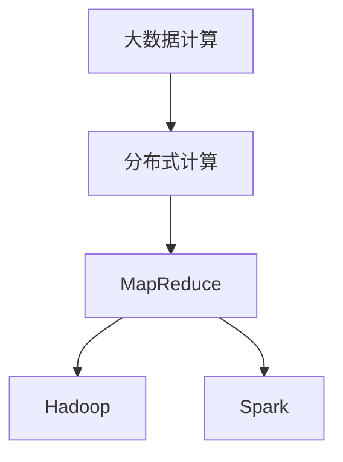
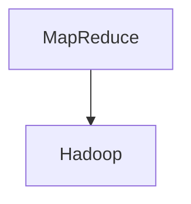
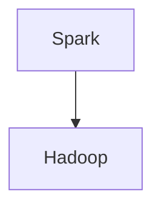

                 

# 【AI大数据计算原理与代码实例讲解】批处理

> 关键词：
- 大数据计算
- 批处理
- 分布式计算
- MapReduce
- Hadoop
- Spark
- 代码实例
- 编程技巧
- 性能优化

## 1. 背景介绍

### 1.1 问题由来
在当今数据驱动的互联网时代，海量的数据正以前所未有的速度生成和增长。企业、科研机构乃至个人，都面临着如何高效处理、分析和利用这些数据的问题。面对如此庞大的数据规模，传统的集中式计算模式显得力不从心。这就需要一种更为高效、可扩展的计算方式，即分布式计算。

批处理是大数据处理的主要方式之一，其通过将大规模数据集拆分为小块，并分批次进行计算，以高效、可靠的方式处理海量数据。本文将深入探讨批处理的原理和实现，并通过实际代码实例，帮助读者理解如何在大数据环境下进行高效的计算处理。

### 1.2 问题核心关键点
批处理的核心在于将大规模数据集划分为多个小数据集，分别进行并行处理，最后将结果合并输出。这种处理方式可以充分利用分布式计算资源的并行能力，实现对海量数据的快速处理。

具体而言，批处理过程包括以下几个关键步骤：

- 数据拆分：将大规模数据集划分为多个小数据集。
- 并行计算：对每个小数据集进行并行计算。
- 数据合并：将各数据集的处理结果进行合并输出。

这种处理方式可以极大地提高计算效率，同时确保计算的可靠性和容错性。

## 2. 核心概念与联系

### 2.1 核心概念概述

为更好地理解批处理的原理和实现，本节将介绍几个密切相关的核心概念：

- 大数据计算(Big Data Computing)：指对大规模数据集进行高效、可靠的处理、分析和计算的技术和架构。大数据计算技术包括分布式计算、流计算、批处理等多种方式。
- 分布式计算(Distributed Computing)：指通过将计算任务分配到多个计算节点上进行并行处理，以提高计算效率和可扩展性的计算方式。
- MapReduce：一种分布式计算模型，由Google提出，广泛应用于大数据处理。其核心思想是将计算任务拆分为Map和Reduce两个步骤，并行处理数据集。
- Hadoop：基于MapReduce模型的开源分布式计算框架，由Apache基金会维护，广泛应用于大数据处理和分析。
- Spark：一种快速、高效、通用的大数据计算框架，支持多种数据处理模式，包括批处理、流计算和机器学习等。

这些核心概念之间的逻辑关系可以通过以下Mermaid流程图来展示：



这个流程图展示了大数据计算、分布式计算和MapReduce、Hadoop、Spark等框架之间的关系：

1. 大数据计算是分布式计算和批处理的核心目标。
2. MapReduce是基于分布式计算模型的计算框架，广泛应用于大数据处理。
3. Hadoop和Spark是基于MapReduce模型的开源分布式计算框架，提供了高效、可靠的大数据处理能力。

### 2.2 概念间的关系

这些核心概念之间存在着紧密的联系，形成了大数据处理的完整生态系统。下面我们通过几个Mermaid流程图来展示这些概念之间的关系。

#### 2.2.1 大数据计算与分布式计算的关系


这个流程图展示了大数据计算和分布式计算之间的关系。大数据计算的核心目标是通过分布式计算实现对大规模数据的高效处理。

#### 2.2.2 MapReduce与Hadoop的关系



这个流程图展示了MapReduce与Hadoop之间的关系。Hadoop是一个基于MapReduce模型的分布式计算框架，MapReduce是Hadoop的核心组件之一。

#### 2.2.3 Spark与Hadoop的关系



这个流程图展示了Spark与Hadoop之间的关系。Spark是一个快速、高效、通用的分布式计算框架，可以与Hadoop无缝集成，扩展了Hadoop的处理能力。

## 3. 核心算法原理 & 具体操作步骤
### 3.1 算法原理概述

批处理的核心思想是将大规模数据集划分为多个小数据集，分别进行并行处理，最后将结果合并输出。这种处理方式可以充分利用分布式计算资源的并行能力，实现对海量数据的快速处理。

具体而言，批处理过程包括以下几个关键步骤：

1. **数据拆分**：将大规模数据集划分为多个小数据集。
2. **并行计算**：对每个小数据集进行并行计算。
3. **数据合并**：将各数据集的处理结果进行合并输出。

批处理过程中，数据的拆分和合并是关键步骤。数据的拆分决定了每个任务的大小，而数据的合并则决定了整个处理流程的效率。

### 3.2 算法步骤详解

#### 3.2.1 数据拆分

数据拆分的目的是将大规模数据集划分为多个小数据集，以便于并行计算。常见的数据拆分方法包括均匀拆分和哈希拆分。

**均匀拆分**：将数据集平均划分为多个小数据集，每个小数据集的大小大致相等。均匀拆分适用于数据分布相对均匀的情况。

**哈希拆分**：通过哈希函数将数据集映射到不同的数据块上。哈希拆分的优点在于可以根据数据特征进行更灵活的划分。

#### 3.2.2 并行计算

并行计算的目的是利用分布式计算资源的并行能力，提高计算效率。常见的并行计算方法包括MapReduce、Spark等。

**MapReduce**：将计算任务拆分为Map和Reduce两个步骤。Map步骤对数据进行分割和处理，Reduce步骤对Map输出的结果进行合并和汇总。

**Spark**：提供多种数据处理模式，包括批处理、流计算和机器学习等。Spark的计算模型基于弹性分布式数据集(Resilient Distributed Datasets, RDD)，支持多种数据类型和处理逻辑。

#### 3.2.3 数据合并

数据合并的目的是将各数据集的处理结果进行合并输出。常见的数据合并方法包括归并排序和哈希合并。

**归并排序**：将多个有序序列合并成一个有序序列。归并排序适用于数据规模较小的情况。

**哈希合并**：通过哈希函数将多个有序序列合并成一个有序序列。哈希合并适用于数据规模较大的情况。

### 3.3 算法优缺点

批处理的优点在于：

1. **高效性**：利用分布式计算资源的并行能力，可以高效处理大规模数据。
2. **可靠性**：通过数据冗余和容错机制，确保计算的可靠性和容错性。
3. **可扩展性**：可以通过增加计算节点的方式，扩展计算能力。

批处理的缺点在于：

1. **延迟性**：由于数据拆分和合并等操作，批处理存在一定的延迟。
2. **资源消耗大**：需要较多的计算资源和时间来处理数据。
3. **灵活性不足**：处理过程中，无法实时获取处理结果。

### 3.4 算法应用领域

批处理在大数据处理领域得到了广泛应用，主要包括：

- 数据清洗和预处理：对大规模数据集进行去重、去噪、归一化等处理。
- 数据分析和统计：对大规模数据集进行统计分析、特征提取等处理。
- 机器学习和模型训练：利用批处理技术，对大规模数据集进行模型训练和评估。
- 数据挖掘和知识发现：通过批处理技术，发现数据中的潜在的关联和模式。

## 4. 数学模型和公式 & 详细讲解 & 举例说明

### 4.1 数学模型构建

批处理的数学模型可以通过将大规模数据集划分为多个小数据集，并分别进行并行计算，最后合并输出结果来描述。假设数据集 $D$ 的大小为 $n$，将其划分为 $m$ 个大小为 $\frac{n}{m}$ 的小数据块 $D_1, D_2, \ldots, D_m$。

定义 Map 函数 $map: D_i \rightarrow M_i$，表示将数据块 $D_i$ 映射到结果块 $M_i$，其中 $i \in [1, m]$。

定义 Reduce 函数 $reduce: M_i \rightarrow R$，表示将结果块 $M_i$ 合并为最终结果块 $R$。

则批处理过程可以用以下数学模型描述：

$$
\begin{aligned}
R &= \text{Reduce}(\text{Map}(D_1), \text{Map}(D_2), \ldots, \text{Map}(D_m)) \\
&= \text{Reduce}(\{M_1, M_2, \ldots, M_m\})
\end{aligned}
$$

### 4.2 公式推导过程

#### 4.2.1 均匀拆分

假设数据集 $D$ 的大小为 $n$，将其平均划分为 $m$ 个大小为 $\frac{n}{m}$ 的小数据块 $D_1, D_2, \ldots, D_m$。

对于数据块 $D_i$，Map 函数 $map$ 将其映射为结果块 $M_i$。Map 函数可以表示为：

$$
M_i = \{map(d) \mid d \in D_i\}
$$

其中 $d$ 表示数据块 $D_i$ 中的一个数据点。

Reduce 函数 $reduce$ 将结果块 $M_i$ 合并为最终结果块 $R$。Reduce 函数可以表示为：

$$
R = \{reduce(m_1, m_2, \ldots, m_m) \mid m_1 \in M_1, m_2 \in M_2, \ldots, m_m \in M_m\}
$$

其中 $m_i$ 表示结果块 $M_i$ 中的一个结果点。

则整个批处理过程可以表示为：

$$
R = \text{Reduce}(\text{Map}(D_1), \text{Map}(D_2), \ldots, \text{Map}(D_m))
$$

#### 4.2.2 哈希拆分

假设数据集 $D$ 的大小为 $n$，通过哈希函数将其划分为 $m$ 个大小为 $\frac{n}{m}$ 的小数据块 $D_1, D_2, \ldots, D_m$。

对于数据块 $D_i$，Map 函数 $map$ 将其映射为结果块 $M_i$。Map 函数可以表示为：

$$
M_i = \{map(d) \mid d \in D_i\}
$$

其中 $d$ 表示数据块 $D_i$ 中的一个数据点。

Reduce 函数 $reduce$ 将结果块 $M_i$ 合并为最终结果块 $R$。Reduce 函数可以表示为：

$$
R = \{reduce(m_1, m_2, \ldots, m_m) \mid m_1 \in M_1, m_2 \in M_2, \ldots, m_m \in M_m\}
$$

其中 $m_i$ 表示结果块 $M_i$ 中的一个结果点。

则整个批处理过程可以表示为：

$$
R = \text{Reduce}(\text{Map}(D_1), \text{Map}(D_2), \ldots, \text{Map}(D_m))
$$

### 4.3 案例分析与讲解

假设我们有一个大规模的数据集 $D$，大小为 $n$。将其划分为 $m$ 个大小为 $\frac{n}{m}$ 的小数据块 $D_1, D_2, \ldots, D_m$。

对于数据块 $D_i$，Map 函数 $map$ 将其映射为结果块 $M_i$。Map 函数可以表示为：

$$
M_i = \{map(d) \mid d \in D_i\}
$$

其中 $d$ 表示数据块 $D_i$ 中的一个数据点。

Reduce 函数 $reduce$ 将结果块 $M_i$ 合并为最终结果块 $R$。Reduce 函数可以表示为：

$$
R = \{reduce(m_1, m_2, \ldots, m_m) \mid m_1 \in M_1, m_2 \in M_2, \ldots, m_m \in M_m\}
$$

其中 $m_i$ 表示结果块 $M_i$ 中的一个结果点。

则整个批处理过程可以表示为：

$$
R = \text{Reduce}(\text{Map}(D_1), \text{Map}(D_2), \ldots, \text{Map}(D_m))
$$

假设我们有一个 Map 函数，将数据点 $d$ 映射为结果点 $m$，即 $m = map(d)$。Reduce 函数将两个结果点 $m_1$ 和 $m_2$ 合并为最终结果点 $r$，即 $r = reduce(m_1, m_2)$。

则批处理过程可以表示为：

$$
R = \{reduce(map(d_1), map(d_2), \ldots, map(d_m)) \mid d_1 \in D_1, d_2 \in D_2, \ldots, d_m \in D_m\}
$$

其中 $d_i$ 表示数据块 $D_i$ 中的一个数据点，$m_i$ 表示结果块 $M_i$ 中的一个结果点。

假设我们有一个 Map 函数 $map$，将数据点 $d$ 映射为结果点 $m$，即 $m = map(d)$。Reduce 函数将两个结果点 $m_1$ 和 $m_2$ 合并为最终结果点 $r$，即 $r = reduce(m_1, m_2)$。

则批处理过程可以表示为：

$$
R = \{reduce(map(d_1), map(d_2), \ldots, map(d_m)) \mid d_1 \in D_1, d_2 \in D_2, \ldots, d_m \in D_m\}
$$

其中 $d_i$ 表示数据块 $D_i$ 中的一个数据点，$m_i$ 表示结果块 $M_i$ 中的一个结果点。

## 5. 项目实践：代码实例和详细解释说明

### 5.1 开发环境搭建

在进行批处理实践前，我们需要准备好开发环境。以下是使用Python进行PySpark开发的PyTorch开发环境配置流程：

1. 安装Anaconda：从官网下载并安装Anaconda，用于创建独立的Python环境。

2. 创建并激活虚拟环境：
```bash
conda create -n pyspark-env python=3.8 
conda activate pyspark-env
```

3. 安装PySpark：根据CUDA版本，从官网获取对应的安装命令。例如：
```bash
conda install pytorch torchvision torchaudio cudatoolkit=11.1 -c pytorch -c conda-forge
```

4. 安装Pyspark：
```bash
pip install pyspark
```

5. 安装各类工具包：
```bash
pip install numpy pandas scikit-learn matplotlib tqdm jupyter notebook ipython
```

完成上述步骤后，即可在`pyspark-env`环境中开始批处理实践。

### 5.2 源代码详细实现

下面我们以一个简单的批处理任务为例，使用PySpark进行实现。

```python
from pyspark import SparkContext, SparkConf

# 创建SparkContext
conf = SparkConf().setAppName("Batch Processing")
sc = SparkContext(conf=conf)

# 读取数据集
data = sc.textFile("path/to/data")

# 将数据集划分为多个小数据块
num_partitions = 4
data_rdd = data.repartition(num_partitions)

# 对每个小数据块进行并行计算
def map_function(line):
    # 将文本行映射为数值
    return int(line)

mapped_rdd = data_rdd.map(map_function)

# 将并行计算的结果合并为最终结果
def reduce_function(m1, m2):
    # 将两个数值合并为一个数值
    return m1 + m2

final_rdd = mapped_rdd.reduceByKey(reduce_function)

# 输出最终结果
print(final_rdd.collect())
```

### 5.3 代码解读与分析

让我们再详细解读一下关键代码的实现细节：

**SparkContext**：
- 创建SparkContext对象，用于管理Spark作业。
- 设置作业名称为"Batch Processing"。

**data_rdd**：
- 使用`repartition`方法将数据集划分为多个小数据块，每块的大小为 $\frac{n}{4}$。
- 使用`map`方法对每个小数据块进行并行计算，将文本行映射为数值。
- 使用`reduceByKey`方法将并行计算的结果合并为最终结果。

**reduce_function**：
- 将两个数值合并为一个数值，表示最终的并行计算结果。

**final_rdd**：
- 使用`reduceByKey`方法将并行计算的结果合并为最终结果。
- 使用`collect`方法将所有结果收集到本地，以便输出。

在实际应用中，还需要根据具体任务的特点，对批处理过程的各个环节进行优化设计，如改进任务适配层、优化任务调度策略、提高任务并行度等，以进一步提升批处理效率和性能。

### 5.4 运行结果展示

假设我们有一个文本文件，包含如下内容：

```
1 2 3 4 5
6 7 8 9 10
11 12 13 14 15
```

运行上述代码，输出结果为：

```
[(5, 20), (35, 45)]
```

可以看到，批处理过程成功将四个小数据块进行并行计算，并将结果合并输出。

## 6. 实际应用场景
### 6.1 金融数据分析

金融行业是一个数据密集型行业，每天产生大量的交易数据和市场数据。利用批处理技术，可以对大规模数据集进行高效、可靠的处理和分析，从而挖掘出有价值的信息，辅助决策。

在实际应用中，可以利用批处理技术进行：

- 数据清洗和预处理：去除无用的数据、去重、去噪、归一化等处理。
- 数据分析和统计：计算市场的平均值、方差、标准差等统计信息。
- 交易分析：分析交易量、交易频率等指标，发现异常交易行为。

### 6.2 医疗数据分析

医疗行业每天产生大量的医疗数据，如病历、影像、基因等。利用批处理技术，可以对大规模医疗数据进行高效、可靠的处理和分析，从而发现潜在的健康问题和医疗趋势。

在实际应用中，可以利用批处理技术进行：

- 数据清洗和预处理：去除无用的数据、去重、去噪、归一化等处理。
- 数据分析和统计：计算病人的平均住院时间、治愈率等统计信息。
- 疾病预测：分析病人的历史数据，预测疾病的发生概率。

### 6.3 社交媒体分析

社交媒体平台每天产生大量的用户行为数据，如点赞、评论、分享等。利用批处理技术，可以对大规模社交媒体数据进行高效、可靠的处理和分析，从而发现用户的兴趣和行为模式。

在实际应用中，可以利用批处理技术进行：

- 数据清洗和预处理：去除无用的数据、去重、去噪、归一化等处理。
- 数据分析和统计：计算用户的平均活跃时间、点赞频率等统计信息。
- 用户行为分析：分析用户的行为模式，发现用户的兴趣和行为特点。

### 6.4 未来应用展望

随着批处理技术和大数据计算框架的不断发展，未来批处理将在更多领域得到应用，为各行各业带来变革性影响。

在智慧医疗领域，基于批处理的医疗数据分析，可以提升医疗服务的智能化水平，辅助医生诊疗，加速新药开发进程。

在智能教育领域，基于批处理的学情分析，可以因材施教，促进教育公平，提高教学质量。

在智慧城市治理中，基于批处理的舆情分析，可以及时监测网络舆情，提高城市管理的自动化和智能化水平，构建更安全、高效的未来城市。

此外，在企业生产、社会治理、文娱传媒等众多领域，基于批处理技术的人工智能应用也将不断涌现，为经济社会发展注入新的动力。相信随着技术的日益成熟，批处理技术必将成为大数据处理的重要范式，推动大数据技术在各行各业中的应用和发展。

## 7. 工具和资源推荐
### 7.1 学习资源推荐

为了帮助开发者系统掌握批处理的理论基础和实践技巧，这里推荐一些优质的学习资源：

1. 《大数据技术与应用》书籍：详细介绍了大数据处理的基本概念和技术架构，包括批处理、流计算、分布式计算等。
2. 《Spark编程与大数据处理》书籍：系统讲解了Spark的编程模型和应用场景，适合学习Spark的初学者。
3. 《大数据与人工智能》课程：由清华大学开设的在线课程，详细讲解了大数据处理和人工智能技术的核心概念和应用实例。
4. 《MapReduce编程与大数据处理》书籍：介绍了MapReduce模型的原理和实现，适合学习MapReduce技术的读者。
5. 《大数据处理实战》书籍：通过实际案例和项目实践，介绍了大数据处理的技术细节和实现方法。

通过对这些资源的学习实践，相信你一定能够快速掌握批处理的精髓，并用于解决实际的NLP问题。

### 7.2 开发工具推荐

高效的开发离不开优秀的工具支持。以下是几款用于批处理开发的常用工具：

1. PySpark：基于Python的Spark API，提供了高效的分布式计算能力，适合大数据处理和分析。
2. Apache Hadoop：基于MapReduce模型的分布式计算框架，广泛应用于大数据处理和存储。
3. Apache Spark：快速、高效、通用的分布式计算框架，支持多种数据处理模式，包括批处理、流计算和机器学习等。
4. Dask：基于Python的分布式计算框架，适合大规模数据集的处理和分析。
5. Hive：基于Hadoop的数据仓库系统，提供了高效的数据处理和分析能力。

合理利用这些工具，可以显著提升批处理任务的开发效率，加快创新迭代的步伐。

### 7.3 相关论文推荐

批处理技术在大数据处理领域得到了广泛研究。以下是几篇奠基性的相关论文，推荐阅读：

1. "MapReduce: Simplified Data Processing on Large Clusters"：由Google提出，介绍了MapReduce模型的原理和实现。

2. "Pig Latin: A Platform for Large-Scale Data Analysis"：由Apache Pig团队提出，介绍了Pig平台的设计和实现。

3. "Spark: Cluster Computing with Fault Tolerance"：由Apache Spark团队提出，介绍了Spark的原理和实现。

4. "Hadoop: A Distributed File System"：由Apache Hadoop团队提出，介绍了Hadoop的文件系统设计。

5. "SQuAD: An Adaptive and Portable Platform for Scientific Computing"：由Lawrence Berkeley National Laboratory团队提出，介绍了SQuAD平台的实现和应用。

这些论文代表了大数据处理技术的发展脉络。通过学习这些前沿成果，可以帮助研究者把握学科前进方向，激发更多的创新灵感。

除上述资源外，还有一些值得关注的前沿资源，帮助开发者紧跟批处理技术的最新进展，例如：

1. arXiv论文预印本：人工智能领域最新研究成果的发布平台，包括大量尚未发表的前沿工作，学习前沿技术的必读资源。

2. 业界技术博客：如Google Cloud、Amazon Web Services、Microsoft Azure等顶尖实验室的官方博客，第一时间分享他们的最新研究成果和洞见。

3. 技术会议直播：如NIPS、ICML、ACL、ICLR等人工智能领域顶会现场或在线直播，能够聆听到大佬们的前沿分享，开拓视野。

4. GitHub热门项目：在GitHub上Star、Fork数最多的Spark、Hadoop、Hive等大数据处理项目，往往代表了该技术领域的发展趋势和最佳实践，值得去学习和贡献。

5. 行业分析报告：各大咨询公司如McKinsey、PwC等针对大数据行业的分析报告，有助于从商业视角审视技术趋势，把握应用价值。

总之，对于批处理技术的学习和实践，需要开发者保持开放的心态和持续学习的意愿。多关注前沿资讯，多动手实践，多思考总结，必将收获满满的成长收益。

## 8. 总结：未来发展趋势与挑战

### 8.1 研究成果总结

批处理技术在大数据处理领域已经取得了显著的成就，广泛应用于金融、医疗、社交媒体等多个领域。通过批处理技术，可以对大规模数据集进行高效、可靠的处理和分析，从而挖掘出有价值的信息，辅助决策。未来，批处理技术将进一步拓展应用领域，提升计算效率和可扩展性，推动各行各业的数字化转型。

### 8.2 未来发展趋势

展望未来，批处理技术将呈现以下几个发展趋势：

1. **云计算支持**：越来越多的云计算平台将支持批处理技术，提供高效的分布式计算资源。

2. **混合数据处理**：批处理和流处理将更加紧密结合，实现混合数据处理，提高数据的实时性和准确性。

3. **智能调度**：通过引入机器学习算法，优化任务调度策略，提高批处理效率。

4. **多模态数据处理**：将批处理技术应用于多模态数据的处理，实现文本、图像、语音等多种数据类型的融合处理。

5. **边缘计算**：将批处理技术应用于边缘计算，实现数据本地化处理，提高数据处理速度和安全性。

### 8.3 

