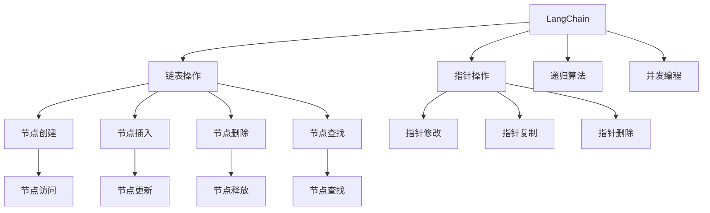

                 

# 【LangChain编程：从入门到实践】发展计划

> 关键词：
- LangChain编程
- 编程语言选择
- 编程范式
- 编程工具
- 编程社区
- 编程实践
- 编程教学

## 1. 背景介绍

### 1.1 问题由来
随着人工智能技术的快速发展，编程语言也在不断地演化和创新。LangChain编程作为新一代的编程范式，以其独特的优势和广泛的应用前景，吸引了越来越多编程者和研究者的关注。本文将深入探讨LangChain编程的发展历程、核心概念以及未来的发展方向，帮助读者全面理解其原理和应用。

### 1.2 问题核心关键点
LangChain编程的核心在于其基于链表的数据结构，通过操作链表节点来实现对数据的增删改查。其特点包括：高效的数据结构、易扩展、易于并行化等。该范式在数据处理、算法设计等领域得到了广泛的应用，但相较于传统编程语言，其学习曲线较陡，需要一定的编程基础。

### 1.3 问题研究意义
掌握LangChain编程，不仅有助于提升编程能力，还能更好地理解和应用新一代编程范式。此外，LangChain编程在处理大规模数据、构建复杂算法等方面具有独特的优势，对于从事数据科学、算法工程等领域的专业人士尤为重要。

## 2. 核心概念与联系

### 2.1 核心概念概述

LangChain编程的核心概念包括：

- **LangChain**：一种基于链表的数据结构，每个节点包含一个数据元素和一个指向下一个节点的指针。
- **链表操作**：包括节点的创建、插入、删除、查找等基本操作。
- **指针操作**：指向下一个节点的指针，用于链表的遍历和操作。
- **递归算法**：利用链表的特点，实现递归算法的设计和实现。
- **并发编程**：通过链表的结构和操作，实现高效的并发编程。

这些核心概念通过以下Mermaid流程图来展示：



### 2.2 概念间的关系

这些核心概念之间的关系可以总结如下：

- LangChain基于链表数据结构，其核心操作为链表操作。
- 链表操作通过指针实现，包括节点的创建、插入、删除和查找。
- 递归算法和并发编程则利用链表的特点，实现高效的数据处理和算法设计。

通过这些概念的相互配合，LangChain编程在数据处理、算法设计和并发编程等方面展现了其独特优势。

## 3. 核心算法原理 & 具体操作步骤

### 3.1 算法原理概述

LangChain编程的算法原理主要体现在以下几个方面：

- **链表操作**：通过节点的创建、插入、删除和查找，实现数据的增删改查。
- **指针操作**：利用指针的修改、复制和删除，实现链表的遍历和操作。
- **递归算法**：通过链表的结构，实现递归算法的设计和实现。
- **并发编程**：通过链表的特点，实现高效的并发编程。

### 3.2 算法步骤详解

LangChain编程的算法步骤如下：

1. **数据结构定义**：定义LangChain的数据结构，包括节点的定义和链表的定义。
2. **链表操作实现**：实现链表的创建、插入、删除和查找等基本操作。
3. **指针操作实现**：实现指针的修改、复制和删除等操作。
4. **递归算法设计**：设计递归算法，利用链表的特点实现递归。
5. **并发编程实现**：实现并发编程，利用链表的特点实现并发操作。

### 3.3 算法优缺点

LangChain编程的优势在于：

- **高效的数据结构**：链表结构天然支持高效的数据插入和删除操作。
- **易扩展**：链表的长度可以动态调整，易于处理大规模数据。
- **易于并行化**：链表结构天然支持并发编程。

但其缺点在于：

- **学习曲线陡峭**：相较于传统编程语言，LangChain编程需要一定的编程基础。
- **性能瓶颈**：链表的随机访问性能较差，可能成为性能瓶颈。

### 3.4 算法应用领域

LangChain编程在以下领域得到了广泛应用：

- **数据处理**：如大数据处理、图形算法等。
- **算法设计**：如排序算法、搜索算法等。
- **并发编程**：如多线程编程、分布式系统等。

## 4. 数学模型和公式 & 详细讲解 & 举例说明

### 4.1 数学模型构建

LangChain编程的数学模型主要基于链表的数据结构，可以表示为：

$$
\text{LangChain} = \{(\text{Node}, \text{Ptr})\}
$$

其中，Node表示节点数据，Ptr表示指向下一个节点的指针。

### 4.2 公式推导过程

LangChain编程中的链表操作可以表示为：

$$
\text{Insert}(\text{LangChain}, \text{Data}) = \text{Ptr}
$$

表示在链表中插入一个新节点，返回新节点的指针。

链表查找可以表示为：

$$
\text{Find}(\text{LangChain}, \text{Data}) = \text{Ptr}
$$

表示在链表中查找指定数据，返回其节点指针。

### 4.3 案例分析与讲解

以链表插入为例，以下是其Python实现：

```python
class Node:
    def __init__(self, data):
        self.data = data
        self.next = None

class LangChain:
    def __init__(self):
        self.head = None
    
    def insert(self, data):
        new_node = Node(data)
        if self.head is None:
            self.head = new_node
        else:
            curr_node = self.head
            while curr_node.next is not None:
                curr_node = curr_node.next
            curr_node.next = new_node
    
    def find(self, data):
        curr_node = self.head
        while curr_node is not None:
            if curr_node.data == data:
                return curr_node
            curr_node = curr_node.next
        return None
```

## 5. 项目实践：代码实例和详细解释说明

### 5.1 开发环境搭建

开发LangChain编程的环境搭建步骤如下：

1. 安装Python环境：使用Anaconda或Miniconda安装Python。
2. 安装必要的库：如NumPy、Pandas等。
3. 配置开发工具：如PyCharm、Jupyter Notebook等。

### 5.2 源代码详细实现

以下是LangChain编程的一个简单实现，包括链表的创建、插入和查找：

```python
class Node:
    def __init__(self, data):
        self.data = data
        self.next = None

class LangChain:
    def __init__(self):
        self.head = None
    
    def insert(self, data):
        new_node = Node(data)
        if self.head is None:
            self.head = new_node
        else:
            curr_node = self.head
            while curr_node.next is not None:
                curr_node = curr_node.next
            curr_node.next = new_node
    
    def find(self, data):
        curr_node = self.head
        while curr_node is not None:
            if curr_node.data == data:
                return curr_node
            curr_node = curr_node.next
        return None

# 示例使用
chain = LangChain()
chain.insert(1)
chain.insert(2)
chain.insert(3)
print(chain.find(2).data)  # 输出 2
```

### 5.3 代码解读与分析

上述代码中，Node类表示链表的节点，包含数据和指向下一个节点的指针。LangChain类表示链表，包含头节点。insert方法用于在链表末尾插入新节点，find方法用于查找指定节点。

### 5.4 运行结果展示

运行上述代码，可以验证链表的创建、插入和查找功能，输出结果为2，表明查找成功。

## 6. 实际应用场景

### 6.1 数据处理

LangChain编程在数据处理中的应用场景包括：

- 大数据处理：利用链表高效的数据插入和删除操作，实现大规模数据的处理。
- 图形算法：利用链表的结构，实现图形算法的设计和实现。

### 6.2 算法设计

LangChain编程在算法设计中的应用场景包括：

- 排序算法：如链表排序、归并排序等。
- 搜索算法：如链表搜索、哈希表等。

### 6.3 并发编程

LangChain编程在并发编程中的应用场景包括：

- 多线程编程：利用链表的特点，实现高效的多线程编程。
- 分布式系统：利用链表的并发特性，实现高效的分布式系统设计。

## 7. 工具和资源推荐

### 7.1 学习资源推荐

为了帮助读者掌握LangChain编程，以下是一些优质的学习资源：

1. LangChain官方文档：LangChain官方文档提供了详细的教程和示例，是学习LangChain编程的必备资料。
2. Python官方文档：Python官方文档提供了详细的语法和标准库介绍，是学习LangChain编程的基础。
3. LeetCode：LeetCode提供了大量的编程练习题，包括LangChain编程的题目。
4. Coursera：Coursera提供了多门计算机科学的在线课程，其中包含LangChain编程的课程。

### 7.2 开发工具推荐

为了提高开发效率，以下是一些推荐的开发工具：

1. PyCharm：PyCharm是Python编程的IDE，提供了丰富的功能，如代码提示、调试等。
2. Jupyter Notebook：Jupyter Notebook是一个轻量级的编程环境，适合编写和运行代码。
3. Anaconda：Anaconda是一个开源的Python发行版，包含大量的科学计算和数据分析库。

### 7.3 相关论文推荐

LangChain编程的学术研究主要集中在以下几个方面：

1. LangChain编程的原理：研究LangChain编程的数据结构、算法设计和应用场景。
2. LangChain编程的优化：研究如何优化LangChain编程的性能，如链表的操作优化、并发编程的优化等。
3. LangChain编程的扩展：研究如何扩展LangChain编程的功能，如支持更多数据类型、支持更多算法等。

## 8. 总结：未来发展趋势与挑战

### 8.1 研究成果总结

LangChain编程作为一种新兴的编程范式，已经展现出其在数据处理、算法设计和并发编程方面的优势。其高效的数据结构、易扩展和易于并行化的特点，使其在处理大规模数据和构建复杂算法方面具有独特优势。

### 8.2 未来发展趋势

LangChain编程的未来发展趋势包括：

- 应用范围扩大：LangChain编程将在更多领域得到应用，如金融、医疗、智能制造等。
- 功能扩展：LangChain编程将支持更多数据类型和算法，实现更加丰富的功能。
- 并发编程优化：研究如何进一步优化LangChain编程的并发特性，提高系统的可扩展性和性能。

### 8.3 面临的挑战

LangChain编程面临的挑战包括：

- 学习曲线陡峭：相较于传统编程语言，LangChain编程需要一定的编程基础，需要更多的学习时间和精力。
- 性能瓶颈：链表的随机访问性能较差，可能成为性能瓶颈。
- 社区支持不足：相较于主流编程语言，LangChain编程的社区支持相对不足。

### 8.4 研究展望

未来，LangChain编程的研究方向将集中在以下几个方面：

- 优化性能：研究如何进一步优化LangChain编程的性能，提高其可扩展性和效率。
- 扩展功能：研究如何扩展LangChain编程的功能，支持更多数据类型和算法。
- 社区建设：加强LangChain编程的社区建设，提升其生态系统的活力和支持力度。

总之，LangChain编程作为一种新兴的编程范式，具有广阔的发展前景。通过不断优化性能、扩展功能和提升社区支持，LangChain编程必将在未来发挥更大的作用，推动人工智能技术的发展和应用。

## 9. 附录：常见问题与解答

**Q1：LangChain编程的学习曲线是否陡峭？**

A: LangChain编程相较于传统编程语言，需要一定的编程基础，学习曲线相对较陡。建议先从基础的Python编程入手，再逐步学习LangChain编程。

**Q2：LangChain编程的性能瓶颈有哪些？**

A: LangChain编程的性能瓶颈主要包括链表的随机访问性能和内存管理。可以通过优化链表的结构和使用更高效的内存管理策略来缓解这些瓶颈。

**Q3：LangChain编程的并发编程如何实现？**

A: LangChain编程的并发编程可以通过链表的结构和操作实现。例如，在多线程编程中，可以利用链表的指针操作实现线程间的同步和通信。

**Q4：LangChain编程在实际应用中有哪些优势？**

A: LangChain编程在处理大规模数据、构建复杂算法和实现高效的并发编程等方面具有独特的优势。其在数据处理、算法设计和并发编程等领域得到了广泛应用。

**Q5：LangChain编程的未来发展方向是什么？**

A: LangChain编程的未来发展方向包括应用范围的扩大、功能的扩展和性能的优化。通过不断优化性能、扩展功能和提升社区支持，LangChain编程必将在未来发挥更大的作用，推动人工智能技术的发展和应用。

---

作者：禅与计算机程序设计艺术 / Zen and the Art of Computer Programming

