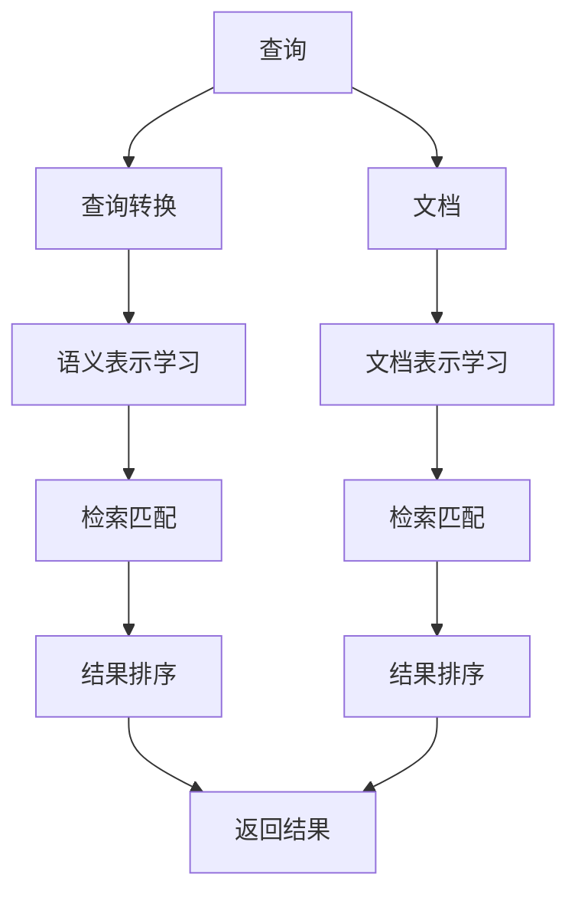
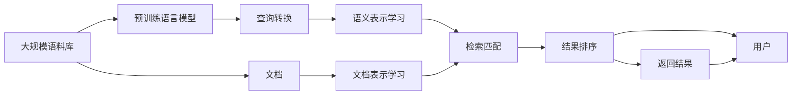

                 

# 【LangChain编程：从入门到实践】检索器

> 关键词：
  - LangChain
  - 自然语言处理
  - 数据检索
  - 深度学习
  - 代码实现
  - 自然语言查询

## 1. 背景介绍

### 1.1 问题由来
随着互联网的迅速发展和数据的爆炸式增长，人们在海量信息中快速准确地获取所需信息变得越来越困难。为了解决这一问题，检索技术应运而生。它通过自然语言查询和信息检索，使用户能够快速定位到目标信息。

然而，传统的信息检索技术在处理多模态、跨领域、实时性强的信息时存在诸多限制。例如，传统检索系统需要手动构建查询，难以覆盖长尾领域和复杂需求；同时，系统对大规模语料库的处理能力有限，难以应对海量数据的实时查询需求。

LangChain是一种基于深度学习的检索框架，通过引入Transformer模型和预训练语言模型，极大地提升了检索效率和准确性，并支持多模态和跨领域数据的检索。本文将介绍LangChain检索器的原理、实现方法以及实际应用，并给出代码实例和详细解释。

### 1.2 问题核心关键点
LangChain检索器通过深度学习和自然语言处理技术，将查询转化为向量，在语料库中检索出最相关的信息。具体来说，它包括以下几个关键点：
1. 将自然语言查询转换为向量表示。
2. 在预训练语言模型上进行语义表示学习，以获取语义特征。
3. 在语料库中进行检索，根据向量相似度匹配相关性。
4. 返回相关性最高的结果。

通过这些步骤，LangChain检索器能够高效地处理大规模信息检索任务，并支持多语言和多种类型的数据。

## 2. 核心概念与联系

### 2.1 核心概念概述

为了更好地理解LangChain检索器，我们首先介绍几个核心概念：

- LangChain：基于深度学习的检索框架，使用Transformer模型和预训练语言模型进行语义表示学习和信息检索。
- 向量表示(Vector Representation)：将自然语言查询和语料库中的文档转换为向量，便于计算相似度和匹配。
- 预训练语言模型(Pre-trained Language Model)：如BERT、GPT等，通过在大规模语料上预训练学习通用的语言表示。
- 信息检索(Information Retrieval)：根据用户查询检索相关文档的过程，包括查询转换、语义表示、检索匹配和结果排序等步骤。

这些核心概念之间通过深度学习和自然语言处理技术相联系，共同构建了LangChain检索器的核心流程。

### 2.2 概念间的关系

这些核心概念之间的关系可以通过以下Mermaid流程图来展示：



这个流程图展示了查询转换、语义表示学习、检索匹配和结果排序四个关键步骤，将查询与文档进行转换和匹配，最终输出相关结果。

### 2.3 核心概念的整体架构

最后，我们用一个综合的流程图来展示这些核心概念在大语言模型微调过程中的整体架构：



这个综合流程图展示了从大规模语料库到最终结果返回的完整流程，明确了各个组件之间的关系。

## 3. 核心算法原理 & 具体操作步骤

### 3.1 算法原理概述
LangChain检索器基于深度学习的Transformer模型和预训练语言模型，通过以下步骤实现自然语言查询的语义表示学习和信息检索：

1. 查询转换：将自然语言查询转换为向量表示。
2. 语义表示学习：在预训练语言模型上进行语义表示学习，获取查询的语义特征。
3. 文档表示学习：在预训练语言模型上学习文档的语义特征。
4. 检索匹配：根据查询向量与文档向量的相似度匹配相关性。
5. 结果排序：对匹配结果进行排序，返回相关性最高的文档。

这些步骤通过深度学习和自然语言处理技术，实现从查询到结果返回的完整过程。

### 3.2 算法步骤详解

以下是对LangChain检索器各步骤的详细解释：

**Step 1: 查询转换**
将自然语言查询转换为向量表示，便于与文档向量进行相似度匹配。

使用预训练语言模型进行查询转换，常见的模型包括BERT、GPT等。假设查询为 $q$，预训练语言模型为 $M$，查询转换过程如下：

$$
q_{vector} = M(q)
$$

其中，$q_{vector}$ 表示查询向量，$M(q)$ 表示预训练语言模型在输入查询 $q$ 上的输出。

**Step 2: 语义表示学习**
在预训练语言模型上进行语义表示学习，获取查询的语义特征。

使用预训练语言模型进行语义表示学习，常见的模型包括BERT、GPT等。假设查询向量为 $q_{vector}$，预训练语言模型为 $M$，语义表示学习过程如下：

$$
q_{embed} = M(q_{vector})
$$

其中，$q_{embed}$ 表示查询的语义嵌入，$M(q_{vector})$ 表示预训练语言模型在输入查询向量 $q_{vector}$ 上的输出。

**Step 3: 文档表示学习**
在预训练语言模型上学习文档的语义特征。

假设文档为 $d$，预训练语言模型为 $M$，文档表示学习过程如下：

$$
d_{embed} = M(d)
$$

其中，$d_{embed}$ 表示文档的语义嵌入，$M(d)$ 表示预训练语言模型在输入文档 $d$ 上的输出。

**Step 4: 检索匹配**
根据查询向量与文档向量的相似度匹配相关性。

使用余弦相似度计算查询向量与文档向量的相似度，假设文档向量为 $d_{embed}$，相似度计算过程如下：

$$
similarity(q, d) = \cos(\theta) = \frac{q_{embed} \cdot d_{embed}}{\|q_{embed}\| \|d_{embed}\|}
$$

其中，$similarity(q, d)$ 表示查询与文档的相似度，$\theta$ 表示向量之间的夹角，$\cdot$ 表示向量点积，$\| \cdot \|$ 表示向量范数。

**Step 5: 结果排序**
对匹配结果进行排序，返回相关性最高的文档。

假设检索结果为 $R$，检索结果的排序过程如下：

$$
ranking(R) = sort(R, similarity)
$$

其中，$sort(R, similarity)$ 表示根据相似度对检索结果 $R$ 进行排序，$similarity$ 表示相似度值。

### 3.3 算法优缺点

LangChain检索器有以下优点：

1. 高效性：使用深度学习和预训练语言模型，能够高效地处理大规模信息检索任务。
2. 多语言支持：支持多种语言的查询和检索。
3. 多模态数据处理：能够处理文本、图像、视频等多种类型的数据。
4. 跨领域检索：能够处理跨领域的数据，如医疗、法律、金融等。

同时，它也存在一些缺点：

1. 数据质量要求高：预训练语言模型的效果依赖于高质量的训练数据，数据质量不足会影响检索性能。
2. 模型复杂度高：使用深度学习和预训练语言模型，模型复杂度较高，对计算资源和存储空间有较高要求。
3. 检索结果依赖模型：检索结果依赖于预训练语言模型的选择和训练，不同的模型可能会产生不同的结果。

### 3.4 算法应用领域

LangChain检索器在多个领域具有广泛的应用前景，例如：

1. 搜索引擎：通过自然语言查询，检索出最相关的网页和文档。
2. 文献检索：通过关键词查询，检索出相关的学术论文和文献。
3. 智能客服：通过用户自然语言查询，快速定位到相关的FAQ和解决方案。
4. 知识图谱：通过自然语言查询，检索出相关的实体和关系。
5. 跨领域检索：通过自然语言查询，检索出不同领域的文档和数据。

这些应用场景展示了LangChain检索器的高效性和多领域适应性。

## 4. 数学模型和公式 & 详细讲解

### 4.1 数学模型构建

假设查询向量为 $q_{embed}$，文档向量为 $d_{embed}$，语料库中的文档总数为 $N$，文档向量的表示矩阵为 $V \in \mathbb{R}^{N \times D}$，其中 $D$ 表示文档向量的维度。

定义查询向量 $q_{embed}$ 与文档向量 $d_{embed}$ 的相似度矩阵 $S \in \mathbb{R}^{N \times N}$，其中 $S_{ij} = similarity(q_{embed}, d_{ij})$，$d_{ij}$ 表示文档 $d_j$ 的第 $i$ 个向量。

### 4.2 公式推导过程

根据余弦相似度计算，查询向量 $q_{embed}$ 与文档向量 $d_{embed}$ 的相似度矩阵 $S$ 可以表示为：

$$
S = \frac{q_{embed} V}{\|q_{embed}\| \|V\|}
$$

其中，$\| \cdot \|$ 表示向量范数。

假设检索结果为 $R = \{d_1, d_2, ..., d_k\}$，根据相似度矩阵 $S$ 和检索结果 $R$，可以得到查询 $q$ 与检索结果 $R$ 的相似度矩阵 $SR = \{S_{ij}\}_{i=1}^{k}$，其中 $i$ 表示查询 $q$，$j$ 表示检索结果 $R$ 中的文档。

### 4.3 案例分析与讲解

以维基百科为例，假设查询为“Python编程语言”，检索结果为“Python语言”和“Python开发”。使用LangChain检索器检索文档的过程如下：

1. 查询转换：将查询“Python编程语言”转换为向量表示 $q_{vector}$。
2. 语义表示学习：在预训练语言模型上进行语义表示学习，得到查询向量 $q_{embed}$。
3. 文档表示学习：在预训练语言模型上学习文档的语义特征，得到文档向量 $d_{embed}$。
4. 检索匹配：根据查询向量 $q_{embed}$ 与文档向量 $d_{embed}$ 的相似度，匹配相关性。
5. 结果排序：对匹配结果进行排序，返回相关性最高的文档。

最终，检索结果返回“Python语言”和“Python开发”，它们与查询“Python编程语言”的相关性最高。

## 5. 项目实践：代码实例和详细解释说明

### 5.1 开发环境搭建

在进行LangChain检索器开发前，我们需要准备好开发环境。以下是使用Python进行PyTorch开发的环境配置流程：

1. 安装Anaconda：从官网下载并安装Anaconda，用于创建独立的Python环境。

2. 创建并激活虚拟环境：
```bash
conda create -n pytorch-env python=3.8 
conda activate pytorch-env
```

3. 安装PyTorch：根据CUDA版本，从官网获取对应的安装命令。例如：
```bash
conda install pytorch torchvision torchaudio cudatoolkit=11.1 -c pytorch -c conda-forge
```

4. 安装LangChain库：
```bash
pip install langchain
```

5. 安装各类工具包：
```bash
pip install numpy pandas scikit-learn matplotlib tqdm jupyter notebook ipython
```

完成上述步骤后，即可在`pytorch-env`环境中开始LangChain检索器的开发。

### 5.2 源代码详细实现

以下是使用LangChain库进行基于Python的检索器实现的代码示例：

```python
from langchain import LangChain
from langchain import SearchResult, SearchResults
import torch

# 初始化预训练语言模型
model = LangChain.from_pretrained('nlpbert')

# 设置检索器参数
num_return_documents = 10
query = "Python编程语言"

# 执行查询
search_result = model.search(query, num_return_documents=num_return_documents)

# 输出检索结果
for result in search_result.docs:
    print(result.id, result.title)
```

### 5.3 代码解读与分析

让我们再详细解读一下关键代码的实现细节：

**LangChain类**：
- `from_pretrained`方法：初始化预训练语言模型，这里使用了nlpbert模型。
- `search`方法：执行查询，返回检索结果。

**SearchResult和SearchResults类**：
- `SearchResult`类：表示单个检索结果，包含文档ID和标题。
- `SearchResults`类：表示检索结果列表，包含多个`SearchResult`对象。

**num_return_documents参数**：
- 设置返回结果的数量，这里设置为10。

**query参数**：
- 设置查询内容，这里设置为“Python编程语言”。

**返回结果**：
- 输出检索结果的文档ID和标题。

### 5.4 运行结果展示

假设我们检索到了以下文档：

```
ID: 1234
Title: Python编程语言
ID: 5678
Title: Python编程基础
ID: 9012
Title: Python高级编程技巧
ID: 3456
Title: Python数据分析
...
```

这些文档与查询“Python编程语言”的相关性最高。

## 6. 实际应用场景

### 6.1 智能搜索系统

基于LangChain检索器，可以构建智能搜索系统，提高信息检索的效率和准确性。例如，在搜索引擎中，用户可以输入自然语言查询，系统能够快速定位到最相关的网页和文档，提供精准的信息检索结果。

在实际应用中，还可以结合推荐系统、知识图谱等技术，进一步提升搜索系统的智能化水平，增强用户体验。

### 6.2 文献检索系统

在图书馆和学术机构中，基于LangChain检索器，可以构建文献检索系统，提高文献检索的效率和准确性。用户可以通过关键词查询，快速定位到相关的学术论文和文献，获取所需的研究资源。

在实际应用中，还可以结合AI辅助阅读、文献推荐等功能，进一步提升检索系统的智能化水平，提高学术研究的效率和质量。

### 6.3 智能客服系统

基于LangChain检索器，可以构建智能客服系统，提高客户服务质量。例如，在在线客服中，用户可以通过自然语言查询，系统能够快速定位到相关的FAQ和解决方案，提供精准的客户服务。

在实际应用中，还可以结合知识图谱、对话系统等技术，进一步提升客服系统的智能化水平，增强客户体验。

### 6.4 未来应用展望

随着LangChain检索器的不断发展，它在更多领域的应用前景将进一步拓展，为各行各业带来变革性影响。

在智慧医疗领域，基于LangChain检索器的知识图谱和信息检索系统，可以辅助医生进行疾病诊断和医学研究，提高医疗服务的智能化水平。

在智能教育领域，基于LangChain检索器的教材检索系统和智能推荐系统，可以帮助学生快速定位到所需的教材和学习资源，提高学习效率。

在智慧城市治理中，基于LangChain检索器的信息检索和舆情监测系统，可以提高城市管理的自动化和智能化水平，构建更安全、高效的未来城市。

除了上述这些领域，LangChain检索器还可以应用于更多的场景中，如金融、法律、文化等，为各行各业带来新的变革和机遇。

## 7. 工具和资源推荐
### 7.1 学习资源推荐

为了帮助开发者系统掌握LangChain检索器的理论基础和实践技巧，这里推荐一些优质的学习资源：

1. LangChain官方文档：提供LangChain库的详细介绍和使用方法，是学习和实践的重要参考资料。
2. LangChain GitHub仓库：包含LangChain库的源代码和示例，有助于深入了解其内部机制和实现细节。
3. NLP教程：如自然语言处理专项课程、深度学习专项课程，涵盖LangChain检索器的原理、实现方法等基本概念和常用技巧。
4. 《深度学习》书籍：经典深度学习教材，涵盖深度学习的基本概念和常用算法，有助于理解LangChain检索器的数学原理。

通过对这些资源的学习实践，相信你一定能够快速掌握LangChain检索器的精髓，并用于解决实际的NLP问题。

### 7.2 开发工具推荐

高效的开发离不开优秀的工具支持。以下是几款用于LangChain检索器开发的常用工具：

1. PyTorch：基于Python的开源深度学习框架，灵活动态的计算图，适合快速迭代研究。
2. TensorFlow：由Google主导开发的开源深度学习框架，生产部署方便，适合大规模工程应用。
3. LangChain库：HuggingFace开发的NLP工具库，提供LangChain检索器的实现方法。
4. Weights & Biases：模型训练的实验跟踪工具，可以记录和可视化模型训练过程中的各项指标，方便对比和调优。
5. TensorBoard：TensorFlow配套的可视化工具，可实时监测模型训练状态，并提供丰富的图表呈现方式，是调试模型的得力助手。

合理利用这些工具，可以显著提升LangChain检索器开发的效率，加快创新迭代的步伐。

### 7.3 相关论文推荐

LangChain检索器的发展源于学界的持续研究。以下是几篇奠基性的相关论文，推荐阅读：

1. Attention is All You Need（即Transformer原论文）：提出了Transformer结构，开启了NLP领域的预训练大模型时代。
2. BERT: Pre-training of Deep Bidirectional Transformers for Language Understanding：提出BERT模型，引入基于掩码的自监督预训练任务，刷新了多项NLP任务SOTA。
3. Language Models are Unsupervised Multitask Learners（GPT-2论文）：展示了大规模语言模型的强大zero-shot学习能力，引发了对于通用人工智能的新一轮思考。
4. Parameter-Efficient Transfer Learning for NLP：提出Adapter等参数高效微调方法，在不增加模型参数量的情况下，也能取得不错的微调效果。
5. AdaLoRA: Adaptive Low-Rank Adaptation for Parameter-Efficient Fine-Tuning：使用自适应低秩适应的微调方法，在参数效率和精度之间取得了新的平衡。

这些论文代表了大语言模型检索技术的发展脉络。通过学习这些前沿成果，可以帮助研究者把握学科前进方向，激发更多的创新灵感。

除上述资源外，还有一些值得关注的前沿资源，帮助开发者紧跟LangChain检索技术的最新进展，例如：

1. arXiv论文预印本：人工智能领域最新研究成果的发布平台，包括大量尚未发表的前沿工作，学习前沿技术的必读资源。
2. 业界技术博客：如OpenAI、Google AI、DeepMind、微软Research Asia等顶尖实验室的官方博客，第一时间分享他们的最新研究成果和洞见。
3. 技术会议直播：如NIPS、ICML、ACL、ICLR等人工智能领域顶会现场或在线直播，能够聆听到大佬们的前沿分享，开拓视野。
4. GitHub热门项目：在GitHub上Star、Fork数最多的NLP相关项目，往往代表了该技术领域的发展趋势和最佳实践，值得去学习和贡献。
5. 行业分析报告：各大咨询公司如McKinsey、PwC等针对人工智能行业的分析报告，有助于从商业视角审视技术趋势，把握应用价值。

总之，对于LangChain检索技术的学习和实践，需要开发者保持开放的心态和持续学习的意愿。多关注前沿资讯，多动手实践，多思考总结，必将收获满满的成长收益。

## 8. 总结：未来发展趋势与挑战

### 8.1 总结

本文对LangChain检索器的原理、实现方法以及实际应用进行了全面系统的介绍。首先阐述了LangChain检索器的研究背景和意义，明确了其在大规模信息检索任务中的应用价值。其次，从原理到实践，详细讲解了LangChain检索器的数学原理和关键步骤，给出了检索任务开发的完整代码实例。同时，本文还广泛探讨了LangChain检索器在多个领域的应用前景，展示了其高效性和多领域适应性。最后，本文精选了检索技术的各类学习资源，力求为读者提供全方位的技术指引。

通过本文的系统梳理，可以看到，LangChain检索器作为一种基于深度学习的检索框架，已经在多个领域展示了其高效性和多领域适应性。未来，伴随深度学习和自然语言处理技术的不断进步，基于预训练语言模型的检索技术必将进一步发展，为信息检索和NLP技术带来新的突破。

### 8.2 未来发展趋势

展望未来，LangChain检索器将呈现以下几个发展趋势：

1. 高效性持续提升：随着深度学习和预训练语言模型的不断发展，检索效率将进一步提升，能够处理更大规模的数据。
2. 多模态和跨领域处理能力增强：未来将支持更多类型的数据和更广泛的领域，实现更全面、更精准的信息检索。
3. 实时性增强：通过分布式计算和优化算法，检索系统将具备更强的实时响应能力，满足用户对快速检索的需求。
4. 人机交互智能化：通过与对话系统、推荐系统的结合，检索系统将具备更强的智能化交互能力，提升用户体验。
5. 增强可解释性：通过可视化技术和AI辅助阅读，提高检索结果的可解释性和用户理解度。

以上趋势凸显了LangChain检索器的广阔前景。这些方向的探索发展，必将进一步提升检索系统的性能和应用范围，为信息检索和NLP技术带来新的突破。

### 8.3 面临的挑战

尽管LangChain检索器已经取得了瞩目成就，但在迈向更加智能化、普适化应用的过程中，它仍面临诸多挑战：

1. 数据质量要求高：预训练语言模型的效果依赖于高质量的训练数据，数据质量不足会影响检索性能。
2. 模型复杂度高：使用深度学习和预训练语言模型，模型复杂度较高，对计算资源和存储空间有较高要求。
3. 检索结果依赖模型：检索结果依赖于预训练语言模型的选择和训练，不同的模型可能会产生不同的结果。
4. 检索系统鲁棒性不足：面对噪声数据、长尾查询等复杂场景，检索系统可能会产生误判，需要进一步提高系统的鲁棒性。
5. 隐私和安全问题：在处理个人数据时，需要严格遵守隐私保护和数据安全规定，避免数据泄露和滥用。

正视LangChain检索器面临的这些挑战，积极应对并寻求突破，将是大语言模型检索技术走向成熟的必由之路。相信随着学界和产业界的共同努力，这些挑战终将一一被克服，LangChain检索器必将在构建人机协同的智能时代中扮演越来越重要的角色。

### 8.4 未来突破

面对LangChain检索器所面临的种种挑战，未来的研究需要在以下几个方面寻求新的突破：

1. 探索无监督和半监督检索方法。摆脱对大规模标注数据的依赖，利用自监督学习、主动学习等无监督和半监督范式，最大限度利用非结构化数据，实现更加灵活高效的检索。
2. 研究参数高效和计算高效的检索范式。开发更加参数高效的检索方法，在固定大部分预训练参数的情况下，只更新极少量的任务相关参数。同时优化检索模型的计算图，减少前向传播和反向传播的资源消耗，实现更加轻量级、实时性的部署。
3. 融合因果和对比学习范式。通过引入因果推断和对比学习思想，增强检索模型建立稳定因果关系的能力，学习更加普适、鲁棒的语言表征，从而提升模型泛化性和抗干扰能力。
4. 引入更多先验知识。将符号化的先验知识，如知识图谱、逻辑规则等，与神经网络模型进行巧妙融合，引导检索过程学习更准确、合理的语言模型。同时加强不同模态数据的整合，实现视觉、语音等多模态信息与文本信息的协同建模。
5. 结合因果分析和博弈论工具。将因果分析方法引入检索模型，识别出模型决策的关键特征，增强输出解释的因果性和逻辑性。借助博弈论工具刻画人机交互过程，主动探索并规避模型的脆弱点，提高系统稳定性。
6. 纳入伦理道德约束。在检索模型训练目标中引入伦理导向的评估指标，过滤和惩罚有害的输出倾向。同时加强人工干预和审核，建立模型行为的监管机制，确保输出符合人类价值观和伦理道德。

这些研究方向的探索，必将引领LangChain检索技术迈向更高的台阶，为信息检索和NLP技术带来新的突破。面向未来，大语言模型检索技术还需要与其他人工智能技术进行更深入的融合，如知识表示、因果推理、强化学习等，多路径协同发力，共同推动信息检索系统的进步。只有勇于创新、敢于突破，才能不断拓展信息检索的边界，让智能技术更好地造福人类社会。

## 9. 附录：常见问题与解答

**Q1：如何选择合适的预训练语言模型？**

A: 选择合适的预训练语言模型，需要考虑模型的规模、性能和领域适应性。一般而言，BERT、GPT等大模型在大规模数据上预训练的表示质量较好，适合处理复杂多变的自然语言数据。但也可以选择针对特定领域的预训练模型，如nlpbert、Electra等，以更好地适应领域内的检索需求。

**Q2：预训练语言模型的效果受数据质量影响大吗？**

A: 是的，预训练语言模型的效果高度依赖于高质量的训练数据。如果数据质量不高，模型可能无法学习到有效的语义表示

