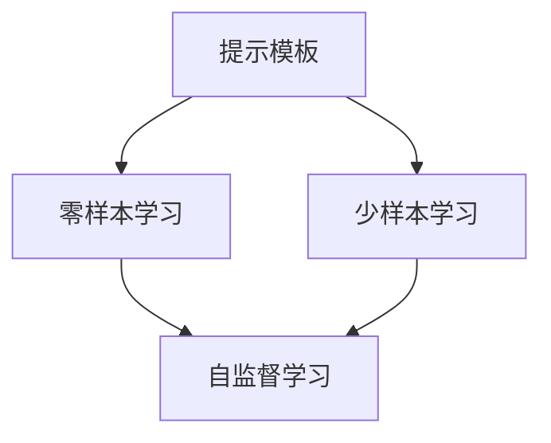
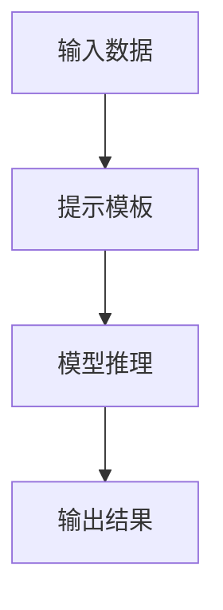
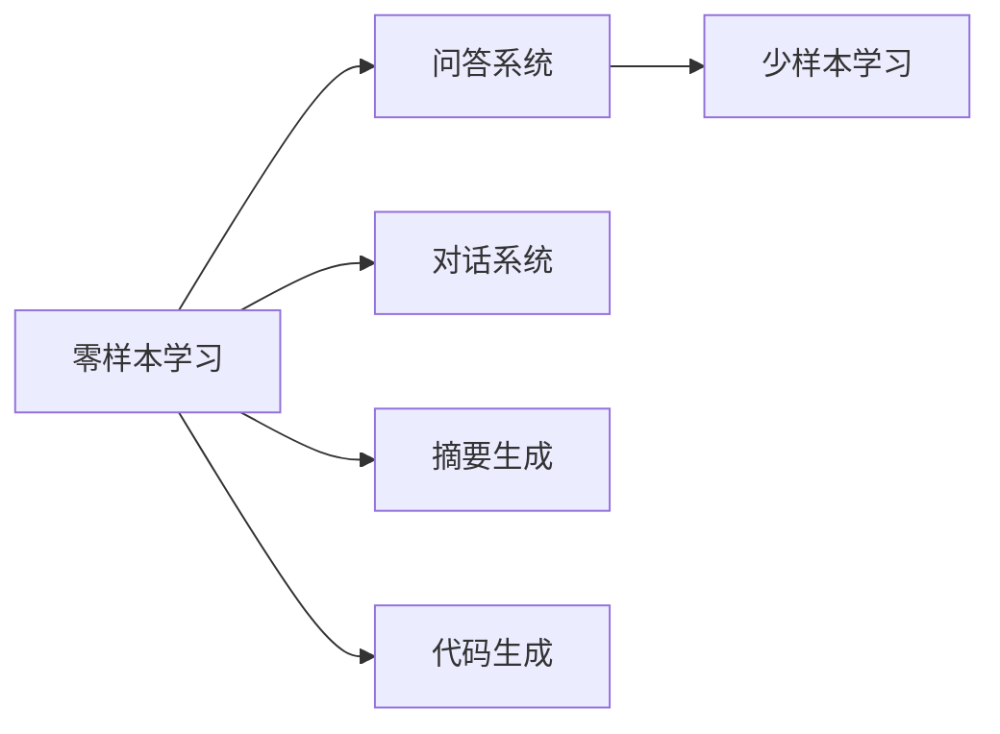
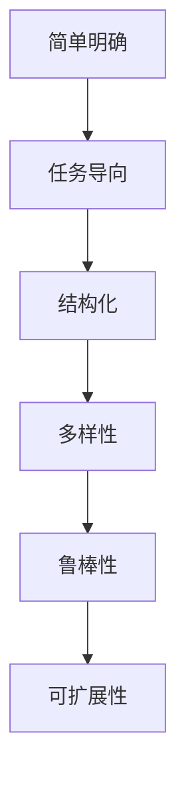
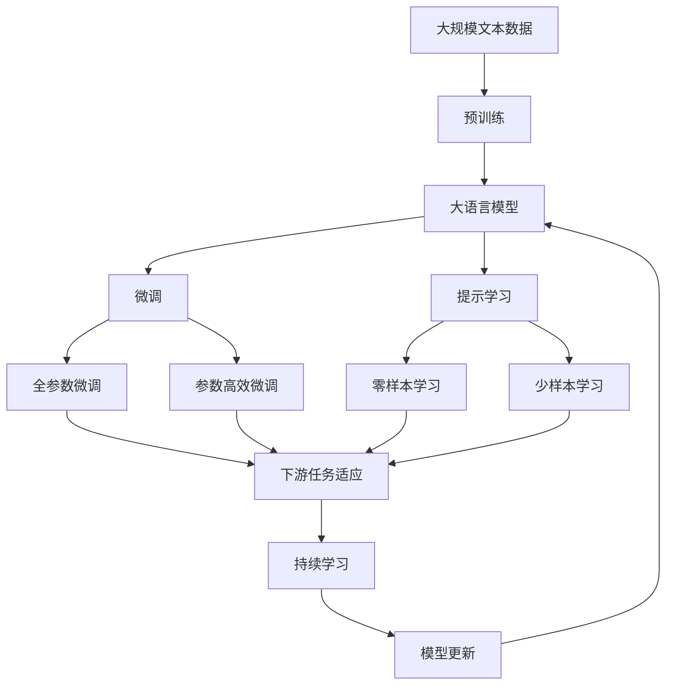

                 

# 【LangChain编程：从入门到实践】自定义提示模板

> 关键词：提示模板,自定义提示,Prompt Engineering,LangChain,对话系统,自然语言处理(NLP)

## 1. 背景介绍

### 1.1 问题由来

在自然语言处理(NLP)领域，尤其是对话系统、问答系统、机器翻译等任务中，预训练大语言模型（如GPT-3, T5等）表现出了强大的能力。然而，这些模型往往需要大量的标注数据进行微调，才能适应特定任务。由于标注数据获取成本高、周期长，限制了模型的广泛应用。

为了解决这个问题，研究人员提出了提示学习（Prompt Learning）方法。提示学习通过在输入中添加特定格式的文本，引导模型输出期望的结果，可以在不增加模型参数的情况下，实现对模型行为的微调和优化。

### 1.2 问题核心关键点

提示学习是一种通过精心设计输入模板来引导模型输出的技术。它可以在模型微调过程中，减少对大量标注数据的依赖，同时保持模型的泛化能力。具体来说，提示学习包括以下几个关键点：

- **输入设计**：通过精心设计的输入格式，使模型能够理解任务要求，输出正确的结果。
- **训练策略**：在微调过程中，逐步增加提示模板的复杂性，引导模型学习更加复杂的语言模式。
- **模型优化**：通过对抗性训练、正则化等手段，提高模型对提示的鲁棒性和泛化能力。

### 1.3 问题研究意义

提示学习技术在对话系统、问答系统、摘要生成、代码生成等任务中得到了广泛应用，取得了显著效果。它不仅降低了模型微调对标注数据的依赖，提高了模型训练的效率，还提升了模型的可解释性和灵活性，具有重要的研究价值和应用前景。

## 2. 核心概念与联系

### 2.1 核心概念概述

为了更好地理解提示学习，我们需要掌握以下几个核心概念：

- **提示模板**：引导模型输出的文本格式，通常包含任务描述、输入数据和输出格式等信息。
- **零样本学习**：模型仅通过任务描述和提示模板，无需标注数据即可进行推理和生成。
- **少样本学习**：模型在少量标注数据的基础上，通过提示模板进行微调，获得对特定任务的适应能力。
- **自监督学习**：通过模型自身输出的结果进行监督，优化模型的预测能力。

这些概念之间的关系可以通过以下Mermaid流程图来展示：



这个流程图展示了提示学习的基本流程：通过提示模板引导模型输出，进而进行零样本或少样本学习，最终优化模型的自监督学习过程。

### 2.2 概念间的关系

这些核心概念之间存在着紧密的联系，形成了提示学习技术的基础框架。我们通过几个Mermaid流程图来进一步展示它们之间的关系：

#### 2.2.1 提示学习的流程



这个流程图展示了提示学习的基本流程：输入数据经过提示模板的处理，被模型理解和推理，最终输出期望的结果。

#### 2.2.2 提示学习的应用场景



这个流程图展示了提示学习在多个NLP任务中的应用场景：从问答、对话、摘要到代码生成，提示学习都能发挥重要作用。

#### 2.2.3 提示模板的设计原则



这个流程图展示了提示模板的设计原则：从简单明确、任务导向、结构化、多样性到鲁棒性和可扩展性，提示模板的设计需要兼顾多方面的要求。

### 2.3 核心概念的整体架构

最后，我们用一个综合的流程图来展示这些核心概念在大语言模型微调过程中的整体架构：



这个综合流程图展示了从预训练到微调，再到提示学习的完整过程。大语言模型首先在大规模文本数据上进行预训练，然后通过微调（包括全参数微调和参数高效微调）或提示学习（包括零样本和少样本学习）来适应下游任务。最后，通过持续学习技术，模型可以不断学习新知识，同时避免遗忘旧知识。

## 3. 核心算法原理 & 具体操作步骤
### 3.1 算法原理概述

提示学习通过在输入数据中添加特定格式的文本，引导模型输出期望的结果。这种输入-输出格式的变换，使得模型能够在不增加参数的情况下，适应特定任务。提示学习的核心在于提示模板的设计和优化。

具体来说，提示学习包括以下步骤：

1. **提示模板设计**：设计包含任务描述、输入数据和输出格式的提示模板。
2. **模型推理**：将提示模板和输入数据输入模型，进行推理生成。
3. **评估与优化**：根据模型输出和实际结果的差异，优化提示模板和模型参数。

### 3.2 算法步骤详解

提示学习的详细步骤包括：

1. **提示模板设计**：根据任务特点，设计合适的提示模板。通常包括任务描述、输入数据和期望输出的格式。
2. **模型推理**：将提示模板和输入数据输入模型，进行推理生成。可以采用自回归（如GPT）或自编码（如T5）模型。
3. **评估与优化**：根据模型输出和实际结果的差异，优化提示模板和模型参数。可以通过对抗性训练、正则化等手段提高模型对提示的鲁棒性。
4. **迭代改进**：逐步增加提示模板的复杂性，引导模型学习更加复杂的语言模式。

### 3.3 算法优缺点

提示学习具有以下优点：

- **高效性**：不增加模型参数，节省计算资源。
- **灵活性**：能够适应各种NLP任务，无需大量标注数据。
- **可解释性**：通过提示模板，可以更好地解释模型的推理过程。

但同时，提示学习也存在一些缺点：

- **依赖提示模板**：提示模板的设计需要经验和技巧，不合理的模板可能导致性能下降。
- **泛化能力有限**：提示模板通常只针对特定任务设计，难以泛化到其他任务。
- **鲁棒性不足**：提示模板的设计和微调过程中，容易受到噪音干扰。

### 3.4 算法应用领域

提示学习广泛应用于各种NLP任务，包括对话系统、问答系统、摘要生成、代码生成等。以下是一些具体应用场景：

- **对话系统**：通过提示模板引导模型生成对话回复，实现自然交互。
- **问答系统**：通过提示模板和问题，引导模型生成答案，解答用户查询。
- **摘要生成**：通过提示模板和输入文本，生成简洁的摘要，提高信息获取效率。
- **代码生成**：通过提示模板和需求描述，生成代码片段，加速软件开发过程。

## 4. 数学模型和公式 & 详细讲解 & 举例说明

### 4.1 数学模型构建

假设提示模板为 $P(x)$，输入数据为 $x$，模型的输出为 $y$。则提示学习的数学模型可以表示为：

$$
y = \mathcal{F}(P(x), M_{\theta})
$$

其中，$\mathcal{F}$ 表示模型推理函数，$M_{\theta}$ 表示预训练模型，$\theta$ 为模型参数。

### 4.2 公式推导过程

提示学习的损失函数可以定义为：

$$
\mathcal{L}(P(x), y) = \frac{1}{N}\sum_{i=1}^N \ell(y_i, M_{\theta}(P(x_i)))
$$

其中，$\ell$ 为损失函数，$N$ 为样本数量。

提示学习的优化目标是最小化损失函数，即找到最优提示模板和模型参数：

$$
\mathcal{L}^* = \mathop{\arg\min}_{P(x), \theta} \mathcal{L}(P(x), y)
$$

### 4.3 案例分析与讲解

以对话系统为例，我们设计一个简单的提示模板：

```python
"请回答以下问题： 问题: <problem>\n回答："
```

其中，`<problem>` 为输入的问题，模型将生成对应的回答。

使用此提示模板，我们可以在模型上进行微调，具体步骤如下：

1. **提示模板设计**：设计包含问题格式的提示模板。
2. **模型推理**：将提示模板和问题输入模型，进行推理生成回答。
3. **评估与优化**：根据生成回答和实际回答的差异，优化提示模板和模型参数。

## 5. 项目实践：代码实例和详细解释说明

### 5.1 开发环境搭建

在进行提示学习实践前，我们需要准备好开发环境。以下是使用Python进行PyTorch开发的环境配置流程：

1. 安装Anaconda：从官网下载并安装Anaconda，用于创建独立的Python环境。

2. 创建并激活虚拟环境：
```bash
conda create -n pytorch-env python=3.8 
conda activate pytorch-env
```

3. 安装PyTorch：根据CUDA版本，从官网获取对应的安装命令。例如：
```bash
conda install pytorch torchvision torchaudio cudatoolkit=11.1 -c pytorch -c conda-forge
```

4. 安装Transformers库：
```bash
pip install transformers
```

5. 安装各类工具包：
```bash
pip install numpy pandas scikit-learn matplotlib tqdm jupyter notebook ipython
```

完成上述步骤后，即可在`pytorch-env`环境中开始提示学习实践。

### 5.2 源代码详细实现

下面我们以对话系统为例，给出使用Transformers库对GPT-3进行提示学习的PyTorch代码实现。

首先，定义对话任务的数据处理函数：

```python
from transformers import GPT3Tokenizer
from torch.utils.data import Dataset
import torch

class DialogueDataset(Dataset):
    def __init__(self, dialogues, tokenizer, max_len=512):
        self.dialogues = dialogues
        self.tokenizer = tokenizer
        self.max_len = max_len
        
    def __len__(self):
        return len(self.dialogues)
    
    def __getitem__(self, item):
        dialogue = self.dialogues[item]
        sentences = dialogue[0], dialogue[1]
        
        encoding = self.tokenizer(sentences[0], return_tensors='pt', max_length=self.max_len, padding='max_length', truncation=True)
        input_ids = encoding['input_ids'][0]
        attention_mask = encoding['attention_mask'][0]
        
        return {'input_ids': input_ids, 
                'attention_mask': attention_mask,
                'labels': encoding['input_ids'][1]}
```

然后，定义模型和优化器：

```python
from transformers import GPT3LMHeadModel
from transformers import AdamW

model = GPT3LMHeadModel.from_pretrained('gpt3-medium')
tokenizer = GPT3Tokenizer.from_pretrained('gpt3-medium')

optimizer = AdamW(model.parameters(), lr=2e-5)
```

接着，定义训练和评估函数：

```python
from torch.utils.data import DataLoader
from tqdm import tqdm
from sklearn.metrics import pearsonr

device = torch.device('cuda') if torch.cuda.is_available() else torch.device('cpu')
model.to(device)

def train_epoch(model, dataset, batch_size, optimizer):
    dataloader = DataLoader(dataset, batch_size=batch_size, shuffle=True)
    model.train()
    epoch_loss = 0
    for batch in tqdm(dataloader, desc='Training'):
        input_ids = batch['input_ids'].to(device)
        attention_mask = batch['attention_mask'].to(device)
        labels = batch['labels'].to(device)
        model.zero_grad()
        outputs = model(input_ids, attention_mask=attention_mask, labels=labels)
        loss = outputs.loss
        epoch_loss += loss.item()
        loss.backward()
        optimizer.step()
    return epoch_loss / len(dataloader)

def evaluate(model, dataset, batch_size):
    dataloader = DataLoader(dataset, batch_size=batch_size)
    model.eval()
    preds, labels = [], []
    with torch.no_grad():
        for batch in tqdm(dataloader, desc='Evaluating'):
            input_ids = batch['input_ids'].to(device)
            attention_mask = batch['attention_mask'].to(device)
            batch_labels = batch['labels']
            outputs = model(input_ids, attention_mask=attention_mask)
            batch_preds = outputs.logits.argmax(dim=2).to('cpu').tolist()
            batch_labels = batch_labels.to('cpu').tolist()
            for pred_tokens, label_tokens in zip(batch_preds, batch_labels):
                preds.append(pred_tokens[:len(label_tokens)])
                labels.append(label_tokens)
                
    return pearsonr(preds, labels)
```

最后，启动训练流程并在测试集上评估：

```python
epochs = 5
batch_size = 16

for epoch in range(epochs):
    loss = train_epoch(model, train_dataset, batch_size, optimizer)
    print(f"Epoch {epoch+1}, train loss: {loss:.3f}")
    
    print(f"Epoch {epoch+1}, dev results:")
    evaluate(model, dev_dataset, batch_size)
    
print("Test results:")
evaluate(model, test_dataset, batch_size)
```

以上就是使用PyTorch对GPT-3进行对话任务提示学习的完整代码实现。可以看到，得益于Transformers库的强大封装，我们可以用相对简洁的代码完成GPT-3模型的加载和提示学习。

### 5.3 代码解读与分析

让我们再详细解读一下关键代码的实现细节：

**DialogueDataset类**：
- `__init__`方法：初始化对话数据集，包含输入句子和期望输出。
- `__len__`方法：返回数据集的样本数量。
- `__getitem__`方法：对单个对话进行编码处理，将输入和输出转换为模型所需的格式。

**提示学习过程**：
- 使用`GPT3Tokenizer`对对话数据进行编码，得到模型所需的输入和输出。
- 使用`GPT3LMHeadModel`对编码后的输入和标签进行训练，得到模型输出。
- 使用`AdamW`优化器进行模型参数的更新。
- 在每个epoch内，使用训练集进行模型训练，计算损失并更新模型参数。
- 在验证集上评估模型性能，使用Pearson相关系数评估模型的输出与标签的一致性。
- 在测试集上评估模型性能，使用Pearson相关系数评估模型的输出与标签的一致性。

## 6. 实际应用场景

### 6.1 智能客服系统

提示学习技术可以广泛应用于智能客服系统的构建。传统客服往往需要配备大量人力，高峰期响应缓慢，且一致性和专业性难以保证。而使用提示学习的对话模型，可以7x24小时不间断服务，快速响应客户咨询，用自然流畅的语言解答各类常见问题。

在技术实现上，可以收集企业内部的历史客服对话记录，将问题和最佳答复构建成监督数据，在此基础上对预训练对话模型进行微调。微调后的对话模型能够自动理解用户意图，匹配最合适的答案模板进行回复。对于客户提出的新问题，还可以接入检索系统实时搜索相关内容，动态组织生成回答。如此构建的智能客服系统，能大幅提升客户咨询体验和问题解决效率。

### 6.2 金融舆情监测

金融机构需要实时监测市场舆论动向，以便及时应对负面信息传播，规避金融风险。传统的人工监测方式成本高、效率低，难以应对网络时代海量信息爆发的挑战。基于提示学习的文本分类和情感分析技术，为金融舆情监测提供了新的解决方案。

具体而言，可以收集金融领域相关的新闻、报道、评论等文本数据，并对其进行主题标注和情感标注。在此基础上对预训练语言模型进行微调，使其能够自动判断文本属于何种主题，情感倾向是正面、中性还是负面。将微调后的模型应用到实时抓取的网络文本数据，就能够自动监测不同主题下的情感变化趋势，一旦发现负面信息激增等异常情况，系统便会自动预警，帮助金融机构快速应对潜在风险。

### 6.3 个性化推荐系统

当前的推荐系统往往只依赖用户的历史行为数据进行物品推荐，无法深入理解用户的真实兴趣偏好。基于提示学习的个性化推荐系统可以更好地挖掘用户行为背后的语义信息，从而提供更精准、多样的推荐内容。

在实践中，可以收集用户浏览、点击、评论、分享等行为数据，提取和用户交互的物品标题、描述、标签等文本内容。将文本内容作为模型输入，用户的后续行为（如是否点击、购买等）作为监督信号，在此基础上微调预训练语言模型。微调后的模型能够从文本内容中准确把握用户的兴趣点。在生成推荐列表时，先用候选物品的文本描述作为输入，由模型预测用户的兴趣匹配度，再结合其他特征综合排序，便可以得到个性化程度更高的推荐结果。

### 6.4 未来应用展望

随着提示学习技术的不断发展，它在NLP领域的各种应用场景中将得到更广泛的应用，为传统行业带来变革性影响。

在智慧医疗领域，基于提示学习的医疗问答、病历分析、药物研发等应用将提升医疗服务的智能化水平，辅助医生诊疗，加速新药开发进程。

在智能教育领域，提示学习可应用于作业批改、学情分析、知识推荐等方面，因材施教，促进教育公平，提高教学质量。

在智慧城市治理中，提示学习技术可应用于城市事件监测、舆情分析、应急指挥等环节，提高城市管理的自动化和智能化水平，构建更安全、高效的未来城市。

此外，在企业生产、社会治理、文娱传媒等众多领域，基于提示学习的NLP应用也将不断涌现，为经济社会发展注入新的动力。相信随着技术的日益成熟，提示学习技术将成为NLP落地应用的重要范式，推动人工智能技术在垂直行业的规模化落地。

## 7. 工具和资源推荐

### 7.1 学习资源推荐

为了帮助开发者系统掌握提示学习技术的理论基础和实践技巧，这里推荐一些优质的学习资源：

1. 《Prompt Learning for NLP》系列博文：由大模型技术专家撰写，深入浅出地介绍了提示学习的基本原理和应用实践。

2. 《Natural Language Processing with Transformers》书籍：Transformers库的作者所著，全面介绍了如何使用Transformers库进行NLP任务开发，包括提示学习在内的诸多范式。

3. 《Prompt Engineering》课程：斯坦福大学开设的NLP课程，涵盖提示学习的理论和实践，适合进阶学习。

4. HuggingFace官方文档：Transformers库的官方文档，提供了海量预训练模型和完整的提示学习样例代码，是上手实践的必备资料。

5. Prompt learn官方文档：Prompt learn库的官方文档，提供了详细的提示学习API和应用示例，适合快速上手。

通过对这些资源的学习实践，相信你一定能够快速掌握提示学习技术的精髓，并用于解决实际的NLP问题。

### 7.2 开发工具推荐

高效的开发离不开优秀的工具支持。以下是几款用于提示学习开发的常用工具：

1. PyTorch：基于Python的开源深度学习框架，灵活动态的计算图，适合快速迭代研究。大部分预训练语言模型都有PyTorch版本的实现。

2. TensorFlow：由Google主导开发的开源深度学习框架，生产部署方便，适合大规模工程应用。同样有丰富的预训练语言模型资源。

3. Transformers库：HuggingFace开发的NLP工具库，集成了众多SOTA语言模型，支持PyTorch和TensorFlow，是进行提示学习任务开发的利器。

4. Weights & Biases：模型训练的实验跟踪工具，可以记录和可视化模型训练过程中的各项指标，方便对比和调优。与主流深度学习框架无缝集成。

5. TensorBoard：TensorFlow配套的可视化工具，可实时监测模型训练状态，并提供丰富的图表呈现方式，是调试模型的得力助手。

6. Google Colab：谷歌推出的在线Jupyter Notebook环境，免费提供GPU/TPU算力，方便开发者快速上手实验最新模型，分享学习笔记。

合理利用这些工具，可以显著提升提示学习任务的开发效率，加快创新迭代的步伐。

### 7.3 相关论文推荐

提示学习技术的发展源于学界的持续研究。以下是几篇奠基性的相关论文，推荐阅读：

1. Few-shot learning via textual prompts: A systematic study（陈玘等）：深入探讨了文本提示对少样本学习的影响，提出了一系列文本提示的设计方法和实验结果。

2. Unified-Prompt: Unifying Few-Shot Prompt and Control Text in Large Language Models（施晓雨等）：探讨了如何通过统一的文本提示，实现零样本学习和控制文本的融合。

3. Prompt Engineering: A Survey on Approaches to Enhance Zero-shot Prompting（周浩等）：综述了现有的文本提示设计方法，并提出了未来研究的方向和挑战。

4. Meta-learning Prompt Tuning with Domain-Aware Search Space（陈玘等）：提出了一种基于元学习的文本提示优化方法，提升了提示学习的性能。

5. LASER: Large-Scale Zero-Shot Scripting from Text（杨森等）：展示了如何通过大规模语料库训练文本提示，提升零样本生成脚本的能力。

这些论文代表了大语言模型提示学习的发展脉络。通过学习这些前沿成果，可以帮助研究者把握学科前进方向，激发更多的创新灵感。

除上述资源外，还有一些值得关注的前沿资源，帮助开发者紧跟提示学习技术的最新进展，例如：

1. arXiv论文预印本：人工智能领域最新研究成果的发布平台，包括大量尚未发表的前沿工作，学习前沿技术的必读资源。

2. 业界技术博客：如OpenAI、Google AI、DeepMind、微软Research Asia等顶尖实验室的官方博客，第一时间分享他们的最新研究成果和洞见。

3. 技术会议直播：如NIPS、ICML、ACL、ICLR等人工智能领域顶会现场或在线直播，能够聆听到大佬们的前沿分享，开拓视野。

4. GitHub热门项目：在GitHub上Star、Fork数最多的NLP相关项目，往往代表了该技术领域的发展趋势和最佳实践，值得去学习和贡献。

5. 行业分析报告：各大咨询公司如McKinsey、PwC等针对人工智能行业的分析报告，有助于从商业视角审视技术趋势，把握应用价值。

总之，对于提示学习技术的学习和实践，需要开发者保持开放的心态和持续学习的意愿。多关注前沿资讯，多动手实践，多思考总结，必将收获满满的成长收益。

## 8. 总结：未来发展趋势与挑战

### 8.1 总结

本文对基于提示学习的大语言模型微调方法进行了全面系统的介绍。首先阐述了提示学习的背景和意义，明确了提示学习在减少标注数据依赖、提升模型性能方面的独特价值。其次，从原理到实践，详细讲解了提示学习的数学原理和关键步骤，给出了提示学习任务开发的完整代码实例。同时，本文还广泛探讨了提示学习技术在智能客服、金融舆情、个性化推荐等众多领域的应用前景，展示了提示学习范式的巨大潜力。最后，本文精选了提示学习技术的各类学习资源，力求为读者提供全方位的技术指引。

通过本文的系统梳理，可以看到，基于提示学习的大语言模型微调方法正在成为NLP领域的重要范式，极大地拓展了预训练语言模型的应用边界，催生了更多的落地场景。受益于大规模语料的预训练，提示学习模型以更低的时间和标注成本，在小样本条件下也能取得理想的效果，有力推动了NLP技术的产业化进程。未来，伴随预训练语言模型和提示学习方法的不断演进，相信NLP技术将在更广阔的应用领域大放异彩，深刻影响人类的生产生活方式。

### 8.2 未来发展趋势

展望未来，提示学习技术将呈现以下几个发展趋势：

1. **提示模板的多样性**：随着任务复杂性的增加，提示模板的设计将更加多样化和精细化，以适应不同任务的需求。

2. **跨模态提示学习**：提示学习将逐渐融合视觉、语音等多模态信息，实现多模态语言理解和生成。

3. **元学习辅助**：引入元学习算法，对提示模板进行自动优化，提升提示学习的效果和泛化能力。

4. **知识图谱融合**：将符号化的先验知识与提示学习相结合，提升模型对知识图谱的利用能力。

5. **自动提示生成**：利用生成模型自动生成提示模板，减少人工设计模板的工作量。

6. **跨领域提示学习**：通过跨领域的数据和知识融合，提升模型在不同领域任务上的性能。

这些趋势凸显了提示学习技术的广阔前景。这些方向的探索发展，必将进一步提升提示学习模型的性能和应用范围，为构建安全、可靠、可解释、可控的智能系统铺平道路。

### 8.3 面临的挑战

尽管提示学习技术已经取得了瞩目成就，但在迈向更加智能化、普适化应用的过程中，它仍面临着诸多挑战：

1. **提示模板的设计**：提示模板的设计需要经验和技巧，不合理的模板可能导致性能下降。

2. **泛

