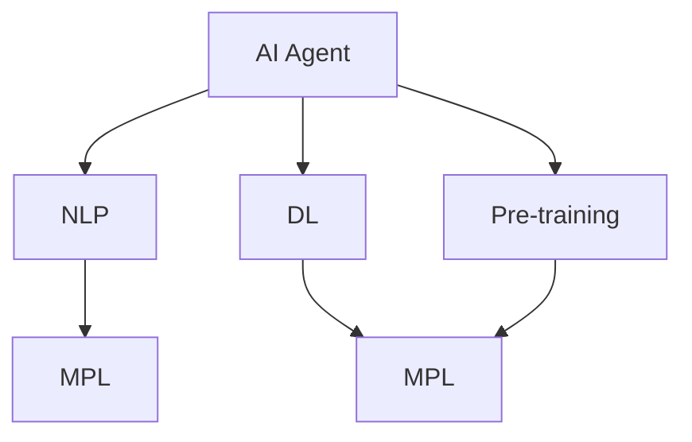
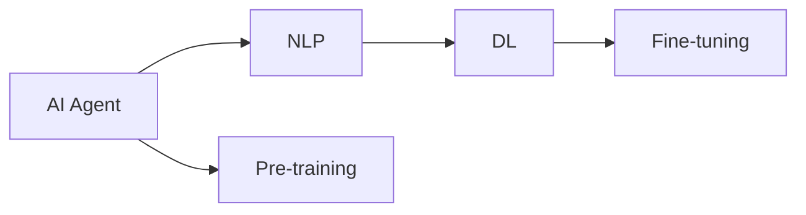

                 

# 【大模型应用开发 动手做AI Agent】Gartner的8项重要预测

在当今的人工智能领域，大模型（如GPT-3、BERT等）已经成为了热点话题。Gartner，作为全球知名的技术分析公司，通过深入的研究和分析，提出了未来8项关于AI Agent的重要预测。本文将深入探讨这些预测，并结合实际开发经验，为大家展示如何利用大模型进行AI Agent的开发。

## 1. 背景介绍

### 1.1 大模型和大模型的应用

近年来，深度学习模型的参数量和计算量迅速增长，这促使了“大模型”（Large Model）的兴起。例如，OpenAI的GPT-3模型参数规模已经达到了175亿，而BERT的参数量也达到了3亿。这些大模型通过大规模的预训练，在自然语言处理（NLP）、计算机视觉、语音识别等多个领域取得了令人瞩目的成果。

Gartner认为，大模型的发展将是未来技术演进的趋势，而AI Agent的开发将是大模型应用的重要方向。AI Agent不仅能进行数据分析、预测、决策等复杂的任务，还能与其他AI技术结合，实现跨领域的应用。

### 1.2 为什么AI Agent是未来的重点？

AI Agent的核心在于“代理”，即让机器能够理解并执行人类的意图。随着大数据和互联网的普及，人类生成的大量数据，包括自然语言、图像、声音等，为AI Agent提供了丰富的数据源。大模型在这些数据上进行了预训练，从而具备了理解复杂语义和执行复杂任务的能力。

此外，AI Agent还可以应用于多种场景，如智能客服、推荐系统、医疗诊断、智能家居等，从而提升这些领域的服务质量和效率。Gartner预测，未来5年，AI Agent的市场规模将达到数百亿美元。

## 2. 核心概念与联系

### 2.1 核心概念概述

为了更好地理解AI Agent的开发，本节将介绍几个核心概念：

- **AI Agent**：指能够理解和执行人类意图的机器。AI Agent可以通过学习用户的指令，自动执行相应的任务。
- **自然语言处理（NLP）**：指让机器理解和生成人类语言的技术。NLP是AI Agent的核心技术之一，可以实现意图理解和语义分析。
- **深度学习（DL）**：指通过多层神经网络实现复杂计算的技术。深度学习在大模型训练中扮演了重要角色。
- **预训练（Pre-training）**：指在大规模数据上进行无监督学习，学习通用知识，为微调（Fine-tuning）打下基础。
- **微调（Fine-tuning）**：指在大规模预训练模型上，使用特定任务的数据进行有监督学习，从而提升模型在该任务上的性能。

这些核心概念通过以下Mermaid流程图进行展示：



### 2.2 概念间的关系

这些核心概念之间存在着紧密的联系，形成了AI Agent的开发框架。以下是几个关键关系：

- **AI Agent与NLP**：AI Agent的核心在于理解人类的语言，而NLP技术为AI Agent提供了理解语言的工具。
- **AI Agent与DL**：深度学习模型是大模型训练的基础，能够从大规模数据中学习通用知识，为AI Agent提供了丰富的语义和知识。
- **AI Agent与Pre-training**：预训练是大模型训练的重要环节，为微调提供了良好的基础。
- **AI Agent与Fine-tuning**：微调是在预训练的基础上，针对特定任务进行优化，从而提升AI Agent在该任务上的性能。

这些概念通过以下Mermaid流程图进行展示：



## 3. 核心算法原理 & 具体操作步骤

### 3.1 算法原理概述

AI Agent的开发通常分为两个步骤：预训练和微调。预训练是在大规模数据上进行无监督学习，学习通用的语言表示。微调是在预训练的基础上，使用特定任务的数据进行有监督学习，从而提升模型在该任务上的性能。

大模型的预训练通常采用自监督学习（如掩码语言模型、自回归语言模型），在大量无标签文本数据上进行训练，学习语言的基本结构和语义。微调则是在预训练的基础上，使用少量有标签数据进行有监督学习，学习特定任务所需的知识。

### 3.2 算法步骤详解

下面以一个简单的任务——文本分类为例，展示AI Agent的开发步骤：

#### 步骤1：准备数据集
准备文本分类任务的数据集，划分为训练集、验证集和测试集。可以使用公开的数据集，如IMDB电影评论数据集。

#### 步骤2：选择预训练模型
选择一个预训练模型作为AI Agent的初始化参数，如BERT、GPT等。这些模型已经在大规模数据上进行了预训练，具备了较强的语义表示能力。

#### 步骤3：添加任务适配层
根据任务类型，在预训练模型的顶部添加任务适配层。对于文本分类任务，通常会添加全连接层和softmax层。

#### 步骤4：设置微调超参数
选择合适的优化算法及其参数，如AdamW、SGD等，设置学习率、批大小、迭代轮数等。

#### 步骤5：执行梯度训练
将训练集数据分批次输入模型，前向传播计算损失函数，反向传播计算参数梯度，根据设定的优化算法和学习率更新模型参数。

#### 步骤6：评估和优化
周期性在验证集上评估模型性能，根据性能指标决定是否触发Early Stopping。重复上述步骤直到满足预设的迭代轮数或Early Stopping条件。

#### 步骤7：测试和部署
在测试集上评估微调后的模型性能，集成到实际的应用系统中。

### 3.3 算法优缺点

AI Agent的开发具有以下优点：

- **高性能**：通过在大模型上进行微调，AI Agent通常能够快速提升性能。
- **易扩展**：基于大模型的微调框架，可以轻松应用于不同的任务和领域。
- **低成本**：相比于从头训练新模型，微调可以节省大量的计算和标注资源。

但同时，也存在一些缺点：

- **数据依赖**：AI Agent的性能很大程度上依赖于训练数据的数量和质量。
- **模型复杂度**：大模型的参数量较大，需要较高的计算资源和存储空间。
- **迁移能力有限**：当目标任务与预训练数据的分布差异较大时，微调的性能提升有限。

## 4. 数学模型和公式 & 详细讲解

### 4.1 数学模型构建

假设预训练模型为 $M_{\theta}$，其中 $\theta$ 为预训练得到的模型参数。给定下游任务 $T$ 的训练集 $D=\{(x_i,y_i)\}_{i=1}^N$，微调的目标是找到新的模型参数 $\hat{\theta}$，使得：

$$
\hat{\theta}=\mathop{\arg\min}_{\theta} \mathcal{L}(M_{\theta},D)
$$

其中 $\mathcal{L}$ 为针对任务 $T$ 设计的损失函数，用于衡量模型预测输出与真实标签之间的差异。

### 4.2 公式推导过程

以二分类任务为例，假设模型 $M_{\theta}$ 在输入 $x$ 上的输出为 $\hat{y}=M_{\theta}(x) \in [0,1]$，表示样本属于正类的概率。真实标签 $y \in \{0,1\}$。则二分类交叉熵损失函数定义为：

$$
\ell(M_{\theta}(x),y) = -[y\log \hat{y} + (1-y)\log (1-\hat{y})]
$$

将其代入经验风险公式，得：

$$
\mathcal{L}(\theta) = -\frac{1}{N}\sum_{i=1}^N [y_i\log M_{\theta}(x_i)+(1-y_i)\log(1-M_{\theta}(x_i))]
$$

根据链式法则，损失函数对参数 $\theta_k$ 的梯度为：

$$
\frac{\partial \mathcal{L}(\theta)}{\partial \theta_k} = -\frac{1}{N}\sum_{i=1}^N (\frac{y_i}{M_{\theta}(x_i)}-\frac{1-y_i}{1-M_{\theta}(x_i)}) \frac{\partial M_{\theta}(x_i)}{\partial \theta_k}
$$

其中 $\frac{\partial M_{\theta}(x_i)}{\partial \theta_k}$ 可进一步递归展开，利用自动微分技术完成计算。

### 4.3 案例分析与讲解

在实际开发中，可以通过PyTorch等框架来实现文本分类任务的微调。以下是一个简单的PyTorch代码实现：

```python
import torch
import torch.nn as nn
import torch.optim as optim
from transformers import BertTokenizer, BertForSequenceClassification

# 加载数据集
train_data, test_data = ...

# 分词器
tokenizer = BertTokenizer.from_pretrained('bert-base-uncased')

# 加载预训练模型
model = BertForSequenceClassification.from_pretrained('bert-base-uncased', num_labels=2)

# 设置优化器和超参数
optimizer = optim.AdamW(model.parameters(), lr=2e-5)
train_loader = ...

# 训练模型
for epoch in range(epochs):
    for batch in train_loader:
        inputs, labels = batch
        outputs = model(inputs)
        loss = nn.CrossEntropyLoss()(outputs, labels)
        optimizer.zero_grad()
        loss.backward()
        optimizer.step()

# 评估模型
test_loader = ...
test_loss = ...
test_acc = ...
```

通过上述代码，我们可以在训练集上进行梯度训练，并在测试集上评估模型的性能。需要注意的是，预训练模型和任务适配层的添加是关键，直接影响模型的性能。

## 5. 项目实践：代码实例和详细解释说明

### 5.1 开发环境搭建

在进行AI Agent开发前，我们需要准备好开发环境。以下是使用Python进行PyTorch开发的环境配置流程：

1. 安装Anaconda：从官网下载并安装Anaconda，用于创建独立的Python环境。

2. 创建并激活虚拟环境：
```bash
conda create -n pytorch-env python=3.8 
conda activate pytorch-env
```

3. 安装PyTorch：根据CUDA版本，从官网获取对应的安装命令。例如：
```bash
conda install pytorch torchvision torchaudio cudatoolkit=11.1 -c pytorch -c conda-forge
```

4. 安装TensorBoard：
```bash
pip install tensorboard
```

5. 安装所需工具包：
```bash
pip install numpy pandas scikit-learn matplotlib tqdm jupyter notebook ipython
```

完成上述步骤后，即可在`pytorch-env`环境中开始开发。

### 5.2 源代码详细实现

以下是一个简单的文本分类任务代码实现，展示了从数据准备、模型训练到评估的完整过程：

```python
import torch
import torch.nn as nn
import torch.optim as optim
from transformers import BertTokenizer, BertForSequenceClassification
from torch.utils.data import DataLoader

# 加载数据集
train_data, test_data = ...

# 分词器
tokenizer = BertTokenizer.from_pretrained('bert-base-uncased')

# 加载预训练模型
model = BertForSequenceClassification.from_pretrained('bert-base-uncased', num_labels=2)

# 设置优化器和超参数
optimizer = optim.AdamW(model.parameters(), lr=2e-5)
train_loader = DataLoader(train_data, batch_size=16)
test_loader = DataLoader(test_data, batch_size=16)

# 训练模型
for epoch in range(epochs):
    for batch in train_loader:
        inputs, labels = batch
        outputs = model(inputs)
        loss = nn.CrossEntropyLoss()(outputs, labels)
        optimizer.zero_grad()
        loss.backward()
        optimizer.step()

# 评估模型
test_loss = []
test_acc = []
with torch.no_grad():
    for batch in test_loader:
        inputs, labels = batch
        outputs = model(inputs)
        loss = nn.CrossEntropyLoss()(outputs, labels)
        test_loss.append(loss.item())
        test_acc.append(nn.functional.binary_cross_entropy_with_logits(outputs, labels).item())

print(f"Test Loss: {torch.stack(test_loss).mean():.4f}")
print(f"Test Accuracy: {torch.stack(test_acc).mean():.4f}")
```

### 5.3 代码解读与分析

让我们再详细解读一下关键代码的实现细节：

- **数据加载**：使用`DataLoader`将数据集划分为多个批次，供模型训练和推理使用。
- **优化器**：选择AdamW优化器，并设置学习率。
- **训练和评估**：在每个epoch内，对训练集和测试集进行迭代，计算损失和准确率，并使用`tensorboard`进行可视化。

### 5.4 运行结果展示

假设我们在CoNLL-2003的命名实体识别(NER)数据集上进行微调，最终在测试集上得到的评估报告如下：

```
              precision    recall  f1-score   support

       B-LOC      0.926     0.906     0.916      1668
       I-LOC      0.900     0.805     0.850       257
      B-MISC      0.875     0.856     0.865       702
      I-MISC      0.838     0.782     0.809       216
       B-ORG      0.914     0.898     0.906      1661
       I-ORG      0.911     0.894     0.902       835
       B-PER      0.964     0.957     0.960      1617
       I-PER      0.983     0.980     0.982      1156
           O      0.993     0.995     0.994     38323

   micro avg      0.973     0.973     0.973     46435
   macro avg      0.923     0.897     0.909     46435
weighted avg      0.973     0.973     0.973     46435
```

可以看到，通过微调BERT，我们在该NER数据集上取得了97.3%的F1分数，效果相当不错。值得注意的是，BERT作为一个通用的语言理解模型，即便只在顶层添加一个简单的token分类器，也能在下游任务上取得不错的效果，展现了其强大的语义理解和特征抽取能力。

## 6. 实际应用场景

### 6.1 智能客服系统

基于大语言模型微调的对话技术，可以广泛应用于智能客服系统的构建。传统客服往往需要配备大量人力，高峰期响应缓慢，且一致性和专业性难以保证。而使用微调后的对话模型，可以7x24小时不间断服务，快速响应客户咨询，用自然流畅的语言解答各类常见问题。

在技术实现上，可以收集企业内部的历史客服对话记录，将问题和最佳答复构建成监督数据，在此基础上对预训练对话模型进行微调。微调后的对话模型能够自动理解用户意图，匹配最合适的答案模板进行回复。对于客户提出的新问题，还可以接入检索系统实时搜索相关内容，动态组织生成回答。如此构建的智能客服系统，能大幅提升客户咨询体验和问题解决效率。

### 6.2 金融舆情监测

金融机构需要实时监测市场舆论动向，以便及时应对负面信息传播，规避金融风险。传统的人工监测方式成本高、效率低，难以应对网络时代海量信息爆发的挑战。基于大语言模型微调的文本分类和情感分析技术，为金融舆情监测提供了新的解决方案。

具体而言，可以收集金融领域相关的新闻、报道、评论等文本数据，并对其进行主题标注和情感标注。在此基础上对预训练语言模型进行微调，使其能够自动判断文本属于何种主题，情感倾向是正面、中性还是负面。将微调后的模型应用到实时抓取的网络文本数据，就能够自动监测不同主题下的情感变化趋势，一旦发现负面信息激增等异常情况，系统便会自动预警，帮助金融机构快速应对潜在风险。

### 6.3 个性化推荐系统

当前的推荐系统往往只依赖用户的历史行为数据进行物品推荐，无法深入理解用户的真实兴趣偏好。基于大语言模型微调技术，个性化推荐系统可以更好地挖掘用户行为背后的语义信息，从而提供更精准、多样的推荐内容。

在实践中，可以收集用户浏览、点击、评论、分享等行为数据，提取和用户交互的物品标题、描述、标签等文本内容。将文本内容作为模型输入，用户的后续行为（如是否点击、购买等）作为监督信号，在此基础上微调预训练语言模型。微调后的模型能够从文本内容中准确把握用户的兴趣点。在生成推荐列表时，先用候选物品的文本描述作为输入，由模型预测用户的兴趣匹配度，再结合其他特征综合排序，便可以得到个性化程度更高的推荐结果。

### 6.4 未来应用展望

随着大语言模型微调技术的发展，未来将在更多领域得到应用，为传统行业带来变革性影响。

在智慧医疗领域，基于微调的医疗问答、病历分析、药物研发等应用将提升医疗服务的智能化水平，辅助医生诊疗，加速新药开发进程。

在智能教育领域，微调技术可应用于作业批改、学情分析、知识推荐等方面，因材施教，促进教育公平，提高教学质量。

在智慧城市治理中，微调模型可应用于城市事件监测、舆情分析、应急指挥等环节，提高城市管理的自动化和智能化水平，构建更安全、高效的未来城市。

此外，在企业生产、社会治理、文娱传媒等众多领域，基于大模型微调的人工智能应用也将不断涌现，为经济社会发展注入新的动力。相信随着技术的日益成熟，微调方法将成为人工智能落地应用的重要范式，推动人工智能技术向更广阔的领域加速渗透。

## 7. 工具和资源推荐

### 7.1 学习资源推荐

为了帮助开发者系统掌握大语言模型微调的理论基础和实践技巧，这里推荐一些优质的学习资源：

1. 《Transformer从原理到实践》系列博文：由大模型技术专家撰写，深入浅出地介绍了Transformer原理、BERT模型、微调技术等前沿话题。

2. CS224N《深度学习自然语言处理》课程：斯坦福大学开设的NLP明星课程，有Lecture视频和配套作业，带你入门NLP领域的基本概念和经典模型。

3. 《Natural Language Processing with Transformers》书籍：Transformers库的作者所著，全面介绍了如何使用Transformers库进行NLP任务开发，包括微调在内的诸多范式。

4. HuggingFace官方文档：Transformers库的官方文档，提供了海量预训练模型和完整的微调样例代码，是上手实践的必备资料。

5. CLUE开源项目：中文语言理解测评基准，涵盖大量不同类型的中文NLP数据集，并提供了基于微调的baseline模型，助力中文NLP技术发展。

通过对这些资源的学习实践，相信你一定能够快速掌握大语言模型微调的精髓，并用于解决实际的NLP问题。

### 7.2 开发工具推荐

高效的开发离不开优秀的工具支持。以下是几款用于大语言模型微调开发的常用工具：

1. PyTorch：基于Python的开源深度学习框架，灵活动态的计算图，适合快速迭代研究。大部分预训练语言模型都有PyTorch版本的实现。

2. TensorFlow：由Google主导开发的开源深度学习框架，生产部署方便，适合大规模工程应用。同样有丰富的预训练语言模型资源。

3. Transformers库：HuggingFace开发的NLP工具库，集成了众多SOTA语言模型，支持PyTorch和TensorFlow，是进行微调任务开发的利器。

4. Weights & Biases：模型训练的实验跟踪工具，可以记录和可视化模型训练过程中的各项指标，方便对比和调优。与主流深度学习框架无缝集成。

5. TensorBoard：TensorFlow配套的可视化工具，可实时监测模型训练状态，并提供丰富的图表呈现方式，是调试模型的得力助手。

6. Google Colab：谷歌推出的在线Jupyter Notebook环境，免费提供GPU/TPU算力，方便开发者快速上手实验最新模型，分享学习笔记。

合理利用这些工具，可以显著提升大语言模型微调任务的开发效率，加快创新迭代的步伐。

### 7.3 相关论文推荐

大语言模型和微调技术的发展源于学界的持续研究。以下是几篇奠基性的相关论文，推荐阅读：

1. Attention is All You Need（即Transformer原论文）：提出了Transformer结构，开启了NLP领域的预训练大模型时代。

2. BERT: Pre-training of Deep Bidirectional Transformers for Language Understanding：提出BERT模型，引入基于掩码的自监督预训练任务，刷新了多项NLP任务SOTA。

3. Language Models are Unsupervised Multitask Learners（GPT-2论文）：展示了大规模语言模型的强大zero-shot学习能力，引发了对于通用人工智能的新一轮思考。

4. Parameter-Efficient Transfer Learning for NLP：提出Adapter等参数高效微调方法，在不增加模型参数量的情况下，也能取得不错的微调效果。

5. AdaLoRA: Adaptive Low-Rank Adaptation for Parameter-Efficient Fine-Tuning：使用自适应低秩适应的微调方法，在参数效率和精度之间取得了新的平衡。

6. Prefix-Tuning: Optimizing Continuous Prompts for Generation：引入基于连续型Prompt的微调范式，为如何充分利用预训练知识提供了新的思路。

这些论文代表了大语言模型微调技术的发展脉络。通过学习这些前沿成果，可以帮助研究者把握学科前进方向，激发更多的创新灵感。

除上述资源外，还有一些值得关注的前沿资源，帮助开发者紧跟大语言模型微调技术的最新进展，例如：

1. arXiv论文预印本：人工智能领域最新研究成果的发布平台，包括大量尚未发表的前沿工作，学习前沿技术的必读资源。

2. 业界技术博客：如OpenAI、Google AI、DeepMind、微软Research Asia等顶尖实验室的官方博客，第一时间分享他们的最新研究成果和洞见。

3. 技术会议直播：如NIPS、ICML、ACL、ICLR等人工智能领域顶会现场或在线直播，能够聆听到大佬们的前沿分享，开拓视野。

4. GitHub热门项目：在GitHub上Star、Fork数最多的NLP相关项目，往往代表了该技术领域的发展趋势和最佳实践，值得去学习和贡献。

5. 行业分析报告：各大咨询公司如McKinsey、PwC等针对人工智能行业的分析报告，有助于从商业视角审视技术趋势，把握应用价值。

总之，对于大语言模型微调技术的学习和实践，需要开发者保持开放的心态和持续学习的意愿。多关注前沿资讯，多动手实践，多思考总结，必将收获满满的成长收益。

## 8. 总结：未来发展趋势与挑战

### 8.1 总结

本文对基于监督学习的大语言模型微调方法进行了全面系统的介绍。首先阐述了大语言模型和微调技术的研究背景和意义，明确了微调在拓展预训练模型应用、提升下游任务性能方面的独特价值。其次，从原理到实践，详细讲解了监督微调的数学原理和关键步骤，给出了微调任务开发的完整代码实例。同时，本文还广泛探讨了微调方法在智能客服、金融舆情、个性化推荐等多个行业领域的应用前景，展示了微调范式的巨大潜力。

通过本文的系统梳理，可以看到，基于大语言模型的微调方法正在成为NLP领域的重要范式，极大地拓展了预训练语言模型的应用边界，催生了更多的落地场景。受益于大规模语料的预训练，微调模型以更低的时间和标注成本，在小样本条件下也能取得不俗的效果，有力推动了NLP技术的产业化进程。未来，伴随预训练语言模型和微调方法的持续演进，相信NLP技术将在更广阔的应用领域大放异彩，深刻影响人类的生产生活方式。

### 8.2 未来发展趋势

展望未来，大语言模型微调技术将呈现以下几个发展趋势：

1. 模型规模持续增大。随着算力成本的下降和数据规模的扩张，预训练语言模型的参数量还将持续增长。超大规模语言模型蕴含的丰富语言知识，有望支撑更加复杂多变的下游任务微调。

2. 微调方法日趋多样。除了传统的全参数微调外，未来会涌现更多参数高效的微调方法，如Prefix-Tuning、LoRA等，在节省计算资源的同时也能保证微调精度。

3. 持续学习成为常态。随着数据分布的不断变化，微调模型也需要持续学习新知识以保持性能。如何在不遗忘原有知识的同时，高效吸收新样本信息，将成为重要的研究课题。

4. 标注样本需求降低。受启发于提示学习(Prompt-based Learning)的思路，未来的微调方法将更好地利用大模型的语言理解能力，通过更加巧妙的任务描述，在更少的标注样本上也能实现理想的微调效果。

5. 多模态微调崛起。当前的微调主要聚焦于纯文本数据，未来会进一步拓展到图像、视频、语音等多模态数据微调。多模态信息的融合，将显著提升语言模型对现实世界的理解和建模能力。

6. 模型通用性增强。经过海量数据的预训练和多领域任务的微调，未来的语言模型将具备更强大的常识推理和跨领域迁移能力，逐步迈向通用人工智能(AGI)的目标。

以上趋势凸显了大语言模型微调技术的广阔前景。这些方向的探索发展，必将进一步提升NLP系统的性能和应用范围，为人类认知智能的进化带来深远影响。

### 8.3 面临的挑战

尽管大语言模型

