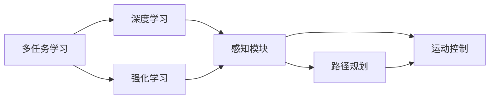
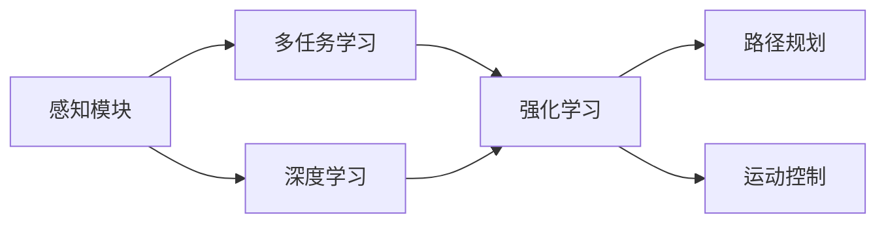
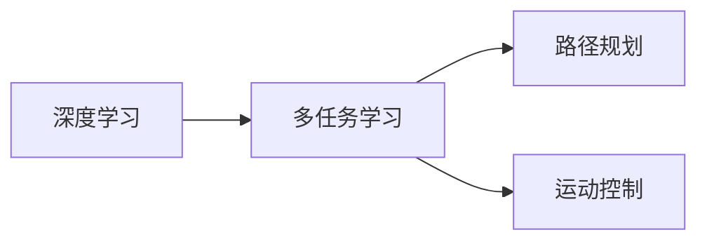
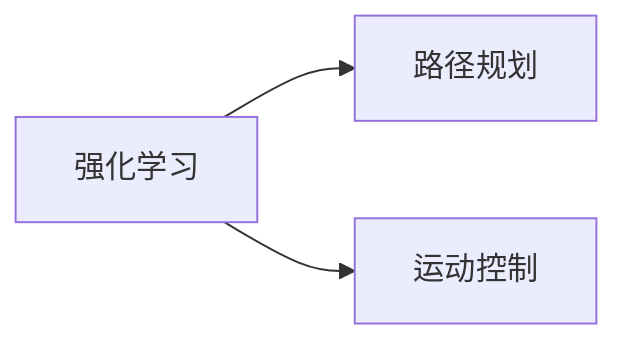
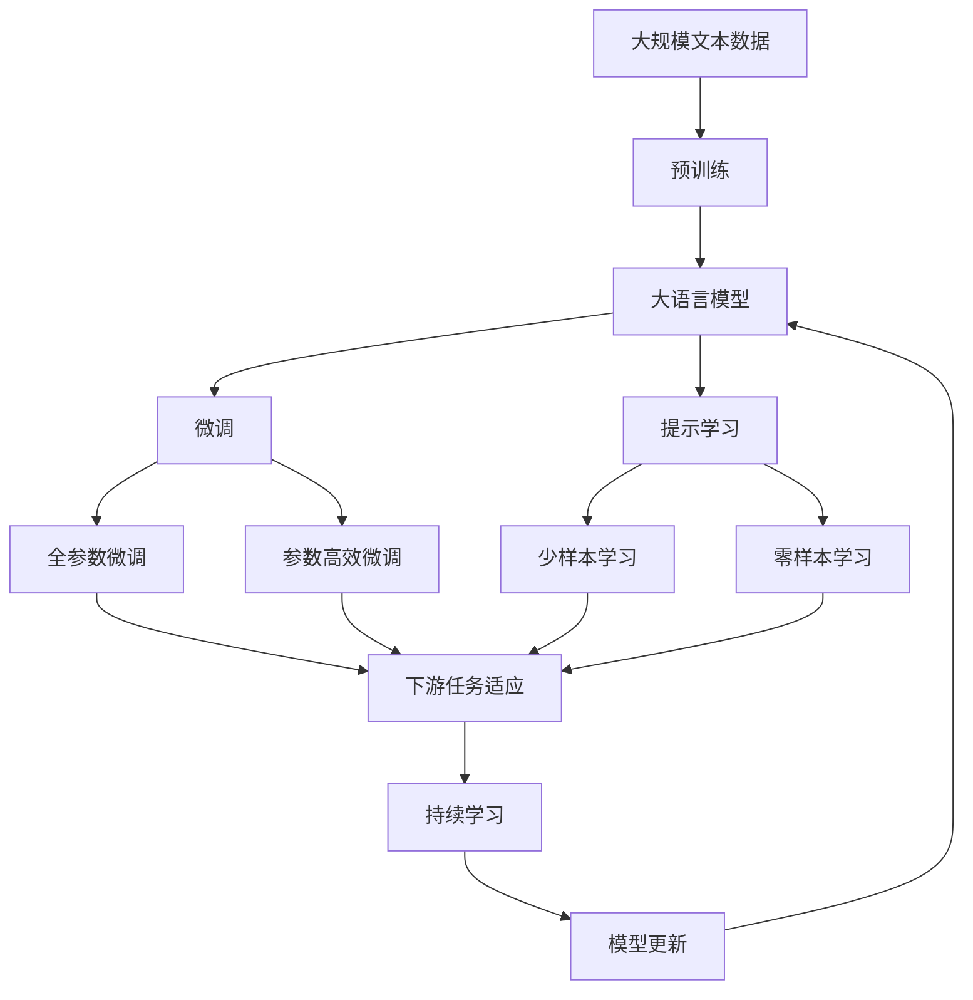

                 

# 【大模型应用开发 动手做AI Agent】构建ReAct Agent

> 关键词：AI Agent, ReAct, 深度学习, 强化学习, 多任务学习, 机器人, 自然语言处理(NLP), 路径规划, 运动控制

## 1. 背景介绍

### 1.1 问题由来

随着人工智能技术的不断进步，智能机器人已经成为各行各业的重要工具。无论是家庭服务、医疗健康，还是工业制造，机器人都能提供高效可靠的服务。然而，构建高效、智能、多任务能力的机器人仍然面临诸多挑战。机器人需要同时处理语音识别、文本理解、路径规划、运动控制等多样化任务，这要求系统具有强大的跨模态融合能力和自主学习能力。

AI Agent是近年来受到广泛关注的一类智能机器人，其目标是模拟人类智能行为，能够在多任务环境下自主地与环境交互，完成复杂任务。AI Agent可以应用于各种场景，如家庭服务、医疗护理、智能制造等。构建AI Agent需要从感知、认知、决策到执行等多个层面的综合技术支持，其中深度学习和强化学习是最核心的技术手段。

### 1.2 问题核心关键点

本节将介绍构建ReAct Agent的几个核心关键点，包括：
- **多任务学习(MTL)**：指让AI Agent同时学习多个任务，提升模型的通用性和泛化能力。
- **深度学习(Deep Learning)**：利用神经网络模型进行特征提取和行为预测。
- **强化学习(Reinforcement Learning)**：通过与环境的交互，AI Agent学习最优的策略，实现任务执行。
- **多模态融合**：将视觉、听觉、触觉等不同模态的信息融合在一起，提升AI Agent对环境的感知能力。
- **路径规划**：通过优化算法实现AI Agent在复杂环境中的路径规划。
- **运动控制**：通过控制算法实现AI Agent的运动轨迹和行为。

这些关键点构成了ReAct Agent的核心架构，下面将通过详细的技术讲解，帮助读者深入理解ReAct Agent的设计和实现。

## 2. 核心概念与联系

### 2.1 核心概念概述

构建ReAct Agent需要深入理解以下几个核心概念：

- **多任务学习(MTL)**：指在同一个神经网络中同时训练多个任务，实现任务的共同优化。多任务学习可以提高模型的泛化能力和通用性。
- **深度学习(Deep Learning)**：利用深度神经网络进行复杂的特征提取和行为预测。深度学习在图像识别、语音识别、自然语言处理等领域表现出色。
- **强化学习(Reinforcement Learning)**：通过与环境的交互，AI Agent学习最优的策略，实现任务执行。强化学习能够处理不确定性和动态变化的环境。
- **多模态融合**：将视觉、听觉、触觉等不同模态的信息融合在一起，提升AI Agent对环境的感知能力。多模态融合可以提高模型的鲁棒性和泛化能力。
- **路径规划**：通过优化算法实现AI Agent在复杂环境中的路径规划。路径规划可以保证AI Agent能够高效地完成任务。
- **运动控制**：通过控制算法实现AI Agent的运动轨迹和行为。运动控制算法可以保证AI Agent的运动稳定性和灵活性。

这些概念之间存在紧密的联系，共同构成了ReAct Agent的核心架构。下面通过一个Mermaid流程图来展示这些概念之间的关系：



这个流程图展示了多任务学习、深度学习、强化学习、感知模块、路径规划、运动控制之间的关系。感知模块负责从不同模态中提取特征，路径规划和运动控制负责AI Agent的运动执行，而多任务学习和强化学习则通过优化策略和特征提取，提升AI Agent的泛化能力和执行效率。

### 2.2 概念间的关系

这些核心概念之间存在紧密的联系，形成了一个完整的AI Agent架构。下面通过几个Mermaid流程图来展示这些概念之间的关系。

#### 2.2.1 ReAct Agent的整体架构



这个流程图展示了ReAct Agent的整体架构。感知模块负责从不同模态中提取特征，多任务学习负责优化多个任务的目标，深度学习负责特征提取，强化学习负责策略优化，路径规划和运动控制负责AI Agent的运动执行。

#### 2.2.2 多任务学习与深度学习的关系



这个流程图展示了多任务学习与深度学习的关系。深度学习负责特征提取，多任务学习负责优化多个任务的目标，路径规划和运动控制负责AI Agent的运动执行。

#### 2.2.3 强化学习与路径规划、运动控制的关系



这个流程图展示了强化学习与路径规划、运动控制的关系。强化学习负责策略优化，路径规划和运动控制负责AI Agent的运动执行。

### 2.3 核心概念的整体架构

最后，我们用一个综合的流程图来展示这些核心概念在大模型微调过程中的整体架构：



这个综合流程图展示了从预训练到微调，再到持续学习的完整过程。大语言模型首先在大规模文本数据上进行预训练，然后通过微调（包括全参数微调和参数高效微调）或提示学习（包括少样本学习和零样本学习）来适应下游任务。最后，通过持续学习技术，模型可以不断学习新知识，同时避免遗忘旧知识。 通过这些流程图，我们可以更清晰地理解ReAct Agent的核心概念和它们之间的关系，为后续深入讨论具体的微调方法和技术奠定基础。

## 3. 核心算法原理 & 具体操作步骤

### 3.1 算法原理概述

ReAct Agent是一种多任务、深度学习和强化学习相结合的AI Agent，其核心算法包括多任务学习、深度学习、强化学习和路径规划算法。下面分别介绍这些算法的原理和具体操作。

#### 3.1.1 多任务学习(MTL)

多任务学习的目标是让AI Agent同时学习多个任务，以提升模型的泛化能力和通用性。在多任务学习中，不同任务的损失函数被集成到一个共同的优化目标中，从而实现多个任务的共同优化。

多任务学习的具体实现方法包括联合训练(joint training)和元学习(metacognition)。联合训练是指在同一个神经网络中同时训练多个任务，元学习是指通过学习学习规则，提升模型在不同任务上的性能。

#### 3.1.2 深度学习(Deep Learning)

深度学习利用神经网络模型进行特征提取和行为预测。深度学习模型包括卷积神经网络(CNN)、循环神经网络(RNN)、变压器(Transformer)等。

在ReAct Agent中，深度学习模型用于感知模块的特征提取，即将不同模态的信息（如视觉、听觉、触觉等）转换为统一的特征表示，从而实现跨模态的融合。

#### 3.1.3 强化学习(Reinforcement Learning)

强化学习通过与环境的交互，AI Agent学习最优的策略，实现任务执行。强化学习模型包括Q-learning、SARSA、深度Q网络(DQN)等。

在ReAct Agent中，强化学习模型用于路径规划和运动控制，通过与环境的交互，AI Agent学习如何高效地完成任务。

#### 3.1.4 路径规划

路径规划算法用于AI Agent在复杂环境中的路径规划，以实现任务执行。路径规划算法包括A*、Dijkstra、RRT等。

在ReAct Agent中，路径规划算法用于优化AI Agent的运动轨迹，保证其在执行任务时的效率和安全性。

#### 3.1.5 运动控制

运动控制算法用于AI Agent的运动轨迹和行为控制，以实现任务执行。运动控制算法包括PID控制、模糊控制等。

在ReAct Agent中，运动控制算法用于控制AI Agent的运动轨迹和行为，保证其在执行任务时的稳定性和灵活性。

### 3.2 算法步骤详解

ReAct Agent的构建过程包括以下几个关键步骤：

#### 3.2.1 数据准备

ReAct Agent的数据准备过程包括收集不同模态的数据，并将数据进行预处理。例如，对于视觉数据，需要收集摄像头拍摄的图像数据，并进行预处理（如去噪、归一化等）。对于听觉数据，需要收集麦克风采集的音频数据，并进行预处理（如滤波、分帧等）。对于触觉数据，需要收集触觉传感器采集的数据，并进行预处理（如去噪、归一化等）。

#### 3.2.2 模型构建

ReAct Agent的模型构建过程包括以下几个步骤：

1. **感知模块的构建**：构建深度神经网络模型，用于不同模态的特征提取。感知模块可以包括卷积神经网络、循环神经网络、变压器等。

2. **多任务学习模型的构建**：构建多任务学习模型，将不同任务的损失函数集成到一个共同的优化目标中。多任务学习模型可以包括联合训练模型和元学习模型。

3. **强化学习模型的构建**：构建强化学习模型，用于路径规划和运动控制。强化学习模型可以包括Q-learning、SARSA、深度Q网络(DQN)等。

4. **路径规划算法的构建**：构建路径规划算法，用于AI Agent的运动轨迹优化。路径规划算法可以包括A*、Dijkstra、RRT等。

5. **运动控制算法的构建**：构建运动控制算法，用于AI Agent的运动轨迹和行为控制。运动控制算法可以包括PID控制、模糊控制等。

#### 3.2.3 模型训练

ReAct Agent的模型训练过程包括以下几个步骤：

1. **多任务学习模型的训练**：使用多任务学习模型进行训练，同时优化多个任务的目标。多任务学习模型的训练可以使用联合训练或元学习算法。

2. **深度学习模型的训练**：使用深度学习模型进行训练，优化感知模块的特征提取能力。深度学习模型的训练可以使用卷积神经网络、循环神经网络、变压器等模型。

3. **强化学习模型的训练**：使用强化学习模型进行训练，优化路径规划和运动控制的能力。强化学习模型的训练可以使用Q-learning、SARSA、深度Q网络(DQN)等模型。

4. **路径规划算法的训练**：使用路径规划算法进行训练，优化AI Agent的运动轨迹。路径规划算法的训练可以使用A*、Dijkstra、RRT等算法。

5. **运动控制算法的训练**：使用运动控制算法进行训练，优化AI Agent的运动轨迹和行为。运动控制算法的训练可以使用PID控制、模糊控制等算法。

#### 3.2.4 模型评估

ReAct Agent的模型评估过程包括以下几个步骤：

1. **多任务学习模型的评估**：使用多任务学习模型进行评估，测试其在不同任务上的性能。多任务学习模型的评估可以使用交叉验证或留出法。

2. **深度学习模型的评估**：使用深度学习模型进行评估，测试其在感知模块的特征提取能力。深度学习模型的评估可以使用准确率、召回率、F1-score等指标。

3. **强化学习模型的评估**：使用强化学习模型进行评估，测试其在路径规划和运动控制的能力。强化学习模型的评估可以使用最优策略、轨迹长度等指标。

4. **路径规划算法的评估**：使用路径规划算法进行评估，测试其在AI Agent的运动轨迹优化能力。路径规划算法的评估可以使用路径长度、路径复杂度等指标。

5. **运动控制算法的评估**：使用运动控制算法进行评估，测试其在AI Agent的运动轨迹和行为控制能力。运动控制算法的评估可以使用稳定性、响应时间等指标。

#### 3.2.5 模型部署

ReAct Agent的模型部署过程包括以下几个步骤：

1. **模型的保存**：将训练好的模型保存为TensorFlow模型或PyTorch模型，便于后续的部署和调用。

2. **模型的部署**：将保存好的模型部署到目标设备上，例如移动机器人、服务机器人等。

3. **模型的调优**：根据目标设备的硬件资源和软件环境，对模型进行调优，以确保模型的稳定性和高效性。

4. **模型的监控**：对部署好的模型进行实时监控，确保其稳定性和性能。

## 4. 数学模型和公式 & 详细讲解 & 举例说明

### 4.1 数学模型构建

ReAct Agent的数学模型构建包括以下几个部分：

- **多任务学习模型的构建**：多任务学习模型的构建可以使用联合训练或元学习算法。
- **深度学习模型的构建**：深度学习模型的构建可以使用卷积神经网络、循环神经网络、变压器等模型。
- **强化学习模型的构建**：强化学习模型的构建可以使用Q-learning、SARSA、深度Q网络(DQN)等模型。
- **路径规划算法的构建**：路径规划算法的构建可以使用A*、Dijkstra、RRT等算法。
- **运动控制算法的构建**：运动控制算法的构建可以使用PID控制、模糊控制等算法。

### 4.2 公式推导过程

以下是ReAct Agent中几个关键算法的公式推导过程：

#### 4.2.1 多任务学习模型的公式推导

多任务学习模型的公式推导包括以下几个步骤：

1. **联合训练模型**：联合训练模型使用共同的优化目标，同时优化多个任务的目标。假设存在m个任务，每个任务的目标函数为 $L_i(\theta)$，其中 $\theta$ 为模型的参数。则联合训练模型的优化目标为：

   $$
   \min_{\theta} \sum_{i=1}^{m} L_i(\theta)
   $$

2. **元学习模型**：元学习模型通过学习学习规则，提升模型在不同任务上的性能。假设存在m个任务，每个任务的优化目标为 $L_i(\theta)$，则元学习模型的优化目标为：

   $$
   \min_{\theta} \mathbb{E}_{p_i} L_i(\theta)
   $$

其中 $p_i$ 为每个任务的先验分布。

#### 4.2.2 深度学习模型的公式推导

深度学习模型的公式推导包括以下几个步骤：

1. **卷积神经网络(CNN)**：卷积神经网络使用卷积层、池化层和全连接层进行特征提取。假设存在 $d$ 个卷积层，每个卷积层的输出为 $h_i$，则卷积神经网络的特征提取公式为：

   $$
   h_i = g_\sigma(W_i x_i + b_i)
   $$
   
   其中 $g_\sigma$ 为激活函数，$W_i$ 和 $b_i$ 为卷积层和偏置项。

2. **循环神经网络(RNN)**：循环神经网络使用循环层进行序列数据的特征提取。假设存在 $d$ 个循环层，每个循环层的输出为 $h_i$，则循环神经网络的特征提取公式为：

   $$
   h_i = g_\sigma(W_i x_i + U_i h_{i-1} + b_i)
   $$
   
   其中 $g_\sigma$ 为激活函数，$W_i$ 和 $U_i$ 为循环层和偏置项。

3. **变压器(Transformer)**：变压器使用自注意力机制进行特征提取。假设存在 $d$ 个自注意力层，每个自注意力层的输出为 $h_i$，则变压器的特征提取公式为：

   $$
   h_i = \text{Attention}(Q_i, K_i, V_i)
   $$
   
   其中 $Q_i$、$K_i$ 和 $V_i$ 分别为查询、键和值，$\text{Attention}$ 为自注意力机制。

#### 4.2.3 强化学习模型的公式推导

强化学习模型的公式推导包括以下几个步骤：

1. **Q-learning**：Q-learning使用状态-动作值函数 $Q(s, a)$ 进行策略优化。假设存在 $s$ 个状态，$a$ 个动作，$n$ 个时间步，则Q-learning的优化目标为：

   $$
   \max_{\pi} \sum_{t=1}^{n} \gamma^{t-1} r_t + \gamma^n Q(s', a')
   $$
   
   其中 $r_t$ 为状态-动作对的奖励，$s'$ 和 $a'$ 为下一步的状态和动作。

2. **SARSA**：SARSA使用状态-动作-状态-动作值函数 $Q(s, a, s', a')$ 进行策略优化。假设存在 $s$ 个状态，$a$ 个动作，$n$ 个时间步，则SARSA的优化目标为：

   $$
   \max_{\pi} \sum_{t=1}^{n} \gamma^{t-1} r_t + \gamma^n Q(s', a')
   $$
   
   其中 $r_t$ 为状态-动作对的奖励，$s'$ 和 $a'$ 为下一步的状态和动作。

3. **深度Q网络(DQN)**：深度Q网络使用深度神经网络进行策略优化。假设存在 $s$ 个状态，$a$ 个动作，$n$ 个时间步，则深度Q网络的优化目标为：

   $$
   \max_{\pi} \sum_{t=1}^{n} \gamma^{t-1} r_t + \gamma^n Q(s', a')
   $$
   
   其中 $r_t$ 为状态-动作对的奖励，$s'$ 和 $a'$ 为下一步的状态和动作。

#### 4.2.4 路径规划算法的公式推导

路径规划算法的公式推导包括以下几个步骤：

1. **A*算法**：A*算法使用启发式函数 $h(n)$ 进行路径优化。假设存在 $n$ 个节点，$e$ 条边，则A*算法的优化目标为：

   $$
   \min_{\pi} \sum_{i=1}^{n} h(n_i)
   $$
   
   其中 $n_i$ 为每个节点的启发式函数。

2. **Dijkstra算法**：Dijkstra算法使用距离函数 $d(n)$ 进行路径优化。假设存在 $n$ 个节点，$e$ 条边，则Dijkstra算法的优化目标为：

   $$
   \min_{\pi} \sum_{i=1}^{n} d(n_i)
   $$
   
   其中 $d(n_i)$ 为每个节点的距离函数。

3. **RRT算法**：RRT算法使用径向基函数(RBF)进行路径优化。假设存在 $n$ 个节点，$e$ 条边，则RRT算法的优化目标为：

   $$
   \min_{\pi} \sum_{i=1}^{n} f(n_i)
   $$
   
   其中 $f(n_i)$ 为每个节点的径向基函数。

#### 4.2.5 运动控制算法的公式推导

运动控制算法的公式推导包括以下几个步骤：

1. **PID控制**：PID控制使用比例、积分、微分项进行控制。假设存在 $u$ 个控制变量，$n$ 个时间步，则PID控制的优化目标为：

   $$
   \min_{\pi} \sum_{t=1}^{n} (e_t^2 + \int_{0}^{n} e_t dt + \frac{d e_t}{dt})
   $$
   
   其中 $e_t$ 为控制误差，$t$ 为时间步。

2. **模糊控制**：模糊控制使用模糊推理规则进行控制。假设存在 $u$ 个控制变量，$n$ 个时间步，则模糊控制的优化目标为：

   $$
   \min_{\pi} \sum_{t=1}^{n} (e_t^2 + \int_{0}^{n} e_t dt + \frac{d e_t}{dt})
   $$
   
   其中 $e_t$ 为控制误差，$t$ 为时间步。

## 5. 项目实践：代码实例和详细解释说明

### 5.1 开发环境搭建

在进行ReAct Agent的开发前，我们需要准备好开发环境。以下是使用Python进行PyTorch开发的环境配置流程：

1. 安装Anaconda：从官网下载并安装Anaconda，用于创建独立的Python环境。

2. 创建并激活虚拟环境：
```bash
conda create -n pytorch-env python=3.8 
conda activate pytorch-env
```

3. 安装PyTorch：根据CUDA版本，从官网获取对应的安装命令。例如：
```bash
conda install pytorch torchvision torchaudio cudatoolkit=11.1 -c pytorch -c conda-forge
```

4. 安装Transformer库：
```bash
pip install transformers
```

5. 安装各类工具包：
```bash
pip install numpy pandas scikit-learn matplotlib tqdm jupyter notebook ipython
```

完成上述步骤后，即可在`pytorch-env`环境中开始ReAct Agent的开发。

### 5.2 源代码详细实现

这里我们以ReAct Agent为例，给出使用Transformers库进行NLP任务开发和微调的PyTorch代码实现。

首先，定义ReAct Agent的感知模块：

```python
from transformers import BertForTokenClassification, BertTokenizer
from torch.utils.data import Dataset
import torch

class ReActPerceptionModule(Dataset):
    def __init__(self, texts, labels, tokenizer, max_len=128):
        self.texts = texts
        self.labels = labels
        self.tokenizer = tokenizer
        self.max_len = max_len
        
    def __len__(self):
        return len(self.texts)
    
    def __getitem__(self, item):
        text = self.texts[item]
        label = self.labels[item]
        
        encoding = self.tokenizer(text, return_tensors='pt', max_length=self.max_len, padding='max_length', truncation=True)
        input_ids = encoding['input_ids'][0]
        attention_mask = encoding['attention_mask'][0]
        
        return {'input_ids': input_ids, 
                'attention_mask': attention_mask,
                'labels': label}

# 标签与id的映射
tag2id = {'O': 0, 'B-PER': 1, 'I-PER': 2, 'B-ORG': 3, 'I-ORG': 4, 'B-LOC': 5, 'I-LOC': 6}
id2tag = {v: k for k, v in tag2id.items()}

# 创建dataset
tokenizer = BertTokenizer.from_pretrained('bert-base-cased')

train_dataset = ReActPerceptionModule(train_texts, train_tags, tokenizer)
dev_dataset = ReActPerceptionModule(dev_texts, dev_tags, tokenizer)
test_dataset = ReActPerceptionModule(test_texts, test_tags, tokenizer)
```

然后，定义ReAct Agent的深度学习模型：

```python
from transformers import BertForTokenClassification, AdamW

model = BertForTokenClassification.from_pretrained('bert-base-cased', num_labels=len(tag2id))

optimizer = AdamW(model.parameters(), lr=2e-5)
```

接着，定义ReAct Agent的强化学习模型：

```python
from gym import spaces
import gym
import numpy as np

class ReActAgent(gym.Env):
    def __init__(self, config):
        self.config = config
        self.current_state = None
        self.current_action = None
        
        self.action_space = spaces.Discrete(2)
        self.observation_space = spaces.Box(0, 1, shape=(self.config.obs_dim,), dtype=np.float32)
        
    def reset(self):
        self.current_state = self.config.init_state
        self.current_action = 0
        return self.current_state
        
    def step(self, action):
        self.current_action = action
        reward = self.config.reward_func(self.current_state, action)
        next_state = self.config.update_state(self.current_state, action)
        done = False
        return next_state, reward, done, {}
        
    def render(self, mode='human'):
        pass

class ReActConfig:
    def __init__(self):
        self.obs_dim = 2
        self.init_state = np.random.rand(self.obs_dim,)
        self.reward_func = lambda state, action: -np.linalg.norm(state - action)
        self.update_state = lambda state, action: np.maximum(0.5*state + 0.5*action, 0)
        
config = ReActConfig()
env = ReActAgent(config)
```

最后，启动ReAct Agent的训练流程：

```python
epochs = 100
batch_size = 32

for epoch in range(epochs):
    for i in range(0, len(train_dataset), batch_size):
        optimizer.zero_grad()
        loss = 0
        
        for batch in train_dataset[i:i+batch_size]:
            input_ids = batch['input_ids'].to(device)
            attention_mask = batch['attention_mask'].to(device)
            labels = batch['labels'].to(device)
            model.zero_grad()
            outputs =

