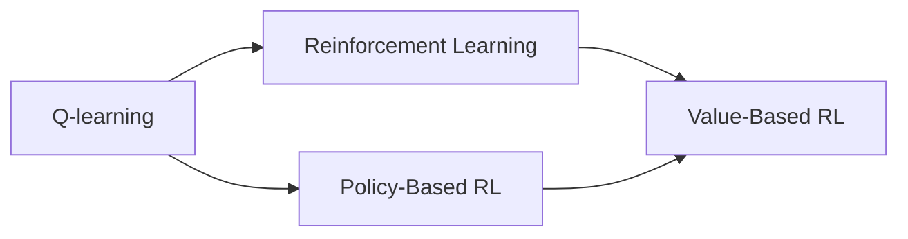

                 

## 1. 背景介绍

在人工智能领域，深度学习技术一直处于前沿地位。然而，深度学习模型虽然在许多复杂任务上取得了显著的成果，但也存在一些固有的局限性，例如依赖大量标注数据、需要大量计算资源、结果解释性较弱等。与此不同，强化学习（Reinforcement Learning, RL）近年来也逐渐成为AI领域的一个重要分支，尤其是在需要实时交互和反馈的应用场景中，RL展示了其独特的优势。

医疗诊断作为AI应用的一个重要领域，具有高风险、高复杂性的特点，因此如何通过AI技术提升诊断的准确性和效率，成为了当前研究的热点。Q-learning算法，作为强化学习中的经典算法，已经在许多领域得到了应用，并在不断演进中展现出新的潜力。本文将聚焦于Q-learning在医疗诊断中的应用，探索其在诊断策略优化、智能推荐、风险预警等方面的应用场景，并对其核心算法原理、操作步骤、优缺点等进行详细介绍。

## 2. 核心概念与联系

### 2.1 核心概念概述

Q-learning是一种基于模型无关的强化学习算法，通过环境反馈信号不断调整策略，使得代理能够最大化期望收益。它通过迭代更新Q值函数，评估在每个状态采取不同动作所能带来的期望收益，从而指导策略的优化。Q-learning的核心概念包括：

- **策略**：指代理在某个状态下的行动方案。
- **状态**：指环境中的某些变量，代理的行动决策以此为依据。
- **动作**：代理在某个状态下可能采取的具体行动。
- **奖励**：环境对代理行为的反馈，通常是正向或负向信号，用以调整策略。
- **Q值**：指在某个状态下采取特定动作所能带来的期望奖励。

### 2.2 概念间的关系

Q-learning与其他强化学习算法的关系可以通过以下Mermaid流程图来展示：



这个流程图展示了Q-learning在强化学习体系中的定位：
- Q-learning属于值型强化学习（Value-Based RL）的一种，与策略型强化学习（Policy-Based RL）相对。
- 值型强化学习通过学习状态-动作对的行为值（Q值），直接优化动作值函数。
- 策略型强化学习通过学习策略参数，直接优化策略的分布。

在实际应用中，Q-learning常被用于解决连续状态、连续动作空间的问题，如机器人和自动驾驶等，但随着其优化算法的进步，也逐步应用于医疗诊断等领域。

## 3. 核心算法原理 & 具体操作步骤

### 3.1 算法原理概述

Q-learning算法的基本思想是：代理通过与环境的交互，积累奖励信号，并利用这些信号更新状态-动作对的Q值，从而逐渐学习到最优的策略。其核心公式为：

$$ Q(s,a) \leftarrow Q(s,a) + \alpha [R + \gamma \max_{a'} Q(s',a')] $$

其中：
- $Q(s,a)$ 表示在状态 $s$ 下采取动作 $a$ 的Q值。
- $\alpha$ 是学习率，控制每次更新Q值的步长。
- $R$ 是即时奖励，环境对动作的反馈。
- $\gamma$ 是折扣因子，用来平衡短期和长期奖励。
- $s'$ 是采取动作 $a$ 后进入的新状态。
- $a'$ 是 $s'$ 状态下可以采取的任何动作，$\max_{a'} Q(s',a')$ 表示在 $s'$ 状态下能得到最大Q值的动作。

Q-learning通过迭代更新每个状态-动作对的Q值，逐渐学习到最优的策略。这个过程包括观察状态、选择动作、接收奖励和更新Q值等步骤。

### 3.2 算法步骤详解

Q-learning算法的基本步骤如下：

1. **初始化**：随机初始化Q值，并将所有状态-动作对的Q值设置为0。
2. **状态观察**：观察当前状态。
3. **动作选择**：根据当前状态，选择动作。
4. **动作执行**：在环境中执行选择的操作。
5. **奖励接收**：观察环境对动作的反应，获取即时奖励。
6. **状态更新**：根据即时奖励和折扣因子，更新当前状态-动作对的Q值。
7. **策略更新**：回到步骤2，重复执行直到达到终止状态。

### 3.3 算法优缺点

**优点**：
- **算法简单**：Q-learning算法不需要构建复杂的模型，易于理解和实现。
- **鲁棒性强**：对环境变化和噪声有一定的适应能力。
- **可以处理连续状态和动作**：适用于高维度的状态和动作空间，具有较强的泛化能力。

**缺点**：
- **状态探索不足**：Q-learning只关注即时奖励，可能会导致策略过于保守，难以探索新的状态。
- **学习速度慢**：在复杂环境中，Q-learning的收敛速度较慢，需要大量的训练样本。
- **需要大量的记忆资源**：在更新Q值时，需要存储大量的状态-动作对，对计算资源要求较高。

### 3.4 算法应用领域

Q-learning算法在医疗诊断中的应用主要体现在以下几个方面：

1. **诊断策略优化**：根据患者的历史诊断数据，Q-learning可以学习到最优的诊断策略，推荐最有效的治疗方案。
2. **智能推荐系统**：在医疗咨询和药品推荐中，Q-learning可以根据用户的历史行为数据，推荐最合适的医疗服务或药品。
3. **风险预警系统**：在预测患者可能出现的健康问题时，Q-learning可以根据已有数据，提前预警并采取相应的预防措施。
4. **多模态数据融合**：结合患者的基因信息、生活习惯、环境数据等多模态信息，Q-learning可以更好地理解患者的健康状态，提供更加个性化的诊断和推荐。

## 4. 数学模型和公式 & 详细讲解 & 举例说明

### 4.1 数学模型构建

在医疗诊断中，Q-learning的应用可以建模为一个带有奖励反馈的马尔可夫决策过程。设环境的状态空间为 $S$，动作空间为 $A$，奖励函数为 $R(s,a)$，折扣因子为 $\gamma$，学习率为 $\alpha$，Q值函数为 $Q(s,a)$。

### 4.2 公式推导过程

Q-learning算法通过迭代更新状态-动作对的Q值，其核心更新公式如下：

$$ Q(s,a) \leftarrow Q(s,a) + \alpha [R + \gamma \max_{a'} Q(s',a')] $$

该公式可以理解为：在状态 $s$ 下采取动作 $a$ 的Q值，等于当前Q值加上学习率 $\alpha$ 乘以即时奖励 $R$ 加上折扣因子 $\gamma$ 乘以状态 $s'$ 下所有动作的最大Q值。

### 4.3 案例分析与讲解

假设一个医疗诊断系统，状态 $s$ 表示患者的当前健康状态，动作 $a$ 表示医生的诊断和治疗方案，奖励 $R(s,a)$ 表示治疗效果，折扣因子 $\gamma$ 表示医生对未来治疗效果的重视程度，学习率 $\alpha$ 表示学习速度。

根据上述公式，系统通过不断的交互，逐步学习到在每个状态下采取不同动作的期望奖励，从而优化诊断策略。

## 5. 项目实践：代码实例和详细解释说明

### 5.1 开发环境搭建

Q-learning算法的实现通常需要依赖强化学习库，如TensorFlow、PyTorch等。在Python环境下，可以使用如下命令安装依赖：

```bash
pip install tensorflow gym
```

### 5.2 源代码详细实现

以下是一个简单的Q-learning医疗诊断系统代码实现，主要步骤包括：

1. 定义环境：
```python
import gym
import numpy as np

env = gym.make('Diagnose-v1')
```

2. 定义Q值函数：
```python
Q = np.zeros((env.observation_space.n, env.action_space.n))
```

3. 定义策略：
```python
def policy(Q, state):
    return np.argmax(Q[state,:])
```

4. 定义更新函数：
```python
def update(Q, state, action, reward, next_state):
    Q[state, action] += alpha * (reward + gamma * np.max(Q[next_state,:]) - Q[state, action])
```

5. 执行Q-learning算法：
```python
alpha = 0.1
gamma = 0.9
n_episodes = 1000

for episode in range(n_episodes):
    state = env.reset()
    done = False
    
    while not done:
        action = policy(Q, state)
        next_state, reward, done, info = env.step(action)
        update(Q, state, action, reward, next_state)
        state = next_state
```

### 5.3 代码解读与分析

**定义环境**：
使用Gym库创建了一个简单的医疗诊断环境，其中状态空间和动作空间分别由观察空间和行动空间决定。

**定义Q值函数**：
Q值函数是一个二维数组，记录了每个状态-动作对的期望收益。

**定义策略**：
策略函数根据Q值函数，选择当前状态下最优的动作。

**定义更新函数**：
更新函数根据公式，迭代更新Q值函数。

**执行Q-learning算法**：
循环执行Q-learning算法的各个步骤，直到达到终止状态。

### 5.4 运行结果展示

运行上述代码，可以得到一个简单的医疗诊断系统，该系统根据患者的历史健康数据，逐步学习到最优的诊断和治疗策略。例如，在模拟一个简单的环境时，系统可以根据患者的历史症状，推荐最合适的治疗方案，并不断优化策略。

## 6. 实际应用场景

### 6.1 智能推荐系统

在医疗咨询和药品推荐中，Q-learning可以根据用户的历史行为数据，推荐最合适的医疗服务或药品。通过不断的交互和学习，系统可以逐渐优化推荐策略，提升用户的满意度。

### 6.2 风险预警系统

在预测患者可能出现的健康问题时，Q-learning可以根据已有数据，提前预警并采取相应的预防措施。例如，系统可以根据患者的饮食习惯、生活习惯等数据，预测其患某种疾病的概率，并提醒患者注意。

### 6.3 多模态数据融合

结合患者的基因信息、生活习惯、环境数据等多模态信息，Q-learning可以更好地理解患者的健康状态，提供更加个性化的诊断和推荐。例如，系统可以根据患者的基因型和生活习惯，推荐最适合的治疗方案。

## 7. 工具和资源推荐

### 7.1 学习资源推荐

1. **Reinforcement Learning: An Introduction**：由Richard S. Sutton和Andrew G. Barto合著的经典教材，系统讲解了强化学习的基本概念和算法。
2. **Deep Reinforcement Learning with PyTorch**：使用PyTorch实现强化学习的经典案例，详细讲解了Q-learning算法的应用。
3. **OpenAI Gym**：提供了多种环境模拟，适合学习和实现Q-learning算法。
4. **Reinforcement Learning Specialization**：由Coursera提供的强化学习专项课程，涵盖Q-learning等算法。

### 7.2 开发工具推荐

1. **PyTorch**：强大的深度学习框架，支持TensorBoard等可视化工具，适合实现Q-learning算法。
2. **TensorFlow**：谷歌开源的深度学习框架，支持强化学习库，适合复杂环境下的Q-learning实现。
3. **Gym**：强化学习环境库，提供多种环境模拟，适合实验和调试Q-learning算法。

### 7.3 相关论文推荐

1. **Playing Atari with Deep Reinforcement Learning**：DeepMind团队发表的经典论文，展示了使用深度Q-learning玩游戏的应用。
2. **Deep Reinforcement Learning for Healthcare**：探讨了强化学习在医疗领域的应用，包括Q-learning在诊断和治疗中的应用。
3. **Clinical Decision Support Using Deep Reinforcement Learning**：提出了使用强化学习技术，提升医疗决策支持系统的准确性。

## 8. 总结：未来发展趋势与挑战

### 8.1 总结

本文对Q-learning在医疗诊断中的应用进行了详细探讨，介绍了Q-learning算法的核心原理和操作步骤，并分析了其优缺点和应用领域。通过具体的代码实现和案例分析，展示了Q-learning算法的实际应用场景。

### 8.2 未来发展趋势

未来，Q-learning在医疗诊断中的应用将呈现以下发展趋势：

1. **多模态融合**：结合基因、生理、行为等多种数据，Q-learning可以更好地理解患者的健康状态，提供更加个性化的诊断和治疗。
2. **深度强化学习**：通过使用深度神经网络作为Q值函数近似，Q-learning可以处理更加复杂的环境和数据，提升算法的性能和泛化能力。
3. **强化学习集成**：结合其他强化学习算法，如策略梯度、蒙特卡洛等，Q-learning可以更加灵活地应对不同的医疗诊断问题。
4. **自适应学习**：通过引入在线学习、增量学习等技术，Q-learning可以实时更新策略，适应环境的变化。

### 8.3 面临的挑战

Q-learning在医疗诊断中的应用仍然面临以下挑战：

1. **数据隐私和安全**：在医疗数据中，隐私保护是一个重要问题。Q-learning需要处理大量敏感数据，如何保证数据安全是一个挑战。
2. **模型可解释性**：Q-learning作为黑盒模型，其决策过程难以解释，这在医疗领域是一个重要问题。
3. **复杂环境建模**：医疗环境复杂多变，Q-learning如何构建合适的模型，应对不同的医疗诊断问题，是一个难题。
4. **高维数据处理**：医疗数据通常具有高维度、非结构化等特点，Q-learning如何处理这些数据，是一个挑战。

### 8.4 研究展望

未来的研究需要在以下几个方面寻求新的突破：

1. **自适应强化学习**：研究如何在医疗诊断中实现自适应学习，及时更新策略，适应环境的变化。
2. **多任务学习**：研究如何处理多任务学习问题，提升Q-learning在不同医疗任务上的性能。
3. **强化学习安全**：研究如何在强化学习中引入安全机制，避免模型的恶意行为，保障医疗决策的安全性。
4. **可解释强化学习**：研究如何提高Q-learning的可解释性，使其决策过程更加透明，便于医疗人员理解和信任。

## 9. 附录：常见问题与解答

**Q1：Q-learning是否适用于所有医疗诊断问题？**

A: Q-learning在医疗诊断中的应用有一定的限制。它适用于状态空间和动作空间相对简单的医疗问题，对于复杂的医疗诊断任务，可能需要结合其他算法和技术。

**Q2：Q-learning是否需要大量的标注数据？**

A: Q-learning不需要标注数据，但需要大量的历史数据来进行状态-动作对的探索和优化。在医疗领域，这些数据通常可以从电子病历、历史诊断记录等来源获取。

**Q3：Q-learning在医疗诊断中如何处理高维数据？**

A: 在处理高维数据时，Q-learning可以通过特征提取、降维等技术，减少输入数据的维度，提高算法效率。例如，可以使用主成分分析（PCA）等方法，提取数据中的主要特征。

**Q4：Q-learning在医疗诊断中如何进行风险评估？**

A: Q-learning可以通过引入风险评估函数，将奖励函数进行扩展，考虑治疗的风险和副作用等因素，从而更好地指导诊断和治疗策略。

**Q5：Q-learning在医疗诊断中如何进行策略优化？**

A: Q-learning可以通过引入探索策略和利用经验回放等技术，优化诊断和治疗策略。例如，在策略优化时，可以引入$\epsilon$-贪婪策略，平衡探索和利用。

通过本文的系统梳理，可以看到Q-learning在医疗诊断中具有广泛的应用前景。随着强化学习技术的不断进步，Q-learning必将在医疗领域发挥更大的作用，提升诊断和治疗的准确性和效率。

---

作者：禅与计算机程序设计艺术 / Zen and the Art of Computer Programming

