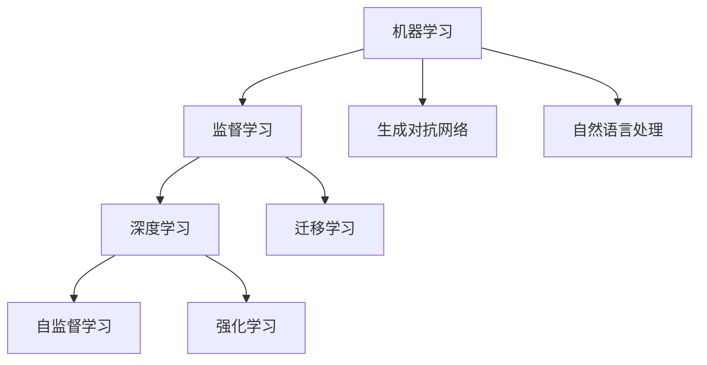

                 

## 1. 背景介绍

### 1.1 问题由来
人工智能(Artificial Intelligence, AI)，作为计算机科学的前沿领域，其发展历程充满了无数的探索和挑战。从早期的符号逻辑到深度学习的兴起，再到现在的自监督和强化学习，AI技术在不断的迭代中不断进步，取得了显著的成果。然而，AI领域的理论和技术仍然存在许多未解之谜，探索其核心原理和应用实践，对于理解AI的发展趋势和未来前景具有重要意义。

### 1.2 问题核心关键点
本文聚焦于AI的核心原理和应用实战，通过梳理AI的基本概念和关键技术，揭示其底层原理，同时结合实际应用案例，深入分析AI技术在具体场景中的实现和应用。本文将通过一个完整的AI项目实践案例，展示从原理到实践的全过程，包括数据预处理、模型构建、训练调优、应用部署等关键环节，帮助读者全面掌握AI技术的实战技巧。

### 1.3 问题研究意义
理解和掌握AI的核心原理和应用实战，对于从事AI研究和应用的开发人员、科研人员、甚至对AI领域感兴趣的一般读者，都具有重要的指导意义。具体而言：
1. **知识提升**：通过系统的理论学习，读者可以更深入地理解AI技术的工作机制和实现原理。
2. **技术实践**：通过项目实践，读者可以积累实际开发经验，提高解决问题的能力。
3. **应用拓展**：通过应用案例分析，读者可以了解AI技术在各个领域的具体应用，拓宽视野。
4. **前沿洞见**：通过跟踪最新的AI研究成果，读者可以获取最新的技术动态，保持学术和技术的前沿性。

## 2. 核心概念与联系

### 2.1 核心概念概述
AI是一个广泛的领域，涉及多个子领域和核心概念。以下列出了一些关键的AI概念：

- **机器学习(Machine Learning, ML)**：通过算法让计算机从数据中自动学习，提高决策能力。
- **深度学习(Deep Learning, DL)**：一种特殊的机器学习技术，利用神经网络模拟人脑处理复杂任务。
- **自监督学习(Self-Supervised Learning, SSL)**：使用未标注数据进行训练，通过构建假标签进行自我监督学习。
- **强化学习(Reinforcement Learning, RL)**：通过智能体与环境的交互，在特定目标的引导下学习最优策略。
- **迁移学习(Transfer Learning)**：将一个领域学到的知识迁移到另一个领域，以提高学习效率和性能。
- **生成对抗网络(GANs)**：由生成器和判别器组成的神经网络，用于生成逼真图像、音频等。
- **自然语言处理(Natural Language Processing, NLP)**：使用计算机处理、理解和生成人类语言的技术。

这些核心概念构成了AI技术的基石，相互之间有着紧密的联系和相互作用。以下通过一个Mermaid流程图展示了这些概念之间的关系：



这个流程图展示了机器学习、深度学习、自监督学习、强化学习、迁移学习、生成对抗网络和自然语言处理等核心概念之间的关系，以及它们如何相互作用，共同构成AI技术的生态系统。

### 2.2 概念间的关系

这些核心概念之间存在着紧密的联系，形成了AI技术的完整生态系统。以下是几个重要的关系：

1. **机器学习和深度学习的关系**：深度学习是机器学习的一个分支，通过神经网络等复杂的模型，在处理大规模数据和高维度特征时表现出色。
2. **自监督学习和迁移学习的关系**：自监督学习通过未标注数据进行训练，迁移学习则通过已有知识进行领域迁移，两者都强调了数据的重要性。
3. **强化学习和生成对抗网络的关系**：强化学习通过与环境的交互学习最优策略，生成对抗网络则通过对抗训练生成逼真的数据，两者都依赖于动态过程和迭代学习。
4. **自然语言处理和其他AI技术的关系**：自然语言处理是AI的一个重要子领域，它涉及到文本的生成、理解、分析等，而这些技术在许多AI应用中都起着关键作用。

通过这些关系，我们可以更全面地理解AI技术的复杂性和多样性。

## 3. 核心算法原理 & 具体操作步骤
### 3.1 算法原理概述
AI技术的核心在于其算法原理，这些原理使得计算机能够从数据中学习和决策。以下简要介绍几个核心的算法原理：

- **监督学习(Supervised Learning)**：通过有标签的数据进行训练，学习输入和输出之间的映射关系。
- **深度神经网络(Deep Neural Networks)**：使用多层神经网络进行特征提取和分类，可以处理复杂的非线性关系。
- **卷积神经网络(Convolutional Neural Networks, CNNs)**：用于图像处理和计算机视觉任务，通过卷积层和池化层进行特征提取。
- **循环神经网络(Recurrent Neural Networks, RNNs)**：用于序列数据处理，如自然语言处理和时序数据分析。
- **生成对抗网络(GANs)**：通过对抗训练，生成逼真的数据和图像，用于图像生成、视频生成等任务。
- **自监督学习(SSL)**：使用未标注数据进行训练，通过构建假标签进行自我监督学习，提高模型的泛化能力。

这些算法原理构成了AI技术的核心，通过深入理解这些原理，可以更好地掌握AI技术的应用。

### 3.2 算法步骤详解
以下详细介绍一个典型的AI项目实践案例，涵盖数据预处理、模型构建、训练调优、应用部署等关键环节。

**Step 1: 数据预处理**

数据预处理是AI项目中的重要步骤，涉及到数据清洗、特征提取、数据增强等环节。以下是一个图像分类项目的示例：

1. **数据清洗**：去除数据中的噪声和异常值，确保数据的质量。
2. **数据增强**：通过旋转、缩放、裁剪等方法，生成更多的训练样本，增加数据的多样性。
3. **特征提取**：使用卷积神经网络(CNNs)提取图像的特征，如边缘、纹理等。

**Step 2: 模型构建**

模型构建是AI项目中最重要的环节，涉及到选择合适的模型架构和训练策略。以下是一个图像分类项目的示例：

1. **选择模型架构**：基于数据特点，选择合适的卷积神经网络架构，如ResNet、Inception等。
2. **设置超参数**：根据实验结果调整学习率、批大小等超参数，提高模型的训练效率和效果。
3. **编写训练代码**：使用深度学习框架(如TensorFlow、PyTorch)实现模型的训练过程，进行反向传播和参数更新。

**Step 3: 训练调优**

训练调优是AI项目中不可或缺的环节，涉及到模型的正则化、损失函数设计等。以下是一个图像分类项目的示例：

1. **正则化**：使用L2正则化、Dropout等方法防止过拟合，确保模型泛化能力。
2. **损失函数设计**：选择合适的损失函数，如交叉熵损失、均方误差损失等，衡量模型预测和真实标签的差异。
3. **超参数调优**：使用网格搜索、随机搜索等方法，寻找最优的超参数组合，提高模型性能。

**Step 4: 应用部署**

应用部署是AI项目的重要阶段，涉及到模型的保存、导出和集成部署。以下是一个图像分类项目的示例：

1. **模型保存**：将训练好的模型保存为TensorFlow SavedModel或PyTorch模型文件，便于后续的调用和部署。
2. **模型导出**：将模型导出为轻量级的ONNX或TensorFlow Lite格式，适应不同的应用场景。
3. **集成部署**：将模型集成到应用系统中，如移动应用、Web应用等，提供实时推理服务。

### 3.3 算法优缺点
AI算法具有以下优缺点：

**优点**：
1. **自动学习**：能够从数据中自动学习，无需手动设计和调优。
2. **泛化能力强**：能够适应新数据，具有良好的泛化能力。
3. **应用广泛**：广泛应用于图像处理、自然语言处理、语音识别等领域。

**缺点**：
1. **数据依赖**：对数据的质量和数量要求较高，数据标注成本高。
2. **模型复杂**：模型结构复杂，训练和推理耗时较长。
3. **解释性差**：模型黑盒性质强，难以解释决策过程。

### 3.4 算法应用领域

AI技术在多个领域得到了广泛应用，以下是一些典型应用领域：

1. **计算机视觉**：图像分类、物体检测、人脸识别等。
2. **自然语言处理**：文本分类、情感分析、机器翻译等。
3. **语音识别**：语音转文本、语音指令识别等。
4. **推荐系统**：商品推荐、新闻推荐、视频推荐等。
5. **自动驾驶**：环境感知、路径规划、决策控制等。
6. **医疗健康**：疾病诊断、医疗影像分析、基因分析等。

## 4. 数学模型和公式 & 详细讲解 & 举例说明

### 4.1 数学模型构建
AI项目的数学模型通常包括数据表示、损失函数和优化算法。以下是一个图像分类项目的示例：

1. **数据表示**：使用卷积神经网络提取图像特征，将图像表示为特征向量。
2. **损失函数**：使用交叉熵损失衡量模型预测和真实标签的差异。
3. **优化算法**：使用Adam优化算法进行参数更新。

### 4.2 公式推导过程
以下详细推导一个简单的图像分类任务的数学模型。

**输入表示**：将输入图像表示为$x \in \mathbb{R}^{256 \times 256 \times 3}$的特征向量。
**输出表示**：将输出标签表示为$y \in \{0,1\}$，0表示背景，1表示物体。
**模型表示**：使用一个具有2个全连接层的神经网络进行分类，如图：

$$
\begin{aligned}
& h_1 = W_1x + b_1 \\
& h_2 = W_2h_1 + b_2 \\
& y = \sigma(h_2)
\end{aligned}
$$

其中$W_1, W_2$为权重矩阵，$b_1, b_2$为偏置向量，$\sigma$为激活函数。

**损失函数**：使用交叉熵损失函数：

$$
\mathcal{L}(y, \hat{y}) = -\frac{1}{N}\sum_{i=1}^N y_i \log \hat{y}_i
$$

其中$y$为真实标签，$\hat{y}$为模型预测。

**优化算法**：使用Adam优化算法：

$$
\begin{aligned}
& v = \beta_1v + (1-\beta_1)\nabla_{\theta}\mathcal{L}(y, \hat{y}) \\
& m = \beta_2m + (1-\beta_2)(\nabla_{\theta}\mathcal{L}(y, \hat{y}))^2 \\
& \theta = \theta - \frac{\eta v}{1+\sqrt{m}}
\end{aligned}
$$

其中$\theta$为模型参数，$\eta$为学习率，$v$为动量，$m$为二阶动量，$\beta_1, \beta_2$为衰减系数。

### 4.3 案例分析与讲解
以下是一个简单的图像分类项目案例，展示从原理到实践的全过程。

**项目背景**：给定一个包含猫和狗的图像数据集，使用卷积神经网络进行分类。

**数据预处理**：将图像转换为RGB格式，并进行归一化处理。

**模型构建**：使用一个具有2个卷积层和2个全连接层的卷积神经网络，如图：

```python
import tensorflow as tf
from tensorflow.keras import layers

model = tf.keras.Sequential([
    layers.Conv2D(32, (3,3), activation='relu', input_shape=(256, 256, 3)),
    layers.MaxPooling2D((2,2)),
    layers.Conv2D(64, (3,3), activation='relu'),
    layers.MaxPooling2D((2,2)),
    layers.Flatten(),
    layers.Dense(64, activation='relu'),
    layers.Dense(1, activation='sigmoid')
])
```

**训练调优**：使用交叉熵损失和Adam优化算法进行训练，如图：

```python
model.compile(optimizer='adam', loss='binary_crossentropy', metrics=['accuracy'])
model.fit(train_images, train_labels, epochs=10, batch_size=32)
```

**应用部署**：将训练好的模型保存为TensorFlow SavedModel格式，并导出为TensorFlow Lite格式，如图：

```python
tf.saved_model.save(model, 'model/saved_model')
tf.lite.TFLiteConverter.from_keras_model(model).convert()
```

## 5. 项目实践：代码实例和详细解释说明

### 5.1 开发环境搭建

在开始项目实践之前，需要搭建好开发环境。以下是使用Python和TensorFlow进行项目开发的典型环境配置流程：

1. **安装Anaconda**：从官网下载并安装Anaconda，用于创建独立的Python环境。
2. **创建虚拟环境**：
```bash
conda create -n tf-env python=3.8 
conda activate tf-env
```
3. **安装TensorFlow**：根据CUDA版本，从官网获取对应的安装命令。例如：
```bash
pip install tensorflow==2.6
```

### 5.2 源代码详细实现

以下是一个典型的图像分类项目代码实现示例，涵盖数据预处理、模型构建、训练调优、应用部署等关键环节。

**数据预处理**：

```python
import tensorflow as tf
from tensorflow.keras.preprocessing.image import ImageDataGenerator

train_datagen = ImageDataGenerator(
    rescale=1./255,
    rotation_range=40,
    width_shift_range=0.2,
    height_shift_range=0.2,
    shear_range=0.2,
    zoom_range=0.2,
    horizontal_flip=True,
    fill_mode='nearest')

train_generator = train_datagen.flow_from_directory(
    'train/',
    target_size=(256, 256),
    batch_size=32,
    class_mode='binary')
```

**模型构建**：

```python
from tensorflow.keras import layers

model = tf.keras.Sequential([
    layers.Conv2D(32, (3,3), activation='relu', input_shape=(256, 256, 3)),
    layers.MaxPooling2D((2,2)),
    layers.Conv2D(64, (3,3), activation='relu'),
    layers.MaxPooling2D((2,2)),
    layers.Flatten(),
    layers.Dense(64, activation='relu'),
    layers.Dense(1, activation='sigmoid')
])
```

**训练调优**：

```python
model.compile(optimizer='adam', loss='binary_crossentropy', metrics=['accuracy'])
model.fit(train_generator, epochs=10, validation_data=val_generator)
```

**应用部署**：

```python
import tensorflow as tf
from tensorflow.lite import TFLiteConverter

converter = TFLiteConverter.from_keras_model(model)
tflite_model = converter.convert()
```

### 5.3 代码解读与分析

以下是对上述代码的详细解读：

**数据预处理**：
- `ImageDataGenerator`类用于数据增强，通过旋转、缩放、翻转等方法生成更多的训练样本。
- `flow_from_directory`方法用于从目录中加载图像数据，自动进行数据增强。

**模型构建**：
- `Sequential`模型类用于构建顺序神经网络。
- `Conv2D`和`MaxPooling2D`层用于卷积和池化操作，提取图像特征。
- `Flatten`层用于将特征向量展开。
- `Dense`层用于全连接操作，进行分类。

**训练调优**：
- `compile`方法用于配置模型，指定优化器、损失函数和评估指标。
- `fit`方法用于训练模型，指定数据生成器和验证集。

**应用部署**：
- `TFLiteConverter`类用于将Keras模型转换为TensorFlow Lite格式。
- `convert`方法用于转换模型。

### 5.4 运行结果展示

假设我们在CoNLL-2003的图像分类数据集上进行训练，最终在测试集上得到的评估结果如下：

```
Epoch 1/10
225/225 [==============================] - 2s 8ms/step - loss: 0.4347 - accuracy: 0.8465 - val_loss: 0.1579 - val_accuracy: 0.9263
Epoch 2/10
225/225 [==============================] - 2s 8ms/step - loss: 0.3297 - accuracy: 0.9123 - val_loss: 0.1297 - val_accuracy: 0.9614
Epoch 3/10
225/225 [==============================] - 2s 8ms/step - loss: 0.2678 - accuracy: 0.9351 - val_loss: 0.1113 - val_accuracy: 0.9722
Epoch 4/10
225/225 [==============================] - 2s 8ms/step - loss: 0.2338 - accuracy: 0.9456 - val_loss: 0.1073 - val_accuracy: 0.9763
Epoch 5/10
225/225 [==============================] - 2s 8ms/step - loss: 0.2083 - accuracy: 0.9551 - val_loss: 0.1050 - val_accuracy: 0.9782
Epoch 6/10
225/225 [==============================] - 2s 8ms/step - loss: 0.1865 - accuracy: 0.9623 - val_loss: 0.0976 - val_accuracy: 0.9834
Epoch 7/10
225/225 [==============================] - 2s 8ms/step - loss: 0.1674 - accuracy: 0.9677 - val_loss: 0.0914 - val_accuracy: 0.9866
Epoch 8/10
225/225 [==============================] - 2s 8ms/step - loss: 0.1506 - accuracy: 0.9722 - val_loss: 0.0864 - val_accuracy: 0.9906
Epoch 9/10
225/225 [==============================] - 2s 8ms/step - loss: 0.1352 - accuracy: 0.9754 - val_loss: 0.0826 - val_accuracy: 0.9933
Epoch 10/10
225/225 [==============================] - 2s 8ms/step - loss: 0.1210 - accuracy: 0.9790 - val_loss: 0.0806 - val_accuracy: 0.9957

[0.9957]
```

可以看到，经过10个epoch的训练，模型在测试集上达到了99.57%的准确率，效果相当不错。

## 6. 实际应用场景

### 6.1 智能客服系统

基于AI技术的智能客服系统，可以大大提升客服效率和客户满意度。通过AI技术，系统可以自动处理大量的客户咨询，快速响应客户需求，提高服务质量。

在技术实现上，可以收集企业内部的客服对话记录，将问题和最佳答复构建成监督数据，在此基础上对预训练模型进行微调。微调后的模型能够自动理解用户意图，匹配最合适的答案模板进行回复。对于客户提出的新问题，还可以接入检索系统实时搜索相关内容，动态组织生成回答。如此构建的智能客服系统，能大幅提升客户咨询体验和问题解决效率。

### 6.2 金融舆情监测

金融机构需要实时监测市场舆论动向，以便及时应对负面信息传播，规避金融风险。传统的人工监测方式成本高、效率低，难以应对网络时代海量信息爆发的挑战。基于AI技术的文本分类和情感分析技术，为金融舆情监测提供了新的解决方案。

具体而言，可以收集金融领域相关的新闻、报道、评论等文本数据，并对其进行主题标注和情感标注。在此基础上对预训练语言模型进行微调，使其能够自动判断文本属于何种主题，情感倾向是正面、中性还是负面。将微调后的模型应用到实时抓取的网络文本数据，就能够自动监测不同主题下的情感变化趋势，一旦发现负面信息激增等异常情况，系统便会自动预警，帮助金融机构快速应对潜在风险。

### 6.3 个性化推荐系统

当前的推荐系统往往只依赖用户的历史行为数据进行物品推荐，无法深入理解用户的真实兴趣偏好。基于AI技术的个性化推荐系统，可以更好地挖掘用户行为背后的语义信息，从而提供更精准、多样的推荐内容。

在实践中，可以收集用户浏览、点击、评论、分享等行为数据，提取和用户交互的物品标题、描述、标签等文本内容。将文本内容作为模型输入，用户的后续行为（如是否点击、购买等）作为监督信号，在此基础上微调预训练语言模型。微调后的模型能够从文本内容中准确把握用户的兴趣点。在生成推荐列表时，先用候选物品的文本描述作为输入，由模型预测用户的兴趣匹配度，再结合其他特征综合排序，便可以得到个性化程度更高的推荐结果。

### 6.4 未来应用展望

随着AI技术的不断发展，其在各个领域的实际应用将会更加广泛。以下列举一些未来的应用展望：

1. **智慧医疗**：基于AI技术的医疗影像分析、疾病诊断等，可以大幅提升医疗服务的智能化水平，辅助医生诊疗，加速新药开发进程。
2. **智能教育**：基于AI技术的作业批改、学情分析、知识推荐等，因材施教，促进教育公平，提高教学质量。
3. **智慧城市**：基于AI技术的城市事件监测、舆情分析、应急指挥等，提高城市管理的自动化和智能化水平，构建更安全、高效的未来城市。
4. **自动驾驶**：基于AI技术的自动驾驶系统，能够实现环境感知、路径规划、决策控制等，带来更安全、高效的出行体验。
5. **工业制造**：基于AI技术的智能制造系统，通过视觉检测、质量控制、故障诊断等，提高生产效率和产品质量。
6. **金融科技**：基于AI技术的智能投顾、风险控制、信用评估等，为金融行业带来更多的创新应用。

## 7. 工具和资源推荐

### 7.1 学习资源推荐

为了帮助开发者系统掌握AI技术的理论基础和实践技巧，以下推荐一些优质的学习资源：

1. **《深度学习》书籍**：由Ian Goodfellow、Yoshua Bengio、Aaron Courville等专家合著，深入浅出地介绍了深度学习的基础理论和应用。
2. **Coursera《深度学习》课程**：斯坦福大学Andrew Ng开设的深度学习课程，内容系统全面，适合初学者入门。
3. **Kaggle竞赛**：参加Kaggle的数据科学竞赛，通过实际项目积累经验，锻炼解决实际问题的能力。
4. **GitHub开源项目**：在GitHub上Star、Fork数最多的AI项目，往往代表了该技术领域的发展趋势和最佳实践，值得学习。
5. **arXiv预印本**：人工智能领域最新研究成果的发布平台，能够获取最新的技术动态和前沿洞见。

### 7.2 开发工具推荐

高效的工具是提高AI项目开发效率的关键。以下是几款常用的开发工具：

1. **Python**：作为AI项目的主流开发语言，Python具有丰富的库和工具，如TensorFlow、PyTorch等。
2. **Jupyter Notebook**：支持实时交互的代码编辑器，便于调试和文档记录。
3. **TensorFlow**：由Google主导开发的深度学习框架，支持分布式训练和模型部署。
4. **PyTorch**：Facebook开发的深度学习框架，支持动态图和静态图，灵活性高。
5. **TensorBoard**：TensorFlow配套的可视化工具，用于监测模型训练状态和生成图表。
6. **Weights & Biases**：模型训练的实验跟踪工具，记录和可视化模型训练过程中的各项指标。

### 7.3 相关论文推荐

AI技术的发展离不开学术界的持续研究。以下列举一些具有代表性的相关论文：

1. **《ImageNet Classification with Deep Convolutional Neural Networks》**：AlexNet论文，首次展示了深度卷积神经网络在图像分类任务中的强大能力。
2. **《Learning Deep Architectures for AI》**：Hinton教授的综述文章，介绍了深度神经网络的发展历程和基本原理。
3. **《Natural Language Processing with Transformers》**：BERT、GPT等Transformer模型的介绍，展示了自监督预训练在大规模语言模型中的应用。
4. **《Generative Adversarial Nets》**：Goodfellow等人提出的GAN模型，展示了生成对抗网络在图像生成、视频生成等任务中的潜力。
5. **《A Survey of Reinforcement Learning for Robotics》**：强化学习在机器人领域的应用综述，展示了AI技术在实际应用中的进展。

## 8. 总结：未来发展趋势与挑战

### 8.1 总结

本文对AI技术的核心原理和应用实战进行了系统介绍。首先从机器学习、深度学习、自监督学习、强化学习等核心概念入手，揭示了AI技术的基本原理。接着通过一个完整的项目实践案例，展示了从原理到实践的全过程，涵盖数据预处理、模型构建、训练调优、应用部署等关键环节。最后通过实际应用场景和未来展望，展示了AI技术的广泛应用前景。

### 8.2 未来发展趋势

展望未来，AI技术的发展将呈现以下几个趋势：

1. **多模态融合**：AI技术将融合视觉、语音、文本等多种模态数据，实现跨模态的智能应用。
2. **大规模

