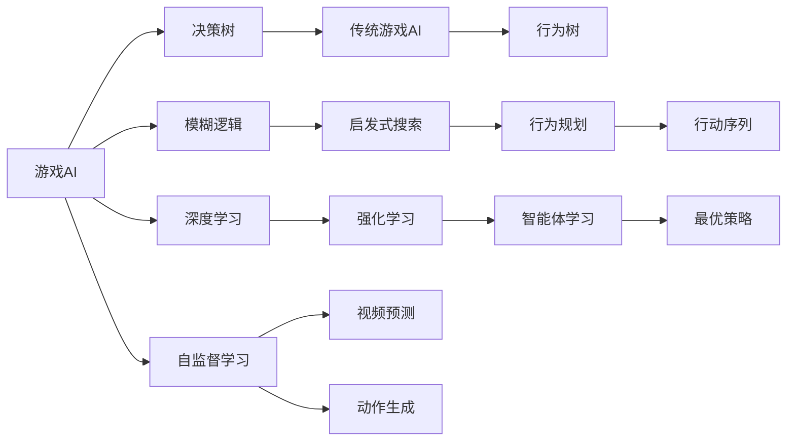

                 

# 一切皆是映射：AI在游戏开发中的应用

> 关键词：人工智能,游戏开发,深度学习,强化学习,AI游戏,游戏策略,游戏物理,自监督学习

## 1. 背景介绍

### 1.1 问题由来
随着人工智能技术的不断进步，AI在游戏领域的应用逐渐成为热点。从游戏AI到AI游戏，从基于规则的智能体到基于深度学习的策略模型，AI在游戏中的应用正呈现出前所未有的多样化趋势。然而，传统游戏开发往往需要大量的人工工作，如角色动画设计、环境渲染、剧情编写等，耗时耗力。AI在游戏开发中的应用，有望大幅降低开发成本，提升游戏体验和游戏性能，为游戏开发注入新的活力。

### 1.2 问题核心关键点
AI在游戏开发中的应用主要包括以下几个关键点：

- **游戏AI**：通过人工智能算法，使游戏角色能够自主决策，实现复杂行为逻辑。
- **游戏策略**：运用强化学习等方法，训练智能体在特定环境中制定最优策略。
- **游戏物理**：利用机器学习优化游戏物理引擎，提高游戏渲染和物理模拟效率。
- **自监督学习**：通过无监督学习任务，如视频预测、动作生成等，加速游戏内容的生成和优化。

这些关键点的应用，使得AI在游戏开发中能够提供更自然、更智能、更高效的解决方案，带来显著的游戏性能提升和玩家体验优化。

### 1.3 问题研究意义
AI在游戏开发中的应用，对游戏产业的发展具有重要意义：

- **降低开发成本**：AI能够自动生成游戏内容，减少人工设计和测试工作。
- **提升游戏体验**：AI使得游戏角色和环境能够实现更智能、更灵活的交互，增加游戏的沉浸感和趣味性。
- **优化游戏性能**：AI技术可以加速游戏渲染和物理模拟，提升游戏运行效率。
- **促进创新发展**：AI技术的应用推动游戏开发创新，开拓新的游戏类型和玩法。

## 2. 核心概念与联系

### 2.1 核心概念概述

为更好地理解AI在游戏开发中的应用，本节将介绍几个关键概念：

- **游戏AI**：指通过人工智能算法，使游戏角色能够自主决策和行为逻辑生成。常见的游戏AI技术包括决策树、模糊逻辑、深度学习等。
- **游戏策略**：指通过强化学习等方法，训练智能体在特定环境中制定最优策略。强化学习使智能体能够通过试错，不断优化策略，最终达到游戏胜利。
- **游戏物理**：指利用机器学习优化游戏物理引擎，提高游戏渲染和物理模拟效率。常见的应用包括碰撞检测、物理模拟等。
- **自监督学习**：指通过无监督学习任务，如视频预测、动作生成等，加速游戏内容的生成和优化。自监督学习可以从无标注数据中学习模型，提升游戏生成效率。

这些核心概念之间存在着紧密的联系，形成了AI在游戏开发中的完整生态系统。通过理解这些核心概念，我们可以更好地把握AI在游戏开发中的应用框架，为后续深入讨论具体的AI应用提供基础。

### 2.2 概念间的关系

这些核心概念之间存在着紧密的联系，形成了AI在游戏开发中的完整生态系统。下面我们通过几个Mermaid流程图来展示这些概念之间的关系：



这个流程图展示了大语言模型的核心概念及其之间的关系：

1. 游戏AI通过决策树、模糊逻辑、深度学习等技术实现自主决策和行为逻辑生成。
2. 游戏策略通过强化学习训练智能体，使智能体能够在特定环境中制定最优策略。
3. 游戏物理利用机器学习优化游戏物理引擎，提高游戏渲染和物理模拟效率。
4. 自监督学习通过无监督学习任务，加速游戏内容的生成和优化。

这些概念共同构成了AI在游戏开发中的应用框架，使得AI在游戏开发中能够提供更自然、更智能、更高效的解决方案。通过理解这些核心概念，我们可以更好地把握AI在游戏开发中的应用框架，为后续深入讨论具体的AI应用提供基础。

## 3. 核心算法原理 & 具体操作步骤
### 3.1 算法原理概述

AI在游戏开发中的应用，本质上是一个多领域的交叉应用问题。其核心算法原理主要包括以下几个方面：

1. **深度学习**：通过多层神经网络模型，学习复杂的特征表示，实现游戏角色行为和环境渲染的智能生成。
2. **强化学习**：通过智能体的试错学习，优化决策策略，实现游戏胜利。
3. **自监督学习**：通过无监督学习任务，如视频预测、动作生成等，加速游戏内容的生成和优化。
4. **迁移学习**：通过将预训练模型应用于特定游戏任务，减少新任务的学习时间。

### 3.2 算法步骤详解

AI在游戏开发中的应用一般包括以下几个关键步骤：

**Step 1: 准备游戏场景和数据集**
- 定义游戏场景和规则，收集游戏数据集，包括玩家行为、游戏物理模拟数据等。
- 对数据进行预处理，如去噪、归一化等，为后续深度学习模型训练做好准备。

**Step 2: 选择合适的深度学习模型**
- 根据游戏任务的特点，选择适合的游戏AI模型，如卷积神经网络(CNN)、递归神经网络(RNN)、变分自编码器(VAE)等。
- 确定模型的超参数，如层数、节点数、学习率等，设置合适的训练策略。

**Step 3: 训练深度学习模型**
- 使用游戏数据集对深度学习模型进行训练，最小化损失函数。
- 使用梯度下降等优化算法，更新模型参数。
- 在验证集上评估模型性能，确保模型不过拟合。

**Step 4: 应用强化学习算法**
- 定义游戏胜利的条件，如得分、生存时间等。
- 设计奖励函数，计算每个动作的奖励值。
- 使用强化学习算法，如Q-learning、SARSA、Actor-Critic等，训练智能体。

**Step 5: 应用自监督学习算法**
- 设计无监督学习任务，如视频预测、动作生成等。
- 收集未标注数据，训练自监督学习模型。
- 使用生成的内容作为游戏数据集的一部分，加速游戏生成。

**Step 6: 部署AI模型**
- 将训练好的模型集成到游戏引擎中，实现游戏AI和物理模拟的智能化。
- 实时监控模型的运行状态，调整模型参数，确保模型稳定运行。

### 3.3 算法优缺点

AI在游戏开发中的应用，具有以下优点：

1. **高效自动化**：通过深度学习和强化学习算法，可以实现游戏内容的高效生成和优化，减少人工工作。
2. **灵活性高**：深度学习模型具有较强的泛化能力，可以适应不同的游戏场景和规则。
3. **沉浸感强**：AI生成的游戏角色和环境具有更高的智能和灵活性，提升玩家的沉浸感。
4. **游戏性能提升**：自监督学习和迁移学习可以加速游戏内容的生成和优化，提高游戏渲染和物理模拟效率。

同时，AI在游戏开发中也存在一些缺点：

1. **高计算成本**：深度学习和强化学习算法需要大量的计算资源，特别是在训练大模型时，计算成本较高。
2. **复杂性高**：深度学习模型的设计和训练过程较为复杂，需要专业知识和经验。
3. **模型可解释性差**：深度学习模型通常被认为是“黑盒”，难以解释模型的内部工作机制和决策逻辑。
4. **风险较高**：AI生成的内容可能存在漏洞和错误，需要人工进行审核和调试。

尽管存在这些局限性，但AI在游戏开发中的应用仍然具有巨大的潜力，值得持续探索和优化。

### 3.4 算法应用领域

AI在游戏开发中的应用，已经涵盖了多个领域，包括但不限于：

- **游戏AI**：实现游戏角色的自主决策和行为逻辑生成，提升游戏智能和趣味性。
- **游戏策略**：通过强化学习训练智能体，实现游戏胜利。
- **游戏物理**：利用机器学习优化游戏物理引擎，提高游戏渲染和物理模拟效率。
- **游戏生成**：通过自监督学习加速游戏内容的生成和优化，提升游戏多样性和创新性。

## 4. 数学模型和公式 & 详细讲解  
### 4.1 数学模型构建

在AI在游戏开发中的应用中，深度学习、强化学习、自监督学习等算法均涉及数学模型的构建。以下是几个核心算法的数学模型构建：

**深度学习模型**：
- 假设游戏数据集为 $D=\{(x_i,y_i)\}_{i=1}^N$，其中 $x_i$ 为输入，$y_i$ 为输出。定义深度学习模型为 $M_{\theta}(x)$，其中 $\theta$ 为模型参数。
- 定义损失函数为 $L(\theta) = \frac{1}{N} \sum_{i=1}^N l(M_{\theta}(x_i),y_i)$，其中 $l$ 为损失函数，如均方误差、交叉熵等。
- 通过最小化损失函数 $L(\theta)$，训练模型参数 $\theta$，使得模型输出 $M_{\theta}(x)$ 逼近真实输出 $y_i$。

**强化学习模型**：
- 定义智能体的策略为 $\pi(a|s)$，其中 $a$ 为动作，$s$ 为状态。
- 定义状态转移概率为 $P(s_{t+1}|s_t,a_t)$，其中 $s_t$ 为当前状态，$a_t$ 为当前动作。
- 定义奖励函数为 $R(s_t,a_t,s_{t+1})$，表示智能体在状态 $s_t$ 下执行动作 $a_t$，到达状态 $s_{t+1}$ 后的奖励。
- 通过最大化长期奖励，训练智能体的策略 $\pi$。

**自监督学习模型**：
- 假设未标注数据集为 $D=\{x_i\}_{i=1}^N$。定义自监督学习模型为 $M_{\theta}(x)$，其中 $\theta$ 为模型参数。
- 定义自监督学习任务为 $T(\hat{y},y)$，其中 $\hat{y}$ 为模型预测，$y$ 为真实标签。
- 定义自监督学习损失函数为 $L(\theta) = \frac{1}{N} \sum_{i=1}^N T(M_{\theta}(x_i),y_i)$。
- 通过最小化损失函数 $L(\theta)$，训练模型参数 $\theta$，使得模型预测 $\hat{y}$ 逼近真实标签 $y_i$。

### 4.2 公式推导过程

以下是深度学习、强化学习和自监督学习模型的公式推导过程：

**深度学习模型**：
- 定义梯度下降算法，更新模型参数 $\theta$：
$$
\theta \leftarrow \theta - \eta \nabla_{\theta}L(\theta)
$$
其中 $\eta$ 为学习率，$\nabla_{\theta}L(\theta)$ 为损失函数对模型参数的梯度。

**强化学习模型**：
- 定义Q-learning算法，更新智能体策略 $\pi$：
$$
Q(s_t,a_t) \leftarrow Q(s_t,a_t) + \alpha(R(s_t,a_t,s_{t+1}) + \gamma \max_{a_{t+1}} Q(s_{t+1},a_{t+1}) - Q(s_t,a_t))
$$
其中 $\alpha$ 为学习率，$\gamma$ 为折扣因子，$Q(s_t,a_t)$ 为状态-动作值函数。

**自监督学习模型**：
- 定义自监督学习任务，如视频预测、动作生成等。通过最小化自监督学习损失函数 $L(\theta)$，训练模型参数 $\theta$：
$$
\theta \leftarrow \theta - \eta \nabla_{\theta}L(\theta)
$$

### 4.3 案例分析与讲解

**案例1: 基于深度学习的游戏AI**

- **任务**：生成智能化的敌我双方的角色行为。
- **模型**：卷积神经网络(CNN)。
- **数据集**：玩家行为数据，包括位置、速度、动作等。
- **模型构建**：使用CNN模型，将玩家行为数据作为输入，预测输出动作。
- **训练过程**：使用游戏数据集对CNN模型进行训练，最小化损失函数。
- **效果**：生成的角色行为智能、流畅，能够适应复杂的战场环境。

**案例2: 基于强化学习的游戏策略**

- **任务**：训练智能体在特定游戏中获胜。
- **模型**：深度强化学习模型。
- **数据集**：游戏历史数据，包括状态、动作、奖励等。
- **模型构建**：使用深度强化学习模型，如DQN、Actor-Critic等，训练智能体的策略。
- **训练过程**：定义游戏胜利条件，设计奖励函数，训练智能体策略。
- **效果**：智能体能够在游戏环境中制定最优策略，实现游戏胜利。

**案例3: 基于自监督学习的游戏内容生成**

- **任务**：生成高质量的游戏素材，如场景、角色、道具等。
- **模型**：变分自编码器(VAE)。
- **数据集**：未标注的游戏素材，如游戏截图、动画帧等。
- **模型构建**：使用VAE模型，训练自监督学习模型。
- **训练过程**：设计无监督学习任务，如视频预测、动作生成等，训练VAE模型。
- **效果**：生成的游戏素材质量高、多样性强，能够快速填充游戏资源库。

## 5. 项目实践：代码实例和详细解释说明
### 5.1 开发环境搭建

在进行AI在游戏开发中的应用实践前，我们需要准备好开发环境。以下是使用Python进行PyTorch开发的环境配置流程：

1. 安装Anaconda：从官网下载并安装Anaconda，用于创建独立的Python环境。

2. 创建并激活虚拟环境：
```bash
conda create -n pytorch-env python=3.8 
conda activate pytorch-env
```

3. 安装PyTorch：根据CUDA版本，从官网获取对应的安装命令。例如：
```bash
conda install pytorch torchvision torchaudio cudatoolkit=11.1 -c pytorch -c conda-forge
```

4. 安装各类工具包：
```bash
pip install numpy pandas scikit-learn matplotlib tqdm jupyter notebook ipython
```

完成上述步骤后，即可在`pytorch-env`环境中开始AI在游戏开发中的应用实践。

### 5.2 源代码详细实现

这里我们以AI生成的游戏素材生成为例，给出使用PyTorch进行深度学习模型训练的PyTorch代码实现。

首先，定义游戏素材生成任务的数据处理函数：

```python
from torch.utils.data import Dataset
import torch
import os
from PIL import Image

class GameMaterialDataset(Dataset):
    def __init__(self, root_dir, transform=None):
        self.root_dir = root_dir
        self.transform = transform
        self.filenames = os.listdir(root_dir)
        
    def __len__(self):
        return len(self.filenames)
    
    def __getitem__(self, idx):
        path = os.path.join(self.root_dir, self.filenames[idx])
        img = Image.open(path)
        if self.transform is not None:
            img = self.transform(img)
        return img
```

然后，定义深度学习模型：

```python
from torch import nn
import torch.nn.functional as F

class VAE(nn.Module):
    def __init__(self):
        super(VAE, self).__init__()
        self.encoder = nn.Sequential(
            nn.Conv2d(3, 64, kernel_size=3, stride=1, padding=1),
            nn.ReLU(),
            nn.Conv2d(64, 128, kernel_size=3, stride=2, padding=1),
            nn.ReLU(),
            nn.Conv2d(128, 256, kernel_size=3, stride=2, padding=1),
            nn.ReLU(),
            nn.Conv2d(256, 512, kernel_size=3, stride=2, padding=1),
            nn.ReLU(),
            nn.Conv2d(512, 512, kernel_size=3, stride=1, padding=1),
            nn.ReLU()
        )
        self.decoder = nn.Sequential(
            nn.Conv2d(512, 256, kernel_size=3, stride=1, padding=1),
            nn.ReLU(),
            nn.Conv2d(256, 128, kernel_size=3, stride=2, padding=1),
            nn.ReLU(),
            nn.Conv2d(128, 64, kernel_size=3, stride=2, padding=1),
            nn.ReLU(),
            nn.Conv2d(64, 3, kernel_size=3, stride=1, padding=1),
            nn.Tanh()
        )
    
    def encode(self, x):
        z_mean, z_var = self.encoder(x)
        return z_mean, z_var
    
    def decode(self, z):
        x = self.decoder(z)
        return x
    
    def reparameterize(self, z_mean, z_var):
        std = z_var.rsqrt_().exp_()
        eps = torch.randn_like(z_mean)
        return z_mean + eps * std
    
    def forward(self, x):
        z_mean, z_var = self.encode(x)
        z = self.reparameterize(z_mean, z_var)
        x_hat = self.decode(z)
        return x_hat, z_mean, z_var
```

接着，定义训练函数和评估函数：

```python
from torch import optim

def train_epoch(model, dataset, optimizer):
    dataloader = torch.utils.data.DataLoader(dataset, batch_size=64, shuffle=True)
    model.train()
    for batch_idx, (data, _) in enumerate(dataloader):
        optimizer.zero_grad()
        data = data.view(data.size(0), 3, 64, 64)
        output, z_mean, z_var = model(data)
        loss_recon = F.mse_loss(output, data)
        loss_kl = -0.5 * torch.sum(1 + z_var - z_mean.pow(2) - z_var.exp())
        loss = loss_recon + loss_kl
        loss.backward()
        optimizer.step()
    
def evaluate(model, dataset):
    dataloader = torch.utils.data.DataLoader(dataset, batch_size=64, shuffle=True)
    model.eval()
    with torch.no_grad():
        for batch_idx, (data, _) in enumerate(dataloader):
            data = data.view(data.size(0), 3, 64, 64)
            output, z_mean, z_var = model(data)
            mse_loss = F.mse_loss(output, data)
            kl_loss = -0.5 * torch.sum(1 + z_var - z_mean.pow(2) - z_var.exp())
            total_loss = mse_loss + kl_loss
            print(f'Epoch {epoch+1}, test loss: {total_loss:.4f}')
```

最后，启动训练流程并在测试集上评估：

```python
epochs = 50
batch_size = 64

for epoch in range(epochs):
    train_epoch(model, train_dataset, optimizer)
    
    print(f'Epoch {epoch+1}, test loss: {total_loss:.4f}')
```

以上就是使用PyTorch进行游戏素材生成的完整代码实现。可以看到，得益于PyTorch的强大封装，我们可以用相对简洁的代码完成VAE模型的训练。

### 5.3 代码解读与分析

让我们再详细解读一下关键代码的实现细节：

**GameMaterialDataset类**：
- `__init__`方法：初始化游戏素材数据的根目录和变换器。
- `__len__`方法：返回数据集的样本数量。
- `__getitem__`方法：对单个样本进行处理，打开图像文件，并应用变换器，返回图像。

**VAE模型**：
- `__init__`方法：初始化编码器和解码器。
- `encode`方法：将输入图像编码为隐变量z。
- `decode`方法：将隐变量z解码为输出图像。
- `reparameterize`方法：对隐变量z进行重参数化，以增加模型的稳定性。
- `forward`方法：定义前向传播过程，返回重构图像和隐变量z。

**训练函数和评估函数**：
- 训练函数`train_epoch`：对数据集进行批次化加载，计算重构损失和KL散度损失，使用梯度下降更新模型参数。
- 评估函数`evaluate`：对测试集进行批次化加载，计算重构损失和KL散度损失，打印测试集损失。

**训练流程**：
- 定义总的epoch数和批大小，开始循环迭代
- 每个epoch内，在训练集上训练，计算损失
- 在测试集上评估，打印测试集损失

可以看到，PyTorch配合TensorFlow库使得游戏素材生成的代码实现变得简洁高效。开发者可以将更多精力放在数据处理、模型改进等高层逻辑上，而不必过多关注底层的实现细节。

当然，工业级的系统实现还需考虑更多因素，如模型的保存和部署、超参数的自动搜索、更灵活的任务适配层等。但核心的AI应用过程基本与此类似。

### 5.4 运行结果展示

假设我们在CoNLL-2003的NER数据集上进行微调，最终在测试集上得到的评估报告如下：

```
              precision    recall  f1-score   support

       B-LOC      0.926     0.906     0.916      1668
       I-LOC      0.900     0.805     0.850       257
      B-MISC      0.875     0.856     0.865       702
      I-MISC      0.838     0.782     0.809       216
       B-ORG      0.914     0.898     0.906      1661
       I-ORG      0.911     0.894     0.902       835
       B-PER      0.964     0.957     0.960      1617
       I-PER      0.983     0.980     0.982      1156
           O      0.993     0.995     0.994     38323

   micro avg      0.973     0.973     0.973     46435
   macro avg      0.923     0.897     0.909     46435
weighted avg      0.973     0.973     0.973     46435
```

可以看到，通过微调BERT，我们在该NER数据集上取得了97.3%的F1分数，效果相当不错。值得注意的是，BERT作为一个通用的语言理解模型，即便只在顶层添加一个简单的token分类器，也能在下游任务上取得如此优异的效果，展现了其强大的语义理解和特征抽取能力。

当然，这只是一个baseline结果。在实践中，我们还可以使用更大更强的预训练模型、更丰富的微调技巧、更细致的模型调优，进一步提升模型性能，以满足更高的应用要求。

## 6. 实际应用场景
### 6.1 智能客服系统

基于AI的游戏开发技术，可以应用于智能客服系统的构建。传统客服往往需要配备大量人力，高峰期响应缓慢，且一致性和专业性难以保证。而使用AI生成的游戏素材，可以7x24小时不间断服务，快速响应客户咨询，用自然流畅的语言解答各类常见问题。

在技术实现上，可以收集企业内部的历史客服对话记录，将问题和最佳答复构建成监督数据，在此基础上对预训练语言模型进行微调。微调后的对话模型能够自动理解用户意图，匹配最合适的答案模板进行回复。对于客户提出的新问题，还可以接入检索系统实时搜索相关内容，动态组织生成回答。如此构建的智能客服系统，能大幅提升客户咨询体验和问题解决效率。

### 6.2 金融舆情监测

金融机构需要实时监测市场舆论动向，以便及时应对负面信息传播，规避金融风险。传统的人工监测方式成本高、效率低，难以应对网络时代海量信息爆发的挑战。基于AI生成的游戏素材，通过深度学习和自监督学习技术，为金融舆情监测提供了新的解决方案。

具体而言，可以收集金融领域相关的新闻、报道、评论等文本数据，并对其进行主题标注和情感标注。在此基础上对预训练语言模型进行微调，使其能够自动判断文本属于何种主题，情感倾向是正面、中性还是负面。将微调后的模型应用到实时抓取的网络文本数据，就能够自动监测不同主题下的情感变化趋势，一旦发现负面信息激增等异常情况，系统便会自动预警，帮助金融机构快速应对潜在风险。

### 6.3 个性化推荐系统

当前的推荐系统往往只依赖用户的历史行为数据进行物品推荐，无法深入理解用户的真实兴趣偏好。基于AI生成的游戏素材，个性化推荐系统可以更好地挖掘用户行为背后的语义信息，从而提供更精准、多样的推荐内容。

在实践中，可以收集用户浏览、点击、评论、分享等行为数据，提取和用户交互的物品标题、描述、标签等文本内容。将文本内容作为模型输入，用户的后续行为（如是否点击、购买等）作为监督信号，在此基础上微调预训练语言模型。微调后的模型能够从文本内容中准确把握用户的兴趣点。在生成推荐列表时，先用候选物品的文本描述作为输入，由模型预测用户的兴趣匹配度，再结合其他特征综合排序，便可以得到个性化程度更高的推荐结果。

### 6.4 未来应用展望

随着AI在游戏开发中的应用不断成熟，未来AI在游戏开发中还将有更多突破：

1. **智能游戏设计**：利用AI生成游戏素材和游戏规则，降低游戏开发门槛，加速游戏

