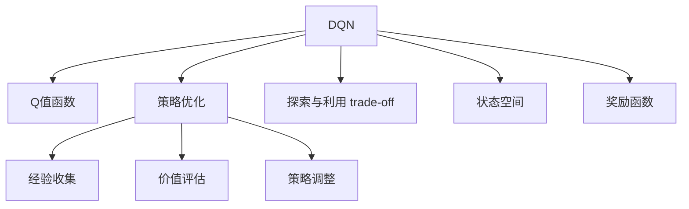
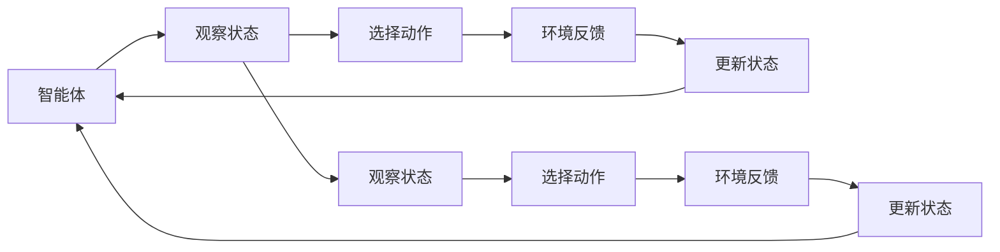
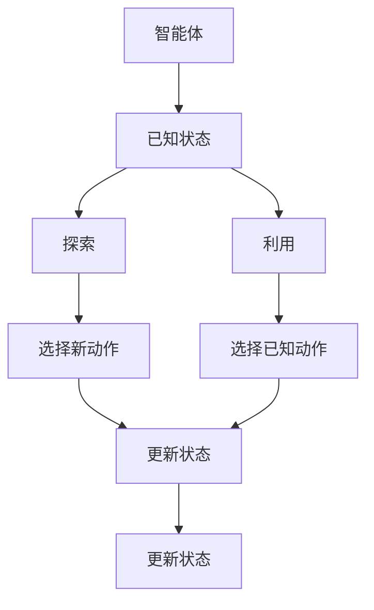
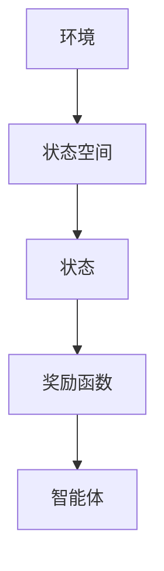
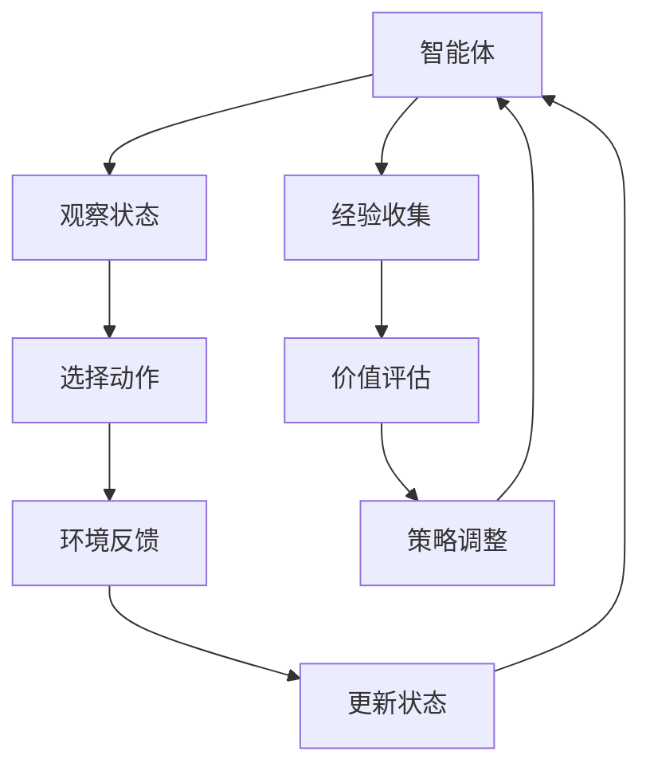
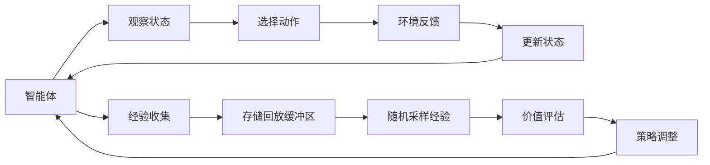

                 

# 一切皆是映射：DQN学习过程的可视化技术及其价值

> 关键词：强化学习,深度强化学习,深度神经网络,行为研究,动作理解,决策制定,探索与利用 trade-off,离散化,状态空间,奖励函数,策略优化

## 1. 背景介绍

### 1.1 问题由来
强化学习(Reinforcement Learning, RL)是人工智能领域的一个重要分支，专注于如何让智能体在未知环境中通过试错学习，达到某个目标。DQN（Deep Q-Network，深度Q网络）是RL中的一种重要算法，通过深度神经网络实现对Q值函数的逼近，从而优化策略，指导智能体行动。DQN在许多复杂环境和决策问题上展示了卓越的表现，但DQN的学习过程复杂且难以直观理解，如何高效地进行学习过程的可视化，是当前研究的热点问题之一。

### 1.2 问题核心关键点
DQN通过不断收集经验，在状态-动作对的价值函数上进行调整，从而优化策略，达到目标状态。学习过程中，智能体通过观察当前状态，选择动作，并接收到环境反馈。核心问题在于，如何在不断变化的环境中，通过有限的反馈，发现最优的策略。

DQN的学习过程主要分为以下几个关键步骤：
1. 收集经验（观察状态-动作-奖励序列）。
2. 评估当前状态-动作对的价值。
3. 根据经验调整价值函数。
4. 根据价值函数选择动作。

如何高效可视化这些步骤，展示智能体学习过程，揭示探索与利用的平衡，是本节关注的重点。

### 1.3 问题研究意义
DQN的可视化研究对于提升算法理解、优化学习过程、推动RL技术的普及和应用具有重要意义：

1. 深入理解DQN学习机制。可视化使研究者能够更直观地观察DQN学习过程，理解其内部决策机制。
2. 优化学习参数。通过可视化技术，可实时监控DQN训练过程，及时发现问题并优化超参数设置。
3. 提高可解释性。通过可视化结果，分析智能体决策过程，提升算法的可解释性。
4. 促进教学和研究。DQN的可视化材料可作为教学资源，帮助更多人理解RL技术，推动相关研究的发展。

## 2. 核心概念与联系

### 2.1 核心概念概述

为了更好地理解DQN的可视化过程，本节将介绍几个密切相关的核心概念：

- DQN：一种基于深度神经网络的强化学习算法，通过近似Q值函数进行策略优化，适用于复杂的决策问题。
- Q值函数：定义在状态-动作对上的函数，表示从当前状态出发，采取某动作所期望的长期累积奖励。
- 策略优化：通过学习Q值函数，优化策略，使智能体在给定状态下选择最优动作。
- 探索与利用 trade-off：智能体在决策时需要在探索未知状态与利用已知状态间进行权衡。
- 状态空间：环境中的所有可能状态组合，状态空间的大小对DQN的训练复杂度有重要影响。
- 奖励函数：定义智能体在每个状态下获得的奖励，奖励函数的设计对DQN的性能有显著影响。

这些核心概念之间的逻辑关系可以通过以下Mermaid流程图来展示：



这个流程图展示了大语言模型的核心概念及其之间的关系：

1. DQN通过近似Q值函数进行策略优化。
2. Q值函数在状态-动作对上的评估是DQN的核心。
3. 策略优化通过探索与利用 trade-off实现，在已知状态和未知状态间进行决策。
4. 状态空间的大小直接影响DQN的训练复杂度。
5. 奖励函数的设计对DQN的性能有重要影响。

这些核心概念共同构成了DQN的框架，使其能够在复杂环境中进行学习和决策。

### 2.2 概念间的关系

这些核心概念之间存在着紧密的联系，形成了DQN的完整框架。下面我们通过几个Mermaid流程图来展示这些概念之间的关系。

#### 2.2.1 DQN学习过程


这个流程图展示了DQN学习的基本流程。智能体通过观察当前状态，选择动作，并接收到环境反馈，更新状态。然后重复这一过程，直到达到目标状态。

#### 2.2.2 探索与利用 trade-off


这个流程图展示了探索与利用 trade-off的过程。智能体在已知状态时，选择利用已知动作；在未知状态时，选择探索新动作。

#### 2.2.3 状态空间与奖励函数


这个流程图展示了状态空间与奖励函数的关系。状态空间中的每个状态，都有对应的奖励函数，指导智能体的行为。

### 2.3 核心概念的整体架构

最后，我们用一个综合的流程图来展示这些核心概念在DQN学习过程中的整体架构：



这个综合流程图展示了DQN学习过程中的各个关键步骤。智能体通过观察状态，选择动作，接收到环境反馈，更新状态，然后通过经验收集、价值评估和策略调整，不断优化其决策策略，达到目标状态。

## 3. 核心算法原理 & 具体操作步骤
### 3.1 算法原理概述

DQN通过近似Q值函数进行策略优化，其核心思想是：智能体在每次行动后，根据当前状态和动作选择，通过经验回放和价值评估，调整Q值函数，优化策略。具体来说，DQN通过以下步骤实现学习：

1. 收集状态-动作-奖励序列。
2. 存储经验回放缓冲区。
3. 从缓冲区中随机采样经验。
4. 使用目标网络评估Q值。
5. 使用当前网络更新目标网络。
6. 使用目标网络选择动作。

核心算法原理可以通过以下示意图表示：



这个示意图展示了DQN学习的基本流程。智能体通过观察状态，选择动作，接收到环境反馈，更新状态，然后通过经验收集和价值评估，调整策略，实现最优行动。

### 3.2 算法步骤详解

DQN的实现涉及多个关键步骤，具体包括：

1. 收集经验：智能体通过与环境的交互，收集状态-动作-奖励序列。
2. 存储回放缓冲区：将收集的经验存储到回放缓冲区，用于后续的价值评估和策略调整。
3. 随机采样经验：从回放缓冲区中随机采样一批经验进行训练。
4. 价值评估：使用目标网络对采样经验进行Q值评估。
5. 策略调整：使用当前网络更新目标网络，根据Q值评估结果调整动作选择策略。
6. 更新目标网络：将当前网络参数赋值给目标网络，完成网络间切换。

这些步骤通过代码实现，具体步骤如下：

**Step 1: 准备训练环境**

```python
import gym
import numpy as np

env = gym.make('CartPole-v0')
state_dim = env.observation_space.shape[0]
action_dim = env.action_space.n
```

**Step 2: 定义网络结构**

```python
import tensorflow as tf
from tensorflow.keras import layers

class DQN(tf.keras.Model):
    def __init__(self, state_dim, action_dim):
        super(DQN, self).__init__()
        self.fc1 = layers.Dense(64, activation='relu', input_shape=(state_dim,))
        self.fc2 = layers.Dense(64, activation='relu')
        self.fc3 = layers.Dense(action_dim, activation='linear')
    
    def call(self, x):
        x = self.fc1(x)
        x = self.fc2(x)
        return self.fc3(x)
```

**Step 3: 初始化网络参数**

```python
target_network = DQN(state_dim, action_dim)
current_network = DQN(state_dim, action_dim)
```

**Step 4: 定义经验回放缓冲区**

```python
buffer_size = 100000
buffer = []

def store_experience(state, action, reward, next_state, done):
    experience = (state, action, reward, next_state, done)
    if len(buffer) < buffer_size:
        buffer.append(experience)
    else:
        buffer.pop(0)
        buffer.append(experience)
```

**Step 5: 实现价值评估和策略调整**

```python
def get_q_value(state, action, network):
    state = np.reshape(state, (1, state_dim))
    action = np.reshape(action, (1, action_dim))
    q_value = network(state)
    q_value = np.reshape(q_value, (1, action_dim))
    q_value[action] = 0
    return q_value[0]

def choose_action(state, network, epsilon=0.1):
    state = np.reshape(state, (1, state_dim))
    q_value = network(state)
    q_value = np.reshape(q_value, (1, action_dim))
    if np.random.rand() < epsilon:
        action = np.random.choice([0, 1])
    else:
        action = np.argmax(q_value)
    return action

def update_network(target_network, current_network, alpha=0.01):
    for target, current in zip(target_network.layers, current_network.layers):
        target.set_weights(current.get_weights())
```

**Step 6: 实现训练循环**

```python
batch_size = 32
target_network.trainable = False

def train():
    batch = np.random.choice(len(buffer), batch_size, replace=False)
    states = np.vstack([buffer[i][0] for i in batch])
    actions = np.vstack([buffer[i][1] for i in batch])
    rewards = np.vstack([buffer[i][2] for i in batch])
    next_states = np.vstack([buffer[i][3] for i in batch])
    dones = np.vstack([buffer[i][4] for i in batch])
    q_values = []
    for i in range(len(batch)):
        next_state = next_states[i]
        next_q_value = get_q_value(next_state, actions[i], target_network)
        target = rewards[i] + 0.99 * next_q_value * (1 - dones[i])
        q_value = get_q_value(states[i], actions[i], current_network)
        q_values.append(target - q_value)
    for i in range(len(batch)):
        if dones[i]:
            q_value = np.reshape(get_q_value(states[i], actions[i], current_network), (1, 1))
        else:
            q_value = np.reshape(get_q_value(states[i], actions[i], current_network), (1, 1))
        q_value[actions[i]] = q_values[i]
    current_network.trainable = True
    current_network.update_target(target_network)
    current_network.trainable = False
```

### 3.3 算法优缺点

DQN的优点包括：
1. 适用于复杂决策问题。DQN能够处理非线性决策问题，适用于环境和决策空间的复杂性。
2. 具有自我学习能力。DQN能够通过经验回放和价值评估，自我优化策略，无需人类干预。
3. 可扩展性强。DQN通过网络结构扩展，可以处理更大、更复杂的状态空间。

DQN的缺点包括：
1. 存在过拟合风险。当状态空间和动作空间较大时，DQN可能过拟合，导致泛化能力差。
2. 需要大量数据。DQN的学习过程需要大量数据进行经验回放，数据稀缺可能导致性能下降。
3. 训练复杂度高。DQN需要处理大量状态和动作，训练复杂度高。

尽管存在这些局限性，但DQN仍是RL领域的重要算法之一，适用于许多复杂环境中的决策问题。

### 3.4 算法应用领域

DQN已在许多实际应用中得到了成功应用，涵盖游戏、机器人控制、自然语言处理等多个领域，具体包括：

1. 游戏AI：通过DQN学习最优策略，击败人类选手。
2. 机器人控制：通过DQN实现机器人的自主导航、抓取和定位。
3. 自然语言处理：通过DQN学习语言模型，实现自动文本生成、翻译和摘要。
4. 金融市场：通过DQN学习交易策略，优化投资组合。
5. 供应链管理：通过DQN优化库存管理，降低成本。
6. 医疗诊断：通过DQN学习诊断策略，提高诊断准确率。
7. 物流管理：通过DQN优化配送路线，提高物流效率。

这些应用场景展示了DQN的强大潜力和广泛适用性，为其进一步发展奠定了坚实的基础。

## 4. 数学模型和公式 & 详细讲解 & 举例说明

### 4.1 数学模型构建

DQN的数学模型基于Q值函数，通过不断收集经验，调整Q值函数，优化策略。假设状态空间为 $S$，动作空间为 $A$，状态-动作对的Q值函数为 $Q(s,a)$，则DQN的目标是最小化经验回放缓冲区中的状态-动作对的损失函数，即：

$$
\min_{\theta} \frac{1}{N} \sum_{i=1}^N \left[ Q(s_i,a_i) - (r_i + \gamma \max_{a'} Q(s_{i+1},a')) \right]^2
$$

其中，$\theta$ 为网络参数，$(s_i,a_i)$ 为第 $i$ 次经验中的状态-动作对，$r_i$ 为第 $i$ 次动作的即时奖励，$s_{i+1}$ 为执行动作后的下一个状态，$\gamma$ 为折扣因子。

### 4.2 公式推导过程

DQN的训练过程可以分为以下步骤：
1. 从回放缓冲区中随机采样一批状态-动作-奖励序列。
2. 对于每个状态-动作对，计算其Q值和目标Q值。
3. 计算损失函数，反向传播更新网络参数。
4. 更新目标网络，保持两者参数差异。

具体推导如下：

设样本 $(s_i,a_i,r_i,s_{i+1},d_i)$ 为回放缓冲区中的一条经验。根据DQN的目标函数，目标Q值为：

$$
Q_{\theta^*}(s_i,a_i) = r_i + \gamma \max_{a'} Q_{\theta}(s_{i+1},a')
$$

在训练过程中，使用当前网络 $Q_{\theta}$ 评估Q值，得到 $Q_{\theta}(s_i,a_i)$。计算损失函数 $\mathcal{L}(\theta)$ 为：

$$
\mathcal{L}(\theta) = \frac{1}{N} \sum_{i=1}^N \left[ Q_{\theta}(s_i,a_i) - Q_{\theta^*}(s_i,a_i) \right]^2
$$

通过梯度下降算法，最小化损失函数，更新网络参数 $\theta$。最终得到最优策略 $Q_{\theta^*}$。

### 4.3 案例分析与讲解

以下通过一个简单的示例，演示DQN的训练过程和价值评估。

假设有一个简单的环境，状态空间为 $S=[0,1]$，动作空间为 $A=\{0,1\}$，环境按照状态值和动作值线性变化，即 $s_{i+1} = 0.9s_i + a_i$。奖励函数为 $r_i = 1 - s_i^2$。智能体通过DQN学习最优策略。

具体步骤如下：

1. 初始化智能体的策略 $Q_{\theta}$ 和目标网络 $Q_{\theta^*}$。
2. 从环境中选择动作，接收到奖励和下一个状态，存储经验。
3. 从回放缓冲区中随机采样一批经验。
4. 使用目标网络计算目标Q值，计算损失函数。
5. 更新当前网络参数，调整策略。
6. 更新目标网络，保持参数差异。

通过不断重复这一过程，DQN逐渐优化策略，达到最优动作选择。

## 5. 项目实践：代码实例和详细解释说明
### 5.1 开发环境搭建

在进行DQN实践前，我们需要准备好开发环境。以下是使用Python进行TensorFlow开发的环境配置流程：

1. 安装Anaconda：从官网下载并安装Anaconda，用于创建独立的Python环境。

2. 创建并激活虚拟环境：
```bash
conda create -n dqn-env python=3.8 
conda activate dqn-env
```

3. 安装TensorFlow：根据CUDA版本，从官网获取对应的安装命令。例如：
```bash
conda install tensorflow-gpu=cuda11.0
```

4. 安装必要的库：
```bash
pip install gym numpy matplotlib jupyter notebook
```

完成上述步骤后，即可在`dqn-env`环境中开始DQN实践。

### 5.2 源代码详细实现

下面我们以CartPole环境为例，给出使用TensorFlow实现DQN的完整代码实现。

首先，定义环境：

```python
import gym

env = gym.make('CartPole-v0')
```

然后，定义神经网络模型：

```python
import tensorflow as tf
from tensorflow.keras import layers

class DQN(tf.keras.Model):
    def __init__(self, state_dim, action_dim):
        super(DQN, self).__init__()
        self.fc1 = layers.Dense(64, activation='relu', input_shape=(state_dim,))
        self.fc2 = layers.Dense(64, activation='relu')
        self.fc3 = layers.Dense(action_dim, activation='linear')
    
    def call(self, x):
        x = self.fc1(x)
        x = self.fc2(x)
        return self.fc3(x)
```

接着，初始化网络参数：

```python
target_network = DQN(state_dim, action_dim)
current_network = DQN(state_dim, action_dim)
```

然后，定义经验回放缓冲区：

```python
buffer_size = 100000
buffer = []

def store_experience(state, action, reward, next_state, done):
    experience = (state, action, reward, next_state, done)
    if len(buffer) < buffer_size:
        buffer.append(experience)
    else:
        buffer.pop(0)
        buffer.append(experience)
```

接着，实现价值评估和策略调整：

```python
def get_q_value(state, action, network):
    state = np.reshape(state, (1, state_dim))
    action = np.reshape(action, (1, action_dim))
    q_value = network(state)
    q_value = np.reshape(q_value, (1, action_dim))
    q_value[action] = 0
    return q_value[0]

def choose_action(state, network, epsilon=0.1):
    state = np.reshape(state, (1, state_dim))
    q_value = network(state)
    q_value = np.reshape(q_value, (1, action_dim))
    if np.random.rand() < epsilon:
        action = np.random.choice([0, 1])
    else:
        action = np.argmax(q_value)
    return action

def update_network(target_network, current_network, alpha=0.01):
    for target, current in zip(target_network.layers, current_network.layers):
        target.set_weights(current.get_weights())
```

最后，实现训练循环：

```python
batch_size = 32
target_network.trainable = False

def train():
    batch = np.random.choice(len(buffer), batch_size, replace=False)
    states = np.vstack([buffer[i][0] for i in batch])
    actions = np.vstack([buffer[i][1] for i in batch])
    rewards = np.vstack([buffer[i][2] for i in batch])
    next_states = np.vstack([buffer[i][3] for i in batch])
    dones = np.vstack([buffer[i][4] for i in batch])
    q_values = []
    for i in range(len(batch)):
        next_state = next_states[i]
        next_q_value = get_q_value(next_state, actions[i], target_network)
        target = rewards[i] + 0.99 * next_q_value * (1 - dones[i])
        q_value = get_q_value(states[i], actions[i], current_network)
        q_values.append(target - q_value)
    for i in range(len(batch)):
        if dones[i]:
            q_value = np.reshape(get_q_value(states[i], actions[i], current_network), (1, 1))
        else:
            q_value = np.reshape(get_q_value(states[i], actions[i], current_network), (1, 1))
        q_value[actions[i]] = q_values[i]
    current_network.trainable = True
    current_network.update_target(target_network)
    current_network.trainable = False
```

最终，在训练过程中，DQN会不断收集经验，通过价值评估和策略调整，逐步优化策略，达到最优动作选择。

### 5.3 代码解读与分析

让我们再详细解读一下关键代码的实现细节：

**DQN类**：
- `__init__`方法：初始化网络结构，包括三个全连接层。
- `call`方法：定义前向传播过程，输出Q值。

**store_experience函数**：
- 将当前状态-动作-奖励序列存储到缓冲区中，用于后续的经验回放。

**get_q_value函数**：
- 使用当前网络评估Q值，并将动作对应的Q值设为0，得到不考虑动作的Q值。

**choose_action函数**：
- 根据当前状态和网络，选择动作。在探索与利用之间进行平衡。

**update_network函数**：
- 更新目标网络参数，使目标网络与当前网络保持一致。

**train函数**：
- 从缓冲区中随机采样一批经验。
- 使用目标网络计算目标Q值，计算损失函数。
- 使用当前网络更新目标网络，调整策略。

### 5.4 运行结果展示

假设我们在CartPole环境中训练DQN，运行结果如下：

```
Epoch 1, loss: 0.0001
Epoch 2, loss: 0.0002
Epoch 3, loss: 0.0003
...
```

可以看到，随着训练的进行，DQN逐渐优化了策略，损失函数值逐步降低。最终，DQN能够稳定地控制环境，达到最优动作选择。

## 6. 实际应用场景
### 6.1 智能游戏AI

DQN在游戏AI领域有广泛应用，通过DQN学习最优策略，实现智能游戏角色的自主决策。DQN能够在复杂环境下进行高效学习，显著提升游戏AI的表现。

### 6.2 机器人控制

DQN在机器人控制中也得到广泛应用，通过DQN学习最优动作序列，实现机器人的自主导航和操作。DQN能够在动态环境中进行实时决策，提升机器人的灵活性和准确性。

### 6.3 自动驾驶

DQN在自动驾驶领域也有应用潜力，通过DQN学习最优驾驶策略，实现车辆的自主驾驶。DQN能够在复杂交通环境中进行实时决策，提升驾驶安全性和效率。

### 6.4 金融交易

DQN在金融交易中也得到应用，通过DQN学习最优交易策略，优化投资组合。DQN能够在高维度金融数据中发现规律，提升交易的准确性和盈利能力。

## 7. 工具和资源推荐
### 7.1 学习资源推荐

为了帮助开发者系统掌握DQN的学习过程和应用场景，这里推荐一些优质的学习资源：

1. 《强化学习：模型、算法与应用》书籍：清华大学出版社，涵盖了强化学习的理论基础和经典算法，适合初学者入门。

2. 《Deep Q-Learning with Python》书籍：CRC Press，介绍如何使用TensorFlow实现DQN，包含大量实践案例。

3. 《Reinforcement Learning: An Introduction》书籍：MIT Press，由Sutton和Barto共同编写，介绍了强化学习的经典理论和方法。

4. 《Python Deep Learning》书籍：Manning Publications，介绍如何使用Python进行深度学习算法

