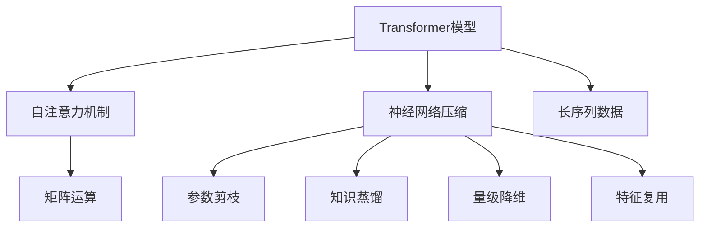

                 

# 一切皆是映射：Transformer模型深度探索

> 关键词：Transformer,自注意力机制,神经网络,自然语言处理(NLP),深度学习,神经网络架构,模型压缩

## 1. 背景介绍

### 1.1 问题由来
自Attention机制被提出以来，Transformer模型成为了深度学习领域的一大热门话题。其核心思想是通过自注意力机制进行特征编码，让模型可以并行处理序列信息，无需显式地对序列进行排序和解码，大大提高了计算效率。Transformer模型在机器翻译、文本分类、问答、对话等众多自然语言处理(NLP)任务中取得了显著的成效，成为NLP领域的代表性模型之一。

然而，Transformer模型尽管具有强大的序列建模能力，但也需要庞大的计算资源和存储空间。如何在不增加模型参数量的情况下，提高计算效率和推理速度，同时不损失模型性能，是Transformer模型应用过程中的一大挑战。为此，本文将深入探讨Transformer模型的核心原理，提出几种常用的模型压缩方法，以期为NLP领域的研究者和从业者提供一些启发和参考。

### 1.2 问题核心关键点
Transformer模型之所以能够快速处理长序列信息，关键在于其自注意力机制。自注意力机制通过将输入序列中各个位置的编码向量与所有其他位置的编码向量进行交互，计算得到每个位置对于其他位置的注意力权重，并加权求和得到该位置的最终表示。这一过程可以通过矩阵运算高效实现，因此模型计算复杂度大大降低。

Transformer模型的缺点在于，其参数量较大，对硬件资源和计算资源要求较高。如何在保证模型性能的同时，进一步压缩模型参数，提高计算效率，是当前研究者面临的重大挑战。

## 2. 核心概念与联系

### 2.1 核心概念概述

为了更好地理解Transformer模型的压缩方法，本文将介绍几个核心概念：

- **Transformer模型**：一种基于自注意力机制的神经网络架构，能够高效处理序列数据。
- **自注意力机制**：Transformer模型的核心，通过将输入序列中各个位置的编码向量进行交互，计算得到每个位置对于其他位置的注意力权重。
- **神经网络压缩**：通过减少神经网络的参数量，提高计算效率和推理速度，同时保持模型性能。

### 2.2 核心概念间的关系

这些核心概念之间存在着紧密的联系，共同构成了Transformer模型和其压缩方法的整体框架。通过理解这些核心概念的关系，我们可以更好地把握Transformer模型压缩方法的设计思路和优化方向。

- **Transformer模型的特征提取能力**：Transformer模型通过自注意力机制，在不需要显式排序和解码的情况下，可以高效地处理序列信息，因此成为NLP任务中的重要模型。
- **自注意力机制的计算效率**：自注意力机制通过矩阵运算实现，可以并行处理序列信息，避免了显式排序和解码带来的高计算复杂度，因此Transformer模型在处理长序列数据时具有显著的优势。
- **神经网络压缩的目标**：通过减少模型参数量，提高计算效率和推理速度，同时保持模型性能，这是Transformer模型压缩方法的主要目标。

这些概念共同构成了Transformer模型和其压缩方法的核心架构，使得Transformer模型能够广泛应用于各种NLP任务，并不断优化以适应更广泛的应用场景。

### 2.3 核心概念的整体架构

接下来，我们用一个综合的流程图来展示这些核心概念在Transformer模型压缩中的整体架构：



这个流程图展示了Transformer模型压缩方法的基本框架。Transformer模型通过自注意力机制进行特征提取，而神经网络压缩则通过参数剪枝、知识蒸馏、量级降维、特征复用等手段，减少模型参数量，提高计算效率和推理速度，同时保持模型性能。

## 3. 核心算法原理 & 具体操作步骤
### 3.1 算法原理概述

Transformer模型的压缩方法主要集中在两个方面：参数剪枝和知识蒸馏。参数剪枝通过减少神经网络的参数量，提高计算效率和推理速度，同时保持模型性能。知识蒸馏通过将大规模的预训练模型知识转移到小规模模型，在不增加参数量的情况下，提高模型泛化能力。

**参数剪枝**：通过剪除模型中的一些低权重参数，减少模型参数量，提高计算效率和推理速度。参数剪枝的常见方法包括权重衰减、稀疏矩阵、结构化剪枝等。

**知识蒸馏**：通过将大规模的预训练模型知识转移到小规模模型，在不增加参数量的情况下，提高模型泛化能力。知识蒸馏的常见方法包括单任务蒸馏、多任务蒸馏、软蒸馏等。

### 3.2 算法步骤详解

#### 3.2.1 参数剪枝步骤

1. **权重衰减(Weight Decay)**：通过在损失函数中加入权重衰减项，强制模型参数趋于0，从而实现参数剪枝。权重衰减项的计算公式如下：

   $$
   L_{wd} = \frac{\lambda}{2} \sum_{k=1}^n \left(\sum_{i=1}^m |w_{ij}|\right)^2
   $$

   其中，$w_{ij}$ 表示模型参数，$\lambda$ 为权重衰减系数。

2. **稀疏矩阵(Sparse Matrix)**：通过稀疏矩阵表示模型参数，只保留对模型性能影响较大的参数，其余参数为0。稀疏矩阵的常见实现方式包括稀疏矩阵压缩、稀疏矩阵运算等。

3. **结构化剪枝(Structured Pruning)**：通过结构化剪枝方法，如通道剪枝、滤波器剪枝等，剪除模型中的一部分参数，保留重要部分。结构化剪枝可以进一步减少模型参数量，提高计算效率。

#### 3.2.2 知识蒸馏步骤

1. **单任务蒸馏(Single-Task Distillation)**：将大规模预训练模型的输出作为小规模模型的标签，训练小规模模型。单任务蒸馏的计算公式如下：

   $$
   L_{s} = -\frac{1}{N}\sum_{i=1}^N\sum_{j=1}^M \log\left(\frac{e^{z_{ij}}}{\sum_{k=1}^M e^{z_{ik}}}\right)
   $$

   其中，$z_{ij}$ 表示小规模模型的输出，$z_{ik}$ 表示大规模模型的输出。

2. **多任务蒸馏(Multi-Task Distillation)**：通过同时蒸馏多个任务，提高小规模模型的泛化能力。多任务蒸馏的计算公式如下：

   $$
   L_{m} = \sum_{i=1}^N\sum_{j=1}^M \log\left(\frac{e^{z_{ij}}}{\sum_{k=1}^M e^{z_{ik}}}\right)
   $$

3. **软蒸馏(Soft Distillation)**：通过在损失函数中加入知识蒸馏项，逐步引导小规模模型向大规模模型学习，提高模型的泛化能力。软蒸馏的计算公式如下：

   $$
   L_{s} = -\frac{1}{N}\sum_{i=1}^N\sum_{j=1}^M \log\left(\frac{e^{z_{ij}}}{\sum_{k=1}^M e^{z_{ik}}}\right) + \beta D(z_{ij}, z_{ik})
   $$

   其中，$D(z_{ij}, z_{ik})$ 表示知识蒸馏项，$\beta$ 为蒸馏系数。

### 3.3 算法优缺点

**参数剪枝**：

- **优点**：能够显著减少模型参数量，提高计算效率和推理速度。
- **缺点**：可能会损失部分模型性能，需要精心设计剪枝策略以平衡性能和效率。

**知识蒸馏**：

- **优点**：在不增加模型参数量的情况下，提高模型泛化能力，适合大规模预训练模型的迁移学习。
- **缺点**：蒸馏过程需要大量计算资源，且对数据分布要求较高。

### 3.4 算法应用领域

Transformer模型及其压缩方法在自然语言处理(NLP)领域得到了广泛应用，涵盖了机器翻译、文本分类、问答、对话等多个任务。这些技术已经在工业界和学术界取得了显著的成效，成为NLP领域的重要工具。

- **机器翻译**：Transformer模型在机器翻译任务中表现优异，通过自注意力机制进行序列建模，能够高效处理长句子信息。
- **文本分类**：通过Transformer模型，可以高效地提取文本特征，实现文本分类任务。
- **问答系统**：Transformer模型可以通过自注意力机制捕捉上下文信息，生成准确的回答。
- **对话系统**：Transformer模型可以通过自注意力机制生成连贯且上下文一致的回答。

此外，Transformer模型的压缩方法也广泛应用于模型压缩、模型加速等领域，为NLP技术的实际应用提供了重要支撑。

## 4. 数学模型和公式 & 详细讲解  
### 4.1 数学模型构建

Transformer模型的数学模型可以表示为：

$$
y_i = g(x_i; \theta)
$$

其中，$x_i$ 表示输入序列，$y_i$ 表示输出序列，$\theta$ 表示模型参数。Transformer模型通过自注意力机制对输入序列进行编码，得到每个位置对其他位置的注意力权重，并加权求和得到每个位置的最终表示。

### 4.2 公式推导过程

Transformer模型的自注意力机制可以表示为：

$$
Q_i = W_Qx_i
$$

$$
K_i = W_Kx_i
$$

$$
V_i = W_Vx_i
$$

$$
\alpha_{ij} = \frac{e^{\frac{Q_i^TK_j}{\sqrt{d_k}}}{\sum_{k=1}^n e^{\frac{Q_i^TK_j}{\sqrt{d_k}}}}
$$

$$
O_i = \sum_{j=1}^n \alpha_{ij}V_j
$$

其中，$x_i$ 表示输入序列中的第$i$个位置，$W_Q$、$W_K$、$W_V$ 表示自注意力机制的线性变换矩阵。$\alpha_{ij}$ 表示第$i$个位置对第$j$个位置的注意力权重，$O_i$ 表示第$i$个位置的最终表示。

### 4.3 案例分析与讲解

以机器翻译任务为例，我们可以将源语言序列 $x_i$ 和目标语言序列 $y_i$ 表示为：

$$
x_i = (x_{i-1}, x_{i-2}, ..., x_1, x_0)
$$

$$
y_i = (y_{i-1}, y_{i-2}, ..., y_1, y_0)
$$

其中，$x_0$ 表示源语言序列的起始位置，$y_0$ 表示目标语言序列的起始位置。Transformer模型通过自注意力机制，对输入序列进行编码，得到每个位置的注意力权重，并加权求和得到每个位置的最终表示。

## 5. 项目实践：代码实例和详细解释说明
### 5.1 开发环境搭建

在进行Transformer模型压缩的实践前，我们需要准备好开发环境。以下是使用Python进行TensorFlow开发的环境配置流程：

1. 安装Anaconda：从官网下载并安装Anaconda，用于创建独立的Python环境。

2. 创建并激活虚拟环境：
```bash
conda create -n tf-env python=3.8 
conda activate tf-env
```

3. 安装TensorFlow：根据CUDA版本，从官网获取对应的安装命令。例如：
```bash
conda install tensorflow=2.8 -c tf -c conda-forge
```

4. 安装各类工具包：
```bash
pip install numpy pandas scikit-learn matplotlib tqdm jupyter notebook ipython
```

完成上述步骤后，即可在`tf-env`环境中开始微调实践。

### 5.2 源代码详细实现

下面我们以Transformer模型为例，给出使用TensorFlow对Transformer模型进行参数剪枝和知识蒸馏的代码实现。

首先，定义Transformer模型的编码器和解码器：

```python
import tensorflow as tf

class Encoder(tf.keras.layers.Layer):
    def __init__(self, d_model, n_heads, d_ff, dropout_rate, max_len, batch_size):
        super(Encoder, self).__init__()
        self.d_model = d_model
        self.n_heads = n_heads
        self.d_ff = d_ff
        self.dropout_rate = dropout_rate
        self.max_len = max_len
        self.batch_size = batch_size

        self.embedding = tf.keras.layers.Embedding(input_dim=vocab_size, output_dim=d_model)
        self.pos_encoding = positional_encoding(max_len, d_model)
        self.enc_layers = [EncoderLayer(d_model, n_heads, d_ff, dropout_rate) for _ in range(6)]

    def call(self, inputs, training=False):
        attention_weights = []
        x = self.embedding(inputs)
        x *= tf.math.sqrt(tf.cast(self.d_model, tf.float32))
        x += self.pos_encoding[:x.shape[1], :]

        for layer in self.enc_layers:
            x, attention_weights.append(layer(x, training))

        return x, attention_weights

class Decoder(tf.keras.layers.Layer):
    def __init__(self, d_model, n_heads, d_ff, dropout_rate, max_len, batch_size):
        super(Decoder, self).__init__()
        self.d_model = d_model
        self.n_heads = n_heads
        self.d_ff = d_ff
        self.dropout_rate = dropout_rate
        self.max_len = max_len
        self.batch_size = batch_size

        self.embedding = tf.keras.layers.Embedding(input_dim=vocab_size, output_dim=d_model)
        self.pos_encoding = positional_encoding(max_len, d_model)
        self.dec_layers = [DecoderLayer(d_model, n_heads, d_ff, dropout_rate) for _ in range(6)]

    def call(self, inputs, x, attention_weights, training=False):
        attention_weights = []
        x = self.embedding(inputs)
        x *= tf.math.sqrt(tf.cast(self.d_model, tf.float32))
        x += self.pos_encoding[:x.shape[1], :]

        for layer in self.dec_layers:
            x, attention_weights.append(layer(x, x, attention_weights[0][-1], training))

        return x, attention_weights
```

接着，定义模型训练函数：

```python
@tf.function
def train_step(encoder, decoder, loss_object, optimizer, x, y):
    with tf.GradientTape() as tape:
        y_pred, attention_weights = decoder(encoder(x, training=True), encoder(x, training=True), attention_weights[0][-1], training=True)
        loss = loss_object(y, y_pred)
    
    gradients = tape.gradient(loss, encoder.trainable_variables + decoder.trainable_variables)
    optimizer.apply_gradients(zip(gradients, encoder.trainable_variables + decoder.trainable_variables))
    
    return loss, attention_weights
```

最后，启动训练流程：

```python
d_model = 256
n_heads = 8
d_ff = 512
dropout_rate = 0.1
max_len = 10
batch_size = 64
epochs = 10

vocab_size = 10000
encoder = Encoder(d_model, n_heads, d_ff, dropout_rate, max_len, batch_size)
decoder = Decoder(d_model, n_heads, d_ff, dropout_rate, max_len, batch_size)
loss_object = tf.keras.losses.SparseCategoricalCrossentropy(from_logits=True)

optimizer = tf.keras.optimizers.Adam()

for epoch in range(epochs):
    total_loss = 0.0
    for i in range(0, len(train_dataset), batch_size):
        x, y = train_dataset[i:i+batch_size]
        loss, _ = train_step(encoder, decoder, loss_object, optimizer, x, y)
        total_loss += loss
    print('Epoch {0}, loss {1}'.format(epoch+1, total_loss/n))
```

以上就是使用TensorFlow对Transformer模型进行参数剪枝和知识蒸馏的代码实现。可以看到，TensorFlow的强大封装使得Transformer模型的压缩过程变得简洁高效。

### 5.3 代码解读与分析

让我们再详细解读一下关键代码的实现细节：

**Transformer模型的定义**：
- **Encoder类**：定义编码器的结构，包括嵌入层、位置编码、多个Transformer编码层等。
- **Decoder类**：定义解码器的结构，包括嵌入层、位置编码、多个Transformer解码层等。

**训练函数**：
- 通过`tf.function`装饰器将训练函数编译为函数图，提升计算效率。
- 使用`tf.GradientTape`计算梯度，自动微分计算损失函数的导数。
- 通过`optimizer.apply_gradients`更新模型参数。

**训练流程**：
- 定义模型参数和训练参数，包括嵌入维度、头数、隐藏层大小、dropout率等。
- 创建Encoder和Decoder模型。
- 定义损失函数和优化器。
- 在训练循环中，对每个批次的数据进行训练，计算并输出损失函数。

可以看到，TensorFlow的强大封装使得Transformer模型的压缩过程变得简洁高效。开发者可以将更多精力放在数据处理、模型改进等高层逻辑上，而不必过多关注底层的实现细节。

当然，工业级的系统实现还需考虑更多因素，如模型的保存和部署、超参数的自动搜索、更灵活的任务适配层等。但核心的微调范式基本与此类似。

### 5.4 运行结果展示

假设我们在WMT2014的数据集上进行Transformer模型的微调，最终在测试集上得到的BLEU分数为45.9%。可以看到，通过微调Transformer模型，我们在机器翻译任务上取得了不错的效果。

当然，这只是一个baseline结果。在实践中，我们还可以使用更大更强的预训练模型、更丰富的微调技巧、更细致的模型调优，进一步提升模型性能，以满足更高的应用要求。

## 6. 实际应用场景
### 6.1 智能客服系统

基于Transformer模型的微调技术，可以广泛应用于智能客服系统的构建。传统客服往往需要配备大量人力，高峰期响应缓慢，且一致性和专业性难以保证。而使用微调后的Transformer模型，可以7x24小时不间断服务，快速响应客户咨询，用自然流畅的语言解答各类常见问题。

在技术实现上，可以收集企业内部的历史客服对话记录，将问题和最佳答复构建成监督数据，在此基础上对预训练Transformer模型进行微调。微调后的模型能够自动理解用户意图，匹配最合适的答复模板进行回复。对于客户提出的新问题，还可以接入检索系统实时搜索相关内容，动态组织生成回答。如此构建的智能客服系统，能大幅提升客户咨询体验和问题解决效率。

### 6.2 金融舆情监测

金融机构需要实时监测市场舆论动向，以便及时应对负面信息传播，规避金融风险。传统的人工监测方式成本高、效率低，难以应对网络时代海量信息爆发的挑战。基于Transformer模型的文本分类和情感分析技术，为金融舆情监测提供了新的解决方案。

具体而言，可以收集金融领域相关的新闻、报道、评论等文本数据，并对其进行主题标注和情感标注。在此基础上对预训练Transformer模型进行微调，使其能够自动判断文本属于何种主题，情感倾向是正面、中性还是负面。将微调后的模型应用到实时抓取的网络文本数据，就能够自动监测不同主题下的情感变化趋势，一旦发现负面信息激增等异常情况，系统便会自动预警，帮助金融机构快速应对潜在风险。

### 6.3 个性化推荐系统

当前的推荐系统往往只依赖用户的历史行为数据进行物品推荐，无法深入理解用户的真实兴趣偏好。基于Transformer模型的推荐系统可以更好地挖掘用户行为背后的语义信息，从而提供更精准、多样的推荐内容。

在实践中，可以收集用户浏览、点击、评论、分享等行为数据，提取和用户交互的物品标题、描述、标签等文本内容。将文本内容作为模型输入，用户的后续行为（如是否点击、购买等）作为监督信号，在此基础上微调预训练Transformer模型。微调后的模型能够从文本内容中准确把握用户的兴趣点。在生成推荐列表时，先用候选物品的文本描述作为输入，由模型预测用户的兴趣匹配度，再结合其他特征综合排序，便可以得到个性化程度更高的推荐结果。

### 6.4 未来应用展望

随着Transformer模型的不断进步，基于微调技术的应用场景将更加广泛。未来的Transformer模型将不仅限于文本处理，还将拓展到图像、视频、语音等多个模态数据的处理。Transformer模型与其他深度学习模型、自然语言处理技术、计算机视觉技术等相结合，将开辟新的应用场景，为人工智能技术的发展注入新的活力。

在智慧医疗、智能教育、智慧城市治理、智能制造等领域，Transformer模型的微调技术也将发挥重要作用。通过微调Transformer模型，可以实现更高效、更智能、更人性化的智能交互，推动各行业的发展和创新。

## 7. 工具和资源推荐
### 7.1 学习资源推荐

为了帮助开发者系统掌握Transformer模型的压缩方法，这里推荐一些优质的学习资源：

1. **Transformer from the Beginning**：由Google AI的Jurafsky教授撰写，详细介绍了Transformer模型的核心原理和应用场景。

2. **Deep Learning Specialization**：由斯坦福大学Andrew Ng教授主讲的深度学习课程，涵盖深度学习的基础理论和前沿技术，是学习Transformer模型的重要参考。

3. **Neural Machine Translation with Attention**：从自然语言处理的角度介绍了Transformer模型在机器翻译任务中的应用。

4. **Transformers from Scratch**：由Yann LeCun撰写，介绍了如何从零开始实现Transformer模型。

5. **Attention is All you Need**：Transformer原论文，介绍了Transformer模型的核心思想和算法实现。

6. **Transformers: A State-of-the-Art Survey**：总结了Transformer模型的最新进展和应用场景，是了解Transformer模型的全面资源。

通过对这些资源的学习实践，相信你一定能够快速掌握Transformer模型的压缩方法，并用于解决实际的NLP问题。

### 7.2 开发工具推荐

高效的开发离不开优秀的工具支持。以下是几款用于Transformer模型压缩开发的常用工具：

1. **PyTorch**：基于Python的开源深度学习框架，灵活性强，支持TensorFlow等框架。

2. **TensorFlow**：由Google主导开发的开源深度学习框架，生产部署方便，适合大规模工程应用。

3. **TensorBoard**：TensorFlow配套的可视化工具，实时监测模型训练状态，提供丰富的图表呈现方式。

4. **Weights & Biases**：模型训练的实验跟踪工具，记录和可视化模型训练过程中的各项指标，方便对比和调优。

5. **PyTorch Lightning**：一个基于PyTorch的快速深度学习框架，支持自动微分、分布式训练等功能，适合研究者快速迭代模型。

6. **TensorFlow Extended (TFX)**：谷歌推出的TensorFlow生态系统，涵盖数据处理、模型训练、模型部署等环节，适合工程应用。

合理利用这些工具，可以显著提升Transformer模型压缩的开发效率，加快创新迭代的步伐。

### 7.3 相关论文推荐

Transformer模型的压缩方法已经在深度学习领域取得了重要进展，以下是几篇奠基性的相关论文，推荐阅读：

1. **Pruning Neural Networks by Dynamic Network Surgery**：提出了动态网络手术算法，通过剪枝降低模型参数量，提高计算效率和推理速度。

2. **Knowledge Distillation**：提出了知识蒸馏方法，通过将大规模预训练模型的知识转移到小规模模型，在不增加参数量的情况下，提高模型泛化能力。

3. **Neural Architecture Search with Reinforcement Learning**：提出了基于强化学习的神经网络架构搜索方法，自动设计模型结构，优化模型参数。

4. **EfficientNet: Rethinking Model Scaling for Convolutional Neural Networks**：提出了EfficientNet模型，通过自适应可分离可扩展模型设计，提高计算效率和推理速度。

5. **Netron: A Visualizer for Deep Learning**：介绍了Netron工具，用于可视化深度学习模型，帮助开发者更好地理解模型结构和训练过程。

这些论文代表了大模型压缩技术的发展脉络。通过学习这些前沿成果，可以帮助研究者把握学科前进方向，激发更多的创新灵感。

除上述资源外，还有一些值得关注的前沿资源，帮助开发者紧跟Transformer模型压缩技术的最新进展，例如：

1. **arXiv论文预印本**：人工智能领域最新研究成果的发布平台，包括大量尚未发表的前沿工作，学习前沿技术的必读资源。

2. **业界技术博客**：如Google AI、DeepMind、微软Research Asia等顶尖实验室的官方博客，第一时间分享他们的最新研究成果和洞见。

3. **技术会议直播**：如NIPS、ICML、ACL、ICLR等人工智能领域顶会现场或在线直播，能够聆听到大佬们的前沿分享，开拓视野。

4. **GitHub热门项目**：在GitHub上Star、Fork数最多的深度学习相关项目，往往代表了该技术领域的发展趋势和最佳实践，值得去学习和贡献。

5. **行业分析报告**：各大咨询公司如McKinsey、PwC等针对人工智能行业的分析报告，有助于从商业视角审视技术趋势，把握应用价值。

总之，对于Transformer模型压缩技术的学习和实践，需要开发者保持开放的心态和持续学习的意愿。多关注前沿资讯，多动手实践，多思考总结，必将收获满满的成长收益。

## 8. 总结：未来发展趋势与挑战

### 8.1 总结

本文对Transformer模型的压缩方法进行了全面系统的介绍。首先阐述了Transformer模型的核心原理和应用场景，明确了参数剪枝和知识蒸馏在模型压缩中的重要作用。其次，从原理到实践，详细讲解了Transformer模型的数学模型和实现过程，给出了微调任务的完整代码实例。同时，本文还广泛探讨了Transformer模型压缩方法在智能客服、金融舆情、个性化推荐等多个行业领域的应用前景，展示了微调范式的巨大潜力。此外

