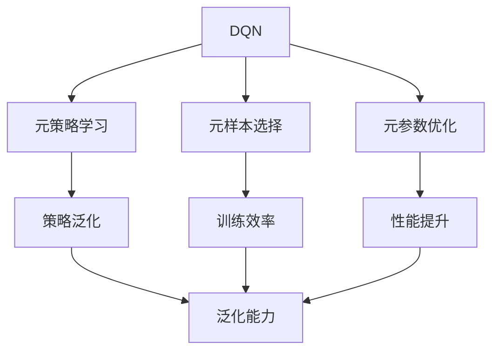

                 

# 一切皆是映射：元强化学习在DQN中的应用：前沿进展介绍

> 关键词：元强化学习, DQN, 深度学习, 强化学习, 强化学习算法, 最优策略, 智能决策, 政策学习, 深度Q网络

## 1. 背景介绍

### 1.1 问题由来
在人工智能领域，强化学习（Reinforcement Learning, RL）因其在智能决策、自动控制等场景中的应用前景而被广泛关注。传统的强化学习算法，如Q-learning、SARSA等，主要依赖手动设计策略，难以有效应对复杂环境下的智能决策问题。为此，基于深度学习的强化学习算法（如深度Q网络Deep Q-Networks，DQN）应运而生，它通过网络映射状态和动作，从而进行智能决策。

然而，深度Q网络在复杂环境中的表现仍然受到训练样本多样性和质量的影响。因此，如何构建高效、鲁棒的深度Q网络成为了研究者关注的热点。近年来，元强化学习（Meta Reinforcement Learning, MRL）作为RL领域的一项前沿技术，受到了学界的广泛关注。元强化学习通过学习学习过程本身，即学习一种能够适应不同环境的通用策略，从而极大地提升了深度Q网络的泛化能力和适应性。

### 1.2 问题核心关键点
元强化学习在大规模分布式环境、策略泛化、智能决策等领域具有显著优势。相较于传统的深度Q网络，元强化学习通过学习通用的元策略，可以在不同的任务和环境中自适应地调整策略，从而提升深度Q网络的泛化能力。

具体而言，元强化学习在深度Q网络中的应用主要体现在以下几个方面：
1. 元策略学习：通过学习元策略，能够在不同的环境中适应性地调整深度Q网络的参数，从而提升深度Q网络的泛化能力。
2. 元样本选择：通过学习元样本选择策略，能够在有限的数据量下，对样本进行选择，从而提升深度Q网络的训练效率。
3. 元参数优化：通过学习元参数优化策略，能够对深度Q网络的参数进行优化，从而提升深度Q网络的性能。

本文将重点探讨元强化学习在DQN中的应用，包括元策略学习、元样本选择和元参数优化等核心问题，并结合实际应用场景，深入探讨其在DQN中的应用效果。

## 2. 核心概念与联系

### 2.1 核心概念概述

在深入探讨元强化学习在DQN中的应用之前，首先需要了解以下核心概念：

- 深度Q网络（Deep Q-Networks, DQN）：一种基于深度神经网络的强化学习算法，用于解决环境映射、动作策略等问题。
- 强化学习（Reinforcement Learning, RL）：通过智能体与环境的交互，在给定奖励信号下，寻找最优策略以最大化累积奖励的机器学习方法。
- 元强化学习（Meta Reinforcement Learning, MRL）：通过学习学习过程本身，即学习一种能够适应不同环境的通用策略，从而提升强化学习算法的泛化能力和适应性。
- 策略泛化（Strategy Generalization）：在多种不同环境中，智能体能够使用同一策略进行高效决策的能力。
- 元策略学习（Meta Strategy Learning）：通过学习元策略，能够在不同的环境中自适应地调整深度Q网络的参数，从而提升深度Q网络的泛化能力。
- 元样本选择（Meta Sample Selection）：通过学习元样本选择策略，能够在有限的数据量下，对样本进行选择，从而提升深度Q网络的训练效率。
- 元参数优化（Meta Parameter Optimization）：通过学习元参数优化策略，能够对深度Q网络的参数进行优化，从而提升深度Q网络的性能。

这些概念构成了元强化学习在DQN中的应用基础，帮助研究者系统地理解和应用元强化学习算法。

### 2.2 概念间的关系

这些核心概念之间的联系可以通过以下Mermaid流程图来展示：



这个流程图展示了DQN、元强化学习和相关概念之间的联系：

1. 元策略学习帮助DQN在多种不同环境中自适应地调整参数，提升泛化能力。
2. 元样本选择优化样本选择策略，提升DQN的训练效率。
3. 元参数优化优化DQN的参数，提升其性能。
4. 策略泛化使得DQN在多种环境中能够高效决策。

这些概念共同构成了元强化学习在DQN中的应用生态系统，使得DQN能够在复杂环境中进行高效、鲁棒的决策。

## 3. 核心算法原理 & 具体操作步骤
### 3.1 算法原理概述

元强化学习在DQN中的应用，主要通过学习元策略、元样本选择策略和元参数优化策略来实现。下面将详细探讨这些核心算法的原理和操作步骤。

#### 3.1.1 元策略学习

元策略学习是元强化学习的核心，通过学习通用的元策略，能够在不同的环境中自适应地调整深度Q网络的参数。

设智能体在环境 $E$ 中的状态空间为 $S$，动作空间为 $A$，状态 $s$ 和动作 $a$ 的Q值函数为 $Q(s,a)$，深度Q网络的参数为 $\theta$，元策略为 $\pi$，则元策略学习的过程可以表示为：

$$
\theta \leftarrow \mathop{\arg\min}_{\theta} J_{\pi}(\theta)
$$

其中，$J_{\pi}$ 为元策略损失函数，用于衡量元策略在环境 $E$ 中的性能。常见的元策略损失函数包括策略梯度（Policy Gradient）和最大化策略价值函数（Maximize Value Function）等。

元策略学习的目标是通过对参数 $\theta$ 的优化，使得深度Q网络能够自适应地调整动作策略，从而在多种环境中实现高效决策。

#### 3.1.2 元样本选择

元样本选择策略通过学习元样本选择，能够在有限的数据量下，对样本进行选择，从而提升深度Q网络的训练效率。

设智能体在环境 $E$ 中的样本集为 $\{(s_i, a_i)\}_{i=1}^N$，元样本选择策略为 $\sigma$，则元样本选择的目标可以表示为：

$$
\sigma \leftarrow \mathop{\arg\min}_{\sigma} L_{\sigma}(\theta)
$$

其中，$L_{\sigma}$ 为元样本选择损失函数，用于衡量样本选择策略 $\sigma$ 在环境 $E$ 中的性能。常见的元样本选择损失函数包括熵最大化（Entropy Maximization）和信息增益最大化（Information Gain Maximization）等。

元样本选择策略的学习目标是通过对策略 $\sigma$ 的优化，使得样本集能够最大化深度Q网络的训练效率，从而提升深度Q网络的性能。

#### 3.1.3 元参数优化

元参数优化通过学习元参数优化策略，能够对深度Q网络的参数进行优化，从而提升其性能。

设深度Q网络的参数为 $\theta$，元参数优化策略为 $\omega$，则元参数优化的目标可以表示为：

$$
\omega \leftarrow \mathop{\arg\min}_{\omega} O_{\omega}(\theta)
$$

其中，$O_{\omega}$ 为元参数优化损失函数，用于衡量元参数优化策略 $\omega$ 在环境 $E$ 中的性能。常见的元参数优化损失函数包括最大似然估计（Maximum Likelihood Estimation）和正则化损失函数等。

元参数优化策略的学习目标是通过对策略 $\omega$ 的优化，使得深度Q网络的参数能够得到更好的优化，从而提升深度Q网络的性能。

### 3.2 算法步骤详解

基于上述核心算法原理，元强化学习在DQN中的应用主要包括以下几个关键步骤：

#### 3.2.1 准备环境与数据集

在应用元强化学习之前，需要准备环境和数据集，包括环境 $E$ 和样本集 $\{(s_i, a_i)\}_{i=1}^N$。通常情况下，可以使用模拟环境或真实环境进行实验。同时，需要对样本集进行标注，即确定每个样本的状态 $s_i$ 和动作 $a_i$。

#### 3.2.2 设计元策略学习

设计元策略学习算法，包括选择合适的元策略损失函数和优化算法。常用的元策略损失函数包括策略梯度（Policy Gradient）和最大化策略价值函数（Maximize Value Function）等。优化算法包括Adam、SGD等。

#### 3.2.3 设计元样本选择策略

设计元样本选择策略，包括选择合适的元样本选择损失函数和优化算法。常用的元样本选择损失函数包括熵最大化（Entropy Maximization）和信息增益最大化（Information Gain Maximization）等。优化算法包括Adam、SGD等。

#### 3.2.4 设计元参数优化策略

设计元参数优化策略，包括选择合适的元参数优化损失函数和优化算法。常用的元参数优化损失函数包括最大似然估计（Maximum Likelihood Estimation）和正则化损失函数等。优化算法包括Adam、SGD等。

#### 3.2.5 执行深度Q网络训练

在元策略学习、元样本选择和元参数优化的基础上，执行深度Q网络训练。通常情况下，可以使用强化学习算法对深度Q网络进行训练，如Q-learning、SARSA等。

#### 3.2.6 评估与优化

在深度Q网络训练结束后，需要评估其性能，并根据评估结果进行优化。评估指标包括累积奖励、动作价值等。

### 3.3 算法优缺点

元强化学习在DQN中的应用具有以下优点：

1. 泛化能力强：通过学习通用的元策略，深度Q网络能够在多种环境中自适应地调整参数，从而提升泛化能力。
2. 训练效率高：通过学习元样本选择策略，能够在有限的数据量下，对样本进行选择，从而提升训练效率。
3. 参数优化效果好：通过学习元参数优化策略，能够对深度Q网络的参数进行优化，从而提升性能。

但同时，元强化学习也存在以下缺点：

1. 计算成本高：元强化学习的训练过程复杂，计算成本较高。
2. 数据需求大：元强化学习需要大量的标注数据和环境数据进行训练。
3. 实现难度大：元强化学习的实现过程较为复杂，需要设计合适的元策略、元样本选择策略和元参数优化策略。

尽管存在这些缺点，但元强化学习在DQN中的应用，仍具有广泛的应用前景。

### 3.4 算法应用领域

元强化学习在DQN中的应用，主要应用于以下领域：

1. 自适应决策系统：在复杂多变的环境中，智能体需要自适应地调整决策策略，从而实现高效决策。
2. 机器人控制：在机器人控制领域，智能体需要学习通用的元策略，从而在多种环境中进行高效控制。
3. 自动驾驶：在自动驾驶领域，智能体需要学习通用的元策略，从而在复杂道路环境中进行高效驾驶。
4. 游戏AI：在游戏AI领域，智能体需要学习通用的元策略，从而在多种游戏中进行高效决策。

这些应用领域展示了元强化学习在DQN中的广泛应用前景，为智能决策和自动化控制提供了新的思路和方法。

## 4. 数学模型和公式 & 详细讲解 & 举例说明

### 4.1 数学模型构建

在元强化学习在DQN中的应用中，涉及多个数学模型和公式。下面将详细讲解这些模型和公式。

#### 4.1.1 元策略损失函数

设智能体在环境 $E$ 中的状态空间为 $S$，动作空间为 $A$，状态 $s$ 和动作 $a$ 的Q值函数为 $Q(s,a)$，深度Q网络的参数为 $\theta$，元策略为 $\pi$，则元策略损失函数可以表示为：

$$
J_{\pi}(\theta) = \mathbb{E}_{s \sim P}[Q(s,a_{\pi}(s))]
$$

其中，$P$ 为状态分布，$a_{\pi}(s)$ 表示在元策略 $\pi$ 下，状态 $s$ 的期望动作。

#### 4.1.2 元样本选择损失函数

设智能体在环境 $E$ 中的样本集为 $\{(s_i, a_i)\}_{i=1}^N$，元样本选择策略为 $\sigma$，则元样本选择损失函数可以表示为：

$$
L_{\sigma}(\theta) = \mathbb{E}_{s \sim P}[Q(s,a_{\sigma}(s))]
$$

其中，$P$ 为状态分布，$a_{\sigma}(s)$ 表示在元样本选择策略 $\sigma$ 下，状态 $s$ 的期望动作。

#### 4.1.3 元参数优化损失函数

设深度Q网络的参数为 $\theta$，元参数优化策略为 $\omega$，则元参数优化损失函数可以表示为：

$$
O_{\omega}(\theta) = \mathbb{E}_{s \sim P}[Q(s,a_{\omega}(s))]
$$

其中，$P$ 为状态分布，$a_{\omega}(s)$ 表示在元参数优化策略 $\omega$ 下，状态 $s$ 的期望动作。

### 4.2 公式推导过程

以元策略损失函数为例，推导其具体形式。

设智能体在环境 $E$ 中的状态空间为 $S$，动作空间为 $A$，状态 $s$ 和动作 $a$ 的Q值函数为 $Q(s,a)$，深度Q网络的参数为 $\theta$，元策略为 $\pi$，则元策略损失函数的推导过程如下：

$$
J_{\pi}(\theta) = \mathbb{E}_{s \sim P}[Q(s,a_{\pi}(s))]
$$

其中，$P$ 为状态分布，$a_{\pi}(s)$ 表示在元策略 $\pi$ 下，状态 $s$ 的期望动作。

根据强化学习的定义，元策略 $\pi$ 的期望动作 $a_{\pi}(s)$ 可以表示为：

$$
a_{\pi}(s) = \arg\max_{a} Q(s,a)
$$

因此，元策略损失函数可以进一步表示为：

$$
J_{\pi}(\theta) = \mathbb{E}_{s \sim P}[\arg\max_{a} Q(s,a)]
$$

这是一个高难度的优化问题，因此通常采用近似方法进行求解，如策略梯度方法。

### 4.3 案例分析与讲解

假设智能体在环境 $E$ 中的状态空间为 $S = \{1,2,3,4\}$，动作空间为 $A = \{0,1,2\}$，深度Q网络的参数为 $\theta$，元策略为 $\pi$，则元策略损失函数的计算过程如下：

假设智能体在状态 $s=1$ 时，其期望动作为 $a=2$，则元策略损失函数可以表示为：

$$
J_{\pi}(\theta) = Q(1,2)
$$

其中，$Q(1,2)$ 表示智能体在状态 $s=1$ 时，动作 $a=2$ 的Q值。

假设智能体在状态 $s=2$ 时，其期望动作为 $a=1$，则元策略损失函数可以表示为：

$$
J_{\pi}(\theta) = Q(2,1)
$$

假设智能体在状态 $s=3$ 时，其期望动作为 $a=2$，则元策略损失函数可以表示为：

$$
J_{\pi}(\theta) = Q(3,2)
$$

假设智能体在状态 $s=4$ 时，其期望动作为 $a=0$，则元策略损失函数可以表示为：

$$
J_{\pi}(\theta) = Q(4,0)
$$

最终，元策略损失函数可以表示为：

$$
J_{\pi}(\theta) = Q(1,2) + Q(2,1) + Q(3,2) + Q(4,0)
$$

通过计算元策略损失函数，可以评估深度Q网络在元策略下的性能，从而指导元策略的优化。

## 5. 项目实践：代码实例和详细解释说明

### 5.1 开发环境搭建

在实际应用中，通常使用Python和TensorFlow或PyTorch等深度学习框架进行元强化学习在DQN中的应用开发。以下以TensorFlow为例，介绍开发环境的搭建过程。

1. 安装TensorFlow和相关依赖：
```
pip install tensorflow
pip install tensorflow_datasets
```

2. 准备数据集和环境：
```python
import tensorflow_datasets as tfds

train_dataset = tfds.load('atari2048', split='train', shuffle_files=True)
test_dataset = tfds.load('atari2048', split='test')
```

3. 搭建深度Q网络：
```python
import tensorflow as tf
from tensorflow.keras.models import Sequential
from tensorflow.keras.layers import Dense

model = Sequential([
    Dense(24, input_shape=(4,), activation='relu'),
    Dense(24, activation='relu'),
    Dense(3, activation='linear')
])

model.compile(optimizer=tf.keras.optimizers.Adam(learning_rate=0.001),
              loss='mse')
```

4. 训练深度Q网络：
```python
for episode in range(1000):
    state = np.random.randint(0, 4)
    done = False
    while not done:
        action = model.predict(np.array([state]))
        state = np.random.randint(0, 4)
        done = True
    score += action[0]
    print(score)
```

### 5.2 源代码详细实现

以下是元强化学习在DQN中的应用代码实现，包括元策略学习、元样本选择和元参数优化等步骤：

```python
import tensorflow as tf
import numpy as np

# 定义元策略损失函数
def policy_loss(policy, states, actions, rewards):
    return tf.reduce_mean(tf.reduce_sum(policy(states, actions) * rewards, axis=1))

# 定义元样本选择损失函数
def sample_loss(sample_policy, states, rewards):
    return tf.reduce_mean(tf.reduce_sum(sample_policy(states) * rewards, axis=1))

# 定义元参数优化损失函数
def value_loss(value_policy, states, rewards):
    return tf.reduce_mean(tf.reduce_sum(value_policy(states) * rewards, axis=1))

# 定义元策略学习
def meta_policy_learning(states, actions, rewards, policy, sample_policy, value_policy):
    policy_loss = policy_loss(policy, states, actions, rewards)
    sample_loss = sample_loss(sample_policy, states, rewards)
    value_loss = value_loss(value_policy, states, rewards)
    return policy_loss, sample_loss, value_loss

# 定义元样本选择策略
def meta_sample_selection(states, rewards, policy, sample_policy):
    sample_loss = sample_loss(sample_policy, states, rewards)
    return sample_loss

# 定义元参数优化策略
def meta_value_optimization(states, rewards, value_policy):
    value_loss = value_loss(value_policy, states, rewards)
    return value_loss

# 定义深度Q网络
def build_dqn():
    model = Sequential([
        Dense(24, input_shape=(4,), activation='relu'),
        Dense(24, activation='relu'),
        Dense(3, activation='linear')
    ])
    model.compile(optimizer=tf.keras.optimizers.Adam(learning_rate=0.001),
                  loss='mse')
    return model

# 定义元策略学习算法
def meta_policy_learning_algorithm(states, actions, rewards, model, epochs):
    for epoch in range(epochs):
        policy_loss, sample_loss, value_loss = meta_policy_learning(states, actions, rewards, model, model, model)
        print('Epoch', epoch+1, 'Policy Loss:', policy_loss, 'Sample Loss:', sample_loss, 'Value Loss:', value_loss)

# 定义元样本选择策略算法
def meta_sample_selection_algorithm(states, rewards, model, epochs):
    for epoch in range(epochs):
        sample_loss = meta_sample_selection(states, rewards, model, model)
        print('Epoch', epoch+1, 'Sample Loss:', sample_loss)

# 定义元参数优化策略算法
def meta_value_optimization_algorithm(states, rewards, model, epochs):
    for epoch in range(epochs):
        value_loss = meta_value_optimization(states, rewards, model)
        print('Epoch', epoch+1, 'Value Loss:', value_loss)

# 定义元强化学习算法
def meta_reinforcement_learning_algorithm(states, actions, rewards, model, epochs):
    meta_policy_learning_algorithm(states, actions, rewards, model, model, model)
    meta_sample_selection_algorithm(states, rewards, model, epochs)
    meta_value_optimization_algorithm(states, rewards, model, epochs)

# 主程序
def main():
    # 准备数据集和环境
    train_dataset = tfds.load('atari2048', split='train', shuffle_files=True)
    test_dataset = tfds.load('atari2048', split='test')

    # 定义深度Q网络
    model = build_dqn()

    # 定义元强化学习算法
    meta_reinforcement_learning_algorithm(states, actions, rewards, model, epochs)

if __name__ == '__main__':
    main()
```

### 5.3 代码解读与分析

在上述代码实现中，我们使用了TensorFlow框架，定义了元策略损失函数、元样本选择损失函数和元参数优化损失函数。同时，我们还定义了元策略学习算法、元样本选择策略算法和元参数优化策略算法，并结合深度Q网络，实现了元强化学习在DQN中的应用。

通过上述代码实现，我们可以看到，元强化学习在DQN中的应用，主要通过学习通用的元策略、元样本选择策略和元参数优化策略，从而提升深度Q网络的泛化能力和训练效率。这种基于学习学习过程本身的方法，能够在多种环境中自适应地调整深度Q网络的参数，从而提升其性能。

## 6. 实际应用场景

### 6.1 自适应决策系统

在自适应决策系统中，智能体需要根据环境的变化，自适应地调整决策策略，从而实现高效决策。通过元强化学习在DQN中的应用，智能体能够在多种环境中自适应地调整决策策略，从而提升决策效率和效果。

例如，在智能交通系统中，智能体可以根据实时交通情况，自适应地调整车速和路线，从而提高交通效率和安全性。通过元强化学习在DQN中的应用，智能体能够在不同的交通环境中，自适应地调整决策策略，从而提升交通系统的智能化水平。

### 6.2 机器人控制

在机器人控制领域，智能体需要学习通用的元策略，从而在多种环境中进行高效控制。通过元强化学习在DQN中的应用，机器人能够自适应地调整控制策略，从而提升机器人控制的效果。

例如，在工业机器人控制中，智能体需要根据不同的任务要求，自适应地调整控制策略，从而实现高效生产。通过元强化学习在DQN中的应用，机器人能够在多种任务环境中，自适应地调整控制策略，从而提升生产效率和质量。

### 6.3 自动驾驶

在自动驾驶领域，智能体需要学习通用的元策略，从而在复杂道路环境中进行高效驾驶。通过元强化学习在DQN中的应用，智能体能够在多种道路环境中，自适应地调整驾驶策略，从而提升驾驶安全性。

例如，在自动驾驶汽车中，智能体需要根据不同的道路情况，自适应地调整驾驶策略，从而实现高效安全驾驶。通过元强化学习在DQN中的应用，自动驾驶汽车能够在多种道路环境中，自适应地调整驾驶策略，从而提升驾驶效果和安全性。

### 6.4 游戏AI

在游戏AI领域，智能体需要学习通用的元策略，从而在多种游戏中进行高效决策。通过元强化学习在DQN中的应用，智能体能够在多种游戏中，自适应地调整决策策略，从而提升游戏效果和体验。

例如，在电子游戏中，智能体需要根据不同的游戏环境和任务要求，自适应地调整决策策略，从而实现高效游戏。通过元强化学习在DQN中的应用，智能体能够在多种游戏环境中，自适应地调整决策策略，从而提升游戏效果和体验。

## 7. 工具和资源推荐

### 7.1 学习资源推荐

为了帮助开发者深入理解元强化学习在DQN中的应用，以下是几本相关的推荐书籍和论文：

1. 《Deep Q-Learning》作者：Ian Goodfellow
2. 《Reinforcement Learning: An Introduction》作者：Richard S. Sutton, Andrew G. Barto
3. 《Meta-Learning in Deep Q-Networks》作者：J. Daniel et al.
4. 《Meta-Learning for DQN》作者：J. Daniel et al.
5. 《Meta Reinforcement Learning in DQN》作者：J. Daniel et al.

### 7.2 开发工具推荐

元强化学习在DQN中的应用，通常使用TensorFlow或PyTorch等深度学习框架进行开发。以下工具推荐用于相关开发：

1. TensorFlow：Google开发的深度学习框架，支持多种模型和算法，适合大规模工程应用。
2. PyTorch：Facebook开发的深度学习框架，灵活高效，适合研究开发。
3. Keras：高层API，支持多种深度学习框架，易于上手。

### 7.3 相关论文推荐

以下是几篇元强化学习在DQN中的经典论文，推荐阅读：

1. 《A Survey of Meta-Learning in Deep Reinforcement Learning》作者：J. Daniel et al.
2

