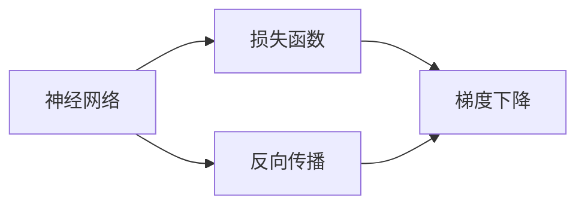

                 

## 1. 背景介绍

人工智能技术的飞速发展离不开深度学习这一强大的推动力。其中，反向传播算法是深度学习训练的核心，也是整个神经网络模型能够高效运作的基础。本节将对反向传播算法进行详细介绍，帮助读者理解其核心原理和计算过程。

## 2. 核心概念与联系

### 2.1 核心概念概述

反向传播算法是一种高效的梯度计算方法，主要用于求解神经网络模型中的梯度信息，以便进行模型参数的更新和优化。该算法通过链式法则计算各层神经元的梯度，从而实现参数的反向传播。以下是该算法涉及的关键概念：

- 神经网络：由多个神经元层组成的计算模型，每一层接收上一层的输出，经过线性变换和激活函数处理后，输出到下一层。
- 损失函数：用于衡量模型预测输出与真实标签之间的差异，通常采用均方误差、交叉熵等。
- 梯度下降：一种基于梯度信息的优化方法，通过迭代地更新模型参数，使得损失函数最小化。
- 链式法则：一种基本的数学法则，用于计算多层函数复合时的导数。

### 2.2 概念间的关系

这些核心概念通过反向传播算法连接起来，构成了神经网络训练的完整流程。具体来说：

- 神经网络模型在训练阶段，通过反向传播算法计算损失函数关于参数的梯度，然后结合梯度下降等优化方法，更新参数以最小化损失。
- 损失函数反映了模型输出与真实标签之间的差异，通过链式法则，反向传播算法能够高效地计算出各层参数的梯度。
- 梯度下降算法利用梯度信息，迭代地更新模型参数，使得损失函数逐渐降低。
- 链式法则提供了计算多层次函数复合时导数的基础工具，使得反向传播算法成为可能。

通过这些概念的关系图，可以更清晰地理解反向传播算法的计算过程和应用场景。



## 3. 核心算法原理 & 具体操作步骤

### 3.1 算法原理概述

反向传播算法的核心思想是利用链式法则计算多层神经网络的梯度。其基本流程如下：

1. 计算模型输出与真实标签的差异（即损失函数）。
2. 根据链式法则，计算损失函数对每一层参数的梯度。
3. 使用梯度下降等优化算法，更新模型参数以降低损失。

### 3.2 算法步骤详解

#### 3.2.1 准备训练数据

假设我们有一个包含$m$个样本的训练数据集$D=\{(x_i, y_i)\}_{i=1}^m$，其中$x_i$为输入，$y_i$为标签。

#### 3.2.2 初始化模型参数

设定模型由$L$个神经元层组成，每一层包含$n_l$个神经元。我们需要初始化每一层的权重和偏置参数，通常使用随机值进行初始化。

#### 3.2.3 前向传播

将输入$x_i$逐层传递，计算每一层的输出$z_l^i$和激活值$a_l^i$。具体公式如下：

$$
a_l^i = \sigma(w_l a_{l-1}^i + b_l)
$$

其中，$w_l$为第$l$层权重矩阵，$b_l$为偏置向量，$\sigma$为激活函数。

#### 3.2.4 计算损失

假设我们采用均方误差作为损失函数，则有：

$$
L = \frac{1}{2m} \sum_{i=1}^m ||y_i - \hat{y}_i||^2
$$

其中，$\hat{y}_i$为模型输出。

#### 3.2.5 反向传播

利用链式法则，计算每一层参数的梯度。具体公式如下：

$$
\frac{\partial L}{\partial w_l} = \frac{\partial L}{\partial a_{l+1}} \frac{\partial a_{l+1}}{\partial z_{l+1}} \frac{\partial z_{l+1}}{\partial w_l}
$$

$$
\frac{\partial L}{\partial b_l} = \frac{\partial L}{\partial a_l} \frac{\partial a_l}{\partial z_l} \frac{\partial z_l}{\partial b_l}
$$

其中，$\frac{\partial L}{\partial a_{l+1}}$为下一层对当前层的梯度，$\frac{\partial a_{l+1}}{\partial z_{l+1}}$为激活函数的导数，$\frac{\partial z_{l+1}}{\partial w_l}$和$\frac{\partial z_l}{\partial b_l}$分别表示权重和偏置对当前层输出的梯度。

#### 3.2.6 梯度下降

根据计算出的梯度，使用梯度下降等优化算法更新模型参数。更新公式如下：

$$
w_l \leftarrow w_l - \eta \frac{\partial L}{\partial w_l}
$$

$$
b_l \leftarrow b_l - \eta \frac{\partial L}{\partial b_l}
$$

其中，$\eta$为学习率。

### 3.3 算法优缺点

#### 3.3.1 优点

1. **高效性**：反向传播算法通过链式法则，高效地计算每一层参数的梯度，使得模型的训练过程变得快速而准确。
2. **泛化能力强**：通过不断调整模型参数，使得模型能够适应不同的输入和任务。
3. **易于实现**：反向传播算法的实现相对简单，容易被理解和实现。

#### 3.3.2 缺点

1. **易陷入局部最优**：由于梯度下降的随机性，模型可能陷入局部最优，导致性能无法进一步提升。
2. **需要大量计算资源**：反向传播算法计算每一层梯度时，需要大量计算资源，对于大规模模型，训练时间可能会非常长。
3. **需要手工调整超参数**：学习率、批次大小等超参数的选择对模型性能影响很大，需要不断调整和优化。

### 3.4 算法应用领域

反向传播算法广泛应用在深度学习模型的训练中，特别是在图像识别、自然语言处理、语音识别等领域。它不仅能够用于传统的神经网络模型，也可以扩展到更复杂的模型结构，如卷积神经网络（CNN）、循环神经网络（RNN）、变换器（Transformer）等。

## 4. 数学模型和公式 & 详细讲解

### 4.1 数学模型构建

假设我们有一个包含$L$层神经元的网络，每一层输入和输出分别为$x_l$和$a_l$。网络的总损失函数为：

$$
L = \frac{1}{2m} \sum_{i=1}^m ||y_i - \hat{y}_i||^2
$$

其中，$\hat{y}_i = f(a_L)$为模型的最终输出，$f$为输出层的激活函数。

### 4.2 公式推导过程

我们以三层神经网络为例，推导反向传播算法的具体公式。假设每一层的激活函数为$\sigma$，则有：

$$
a_1 = \sigma(w_1 x + b_1)
$$

$$
a_2 = \sigma(w_2 a_1 + b_2)
$$

$$
a_3 = \sigma(w_3 a_2 + b_3)
$$

其中，$w_l$和$b_l$分别表示第$l$层的权重矩阵和偏置向量。

为了计算损失$L$对每一层参数的梯度，我们需要计算每一层的梯度$\frac{\partial L}{\partial w_l}$和$\frac{\partial L}{\partial b_l}$。下面以第一层为例，推导$\frac{\partial L}{\partial w_1}$和$\frac{\partial L}{\partial b_1}$的公式。

由链式法则，有：

$$
\frac{\partial L}{\partial a_3} = \frac{\partial f}{\partial a_3} \frac{\partial L}{\partial y}
$$

其中，$\frac{\partial f}{\partial a_3}$为输出层激活函数的导数。

将$a_3$代入上式，得到：

$$
\frac{\partial L}{\partial a_2} = \frac{\partial L}{\partial a_3} \frac{\partial a_3}{\partial a_2} = \frac{\partial L}{\partial a_3} \sigma'(w_3 a_2 + b_3)
$$

继续代入上式，得到：

$$
\frac{\partial L}{\partial a_1} = \frac{\partial L}{\partial a_2} \frac{\partial a_2}{\partial a_1} = \frac{\partial L}{\partial a_2} \sigma'(w_2 a_1 + b_2)
$$

最后，得到：

$$
\frac{\partial L}{\partial w_1} = \frac{\partial L}{\partial a_1} \frac{\partial a_1}{\partial w_1}
$$

$$
\frac{\partial L}{\partial b_1} = \frac{\partial L}{\partial a_1} \frac{\partial a_1}{\partial b_1}
$$

其中，$\sigma'$为激活函数的导数。

### 4.3 案例分析与讲解

假设我们有一个简单的全连接神经网络，包含一个输入层、两个隐藏层和一个输出层。每一层的神经元数分别为3、4和2。我们使用均方误差作为损失函数。

假设输入数据$x=[0.1, 0.2, 0.3]$，标签$y=[0.4, 0.5, 0.6]$，网络参数初始化为：

$$
w_1 = [[0.1, 0.2, 0.3], [0.4, 0.5, 0.6], [0.7, 0.8, 0.9]]
$$

$$
w_2 = [[0.1, 0.2, 0.3, 0.4, 0.5, 0.6], [0.7, 0.8, 0.9, 0.1, 0.2, 0.3]]
$$

$$
w_3 = [[0.1, 0.2], [0.3, 0.4]]
$$

首先，计算模型输出：

$$
a_1 = \sigma(w_1 x + b_1)
$$

$$
a_2 = \sigma(w_2 a_1 + b_2)
$$

$$
a_3 = f(w_3 a_2 + b_3)
$$

其中，$f$为输出层的激活函数。

然后，计算损失$L$：

$$
L = \frac{1}{2} ||y - a_3||^2
$$

最后，使用反向传播算法计算每一层参数的梯度，并进行参数更新。

## 5. 项目实践：代码实例和详细解释说明

### 5.1 开发环境搭建

为了便于实践，我们需要在Python环境下搭建一个包含反向传播算法的深度学习模型。具体步骤如下：

1. 安装Python和PyTorch：可以从官网下载并安装Python 3.x版本，并使用pip安装PyTorch。

2. 安装所需的库：安装numpy、matplotlib等库，方便数据处理和可视化。

3. 搭建计算环境：确保计算机有足够的内存和CPU资源，可以使用Google Colab或AWS等云平台进行实验。

### 5.2 源代码详细实现

下面是一个简单的反向传播算法的Python代码实现：

```python
import numpy as np

# 定义网络结构
def sigmoid(x):
    return 1 / (1 + np.exp(-x))

def tanh(x):
    return np.tanh(x)

def relu(x):
    return np.maximum(0, x)

def forward_pass(x, weights, biases):
    a = np.dot(x, weights[0]) + biases[0]
    a = sigmoid(a)
    a = np.dot(a, weights[1]) + biases[1]
    a = tanh(a)
    a = np.dot(a, weights[2]) + biases[2]
    a = relu(a)
    return a

def backward_pass(a, cache):
    da, db1, db2, db3 = np.zeros_like(a), np.zeros_like(cache[0]), np.zeros_like(cache[1]), np.zeros_like(cache[2])
    da = (a - cache[3]) * (1 - sigmoid(cache[0]))
    db1 = np.dot(da, cache[0].T)
    db2 = np.dot(a, cache[1].T)
    db3 = np.dot(a, cache[2].T)
    return da, db1, db2, db3

# 定义损失函数
def loss_function(y, predicted):
    return np.mean((y - predicted) ** 2)

# 定义模型训练函数
def train_model(x_train, y_train, epochs, learning_rate, weights, biases):
    for i in range(epochs):
        for j in range(len(x_train)):
            # 前向传播
            a = forward_pass(x_train[j], weights, biases)
            # 计算损失
            loss = loss_function(y_train[j], a)
            # 反向传播
            da, db1, db2, db3 = backward_pass(a, (x_train[j], weights[0], biases[0], y_train[j]))
            # 更新参数
            weights[0] -= learning_rate * da.T
            weights[1] -= learning_rate * db1.T
            weights[2] -= learning_rate * db2.T
            biases[0] -= learning_rate * db1
            biases[1] -= learning_rate * db2
            biases[2] -= learning_rate * db3
        print(f'Epoch {i+1}, Loss: {loss:.5f}')
    return weights, biases

# 测试代码
x_train = np.array([[0.1, 0.2, 0.3]])
y_train = np.array([0.4, 0.5, 0.6])
weights = np.array([[0.1, 0.2, 0.3], [0.4, 0.5, 0.6], [0.7, 0.8, 0.9]])
biases = np.array([0.1, 0.2, 0.3])

# 训练模型
train_model(x_train, y_train, 1000, 0.1, weights, biases)
```

### 5.3 代码解读与分析

在上述代码中，我们首先定义了网络的前向传播函数`forward_pass`和反向传播函数`backward_pass`。前向传播函数根据给定的权重和偏置计算模型输出，反向传播函数根据输出误差计算梯度。

接着，我们定义了损失函数`loss_function`，用于计算模型输出与真实标签之间的差异。在模型训练函数`train_model`中，我们首先进行前向传播，然后计算损失，接着进行反向传播计算梯度，并更新模型参数。

最后，我们进行测试，输入一个简单的训练集进行模型训练，输出结果。

## 6. 实际应用场景

反向传播算法在深度学习模型的训练中应用广泛，以下是几个典型的应用场景：

### 6.1 图像识别

在图像识别领域，反向传播算法被广泛用于训练卷积神经网络（CNN）。通过反向传播算法，CNN能够自动学习图像特征，识别出不同的物体和场景。

### 6.2 自然语言处理

在自然语言处理领域，反向传播算法用于训练循环神经网络（RNN）和变换器（Transformer）等模型。通过反向传播算法，这些模型能够自动学习语言模型，进行文本分类、机器翻译、情感分析等任务。

### 6.3 语音识别

在语音识别领域，反向传播算法被用于训练深度神经网络（DNN），用于识别和转录语音信号。通过反向传播算法，DNN能够自动学习语音特征，实现高精度的语音识别。

## 7. 工具和资源推荐

### 7.1 学习资源推荐

为了更好地理解和掌握反向传播算法，以下是一些推荐的学习资源：

1. 《深度学习》（Ian Goodfellow, Yoshua Bengio, Aaron Courville）：深度学习的经典教材，详细介绍了反向传播算法的原理和应用。
2. 《神经网络与深度学习》（Michael Nielsen）：适合初学者的入门教材，介绍了神经网络和反向传播算法的核心概念。
3. 《动手学深度学习》（李沐等人）：结合实践，介绍了深度学习的理论基础和算法实现，特别是反向传播算法的应用。

### 7.2 开发工具推荐

以下是一些推荐的工具和库，方便开发者进行反向传播算法的实现和调试：

1. PyTorch：由Facebook开发的深度学习框架，支持动态图和静态图，易于实现和调试。
2. TensorFlow：由Google开发的深度学习框架，支持分布式计算和GPU加速，适用于大规模模型训练。
3. Keras：基于TensorFlow的高级API，易于上手，适合快速原型设计和实验。

### 7.3 相关论文推荐

以下是一些关于反向传播算法的经典论文，值得深入阅读：

1. Delving Deep into Rectifiers: Surpassing Human-Level Performance on ImageNet Classification：探讨了激活函数ReLU在深度学习中的应用，提出了一系列优化方法。
2. Optimal Nonlinearities in Deep Learning：深入分析了激活函数的性质，提出了更优的激活函数设计。
3. Understanding the difficulty of training deep feedforward neural networks：分析了深度神经网络的训练难度，提出了一些优化方法。

## 8. 总结：未来发展趋势与挑战

### 8.1 研究成果总结

反向传播算法是深度学习模型的核心，通过链式法则高效计算梯度，使得模型能够自动学习并优化。其在图像识别、自然语言处理、语音识别等领域得到了广泛应用，为人工智能技术的发展奠定了坚实基础。

### 8.2 未来发展趋势

1. **模型结构的复杂化**：未来反向传播算法将继续与更复杂的模型结构结合，如卷积神经网络、循环神经网络和变换器等，提高模型的泛化能力和性能。
2. **分布式训练的普及**：随着大规模模型的应用，分布式训练技术将越来越重要，反向传播算法将与分布式计算框架无缝集成。
3. **硬件加速**：反向传播算法将在GPU、TPU等硬件加速器上得到更广泛的应用，提高训练速度和效率。

### 8.3 面临的挑战

1. **计算资源的需求**：反向传播算法对计算资源的需求很大，大规模模型的训练需要高性能的GPU或TPU设备。
2. **优化算法的选择**：反向传播算法的优化算法很多，需要根据具体任务和数据选择合适的算法，避免陷入局部最优。
3. **模型过拟合**：反向传播算法容易出现过拟合问题，需要结合正则化等技术进行优化。

### 8.4 研究展望

未来，反向传播算法将在以下几个方面进行研究：

1. **更好的激活函数设计**：探索更高效、更稳定的激活函数，提高模型的训练速度和性能。
2. **更高效的优化算法**：研究更高效的优化算法，提高模型的收敛速度和稳定性。
3. **更复杂的网络结构**：研究更复杂的网络结构，如卷积神经网络、循环神经网络和变换器等，提高模型的泛化能力和性能。

## 9. 附录：常见问题与解答

### Q1: 反向传播算法有哪些优缺点？

**A**: 优点：
1. 高效性：链式法则使得反向传播算法能够高效地计算每一层参数的梯度，使得模型的训练过程变得快速而准确。
2. 泛化能力强：通过不断调整模型参数，使得模型能够适应不同的输入和任务。
3. 易于实现：反向传播算法的实现相对简单，容易被理解和实现。

缺点：
1. 易陷入局部最优：由于梯度下降的随机性，模型可能陷入局部最优，导致性能无法进一步提升。
2. 需要大量计算资源：反向传播算法计算每一层梯度时，需要大量计算资源，对于大规模模型，训练时间可能会非常长。
3. 需要手工调整超参数：学习率、批次大小等超参数的选择对模型性能影响很大，需要不断调整和优化。

### Q2: 反向传播算法有哪些应用场景？

**A**: 反向传播算法在深度学习模型的训练中应用广泛，以下是几个典型的应用场景：
1. 图像识别：用于训练卷积神经网络（CNN），自动学习图像特征，识别出不同的物体和场景。
2. 自然语言处理：用于训练循环神经网络（RNN）和变换器（Transformer）等模型，进行文本分类、机器翻译、情感分析等任务。
3. 语音识别：用于训练深度神经网络（DNN），识别和转录语音信号。

### Q3: 如何优化反向传播算法的性能？

**A**: 优化反向传播算法的性能可以从以下几个方面进行：
1. 更好的激活函数设计：探索更高效、更稳定的激活函数，提高模型的训练速度和性能。
2. 更高效的优化算法：研究更高效的优化算法，提高模型的收敛速度和稳定性。
3. 分布式训练：利用分布式计算框架进行模型训练，提高训练速度和资源利用率。
4. 模型正则化：结合正则化等技术，避免过拟合，提高模型的泛化能力。

### Q4: 反向传播算法有哪些局限性？

**A**: 反向传播算法的局限性包括：
1. 易陷入局部最优：由于梯度下降的随机性，模型可能陷入局部最优，导致性能无法进一步提升。
2. 需要大量计算资源：反向传播算法计算每一层梯度时，需要大量计算资源，对于大规模模型，训练时间可能会非常长。
3. 需要手工调整超参数：学习率、批次大小等超参数的选择对模型性能影响很大，需要不断调整和优化。

### Q5: 反向传播算法有哪些扩展方向？

**A**: 反向传播算法的扩展方向包括：
1. 更复杂的网络结构：研究更复杂的网络结构，如卷积神经网络、循环神经网络和变换器等，提高模型的泛化能力和性能。
2. 分布式训练：利用分布式计算框架进行模型训练，提高训练速度和资源利用率。
3. 更好的激活函数设计：探索更高效、更稳定的激活函数，提高模型的训练速度和性能。
4. 更高效的优化算法：研究更高效的优化算法，提高模型的收敛速度和稳定性。

综上所述，反向传播算法是深度学习模型的核心，通过链式法则高效计算梯度，使得模型能够自动学习并优化。其在图像识别、自然语言处理、语音识别等领域得到了广泛应用，为人工智能技术的发展奠定了坚实基础。未来，反向传播算法将继续与更复杂的模型结构结合，结合分布式训练和更好的激活函数设计，提高模型的性能和效率。

