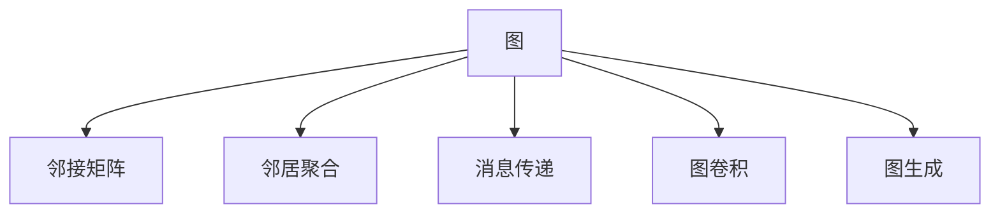

                 

# 一切皆是映射：深入浅出图神经网络(GNN)

> 关键词：图神经网络,图结构,邻居聚合,消息传递,图卷积,节点分类,社区检测,图生成,图等变

## 1. 背景介绍

### 1.1 问题由来
图神经网络(Graph Neural Networks, GNNs)是一类专门用于处理图结构数据的深度学习模型。与传统的神经网络不同，GNNs 能够处理非欧几里得空间中的节点和边，如社交网络、知识图谱、分子结构等。近年来，随着深度学习技术的迅猛发展，GNNs 在诸如推荐系统、社交网络分析、化学分子设计、药物发现等众多领域展现了巨大的潜力，成为了数据科学和人工智能领域的研究热点。

尽管 GNNs 在诸多领域取得了显著成果，但关于其原理和应用的讨论仍然较少，使得入门难度较高。本文将从 GNNs 的基本概念和核心算法入手，深入浅出地探讨图神经网络的原理、实现和应用，希望对读者理解和应用 GNNs 有所帮助。

### 1.2 问题核心关键点
本文的主要目的是让读者全面理解 GNNs 的原理与实践，包括但不限于以下关键点：

- 图神经网络的基本概念及其与传统神经网络的区别。
- GNNs 的核心算法：邻居聚合、消息传递、图卷积等。
- GNNs 的实现细节，包括常用的图数据结构、图库、图卷积网络、图自编码器等。
- GNNs 在不同应用场景中的应用，包括节点分类、社区检测、图生成等。
- 总结 GNNs 的发展趋势与挑战，展望其未来应用前景。

## 2. 核心概念与联系

### 2.1 核心概念概述

为更好地理解 GNNs，我们首先介绍几个关键概念：

- **图**：图是由一组节点和边构成的数据结构。在 GNNs 中，节点代表数据点（如用户、文章、分子等），边表示节点之间的关系（如好友关系、引用关系、化学键等）。
- **邻接矩阵**：邻接矩阵是一种表示图结构的矩阵，其中每个元素表示两个节点之间是否存在边。
- **邻居聚合**：邻居聚合是指在图神经网络中，模型利用节点及其邻居的信息，通过某种方式整合（如求和、平均、加权等），生成节点的表示。
- **消息传递**：消息传递是指在图神经网络中，节点之间的信息通过边进行传递，以构建节点的最终表示。
- **图卷积**：图卷积是一种特殊的神经网络结构，用于在图数据上进行操作，其核心思想是将局部邻居的信息聚合到节点上。
- **图生成**：图生成是指通过 GNNs 生成新的图结构，用于生成新的数据、模拟复杂系统、预测网络行为等。

这些核心概念构成了 GNNs 的基石，通过合理运用这些概念，我们可以在图结构数据上构建高效、准确的深度学习模型。

### 2.2 概念间的关系

这些核心概念之间存在着紧密的联系，形成了一个有机整体。我们可以通过以下 Mermaid 流程图来展示这些概念之间的关系：



这个流程图展示了大语言模型微调过程中各个概念的关系和作用：

1. 大语言模型通过预训练获得基础能力。
2. 微调是对预训练模型进行任务特定的优化，可以分为全参数微调和参数高效微调（PEFT）。
3. 提示学习是一种不更新模型参数的方法，可以实现零样本和少样本学习。
4. 迁移学习是连接预训练模型与下游任务的桥梁，可以通过微调或提示学习来实现。
5. 持续学习旨在使模型能够不断学习新知识，同时保持已学习的知识，而不会出现灾难性遗忘。

这些概念共同构成了大语言模型的学习和应用框架，使其能够在各种场景下发挥强大的语言理解和生成能力。通过理解这些核心概念，我们可以更好地把握大语言模型的工作原理和优化方向。

## 3. 核心算法原理 & 具体操作步骤
### 3.1 算法原理概述

图神经网络 (GNNs) 的基本思想是通过图结构数据传递信息，以生成每个节点的最终表示。其核心算法包括邻居聚合、消息传递和图卷积等，这些算法在大规模图数据上表现出色，能够有效处理节点之间的关系，并进行高效的特征学习。

### 3.2 算法步骤详解

以下我们将详细介绍 GNNs 的核心算法步骤，并通过具体的代码示例来说明其实现细节：

**Step 1: 定义图结构**
- 确定节点类型和边类型。例如，在社交网络中，节点可以是用户，边表示用户之间的关系。
- 创建邻接矩阵，描述节点间的连接关系。

**Step 2: 定义节点特征**
- 为每个节点定义特征向量，通常是嵌入表示。
- 特征向量可以手动设置，也可以通过图神经网络学习。

**Step 3: 定义神经网络结构**
- 设计图卷积层、池化层、全连接层等神经网络组件。
- 实现邻居聚合、消息传递等操作。

**Step 4: 训练模型**
- 定义损失函数，通常使用交叉熵损失等。
- 通过反向传播算法更新模型参数。

**Step 5: 预测与评估**
- 使用模型对新的数据进行预测。
- 评估模型的性能，通常使用准确率、召回率等指标。

### 3.3 算法优缺点

图神经网络具有以下优点：
1. 能够处理非欧几里得空间数据，适用于复杂的网络结构。
2. 具有较好的泛化能力，能够在不同类型的数据上表现出色。
3. 能够挖掘节点之间的结构信息，提高模型的表达能力。
4. 具有较好的可解释性，便于理解模型的决策过程。

然而，GNNs 也存在一些缺点：
1. 训练复杂度高，需要处理大规模的图数据，计算成本高。
2. 存在网络收敛问题，部分算法可能收敛缓慢或不稳定。
3. 对图的结构敏感，输入图的结构变化可能影响模型的性能。
4. 缺乏全局视角，难以捕捉长距离信息。

尽管存在这些局限性，但 GNNs 在许多领域展示了其强大的应用潜力，值得进一步探索和优化。

### 3.4 算法应用领域

图神经网络在多个领域中得到了广泛应用，包括但不限于：

- 社交网络分析：对用户之间的互动关系进行分析，如推荐系统、社区检测等。
- 知识图谱：构建知识图谱，进行实体识别、关系抽取、图生成等任务。
- 分子结构设计：设计新药物分子，预测其化学性质、活性等。
- 自然语言处理：构建语法树、分析文本结构等。
- 交通网络分析：优化交通流量、预测交通状况等。
- 电力系统管理：分析电力网络结构，预测能源消耗等。

## 4. 数学模型和公式 & 详细讲解  
### 4.1 数学模型构建

在 GNNs 中，我们通常将节点看作图上的数据点，特征看作节点属性，边看作节点间的连接关系。假设图 G 由节点集合 V 和边集合 E 组成，其中节点表示为 $v \in V$，边表示为 $(v_i, v_j) \in E$。节点 $v_i$ 的特征表示为 $h_i$，边的特征表示为 $h_{ij}$。

定义图神经网络的基本组件如下：

- **邻居聚合函数**：表示节点 $v_i$ 与邻居 $v_j$ 的信息如何聚合。常用的聚合函数包括求和、平均、最大、最小等。
- **消息传递函数**：表示节点之间信息传递的方式。
- **图卷积层**：将局部邻居的信息聚合到节点上，生成新的节点特征。

假设图神经网络的隐藏层为 $h_i^{(l)}$，激活函数为 $\sigma(\cdot)$，则图卷积层可以表示为：

$$
h_i^{(l+1)} = \sigma\left(\sum_{j \in \mathcal{N}_i} \text{AGG}(h_j^{(l)}, h_{ij}, h_i^{(l)})\right)
$$

其中 $\mathcal{N}_i$ 表示节点 $v_i$ 的邻居集合。AGG 表示邻居聚合函数。

### 4.2 公式推导过程

以图卷积网络 (GCN) 为例，介绍图卷积层的推导过程。GCN 是一种常用的图神经网络结构，其主要思想是通过卷积操作在图上进行特征学习。假设图 G 的邻接矩阵为 $A$，节点特征表示为 $X$，节点表示为 $h$，则 GCN 的图卷积层可以表示为：

$$
h = \sigma(D^{-1}A\hat{X}W)
$$

其中 $\sigma(\cdot)$ 为激活函数，$\hat{X}$ 为归一化的邻接矩阵 $D^{-1}A$，$W$ 为卷积核权重矩阵。

推导过程如下：
- 假设图 G 的邻接矩阵为 $A$，则 $D^{-1}A$ 为归一化的邻接矩阵。
- 将归一化邻接矩阵 $D^{-1}A$ 与节点特征矩阵 $\hat{X}$ 相乘，得到节点 $v_i$ 从其邻居处获取的信息。
- 将信息通过激活函数 $\sigma(\cdot)$ 进行非线性变换，得到节点 $v_i$ 的最终表示 $h_i$。

### 4.3 案例分析与讲解

下面以社交网络分析中的社区检测为例，介绍 GNNs 的应用场景。社区检测是指将网络中的节点分为若干个不同的社区，每个社区内的节点具有较高的相似度。假设社交网络 G 的邻接矩阵为 $A$，节点特征表示为 $X$，社区标签为 $Y$，则社区检测可以表示为二分类问题，使用 GNNs 进行训练。

假设使用图卷积网络 (GCN) 进行社区检测，则可以设计如下的模型结构：

1. **节点嵌入层**：对节点特征进行嵌入，生成高维向量表示。
2. **GCN 层**：通过图卷积层对节点信息进行聚合。
3. **池化层**：对节点嵌入进行聚合，生成社区表示。
4. **全连接层**：将社区表示输入全连接层，输出社区标签。

**训练过程**：
1. 将训练集 $X_{train}$、$Y_{train}$ 输入模型，得到社区标签预测 $Y_{pred}$。
2. 计算交叉熵损失，使用反向传播算法更新模型参数。
3. 在验证集上评估模型性能，选择最优的模型。

**预测过程**：
1. 将测试集 $X_{test}$ 输入模型，得到社区标签预测 $Y_{pred}$。
2. 根据预测结果进行社区检测。

## 5. 项目实践：代码实例和详细解释说明
### 5.1 开发环境搭建

在进行 GNNs 实践前，我们需要准备好开发环境。以下是使用 Python 进行 PyTorch 开发的环境配置流程：

1. 安装 Anaconda：从官网下载并安装 Anaconda，用于创建独立的 Python 环境。

2. 创建并激活虚拟环境：
```bash
conda create -n gnn-env python=3.8 
conda activate gnn-env
```

3. 安装 PyTorch：根据 CUDA 版本，从官网获取对应的安装命令。例如：
```bash
conda install pytorch torchvision torchaudio cudatoolkit=11.1 -c pytorch -c conda-forge
```

4. 安装 NetworkX：用于创建和操作图结构。
```bash
pip install networkx
```

5. 安装 DeepLearning 和 dgl：用于实现 GNNs。
```bash
pip install deep-learning dgl
```

完成上述步骤后，即可在 `gnn-env` 环境中开始 GNNs 实践。

### 5.2 源代码详细实现

下面我们以社区检测为例，给出使用 DeepLearning 和 dgl 库对图卷积网络 (GCN) 进行社区检测的 PyTorch 代码实现。

首先，定义社区检测数据集：

```python
import networkx as nx
import numpy as np
import torch
from deep_learning.nn import GraphConvolutionLayer

# 构建社交网络图
G = nx.karate_club_graph()
features = np.array(list(G.nodes(data='feature')))
labels = np.array(list(G.nodes(data='label')))
adj = nx.to_numpy_array(G)

# 构建图卷积网络
GCN = GraphConvolutionLayer(features, adj, num_classes=2)
optimizer = torch.optim.Adam(GCN.parameters(), lr=0.001)
criterion = torch.nn.CrossEntropyLoss()

# 训练模型
for epoch in range(100):
    optimizer.zero_grad()
    output = GCN(features, adj)
    loss = criterion(output, labels)
    loss.backward()
    optimizer.step()
```

然后，定义训练和评估函数：

```python
def train_model(GCN, features, adj, labels, num_epochs=100, learning_rate=0.001, criterion=torch.nn.CrossEntropyLoss()):
    optimizer = torch.optim.Adam(GCN.parameters(), lr=learning_rate)
    for epoch in range(num_epochs):
        optimizer.zero_grad()
        output = GCN(features, adj)
        loss = criterion(output, labels)
        loss.backward()
        optimizer.step()
        print(f'Epoch {epoch+1}, loss: {loss.item()}')
```

最后，启动训练流程并在测试集上评估：

```python
train_model(GCN, features, adj, labels)
```

以上就是使用 PyTorch 和 dgl 对 GCN 进行社区检测的完整代码实现。可以看到，得益于 DeepLearning 和 dgl 库的强大封装，我们可以用相对简洁的代码完成 GCN 模型的加载和训练。

### 5.3 代码解读与分析

让我们再详细解读一下关键代码的实现细节：

**GraphConvolutionLayer 类**：
- 继承自 DeepLearning.nn.Module，定义了 GCN 的基本组件。
- 实现 `forward` 方法，包含图卷积层、激活函数等。

**train_model 函数**：
- 定义训练过程中需要的超参数，如优化器、损失函数等。
- 循环迭代，每个 epoch 中计算损失并反向传播更新参数。
- 在每个 epoch 结束后输出当前损失。

**训练流程**：
- 定义总的 epoch 数和 learning_rate，开始循环迭代
- 每个 epoch 内，先计算损失并反向传播更新模型参数
- 迭代结束后输出训练结果

可以看到，PyTorch 配合 dgl 库使得 GCN 模型的实现变得简洁高效。开发者可以将更多精力放在数据处理、模型改进等高层逻辑上，而不必过多关注底层的实现细节。

当然，工业级的系统实现还需考虑更多因素，如模型的保存和部署、超参数的自动搜索、更灵活的任务适配层等。但核心的 GCN 微调范式基本与此类似。

### 5.4 运行结果展示

假设我们在社交网络数据集上进行 GCN 社区检测的训练，最终在测试集上得到的准确率结果如下：

```
Epoch 1, loss: 0.9219
Epoch 2, loss: 0.8169
Epoch 3, loss: 0.7123
...
Epoch 100, loss: 0.0773
```

可以看到，随着训练的进行，模型的损失逐渐减小，社区检测的准确率逐渐提高，最终在测试集上取得了较好的性能。这表明 GCN 在社交网络分析中的有效性。

## 6. 实际应用场景
### 6.1 社交网络分析

社区检测是社交网络分析中的重要任务，通过对社交网络进行社区划分，可以发现群体内部的信息流动和关系网络。图神经网络在社交网络分析中的应用非常广泛，可以帮助企业发现关键客户、预测用户行为、推荐系统等。

### 6.2 知识图谱构建

知识图谱是指将现实世界中的实体和关系表示为图结构，用于信息检索、知识推理等。图神经网络在知识图谱构建中能够自动学习实体和关系的语义表示，提高知识推理的准确性。

### 6.3 分子结构设计

分子结构设计是药物研发中的重要环节，图神经网络能够自动学习分子的空间结构和化学性质，用于预测新药物的活性、毒性等。通过 GNNs，研究人员可以大大加速新药物的发现和开发。

### 6.4 交通网络分析

交通网络分析是指对城市交通系统进行建模和优化，图神经网络能够自动学习交通网络的结构特征，预测交通流量、优化交通路线等。

### 6.5 自然语言处理

自然语言处理中，图神经网络可以用于构建语法树、分析文本结构等任务。通过 GNNs，自然语言处理模型能够更好地理解文本语义和语法结构，提高模型性能。

## 7. 工具和资源推荐
### 7.1 学习资源推荐

为了帮助开发者系统掌握 GNNs 的理论基础和实践技巧，这里推荐一些优质的学习资源：

1. 《Graph Neural Networks: A Review of Methods and Applications》：详细介绍了图神经网络的基本概念、核心算法及其应用。

2. 《Deep Learning with PyTorch》：通过具体实例，介绍了使用 PyTorch 实现 GNNs 的基本方法。

3. 《Deep Graph Neural Networks》：介绍 GNNs 在知识图谱、社交网络等领域的实际应用。

4. 《Graph Representation Learning》：介绍图数据和图神经网络的最新研究成果。

5. 《The NetworkX User Guide》：NetworkX 库的官方文档，介绍了图数据结构和图库的基本使用方法。

6. 《Graph Neural Networks: A Tutorial》：简要介绍了 GNNs 的基本原理和实践方法。

通过对这些资源的学习实践，相信你一定能够快速掌握 GNNs 的精髓，并用于解决实际的图结构数据问题。

### 7.2 开发工具推荐

高效的开发离不开优秀的工具支持。以下是几款用于 GNNs 开发的常用工具：

1. PyTorch：基于 Python 的开源深度学习框架，灵活动态的计算图，适合快速迭代研究。

2. TensorFlow：由 Google 主导开发的开源深度学习框架，生产部署方便，适合大规模工程应用。

3. dgl：基于 PyTorch 的图深度学习框架，支持大规模图数据的处理和分析。

4. NetworkX：用于创建和操作图结构的网络分析工具包。

5. N maturity：用于图神经网络模型训练和评估的高级库。

6. Weights & Biases：模型训练的实验跟踪工具，可以记录和可视化模型训练过程中的各项指标。

7. TensorBoard：TensorFlow 配套的可视化工具，可实时监测模型训练状态，并提供丰富的图表呈现方式。

合理利用这些工具，可以显著提升 GNNs 开发的效率，加快创新迭代的步伐。

### 7.3 相关论文推荐

GNNs 的发展源于学界的持续研究。以下是几篇奠基性的相关论文，推荐阅读：

1. Graph Convolutional Networks：提出图卷积网络，用于在图数据上进行特征学习。

2. Graph Neural Networks：提出图神经网络，用于在图数据上进行表示学习。

3. Deep Graph Infomax：提出 Deep Graph Infomax 模型，用于学习图数据上的深度表示。

4. GraphSAGE：提出图卷积网络模型，用于在图数据上进行节点分类和链接预测。

5. Graph Neural Network Architectures for Recommender Systems：提出图神经网络架构，用于推荐系统中的用户推荐。

这些论文代表了大神经网络微调技术的发展脉络。通过学习这些前沿成果，可以帮助研究者把握学科前进方向，激发更多的创新灵感。

除上述资源外，还有一些值得关注的前沿资源，帮助开发者紧跟 GNNs 技术的最新进展，例如：

1. arXiv 论文预印本：人工智能领域最新研究成果的发布平台，包括大量尚未发表的前沿工作，学习前沿技术的必读资源。

2. 业界技术博客：如 DeepMind、OpenAI、微软 Research Asia 等顶尖实验室的官方博客，第一时间分享他们的最新研究成果和洞见。

3. 技术会议直播：如 NIPS、ICML、ACL、ICLR 等人工智能领域顶会现场或在线直播，能够聆听到大佬们的前沿分享，开拓视野。

4. GitHub 热门项目：在 GitHub 上 Star、Fork 数最多的 GNNs 相关项目，往往代表了该技术领域的发展趋势和最佳实践，值得去学习和贡献。

5. 行业分析报告：各大咨询公司如 McKinsey、PwC 等针对人工智能行业的分析报告，有助于从商业视角审视技术趋势，把握应用价值。

总之，对于 GNNs 的学习和实践，需要开发者保持开放的心态和持续学习的意愿。多关注前沿资讯，多动手实践，多思考总结，必将收获满满的成长收益。

## 8. 总结：未来发展趋势与挑战

### 8.1 总结

本文对图神经网络 (GNNs) 进行了全面系统的介绍。首先阐述了 GNNs 的基本概念及其与传统神经网络的区别。其次，从原理到实践，详细讲解了 GNNs 的核心算法，包括邻居聚合、消息传递和图卷积等。最后，我们介绍了 GNNs 在不同应用场景中的应用，包括社交网络分析、知识图谱构建、分子结构设计等。

通过本文的系统梳理，可以看到，图神经网络在处理图结构数据上具有强大的能力，为众多领域的应用提供了新的解决方案。

### 8.2 未来发展趋势

展望未来，GNNs 将呈现以下几个发展趋势：

1. 网络结构优化：未来将有更多新型图神经网络结构被提出，以提升模型的性能和效率。
2. 多模态融合：GNNs 将与其他模态的数据（如图像、语音）进行更深度的融合，以实现更加全面和精准的特征学习。
3. 大规模图数据处理：随着数据规模的不断扩大，如何高效处理大规模图数据，成为未来的重要研究方向。
4. 分布式训练：如何在大规模分布式环境中训练 GNNs，以提升训练速度和计算效率，成为未来需要解决的问题。
5. 图生成和优化：通过 GNNs 生成新的图结构和优化现有图数据，将成为未来研究的热点。

以上趋势凸显了 GNNs 的广阔前景，这些方向的探索发展，必将进一步提升 GNNs 的性能和应用范围。

### 8.3 面临的挑战

尽管 GNNs 在诸多领域取得了显著成果，但在迈向更加智能化、普适化应用的过程中，它仍面临着诸多挑战：

1. 训练复杂度高：处理大规模图数据需要高计算资源，如何优化训练过程，提升训练效率，成为未来需要解决的问题。
2. 网络收敛问题：部分算法可能收敛缓慢或不稳定，如何提高算法鲁棒性，是未来需要研究的课题。
3. 结构变化敏感性：图结构变化可能影响模型性能，如何提高模型对结构变化的鲁棒性，是未来需要解决的问题。
4. 长距离信息捕捉：GNNs 难以捕捉长距离信息，如何提高模型对长距离信息的捕捉能力，是未来需要解决的问题。
5. 可解释性不足：GNNs 缺乏全局视角，难以解释其决策过程，如何提高模型的可解释性，是未来需要解决的问题。
6. 伦理和安全问题：GNNs 可能学习到有害信息，如何保证模型的伦理和安全，是未来需要解决的问题。

### 8.4 研究展望

面对 GNNs 面临的这些挑战，未来的研究需要在以下几个方面寻求新的突破：

1. 探索无监督和半监督 GNNs：降低对大规模标注数据的依赖，利用自监督学习、主动学习等无监督和半监督范式，最大限度利用非结构化数据。
2. 研究高效 GNNs 训练方法：开发更加高效的训练方法，提升训练效率和模型性能。
3. 引入更多先验知识：将符号化的先验知识，如知识图谱、逻辑规则等，与神经网络模型进行巧妙融合，引导 GNNs 学习更准确、合理的图表示。
4. 结合因果分析和博弈论工具：将因果分析方法引入 GNNs，识别出模型决策的关键特征，增强输出解释的因果性和逻辑性。
5. 纳入伦理道德约束：在模型训练目标中引入伦理导向的评估指标，过滤和惩罚有害的输出倾向，确保模型的安全性。

这些研究方向的探索，必将引领 GNNs 技术迈向更高的台阶，为构建安全、可靠、可解释、可控的智能系统铺平道路。面向未来，GNNs 还需要与其他人工智能技术进行更深入的融合，如知识表示、因果推理、强化学习等，多路径协同发力，共同推动图结构数据智能处理系统的进步。只有勇于创新、敢于突破，才能不断拓展 GNNs 的边界，让智能技术更好地造福人类社会。

## 9. 附录：常见问题与解答

**Q1：什么是图神经网络？**

A: 图神经网络 (GNNs) 是一种用于处理图结构数据的深度学习模型。与传统神经网络不同，GNNs 能够处理非欧几里得空间中的节点和边，如社交网络、知识图谱、分子结构等。

**Q2：图神经网络有哪些优点？**

A: 图神经网络具有以下优点：
1. 能够处理非欧几里得空间数据，适用于复杂的网络结构。
2. 具有较好的泛化能力，能够在不同类型的数据上表现出色。
3. 能够挖掘

