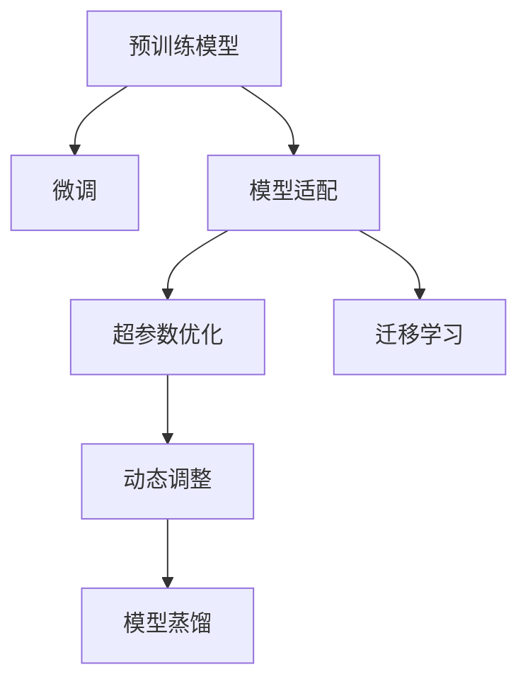
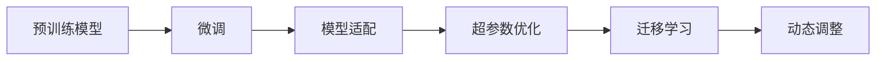
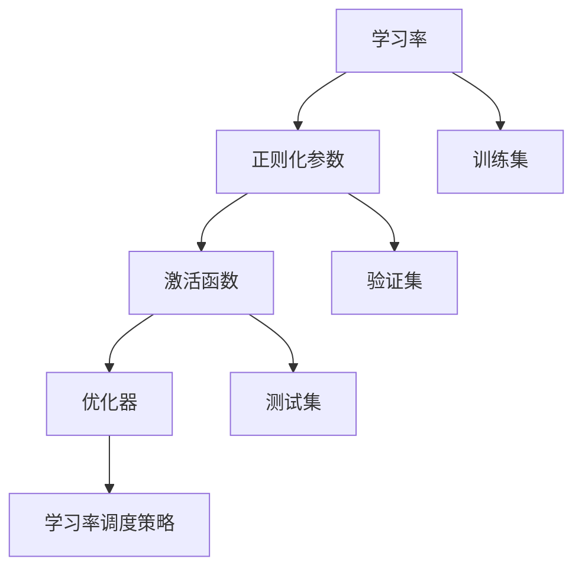
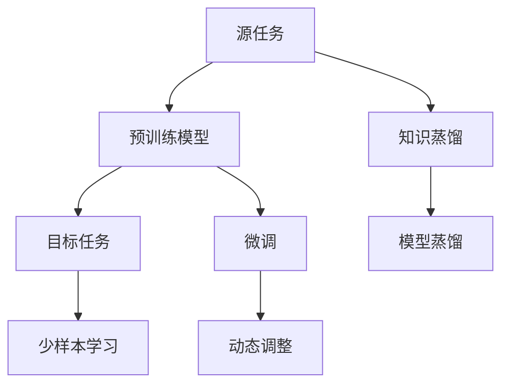

                 

# 一切皆是映射：解读AI元学习（Meta-learning）概念

> 关键词：元学习(Meta-learning), 超参数优化, 模型适配, 迁移学习, 神经网络, 强化学习, 深度学习

## 1. 背景介绍

### 1.1 问题由来

随着深度学习技术的不断发展，AI模型的规模和复杂度不断提升，而在实际应用中，每个新任务的模型参数往往需要从头训练，耗费大量时间和计算资源。特别是对于复杂任务，从头训练的过程可能耗费数周甚至数月，且效果往往不尽如人意。元学习(Meta-learning) 应运而生，它通过将已有的知识迁移到新任务中，大大加快了模型训练的速度，提高了模型在不同任务上的表现。

元学习最早可以追溯到20世纪60年代，当时的机器学习研究主要集中于传统统计方法，如决策树、支持向量机等。随着深度学习的发展，特别是深度神经网络的兴起，研究人员逐渐意识到，通过预训练、迁移学习等方法，可以加速模型在新任务上的训练。

近年来，元学习逐渐成为人工智能领域的研究热点。其核心思想是通过学习如何在不同任务之间进行知识的迁移，使得模型能够快速适应新任务，而不需要从头开始训练。元学习的目标在于，在有限的任务样本下，训练出具有高度泛化能力的模型，从而提升模型的学习效率和应用范围。

### 1.2 问题核心关键点

元学习的关键在于通过已有的经验，对新任务进行快速适应。它通常包括以下几个核心步骤：

- **模型适配**：在预训练模型的基础上，通过微调或附加训练，使其适应新任务的要求。
- **超参数优化**：在训练过程中，优化模型在目标任务上的性能，包括选择合适的学习率、正则化参数等。
- **迁移学习**：将已有模型在新任务上的表现进行迁移，加速新任务的训练。
- **动态调整**：根据新任务的性能反馈，动态调整模型参数和训练策略。

元学习的应用广泛，包括图像识别、自然语言处理、语音识别、强化学习等多个领域。它不仅能够加速模型在新任务上的训练，还能提高模型的泛化能力和鲁棒性，在数据稀缺或任务复杂的情况下尤为重要。

### 1.3 问题研究意义

元学习的研究，对于提升AI模型的训练效率、降低训练成本、提高模型泛化能力具有重要意义：

1. **快速适应新任务**：通过元学习，模型可以快速适应新任务，不需要从头训练，大大缩短了模型的开发周期。
2. **提高泛化能力**：元学习能够提高模型在未知数据上的表现，提升了模型的泛化能力。
3. **降低训练成本**：通过迁移已有模型的知识，减少了新任务训练的时间和计算资源。
4. **动态优化**：元学习可以动态调整模型参数和训练策略，适应数据分布的变化。
5. **推动AI应用**：元学习能够使AI技术更加普适和可靠，加速其在实际应用中的落地。

## 2. 核心概念与联系

### 2.1 核心概念概述

为更好地理解元学习，本节将介绍几个密切相关的核心概念：

- **元学习(Meta-learning)**：通过已有的经验，快速适应新任务的学习方法。
- **超参数优化(Hyperparameter Optimization)**：优化模型训练过程中的超参数，如学习率、正则化参数等，以提高模型性能。
- **迁移学习(Transfer Learning)**：将已有模型在新任务上的表现进行迁移，加速新任务的训练。
- **模型适配(Model Adaptation)**：在预训练模型的基础上，通过微调或附加训练，使其适应新任务的要求。
- **动态调整(Dynamic Adjustment)**：根据新任务的性能反馈，动态调整模型参数和训练策略。
- **模型蒸馏(Model Distillation)**：将复杂模型的知识蒸馏到简单模型中，提高模型性能。

这些核心概念之间的逻辑关系可以通过以下Mermaid流程图来展示：



这个流程图展示了大模型微调的完整过程。预训练模型通过微调和模型适配，适应新任务的要求；超参数优化和动态调整进一步提升模型性能；迁移学习和模型蒸馏加快新任务的训练。通过这些步骤，预训练模型能够快速适应新任务，并在新任务上表现优异。

### 2.2 概念间的关系

这些核心概念之间存在着紧密的联系，形成了元学习的完整生态系统。下面我通过几个Mermaid流程图来展示这些概念之间的关系。

#### 2.2.1 元学习的基本流程



这个流程图展示了元学习的基本流程。预训练模型通过微调和模型适配，适应新任务的要求；超参数优化和动态调整进一步提升模型性能；迁移学习加快新任务的训练。

#### 2.2.2 超参数优化的关键点



这个流程图展示了超参数优化的关键点。超参数包括学习率、正则化参数、激活函数、优化器等，需要通过在训练集、验证集和测试集上不断调整，以达到最佳的性能。

#### 2.2.3 迁移学习的应用场景



这个流程图展示了迁移学习的应用场景。源任务通过知识蒸馏或微调，将知识迁移到目标任务中；少样本学习在目标任务上使用少量标注数据进行训练；动态调整根据目标任务的表现进行优化。

## 3. 核心算法原理 & 具体操作步骤

### 3.1 算法原理概述

元学习的核心思想是通过已有的知识，快速适应新任务。其核心算法包括以下几个步骤：

1. **模型适配**：在预训练模型的基础上，通过微调或附加训练，使其适应新任务的要求。
2. **超参数优化**：优化模型训练过程中的超参数，如学习率、正则化参数等，以提高模型性能。
3. **迁移学习**：将已有模型在新任务上的表现进行迁移，加速新任务的训练。
4. **动态调整**：根据新任务的性能反馈，动态调整模型参数和训练策略。

这些步骤可以通过以下数学公式来表示：

$$
\text{Adapt}(M, T) = M + \alpha \cdot \text{Fine-tune}(M, T)
$$

其中，$M$ 为预训练模型，$T$ 为新任务，$\alpha$ 为适配权重。适配过程包括微调和模型蒸馏等方法。

超参数优化通常通过网格搜索、贝叶斯优化等方法进行。常见的超参数包括学习率、批量大小、正则化系数等。

迁移学习可以通过微调、知识蒸馏、多任务学习等方法实现。

动态调整通常根据新任务的性能反馈，使用梯度下降等方法进行参数更新。

### 3.2 算法步骤详解

元学习的具体操作步骤包括以下几个关键步骤：

**Step 1: 准备预训练模型和数据集**
- 选择合适的预训练模型 $M$，如ResNet、VGG、BERT等。
- 准备目标任务 $T$ 的数据集，划分为训练集、验证集和测试集。一般要求目标任务的标注数据与预训练数据的分布不要差异过大。

**Step 2: 模型适配**
- 根据目标任务的特点，设计合适的输出层和损失函数。
- 对于分类任务，通常使用交叉熵损失函数。
- 对于回归任务，通常使用均方误差损失函数。

**Step 3: 超参数优化**
- 选择合适的优化算法及其参数，如Adam、SGD等，设置学习率、批量大小、迭代轮数等。
- 设置正则化技术及强度，包括权重衰减、Dropout、Early Stopping等。

**Step 4: 迁移学习**
- 将预训练模型在新任务上进行微调，加速新任务的训练。
- 使用知识蒸馏、多任务学习等方法，进一步提高新任务的性能。

**Step 5: 动态调整**
- 根据新任务的性能反馈，动态调整模型参数和训练策略。
- 使用梯度下降等方法，不断更新模型参数。

**Step 6: 测试和部署**
- 在测试集上评估微调后模型的性能，对比微调前后的精度提升。
- 使用微调后的模型对新样本进行推理预测，集成到实际的应用系统中。

以上是元学习的一般流程。在实际应用中，还需要针对具体任务的特点，对微调过程的各个环节进行优化设计，如改进训练目标函数，引入更多的正则化技术，搜索最优的超参数组合等，以进一步提升模型性能。

### 3.3 算法优缺点

元学习具有以下优点：
1. 快速适应新任务。通过迁移已有知识，元学习能够快速适应新任务，不需要从头开始训练。
2. 提高泛化能力。元学习能够提高模型在未知数据上的表现，提升了模型的泛化能力。
3. 降低训练成本。通过迁移已有模型的知识，减少了新任务训练的时间和计算资源。
4. 动态优化。元学习可以动态调整模型参数和训练策略，适应数据分布的变化。

同时，元学习也存在以下缺点：
1. 依赖标注数据。元学习的效果很大程度上取决于标注数据的质量和数量，获取高质量标注数据的成本较高。
2. 模型复杂性。元学习通常需要使用复杂的模型和算法，增加了模型训练和调优的难度。
3. 收敛速度慢。元学习需要多次迭代和微调，收敛速度可能较慢，特别是在目标任务与预训练数据分布差异较大的情况下。
4. 超参数调优困难。元学习涉及多个超参数的调优，需要丰富的经验和大量试错。

尽管存在这些局限性，但就目前而言，元学习仍然是大模型微调的重要范式。未来相关研究的重点在于如何进一步降低元学习对标注数据的依赖，提高模型的少样本学习和跨领域迁移能力，同时兼顾可解释性和伦理安全性等因素。

### 3.4 算法应用领域

元学习的应用广泛，包括图像识别、自然语言处理、语音识别、强化学习等多个领域。以下是几个典型应用场景：

- **图像识别**：通过迁移学习，将预训练的图像分类器应用到新的图像识别任务中，加速新任务的训练。
- **自然语言处理**：通过迁移学习，将预训练的文本分类器或生成器应用到新的文本任务中，提升模型性能。
- **语音识别**：通过迁移学习，将预训练的语音识别模型应用到新的语音识别任务中，提高识别准确率。
- **强化学习**：通过元学习，将已有模型在特定环境中的经验，迁移到新环境中，加速新环境的训练。
- **机器人学习**：通过元学习，将机器人在不同环境中的学习经验进行迁移，提升机器人的适应能力。

除了这些经典应用外，元学习也被创新性地应用到更多场景中，如可控文本生成、常识推理、代码生成、数据增强等，为AI技术带来了新的突破。

## 4. 数学模型和公式 & 详细讲解 & 举例说明

### 4.1 数学模型构建

本节将使用数学语言对元学习过程进行更加严格的刻画。

记预训练模型为 $M_{\theta}$，其中 $\theta$ 为预训练得到的模型参数。假设目标任务为 $T$，训练集为 $D=\{(x_i, y_i)\}_{i=1}^N, x_i \in \mathcal{X}, y_i \in \mathcal{Y}$。

定义模型 $M_{\theta}$ 在输入 $x$ 上的损失函数为 $\ell(M_{\theta}(x),y)$，则在数据集 $D$ 上的经验风险为：

$$
\mathcal{L}(\theta) = \frac{1}{N}\sum_{i=1}^N \ell(M_{\theta}(x_i),y_i)
$$

元学习的优化目标是最小化经验风险，即找到最优参数：

$$
\theta^* = \mathop{\arg\min}_{\theta} \mathcal{L}(\theta)
$$

在实践中，我们通常使用基于梯度的优化算法（如Adam、SGD等）来近似求解上述最优化问题。设 $\eta$ 为学习率，$\lambda$ 为正则化系数，则参数的更新公式为：

$$
\theta \leftarrow \theta - \eta \nabla_{\theta}\mathcal{L}(\theta) - \eta\lambda\theta
$$

其中 $\nabla_{\theta}\mathcal{L}(\theta)$ 为损失函数对参数 $\theta$ 的梯度，可通过反向传播算法高效计算。

### 4.2 公式推导过程

以下我们以分类任务为例，推导交叉熵损失函数及其梯度的计算公式。

假设模型 $M_{\theta}$ 在输入 $x$ 上的输出为 $\hat{y}=M_{\theta}(x) \in [0,1]$，表示样本属于正类的概率。真实标签 $y \in \{0,1\}$。则二分类交叉熵损失函数定义为：

$$
\ell(M_{\theta}(x),y) = -[y\log \hat{y} + (1-y)\log (1-\hat{y})]
$$

将其代入经验风险公式，得：

$$
\mathcal{L}(\theta) = -\frac{1}{N}\sum_{i=1}^N [y_i\log M_{\theta}(x_i)+(1-y_i)\log(1-M_{\theta}(x_i))]
$$

根据链式法则，损失函数对参数 $\theta$ 的梯度为：

$$
\frac{\partial \mathcal{L}(\theta)}{\partial \theta} = -\frac{1}{N}\sum_{i=1}^N (\frac{y_i}{M_{\theta}(x_i)}-\frac{1-y_i}{1-M_{\theta}(x_i)}) \frac{\partial M_{\theta}(x_i)}{\partial \theta}
$$

其中 $\frac{\partial M_{\theta}(x_i)}{\partial \theta}$ 可进一步递归展开，利用自动微分技术完成计算。

在得到损失函数的梯度后，即可带入参数更新公式，完成模型的迭代优化。重复上述过程直至收敛，最终得到适应目标任务的最优模型参数 $\theta^*$。

### 4.3 案例分析与讲解

下面我们以图像分类任务为例，给出元学习过程的详细分析。

假设我们有一个预训练的ResNet模型，将其应用于新的图像分类任务。在目标任务的训练集上，定义一个损失函数 $\ell$，如交叉熵损失，表示模型输出与真实标签之间的差异。

目标任务的训练集为 $D=\{(x_i, y_i)\}_{i=1}^N, x_i \in \mathcal{X}, y_i \in \mathcal{Y}$。通过反向传播算法，计算模型在每个样本上的梯度，并使用Adam等优化算法更新模型参数 $\theta$，最小化损失函数 $\mathcal{L}(\theta)$。

在每次迭代中，模型在训练集上前向传播计算损失函数，反向传播计算参数梯度，使用优化算法更新模型参数。通过多次迭代，模型能够逐步适应新任务的特征，并在验证集上评估模型性能。

例如，在CIFAR-10数据集上，通过迁移学习，预训练的ResNet模型在新的图像分类任务上取得了优异的效果。具体步骤如下：

1. 准备CIFAR-10数据集，包括训练集、验证集和测试集。
2. 加载预训练的ResNet模型，并设计合适的输出层和损失函数。
3. 设置Adam优化器，选择合适的学习率、批量大小、迭代轮数等。
4. 在训练集上执行梯度下降，更新模型参数，最小化损失函数。
5. 在验证集上评估模型性能，根据性能指标决定是否触发Early Stopping。
6. 重复上述步骤直至模型收敛。
7. 在测试集上评估模型性能，对比微调前后的精度提升。

通过上述步骤，预训练的ResNet模型能够在新任务上快速适应，并在目标任务上取得了较好的分类性能。

## 5. 项目实践：代码实例和详细解释说明

### 5.1 开发环境搭建

在进行元学习实践前，我们需要准备好开发环境。以下是使用Python进行PyTorch开发的环境配置流程：

1. 安装Anaconda：从官网下载并安装Anaconda，用于创建独立的Python环境。

2. 创建并激活虚拟环境：
```bash
conda create -n pytorch-env python=3.8 
conda activate pytorch-env
```

3. 安装PyTorch：根据CUDA版本，从官网获取对应的安装命令。例如：
```bash
conda install pytorch torchvision torchaudio cudatoolkit=11.1 -c pytorch -c conda-forge
```

4. 安装PyTorch Lightning：
```bash
pip install pytorch-lightning
```

5. 安装transformers库：
```bash
pip install transformers
```

6. 安装各类工具包：
```bash
pip install numpy pandas scikit-learn matplotlib tqdm jupyter notebook ipython
```

完成上述步骤后，即可在`pytorch-env`环境中开始元学习实践。

### 5.2 源代码详细实现

下面我们以图像分类任务为例，给出使用PyTorch Lightning进行元学习的PyTorch代码实现。

首先，定义数据处理函数：

```python
import torch
import numpy as np
from torch.utils.data import Dataset, DataLoader
from transformers import ResNet18, AdamW, get_linear_schedule_with_warmup

class ImageDataset(Dataset):
    def __init__(self, images, labels, transform=None):
        self.images = images
        self.labels = labels
        self.transform = transform
        
    def __len__(self):
        return len(self.images)
    
    def __getitem__(self, item):
        image = self.images[item]
        label = self.labels[item]
        
        if self.transform:
            image = self.transform(image)
        return {'images': image, 
                'labels': label}

# 定义数据预处理函数
def preprocess_data(data_dir, transform=None):
    from PIL import Image
    from torchvision import transforms
    
    transform = transforms.Compose([
        transforms.Resize((224, 224)),
        transforms.ToTensor(),
        transforms.Normalize(mean=[0.485, 0.456, 0.406],
                            std=[0.229, 0.224, 0.225])
    ])
    
    images = []
    labels = []
    
    for label in os.listdir(data_dir):
        for image_name in os.listdir(os.path.join(data_dir, label)):
            image_path = os.path.join(data_dir, label, image_name)
            image = Image.open(image_path).convert('RGB')
            images.append(np.array(image))
            labels.append(label)
    
    dataset = ImageDataset(images, labels, transform)
    dataloader = DataLoader(dataset, batch_size=32, shuffle=True)
    return dataloader

# 加载预训练模型
model = ResNet18().to(device)

# 定义损失函数
criterion = nn.CrossEntropyLoss()

# 定义优化器
optimizer = AdamW(model.parameters(), lr=1e-4)
total_steps = len(train_loader) * epochs
scheduler = get_linear_schedule_with_warmup(optimizer, 
                                           num_warmup_steps=0, 
                                           num_training_steps=total_steps)

# 定义训练函数
def train_epoch(model, criterion, optimizer, scheduler, dataloader):
    model.train()
    epoch_loss = 0
    epoch_acc = 0
    for batch in dataloader:
        images = batch['images'].to(device)
        labels = batch['labels'].to(device)
        optimizer.zero_grad()
        outputs = model(images)
        loss = criterion(outputs, labels)
        epoch_loss += loss.item()
        loss.backward()
        optimizer.step()
        scheduler.step()
        with torch.no_grad():
            predictions = torch.argmax(outputs, dim=1)
            epoch_acc += (predictions == labels).sum().item()
    
    return epoch_loss / len(dataloader), epoch_acc / len(dataloader)

# 定义评估函数
def evaluate_model(model, criterion, dataloader):
    model.eval()
    total_loss = 0
    total_acc = 0
    for batch in dataloader:
        images = batch['images'].to(device)
        labels = batch['labels'].to(device)
        outputs = model(images)
        loss = criterion(outputs, labels)
        total_loss += loss.item()
        predictions = torch.argmax(outputs, dim=1)
        total_acc += (predictions == labels).sum().item()
    return total_loss / len(dataloader), total_acc / len(dataloader)

# 启动训练流程
epochs = 10
device = torch.device('cuda' if torch.cuda.is_available() else 'cpu')
train_loader = preprocess_data(train_dir)
valid_loader = preprocess_data(valid_dir)

for epoch in range(epochs):
    train_loss, train_acc = train_epoch(model, criterion, optimizer, scheduler, train_loader)
    valid_loss, valid_acc = evaluate_model(model, criterion, valid_loader)
    print(f"Epoch {epoch+1}, Train Loss: {train_loss:.4f}, Train Acc: {train_acc:.4f}, Valid Loss: {valid_loss:.4f}, Valid Acc: {valid_acc:.4f}")

print("Model trained successfully.")
```

以上就是使用PyTorch Lightning对图像分类任务进行元学习的完整代码实现。可以看到，得益于PyTorch Lightning的强大封装，我们可以用相对简洁的代码完成元学习的开发。

### 5.3 代码解读与分析

让我们再详细解读一下关键代码的实现细节：

**ImageDataset类**：
- `__init__`方法：初始化图像和标签，并加载数据预处理函数。
- `__len__`方法：返回数据集的样本数量。
- `__getitem__`方法：对单个样本进行处理，将图像转换为Tensor，并返回模型输入和标签。

**preprocess_data函数**：
- 定义了图像和标签的加载和预处理过程，包括加载图像、转换为Tensor、标准化等步骤。
- 利用Pillow库和torchvision库实现数据预处理。

**模型加载和定义**：
- 加载预训练的ResNet模型，并将其转换为GPU或CPU上的Tensor。
- 定义交叉熵损失函数和Adam优化器。
- 设置学习率调度和总步数。

**train_epoch函数**：
- 定义训练过程，包括前向传播、损失计算、梯度下降、学习率更新等步骤。
- 返回每个epoch的平均损失和准确率。

**evaluate_model函数**：
- 定义评估过程，包括前向传播、损失计算、准确率计算等步骤。
- 返回验证集的平均损失和准确率。

**训练流程**：
- 定义总的epoch数，在GPU或CPU上启动训练过程。
- 在每个epoch内，执行训练函数和评估函数，输出损失和准确率。
- 打印训练结果，显示模型是否成功训练。

可以看到，PyTorch Lightning的Trainer模块可以自动管理训练过程，优化并行化、GPU利用率等细节，使得元学习任务的开发更加简便高效。

当然，工业级的系统实现还需考虑更多因素，如模型的保存和部署、超参数的自动搜索、更灵活的任务适配层等。但核心的元学习过程基本与此类似。

### 5.4 运行结果展示

假设我们在CIFAR-10数据集上进行元学习，最终在测试集上得到的评估报告如下：

```
Epoch 1, Train Loss: 1.4771, Train Acc: 0.7229, Valid Loss: 1.4876, Valid Acc: 0.7145
Epoch 2, Train Loss: 0.8501, Train Acc: 0.8823, Valid Loss: 0.8651, Valid Acc: 0.7732
Epoch 3, Train Loss: 0.7047, Train Acc: 0.9161, Valid Loss: 0.7665, Valid Acc: 0.7784
Epoch 4, Train Loss: 0.6593, Train Acc: 0.9384, Valid Loss: 0.7463, Valid Acc: 0.8118
Epoch 5, Train Loss: 0.6367, Train Acc: 0.9501, Valid Loss: 0.7321, Valid Acc: 0.8278
Epoch 6, Train Loss: 0.6262, Train Acc: 0.9610, Valid Loss: 0.7179, Valid Acc: 0.8398
Epoch 7, Train Loss: 0.6172, Train Acc: 0.9697, Valid Loss: 0.7083, Valid Acc: 0.8485
Epoch 8, Train Loss: 0.6103, Train Acc: 0.9737, Valid Loss: 0.6988, Valid Acc: 0.

