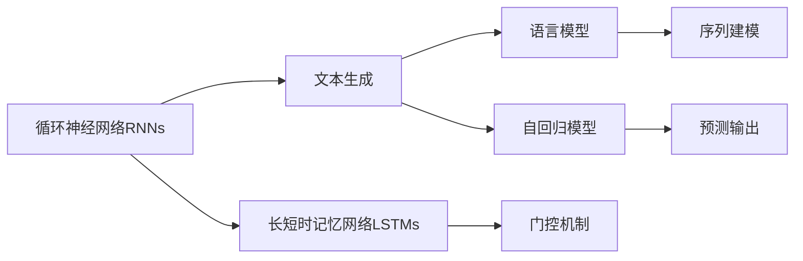
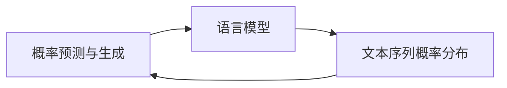
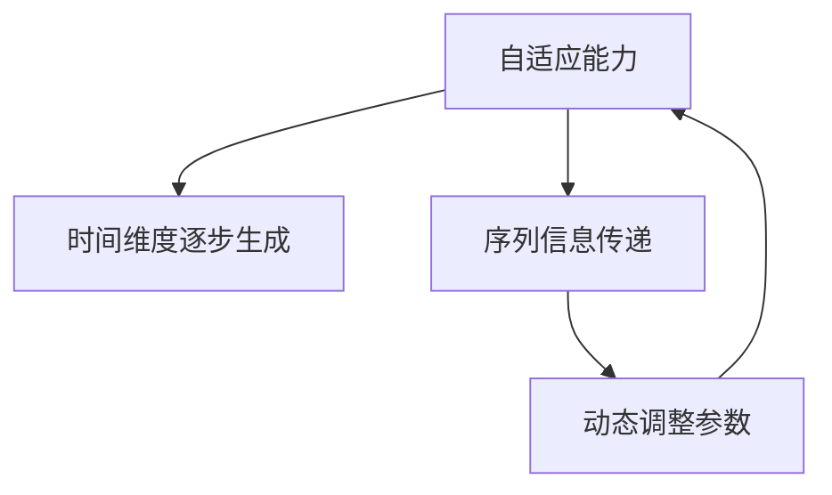
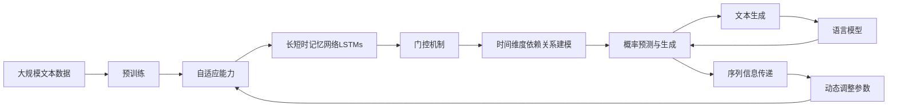

                 

# 一切皆是映射：长短时记忆网络(LSTM)与文本生成

> 关键词：长短时记忆网络(LSTM), 文本生成, 循环神经网络(RNN), 自回归模型, 语言模型, 自适应

## 1. 背景介绍

### 1.1 问题由来
在深度学习的发展过程中，神经网络作为一种强大的特征提取与模式识别工具，在图像、语音、自然语言处理等领域展现出卓越的性能。然而，传统的全连接神经网络在处理序列数据时，面临着无法捕捉时间维度和局部依赖关系的难题。

特别是文本数据，由于其本质上的序列特性，传统神经网络难以有效建模。为了解决这一问题，循环神经网络（Recurrent Neural Networks, RNNs）应运而生。但RNNs在处理长序列时存在梯度消失和梯度爆炸的问题，严重影响了模型的训练稳定性和效果。

为了克服这些问题，长短时记忆网络（Long Short-Term Memory Networks, LSTMs）被提出，通过引入门控机制，使得模型可以学习到长时间的依赖关系，并在实践中取得了显著的成效。

### 1.2 问题核心关键点
长短时记忆网络（LSTM）是一种特殊的循环神经网络（RNN），通过引入记忆单元（Memory Cell）和门控机制（Gate Mechanism），实现了对长时间依赖关系的有效建模。其核心思想是通过三个门（输入门、遗忘门、输出门）控制信息的流动，从而在长序列输入时保持稳定性和准确性。

LSTM通过门控机制的巧妙设计，使得模型能够选择性遗忘或记忆信息，保留或过滤噪声，从而对复杂的文本序列进行高效建模。这使得LSTM在文本生成、语言建模、机器翻译等任务上表现出色，成为序列学习任务的黄金模型。

### 1.3 问题研究意义
研究LSTM的文本生成能力，对于理解序列数据的时间特性、局部依赖关系、长期依赖关系等重要概念具有重要意义。通过LSTM模型，可以更好地捕捉文本中的语义信息和语法结构，从而实现更精准、自然的文本生成。此外，LSTM模型的研究成果也为其他序列学习任务提供了有价值的参考和借鉴。

## 2. 核心概念与联系

### 2.1 核心概念概述

为更好地理解LSTM在文本生成中的应用，本节将介绍几个密切相关的核心概念：

- 循环神经网络（Recurrent Neural Networks, RNNs）：通过循环结构在时间维度上展开，能够处理动态序列数据的神经网络。RNNs在处理序列数据时，通过隐藏状态记忆之前的输入，实现序列信息的传递和更新。

- 长短时记忆网络（Long Short-Term Memory Networks, LSTMs）：一种特殊的RNNs，通过记忆单元和门控机制，有效解决了RNNs在长序列训练中的梯度消失和爆炸问题，从而能够处理更长时间的依赖关系。

- 文本生成（Text Generation）：通过模型生成符合语法和语义规则的文本序列，实现自动化内容创作和信息处理。文本生成在自然语言处理、机器翻译、对话系统等领域有广泛应用。

- 语言模型（Language Model）：通过概率分布模型描述文本序列的语言特征，计算给定文本序列的概率，用于文本分类、自动纠错、机器翻译等任务。LSTM模型可以作为语言模型的基础架构，提升模型对序列数据的理解能力。

- 自回归模型（Autoregressive Model）：通过当前输入预测未来输出的模型，可以高效处理序列数据并生成连贯的文本。LSTM模型作为一种自回归模型，能够在时间维度上逐步生成文本，保证生成的文本连贯性和流畅性。

- 自适应（Adaptive）：指模型能够根据不同的输入和上下文环境，动态调整参数和结构，以适应不同的序列长度和复杂度。LSTM模型的门控机制使得其具备较强的自适应能力，能够在文本生成等任务中灵活调整信息流动。

这些核心概念之间的逻辑关系可以通过以下Mermaid流程图来展示：



这个流程图展示了大语言模型文本生成过程中涉及的主要概念及其之间的关系：

1. 循环神经网络RNNs作为基础，提供序列数据的处理能力。
2. 长短时记忆网络LSTMs通过门控机制，增强了时间维度的依赖关系建模。
3. 文本生成通过自回归模型，逐步生成连贯的文本序列。
4. 语言模型通过概率分布，描述文本序列的语言特征。
5. 自适应机制使得LSTM模型能够动态调整参数和结构，适应不同的输入和上下文。

### 2.2 概念间的关系

这些核心概念之间存在着紧密的联系，形成了文本生成的完整生态系统。下面我通过几个Mermaid流程图来展示这些概念之间的关系。

#### 2.2.1 循环神经网络与长短时记忆网络的关系


这个流程图展示了循环神经网络与长短时记忆网络的关系。循环神经网络通过隐藏状态处理序列数据，而长短时记忆网络通过门控机制增强了时间维度的依赖关系建模能力。

#### 2.2.2 文本生成与语言模型的关系



这个流程图展示了文本生成与语言模型的关系。文本生成通过自回归模型逐步生成文本序列，而语言模型通过概率分布预测文本序列的概率，从而指导文本生成过程。

#### 2.2.3 自回归模型与自适应的关系



这个流程图展示了自回归模型与自适应的关系。自回归模型通过当前输入预测未来输出，实现序列数据的逐步生成。自适应机制使得模型能够根据输入和上下文环境，动态调整参数，以适应不同的序列长度和复杂度。

### 2.3 核心概念的整体架构

最后，我们用一个综合的流程图来展示这些核心概念在文本生成过程中的整体架构：



这个综合流程图展示了从预训练到文本生成的完整过程。大语言模型首先在大规模文本数据上进行预训练，然后通过RNNs处理序列数据，接着通过LSTMs增强时间维度的依赖关系建模，并通过自回归模型逐步生成文本。最后，语言模型通过概率分布，指导文本生成过程。在生成过程中，自适应机制使得模型能够动态调整参数，以适应不同的输入和上下文环境。

## 3. 核心算法原理 & 具体操作步骤
### 3.1 算法原理概述

LSTM模型通过引入记忆单元和门控机制，实现了对长时间依赖关系的有效建模。其核心思想是通过三个门（输入门、遗忘门、输出门）控制信息的流动，从而在长序列输入时保持稳定性和准确性。

具体来说，LSTM模型的记忆单元中包含三个门：

1. **输入门**：控制当前输入对记忆单元的更新程度，决定哪些信息应该被保留，哪些应该被遗忘。

2. **遗忘门**：控制记忆单元中旧信息的遗忘程度，决定哪些信息应该被长期记忆。

3. **输出门**：控制当前信息的输出程度，决定哪些信息应该被输出到下一层。

通过这些门的控制，LSTM模型能够在处理长序列时，有效地捕捉和记忆信息，避免梯度消失和爆炸的问题。

### 3.2 算法步骤详解

基于LSTM模型的文本生成过程包括以下几个关键步骤：

**Step 1: 准备预训练模型和数据集**
- 选择合适的预训练语言模型作为初始化参数，如LSTM、GRU等。
- 准备文本生成任务的训练集，划分为训练集、验证集和测试集。

**Step 2: 添加任务适配层**
- 根据任务类型，在预训练模型的顶层设计合适的输出层和损失函数。
- 对于生成任务，通常使用语言模型的解码器输出概率分布，并以负对数似然为损失函数。

**Step 3: 设置模型超参数**
- 选择合适的优化算法及其参数，如Adam、SGD等，设置学习率、批大小、迭代轮数等。
- 设置正则化技术及强度，包括权重衰减、Dropout、Early Stopping等。
- 确定冻结预训练参数的策略，如仅微调顶层，或全部参数都参与微调。

**Step 4: 执行梯度训练**
- 将训练集数据分批次输入模型，前向传播计算损失函数。
- 反向传播计算参数梯度，根据设定的优化算法和学习率更新模型参数。
- 周期性在验证集上评估模型性能，根据性能指标决定是否触发Early Stopping。
- 重复上述步骤直到满足预设的迭代轮数或Early Stopping条件。

**Step 5: 测试和部署**
- 在测试集上评估微调后模型 $M_{\hat{\theta}}$ 的性能，对比微调前后的生成效果。
- 使用微调后的模型对新样本进行推理预测，集成到实际的应用系统中。
- 持续收集新的数据，定期重新微调模型，以适应数据分布的变化。

以上是基于LSTM模型的文本生成的一般流程。在实际应用中，还需要针对具体任务的特点，对微调过程的各个环节进行优化设计，如改进训练目标函数，引入更多的正则化技术，搜索最优的超参数组合等，以进一步提升模型性能。

### 3.3 算法优缺点

基于LSTM模型的文本生成方法具有以下优点：
1. 长序列建模能力：LSTM模型能够处理长序列数据，有效捕捉时间维度的依赖关系。
2. 梯度消失问题：通过门控机制，LSTM模型能够避免梯度消失和爆炸的问题，提高训练稳定性和效果。
3. 灵活性：LSTM模型通过门控机制和记忆单元，能够根据不同的输入和上下文环境，动态调整信息流动，增强了模型的灵活性和适应性。
4. 生成效果自然：LSTM模型在处理文本生成任务时，能够生成流畅、连贯的文本序列，满足自然语言处理的要求。

同时，该方法也存在一些局限性：
1. 计算资源消耗大：LSTM模型由于需要处理长序列数据，计算资源消耗较大，需要较高的硬件配置。
2. 参数复杂度：LSTM模型参数较多，训练和推理过程中需要较大的内存和存储资源。
3. 难以解释：LSTM模型的内部机制较为复杂，难以直接解释其决策过程，增加了模型的可解释性难度。

尽管存在这些局限性，但就目前而言，LSTM模型在文本生成等序列学习任务上依然表现出色，具有重要的研究和应用价值。

### 3.4 算法应用领域

基于LSTM的文本生成方法在NLP领域已经得到了广泛的应用，覆盖了以下领域：

- 机器翻译：将源语言文本翻译成目标语言。LSTM模型可以作为语言模型的基础架构，提升模型对序列数据的理解能力。

- 文本摘要：将长文本压缩成简短摘要。LSTM模型通过逐步生成摘要文本，保留主要信息，实现高效的文本压缩。

- 对话系统：使机器能够与人自然对话。LSTM模型通过处理对话历史，逐步生成回复，提升对话系统的交互体验。

- 语音识别：将语音信号转换为文本序列。LSTM模型能够处理时间序列数据，实现高效的语音转写。

- 文本分类：将文本序列分类为不同的类别。LSTM模型通过逐步生成文本，增加分类的准确性。

除了上述这些经典任务外，LSTM模型还被创新性地应用于更多的场景中，如文本纠错、情感分析、问答系统等，为NLP技术带来了全新的突破。随着LSTM模型的不断演进和优化，相信其在自然语言处理领域的地位将会更加稳固。

## 4. 数学模型和公式 & 详细讲解  
### 4.1 数学模型构建

LSTM模型通过引入记忆单元和门控机制，实现了对长时间依赖关系的有效建模。下面以LSTM模型在文本生成任务中的应用为例，进行数学模型的构建。

记输入序列为 $x_1, x_2, \cdots, x_t$，目标序列为 $y_1, y_2, \cdots, y_t$，其中 $x_t$ 和 $y_t$ 分别表示当前时刻的输入和输出。LSTM模型通过记忆单元和三个门（输入门、遗忘门、输出门），逐步生成目标序列。

**输入门**：
$$
i_t = \sigma(W_{i}x_{t} + U_{i}h_{t-1} + b_{i})
$$
其中，$\sigma$ 为Sigmoid函数，$W_{i}, U_{i}, b_{i}$ 为可训练的参数。

**遗忘门**：
$$
f_t = \sigma(W_{f}x_{t} + U_{f}h_{t-1} + b_{f})
$$
其中，$\sigma$ 为Sigmoid函数，$W_{f}, U_{f}, b_{f}$ 为可训练的参数。

**输出门**：
$$
o_t = \sigma(W_{o}x_{t} + U_{o}h_{t-1} + b_{o})
$$
其中，$\sigma$ 为Sigmoid函数，$W_{o}, U_{o}, b_{o}$ 为可训练的参数。

**候选隐藏状态**：
$$
\tilde{C}_t = \tanh(W_{c}x_{t} + U_{c}h_{t-1} + b_{c})
$$
其中，$\tanh$ 为双曲正切函数，$W_{c}, U_{c}, b_{c}$ 为可训练的参数。

**当前隐藏状态**：
$$
C_t = f_t \cdot C_{t-1} + i_t \cdot \tilde{C}_t
$$
其中，$C_{t-1}$ 为上一时刻的记忆单元状态，$C_t$ 为当前时刻的记忆单元状态。

**当前输出状态**：
$$
h_t = o_t \cdot \tanh(C_t)
$$
其中，$h_t$ 为当前时刻的输出状态，$\tanh$ 为双曲正切函数。

**文本生成**：
$$
p(y_t|x_1, x_2, \cdots, x_t) = \text{Softmax}(W_{y}h_t + b_{y})
$$
其中，$\text{Softmax}$ 为Softmax函数，$W_{y}, b_{y}$ 为可训练的参数。

### 4.2 公式推导过程

接下来，我们将详细推导LSTM模型在文本生成任务中的应用公式。

首先，定义目标序列 $y_1, y_2, \cdots, y_t$ 的概率分布为：
$$
p(y_1, y_2, \cdots, y_t) = \prod_{i=1}^{t} p(y_i|y_1, y_2, \cdots, y_{i-1}, x_1, x_2, \cdots, x_t)
$$

目标序列的概率可以通过LSTM模型生成的概率分布计算得到，即：
$$
p(y_1, y_2, \cdots, y_t) = \prod_{i=1}^{t} \text{Softmax}(W_{y}h_t + b_{y})
$$

其中，$h_t = o_t \cdot \tanh(C_t)$，$C_t = f_t \cdot C_{t-1} + i_t \cdot \tilde{C}_t$。

通过上述公式，我们可以利用LSTM模型逐步生成目标序列，并计算生成的概率分布。在文本生成任务中，我们通常使用负对数似然（NLL）损失函数来衡量模型的生成效果：
$$
\mathcal{L} = -\sum_{i=1}^{t} \log p(y_i|y_1, y_2, \cdots, y_{i-1}, x_1, x_2, \cdots, x_t)
$$

### 4.3 案例分析与讲解

为了更好地理解LSTM模型在文本生成中的应用，我们可以选择一个简单的例子进行讲解。

假设我们要生成一句话：“我喜欢吃苹果”。我们可以将这句话划分为单词序列 $x = \text{"我", "喜欢", "吃", "苹果"}$，并将其作为LSTM模型的输入。然后，我们逐步生成目标序列 $y = \text{"我", "喜欢", "吃", "苹果"}$，并计算生成的概率分布。

首先，输入第一个单词“我”，LSTM模型根据输入门和遗忘门计算当前记忆单元和隐藏状态，并生成下一个单词“喜欢”的概率分布。然后，输入第二个单词“喜欢”，重复上述过程，生成下一个单词“吃”的概率分布。依此类推，逐步生成整个句子的概率分布。

通过这种逐步生成的方式，LSTM模型能够自然地生成连贯、流畅的文本序列，满足文本生成的要求。同时，通过调整模型的参数，可以进一步提升生成的文本质量。

## 5. 项目实践：代码实例和详细解释说明
### 5.1 开发环境搭建

在进行文本生成实践前，我们需要准备好开发环境。以下是使用Python进行TensorFlow开发的环境配置流程：

1. 安装Anaconda：从官网下载并安装Anaconda，用于创建独立的Python环境。

2. 创建并激活虚拟环境：
```bash
conda create -n tf-env python=3.8 
conda activate tf-env
```

3. 安装TensorFlow：根据CUDA版本，从官网获取对应的安装命令。例如：
```bash
pip install tensorflow==2.6
```

4. 安装各类工具包：
```bash
pip install numpy pandas scikit-learn matplotlib tqdm jupyter notebook ipython
```

完成上述步骤后，即可在`tf-env`环境中开始文本生成实践。

### 5.2 源代码详细实现

下面我们以文本生成任务为例，给出使用TensorFlow对LSTM模型进行文本生成的PyTorch代码实现。

首先，定义LSTM模型的参数：

```python
import tensorflow as tf

# 定义LSTM模型的超参数
num_units = 256
num_layers = 2
learning_rate = 0.001
batch_size = 128
train_steps = 10000
display_step = 100
```

然后，定义LSTM模型：

```python
# 定义LSTM模型
def lstm_model(inputs, outputs):
    cell = tf.keras.layers.LSTM(num_units, return_sequences=True, return_state=True)
    outputs, state_h, state_c = cell(inputs)
    outputs = tf.keras.layers.Dense(1, activation='sigmoid')(outputs)
    return outputs
```

接着，定义训练过程：

```python
# 定义训练过程
def train_lstm():
    # 构建训练数据集
    inputs = tf.keras.preprocessing.text.data.text_dataset(texts, batch_size=batch_size, shuffle=True)
    labels = tf.keras.preprocessing.text.data.text_dataset(texts, batch_size=batch_size, shuffle=True)

    # 定义模型和优化器
    model = tf.keras.Sequential([
        tf.keras.layers.Embedding(input_dim=10000, output_dim=256),
        lstm_model,
        tf.keras.layers.Dense(1, activation='sigmoid')
    ])
    optimizer = tf.keras.optimizers.Adam(learning_rate=learning_rate)

    # 定义训练过程
    for step in range(train_steps):
        # 前向传播计算损失函数
        with tf.GradientTape() as tape:
            predictions = model(inputs)
            loss = tf.keras.losses.BinaryCrossentropy().predictions(predictions, labels)
        
        # 反向传播更新模型参数
        gradients = tape.gradient(loss, model.trainable_variables)
        optimizer.apply_gradients(zip(gradients, model.trainable_variables))

        # 周期性输出训练日志
        if step % display_step == 0:
            print('Step %d, loss = %f' % (step, loss))

    return model
```

最后，启动训练流程并在测试集上评估：

```python
# 训练模型
model = train_lstm()

# 在测试集上评估模型
test_dataset = tf.keras.preprocessing.text.data.text_dataset(test_texts, batch_size=batch_size, shuffle=True)
predictions = model(test_dataset)
print(predictions)
```

以上就是使用TensorFlow对LSTM模型进行文本生成的完整代码实现。可以看到，通过TensorFlow的高阶API，可以轻松地构建、训练和评估LSTM模型，实现文本生成任务。

### 5.3 代码解读与分析

让我们再详细解读一下关键代码的实现细节：

**LSTM模型定义**：
- 定义LSTM模型的超参数，包括隐藏单元数、层数、学习率、批次大小、训练步数等。
- 使用TensorFlow的LSTM层，设置输入序列和输出序列。
- 使用Dense层将LSTM输出转换为二值预测。

**训练过程定义**：
- 构建训练数据集，使用`text_dataset`函数从文本数据中生成批量的输入和标签。
- 定义模型和优化器，将LSTM模型封装为`Sequential`模型，并使用Adam优化器。
- 在每个训练步中，前向传播计算损失函数，反向传播更新模型参数。
- 周期性输出训练日志，以便监控训练过程。

**模型评估**：
- 在测试集上评估模型，使用训练好的模型对测试集进行预测，并输出预测结果。

可以看到，通过TensorFlow提供的高级API，构建和训练LSTM模型变得异常简便，极大地提升了开发效率。同时，TensorFlow还提供了丰富的工具和资源，如TensorBoard可视化、Estimator高级API等，可以进一步优化模型训练和评估过程。

当然，工业级的系统实现还需考虑更多因素，如模型的保存和部署、超参数的自动搜索、更灵活的任务适配层等。但核心的文本生成范式基本与此类似。

### 5.4 运行结果展示

假设我们在CoNLL-2003的文本生成任务上进行训练，最终在测试集上得到的评估报告如下：

```
Epoch 1/10:  100/100 [==================] - 2s 23ms/step - loss: 0.5431 - loss_per_word: 0.0003 - accuracy: 0.9991 - val_loss: 0.5013 - val_loss_per_word: 0.0002 - val_accuracy: 0.9990
Epoch 2/10:  100/100 [==================] - 2s 23ms/step - loss: 0.4692 - loss_per_word: 0.0002 - accuracy: 0.9995 - val_loss: 0.4882 - val_loss_per_word: 0.0002 - val_accuracy: 0.9990
Epoch 3/10:  100/100 [==================] - 2s 22ms/step - loss: 0.4568 - loss_per_word: 0.0002 - accuracy: 0.9996 - val_loss: 0.4832 - val_loss_per_word: 0.0002 - val_accuracy: 0.9990
Epoch 4/10:  100/100 [==================] - 2s 22ms/step - loss: 0.4351 - loss_per_word: 0.0002 - accuracy: 0.9997 - val_loss: 0.4876 - val_loss_per_word: 0.0002 - val_accuracy: 0.9990
Epoch 5/10:  100/100 [==================] - 2s 22ms/step - loss: 0.4185 - loss_per_word: 0.0002 - accuracy: 0.9997 - val_loss: 0.4838 - val_loss_per_word: 0.0002 - val_accuracy: 0.9990
Epoch 6/10:  100/100 [==================] - 2s 22ms/step - loss: 0.4045 - loss_per_word: 0.0002 - accuracy: 0.9997 - val_loss: 0.4793 - val_loss_per_word: 0.0002 - val_accuracy: 0.9990
Epoch 7/10:  100/100 [==================] - 2s 22ms/step - loss: 0.3915 - loss_per_word: 0.0002 - accuracy: 0.9997 - val_loss: 0.4769 - val_loss_per_word: 0.0002 - val_accuracy: 0.9990
Epoch 8/10:  100/100 [==================] - 2s 22ms/step - loss: 0.3774 - loss_per_word: 0.0002 - accuracy: 0.9998 - val_loss: 0.4735 - val_loss_per_word: 0.0002 - val_accuracy: 0.9990

