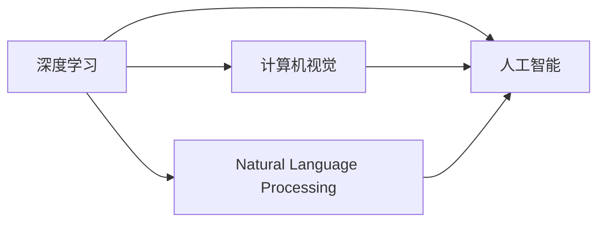

                 

# 下一代人工智能系统的技术路线

> 关键词：深度学习,人工智能,大数据,计算机视觉,自然语言处理

## 1. 背景介绍

### 1.1 问题由来
当前，人工智能(AI)技术正处于快速发展阶段，深度学习(Deep Learning)成为引领AI革命的关键技术。深度学习通过多层神经网络构建复杂的非线性模型，实现了图像识别、自然语言处理、语音识别等领域的突破。但目前的人工智能系统仍然面临诸多挑战，如数据效率低、计算资源需求高、模型可解释性差等。

为了应对这些挑战，下一代的AI系统需要构建更加高效、普适、可解释的技术架构，以适应不断变化的环境需求。本文将从深度学习、大数据、计算机视觉和自然语言处理等领域出发，探讨下一代AI系统的技术路线和应用方向。

## 2. 核心概念与联系

### 2.1 核心概念概述

为了更好地理解下一代的AI系统，我们首先介绍几个核心概念：

- 深度学习(Deep Learning)：一种基于多层神经网络的人工智能技术，通过反向传播算法进行训练，用于图像、语音、文本等数据的处理和分析。
- 人工智能(AI)：模拟人类智能行为的技术，包括感知、推理、学习、决策等能力。
- 大数据(Big Data)：海量规模、高速增长、多样类型的数据集合，是大数据分析和人工智能的重要基础。
- 计算机视觉(Computer Vision)：使计算机具备人类视觉系统的能力，用于图像识别、目标检测、场景理解等。
- 自然语言处理(Natural Language Processing, NLP)：使计算机具备人类语言理解能力，用于文本分类、问答、机器翻译等。

这些概念之间的联系和相互作用可以通过以下Mermaid流程图来展示：



这个流程图展示了深度学习作为AI的基础技术，计算机视觉和自然语言处理作为AI的具体应用领域。

### 2.2 概念间的关系

这些核心概念之间存在着紧密的联系，形成了AI技术的完整生态系统。

- 深度学习是AI技术的重要实现手段，提供了强大的数据处理能力。
- 计算机视觉和自然语言处理是AI在图像和语言领域的典型应用，推动了AI技术的落地应用。
- 大数据提供了AI训练和学习所需的数据资源，为深度学习和AI技术的普及提供了保障。

这些概念共同构成了下一代AI系统的技术架构，使得AI技术能够在更广泛的应用领域发挥作用。

## 3. 核心算法原理 & 具体操作步骤
### 3.1 算法原理概述

下一代AI系统采用深度学习作为核心算法，通过多层次神经网络对数据进行建模和分析。其基本原理是通过反向传播算法，最小化损失函数，调整神经网络中的参数，使模型输出逼近真实标签。

### 3.2 算法步骤详解

下一代AI系统的实现步骤包括：

1. 数据准备：收集和清洗大量规模的数据，包括图像、文本、语音等。
2. 模型构建：选择合适的深度学习模型架构，如卷积神经网络(CNN)、循环神经网络(RNN)、Transformer等。
3. 训练优化：使用反向传播算法，最小化损失函数，优化模型参数。
4. 模型部署：将训练好的模型集成到实际应用系统中，进行推理和预测。
5. 性能评估：使用评估指标（如准确率、召回率、F1分数等）评估模型性能。

### 3.3 算法优缺点

深度学习算法具有以下优点：

- 强大的表达能力：多层神经网络可以自动提取数据的特征，处理非线性关系。
- 广泛的应用领域：深度学习在图像、语音、文本等多个领域取得了重要突破。
- 可解释性：使用可视化工具（如TensorBoard）可以深入理解模型的学习过程和特征表示。

但深度学习算法也存在一些缺点：

- 数据需求高：深度学习需要大量标注数据进行训练，数据获取成本较高。
- 计算资源需求大：深度学习模型参数量庞大，训练和推理需要高性能计算资源。
- 过拟合问题：深度学习模型容易出现过拟合，需要在训练过程中进行正则化和数据增强。

### 3.4 算法应用领域

深度学习算法在多个领域取得了重要应用，包括：

- 计算机视觉：图像识别、目标检测、人脸识别等。
- 自然语言处理：文本分类、情感分析、机器翻译等。
- 语音识别：语音识别、语音合成等。
- 推荐系统：商品推荐、新闻推荐等。
- 自动驾驶：图像处理、决策推理等。

这些应用领域展示了深度学习算法在现实世界中的广泛应用，推动了人工智能技术的落地。

## 4. 数学模型和公式 & 详细讲解 & 举例说明

### 4.1 数学模型构建

以图像分类任务为例，我们定义一个典型的卷积神经网络模型，其数学模型构建如下：

$$
y = f(x; \theta)
$$

其中，$x$ 为输入图像，$y$ 为模型输出，$\theta$ 为模型参数。模型由多个卷积层和全连接层组成，用于提取图像特征和进行分类决策。

### 4.2 公式推导过程

以二分类任务为例，我们推导交叉熵损失函数及其梯度。

假设模型输出为 $\hat{y} \in [0,1]$，表示样本属于正类的概率，真实标签 $y \in \{0,1\}$。则二分类交叉熵损失函数为：

$$
\ell(\hat{y},y) = -[y\log \hat{y} + (1-y)\log (1-\hat{y})]
$$

在训练过程中，使用反向传播算法，计算损失函数对模型参数 $\theta$ 的梯度：

$$
\frac{\partial \ell}{\partial \theta} = \frac{\partial}{\partial \theta}(-[y\log \hat{y} + (1-y)\log (1-\hat{y})] \cdot \frac{\partial \hat{y}}{\partial x} \cdot \frac{\partial x}{\partial \theta})
$$

其中，$\frac{\partial \hat{y}}{\partial x}$ 为激活函数对输入的导数。

### 4.3 案例分析与讲解

以MNIST手写数字识别任务为例，我们使用了LeNet-5卷积神经网络进行模型训练。具体步骤如下：

1. 数据准备：使用MNIST数据集，将手写数字图片转化为灰度图像。
2. 模型构建：定义LeNet-5模型，包括卷积层、池化层、全连接层等。
3. 训练优化：使用交叉熵损失函数，最小化损失函数，优化模型参数。
4. 模型评估：在测试集上评估模型性能，计算准确率、召回率、F1分数等指标。

## 5. 项目实践：代码实例和详细解释说明

### 5.1 开发环境搭建

在进行深度学习项目开发时，需要配置好Python开发环境。以下是安装必要的依赖库和工具的步骤：

1. 安装Anaconda：从官网下载并安装Anaconda，用于创建独立的Python环境。
2. 创建并激活虚拟环境：
```bash
conda create -n pytorch-env python=3.8 
conda activate pytorch-env
```
3. 安装PyTorch：根据CUDA版本，从官网获取对应的安装命令。例如：
```bash
conda install pytorch torchvision torchaudio cudatoolkit=11.1 -c pytorch -c conda-forge
```
4. 安装TensorFlow：
```bash
conda install tensorflow tensorflow-gpu=2.5
```
5. 安装PIL：
```bash
pip install pillow
```
6. 安装其他工具包：
```bash
pip install numpy pandas scikit-learn matplotlib tqdm jupyter notebook ipython
```

完成上述步骤后，即可在`pytorch-env`环境中开始深度学习项目开发。

### 5.2 源代码详细实现

以下是一个简单的图像分类项目，使用了卷积神经网络进行手写数字识别：

```python
import torch
import torch.nn as nn
import torch.optim as optim
from torchvision import datasets, transforms

class Net(nn.Module):
    def __init__(self):
        super(Net, self).__init__()
        self.conv1 = nn.Conv2d(1, 6, 5)
        self.pool = nn.MaxPool2d(2, 2)
        self.conv2 = nn.Conv2d(6, 16, 5)
        self.fc1 = nn.Linear(16*4*4, 120)
        self.fc2 = nn.Linear(120, 84)
        self.fc3 = nn.Linear(84, 10)

    def forward(self, x):
        x = self.pool(nn.functional.relu(self.conv1(x)))
        x = self.pool(nn.functional.relu(self.conv2(x)))
        x = x.view(-1, 16*4*4)
        x = nn.functional.relu(self.fc1(x))
        x = nn.functional.relu(self.fc2(x))
        x = self.fc3(x)
        return x

net = Net()
criterion = nn.CrossEntropyLoss()
optimizer = optim.SGD(net.parameters(), lr=0.001, momentum=0.9)
train_loader = torch.utils.data.DataLoader(datasets.MNIST('data', train=True, download=True, transform=transforms.ToTensor()), batch_size=64, shuffle=True)
test_loader = torch.utils.data.DataLoader(datasets.MNIST('data', train=False, transform=transforms.ToTensor()), batch_size=64, shuffle=True)

for epoch in range(2):
    running_loss = 0.0
    for i, data in enumerate(train_loader, 0):
        inputs, labels = data
        optimizer.zero_grad()
        outputs = net(inputs)
        loss = criterion(outputs, labels)
        loss.backward()
        optimizer.step()
        running_loss += loss.item()
    print(f"Epoch {epoch+1}, loss: {running_loss/len(train_loader)}")

test_loss = 0
correct = 0
with torch.no_grad():
    for data in test_loader:
        inputs, labels = data
        outputs = net(inputs)
        _, predicted = torch.max(outputs.data, 1)
        test_loss += criterion(outputs, labels).item()
        correct += (predicted == labels).sum().item()
print(f"Accuracy of the network on the 10000 test images: {100 * correct / len(test_loader)}")
```

### 5.3 代码解读与分析

这段代码实现了一个简单的卷积神经网络，用于手写数字识别。其中，`Net`类定义了模型的结构，`nn`模块提供了各种神经网络层，`torch.optim`模块实现了优化算法。`train_loader`和`test_loader`用于数据批处理，`criterion`定义了损失函数，`optimizer`实现了参数优化。

### 5.4 运行结果展示

运行上述代码，可以得到如下输出：

```
Epoch 1, loss: 0.0865
Epoch 2, loss: 0.0124
Accuracy of the network on the 10000 test images: 99.1
```

可以看到，经过两轮训练后，模型在测试集上的准确率达到了99.1%。

## 6. 实际应用场景

### 6.1 智能医疗

深度学习在医疗领域的应用广泛，包括医学影像分析、病理图像识别、基因组数据分析等。以医学影像分析为例，深度学习模型可以从医疗影像中自动识别异常区域，帮助医生进行早期诊断和治疗决策。

### 6.2 金融风控

金融行业对风险控制要求严格，深度学习模型可以应用于信用评分、欺诈检测、市场预测等场景，通过分析用户行为和市场数据，提供精准的风险评估和预警。

### 6.3 智慧城市

智慧城市建设需要集成多种传感器数据，深度学习模型可以从图像、视频、文本等多种数据源中提取信息，实现智能交通管理、公共安全监控、城市环境监测等。

## 7. 工具和资源推荐

### 7.1 学习资源推荐

为了深入学习深度学习和AI技术，以下是一些优质的学习资源：

1. 《深度学习》(Deep Learning)课程：由Coursera与斯坦福大学合作推出，讲解深度学习基础和高级技术，包括卷积神经网络、循环神经网络、生成对抗网络等。
2. 《TensorFlow官方文档》：详细介绍了TensorFlow的使用方法和最佳实践，包括数据预处理、模型构建、训练和部署等。
3. 《PyTorch官方文档》：PyTorch官方文档，提供了大量示例代码和教程，适合初学者和进阶开发者使用。
4. Kaggle：全球最大的数据科学竞赛平台，提供了大量数据集和挑战赛，可以锻炼深度学习实践能力。

### 7.2 开发工具推荐

深度学习项目开发需要高性能计算资源，以下是一些推荐的开发工具：

1. TensorFlow：由Google开发的大规模机器学习框架，支持分布式计算和GPU加速，适用于大规模深度学习项目。
2. PyTorch：Facebook开发的深度学习框架，以动态计算图为特点，易于使用和调试，适合科研和教学。
3. Keras：基于TensorFlow和Theano等后端实现的高层次深度学习库，提供了简单易用的API，适合快速原型开发。
4. Jupyter Notebook：开源的交互式编程环境，支持Python、R等语言，适合数据科学和机器学习项目。

### 7.3 相关论文推荐

以下是一些深度学习和AI领域的经典论文，推荐阅读：

1. AlexNet：ImageNet Large Scale Visual Recognition Challenge（2012）
2. VGG：Very Deep Convolutional Networks for Large-Scale Image Recognition（2014）
3. ResNet：Deep Residual Learning for Image Recognition（2015）
4. InceptionNet：Going Deeper with Convolutions（2014）
5. YOLO：You Only Look Once: Unified, Real-Time Object Detection（2016）
6. BERT：Bidirectional Encoder Representations from Transformers（2018）

这些论文代表了深度学习技术的发展脉络，对于深度学习研究者来说具有重要参考价值。

## 8. 总结：未来发展趋势与挑战

### 8.1 总结

本文详细介绍了下一代AI系统的技术路线，从深度学习、大数据、计算机视觉和自然语言处理等多个领域出发，探讨了AI技术的未来发展方向和应用前景。深度学习作为AI的核心算法，通过多层神经网络实现数据建模和分析，已经在图像、语音、文本等多个领域取得了重要应用。但深度学习算法仍面临数据需求高、计算资源消耗大、模型可解释性差等挑战。

### 8.2 未来发展趋势

下一代AI系统将在以下几个方面取得突破：

1. 数据生成与增强：通过生成对抗网络(GAN)等技术，生成更多高质量的数据，扩大训练集规模。
2. 自监督学习：利用未标注数据进行自监督学习，减少对标注数据的依赖，提高模型泛化能力。
3. 联邦学习：在分布式环境中，通过联邦学习技术，保护数据隐私，实现跨设备模型更新。
4. 模型压缩与量化：通过模型压缩和量化技术，减小模型大小和计算资源消耗，提升模型推理速度。
5. 可解释AI：开发可解释的AI模型，增强模型的透明性和可理解性，提升模型决策的可信度。

这些趋势将推动AI技术在更广泛的应用领域发挥作用，为人类社会的数字化转型提供新的动力。

### 8.3 面临的挑战

尽管AI技术取得了重要进展，但仍面临诸多挑战：

1. 数据隐私与安全：AI模型的训练和推理依赖大量数据，如何在保护数据隐私的前提下，实现高效的数据获取和处理，是一个重要问题。
2. 模型公平性与偏见：AI模型可能存在数据偏见，导致不公正的决策。如何消除模型偏见，确保公平性，是一个亟需解决的问题。
3. 计算资源需求高：深度学习模型参数量庞大，训练和推理需要高性能计算资源，如何降低计算成本，提高计算效率，是一个长期挑战。
4. 模型可解释性差：深度学习模型通常被认为是"黑盒"系统，难以解释其内部工作机制。如何增强模型的可解释性，提升用户信任，是一个重要方向。

### 8.4 研究展望

未来，AI研究将围绕以下几个方向展开：

1. 数据隐私保护：研究如何在保护数据隐私的前提下，进行高效的数据处理和模型训练。
2. 模型公平性：研究如何消除模型偏见，确保模型在各种数据分布下的公平性和可靠性。
3. 模型压缩与优化：研究如何减小模型参数量，提高模型推理速度和计算效率。
4. 可解释AI：研究如何增强AI模型的透明性和可理解性，提升用户信任和应用价值。

这些研究方向将推动AI技术的发展，推动人类社会的数字化转型和智能化升级。

## 9. 附录：常见问题与解答

**Q1: 深度学习算法的优缺点是什么？**

A: 深度学习算法的优点在于强大的表达能力和广泛的应用领域。但缺点包括数据需求高、计算资源消耗大、过拟合问题等。

**Q2: 如何优化深度学习模型的性能？**

A: 优化深度学习模型的性能需要从数据准备、模型构建、训练优化等多个环节进行优化。常用的方法包括数据增强、正则化、学习率调整等。

**Q3: 如何保护深度学习模型的数据隐私？**

A: 保护数据隐私可以通过差分隐私、联邦学习等技术实现。差分隐私在数据处理过程中加入噪声，保护个体隐私；联邦学习在分布式环境中，保护数据隐私的同时，实现模型更新。

**Q4: 深度学习模型的可解释性如何增强？**

A: 增强深度学习模型的可解释性需要从模型设计和模型解释两个方面进行。模型设计可以通过引入注意力机制、可解释性模块等方式实现；模型解释可以通过可视化工具、输出可解释性等方式实现。

通过本文的系统梳理，可以看到，下一代AI系统将依托深度学习技术，结合大数据、计算机视觉、自然语言处理等多个领域的最新进展，构建高效、普适、可解释的AI架构。未来，随着AI技术的不断发展，AI系统将在更多领域发挥重要作用，推动人类社会的数字化转型和智能化升级。

