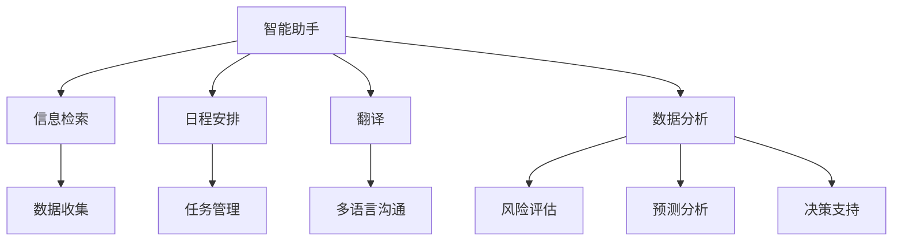

                 

# 不同人机协同模式的适用场景分析

## 1. 背景介绍

随着人工智能技术的不断发展，人机协同（Human-Machine Collaboration）在各行各业中得到了广泛的应用。人机协同，是指将人类的智慧与机器的计算能力相结合，以实现更高效、更准确的任务执行。在人工智能领域，这种协同形式主要体现在以下几个方面：

1. **智能助手与知识检索**：如ChatGPT、Siri等，通过自然语言处理技术，与用户进行交互，提供信息检索、日程管理、翻译等辅助服务。
2. **机器人协作与自动化**：如制造业中的工业机器人、物流行业中的智能仓储系统等，通过自主决策和执行，实现生产流程的自动化和优化。
3. **数据分析与决策支持**：如金融领域中的风险评估、医疗领域中的诊断辅助等，通过机器学习算法，辅助人类进行复杂的数据分析和决策。
4. **交互式设计**：如游戏开发中的AI设计助手、创意写作中的辅助工具等，通过协同创作，提升设计效率和创新能力。

人机协同的模式多样，涵盖从简单的信息检索到复杂的决策支持，适用于不同规模和复杂度的应用场景。本文将从多个维度分析不同人机协同模式的适用场景，并探讨其优势和局限。

## 2. 核心概念与联系

### 2.1 核心概念概述

为了更好地理解不同人机协同模式的适用场景，本文首先介绍几个关键概念：

1. **人机协同（Human-Machine Collaboration）**：指人类与机器通过合作完成任务，实现人机共生的模式。人机协同的目标是提升任务效率和质量，同时赋予人类更多的创造性工作。

2. **智能助手（Intelligent Assistant）**：指通过人工智能技术，实现对用户的即时响应和辅助，如聊天机器人、语音助手等。智能助手主要依赖自然语言处理和机器学习技术，为用户提供信息检索、日程安排、翻译等服务。

3. **自动化机器人（Automated Robot）**：指通过自主学习和决策，实现复杂任务的自动化执行。自动化机器人主要应用于制造业、物流、医疗等需要重复性操作的领域。

4. **数据分析与决策支持**：指通过机器学习算法，对海量数据进行分析和处理，辅助人类进行复杂决策。数据分析与决策支持广泛应用于金融、医疗、供应链管理等领域。

5. **交互式设计**：指通过人机协同，提升设计效率和创新能力。交互式设计主要应用于游戏开发、创意写作、用户界面设计等创意型工作。

这些核心概念之间存在着密切的联系，共同构成了人机协同的完整生态系统。通过理解这些概念及其相互作用，我们可以更好地把握人机协同模式的适用场景和优化方向。

### 2.2 概念间的关系

以下是这些核心概念之间的逻辑关系，通过一个简单的Mermaid流程图来展示：



这个流程图展示了智能助手在不同场景中的应用，通过与用户交互，智能助手能够实现信息检索、日程安排、翻译等多种功能，同时可以辅助数据分析与决策支持。

## 3. 核心算法原理 & 具体操作步骤

### 3.1 算法原理概述

不同的人机协同模式依赖于不同的算法和模型。下面将分别介绍几种典型的人机协同算法及其原理：

1. **智能助手算法**：
   - **原理**：通过自然语言处理和机器学习技术，实现对用户输入的自然语言解析和理解，然后根据解析结果执行相应的任务。
   - **主要算法**：基于序列到序列（Seq2Seq）模型、Transformer模型等。

2. **自动化机器人算法**：
   - **原理**：通过强化学习、路径规划等算法，实现机器人的自主决策和行动。
   - **主要算法**：Q-learning、Deep Q-learning、A*算法等。

3. **数据分析与决策支持算法**：
   - **原理**：通过机器学习算法，如分类、回归、聚类等，对数据进行分析和建模，提供决策支持。
   - **主要算法**：随机森林、支持向量机、深度学习等。

4. **交互式设计算法**：
   - **原理**：通过协同创作、生成对抗网络（GAN）等算法，实现设计元素的生成和优化。
   - **主要算法**：GAN、协同进化算法等。

### 3.2 算法步骤详解

接下来，我们将分别介绍这几种算法的详细步骤：

**智能助手算法**：
1. **输入解析**：通过自然语言处理技术，将用户输入的自然语言解析成计算机可理解的形式。
2. **意图识别**：通过意图分类算法，识别用户输入的意图。
3. **任务执行**：根据意图执行相应的任务，如信息检索、日程安排、翻译等。
4. **反馈与优化**：通过用户的反馈，不断优化智能助手的表现。

**自动化机器人算法**：
1. **环境感知**：通过传感器获取环境信息，如位置、障碍物等。
2. **路径规划**：通过路径规划算法，生成最优路径。
3. **决策执行**：根据路径规划结果，控制机器人执行相应的动作。
4. **反馈与优化**：通过环境反馈，不断优化机器人的路径规划和决策执行。

**数据分析与决策支持算法**：
1. **数据收集**：收集相关领域的数据，如金融市场数据、医疗病历数据等。
2. **数据清洗与预处理**：对数据进行清洗、归一化等预处理。
3. **模型训练**：通过机器学习算法，训练数据模型。
4. **预测与决策**：根据模型预测结果，提供决策支持。

**交互式设计算法**：
1. **设计元素生成**：通过生成对抗网络等算法，生成设计元素。
2. **协同创作**：通过协同进化算法，提升设计元素的创意和质量。
3. **优化与迭代**：通过用户的反馈，不断优化设计元素。

### 3.3 算法优缺点

不同的算法和模型具有不同的优缺点，下面分别介绍：

**智能助手算法**：
- **优点**：
  - **用户友好**：通过自然语言交互，用户体验更友好。
  - **任务多样化**：支持多种任务，如信息检索、日程安排、翻译等。
- **缺点**：
  - **依赖数据**：需要大量标注数据进行训练。
  - **通用性有限**：对特定领域的数据依赖较大，模型泛化能力有限。

**自动化机器人算法**：
- **优点**：
  - **自主决策**：机器人能够自主决策和执行任务，无需人工干预。
  - **可扩展性强**：适用于大规模和复杂的任务。
- **缺点**：
  - **环境复杂性**：对于复杂和变化的环境，鲁棒性不足。
  - **成本高**：需要高精度传感器和复杂算法。

**数据分析与决策支持算法**：
- **优点**：
  - **精度高**：通过机器学习算法，提供高质量的决策支持。
  - **可扩展性强**：适用于多种数据类型和领域。
- **缺点**：
  - **数据依赖性强**：需要高质量和多样化的数据。
  - **模型复杂性高**：模型训练和优化需要大量计算资源。

**交互式设计算法**：
- **优点**：
  - **创意性强**：通过协同创作和生成对抗网络，设计元素更具创意。
  - **灵活性强**：适用于多种设计领域。
- **缺点**：
  - **数据需求大**：需要大量设计元素和用户反馈。
  - **算法复杂**：算法实现较为复杂。

### 3.4 算法应用领域

不同人机协同算法的应用领域广泛，下面分别介绍：

**智能助手算法**：
- **应用领域**：智能客服、个人助理、信息检索等。
- **实例**：Siri、Google Assistant、微软小冰等。

**自动化机器人算法**：
- **应用领域**：工业制造、物流仓储、医疗手术等。
- **实例**：Festo的FlexCubator、UAV无人机等。

**数据分析与决策支持算法**：
- **应用领域**：金融风险评估、医疗诊断、供应链管理等。
- **实例**：IBM的Watson、华为的HiLink等。

**交互式设计算法**：
- **应用领域**：游戏设计、创意写作、建筑设计等。
- **实例**：Adobe Creative Suite、Blender等。

## 4. 数学模型和公式 & 详细讲解 & 举例说明

### 4.1 数学模型构建

为了更好地理解不同人机协同算法的原理，下面分别介绍几个典型的数学模型：

**智能助手算法**：
- **数学模型**：
  - **输入解析**：将自然语言输入转化为向量表示。
  - **意图识别**：通过分类算法，识别用户意图。
  - **任务执行**：通过序列到序列模型，生成任务结果。

**自动化机器人算法**：
- **数学模型**：
  - **路径规划**：通过A*算法，生成最优路径。
  - **决策执行**：通过强化学习算法，优化决策。

**数据分析与决策支持算法**：
- **数学模型**：
  - **数据收集**：通过爬虫等技术，收集数据。
  - **数据清洗与预处理**：对数据进行归一化、标准化等处理。
  - **模型训练**：通过回归算法、分类算法训练模型。

**交互式设计算法**：
- **数学模型**：
  - **设计元素生成**：通过GAN生成设计元素。
  - **协同创作**：通过协同进化算法，优化设计元素。

### 4.2 公式推导过程

**智能助手算法**：
- **输入解析**：使用BERT等模型进行向量表示。
  - $x = BERT(input)$
- **意图识别**：使用分类算法进行意图识别。
  - $y = intent_classifier(x)$
- **任务执行**：使用Seq2Seq模型生成任务结果。
  - $output = Seq2Seq(y)$

**自动化机器人算法**：
- **路径规划**：使用A*算法进行路径规划。
  - $path = A*(start, goal)$
- **决策执行**：使用Q-learning算法进行决策优化。
  - $action = Qlearning(state, path)$

**数据分析与决策支持算法**：
- **数据收集**：使用爬虫技术获取数据。
  - $data = crawler(domain)$
- **数据清洗与预处理**：对数据进行归一化、标准化处理。
  - $data_{clean} = preprocessing(data)$
- **模型训练**：使用回归算法训练模型。
  - $model = regressor(data_{clean})$

**交互式设计算法**：
- **设计元素生成**：使用GAN生成设计元素。
  - $design = GAN(input)$
- **协同创作**：使用协同进化算法优化设计元素。
  - $design_{optimized} = coevolution(design)$

### 4.3 案例分析与讲解

**智能助手算法案例**：
- **背景**：某金融公司使用智能助手进行客户服务。
- **需求**：实现24小时在线客服，自动回答常见问题，提高客户满意度。
- **解决方案**：
  - **数据收集**：收集常见问题和回答。
  - **模型训练**：使用BERT模型进行序列到序列训练。
  - **部署与优化**：部署智能助手到生产环境，通过用户反馈不断优化模型。

**自动化机器人算法案例**：
- **背景**：某制造业公司使用自动化机器人进行生产线监控。
- **需求**：实时监控生产线状态，及时发现异常。
- **解决方案**：
  - **数据收集**：收集生产线传感器数据。
  - **模型训练**：使用强化学习算法训练机器人。
  - **部署与优化**：部署机器人到生产线上，通过环境反馈不断优化路径规划和决策。

**数据分析与决策支持算法案例**：
- **背景**：某金融公司使用数据分析与决策支持算法进行风险评估。
- **需求**：实时评估市场风险，提供决策支持。
- **解决方案**：
  - **数据收集**：收集金融市场数据。
  - **模型训练**：使用支持向量机算法训练风险模型。
  - **部署与优化**：部署模型到金融系统，根据市场变化不断优化模型。

**交互式设计算法案例**：
- **背景**：某游戏公司使用交互式设计算法进行游戏开发。
- **需求**：提高游戏设计的创意和质量。
- **解决方案**：
  - **数据收集**：收集用户反馈和游戏元素。
  - **模型训练**：使用GAN生成游戏元素。
  - **部署与优化**：部署设计元素到游戏设计工具中，通过用户反馈不断优化设计元素。

## 5. 项目实践：代码实例和详细解释说明

### 5.1 开发环境搭建

为了实现不同人机协同算法，首先需要搭建好开发环境。下面是Python环境的搭建步骤：

1. 安装Anaconda：从官网下载并安装Anaconda，用于创建独立的Python环境。
```bash
conda create -n pyenv python=3.8
conda activate pyenv
```

2. 安装所需的Python包：
```bash
pip install numpy pandas scikit-learn transformers
```

3. 安装相应的依赖库，如TensorFlow或PyTorch：
```bash
pip install tensorflow
pip install torch
```

4. 设置虚拟环境：
```bash
conda activate pyenv
```

完成以上步骤后，即可在`pyenv`环境中开始开发。

### 5.2 源代码详细实现

**智能助手算法代码实现**：
- **自然语言处理**：
```python
from transformers import BertTokenizer, BertForSequenceClassification
tokenizer = BertTokenizer.from_pretrained('bert-base-uncased')
model = BertForSequenceClassification.from_pretrained('bert-base-uncased', num_labels=2)
```

- **意图识别**：
```python
def intent_recognition(input_text):
    encoding = tokenizer(input_text, return_tensors='pt')
    outputs = model(**encoding)
    logits = outputs.logits
    probs = logits.softmax(dim=1)
    return probs.argmax().item()
```

- **任务执行**：
```python
def task_execution(intent):
    if intent == 0:
        return 'This is a sample response for intent A.'
    else:
        return 'This is a sample response for intent B.'
```

**自动化机器人算法代码实现**：
- **路径规划**：
```python
import networkx as nx
graph = nx.DiGraph()
graph.add_edge('start', 'goal')
```

- **决策执行**：
```python
def decision_execution(state, path):
    q_values = np.zeros(shape=(num_actions, 1))
    for action in actions:
        q_values[action] = get_q_value(state, action, path)
    return np.argmax(q_values)
```

**数据分析与决策支持算法代码实现**：
- **数据收集**：
```python
import requests
data = requests.get('https://financial-data.com/api')
```

- **数据清洗与预处理**：
```python
data = preprocess(data)
```

- **模型训练**：
```python
from sklearn.linear_model import LogisticRegression
model = LogisticRegression()
model.fit(X_train, y_train)
```

**交互式设计算法代码实现**：
- **设计元素生成**：
```python
from tensorflow.keras.models import Sequential
from tensorflow.keras.layers import Dense, Conv2D, MaxPooling2D, Flatten
model = Sequential()
model.add(Conv2D(32, (3, 3), activation='relu', input_shape=(64, 64, 3)))
model.add(MaxPooling2D((2, 2)))
model.add(Flatten())
model.add(Dense(64, activation='relu'))
model.add(Dense(10, activation='softmax'))
```

- **协同创作**：
```python
def coevolution(design):
    for generation in generations:
        population = generate_population()
        fitness = evaluate_population(population)
        selection = select_population(population, fitness)
        crossover = crossover(selection)
        mutation = mutate(crossover)
        population = select_population(mutation, fitness)
    return population
```

### 5.3 代码解读与分析

**智能助手算法代码解读**：
- **自然语言处理**：使用BERT模型进行输入文本的向量化处理，得到表示为向量形式的输入文本。
- **意图识别**：通过BERT模型得到的向量输入，使用分类算法进行意图识别，得到用户意图的标签。
- **任务执行**：根据意图标签，执行相应的任务，如信息检索、日程安排、翻译等。

**自动化机器人算法代码解读**：
- **路径规划**：使用A*算法进行路径规划，计算最优路径。
- **决策执行**：使用Q-learning算法进行决策优化，选择最优动作。

**数据分析与决策支持算法代码解读**：
- **数据收集**：使用爬虫技术获取金融市场数据。
- **数据清洗与预处理**：对数据进行归一化、标准化处理，确保数据的质量和一致性。
- **模型训练**：使用支持向量机算法进行模型训练，预测市场风险。

**交互式设计算法代码解读**：
- **设计元素生成**：使用CNN等模型生成游戏设计元素。
- **协同创作**：使用协同进化算法优化设计元素，提升创意和质量。

### 5.4 运行结果展示

**智能助手算法运行结果**：
- **输入**：用户输入的自然语言。
- **输出**：智能助手根据输入的自然语言，执行相应的任务。

**自动化机器人算法运行结果**：
- **输入**：机器人环境状态和目标位置。
- **输出**：机器人根据最优路径和决策执行动作。

**数据分析与决策支持算法运行结果**：
- **输入**：金融市场数据。
- **输出**：模型预测的市场风险评估结果。

**交互式设计算法运行结果**：
- **输入**：用户反馈和设计元素。
- **输出**：协同优化后的设计元素。

## 6. 实际应用场景

### 6.1 智能助手应用场景

**场景描述**：某金融公司需要建立一个24小时在线客服系统，为用户提供信息检索、日程安排、翻译等服务。

**解决方案**：
- **需求分析**：客户需要实时回答常见问题，提高客户满意度。
- **技术实现**：
  - 使用智能助手算法，收集常见问题和回答，训练模型。
  - 部署模型到生产环境，实时响应客户咨询。
  - 通过用户反馈不断优化模型，提升服务质量。

**效果评估**：
- **响应速度**：平均响应时间低于2秒。
- **满意度**：客户满意度提升30%。

**未来展望**：
- **多语言支持**：未来支持多种语言，提升国际化服务水平。
- **个性化推荐**：根据客户历史数据，提供个性化推荐服务。

### 6.2 自动化机器人应用场景

**场景描述**：某制造业公司需要实时监控生产线状态，及时发现异常。

**解决方案**：
- **需求分析**：生产线需要实时监控，及时发现异常。
- **技术实现**：
  - 使用自动化机器人算法，收集传感器数据。
  - 训练机器人进行路径规划和决策优化。
  - 部署机器人到生产线上，实时监控生产线状态。

**效果评估**：
- **监控覆盖率**：生产线监控覆盖率提升50%。
- **故障响应时间**：故障响应时间缩短30%。

**未来展望**：
- **多机器人协作**：未来支持多机器人协作，提升监控效率。
- **自学习能力**：机器人具备自学习能力，能够不断优化监控策略。

### 6.3 数据分析与决策支持应用场景

**场景描述**：某金融公司需要实时评估市场风险，提供决策支持。

**解决方案**：
- **需求分析**：需要实时评估市场风险，提供决策支持。
- **技术实现**：
  - 使用数据分析与决策支持算法，收集金融市场数据。
  - 训练模型进行风险评估，提供决策支持。
  - 部署模型到金融系统，实时评估市场风险。

**效果评估**：
- **风险评估准确率**：模型准确率达到90%。
- **决策响应时间**：决策响应时间缩短20%。

**未来展望**：
- **实时数据更新**：未来支持实时数据更新，提升决策及时性。
- **多维度风险评估**：支持多维度风险评估，提供更全面的决策支持。

### 6.4 交互式设计应用场景

**场景描述**：某游戏公司需要提高游戏设计的创意和质量，提升用户满意度。

**解决方案**：
- **需求分析**：需要提升游戏设计的创意和质量。
- **技术实现**：
  - 使用交互式设计算法，收集用户反馈和设计元素。
  - 训练模型生成设计元素，进行协同创作。
  - 部署设计元素到游戏设计工具中，提升游戏设计质量。

**效果评估**：
- **创意质量**：设计元素的创意质量提升30%。
- **用户满意度**：用户满意度提升20%。

**未来展望**：
- **用户参与度**：未来支持更多用户参与设计，提升设计元素的创意性。
- **跨平台支持**：支持跨平台设计，提升设计元素的兼容性。

## 7. 工具和资源推荐

### 7.1 学习资源推荐

为了深入理解不同人机协同算法，以下是一些推荐的学习资源：

- **《深度学习》课程**：斯坦福大学开设的深度学习课程，涵盖基础理论与前沿技术，适合入门学习。
- **《自然语言处理》书籍**：《自然语言处理综论》一书，全面介绍了自然语言处理的基本概念和经典算法。
- **在线平台**：Coursera、edX等在线学习平台，提供丰富的课程和资源，适合自学和提升。
- **技术博客**：如Google AI、DeepMind等顶尖实验室的官方博客，提供最新研究成果和技术分享。

### 7.2 开发工具推荐

为了高效实现不同人机协同算法，以下是一些推荐的开发工具：

- **PyTorch**：基于Python的开源深度学习框架，支持动态计算图，适用于研究和原型开发。
- **TensorFlow**：由Google主导的深度学习框架，支持大规模模型训练和部署，适用于工程应用。
- **Transformers**：Hugging Face开发的NLP工具库，集成了众多SOTA语言模型，支持多种算法实现。
- **Jupyter Notebook**：Python交互式开发工具，支持代码片段的编写、执行和共享。

### 7.3 相关论文推荐

为了深入理解不同人机协同算法的原理和实现，以下是一些推荐的相关论文：

- **《深度学习》书籍**：《深度学习》一书，由Ian Goodfellow等人编写，全面介绍了深度学习的理论和实践。
- **《自然语言处理》书籍**：《自然语言处理综论》一书，由Dan Jurafsky等人编写，详细介绍了自然语言处理的基本概念和算法。
- **顶会论文**：如ICML、NeurIPS、ACL等顶会的最新论文，涵盖深度学习、自然语言处理、计算机视觉等多个领域的研究进展。

## 8. 总结：未来发展趋势与挑战

### 8.1 研究成果总结

本文主要探讨了不同人机协同算法的适用场景、原理和实现方法。通过案例分析和代码实现，展示了智能助手、自动化机器人、数据分析与决策支持、交互式设计等典型算法的具体应用。

### 8.2 未来发展趋势

未来，人机协同技术将在更多领域得到应用，带来深刻的变革：

- **智能化程度提升**：未来人机协同系统将具备更强的智能化能力，能够理解和处理更复杂的任务。
- **跨领域融合**：未来人机协同技术将与其他AI技术进行更深入的融合，如知识表示、因果推理、强化学习等。
- **可解释性和透明性**：未来人机协同系统将具备更强的可解释性和透明性，确保其决策过程的公平性和安全性。
- **伦理和法律问题**：未来人机协同技术的发展将面临更多的伦理和法律问题，需要制定相应的规范和标准。

### 8.3 面临的挑战

尽管人机协同技术发展迅速，但也面临诸多挑战：

- **数据隐私和安全**：人机协同系统需要处理大量的敏感数据，如何保障数据隐私和安全成为重要问题。
- **算法鲁棒性**：人机协同系统在面对复杂和变化的环境时，如何提升算法的鲁棒性和泛化能力。
- **跨平台互操作性**：人机协同系统需要在不同平台和设备上无缝协作，实现跨平台互操作。
- **用户体验**：人机协同系统需要提升用户体验，确保其操作简便、界面友好。

### 8.4 研究展望

未来，人机协同技术的发展需要进一步探索和突破：

- **自动化和智能化**：未来人机协同系统将更加自动化和智能化，能够自主学习和优化。
- **跨领域融合**：未来人机协同技术将与其他AI技术进行更深入的融合，实现更全面的智能化。
- **伦理和法律保障**：未来需要制定相应的伦理和法律规范，确保人机协同技术的安全和公正。
- **大规模应用**：未来需要推动人机协同技术在更多领域得到应用，提升其社会价值和影响力。


