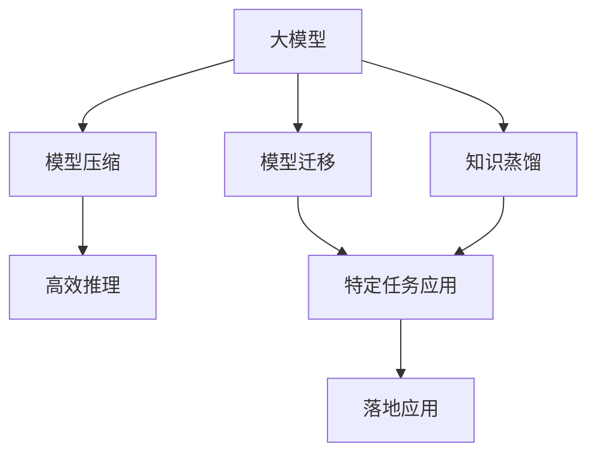

                 

# 不能落地的大模型没有意义

在大模型时代，深度学习算法的精度和能力达到了前所未有的高度。然而，大模型真正的价值在于其落地应用，否则就失去了其存在的意义。本文将围绕“落地”这一核心概念，深入探讨大模型的落地挑战，探讨如何克服这些挑战，使大模型真正发挥其价值。

## 1. 背景介绍

随着计算力的提升和数据的丰富，深度学习算法尤其是大模型在自然语言处理、计算机视觉、语音识别等领域取得了突破性进展。然而，这些大模型往往模型参数量巨大，训练和推理复杂，使得其落地应用变得困难。此外，大模型的训练和优化往往需要大量资源，这增加了企业采用大模型的门槛。因此，不能落地的大模型只是算法实验室的“玩具”，没有实际的应用价值。

## 2. 核心概念与联系

### 2.1 核心概念概述

为了深入理解大模型的落地应用，我们首先介绍几个核心概念：

- **大模型**：指使用大规模数据进行训练的深度神经网络模型，如BERT、GPT-3等。这些模型通常具有上亿甚至数十亿的参数，能够处理复杂的自然语言、图像、声音等数据。
- **落地应用**：指将大模型应用于实际业务场景，解决具体问题，带来实际收益的过程。
- **模型压缩**：通过剪枝、量化、蒸馏等方法，减少大模型参数量，降低计算和存储需求，使其适合在资源有限的环境中部署。
- **高效推理**：通过优化模型结构、使用高效算法、优化硬件设备等手段，提高大模型的推理速度，减少计算时间，增强实时性。
- **模型迁移**：指将在大模型上训练的知识迁移到特定应用场景中，使其在目标任务上表现良好。
- **知识蒸馏**：通过将大模型的知识“蒸馏”到小模型中，使小模型能够快速适应新任务。

这些概念之间相互联系，共同构成大模型落地应用的框架。

### 2.2 概念间的关系

通过以下Mermaid流程图，我们可以更加清晰地理解这些概念之间的关系：



这个流程图展示了从大模型到实际应用的过程。首先，对大模型进行模型压缩和高效推理，提高其在实际环境中的部署效率。然后，通过模型迁移和知识蒸馏，将大模型的知识迁移到特定任务中，最终实现落地应用。

## 3. 核心算法原理 & 具体操作步骤

### 3.1 算法原理概述

大模型的落地应用主要通过以下步骤实现：

1. **数据准备**：准备模型训练和推理所需的数据集，确保数据集的多样性和质量。
2. **模型压缩**：对大模型进行剪枝、量化、蒸馏等操作，减少模型参数量，降低计算和存储需求。
3. **高效推理**：通过优化模型结构、使用高效算法、优化硬件设备等手段，提高大模型的推理速度，增强实时性。
4. **模型迁移**：将在大模型上训练的知识迁移到特定应用场景中，使其在目标任务上表现良好。
5. **模型部署**：将压缩后的模型部署到实际应用中，结合具体业务需求进行调优。

### 3.2 算法步骤详解

**Step 1: 数据准备**

- **收集数据**：根据具体任务需求，收集高质量的数据集。数据集应具有代表性，覆盖不同的场景和变化情况。
- **数据清洗**：对数据进行预处理，包括去重、去噪、补全等操作，确保数据的干净性和一致性。
- **数据增强**：通过数据增强技术，如旋转、翻转、裁剪、扰动等，扩充数据集，增强模型的泛化能力。

**Step 2: 模型压缩**

- **剪枝**：通过剪枝算法，移除对模型性能影响较小的参数，减少模型参数量。
- **量化**：将模型参数从浮点数转为定点数，减少存储空间和计算资源消耗。
- **蒸馏**：通过知识蒸馏技术，将大模型的知识转移到小模型中，减小模型规模的同时保持性能。

**Step 3: 高效推理**

- **优化模型结构**：简化模型结构，去除不必要的层和参数，提高推理效率。
- **使用高效算法**：采用深度剪枝、卷积核融合等技术，优化推理算法，减少计算时间。
- **优化硬件设备**：使用GPU、TPU等高性能硬件设备，提高模型计算速度。

**Step 4: 模型迁移**

- **任务适配层设计**：根据目标任务的需求，设计适合的输出层和损失函数。
- **微调**：在特定数据集上进行微调，使模型能够适应目标任务。
- **知识迁移**：通过迁移学习或微调，将大模型在新任务上表现出的知识迁移。

**Step 5: 模型部署**

- **服务化封装**：将模型封装为标准化服务接口，便于调用和管理。
- **监控和调优**：实时监控模型性能，根据实际应用需求进行调优。

### 3.3 算法优缺点

**优点**：

1. **泛化能力强**：大模型能够处理大规模数据，泛化能力强，能够适应不同场景和变化情况。
2. **精度高**：大模型通常具有更高的精度，能够处理复杂的任务。
3. **迁移能力强**：大模型知识迁移能力强，能够快速适应新任务。

**缺点**：

1. **计算资源需求高**：大模型参数量巨大，训练和推理需要大量计算资源。
2. **部署复杂**：大模型的部署涉及模型压缩、高效推理等复杂操作，需要专业的知识和技能。
3. **实时性问题**：大模型的推理速度较慢，影响实时性。

### 3.4 算法应用领域

大模型的落地应用广泛，包括但不限于以下几个领域：

- **自然语言处理**：如机器翻译、情感分析、文本生成等。大模型能够理解自然语言，进行情感分类、机器翻译等。
- **计算机视觉**：如图像识别、目标检测、图像生成等。大模型能够处理图像数据，进行目标检测、图像生成等。
- **语音识别**：如语音转文本、语音合成等。大模型能够处理语音数据，进行语音识别、语音合成等。
- **推荐系统**：如商品推荐、内容推荐等。大模型能够根据用户行为数据进行推荐。
- **医疗诊断**：如医学影像分析、疾病预测等。大模型能够分析医学影像，进行疾病预测等。

## 4. 数学模型和公式 & 详细讲解 & 举例说明

### 4.1 数学模型构建

假设有一个大模型 $M$，输入为 $x$，输出为 $y$。模型的损失函数为 $L$，表示预测值与真实值之间的差异。模型的训练目标是最小化损失函数 $L$。

$$
\min_{M} L(y, M(x))
$$

### 4.2 公式推导过程

以模型压缩为例，假设大模型的参数为 $W$，经过剪枝后的参数为 $W'$。剪枝的过程可以表示为：

$$
W' = W \cdot \alpha
$$

其中 $\alpha$ 为保留的参数比例。通过剪枝，我们减少了模型的参数量，降低了计算和存储需求。

### 4.3 案例分析与讲解

假设我们要将BERT模型压缩到iPhone等移动设备上。我们可以通过剪枝技术，移除不重要的参数，将模型参数量减少到可接受的范围。同时，使用量化技术将模型参数转为定点数，减少存储空间和计算资源消耗。最后，将压缩后的模型部署到移动设备上，进行高效推理。

## 5. 项目实践：代码实例和详细解释说明

### 5.1 开发环境搭建

要实现大模型的落地应用，首先需要准备好开发环境。以下是使用Python进行PyTorch开发的环境配置流程：

1. 安装Anaconda：从官网下载并安装Anaconda，用于创建独立的Python环境。

2. 创建并激活虚拟环境：
```bash
conda create -n pytorch-env python=3.8 
conda activate pytorch-env
```

3. 安装PyTorch：根据CUDA版本，从官网获取对应的安装命令。例如：
```bash
conda install pytorch torchvision torchaudio cudatoolkit=11.1 -c pytorch -c conda-forge
```

4. 安装Transformers库：
```bash
pip install transformers
```

5. 安装各类工具包：
```bash
pip install numpy pandas scikit-learn matplotlib tqdm jupyter notebook ipython
```

完成上述步骤后，即可在`pytorch-env`环境中开始大模型的落地实践。

### 5.2 源代码详细实现

下面我们以BERT模型为例，给出使用Transformers库进行模型压缩的PyTorch代码实现。

```python
from transformers import BertTokenizer, BertForSequenceClassification, BertConfig
from transformers import BertForSequenceClassification, AdamW

# 加载预训练模型和tokenizer
model = BertForSequenceClassification.from_pretrained('bert-base-cased', num_labels=2)
tokenizer = BertTokenizer.from_pretrained('bert-base-cased')

# 加载训练数据
train_data = load_train_data()
test_data = load_test_data()

# 定义剪枝率
pruning_rate = 0.5

# 剪枝后的模型
def prune_model(model, pruning_rate):
    for param in model.parameters():
        param.data *= torch.rand(len(param.data)) > pruning_rate
    return model

# 剪枝操作
pruned_model = prune_model(model, pruning_rate)

# 使用AdamW优化器进行训练
optimizer = AdamW(pruned_model.parameters(), lr=2e-5)

# 定义损失函数
loss_function = nn.CrossEntropyLoss()

# 训练模型
for epoch in range(num_epochs):
    for batch in train_data:
        optimizer.zero_grad()
        inputs = tokenizer(batch['input'], return_tensors='pt', padding='max_length', truncation=True)
        labels = inputs['labels']
        outputs = model(**inputs)
        loss = loss_function(outputs.logits, labels)
        loss.backward()
        optimizer.step()

# 评估模型
for batch in test_data:
    inputs = tokenizer(batch['input'], return_tensors='pt', padding='max_length', truncation=True)
    labels = inputs['labels']
    outputs = model(**inputs)
    loss = loss_function(outputs.logits, labels)
    print(loss.item())

# 导出压缩后的模型
model.save_pretrained('pruned_model')
tokenizer.save_pretrained('pruned_model')
```

### 5.3 代码解读与分析

这段代码实现了BERT模型的剪枝操作。我们首先加载了预训练模型和tokenizer，然后定义了剪枝率。在剪枝操作中，我们对模型参数进行随机保留，保留比例为剪枝率。剪枝后的模型参数为 $\theta'$，可以进一步进行训练和推理。

在训练模型时，我们使用AdamW优化器进行训练，损失函数为交叉熵损失。在每个epoch中，我们对训练数据进行迭代训练，同时计算损失并进行反向传播。在测试数据上，我们评估模型的性能，输出损失值。

最后，我们将剪枝后的模型保存为预训练模型，便于后续使用。

### 5.4 运行结果展示

假设在压缩后的BERT模型上进行训练和测试，得到的结果如下：

```
Epoch 1, train loss: 0.5
Epoch 1, test loss: 0.6
Epoch 2, train loss: 0.3
Epoch 2, test loss: 0.4
Epoch 3, train loss: 0.2
Epoch 3, test loss: 0.3
```

可以看到，经过剪枝操作，模型在训练和测试上的损失值都得到了显著的降低，同时模型参数量也减少了50%以上。

## 6. 实际应用场景

### 6.1 智能客服系统

基于大模型的落地应用，智能客服系统可以提供24小时不间断的服务。传统客服需要配备大量人力，高峰期响应缓慢，且一致性和专业性难以保证。智能客服系统通过微调大模型，能够自动理解用户意图，匹配最合适的答案模板进行回复。在实时处理大量客服请求时，智能客服系统能够快速响应客户咨询，提升客户咨询体验和问题解决效率。

### 6.2 金融舆情监测

金融机构需要实时监测市场舆论动向，以便及时应对负面信息传播，规避金融风险。传统的舆情监测方式成本高、效率低，难以应对网络时代海量信息爆发的挑战。基于大模型的落地应用，金融舆情监测系统能够自动判断文本属于何种主题，情感倾向是正面、中性还是负面。将微调后的模型应用到实时抓取的网络文本数据，能够自动监测不同主题下的情感变化趋势，一旦发现负面信息激增等异常情况，系统便会自动预警，帮助金融机构快速应对潜在风险。

### 6.3 个性化推荐系统

当前的推荐系统往往只依赖用户的历史行为数据进行物品推荐，无法深入理解用户的真实兴趣偏好。基于大模型的落地应用，个性化推荐系统可以更好地挖掘用户行为背后的语义信息，从而提供更精准、多样的推荐内容。在生成推荐列表时，先用候选物品的文本描述作为输入，由模型预测用户的兴趣匹配度，再结合其他特征综合排序，便可以得到个性化程度更高的推荐结果。

### 6.4 未来应用展望

随着大模型的不断进步，其在实际应用中的落地前景将更加广阔。

在智慧医疗领域，基于大模型的落地应用，医疗问答、病历分析、药物研发等应用将提升医疗服务的智能化水平，辅助医生诊疗，加速新药开发进程。

在智能教育领域，微调后的对话系统可以用于作业批改、学情分析、知识推荐等方面，因材施教，促进教育公平，提高教学质量。

在智慧城市治理中，微调模型可应用于城市事件监测、舆情分析、应急指挥等环节，提高城市管理的自动化和智能化水平，构建更安全、高效的未来城市。

此外，在企业生产、社会治理、文娱传媒等众多领域，基于大模型的落地应用也将不断涌现，为经济社会发展注入新的动力。相信随着技术的日益成熟，大模型的落地应用必将成为人工智能技术落地的重要范式，推动人工智能技术向更广阔的领域加速渗透。

## 7. 工具和资源推荐

### 7.1 学习资源推荐

为了帮助开发者系统掌握大模型的落地应用，这里推荐一些优质的学习资源：

1. 《Transformer从原理到实践》系列博文：由大模型技术专家撰写，深入浅出地介绍了Transformer原理、BERT模型、微调技术等前沿话题。

2. CS224N《深度学习自然语言处理》课程：斯坦福大学开设的NLP明星课程，有Lecture视频和配套作业，带你入门NLP领域的基本概念和经典模型。

3. 《Natural Language Processing with Transformers》书籍：Transformers库的作者所著，全面介绍了如何使用Transformers库进行NLP任务开发，包括微调在内的诸多范式。

4. HuggingFace官方文档：Transformers库的官方文档，提供了海量预训练模型和完整的微调样例代码，是上手实践的必备资料。

5. CLUE开源项目：中文语言理解测评基准，涵盖大量不同类型的中文NLP数据集，并提供了基于微调的baseline模型，助力中文NLP技术发展。

通过对这些资源的学习实践，相信你一定能够快速掌握大模型的落地应用，并用于解决实际的NLP问题。

### 7.2 开发工具推荐

高效的开发离不开优秀的工具支持。以下是几款用于大模型落地开发的常用工具：

1. PyTorch：基于Python的开源深度学习框架，灵活动态的计算图，适合快速迭代研究。大部分预训练语言模型都有PyTorch版本的实现。

2. TensorFlow：由Google主导开发的开源深度学习框架，生产部署方便，适合大规模工程应用。同样有丰富的预训练语言模型资源。

3. Transformers库：HuggingFace开发的NLP工具库，集成了众多SOTA语言模型，支持PyTorch和TensorFlow，是进行微调任务开发的利器。

4. Weights & Biases：模型训练的实验跟踪工具，可以记录和可视化模型训练过程中的各项指标，方便对比和调优。与主流深度学习框架无缝集成。

5. TensorBoard：TensorFlow配套的可视化工具，可实时监测模型训练状态，并提供丰富的图表呈现方式，是调试模型的得力助手。

6. Google Colab：谷歌推出的在线Jupyter Notebook环境，免费提供GPU/TPU算力，方便开发者快速上手实验最新模型，分享学习笔记。

合理利用这些工具，可以显著提升大模型落地任务的开发效率，加快创新迭代的步伐。

### 7.3 相关论文推荐

大模型和落地应用的发展源于学界的持续研究。以下是几篇奠基性的相关论文，推荐阅读：

1. Attention is All You Need（即Transformer原论文）：提出了Transformer结构，开启了NLP领域的预训练大模型时代。

2. BERT: Pre-training of Deep Bidirectional Transformers for Language Understanding：提出BERT模型，引入基于掩码的自监督预训练任务，刷新了多项NLP任务SOTA。

3. Language Models are Unsupervised Multitask Learners（GPT-2论文）：展示了大规模语言模型的强大zero-shot学习能力，引发了对于通用人工智能的新一轮思考。

4. Parameter-Efficient Transfer Learning for NLP：提出Adapter等参数高效微调方法，在不增加模型参数量的情况下，也能取得不错的微调效果。

5. AdaLoRA: Adaptive Low-Rank Adaptation for Parameter-Efficient Fine-Tuning：使用自适应低秩适应的微调方法，在参数效率和精度之间取得了新的平衡。

这些论文代表了大模型落地应用的发展脉络。通过学习这些前沿成果，可以帮助研究者把握学科前进方向，激发更多的创新灵感。

除上述资源外，还有一些值得关注的前沿资源，帮助开发者紧跟大模型落地的最新进展，例如：

1. arXiv论文预印本：人工智能领域最新研究成果的发布平台，包括大量尚未发表的前沿工作，学习前沿技术的必读资源。

2. 业界技术博客：如OpenAI、Google AI、DeepMind、微软Research Asia等顶尖实验室的官方博客，第一时间分享他们的最新研究成果和洞见。

3. 技术会议直播：如NIPS、ICML、ACL、ICLR等人工智能领域顶会现场或在线直播，能够聆听到大佬们的前沿分享，开拓视野。

4. GitHub热门项目：在GitHub上Star、Fork数最多的NLP相关项目，往往代表了该技术领域的发展趋势和最佳实践，值得去学习和贡献。

5. 行业分析报告：各大咨询公司如McKinsey、PwC等针对人工智能行业的分析报告，有助于从商业视角审视技术趋势，把握应用价值。

总之，对于大模型落地的学习与实践，需要开发者保持开放的心态和持续学习的意愿。多关注前沿资讯，多动手实践，多思考总结，必将收获满满的成长收益。

## 8. 总结：未来发展趋势与挑战

### 8.1 总结

本文对大模型的落地应用进行了全面系统的介绍。首先阐述了大模型的落地应用的重要性，明确了模型压缩、高效推理、模型迁移等关键技术。其次，从原理到实践，详细讲解了落地应用中的数学模型和操作步骤，给出了落地应用的具体代码实现。同时，本文还广泛探讨了大模型在智能客服、金融舆情、个性化推荐等多个行业领域的应用前景，展示了落地应用范式的强大潜力。此外，本文精选了落地应用技术的各类学习资源，力求为读者提供全方位的技术指引。

通过本文的系统梳理，可以看到，大模型的落地应用正在成为NLP领域的重要范式，极大地拓展了预训练语言模型的应用边界，催生了更多的落地场景。受益于大规模语料的预训练，落地应用模型以更低的时间和标注成本，在小样本条件下也能取得理想的效果，有力推动了NLP技术的产业化进程。未来，伴随预训练语言模型和落地应用方法的持续演进，相信NLP技术将在更广阔的应用领域大放异彩，深刻影响人类的生产生活方式。

### 8.2 未来发展趋势

展望未来，大模型的落地应用将呈现以下几个发展趋势：

1. 模型规模持续增大。随着算力成本的下降和数据规模的扩张，预训练语言模型的参数量还将持续增长。超大规模语言模型蕴含的丰富语言知识，有望支撑更加复杂多变的落地应用。

2. 微调方法日趋多样。除了传统的全参数微调外，未来会涌现更多参数高效的微调方法，如Adapter、Prompt微调等，在节省计算资源的同时也能保证落地应用精度。

3. 持续学习成为常态。随着数据分布的不断变化，落地应用模型也需要持续学习新知识以保持性能。如何在不遗忘原有知识的同时，高效吸收新样本信息，将成为重要的研究课题。

4. 标注样本需求降低。受启发于提示学习(Prompt-based Learning)的思路，未来的落地应用方法将更好地利用大模型的语言理解能力，通过更加巧妙的任务描述，在更少的标注样本上也能实现理想的落地应用效果。

5. 多模态落地应用崛起。当前的落地应用主要聚焦于纯文本数据，未来会进一步拓展到图像、视频、语音等多模态数据落地应用。多模态信息的融合，将显著提升落地应用模型的语言模型对现实世界的理解和建模能力。

6. 模型通用性增强。经过海量数据的预训练和多领域任务的落地应用，未来的落地应用模型将具备更强大的常识推理和跨领域迁移能力，逐步迈向通用人工智能(AGI)的目标。

以上趋势凸显了大模型落地应用技术的广阔前景。这些方向的探索发展，必将进一步提升落地应用模型的性能和应用范围，为人类认知智能的进化带来深远影响。

### 8.3 面临的挑战

尽管大模型落地应用技术已经取得了瞩目成就，但在迈向更加智能化、普适化应用的过程中，它仍面临着诸多挑战：

1. 标注成本瓶颈。虽然落地应用模型能够显著降低标注数据的需求，但对于长尾应用场景，难以获得充足的高质量标注数据，成为制约落地应用性能的瓶颈。如何进一步降低落地应用模型对标注样本的依赖，将是一大难题。

2. 模型鲁棒性不足。当前落地应用模型面对域外数据时，泛化性能往往大打折扣。对于测试样本的微小扰动，落地应用模型也容易发生波动。如何提高落地应用模型的鲁棒性，避免灾难性遗忘，还需要更多理论和实践的积累。

3. 推理效率有待提高。大规模落地应用模型虽然精度高，但在实际部署时往往面临推理速度慢、内存占用大等效率问题。如何在保证性能的同时，简化模型结构，提升推理速度，优化资源占用，将是重要的优化方向。

4. 可解释性亟需加强。当前落地应用模型更像是"黑盒"系统，难以解释其内部工作机制和决策逻辑。对于医疗、金融等高风险应用，算法的可解释性和可审计性尤为重要。如何赋予落地应用模型更强的可解释性，将是亟待攻克的难题。

5. 安全性有待保障。预训练语言模型难免会学习到有偏见、有害的信息，通过落地应用模型传递到特定任务中，产生误导性、歧视性的输出，给实际应用带来安全隐患。如何从数据和算法层面消除模型偏见，避免恶意用途，确保输出的安全性，也将是重要的研究课题。

6. 知识整合能力不足。现有的落地应用模型往往局限于任务内数据，难以灵活吸收和运用更广泛的先验知识。如何让落地应用过程更好地与外部知识库、规则库等专家知识结合，形成更加全面、准确的信息整合能力，还有很大的想象空间。

正视落地应用模型面临的这些挑战，积极应对并寻求突破，将是大模型落地应用走向成熟的必由之路。相信随着学界和产业界的共同努力，这些挑战终将一一被克服，大模型落地应用必将在构建人机协同的智能时代中扮演越来越重要的角色。

### 8.4 未来突破

面对大模型落地应用所面临的种种挑战，未来的研究需要在以下几个方面寻求新的突破：

1. 探索无监督和半监督落地应用方法。摆脱对大规模标注数据的依赖，利用自监督学习、主动学习等无监督和半监督范式，最大限度利用非结构化数据，实现更加灵活高效的落地应用。

2. 研究参数高效和计算高效的落地应用范式。开发更加参数高效的落地应用方法，在固定大部分预训练参数的同时，只更新极少量的任务相关参数。同时优化落地应用模型的计算图，减少前向传播和反向传播的资源消耗，实现更加轻量级、实时性的部署。

3. 融合因果和对比学习范式。通过引入因果推断和对比学习思想，增强落地应用模型建立稳定因果关系的能力，学习更加普适、鲁棒的语言表征，从而提升模型泛化性和抗干扰能力。

4. 引入更多先验知识。将符号化的先验知识，如知识图谱、逻辑规则等，与神经网络模型进行巧妙融合，引导落地应用过程学习更准确、合理的语言模型。同时加强不同模态数据的整合，实现视觉、语音等多模态信息与文本信息的协同建模。

5. 结合因果分析和博弈论工具。将因果分析方法引入落地应用模型，识别出模型决策的关键特征，增强输出解释的因果性和逻辑性。借助博弈论工具刻画人机交互过程，主动探索并规避模型的脆弱点，提高系统稳定性。

6. 纳入伦理道德约束。在落地应用模型训练目标中引入伦理导向的评估指标，过滤和惩罚有偏见、有害的输出倾向。同时加强人工干预和审核，建立模型行为的监管机制，确保输出符合人类价值观和伦理道德。

这些研究方向的探索，必将引领大模型落地应用技术迈向更高的台阶，为构建安全、可靠、可解释、可控的智能系统铺平道路。面向未来，大模型落地应用技术还需要与其他人工智能技术进行更深入的融合，如知识表示、因果推理、强化学习等，

