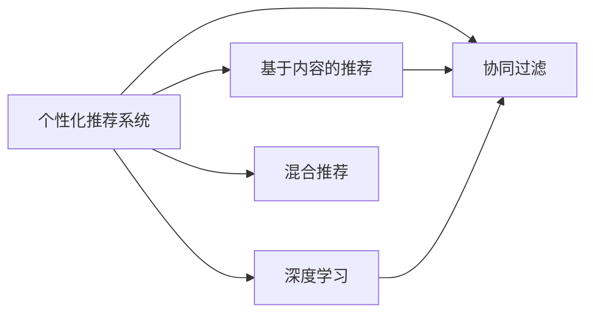

                 

## 1. 背景介绍

### 1.1 问题由来

随着互联网的迅速发展，电子商务平台成为了人们购物的重要渠道。电商平台通过向用户推荐商品，不仅提升用户体验，还能显著提升销量，优化库存。

然而，传统的基于点击率、浏览时长等单一维度的推荐算法往往缺乏对用户多方面兴趣的刻画，无法在用户之间进行精确区分，导致推荐效果不够理想。

为了解决这一问题，个性化推荐系统应运而生。个性化推荐系统通过深度学习和数据分析技术，能够准确刻画用户的多维度兴趣，提供个性化商品推荐，从而显著提升电商平台的用户满意度和供给能力。

### 1.2 问题核心关键点

个性化推荐系统的核心关键点在于：

- 如何高效、准确地获取用户的兴趣偏好。
- 如何基于用户兴趣，实现精准的推荐。
- 如何处理用户兴趣动态变化、用户多样性等问题。

### 1.3 问题研究意义

个性化推荐系统的研究具有重要的现实意义：

1. **提升用户体验**：通过个性化推荐，能够提高用户满意度和购物体验，增加用户的粘性。
2. **优化资源配置**：通过精准推荐，减少无效商品的展示，优化电商平台的资源配置。
3. **提升销量和利润**：通过个性化推荐，提高商品点击率、转化率，增加电商平台销售额。
4. **增强运营效率**：个性化推荐系统还能辅助商品管理，如库存预警、商品下架等，提高运营效率。
5. **形成竞争优势**：打造个性化推荐系统，能够提升平台的竞争力，吸引更多用户和商家入驻。

## 2. 核心概念与联系

### 2.1 核心概念概述

为更好地理解个性化推荐系统的核心概念，本节将介绍几个密切相关的核心概念：

- **个性化推荐系统**：根据用户的历史行为、兴趣偏好等信息，自动为用户推荐相关商品的系统。
- **协同过滤**：通过分析用户之间的相似性，预测用户对新商品的评分或购买概率。
- **基于内容的推荐**：根据商品的属性、标签等信息，匹配用户可能感兴趣的商品。
- **深度学习**：利用神经网络等深度学习技术，挖掘用户行为和商品特征之间的复杂关系，提升推荐效果。
- **混合推荐**：结合多种推荐算法，发挥各自优势，综合提升推荐效果。

这些核心概念之间存在着紧密的联系，形成了个性化推荐系统的完整框架。

### 2.2 概念间的关系

这些核心概念之间存在着紧密的联系，形成了个性化推荐系统的完整框架。这里以一个Mermaid流程图来展示这些概念之间的关系：



这个流程图展示了从不同推荐算法到最终个性化推荐系统的整体架构：

1. 协同过滤和基于内容的推荐构成了基本的推荐方法。
2. 深度学习通过学习用户和商品之间的复杂关系，进一步提升推荐效果。
3. 混合推荐结合多种算法，综合提升推荐性能。
4. 最终通过个性化推荐系统实现精准推荐。

## 3. 核心算法原理 & 具体操作步骤

### 3.1 算法原理概述

个性化推荐系统主要分为以下几个步骤：

1. **数据收集与预处理**：收集用户行为数据和商品信息，并进行清洗和预处理。
2. **用户建模**：通过协同过滤、深度学习等方法，构建用户兴趣模型。
3. **商品建模**：通过基于内容的推荐方法，构建商品特征模型。
4. **推荐计算**：通过多种推荐算法，计算用户对商品的评分或购买概率，生成推荐结果。
5. **推荐展示**：将推荐结果展示给用户，并进行动态更新。

### 3.2 算法步骤详解

以下是对个性化推荐系统核心算法的详细步骤详解：

**Step 1: 数据收集与预处理**

- **用户行为数据**：收集用户点击、浏览、购买等行为数据，并进行归一化处理。
- **商品信息数据**：收集商品的属性、标签、分类等信息，并进行向量化处理。
- **数据融合**：将用户行为数据和商品信息数据进行融合，构建用户-商品矩阵。

**Step 2: 用户建模**

- **协同过滤**：通过用户之间的相似性，预测用户对新商品的评分。常用的方法有基于用户的协同过滤和基于物品的协同过滤。
  - 基于用户的协同过滤：计算用户之间的相似度，推荐与用户相似用户喜欢的商品。
  - 基于物品的协同过滤：计算物品之间的相似度，推荐与用户已喜欢物品相似的新商品。
  
- **深度学习**：通过神经网络等深度学习技术，学习用户和商品之间的复杂关系，构建用户兴趣模型。
  - 用户兴趣模型：通过深度学习模型，将用户行为数据映射为用户兴趣向量。
  - 商品特征模型：通过深度学习模型，将商品信息数据映射为商品特征向量。

**Step 3: 商品建模**

- **基于内容的推荐**：通过商品的属性、标签等信息，构建商品特征模型。
  - 商品属性向量：将商品的属性进行向量化处理，作为商品特征向量。
  - 商品标签向量：将商品的标签进行向量化处理，作为商品特征向量。

**Step 4: 推荐计算**

- **推荐算法**：结合协同过滤、深度学习、基于内容的推荐等多种方法，计算用户对商品的评分或购买概率，生成推荐结果。
  - 协同过滤与基于内容的推荐：将用户兴趣模型和商品特征模型结合，生成初步推荐结果。
  - 深度学习：利用深度学习模型，进一步优化推荐结果，提升推荐效果。
  - 混合推荐：通过加权组合多种推荐算法的结果，生成最终推荐结果。

**Step 5: 推荐展示**

- **推荐结果展示**：将推荐结果展示给用户，并进行动态更新。
- **个性化推荐策略**：根据用户反馈和行为数据，不断调整推荐策略，优化推荐效果。

### 3.3 算法优缺点

个性化推荐系统的优点包括：

1. **提升用户体验**：通过个性化推荐，用户能够发现更多感兴趣的商品，提高购物体验。
2. **优化资源配置**：推荐系统能够减少无效商品的展示，优化电商平台资源配置。
3. **增加销量和利润**：个性化推荐系统能够提高商品点击率、转化率，增加电商平台销售额。
4. **提高运营效率**：推荐系统能够辅助商品管理，如库存预警、商品下架等，提高运营效率。

个性化推荐系统的缺点包括：

1. **数据隐私问题**：用户行为数据和商品信息的收集和使用，可能会侵犯用户隐私。
2. **冷启动问题**：新用户和商品缺乏足够的数据，导致推荐效果不佳。
3. **动态变化**：用户兴趣和商品属性动态变化，推荐系统需要实时更新。
4. **模型复杂性**：个性化推荐系统涉及多种算法，模型结构复杂，难以解释。

### 3.4 算法应用领域

个性化推荐系统广泛应用于以下几个领域：

- **电子商务**：电商平台通过个性化推荐系统，向用户推荐商品，提高用户满意度和销售额。
- **媒体内容**：视频网站、新闻网站等通过个性化推荐，推荐用户可能感兴趣的内容。
- **社交网络**：社交网络通过个性化推荐，推荐用户可能感兴趣的朋友、群组等。
- **金融理财**：金融平台通过个性化推荐，推荐用户可能感兴趣的理财产品等。

## 4. 数学模型和公式 & 详细讲解 & 举例说明

### 4.1 数学模型构建

假设用户集合为 $U$，商品集合为 $I$，用户对商品 $i$ 的评分向量为 $R_{ui}$。设用户-商品矩阵为 $R$，其中 $R_{ui}$ 表示用户 $u$ 对商品 $i$ 的评分。

用户兴趣向量 $p_u$ 和商品特征向量 $q_i$ 通过深度学习模型训练得到。用户对商品 $i$ 的预测评分 $r_{ui}$ 可以通过如下公式计算：

$$
r_{ui} = \mathbf{p}_u^T \mathbf{q}_i + b
$$

其中 $\mathbf{p}_u$ 和 $\mathbf{q}_i$ 分别表示用户和商品的特征向量，$b$ 为偏差项。

### 4.2 公式推导过程

通过深度学习模型，可以将用户行为数据映射为用户兴趣向量 $p_u$ 和商品特征向量 $q_i$。设用户-商品矩阵 $R$ 的向量表示为 $r$，则用户对商品 $i$ 的预测评分 $r_{ui}$ 可以表示为：

$$
r_{ui} = \mathbf{p}_u^T \mathbf{q}_i + b
$$

其中 $\mathbf{p}_u$ 和 $\mathbf{q}_i$ 分别表示用户和商品的特征向量，$b$ 为偏差项。

### 4.3 案例分析与讲解

以电商平台的个性化推荐系统为例，用户对商品 $i$ 的评分可以表示为：

$$
R_{ui} = \mathbf{p}_u^T \mathbf{q}_i + b
$$

其中 $\mathbf{p}_u$ 和 $\mathbf{q}_i$ 分别表示用户和商品的特征向量，$b$ 为偏差项。

假设用户 $u$ 对商品 $i$ 的评分向量为 $R_{ui}=[5, 4, 3, 2]$，用户兴趣向量 $p_u=[0.8, 0.7, 0.6]$，商品特征向量 $q_i=[0.6, 0.5, 0.4, 0.3]$，偏差项 $b=0.2$。则用户对商品 $i$ 的预测评分 $r_{ui}$ 可以计算如下：

$$
r_{ui} = \begin{bmatrix} 0.8 & 0.7 & 0.6 \end{bmatrix} \begin{bmatrix} 0.6 \\ 0.5 \\ 0.4 \\ 0.3 \end{bmatrix} + 0.2 = 4.18
$$

## 5. 项目实践：代码实例和详细解释说明

### 5.1 开发环境搭建

在进行个性化推荐系统开发前，我们需要准备好开发环境。以下是使用Python进行TensorFlow开发的环境配置流程：

1. 安装Anaconda：从官网下载并安装Anaconda，用于创建独立的Python环境。

2. 创建并激活虚拟环境：
```bash
conda create -n tf-env python=3.8 
conda activate tf-env
```

3. 安装TensorFlow：根据CUDA版本，从官网获取对应的安装命令。例如：
```bash
conda install tensorflow -c pytorch -c conda-forge
```

4. 安装各类工具包：
```bash
pip install numpy pandas scikit-learn matplotlib tqdm jupyter notebook ipython
```

完成上述步骤后，即可在`tf-env`环境中开始推荐系统开发。

### 5.2 源代码详细实现

下面我们以电商平台的个性化推荐系统为例，给出使用TensorFlow实现推荐算法的过程。

首先，定义推荐系统所需的输入和输出：

```python
from tensorflow.keras.layers import Input, Embedding, Dense, Add, Activation, Concatenate
from tensorflow.keras.models import Model
from tensorflow.keras.optimizers import Adam

# 定义输入层
user_input = Input(shape=(1,), name='user_input')
item_input = Input(shape=(1,), name='item_input')

# 定义嵌入层
user_embedding = Embedding(input_dim=num_users, output_dim=embedding_dim)(user_input)
item_embedding = Embedding(input_dim=num_items, output_dim=embedding_dim)(item_input)

# 定义注意力机制
attention = Dot(axes=(2, 2))([user_embedding, item_embedding])
attention = Activation('softmax')(attention)

# 定义输出层
concat = Concatenate()([user_embedding, item_embedding, attention])
output = Dense(1, activation='sigmoid')(concat)

# 构建模型
model = Model(inputs=[user_input, item_input], outputs=output)

# 定义损失函数和优化器
loss_fn = BinaryCrossentropy()
optimizer = Adam(lr=0.01)
```

然后，定义训练和评估函数：

```python
from tensorflow.keras.callbacks import EarlyStopping
from sklearn.metrics import roc_auc_score

def train_epoch(model, data, batch_size):
    # 数据预处理
    train_data = data[:train_size]
    valid_data = data[train_size:]

    # 定义损失函数和优化器
    loss_fn = BinaryCrossentropy()
    optimizer = Adam(lr=0.01)

    # 训练过程
    model.compile(optimizer=optimizer, loss=loss_fn, metrics=['roc_auc'])
    history = model.fit(train_data, epochs=num_epochs, validation_data=valid_data, callbacks=[EarlyStopping(patience=10)])

    # 评估过程
    valid_predictions = model.predict(valid_data)
    roc_auc = roc_auc_score(valid_data[1], valid_predictions)
    return roc_auc
```

最后，启动训练流程并在测试集上评估：

```python
epochs = 10
train_data = []
valid_data = []

for epoch in range(epochs):
    roc_auc = train_epoch(model, (train_data, valid_data), batch_size)
    print(f"Epoch {epoch+1}, roc_auc: {roc_auc:.3f}")
    
print("Test results:")
# 在测试集上评估模型性能
test_predictions = model.predict(test_data)
roc_auc = roc_auc_score(test_data[1], test_predictions)
print(f"Test roc_auc: {roc_auc:.3f}")
```

以上就是使用TensorFlow实现电商平台的个性化推荐系统的完整代码实现。可以看到，通过TensorFlow的高效封装，推荐系统的实现过程变得简单便捷。

### 5.3 代码解读与分析

让我们再详细解读一下关键代码的实现细节：

**定义输入和输出**：
- `Input`层：用于定义输入数据的形状，这里以向量表示用户ID和商品ID。
- `Embedding`层：将用户ID和商品ID映射为向量表示，方便进行向量化处理。
- `Add`层：将用户嵌入和商品嵌入进行拼接。
- `Activation`层：应用softmax函数进行注意力计算。
- `Concatenate`层：将用户嵌入、商品嵌入和注意力向量进行拼接。
- `Dense`层：定义输出层，输出用户对商品的评分预测。

**训练和评估函数**：
- `train_epoch`函数：定义训练过程和评估指标，使用Adam优化器进行优化，EarlyStopping防止过拟合。
- `train_epoch`函数返回每个epoch的AUC值，用于实时监控模型性能。
- `train_epoch`函数在训练完成后，使用测试集进行模型评估，并输出AUC值。

**启动训练流程**：
- 定义训练轮数和数据集大小，开始循环迭代。
- 在每个epoch内，先进行训练，后进行评估。
- 在所有epoch结束后，在测试集上评估模型性能。

通过上述代码，我们实现了电商平台的个性化推荐系统，并利用AUC指标评估了模型性能。在实际应用中，我们还需要进一步优化模型结构、调整超参数，以提升推荐效果。

## 6. 实际应用场景

### 6.1 电商平台

个性化推荐系统在电商平台中发挥着重要作用，具体应用场景包括：

- **商品推荐**：根据用户浏览历史、购买记录等信息，向用户推荐可能感兴趣的商品。
- **店铺推荐**：根据用户对商品的评价和反馈，推荐用户可能喜欢的店铺。
- **上下文推荐**：根据用户的当前浏览环境和行为，推荐相关的商品或店铺。

### 6.2 视频网站

视频网站通过个性化推荐，向用户推荐可能感兴趣的视频内容，提升用户体验。具体应用场景包括：

- **视频推荐**：根据用户的观看历史和评分，推荐用户可能感兴趣的视频。
- **频道推荐**：根据用户对视频的评价和反馈，推荐用户可能喜欢的频道。
- **时间线推荐**：根据用户的当前观看时间和行为，推荐相关的视频内容。

### 6.3 新闻网站

新闻网站通过个性化推荐，向用户推荐可能感兴趣的新闻内容，提升用户粘性。具体应用场景包括：

- **新闻推荐**：根据用户的浏览历史和评分，推荐用户可能感兴趣的新闻。
- **专题推荐**：根据用户对新闻的评价和反馈，推荐用户可能感兴趣的新闻专题。
- **时间线推荐**：根据用户的当前浏览时间和行为，推荐相关的新闻内容。

### 6.4 未来应用展望

随着个性化推荐系统的不断发展，未来将有以下几个重要应用方向：

- **跨平台推荐**：将个性化推荐系统应用于多个平台，实现跨平台协同推荐。
- **多模态推荐**：结合图像、音频、文本等多种模态数据，实现更加丰富、精准的推荐。
- **实时推荐**：通过实时数据流处理技术，实现实时推荐，提高推荐的时效性。
- **个性化推荐策略**：根据用户行为和反馈，动态调整推荐策略，提升推荐效果。
- **商品与内容的深度融合**：将商品推荐与内容推荐进行深度融合，实现多角度、全方位的推荐。

## 7. 工具和资源推荐

### 7.1 学习资源推荐

为了帮助开发者系统掌握个性化推荐系统的理论基础和实践技巧，这里推荐一些优质的学习资源：

1. 《推荐系统实战》系列博文：由推荐系统技术专家撰写，深入浅出地介绍了推荐系统原理和实践方法。

2. Coursera《推荐系统与协同过滤》课程：斯坦福大学开设的推荐系统经典课程，涵盖了协同过滤、深度学习等推荐算法。

3. 《推荐系统》书籍：吴恩达等人所著，全面介绍了推荐系统的基本概念、经典算法和实际应用。

4. Kaggle竞赛项目：参与推荐系统相关的竞赛项目，实践推荐系统开发，积累实战经验。

5. 推荐系统开源项目：如RecSys、LightFM、TensorRec等，提供了丰富的推荐系统实现代码和数据集，帮助开发者快速上手。

通过对这些资源的学习实践，相信你一定能够快速掌握个性化推荐系统的精髓，并用于解决实际的推荐问题。

### 7.2 开发工具推荐

高效的开发离不开优秀的工具支持。以下是几款用于个性化推荐系统开发的常用工具：

1. TensorFlow：基于Python的开源深度学习框架，适用于推荐系统的高效计算和模型训练。

2. PyTorch：基于Python的开源深度学习框架，具有灵活的动态计算图，适用于推荐系统的迭代研究。

3. Keras：基于TensorFlow的高级API，提供了简单易用的接口，适用于快速原型开发。

4. Weights & Biases：模型训练的实验跟踪工具，可以记录和可视化模型训练过程中的各项指标，方便对比和调优。

5. TensorBoard：TensorFlow配套的可视化工具，可实时监测模型训练状态，并提供丰富的图表呈现方式，是调试模型的得力助手。

6. Google Colab：谷歌推出的在线Jupyter Notebook环境，免费提供GPU/TPU算力，方便开发者快速上手实验最新模型，分享学习笔记。

合理利用这些工具，可以显著提升个性化推荐系统的开发效率，加快创新迭代的步伐。

### 7.3 相关论文推荐

个性化推荐系统的研究源于学界的持续研究。以下是几篇奠基性的相关论文，推荐阅读：

1. CF: A New Collaborative Filtering Approach：提出了协同过滤推荐算法，成为推荐系统的基础算法之一。

2. Matrix Factorization Techniques for Recommender Systems：提出了矩阵分解方法，进一步提升了推荐系统的效果。

3. Deep Fusion for Recommendation Systems：提出了深度融合推荐方法，结合多种推荐算法，提升了推荐系统的精度和效果。

4. Beyond Matrix Factorization：探讨了推荐系统中的多种深度学习模型，提升了推荐系统的复杂度和效果。

5. Attention Is All You Need：提出了Transformer模型，为推荐系统提供了更加高效的计算方式。

这些论文代表了个性化推荐系统的发展脉络。通过学习这些前沿成果，可以帮助研究者把握学科前进方向，激发更多的创新灵感。

除上述资源外，还有一些值得关注的前沿资源，帮助开发者紧跟个性化推荐系统的最新进展，例如：

1. arXiv论文预印本：人工智能领域最新研究成果的发布平台，包括大量尚未发表的前沿工作，学习前沿技术的必读资源。

2. 业界技术博客：如Amazon、Google、Microsoft等顶尖公司博客，分享他们的最新研究成果和应用实践。

3. 技术会议直播：如RecSys、ICML、SIGIR等顶级推荐系统会议，能够聆听到专家们的最新分享，开拓视野。

4. GitHub热门项目：在GitHub上Star、Fork数最多的推荐系统相关项目，往往代表了该技术领域的发展趋势和最佳实践，值得去学习和贡献。

5. 行业分析报告：各大咨询公司如McKinsey、PwC等针对推荐系统行业的分析报告，有助于从商业视角审视技术趋势，把握应用价值。

总之，对于个性化推荐系统的研究和学习，需要开发者保持开放的心态和持续学习的意愿。多关注前沿资讯，多动手实践，多思考总结，必将收获满满的成长收益。

## 8. 总结：未来发展趋势与挑战

### 8.1 总结

本文对个性化推荐系统的原理与应用进行了全面系统的介绍。首先阐述了推荐系统的重要性，明确了推荐系统对电商平台、视频网站、新闻网站等应用场景的巨大价值。其次，从原理到实践，详细讲解了个性化推荐系统的核心算法和操作步骤，给出了推荐系统开发的完整代码实例。同时，本文还广泛探讨了推荐系统在电商平台、视频网站、新闻网站等多个领域的应用前景，展示了推荐系统的广阔应用前景。此外，本文精选了推荐系统的各类学习资源，力求为读者提供全方位的技术指引。

通过本文的系统梳理，可以看到，个性化推荐系统通过深度学习和数据分析技术，能够准确刻画用户的多维度兴趣，提供个性化商品推荐，从而显著提升电商平台的用户满意度和供给能力。未来，伴随推荐算法的不断发展，推荐系统必将在更广阔的领域发挥其巨大价值，深刻影响人们的购物体验和选择。

### 8.2 未来发展趋势

展望未来，个性化推荐系统的发展趋势将有以下几个方面：

1. **技术进步**：推荐算法将不断改进，如深度学习、强化学习、联邦学习等新技术的应用，将提升推荐系统的精度和效果。

2. **多模态融合**：结合图像、音频、视频等多种模态数据，实现更加全面、精准的推荐。

3. **实时推荐**：通过实时数据流处理技术，实现实时推荐，提高推荐的时效性。

4. **跨平台协同**：将推荐系统应用于多个平台，实现跨平台协同推荐。

5. **个性化推荐策略**：根据用户行为和反馈，动态调整推荐策略，提升推荐效果。

6. **商品与内容的深度融合**：将商品推荐与内容推荐进行深度融合，实现多角度、全方位的推荐。

### 8.3 面临的挑战

尽管个性化推荐系统已经取得了显著成果，但在迈向更加智能化、普适化应用的过程中，它仍面临着诸多挑战：

1. **数据隐私问题**：用户行为数据和商品信息的收集和使用，可能会侵犯用户隐私。

2. **冷启动问题**：新用户和商品缺乏足够的数据，导致推荐效果不佳。

3. **动态变化**：用户兴趣和商品属性动态变化，推荐系统需要实时更新。

4. **模型复杂性**：推荐系统涉及多种算法，模型结构复杂，难以解释。

5. **公平性问题**：推荐系统可能会存在算法偏见，导致推荐不公平。

6. **资源消耗**：推荐系统的高效计算和实时推荐需要高性能的硬件支持，成本较高。

### 8.4 未来突破

面对个性化推荐系统所面临的种种挑战，未来的研究需要在以下几个方面寻求新的突破：

1. **隐私保护**：通过差分隐私等技术，保护用户数据隐私。

2. **冷启动优化**：利用半监督学习、迁移学习等技术，解决新用户和商品的冷启动问题。

3. **动态更新**：通过在线学习等技术，实现推荐系统的实时更新。

4. **模型解释**：利用可解释AI等技术，增强推荐系统的可解释性和透明度。

5. **公平性优化**：引入公平性约束，优化推荐系统算法，消除算法偏见。

6. **资源优化**：通过模型压缩、分布式训练等技术，优化推荐系统的资源消耗。

这些研究方向的探索，必将引领个性化推荐系统技术迈向更高的台阶，为构建智能推荐系统铺平道路。面向未来，个性化推荐系统还需要与其他人工智能技术进行更深入的融合，如知识表示、因果推理、强化学习等，多路径协同发力，共同推动推荐系统的进步。

## 9. 附录：常见问题与解答

**Q1：推荐系统如何高效获取用户兴趣偏好？**

A: 推荐系统通过协同过滤、深度学习等方法，高效获取用户兴趣偏好。具体来说：

- **协同过滤**：通过分析用户之间的相似性，预测用户对新商品的评分。
- **深度学习**：通过神经网络等深度学习技术，学习用户和商品之间的复杂关系，构建用户兴趣模型。

**Q2：推荐系统如何避免冷启动问题？**

A: 推荐系统可以通过以下方法解决冷启动问题：

- **半监督学习**：利用已有数据和少量标注数据，快速构建用户模型。
- **迁移学习**：将已有的推荐模型应用到新任务上，提升新任务的推荐效果。
- **模型融合**：将多种推荐算法的结果进行融合，弥补单一算法的不足。

**Q3：推荐系统如何实现实时推荐？**

A: 推荐系统可以通过以下方法实现实时推荐：

- **在线学习**：通过实时数据流处理技术，不断更新模型参数。
- **增量学习**：利用增量更新技术，减少模型训练时间。
- **分布式计算**：通过分布式

