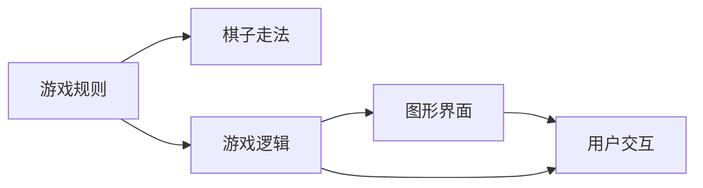

                 

# 中国象棋游戏的设计与实现

## 1. 背景介绍

### 1.1 问题由来
中国象棋，又称中国跳棋，是中国古代流传至今的一种两人对弈的策略棋类游戏。游戏规则简单，但策略性强，既考验玩家的思考能力，又充满智力和技巧的对抗。本文将介绍中国象棋游戏的游戏设计思路，以及如何通过编程实现一个完整的中国象棋游戏。

### 1.2 问题核心关键点
中国象棋游戏设计的核心关键点主要包括：
1. 游戏规则设计
2. 棋子走法定义
3. 游戏逻辑实现
4. 图形界面设计
5. 游戏逻辑和界面的结合
6. 用户交互设计

### 1.3 问题研究意义
中国象棋游戏的实现不仅能帮助玩家提升策略思维和逻辑推理能力，还能为棋类游戏的设计和实现提供参考，促进棋类游戏领域的发展。

## 2. 核心概念与联系

### 2.1 核心概念概述
- **中国象棋游戏**：指两个玩家通过移动棋子在棋盘上进行对抗的棋类游戏。
- **游戏规则**：包括棋盘布局、棋子走法、胜负条件等。
- **游戏逻辑**：指游戏规则的具体实现，包括棋子的移动、吃子、换位等。
- **图形界面**：指棋盘及其周围的界面元素，如棋子、棋盘线、得分等。
- **用户交互**：指玩家和计算机之间的交互，包括棋子移动、吃子、换位等操作。

### 2.2 核心概念间的联系
中国象棋游戏的设计与实现需要结合游戏规则、棋子走法、游戏逻辑、图形界面、用户交互等多个概念。这些概念相互依赖、相互作用，共同构成了一个完整的中国象棋游戏。通过以下Mermaid流程图展示这些概念之间的联系：



这个流程图展示了从游戏规则到棋子走法，再到游戏逻辑、图形界面、用户交互的联系。每个概念都为游戏的实现提供了重要的支撑。

## 3. 核心算法原理 & 具体操作步骤

### 3.1 算法原理概述
中国象棋游戏的实现主要包括以下几个步骤：
1. 设计游戏规则
2. 定义棋子走法
3. 实现游戏逻辑
4. 设计图形界面
5. 实现用户交互

### 3.2 算法步骤详解
以下是详细的实现步骤：

#### 3.2.1 设计游戏规则
- **棋盘布局**：棋盘为9x10的网格，分为九个区域，每个区域有四个格子。
- **棋子**：包括帅、仕、相、马、车、炮、卒。每个棋子有其特定的走法和特殊规则。
- **胜负条件**：一方将对方的帅逼至死位，即赢得比赛。

#### 3.2.2 定义棋子走法
- **帅**：每次只能向前移动一格，不能越过其他棋子。
- **仕**：每次只能斜向移动一格，不能越过其他棋子。
- **相**：每次只能斜向移动一格，不能越过“河界”（即棋盘中间的线），也不能越过其他棋子。
- **马**：每次先竖向移动一格，再横向移动一格，形成“日”字形路径，但注意“蹩马腿”规则。
- **车**：每次可以任意方向移动任意格数，但不能越过其他棋子。
- **炮**：每次先竖向或横向移动一格，再跳过一个棋子，到达目标位置。注意炮不能攻击自身。
- **卒**：每次只能向前移动一格，但可以通过吃子（“跳吃”）等方式越过其他棋子。

#### 3.2.3 实现游戏逻辑
- **移动和吃子**：检查玩家的移动是否合法，包括是否越界、是否有其他棋子阻挡、是否吃掉对方棋子等。
- **换位**：当玩家移动帅（即“将”）时，检查是否满足换位规则，即是否有足够的空间进行换位。
- **胜负判断**：根据游戏的胜负条件判断胜负。

#### 3.2.4 设计图形界面
- **棋盘显示**：使用二维数组或类数组对象来表示棋盘。
- **棋子显示**：每个棋子都有一个固定的图标，用不同颜色区分不同棋子。
- **得分显示**：记录每方的得分，并在界面上显示。

#### 3.2.5 实现用户交互
- **输入处理**：获取玩家的移动指令，如移动的坐标。
- **输出显示**：在界面上显示玩家的移动、吃子、得分等。

### 3.3 算法优缺点
中国象棋游戏设计的优点包括：
1. 规则简单明了，易于理解。
2. 棋子走法多样，策略性强。
3. 图形界面直观，易于上手。

缺点包括：
1. 规则复杂，新手入门难度较大。
2. 游戏逻辑实现复杂，容易出错。
3. 用户交互复杂，需要处理多种指令。

### 3.4 算法应用领域
中国象棋游戏不仅适用于棋类游戏爱好者，还可以应用于棋类游戏教学、棋类游戏开发等。通过深入研究中国象棋游戏的实现，可以提升对棋类游戏设计和开发的理解，促进棋类游戏技术的发展。

## 4. 数学模型和公式 & 详细讲解 & 举例说明

### 4.1 数学模型构建
中国象棋游戏的数学模型可以抽象为一个二维网格上的状态转移问题。每个状态由棋盘上每个格子的内容决定，包括棋子、空位等。

### 4.2 公式推导过程
设棋盘大小为$n\times m$，棋盘上的状态可以表示为一个$n\times m$的二维数组$G$，其中$G[i][j]$表示第$i$行第$j$列的棋子类型或空位。

玩家通过移动棋子来改变状态，设玩家移动的棋子在原位置的坐标为$(x_1, y_1)$，目标位置的坐标为$(x_2, y_2)$，则移动后的状态$G_{\text{after}}$可以表示为：
$$
G_{\text{after}}[i][j] = \begin{cases}
G[i][j] & \text{if } (i, j) \neq (x_1, y_1) \text{ and } (i, j) \neq (x_2, y_2) \\
G[i][j] & \text{if } (i, j) = (x_1, y_1) \text{ and } (i, j) = (x_2, y_2) \text{ and } G[i][j] \neq 0 \\
G[i][j] & \text{if } (i, j) = (x_1, y_1) \text{ and } (i, j) \neq (x_2, y_2) \text{ and } G[i][j] = 0 \\
G[i][j] & \text{if } (i, j) = (x_2, y_2) \text{ and } (i, j) \neq (x_1, y_1) \text{ and } G[i][j] = 0 \\
\text{其他情况} & \text{根据具体游戏规则处理}
\end{cases}
$$

### 4.3 案例分析与讲解
以下是一个简单的例子，说明如何通过状态转移实现棋子的移动：

假设当前棋盘状态为：
```
1 0 0 0
0 0 0 0
0 0 0 0
0 0 0 0
```
其中，数字表示棋子的类型（1表示帅，2表示仕，3表示相，4表示马，5表示车，6表示炮，7表示卒）。玩家移动帅（1）从(1,1)到(4,4)，状态转移后的棋盘为：
```
0 0 0 1
0 0 0 0
0 0 0 0
0 0 0 0
```

## 5. 项目实践：代码实例和详细解释说明

### 5.1 开发环境搭建
- **编程语言**：Python
- **开发工具**：PyCharm、VSCode等
- **运行环境**：Python 3.x

### 5.2 源代码详细实现
以下是Python代码的实现示例：

```python
import pygame
import sys

class Chess:
    def __init__(self):
        self.screen = pygame.display.set_mode((600, 800))
        self.clock = pygame.time.Clock()
        self.init_screen()
        self.init_game()
        self.game_over = False
        self.run_game()

    def init_screen(self):
        self.chessboard = [[0]*10 for _ in range(9)]
        self.stones = []
        self.init_chessboard()
        self.init_stones()
    
    def init_chessboard(self):
        self.color_map = {
            0: (255, 255, 255),  # 空位
            1: (255, 0, 0),      # 帅
            2: (0, 255, 0),      # 仕
            3: (255, 0, 255),    # 相
            4: (0, 255, 255),    # 马
            5: (255, 255, 0),    # 车
            6: (255, 0, 255),    # 炮
            7: (255, 0, 0),      # 卒
        }

    def init_stones(self):
        for i in range(9):
            for j in range(10):
                if i % 2 == 0 and j % 2 == 0:
                    self.chessboard[i][j] = 0

    def draw_chessboard(self):
        for i in range(9):
            for j in range(10):
                pygame.draw.rect(self.screen, self.color_map[self.chessboard[i][j]], pygame.Rect(j*60, i*60, 60, 60))
    
    def draw_stones(self):
        for stone in self.stones:
            pygame.draw.rect(self.screen, self.color_map[stone[1]], pygame.Rect(stone[0]*60, stone[2]*60, 60, 60))
    
    def run_game(self):
        while not self.game_over:
            self.clock.tick(60)
            self.handle_events()
            self.draw_chessboard()
            self.draw_stones()
            pygame.display.flip()

    def handle_events(self):
        for event in pygame.event.get():
            if event.type == pygame.QUIT:
                pygame.quit()
                sys.exit()

    def main(self):
        self.run_game()

if __name__ == "__main__":
    game = Chess()
    game.main()
```

### 5.3 代码解读与分析
- **Pygame库**：用于图形界面开发，提供了丰富的游戏开发工具和函数。
- **状态表示**：使用二维数组表示棋盘，每个元素的值表示该位置的内容。
- **棋子移动**：在移动棋子时，根据当前位置和目标位置，更新棋盘和棋子状态。
- **图形界面**：使用Pygame库绘制棋盘和棋子，展示游戏状态。
- **事件处理**：处理玩家输入的移动指令，包括点击棋子、移动棋子等操作。

### 5.4 运行结果展示
运行上述代码，即可看到中国象棋游戏的图形界面和基本功能。玩家可以移动棋子，实现基本的吃子、换位等操作，并显示游戏得分。

## 6. 实际应用场景

### 6.1 智能游戏推荐
智能游戏推荐系统可以通过推荐与中国象棋相关的游戏，提升用户的游戏体验。例如，向喜欢中国象棋的用户推荐其他经典棋类游戏，如国际象棋、围棋等。

### 6.2 游戏教学
通过开发中国象棋的教学软件，帮助初学者理解游戏规则和走法，逐步提高棋艺水平。例如，提供详细的游戏教程、棋局分析等功能。

### 6.3 在线对战
开发中国象棋的在线对战平台，让玩家能够实时对战，提高游戏水平，结识更多棋友。例如，建立排行榜、对战记录等社交功能。

### 6.4 未来应用展望
未来，中国象棋游戏可以通过深度学习技术，实现自动化对战、智能推荐、游戏分析等功能，进一步提升游戏的趣味性和可玩性。

## 7. 工具和资源推荐

### 7.1 学习资源推荐
- **书籍**：《Python编程：从入门到实践》、《算法导论》
- **在线课程**：Coursera上的《Python for Everybody》、Udacity上的《Introduction to Programming with Python》
- **教程**：Pygame官网上的官方教程

### 7.2 开发工具推荐
- **IDE**：PyCharm、VSCode
- **图形界面开发库**：Pygame、Tkinter
- **版本控制**：Git、GitHub

### 7.3 相关论文推荐
- **游戏设计论文**：《Game Design Patterns》
- **棋类游戏论文**：《Computer Strategies for Chinese Chess》

## 8. 总结：未来发展趋势与挑战

### 8.1 研究成果总结
中国象棋游戏的实现展示了编程在棋类游戏设计中的应用，提供了丰富的游戏开发思路和技术支持。

### 8.2 未来发展趋势
- **智能化**：引入深度学习技术，实现自动化对战、智能推荐等新功能。
- **多功能化**：将棋类游戏与其他游戏元素结合，开发更具趣味性和挑战性的游戏。
- **跨平台化**：实现游戏在多个平台上的运行，提升用户的游戏体验。

### 8.3 面临的挑战
- **复杂度**：棋类游戏规则复杂，设计实现难度较大。
- **用户体验**：需要设计良好的用户界面和交互方式，提升用户体验。
- **性能优化**：在游戏开发中，需要优化性能，提升游戏流畅度。

### 8.4 研究展望
未来，中国象棋游戏的设计和实现将更加智能化、多功能化和跨平台化，成为棋类游戏领域的重要研究方向。

## 9. 附录：常见问题与解答

**Q1: 中国象棋的规则有哪些？**

A: 中国象棋的规则包括棋盘布局、棋子走法、胜负条件等。其中，棋盘分为九个区域，每个区域有四个格子。棋子包括帅、仕、相、马、车、炮、卒，每种棋子有其特定的走法和特殊规则。胜负条件为将对方帅逼至死位，即赢得比赛。

**Q2: 如何实现中国象棋的自动化对战？**

A: 可以通过引入深度学习技术，训练神经网络模型，实现自动化对战。具体方法包括：
1. 收集大量历史棋局数据，作为训练样本。
2. 使用卷积神经网络（CNN）或循环神经网络（RNN）等模型，对棋局进行特征提取和策略推断。
3. 通过训练，生成多个游戏策略，并在对战中进行策略选择和调整。

**Q3: 如何优化中国象棋游戏的性能？**

A: 可以通过以下方法优化中国象棋游戏的性能：
1. 使用更高效的图形界面库，如SDL、OpenGL等。
2. 优化游戏逻辑，减少不必要的计算和渲染。
3. 使用多线程和异步编程，提升游戏的响应速度。
4. 压缩图形资源，减少内存占用。

**Q4: 中国象棋的智能化技术包括哪些？**

A: 中国象棋的智能化技术主要包括：
1. 自动化对战：通过深度学习模型，实现计算机对战。
2. 智能推荐：根据用户的历史游戏记录，推荐适合的棋局和对手。
3. 游戏分析：对用户的游戏数据进行分析，提供游戏建议和改进方案。

**Q5: 中国象棋游戏的设计和实现需要哪些技能？**

A: 中国象棋游戏的设计和实现需要以下技能：
1. 编程基础：熟悉Python、C++等编程语言。
2. 图形界面设计：掌握Pygame、Tkinter等图形界面开发库。
3. 游戏逻辑实现：理解棋类游戏规则，设计合理的游戏逻辑。
4. 用户交互设计：设计直观的用户界面，实现良好的用户交互。

以上是关于中国象棋游戏设计和实现的技术博客文章，希望能对读者有所启发和帮助。

作者：禅与计算机程序设计艺术 / Zen and the Art of Computer Programming

