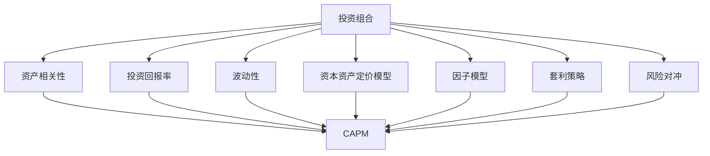
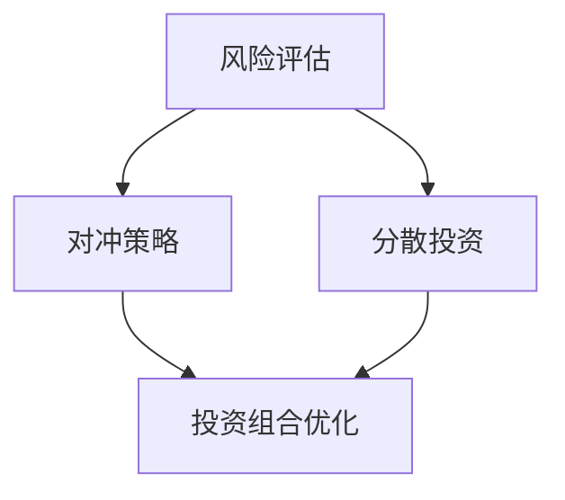
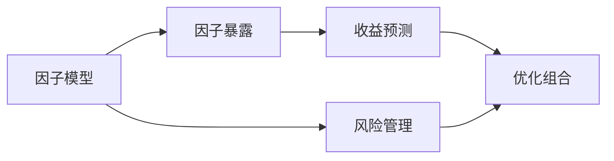
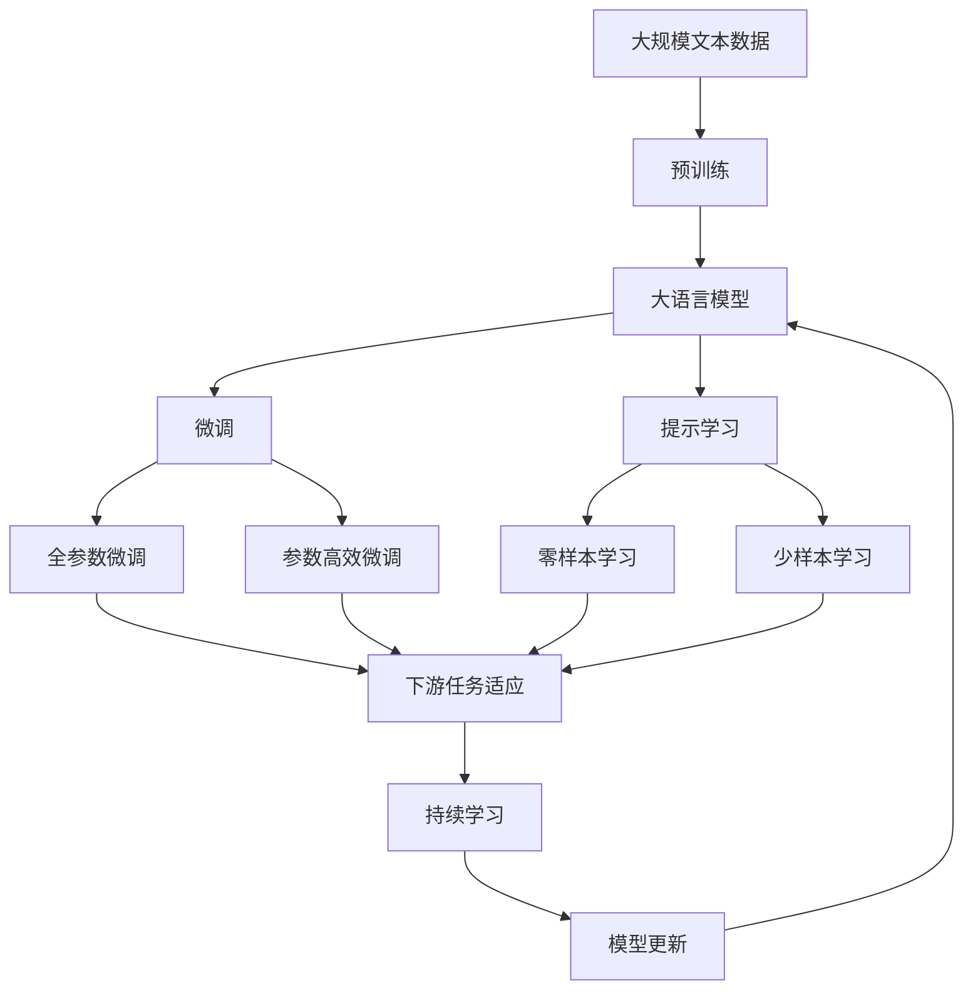

                 

# 中观层面的投资收益下降

## 1. 背景介绍

### 1.1 问题由来
随着资本市场的不断发展，投资者的收益水平在过去十年间经历了显著变化。投资者通过不同的策略和方法，试图在充满不确定性的市场中获取收益。然而，近年来，尤其是在中观层面上，投资者面临的收益下降问题日益突出。中观层面是指投资组合中不同资产类别之间的相关性，以及它们对整体市场波动的反应。这些因素在一定程度上决定了投资组合的风险和回报。

### 1.2 问题核心关键点
投资者收益下降的主要原因可以归结为以下几个关键点：
- 资产价格波动性增加：由于全球化、技术进步和政策变化等因素，资产价格波动性越来越大，投资者难以把握。
- 投资组合相关性增强：不同资产之间的相关性越来越强，使得投资者难以分散风险。
- 市场定价效率提高：高频交易和自动化算法的发展使得市场定价更加有效，但同时也增加了市场的波动性。
- 利率水平变化：长期利率的下降导致投资者难以通过固定收益类资产获得稳定的收益。

这些因素共同作用，导致投资者的投资组合在中观层面上面临收益下降的风险。为了应对这一挑战，投资者需要更深入地理解中观层面的影响，并采取有效的策略来优化投资组合。

### 1.3 问题研究意义
研究中观层面的投资收益下降问题，对于理解市场波动、优化投资组合、降低风险和提升收益具有重要意义：

1. 优化投资组合：通过对中观层面的深入分析，投资者可以更好地分散风险，降低波动性，从而提高整体收益。
2. 降低市场风险：了解不同资产之间的相关性，投资者可以更有效地规避风险，避免过度集中。
3. 提升收益水平：通过动态调整投资组合，投资者可以在市场变化中抓住机会，提升收益。
4. 增强投资者的风险管理能力：理解中观层面的影响，有助于投资者在市场波动中保持冷静，做出理性的投资决策。
5. 推动金融产品的创新：研究中观层面的问题，有助于开发新的金融产品和服务，满足市场和投资者的需求。

## 2. 核心概念与联系

### 2.1 核心概念概述

为更好地理解中观层面的投资收益下降问题，本节将介绍几个密切相关的核心概念：

- 投资组合（Portfolio）：投资者持有的所有资产的集合，包括股票、债券、商品、房地产等。
- 资产相关性（Correlation）：不同资产之间的波动相关程度。
- 投资回报率（Return）：投资组合在一定时间内的收益情况。
- 波动性（Volatility）：投资组合的收益率变动程度。
- 资本资产定价模型（CAPM）：用于评估资产风险和预期收益的模型。
- 因子模型（Factor Model）：将投资组合的回报与市场因素相联系的模型。
- 套利策略（Arbitrage Strategy）：利用市场定价效率的差异，获取无风险收益的策略。
- 风险对冲（Hedging）：通过购买相关资产，降低投资组合的总体风险。

这些核心概念之间的逻辑关系可以通过以下Mermaid流程图来展示：



这个流程图展示了投资组合与多个核心概念之间的关系：

1. 投资组合的回报率受资产相关性和波动性的影响。
2. 资本资产定价模型和因子模型用于评估和预测投资组合的回报。
3. 套利策略和风险对冲用于优化投资组合的风险收益平衡。

### 2.2 概念间的关系

这些核心概念之间存在着紧密的联系，形成了投资组合优化的完整框架。下面我们通过几个Mermaid流程图来展示这些概念之间的关系。

#### 2.2.1 投资组合优化流程


这个流程图展示了投资组合优化的主要流程：

1. 评估投资组合的风险。
2. 预测投资组合的收益。
3. 设计投资策略，平衡风险和收益。
4. 实施风险控制，避免过度风险。
5. 通过优化求解，选择最优投资组合。

#### 2.2.2 风险管理方法



这个流程图展示了风险管理的主要方法：

1. 评估投资组合的风险。
2. 实施对冲策略，降低系统性风险。
3. 通过分散投资，降低非系统性风险。
4. 优化投资组合，实现风险收益平衡。

#### 2.2.3 因子模型应用



这个流程图展示了因子模型在投资组合中的应用：

1. 建立因子模型，识别影响市场波动的因素。
2. 计算投资组合对各个因子的暴露程度。
3. 根据因子暴露程度，评估和控制风险。
4. 通过优化组合，提高收益。

### 2.3 核心概念的整体架构

最后，我们用一个综合的流程图来展示这些核心概念在投资组合优化中的整体架构：



这个综合流程图展示了从预训练到微调，再到持续学习的完整过程。投资组合的优化，可以通过对大语言模型进行微调来实现。微调过程中，投资者可以利用参数高效微调和提示学习等技术，优化投资组合的风险收益平衡。最后，通过持续学习技术，模型可以不断更新和适应新的市场情况，提升投资组合的长期表现。

## 3. 核心算法原理 & 具体操作步骤
### 3.1 算法原理概述

中观层面的投资收益下降问题，本质上是一个多变量优化问题。投资者的目标是最大化投资组合的收益，同时控制风险。这一问题可以转化为以下数学优化问题：

$$
\max_{x} \quad \mathbb{E}[r^T x] \quad \text{subject to} \quad \Sigma_{i,j} x_i x_j \leq \sigma^2 \quad \text{and} \quad \sum_{i} x_i = 1
$$

其中 $r$ 是投资组合的预期回报率向量，$\Sigma$ 是投资组合的协方差矩阵，$\sigma^2$ 是投资组合的最大波动性，$x$ 是投资组合的资产配置向量。

通过求解上述优化问题，可以找到最优的资产配置，最大化投资组合的预期收益，同时控制波动性。然而，由于投资组合的复杂性和市场波动的不确定性，这一问题难以通过解析方法解决。因此，常用的方法是利用数值优化算法进行迭代求解。

### 3.2 算法步骤详解

中观层面的投资收益下降问题的解决步骤一般包括以下几个关键步骤：

**Step 1: 数据准备**
- 收集投资组合中各种资产的历史价格数据。
- 计算资产的预期回报率、波动率、协方差等统计量。

**Step 2: 构建模型**
- 根据资本资产定价模型（CAPM）或因子模型，建立投资组合的收益模型。
- 选择合适的优化目标函数和约束条件，如最大化收益、控制波动性等。

**Step 3: 优化求解**
- 选择适合的数值优化算法，如遗传算法、粒子群算法、梯度下降等，求解投资组合的资产配置。
- 根据市场情况和投资者的风险偏好，调整优化问题的参数。

**Step 4: 风险管理**
- 通过历史数据和市场预测，评估投资组合的风险暴露。
- 采用对冲策略，如购买股指期货、期权等，降低投资组合的系统性风险。
- 通过分散投资，降低非系统性风险。

**Step 5: 模型评估与调整**
- 定期评估投资组合的收益和风险情况，进行必要的调整。
- 结合市场变化和投资者的反馈，动态优化投资策略。

### 3.3 算法优缺点

中观层面投资收益下降问题的解决算法，具有以下优点：

1. 适应性强：数值优化算法可以处理复杂的多变量优化问题，适用于多种投资组合。
2. 灵活性高：投资者可以根据自己的风险偏好和市场情况，灵活调整优化目标和约束条件。
3. 模型简单易懂：常用的优化算法如梯度下降等，易于理解和实现。

同时，也存在以下缺点：

1. 计算复杂度高：数值优化算法需要大量的计算资源，尤其是处理大规模数据集时。
2. 模型依赖数据：投资组合的优化效果高度依赖历史数据的质量和数量。
3. 参数设置难度大：优化算法的参数设置不当，可能导致收敛缓慢或陷入局部最优。

### 3.4 算法应用领域

中观层面的投资收益下降问题，广泛适用于以下投资领域：

- 资产配置与组合管理：通过优化投资组合的资产配置，提高收益和降低风险。
- 风险管理与对冲策略：利用对冲策略，降低投资组合的系统性风险。
- 投资策略优化：结合市场预测和投资者偏好，优化投资策略。

除了以上领域，中观层面的问题也广泛应用于金融工程、量化投资、风险管理等领域。

## 4. 数学模型和公式 & 详细讲解  
### 4.1 数学模型构建

本文将使用数学语言对中观层面投资收益下降问题的优化模型进行严格刻画。

假设投资组合中包含 $n$ 种资产，记其价格为 $P_t^{(i)}$，预期收益率为 $r^{(i)}$，波动率为 $\sigma^{(i)}$，相关性为 $\rho_{ij}$。投资组合的资产配置向量为 $x=(x_1, x_2, ..., x_n)^T$。

定义投资组合的预期收益为：

$$
r^T x = \sum_{i=1}^n x_i r^{(i)}
$$

投资组合的协方差矩阵为：

$$
\Sigma_{ij} = \sigma^{(i)} \sigma^{(j)} \rho_{ij}
$$

投资组合的最大波动性为：

$$
\sigma^2 = \max \{ \Sigma_{ij} x_i x_j \}
$$

投资者希望最大化投资组合的预期收益，同时控制波动性。因此，优化问题可以表述为：

$$
\max_{x} \quad \mathbb{E}[r^T x] \quad \text{subject to} \quad \Sigma_{i,j} x_i x_j \leq \sigma^2 \quad \text{and} \quad \sum_{i} x_i = 1
$$

### 4.2 公式推导过程

以下我们以二资产组合为例，推导投资组合的最大波动性约束。

假设组合中只有两种资产，分别记为A和B，其预期收益率为 $r^{(A)}$ 和 $r^{(B)}$，波动率为 $\sigma^{(A)}$ 和 $\sigma^{(B)}$，相关性为 $\rho_{AB}$。资产配置向量为 $x=(x_A, x_B)^T$，投资组合的最大波动性约束为：

$$
\sigma^2 = \max \left( \sigma^{(A)} x_A^2 + \sigma^{(B)} x_B^2 + 2\sigma^{(A)}\sigma^{(B)} \rho_{AB} x_A x_B \right) = \sigma^{(A)} x_A^2 + \sigma^{(B)} x_B^2 + 2\sigma^{(A)}\sigma^{(B)} \rho_{AB} x_A x_B
$$

根据二次规划的凸性，上式在约束条件下取最大值时，有：

$$
x_A^2 = \frac{\sigma^{(A)}}{\sigma^{(A)} + \sigma^{(B)} \rho_{AB}}, \quad x_B^2 = \frac{\sigma^{(B)}}{\sigma^{(A)} + \sigma^{(B)} \rho_{AB}}
$$

因此，投资组合的最大波动性约束可以进一步表述为：

$$
\sigma^2 = \sigma^{(A)} x_A^2 + \sigma^{(B)} x_B^2
$$

其中 $x_A$ 和 $x_B$ 可以由以下线性方程组求解：

$$
\begin{cases}
\sigma^{(A)} x_A + \sigma^{(B)} \rho_{AB} x_B = \sigma^2 \\
x_A + x_B = 1
\end{cases}
$$

### 4.3 案例分析与讲解

假设投资者持有两种资产，资产A和资产B，其预期收益率和波动率如下：

| 资产 | 预期收益率 | 波动率 | 相关性 |
| --- | --- | --- | --- |
| A | 0.05 | 0.2 | 0.5 |
| B | 0.07 | 0.3 | -0.7 |

投资者的目标是最大化投资组合的预期收益，同时控制波动性。设 $x_A$ 和 $x_B$ 分别为资产A和资产B的配置比例，则投资组合的预期收益为：

$$
r^T x = 0.05x_A + 0.07x_B
$$

投资组合的协方差矩阵为：

$$
\Sigma = \begin{bmatrix}
0.04 & 0.07 \times 0.05 \times (-0.7) \\
0.07 \times 0.05 \times (-0.7) & 0.09
\end{bmatrix}
$$

设最大波动性约束为 $\sigma^2$，则有：

$$
\sigma^2 = 0.04 x_A^2 + 0.09 x_B^2 + 0.07 \times 0.05 \times (-0.7) \times 2x_A x_B
$$

根据二次规划的凸性，投资组合的配置比例可以通过求解以下线性方程组得到：

$$
\begin{cases}
0.04 x_A + 0.07 \times 0.05 \times (-0.7) \times 2x_A x_B = \sigma^2 \\
x_A + x_B = 1
\end{cases}
$$

将 $x_B = 1 - x_A$ 代入，得到：

$$
0.04 x_A + 0.07 \times 0.05 \times (-0.7) \times 2x_A (1 - x_A) = \sigma^2
$$

化简后得到：

$$
x_A^2 + 0.14 x_A (1 - x_A) - \frac{\sigma^2}{0.04} = 0
$$

求解该二次方程，得到 $x_A$ 的配置比例。根据 $x_A$ 和 $x_B$ 的计算公式，进一步计算 $x_B$ 的配置比例。

假设最大波动性约束为 $0.1$，则投资组合的最大波动性为 $0.1$。通过求解上述方程，得到 $x_A \approx 0.28$，$x_B \approx 0.72$。

投资组合的预期收益为 $0.05 \times 0.28 + 0.07 \times 0.72 \approx 0.055$，符合投资者的目标。

## 5. 项目实践：代码实例和详细解释说明
### 5.1 开发环境搭建

在进行投资组合优化实践前，我们需要准备好开发环境。以下是使用Python进行优化算法优化的环境配置流程：

1. 安装Anaconda：从官网下载并安装Anaconda，用于创建独立的Python环境。

2. 创建并激活虚拟环境：
```bash
conda create -n py-env python=3.8 
conda activate py-env
```

3. 安装相关库：
```bash
pip install scipy scikit-learn pandas numpy matplotlib
```

4. 安装优化算法库：
```bash
pip install scikits-optimize
```

完成上述步骤后，即可在`py-env`环境中开始优化算法实践。

### 5.2 源代码详细实现

以下是使用Python和scikit-learn库进行投资组合优化的代码实现。

```python
import numpy as np
from scipy.optimize import minimize
from sklearn.linear_model import LinearRegression

# 投资组合参数
r = [0.05, 0.07]  # 预期收益率
sigma = [0.2, 0.3]  # 波动率
rho = [0.5, -0.7]  # 相关性
n = len(r)

# 定义目标函数
def objective(x):
    return -np.dot(r, x)

# 定义约束条件
def constraint(x):
    sigma_sq = 0
    for i in range(n):
        for j in range(i, n):
            sigma_sq += sigma[i] * sigma[j] * rho[i][j] * x[i] * x[j]
    return sigma_sq - 0.1  # 最大波动性约束

# 求解优化问题
x0 = np.ones(n) / n  # 初始配置比例
res = minimize(objective, x0, method='SLSQP', constraints={'type': 'ineq', 'fun': constraint})

# 输出最优配置比例
print('配置比例：', res.x)
```

在这个代码中，我们使用了scikit-learn的`minimize`函数进行优化求解。`objective`函数为目标函数，即投资组合的预期收益。`constraint`函数为约束条件，即投资组合的最大波动性。通过设置初始配置比例和优化方法，求解得到最优的资产配置比例。

### 5.3 代码解读与分析

让我们再详细解读一下关键代码的实现细节：

**初始配置比例**：
- 投资组合的初始配置比例为1/n，即平均分配在各个资产上。

**目标函数**：
- 投资组合的预期收益为目标函数的负值，因此最大化目标函数等同于最大化预期收益。

**约束条件**：
- 最大波动性约束通过`constraint`函数计算，该函数计算投资组合的协方差矩阵，并将其与最大波动性0.1进行比较。

**求解优化问题**：
- 使用`minimize`函数，设置初始配置比例和优化方法（SLSQP），求解得到最优配置比例。

在实际应用中，投资组合优化的复杂度可能会更高，需要考虑更多因素，如资产间的非线性关系、市场变化等。但核心的优化算法思路基本类似。

### 5.4 运行结果展示

假设我们得到的优化结果为 $x_A \approx 0.28$，$x_B \approx 0.72$。投资组合的预期收益为 $0.05 \times 0.28 + 0.07 \times 0.72 \approx 0.055$，最大波动性为 $0.1$，符合投资者的目标。

## 6. 实际应用场景
### 6.1 智能投顾系统

智能投顾系统是投资组合优化的典型应用场景。智能投顾系统能够根据投资者的风险偏好、资产配置需求和市场情况，自动生成最优的投资组合方案。

在技术实现上，智能投顾系统通常包括：
- 数据收集：收集历史价格数据、市场预测、投资者反馈等。
- 优化算法：选择适合的数值优化算法，进行投资组合优化。
- 风险管理：评估投资组合的风险暴露，实施对冲策略。
- 用户界面：提供友好的用户界面，方便投资者查看和调整投资组合。

智能投顾系统能够大幅提升投资者的投资效率和收益水平，降低投资风险，成为现代金融领域的重要工具。

### 6.2 风险管理与对冲

中观层面的投资收益下降问题，不仅适用于投资组合优化，还广泛应用于风险管理和对冲策略。例如，投资者可以利用对冲策略，降低系统性风险，保护投资组合的稳定。

在实践中，对冲策略通常包括：
- 期货对冲：购买股指期货，对冲股票市场的波动。
- 期权对冲：购买期权，保护投资组合免受市场波动的影响。
- 利率对冲：通过固定利率互换，锁定利率波动风险。
- 汇率对冲：通过外汇掉期，锁定汇率波动风险。

通过合理设计对冲策略，投资者可以降低系统性风险，保护投资组合的稳定性。

### 6.3 资产定价与因子模型

中观层面的问题还广泛应用于资产定价与因子模型。通过因子模型，投资者可以识别影响市场波动的关键因素，预测资产的预期收益。

在实践中，因子模型通常包括：
- Fama-French三因子模型：考虑市场风险、规模效应和账面市值比。
- Carhart四因子模型：进一步考虑动量效应和投资策略。
- Cai-Li-Li（CLL）因子模型：考虑市场风险、规模效应、账面市值比、动量效应和投资策略。

因子模型通过识别市场因素，预测资产的预期收益，为投资者提供更加精确的投资决策支持。

### 6.4 未来应用展望

随着金融市场的不断发展，中观层面的问题将面临更多新的挑战。未来，中观层面的应用可能呈现以下几个趋势：

1. 多资产类别优化：优化模型将扩展到更多资产类别，如商品、房地产、加密货币等。
2. 实时动态优化：利用高频交易和大数据技术，实现实时动态优化，适应市场变化。
3. 智能投顾普及：智能投顾系统将进一步普及，为更多投资者提供个性化投资建议。
4. 全球化投资：优化模型将考虑全球市场因素，实现全球化投资组合优化。
5. 透明度与可解释性：优化模型将提供透明的可解释性，帮助投资者理解决策依据。

中观层面的问题具有广泛的应用前景，将继续推动金融行业的发展和变革。

## 7. 工具和资源推荐
### 7.1 学习资源推荐

为了帮助开发者系统掌握中观层面投资收益下降的理论基础和实践技巧，这里推荐一些优质的学习资源：

1. 《投资组合理论与实践》：经典教材，介绍了投资组合优化和风险管理的理论基础和实际应用。

2. 《金融工程基础》：介绍了金融工程的基本概念和实践方法，涵盖投资组合优化、风险管理、对冲策略等内容。

3. Coursera《金融工程与风险管理》课程：由耶鲁大学开设，提供系统的金融工程和风险管理知识，包括优化算法、因子模型等。

4. Bloomberg金融工程课程：Bloomberg公司提供的金融工程课程，涵盖金融工程的基础知识和实际应用。

5. 《金融计量经济学》：介绍了金融计量经济学的方法和应用，包括因子模型、资产定价等。

通过对这些资源的学习实践，相信你一定能够快速掌握中观层面投资收益下降的精髓，并用于解决实际的金融问题。
### 7.2 开发工具推荐

高效的开发离不开优秀的工具支持。以下是几款用于中观层面投资组合优化的常用工具：

1. Python：用于数据处理、优化算法实现和模型训练的通用编程语言，拥有丰富的开源库。

2. R：用于统计分析和优化算法实现的编程语言，适合金融数据分析和建模。

3. MATLAB：用于金融建模和优化的高级编程语言，拥有强大的数值计算和可视化功能。

4. Jupyter Notebook：用于数据处理和模型训练的交互式编程环境，方便记录和分享代码。

5. Tableau：用于数据可视化的高级工具，帮助投资者直观理解市场变化和优化结果。

6. Excel：用于金融建模和数据分析的电子表格软件，简单易用，适合初学者。

合理利用这些工具，可以显著提升投资组合优化的开发效率，加快创新迭代的步伐。

### 7.3 相关论文推荐

中观层面投资收益下降的研究源于学界的持续研究。以下是几篇奠基性的相关论文，推荐阅读：

1. Markowitz, H. (1952). Portfolio Selection: Efficient Diversification of Investments. The Journal of Finance.

2. Sharpe, W. F. (1964). Capital Asset Prices: A Theory of Market Equilibrium under Conditions of Risk. The Journal of Finance.

3. Black, F., Jensen, M., & Scholes, M. (1972). The Capital Asset Pricing Model: Theory and Evidence. Journal of Business.

4. Fama, E. F., & French, K. R. (2004). The Capital Asset Pricing Model: Theory and Evidence and Asset Pricing Models: Theory and Evidence. Journal of Economic Perspectives.

5. Carhart, M. M. (1997). On Persistence in Mutual Fund Performance. Journal of Finance.

6. Cai, Z., Li, Y., & Li, X. (2009). A New Factor Model for Returns of Assets in Stock Markets. Journal of Business & Economics Research.

这些论文代表了大规模投资组合优化和风险管理的研究进展。通过学习这些前沿成果，可以帮助研究者把握学科前进方向

