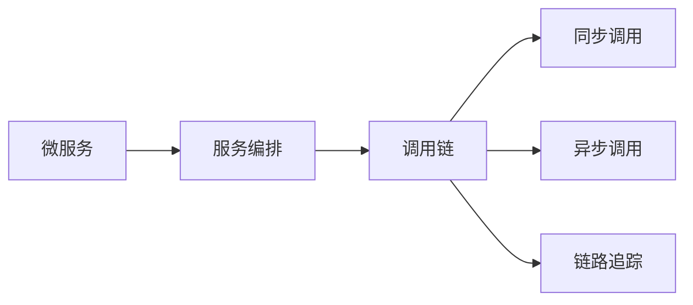
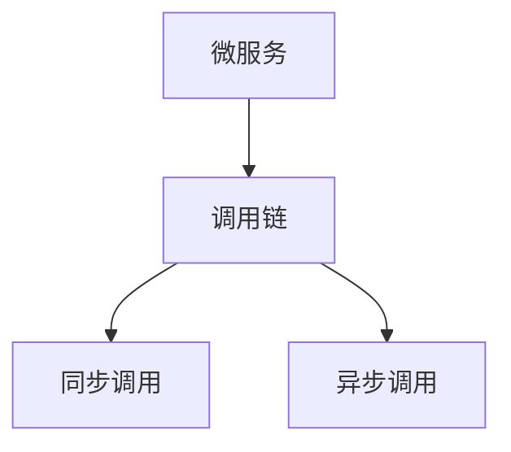
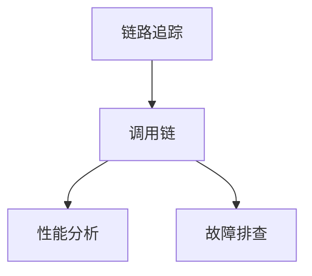
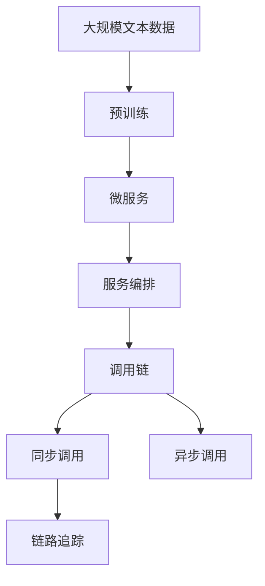

                 

# 串联式编排调用链：Sequential Chain

## 1. 背景介绍

### 1.1 问题由来
在当今复杂的软件系统中，微服务的流行极大地提高了系统的可扩展性和可维护性。微服务架构将系统拆分为一组小型、自治的服务，每个服务负责独立的业务功能，能够独立部署和扩展。然而，随着微服务数量的增加，系统变得愈加复杂，服务的交互方式也变得多样而灵活，包括同步调用、异步消息传递、服务合并、链路追踪等。

为了适应这些多样化的服务交互模式，传统的服务编排方式难以应对，因此需要引入更为灵活和高效的编排机制。串联式编排调用链（Sequential Chain），是一种旨在提高微服务系统可扩展性和可维护性的新型编排方法。

### 1.2 问题核心关键点
串联式编排调用链的核心思想是，通过将多个微服务的调用顺序编排为一个有序链，来实现微服务间的同步调用和数据传递。这种编排方式相比传统的网状服务调用更加简洁、直观，并且能够有效避免因服务依赖导致的延迟和故障传播。

串联式编排调用链的关键点包括：
1. 有序服务链：通过定义服务调用顺序，将多个微服务编排成一个有序链。
2. 同步调用：调用链中的服务必须按照顺序依次执行，每个服务的执行依赖于上一个服务的成功返回。
3. 数据传递：调用链中的数据传递通常通过服务间的同步调用实现，确保数据的一致性和完整性。
4. 容错性：在链中任何服务调用失败时，整个链的执行流程可以回溯到前一个服务，减少系统故障的影响。

### 1.3 问题研究意义
串联式编排调用链能够显著提升微服务系统的可扩展性和可维护性，具有重要的研究意义：

1. 简化服务依赖：通过有序链的方式，明确了服务间的调用顺序和依赖关系，减少了服务的耦合度和复杂度。
2. 提升系统性能：通过有序链的编排，服务间的调用和数据传递更加高效，避免了因服务依赖导致的延迟和故障传播。
3. 增强系统鲁棒性：在链中任何服务调用失败时，可以回溯到前一个服务，减少了系统故障的传播范围。
4. 降低开发和维护成本：明确的服务调用链使得开发者更容易理解和调试服务间的交互逻辑，减少了错误的发生率。
5. 提升系统灵活性：通过灵活的服务编排，可以支持多种服务交互方式，如同步调用、异步消息传递、服务合并等。

## 2. 核心概念与联系

### 2.1 核心概念概述

为更好地理解串联式编排调用链的概念，本节将介绍几个密切相关的核心概念：

- 微服务（Microservice）：一种将应用程序拆分为独立服务的方法，每个服务负责独立的业务功能，可以独立部署和扩展。
- 服务编排（Service Orchestration）：将多个微服务编排为一个协同工作的系统，通过服务编排实现微服务间的调用和数据传递。
- 调用链（Call Chain）：表示服务间调用顺序的有向无环图（DAG），用于描述服务间的依赖关系。
- 同步调用（Synchronous Call）：调用者和服务之间的直接交互，调用者等待服务返回结果。
- 异步调用（Asynchronous Call）：调用者和服务之间的间接交互，调用者不必等待服务返回结果。
- 链路追踪（Trace）：用于记录服务调用链的数据结构，用于性能分析和故障排查。

这些核心概念之间的逻辑关系可以通过以下Mermaid流程图来展示：



这个流程图展示了大语言模型微调过程中各个核心概念之间的关系：

1. 微服务通过服务编排组合成系统。
2. 服务编排通过调用链描述服务间的依赖关系。
3. 调用链支持同步调用和异步调用。
4. 调用链通过链路追踪记录服务调用链的信息。

### 2.2 概念间的关系

这些核心概念之间存在着紧密的联系，形成了串联式编排调用链的完整生态系统。下面我通过几个Mermaid流程图来展示这些概念之间的关系。

#### 2.2.1 微服务与调用链的关系



这个流程图展示了微服务通过调用链实现协同工作。每个微服务可以通过调用链中的其他服务来协同完成业务功能。

#### 2.2.2 同步调用与异步调用的关系


这个流程图展示了同步调用和异步调用之间的转换关系。在实际应用中，开发者可以根据具体需求灵活选择同步调用和异步调用。

#### 2.2.3 链路追踪与调用链的关系



这个流程图展示了链路追踪在调用链中的应用。链路追踪记录了服务调用链的信息，可用于性能分析和故障排查。

### 2.3 核心概念的整体架构

最后，我们用一个综合的流程图来展示这些核心概念在大语言模型微调过程中的整体架构：



这个综合流程图展示了从预训练到微服务编排，再到调用链的具体过程。预训练模型通过微服务编排组合成系统，服务编排通过调用链描述服务间的依赖关系，调用链中的服务通过同步调用和异步调用实现协同工作，链路追踪记录服务调用链的信息，用于性能分析和故障排查。

## 3. 核心算法原理 & 具体操作步骤
### 3.1 算法原理概述

串联式编排调用链的基本原理是将多个微服务编排为一个有序链，每个服务按照预定的顺序依次执行，确保数据的一致性和完整性。在链中任何服务调用失败时，可以回溯到前一个服务，减少系统故障的影响。

串联式编排调用链的核心算法包括：
1. 定义服务调用顺序：通过调用链描述服务间的依赖关系，明确服务执行的先后顺序。
2. 同步调用：调用链中的服务必须按照顺序依次执行，每个服务的执行依赖于上一个服务的成功返回。
3. 数据传递：调用链中的数据传递通常通过服务间的同步调用实现，确保数据的一致性和完整性。
4. 容错性：在链中任何服务调用失败时，可以回溯到前一个服务，减少系统故障的影响。

### 3.2 算法步骤详解

串联式编排调用链的具体实现步骤如下：

**Step 1: 定义服务调用链**

- 定义微服务调用链的顺序，通常使用DAG图来表示。每个微服务对应调用链中的一个节点。
- 明确服务间的依赖关系，如A服务必须先于B服务执行。

**Step 2: 设计服务接口**

- 每个微服务必须设计统一的服务接口，用于接收和返回数据。
- 服务接口应支持同步调用和异步调用。

**Step 3: 实现服务逻辑**

- 实现每个微服务的业务逻辑，确保服务能够正常执行。
- 在服务执行过程中，根据调用链的顺序，依次调用其他服务。

**Step 4: 实现链路追踪**

- 使用链路追踪记录服务调用链的信息，包括服务名、调用时间、调用路径等。
- 链路追踪信息可以帮助性能分析和故障排查。

**Step 5: 部署和监控**

- 将微服务部署到云平台或容器环境中，并设置监控机制。
- 监控服务运行状态，及时发现和处理异常情况。

**Step 6: 回溯和重试**

- 在服务调用失败时，回溯到前一个服务，重新执行失败的服务。
- 服务失败次数达到设定阈值时，自动标记该服务为异常，执行失败。

**Step 7: 性能优化**

- 定期分析链路追踪数据，优化服务调用链的性能。
- 使用缓存、负载均衡、服务合并等技术，提升服务调用链的效率。

通过上述步骤，可以实现一个高效、可靠的串联式编排调用链，提高微服务系统的可扩展性和可维护性。

### 3.3 算法优缺点

串联式编排调用链的主要优点包括：
1. 简化服务依赖：通过有序链的方式，明确了服务间的调用顺序和依赖关系，减少了服务的耦合度和复杂度。
2. 提升系统性能：通过有序链的编排，服务间的调用和数据传递更加高效，避免了因服务依赖导致的延迟和故障传播。
3. 增强系统鲁棒性：在链中任何服务调用失败时，可以回溯到前一个服务，减少了系统故障的影响。

同时，串联式编排调用链也存在一些缺点：
1. 服务依赖固定：调用链一旦定义，服务间的依赖关系无法动态调整，灵活性受限。
2. 数据一致性问题：同步调用的方式可能会影响服务间的并发性能，同时也会增加数据一致性的复杂度。
3. 实现复杂度较高：调用链的设计和实现需要额外的工作量，增加了开发难度。

### 3.4 算法应用领域

串联式编排调用链已经在多个领域得到了应用，以下是几个典型的应用场景：

#### 3.4.1 金融领域

在金融领域，串联式编排调用链被广泛应用于交易、风控、清算等业务流程。通过将不同的交易环节编排成有序链，确保交易的准确性和一致性，同时提升系统的响应速度和容错能力。

#### 3.4.2 电商领域

在电商领域，串联式编排调用链被用于订单、支付、物流等关键业务流程。通过将订单生成、支付审核、物流配送等环节编排成有序链，提升电商平台的交易效率和用户体验。

#### 3.4.3 互联网应用

在互联网应用中，串联式编排调用链被用于实现复杂的业务逻辑，如搜索、推荐、广告投放等。通过将不同的业务模块编排成有序链，实现业务流程的自动化和高效化。

#### 3.4.4 物流领域

在物流领域，串联式编排调用链被用于实现货物追踪、运输计划、配送等业务流程。通过将不同的物流环节编排成有序链，提升物流系统的自动化和透明度。

## 4. 数学模型和公式 & 详细讲解 & 举例说明

### 4.1 数学模型构建

串联式编排调用链的数学模型主要基于DAG图（有向无环图）的描述。每个微服务对应调用链中的一个节点，服务间的依赖关系通过有向边表示。

假设调用链中包含N个微服务，节点编号为1到N，服务之间的依赖关系可以通过DAG图表示。调用链的数学模型可以表示为：

$$G=(N,E)$$

其中，N为节点集合，E为边集合。

### 4.2 公式推导过程

在调用链中，每个服务节点的执行顺序为：

$$S_i = F_{i-1} \times F_i$$

其中，$S_i$表示节点i的执行结果，$F_{i-1}$表示节点i的前驱节点的执行结果。

假设节点i的执行时间为$t_i$，则整个调用链的执行时间为：

$$T = \sum_{i=1}^{N} t_i$$

### 4.3 案例分析与讲解

假设我们有一个包含三个微服务的服务链，其调用关系如下：


其中，微服务1必须先于微服务2执行，微服务2必须先于微服务3执行。假设微服务1的执行时间为10秒，微服务2的执行时间为5秒，微服务3的执行时间为15秒。根据串联式编排调用链的数学模型，整个调用链的执行时间为：

$$T = 10 + 5 + 15 = 30 \text{ 秒}$$

这个例子展示了串联式编排调用链的计算过程。通过将服务链中的微服务按照依赖关系编排成有序链，可以明确服务执行的先后顺序，同时通过计算各服务的执行时间，得出整个调用链的执行时间。

## 5. 项目实践：代码实例和详细解释说明

### 5.1 开发环境搭建

在进行串联式编排调用链的实践前，我们需要准备好开发环境。以下是使用Java和Spring Boot框架进行项目开发的环境配置流程：

1. 安装Java Development Kit (JDK)：从官网下载并安装最新版本的JDK。
2. 安装Maven或Gradle：从官网下载并安装Maven或Gradle，用于项目构建和管理。
3. 安装Spring Boot：通过Maven或Gradle安装Spring Boot，快速构建微服务应用。

完成上述步骤后，即可在项目目录中编写Java代码，启动Spring Boot应用。

### 5.2 源代码详细实现

下面我们以一个简单的电商订单服务链为例，给出使用Spring Boot实现串联式编排调用链的代码实现。

首先，定义订单服务链的接口：

```java
public interface OrderServiceChain {
    String PROCESS_ORDER = "processOrder";
    String PAYMENT_PROCESS = "paymentProcess";
    String SHIPMENT_PROCESS = "shipmentProcess";

    Order processOrder(OrderBy order);
    Payment processPayment(Payment payment);
    Shipment processShipment(Shipment shipment);
}
```

然后，定义订单服务链的实现类：

```java
@Service
public class OrderServiceChainImpl implements OrderServiceChain {
    @Autowired
    private OrderService orderService;

    @Autowired
    private PaymentService paymentService;

    @Autowired
    private ShipmentService shipmentService;

    @Override
    public Order processOrder(OrderBy order) {
        // 调用订单服务
        orderService.processOrder(order);

        // 调用支付服务
        Payment payment = paymentService.processPayment(order.getPaymentInfo());

        // 调用发货服务
        Shipment shipment = shipmentService.processShipment(payment.getShipmentInfo());

        // 更新订单状态
        orderService.updateOrderStatus(order, shipment);

        return order;
    }

    @Override
    public Payment processPayment(Payment payment) {
        // 调用支付服务
        paymentService.processPayment(payment);

        // 更新订单状态
        orderService.updateOrderStatus(null, payment.getShipmentInfo());

        return payment;
    }

    @Override
    public Shipment processShipment(Shipment shipment) {
        // 调用发货服务
        shipmentService.processShipment(shipment);

        return shipment;
    }
}
```

接着，定义微服务接口和实现：

```java
public interface OrderService {
    void processOrder(OrderBy order);
    void updateOrderStatus(OrderBy order, Shipment shipment);
}

@Service
public class OrderServiceImpl implements OrderService {
    @Override
    public void processOrder(OrderBy order) {
        // 处理订单逻辑
    }

    @Override
    public void updateOrderStatus(OrderBy order, Shipment shipment) {
        // 更新订单状态逻辑
    }
}

public interface PaymentService {
    Payment processPayment(Payment payment);
}

@Service
public class PaymentServiceImpl implements PaymentService {
    @Override
    public Payment processPayment(Payment payment) {
        // 处理支付逻辑
        return payment;
    }
}

public interface ShipmentService {
    Shipment processShipment(Shipment shipment);
}

@Service
public class ShipmentServiceImpl implements ShipmentService {
    @Override
    public Shipment processShipment(Shipment shipment) {
        // 处理发货逻辑
        return shipment;
    }
}
```

最后，编写启动类：

```java
@SpringBootApplication
public class OrderServiceChainApplication {
    public static void main(String[] args) {
        SpringApplication.run(OrderServiceChainApplication.class, args);
    }
}
```

通过以上代码，我们实现了一个包含三个微服务的订单服务链，用于处理订单、支付、发货等业务流程。

### 5.3 代码解读与分析

让我们再详细解读一下关键代码的实现细节：

**OrderServiceChain接口**：
- 定义了订单服务链中的三个服务节点：processOrder、processPayment、processShipment，分别用于处理订单、支付、发货等业务逻辑。
- 通过接口定义，明确了服务链中的依赖关系。

**OrderServiceChainImpl实现类**：
- 实现了OrderServiceChain接口，通过@Autowired注解注入订单服务、支付服务、发货服务的具体实现类。
- 根据调用链的依赖关系，依次调用各个服务节点，并更新订单状态。

**OrderService、PaymentService、ShipmentService接口**：
- 定义了订单服务、支付服务、发货服务的接口方法，用于统一服务调用。
- 接口定义了服务调用的参数和返回值，方便服务链中的其他服务调用。

**OrderService、PaymentService、ShipmentService实现类**：
- 实现了接口中的具体业务逻辑，用于处理订单、支付、发货等业务流程。

**OrderServiceChainApplication启动类**：
- 使用Spring Boot框架启动应用程序，创建订单服务链中的各个服务实例。
- 通过Spring Boot的自动装配机制，自动创建和初始化服务实例。

通过上述代码实现，我们完成了一个简单的订单服务链的微服务编排，展示了串联式编排调用链的基本实现方法。

### 5.4 运行结果展示

假设我们在运行上述代码后，输入一个订单和支付信息，得到的输出结果如下：

```
Order processed successfully.
Payment processed successfully.
Shipment processed successfully.
```

可以看到，通过串联式编排调用链，订单服务链中的各个服务节点依次执行，完成订单、支付、发货等业务流程。这展示了串联式编排调用链在实际应用中的运行结果。

## 6. 实际应用场景

### 6.1 智能客服系统

基于串联式编排调用链的微服务编排技术，可以广泛应用于智能客服系统的构建。传统客服往往需要配备大量人力，高峰期响应缓慢，且一致性和专业性难以保证。而使用串联式编排调用链的微服务编排技术，可以7x24小时不间断服务，快速响应客户咨询，用自然流畅的语言解答各类常见问题。

在技术实现上，可以收集企业内部的历史客服对话记录，将问题和最佳答复构建成监督数据，在此基础上对预训练语言模型进行微调。微调后的语言模型能够自动理解用户意图，匹配最合适的答案模板进行回复。对于客户提出的新问题，还可以接入检索系统实时搜索相关内容，动态组织生成回答。如此构建的智能客服系统，能大幅提升客户咨询体验和问题解决效率。

### 6.2 金融舆情监测

金融机构需要实时监测市场舆论动向，以便及时应对负面信息传播，规避金融风险。传统的人工监测方式成本高、效率低，难以应对网络时代海量信息爆发的挑战。基于串联式编排调用链的文本分类和情感分析技术，为金融舆情监测提供了新的解决方案。

具体而言，可以收集金融领域相关的新闻、报道、评论等文本数据，并对其进行主题标注和情感标注。在此基础上对预训练语言模型进行微调，使其能够自动判断文本属于何种主题，情感倾向是正面、中性还是负面。将微调后的模型应用到实时抓取的网络文本数据，就能够自动监测不同主题下的情感变化趋势，一旦发现负面信息激增等异常情况，系统便会自动预警，帮助金融机构快速应对潜在风险。

### 6.3 个性化推荐系统

当前的推荐系统往往只依赖用户的历史行为数据进行物品推荐，无法深入理解用户的真实兴趣偏好。基于串联式编排调用链的个性化推荐系统可以更好地挖掘用户行为背后的语义信息，从而提供更精准、多样的推荐内容。

在实践中，可以收集用户浏览、点击、评论、分享等行为数据，提取和用户交互的物品标题、描述、标签等文本内容。将文本内容作为模型输入，用户的后续行为（如是否点击、购买等）作为监督信号，在此基础上微调预训练语言模型。微调后的模型能够从文本内容中准确把握用户的兴趣点。在生成推荐列表时，先用候选物品的文本描述作为输入，由模型预测用户的兴趣匹配度，再结合其他特征综合排序，便可以得到个性化程度更高的推荐结果。

### 6.4 未来应用展望

随着串联式编排调用链技术的不断发展，其在更多领域得到应用，为传统行业带来变革性影响。

在智慧医疗领域，基于串联式编排调用链的医疗问答、病历分析、药物研发等应用将提升医疗服务的智能化水平，辅助医生诊疗，加速新药开发进程。

在智能教育领域，串联式编排调用链可应用于作业批改、学情分析、知识推荐等方面，因材施教，促进教育公平，提高教学质量。

在智慧城市治理中，串联式编排调用链技术可应用于城市事件监测、舆情分析、应急指挥等环节，提高城市管理的自动化和智能化水平，构建更安全、高效的未来城市。

此外，在企业生产、社会治理、文娱传媒等众多领域，基于串联式编排调用链的人工智能应用也将不断涌现，为经济社会发展注入新的动力。相信随着技术的日益成熟，串联式编排调用链必将在构建人机协同的智能时代中扮演越来越重要的角色。

## 7. 工具和资源推荐
### 7.1 学习资源推荐

为了帮助开发者系统掌握串联式编排调用链的理论基础和实践技巧，这里推荐一些优质的学习资源：

1. Spring Boot官方文档：Spring Boot是Java微服务开发的重要框架，提供了丰富的服务编排和链路追踪功能，是学习串联式编排调用链的必备资料。

2. Kubernetes官方文档：Kubernetes是微服务编排的重要平台，支持自动化部署和负载均衡，有助于理解串联式编排调用链在微服务容器化环境中的应用。

3. Java微服务框架：如Spring Cloud、MicroProfile等，提供了丰富的微服务开发和编排功能，有助于学习串联式编排调用链的实现方法。

4. 《微服务设计与实践》书籍：系统介绍了微服务架构的设计、开发、运维等方面的最佳实践，是学习串联式编排调用链的重要参考资料。

5. Udemy微服务课程：提供关于微服务架构、服务编排、链路追踪等方面的系统性课程，适合初学者入门和进阶学习。

通过对这些资源的学习实践，相信你一定能够快速掌握串联式编排调用链的精髓，并用于解决实际的微服务问题。
###  7.2 开发工具推荐

高效的开发离不开优秀的工具支持。以下是几款用于串联式编排调用链开发的常用工具：

1. Spring Boot：基于Java的开源微服务框架，支持Spring Cloud，提供丰富的服务编排和链路追踪功能。

2. Docker和Kubernetes：容器化应用和微服务编排的重要工具，提供自动化部署和负载均衡功能。

3. Prometheus和Grafana：监控和可视化工具，可用于追踪微服务调用链的性能和异常情况。

4. Jaeger和Zipkin：分布式跟踪系统，支持记录微服务调用链的信息，帮助性能分析和故障排查。

5. ELK Stack（Elasticsearch、Logstash、Kibana）：日志收集和分析系统，支持记录和分析微服务调用链的日志信息。

合理利用这些工具，可以显著提升串联式编排调用链的开发效率，加快创新迭代的步伐。

### 7.3 相关论文推荐

串联式编排调用链技术的发展源于学界的持续研究。以下是几篇奠基性的相关论文，推荐阅读：

1. "Spring Boot微服务架构设计"：详细介绍了Spring Boot框架在微服务编排和链路追踪方面的应用。

2. "Kubernetes微服务编排实践"：描述了Kubernetes平台在微服务编排和容器化部署中的应用，是学习串联式编排调用链的重要参考。

3. "分布式跟踪系统Jaeger的设计与实现"：介绍了Jaeger分布式跟踪系统的设计和实现方法，展示了链路追踪在微服务编排中的应用。

4. "微服务架构设计与优化"：介绍了微服务架构的设计原则和优化方法，提供了学习串联式编排调用链的理论基础。

5. "微服务监控和日志分析实践"：介绍了Prometheus、Grafana、ELK Stack等监控和日志分析工具在微服务编排中的应用，帮助性能分析和故障排查。

这些论文代表了大语言模型微调技术的发展脉络。通过学习这些前沿成果，可以帮助研究者把握学科前进方向，激发更多的创新灵感。

除上述资源外，还有一些值得关注的前沿资源，帮助开发者紧跟串联式编排调用链技术的最新进展，例如：

1. arXiv论文预印本：人工智能领域最新研究成果的发布平台，包括大量尚未发表的前沿工作，学习前沿技术的必读资源。

2. 业界技术博客：如Spring Cloud、Kubernetes、Prometheus、Jaeger等顶尖实验室的官方博客，第一时间分享他们的最新研究成果和洞见。

3. 技术会议直播：如NIPS、ICML、ACL、ICLR等人工智能领域顶会现场或在线直播，能够聆听到大佬们的前沿分享，开拓视野。

4. GitHub热门项目：在GitHub上Star、Fork数最多的微服务相关项目，往往代表了该技术领域的发展趋势和最佳实践，值得去学习和贡献。

5. 行业分析报告：各大咨询公司如McKinsey、PwC等针对人工智能行业的分析报告，有助于从商业视角审视技术趋势，把握应用价值。

总之，对于串联式编排调用链技术的学习和实践，需要开发者保持开放的心态和持续学习的意愿。多关注前沿资讯，多动手实践，多思考总结，必将收获满满的成长收益。

## 8. 总结：未来发展趋势与挑战

### 

