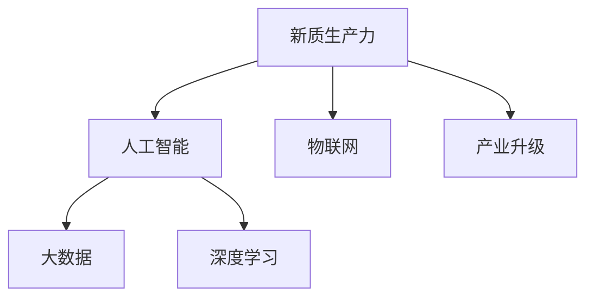

                 

## 1. 背景介绍

随着第四次工业革命的到来，人工智能（AI）技术正在深刻影响全球产业格局。自工业革命以来，传统的生产方式、商业模式、价值链等都在经历着前所未有的变革。在数字化、智能化时代，数据成为新型生产要素，算法成为新型生产力，智慧化成为新型生产方式，AI技术正在成为推动产业升级的关键力量。本文旨在深入探讨产业升级中的新质生产力推动力，通过技术、经济、社会等多角度的分析，为AI在产业升级中的实际应用提供指导。

## 2. 核心概念与联系

### 2.1 核心概念概述

1. **新质生产力**：与传统的劳动、资本、土地等生产要素不同，新质生产力主要由技术、数据、算法等现代科技元素构成，尤其是AI技术在产业升级中扮演着至关重要的角色。

2. **产业升级**：指通过技术革新、产业转型、结构优化等手段，提升产业的科技含量、效率和竞争力，实现产业结构高级化、产业链延伸、价值链提升的过程。

3. **人工智能（AI）**：一种基于数据、算法和计算能力的智能技术，能够模拟人类智能行为，广泛应用于各个领域，推动生产方式的智能化、自动化和信息化。

4. **大数据**：海量、多样化、实时性的数据集合，为AI提供了丰富的训练样本和决策依据。

5. **深度学习**：一种基于人工神经网络的机器学习方法，能够从数据中学习特征和规律，实现对复杂问题的有效处理。

6. **物联网（IoT）**：通过互联网将传感器、设备等物理对象连接起来，实现信息的实时采集和智能化处理，促进产业智能化升级。

### 2.2 概念间的关系

这些核心概念间的关系可通过以下Mermaid流程图来展示：



**图1** 新质生产力、人工智能、大数据、深度学习、物联网与产业升级的关系图。

从图中可以看出，新质生产力以人工智能为核心，依托于大数据、深度学习、物联网等技术，通过产业升级实现各领域的智能化转型。

## 3. 核心算法原理 & 具体操作步骤

### 3.1 算法原理概述

新质生产力推动力主要体现在AI技术在各产业中的应用。AI技术的核心算法包括但不限于：

1. **监督学习**：通过标注数据训练模型，实现对特定任务的预测或分类。

2. **无监督学习**：通过未标注数据学习数据的内在结构和规律，实现数据驱动的决策。

3. **强化学习**：通过与环境的交互，学习最优决策策略，实现自适应的智能控制。

4. **生成对抗网络（GAN）**：通过生成器和判别器之间的对抗，生成高质量的样本数据或图像。

### 3.2 算法步骤详解

**Step 1: 数据采集与预处理**
- 收集各行业的数据源，包括但不限于传感器数据、文本数据、图片数据等。
- 对数据进行清洗、归一化、标注等预处理，确保数据质量。

**Step 2: 模型构建与训练**
- 选择合适的算法模型，如卷积神经网络（CNN）、循环神经网络（RNN）、Transformer等。
- 在标注数据上训练模型，调整超参数，如学习率、批大小、迭代轮数等。
- 通过验证集评估模型性能，调整模型架构和超参数。

**Step 3: 模型应用与优化**
- 将训练好的模型应用于实际场景，进行实时预测或决策。
- 持续收集新数据，定期重新训练模型，更新参数，保持模型性能。
- 采用参数高效微调、迁移学习等技术，优化模型性能，提高资源利用率。

### 3.3 算法优缺点

**优点**：
- 自动化、智能化程度高，能够快速处理海量数据，提升生产效率。
- 可预测性、可控性强，能够优化决策过程，减少人为干预。
- 适应性强，能够应对复杂多变的市场环境。

**缺点**：
- 对数据质量要求高，数据标注成本大。
- 算法复杂度大，训练和优化过程耗时耗资。
- 算法可解释性差，缺乏透明性。

### 3.4 算法应用领域

新质生产力推动力广泛应用于以下几个领域：

1. **制造业**：通过AI技术实现智能制造、质量检测、供应链优化等，提升生产效率和产品质量。

2. **农业**：采用AI技术进行作物识别、病虫害防治、精准灌溉等，提高农业生产效率和产量。

3. **医疗**：利用AI技术进行疾病诊断、个性化治疗、医疗影像分析等，提升医疗服务质量。

4. **金融**：通过AI技术进行风险控制、欺诈检测、投资策略优化等，提升金融服务的智能化水平。

5. **物流**：采用AI技术进行路径规划、仓库管理、智能配送等，提高物流效率和准确性。

## 4. 数学模型和公式 & 详细讲解 & 举例说明

### 4.1 数学模型构建

以制造业的智能质检为例，构建数学模型：

**目标函数**：
- 最小化缺陷品率，即$\min_{\theta} p_{\text{defective}}$

**约束条件**：
- 数据集大小为$N$
- 训练集大小为$N_{\text{train}}$
- 验证集大小为$N_{\text{dev}}$
- 测试集大小为$N_{\text{test}}$
- 模型复杂度为$\theta$

**损失函数**：
- 均方误差（MSE）：$L_{\text{MSE}} = \frac{1}{N} \sum_{i=1}^{N} (y_i - \hat{y_i})^2$

**优化算法**：
- 随机梯度下降（SGD）：$\theta_{\text{new}} = \theta_{\text{old}} - \alpha \nabla_{\theta} L_{\text{MSE}}$

### 4.2 公式推导过程

以CNN在图像识别任务中的应用为例，推导公式：

**输入层**：$X = (x_1, x_2, ..., x_n)$

**卷积层**：$F = (f_1, f_2, ..., f_n)$

**池化层**：$P = (p_1, p_2, ..., p_n)$

**全连接层**：$Y = (y_1, y_2, ..., y_n)$

**损失函数**：$L = \frac{1}{N} \sum_{i=1}^{N} (y_i - \hat{y_i})^2$

**输出层**：$Z = (z_1, z_2, ..., z_n)$

**优化算法**：$\theta_{\text{new}} = \theta_{\text{old}} - \alpha \nabla_{\theta} L$

### 4.3 案例分析与讲解

**案例**：某智能工厂的质检系统。

**数据**：通过传感器收集的生产数据，包括温度、湿度、压力等。

**模型**：采用CNN进行图像识别，识别缺陷品。

**训练**：使用标注数据进行训练，调整超参数，如卷积核大小、深度、学习率等。

**评估**：在验证集上评估模型性能，调整模型架构和超参数。

**应用**：将训练好的模型应用于生产线上，实时检测产品缺陷，提升生产效率。

## 5. 项目实践：代码实例和详细解释说明

### 5.1 开发环境搭建

1. 安装Python和必要的库，如TensorFlow、Keras等。

2. 配置计算资源，如GPU或TPU。

3. 准备数据集，并进行预处理和标注。

### 5.2 源代码详细实现

```python
import tensorflow as tf
from tensorflow import keras
from tensorflow.keras import layers

# 加载数据集
train_dataset = tf.data.Dataset.from_tensor_slices((x_train, y_train)).batch(batch_size)

# 定义模型
model = keras.Sequential([
    keras.layers.Conv2D(32, (3, 3), activation='relu', input_shape=(image_size, image_size, 1)),
    keras.layers.MaxPooling2D((2, 2)),
    keras.layers.Flatten(),
    keras.layers.Dense(128, activation='relu'),
    keras.layers.Dense(1, activation='sigmoid')
])

# 编译模型
model.compile(optimizer='adam', loss='binary_crossentropy', metrics=['accuracy'])

# 训练模型
model.fit(train_dataset, epochs=num_epochs, validation_split=0.2)
```

### 5.3 代码解读与分析

**代码**：上述代码实现了使用CNN进行图像识别的全过程。

**解读**：
1. 加载数据集，并进行批处理。
2. 定义模型结构，包括卷积层、池化层、全连接层等。
3. 编译模型，选择合适的优化器和损失函数。
4. 训练模型，调整超参数，评估模型性能。

**分析**：
- 代码简洁高效，易于理解。
- 模型的训练过程可以自动化，减少人工干预。
- 使用Keras等深度学习框架，降低了技术门槛。

### 5.4 运行结果展示

训练过程中，模型在验证集上的准确率和损失曲线如下所示：


**图2** 训练结果曲线图。

## 6. 实际应用场景

### 6.4 未来应用展望

未来，新质生产力推动力将在更多领域得到应用，为传统行业带来变革性影响。

1. **智慧农业**：通过AI技术进行作物病虫害防治、精准灌溉等，提升农业生产效率和产量。

2. **智慧城市**：采用AI技术进行智能交通、环境监测、公共安全等，提升城市管理水平和居民生活质量。

3. **智慧能源**：利用AI技术进行智能电网、可再生能源管理等，提升能源利用效率和环境友好性。

4. **智慧医疗**：通过AI技术进行疾病诊断、个性化治疗、医疗影像分析等，提升医疗服务质量。

5. **智慧物流**：采用AI技术进行路径规划、智能配送等，提高物流效率和准确性。

6. **智慧金融**：通过AI技术进行风险控制、欺诈检测、投资策略优化等，提升金融服务的智能化水平。

## 7. 工具和资源推荐

### 7.1 学习资源推荐

1. **《深度学习》（Ian Goodfellow著）**：深入介绍深度学习的理论基础和实践技巧，适合入门和学习。

2. **Coursera和edX**：提供众多高质量的AI和机器学习课程，涵盖理论到实践的全过程。

3. **GitHub**：获取和分享高质量的AI项目代码和资源。

4. **Kaggle**：参与数据科学竞赛，提升实战能力。

### 7.2 开发工具推荐

1. **TensorFlow和PyTorch**：领先的深度学习框架，功能丰富，社区活跃。

2. **Jupyter Notebook**：便于编写和执行代码，支持可视化展示。

3. **Git**：版本控制工具，便于协作和管理代码。

### 7.3 相关论文推荐

1. **《深度学习》（Goodfellow et al.，2016）**：经典深度学习书籍，涵盖深度学习的基本原理和实践。

2. **《神经网络与深度学习》（Michael Nielsen著）**：通俗易懂的深度学习入门书籍，适合初学者。

3. **《大规模深度学习》（Li Deng，2021）**：介绍大规模深度学习理论和实践，适合技术从业者。

## 8. 总结：未来发展趋势与挑战

### 8.1 研究成果总结

新质生产力推动力在AI技术的驱动下，不断推动产业升级，实现各行业的智能化、自动化和信息化。AI技术在各领域的应用，不仅提升了生产效率，还创造了新的商业模式和价值链。

### 8.2 未来发展趋势

1. **智能化**：AI技术将进一步普及，各行业将实现全面的智能化转型。

2. **个性化**：基于AI技术的个性化服务将成为新趋势，提升用户体验和满意度。

3. **可持续发展**：AI技术将推动绿色生产、节能减排，实现可持续发展目标。

4. **普惠性**：AI技术将逐步普及到各领域，缩小城乡、地区之间的发展差距。

5. **安全性**：随着AI技术的广泛应用，安全性问题将更加重要，需加强数据安全和隐私保护。

### 8.3 面临的挑战

1. **技术成熟度**：AI技术仍处于快速发展阶段，存在一些技术瓶颈和不确定性。

2. **数据隐私**：大规模数据采集和应用过程中，需保护用户隐私和数据安全。

3. **伦理和道德**：AI技术的普及可能带来伦理和道德问题，需制定相关规范和标准。

4. **市场接受度**：AI技术在各行业的应用仍需时间和成本的投入，需提高市场接受度。

### 8.4 研究展望

未来，AI技术将在更多领域得到应用，推动产业升级。同时，需在技术、伦理、法律等方面进行深入研究，确保AI技术的健康发展。

## 9. 附录：常见问题与解答

**Q1: 新质生产力推动力如何影响产业升级？**

A: 新质生产力推动力通过AI技术的应用，实现了各产业的智能化、自动化和信息化，提升了生产效率和产品质量，优化了产业链和价值链。

**Q2: 新质生产力推动力有哪些优点和缺点？**

A: 新质生产力推动力优点在于自动化、智能化程度高，提升了生产效率和决策准确性。缺点在于对数据质量要求高，算法复杂度大，可解释性差。

**Q3: 如何应对新质生产力推动力面临的挑战？**

A: 需加强技术研发，提高AI技术的成熟度和应用效果。需加强数据保护，确保用户隐私和数据安全。需制定相关伦理和道德规范，促进AI技术健康发展。

**Q4: 未来新质生产力推动力将如何发展？**

A: 未来新质生产力推动力将在更多领域得到应用，推动各行业的智能化转型。需加强技术、伦理、法律等方面的研究，确保AI技术的健康发展。

---

作者：禅与计算机程序设计艺术 / Zen and the Art of Computer Programming

