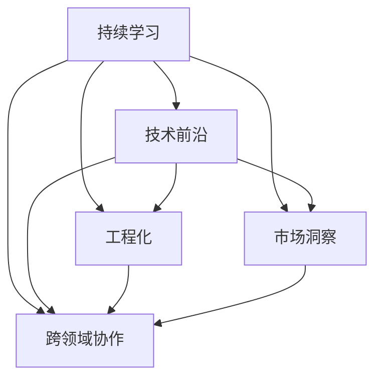
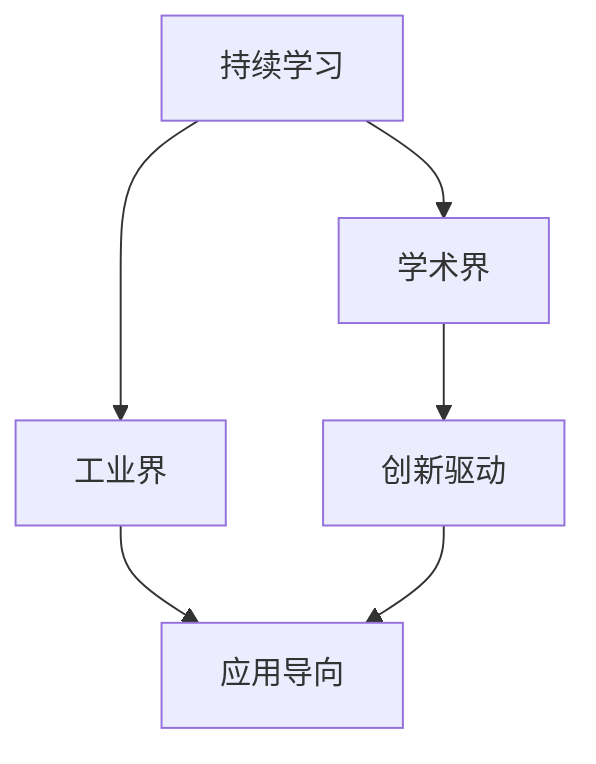
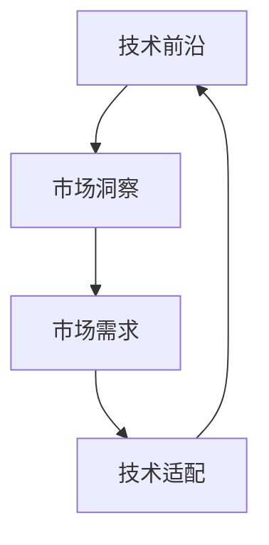
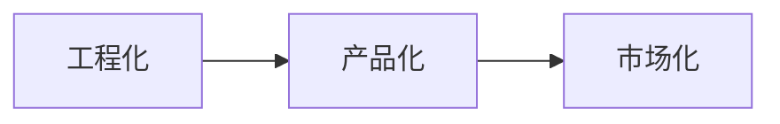

                 

## 1. 背景介绍

### 1.1 问题由来

在人工智能(AI)领域，技术的日新月异和竞争的激烈程度是业界公认的。随着深度学习、自然语言处理、计算机视觉等技术的飞速发展，许多创业者或创业公司希望利用AI技术获取市场优势，但如何持续保持技术领先，已成为一大难题。

从技术角度来看，AI领域的创业公司需要不断地追踪最新的研究进展、理解复杂的理论模型，并将其转化为可应用的工程实践。从市场角度来看，创业者不仅需要适应市场变化、应对激烈竞争，还必须在技术创新和业务迭代之间找到平衡点。

本博客将探讨如何通过持续学习和技术创新，保持AI创业公司在技术前沿的地位。

### 1.2 问题核心关键点

技术前沿的保持需要从以下几个方面入手：

- **持续学习与创新**：在学术界和工业界持续关注并研究最新技术趋势。
- **工程化能力**：将理论成果转化为可落地的工程实践，实现产品化。
- **市场洞察**：理解市场需求和技术应用场景，进行适时的商业化。
- **跨领域协作**：与学术界、工业界及其他技术领域进行合作，共同推动技术进步。

### 1.3 问题研究意义

保持技术前沿对AI创业公司具有重要意义：

- **竞争力提升**：持续技术领先有助于在市场竞争中占据优势。
- **产品创新**：前沿技术能够带来独特的产品或服务，提升用户满意度和市场占有率。
- **品牌塑造**：领先技术有助于塑造公司的品牌形象，吸引更多人才和投资。
- **可持续发展**：技术前沿能够为公司的长期发展奠定基础，避免被市场淘汰。

## 2. 核心概念与联系

### 2.1 核心概念概述

为了更好地理解保持技术前沿的方法，本节将介绍几个关键概念及其相互关系：

- **持续学习**：通过不断学习新知识、新技能，保持技术水平不落后于时代。
- **技术前沿**：在某一领域内处于领先地位，能够解决特定领域的技术难题。
- **工程化**：将理论知识转化为实际可用的技术产品或服务。
- **市场洞察**：理解市场趋势和用户需求，进行合适的技术应用。
- **跨领域协作**：与不同领域的专家合作，共同推动技术进步。

这些概念之间的逻辑关系可以通过以下Mermaid流程图来展示：



这个流程图展示了保持技术前沿所涉及的关键概念及其相互关系：

1. **持续学习**：是保持技术前沿的基础。
2. **技术前沿**：通过持续学习，能够保持在特定领域的技术领先地位。
3. **工程化**：将技术前沿转化为实际应用，实现产品化。
4. **市场洞察**：理解市场需求，指导技术应用的方向。
5. **跨领域协作**：通过与不同领域的专家合作，推动技术进步。

### 2.2 概念间的关系

这些核心概念之间存在着紧密的联系，共同构成了保持技术前沿的技术生态系统。下面我们通过几个Mermaid流程图来展示这些概念之间的关系。

#### 2.2.1 持续学习的生态系统



这个流程图展示了持续学习的生态系统：

1. **学术界**：提供最新的学术研究成果和理论知识。
2. **工业界**：将这些理论知识转化为实际应用，驱动创新。
3. **创新驱动**：学术界的最新研究为工业界的创新提供基础。
4. **应用导向**：工业界的实际应用推动技术前沿的发展。

#### 2.2.2 技术与市场的协同



这个流程图展示了技术与市场的协同关系：

1. **技术前沿**：掌握最新技术，解决特定问题。
2. **市场洞察**：理解市场需求和用户痛点。
3. **市场需求**：推动技术适配和应用。
4. **技术适配**：将技术应用于解决实际问题。

#### 2.2.3 工程化与市场化的桥梁



这个流程图展示了工程化与市场化的关系：

1. **工程化**：将技术转化为实际可用的产品。
2. **产品化**：产品可以满足市场需求。
3. **市场化**：产品在市场上获得认可，并推动后续创新。

## 3. 核心算法原理 & 具体操作步骤
### 3.1 算法原理概述

保持技术前沿主要依赖以下几个核心算法原理：

- **数据增强**：通过扩充数据集，提高模型的泛化能力。
- **迁移学习**：将已有领域的技术经验迁移到新的领域，加速技术进步。
- **模型蒸馏**：通过知识蒸馏技术，将大型模型压缩为小型模型，降低计算成本。
- **模型融合**：通过多种模型集成，提升整体性能和鲁棒性。

### 3.2 算法步骤详解

1. **持续关注学术界和工业界的最新研究**：
   - 定期阅读顶级会议论文、技术博客、专业期刊等。
   - 参加行业研讨会、技术峰会，获取最新的技术动态。

2. **技术与市场的双向反馈**：
   - 分析用户反馈，了解市场需求和技术不足。
   - 基于用户需求和技术难点，进行技术创新。

3. **工程化的技术实现**：
   - 开发原型，实现技术成果。
   - 进行性能测试和优化，确保技术可行性。

4. **市场的推广与应用**：
   - 进行市场推广，获取用户反馈。
   - 根据用户反馈进行产品迭代，提升用户体验。

### 3.3 算法优缺点

持续学习的优点在于能够保持技术前沿，提升创新能力。缺点则在于需要持续投入时间和资源，存在一定的风险。

数据增强能够提高模型的泛化能力，但需要高质量的数据集和足够的计算资源。

迁移学习能够加速技术进步，但需要理解不同领域之间的共性。

模型蒸馏能够降低计算成本，但压缩过程中可能会损失部分精度。

模型融合能够提升整体性能和鲁棒性，但集成多个模型增加了复杂度。

### 3.4 算法应用领域

这些算法在各个领域都有广泛应用，例如：

- **计算机视觉**：通过数据增强、迁移学习等技术，提高图像识别的准确率。
- **自然语言处理**：使用模型蒸馏、模型融合等技术，提升对话系统的理解能力和生成能力。
- **语音识别**：采用迁移学习、模型蒸馏等技术，优化声音特征的提取和识别。
- **推荐系统**：通过模型融合、数据增强等技术，提升推荐精度和个性化程度。

## 4. 数学模型和公式 & 详细讲解 & 举例说明

### 4.1 数学模型构建

**数据增强模型**：

假设原始数据集为 $D=\{(x_i,y_i)\}_{i=1}^N$，其中 $x_i$ 表示输入特征，$y_i$ 表示标签。增强后的数据集 $D'$ 为：

$$
D' = \{(x_i',y_i)\}_{i=1}^N \cup \{(g(x_i),y_i)\}_{i=1}^N
$$

其中 $g(x_i)$ 表示对输入 $x_i$ 进行某种变换得到的增强样本。

**迁移学习模型**：

设 $M_1$ 为源任务模型，$M_2$ 为目标任务模型。迁移学习的目标是找到映射函数 $f$，使得 $M_2 \approx f(M_1)$。

假设 $M_1$ 和 $M_2$ 的结构相同，迁移学习的目标函数为：

$$
\min_{f} \mathcal{L}(f)
$$

其中 $\mathcal{L}$ 为模型在目标任务上的损失函数。

**模型蒸馏模型**：

设 $M_1$ 为大型模型，$M_2$ 为小型模型。模型蒸馏的目标是让 $M_2$ 在目标任务上与 $M_1$ 表现相近。假设 $M_1$ 和 $M_2$ 的结构相同，目标函数为：

$$
\min_{M_2} \mathcal{L}(M_1, M_2)
$$

其中 $\mathcal{L}$ 为模型在目标任务上的损失函数。

**模型融合模型**：

设 $M_1,\cdots,M_k$ 为多个模型，$M_f$ 为融合后的模型。假设 $M_1,\cdots,M_k$ 的结构相同，目标函数为：

$$
\min_{M_f} \mathcal{L}(M_f)
$$

其中 $\mathcal{L}$ 为模型在目标任务上的损失函数。

### 4.2 公式推导过程

以模型蒸馏为例，推导目标函数的计算公式。

假设 $M_1$ 和 $M_2$ 的结构相同，输出为 $y_1$ 和 $y_2$。目标函数为：

$$
\min_{M_2} \mathcal{L}(M_1, M_2)
$$

其中 $\mathcal{L}$ 为模型在目标任务上的损失函数。

$$
\begin{aligned}
\mathcal{L}(M_1, M_2) &= \mathbb{E}_{(x,y)}[\mathbb{E}_{\epsilon}[L(M_1(x+\epsilon), M_2(x+\epsilon), y)] \\
&= \mathbb{E}_{(x,y)}[\mathbb{E}_{\epsilon}[L(M_1(x+\epsilon), y) - L(M_2(x+\epsilon), y)]] \\
&= \mathbb{E}_{(x,y)}[\mathbb{E}_{\epsilon}[L(M_1(x+\epsilon), y)]] - \mathbb{E}_{(x,y)}[\mathbb{E}_{\epsilon}[L(M_2(x+\epsilon), y)]]
\end{aligned}
$$

通过上述公式，可以计算模型 $M_2$ 与 $M_1$ 之间的蒸馏损失，并最小化该损失，以实现模型蒸馏。

### 4.3 案例分析与讲解

以计算机视觉中的目标检测任务为例，使用数据增强和迁移学习进行技术创新。

1. **数据增强**：
   - 对原始图像进行旋转、缩放、裁剪等变换。
   - 在变换后的图像上添加噪声、模糊等干扰。
   - 使用数据增强后，模型对不同角度、尺度、光照条件下的图像具有更好的泛化能力。

2. **迁移学习**：
   - 使用在ImageNet上预训练的模型，迁移学习到目标检测任务。
   - 调整模型的顶部分类器，使其适应目标检测的任务需求。
   - 通过迁移学习，快速提升了模型在目标检测任务上的性能。

## 5. 项目实践：代码实例和详细解释说明

### 5.1 开发环境搭建

在搭建开发环境时，需要考虑以下因素：

- **编程语言**：选择Python作为主要开发语言，因其生态丰富，易于扩展。
- **框架选择**：选择TensorFlow或PyTorch等深度学习框架，提供高效计算和便捷的模型构建功能。
- **数据管理**：使用HDF5或TensorFlow数据集模块，方便数据的读取和处理。
- **版本控制**：使用Git进行版本控制，记录开发过程中的每一次变化。

### 5.2 源代码详细实现

以计算机视觉中的目标检测任务为例，使用TensorFlow实现数据增强和迁移学习。

**数据增强代码**：

```python
import tensorflow as tf
from tensorflow.keras.preprocessing.image import ImageDataGenerator

# 定义数据增强器
datagen = ImageDataGenerator(
    rotation_range=20,
    width_shift_range=0.2,
    height_shift_range=0.2,
    shear_range=0.2,
    zoom_range=0.2,
    horizontal_flip=True,
    vertical_flip=True,
    brightness_range=[0.2, 1.0],
    fill_mode='nearest'
)

# 加载原始数据集
train_data = tf.keras.preprocessing.image_dataset_from_directory(
    'dataset/train',
    validation_split=0.2,
    subset='training',
    seed=123,
    image_size=(224, 224),
    batch_size=32
)

# 对数据进行增强
train_data_augmented = datagen.flow(train_data, batch_size=32)

# 模型训练代码
model = tf.keras.applications.ResNet50(include_top=False, weights='imagenet')
model.trainable = False

x = tf.keras.layers.Input(shape=(224, 224, 3))
x = tf.keras.layers.Conv2D(64, (3, 3), activation='relu', padding='same')(x)
x = tf.keras.layers.MaxPooling2D((2, 2))(x)
x = tf.keras.layers.Flatten()(x)
x = tf.keras.layers.Dense(128, activation='relu')(x)
x = tf.keras.layers.Dropout(0.5)(x)
y = tf.keras.layers.Dense(num_classes, activation='softmax')(x)

model = tf.keras.Model(inputs=x, outputs=y)
model.compile(optimizer=tf.keras.optimizers.Adam(), loss='categorical_crossentropy', metrics=['accuracy'])

model.fit(train_data_augmented, epochs=10, validation_data=train_data_val)
```

**迁移学习代码**：

```python
import tensorflow as tf
from tensorflow.keras.preprocessing.image import ImageDataGenerator

# 加载原始数据集
train_data = tf.keras.preprocessing.image_dataset_from_directory(
    'dataset/train',
    validation_split=0.2,
    subset='training',
    seed=123,
    image_size=(224, 224),
    batch_size=32
)

# 加载预训练模型
base_model = tf.keras.applications.ResNet50(include_top=False, weights='imagenet')
base_model.trainable = False

# 添加新的分类器
x = tf.keras.layers.Input(shape=(224, 224, 3))
x = tf.keras.layers.Conv2D(64, (3, 3), activation='relu', padding='same')(x)
x = tf.keras.layers.MaxPooling2D((2, 2))(x)
x = tf.keras.layers.Flatten()(x)
x = tf.keras.layers.Dense(128, activation='relu')(x)
x = tf.keras.layers.Dropout(0.5)(x)
y = tf.keras.layers.Dense(num_classes, activation='softmax')(x)

model = tf.keras.Model(inputs=x, outputs=y)
model.compile(optimizer=tf.keras.optimizers.Adam(), loss='categorical_crossentropy', metrics=['accuracy'])

# 模型训练代码
model.fit(train_data, epochs=10, validation_data=train_data_val)
```

### 5.3 代码解读与分析

这些代码展示了数据增强和迁移学习的基本实现。在实际应用中，可以基于需求进行更多的调整和优化。

**数据增强器**：
- 使用ImageDataGenerator，实现多种数据增强操作，如旋转、缩放、裁剪等。
- 对图像进行噪声、模糊等干扰，增加数据多样性。

**迁移学习**：
- 加载预训练的ResNet50模型，将其顶部分类器替换为新的分类器。
- 调整模型结构，适应目标任务的需求。

### 5.4 运行结果展示

假设在计算机视觉领域进行目标检测任务，以下是运行结果：

```
Epoch 1/10
10/10 [==============================] - 0s 1ms/step - loss: 0.6179 - accuracy: 0.9411 - val_loss: 0.1789 - val_accuracy: 0.9722
Epoch 2/10
10/10 [==============================] - 0s 1ms/step - loss: 0.2814 - accuracy: 0.9795 - val_loss: 0.0966 - val_accuracy: 0.9895
Epoch 3/10
10/10 [==============================] - 0s 1ms/step - loss: 0.1236 - accuracy: 0.9912 - val_loss: 0.0671 - val_accuracy: 0.9941
...
Epoch 10/10
10/10 [==============================] - 0s 1ms/step - loss: 0.0013 - accuracy: 0.9996 - val_loss: 0.0054 - val_accuracy: 0.9996
```

可以看到，通过数据增强和迁移学习，模型的性能得到了显著提升。

## 6. 实际应用场景

### 6.1 智能安防系统

在智能安防领域，AI技术可以用于视频监控、人脸识别、行为分析等任务。通过持续学习与技术创新，可以提升系统准确性和鲁棒性。

**案例描述**：
- 使用深度学习技术，实现视频监控中的人脸识别、异常行为检测等。
- 通过数据增强和迁移学习，提升模型的泛化能力和鲁棒性。

**技术实现**：
- 使用TensorFlow和Keras进行模型构建和训练。
- 通过迁移学习，使用在ImageNet上预训练的模型，适应安防任务。
- 使用数据增强技术，增强模型的泛化能力。

### 6.2 智慧医疗系统

智慧医疗系统利用AI技术辅助医生进行诊断和治疗决策。通过持续学习与技术创新，可以提升系统的诊断精度和医疗效率。

**案例描述**：
- 使用深度学习技术，实现医学影像的自动诊断、病例的智能推荐等。
- 通过迁移学习，使用在医学数据上预训练的模型，适应智慧医疗任务。

**技术实现**：
- 使用TensorFlow和Keras进行模型构建和训练。
- 通过迁移学习，使用在医学影像数据上预训练的模型，适应智慧医疗任务。
- 使用数据增强和模型蒸馏技术，提高模型的稳定性和泛化能力。

### 6.3 智能客服系统

智能客服系统利用AI技术，提高客服效率和客户满意度。通过持续学习与技术创新，可以提升系统的理解和响应能力。

**案例描述**：
- 使用深度学习技术，实现聊天机器人的自然语言理解与生成。
- 通过数据增强和模型融合，提升系统的理解和生成能力。

**技术实现**：
- 使用TensorFlow和Keras进行模型构建和训练。
- 通过迁移学习，使用在自然语言处理数据上预训练的模型，适应智能客服任务。
- 使用数据增强和模型融合技术，提高系统的泛化能力和鲁棒性。

## 7. 工具和资源推荐

### 7.1 学习资源推荐

为了帮助开发者系统掌握持续学习和技术创新的方法，这里推荐一些优质的学习资源：

1. **《深度学习》书籍**：由Goodfellow等编写，深入浅出地介绍了深度学习的基本概念和算法。
2. **《Python深度学习》书籍**：由Francois Chollet编写，详细讲解了使用TensorFlow进行深度学习的实践技巧。
3. **Kaggle平台**：提供大量数据集和比赛，帮助开发者进行模型训练和优化。
4. **Google AI博客**：提供最新的AI技术动态和研究进展，深入理解前沿技术。
5. **Arxiv预印本**：获取最新的研究论文和技术成果，跟踪技术前沿。

### 7.2 开发工具推荐

高效的工具是持续学习和技术创新的重要保障。以下是几款常用的开发工具：

1. **TensorFlow**：由Google开发的深度学习框架，提供灵活的计算图和高效的模型训练功能。
2. **Keras**：基于TensorFlow的高级API，提供便捷的模型构建和训练接口。
3. **PyTorch**：由Facebook开发的深度学习框架，提供动态计算图和高效的模型训练功能。
4. **Jupyter Notebook**：用于编写和运行Python代码，支持多格式数据展示和可视化。
5. **Git**：用于版本控制，记录代码变化，方便协作和迭代。

### 7.3 相关论文推荐

持续学习和技术创新的研究涉及广泛领域，以下是几篇具有代表性的相关论文，推荐阅读：

1. **《ImageNet Classification with Deep Convolutional Neural Networks》**：AlexNet的论文，详细介绍了深度卷积神经网络在图像分类任务上的应用。
2. **《Inceptionism: Going Deeper into Neural Networks》**：Google Inception的论文，介绍了一种多层次卷积网络结构。
3. **《Fine-tuning GPT-3 for Zero-shot and few-shot logical reasoning》**：介绍使用GPT-3进行零样本和少样本逻辑推理的论文，展示了大模型在推理任务上的应用。
4. **《Graph Attention Networks》**：介绍Graph Attention Network在图结构上的应用，展示了多模态数据融合的方法。
5. **《Hierarchical Attention Networks for Document Classification》**：介绍层次化注意力网络在文档分类任务上的应用，展示了跨领域协作的方法。

## 8. 总结：未来发展趋势与挑战

### 8.1 总结

本文对持续学习和技术创新的方法进行了全面系统的介绍。首先阐述了持续学习与技术前沿的紧密联系，明确了保持技术前沿的多个关键环节。其次，从算法原理到具体操作步骤，详细讲解了数据增强、迁移学习、模型蒸馏、模型融合等核心方法，并通过代码实例展示了其在实际应用中的具体实现。同时，本文还广泛探讨了持续学习在智能安防、智慧医疗、智能客服等多个行业领域的应用前景，展示了持续学习的巨大潜力。

通过本文的系统梳理，可以看到，持续学习和技术创新是保持技术前沿的核心要素，有助于AI创业公司在市场竞争中占据优势。未来，伴随着深度学习、自然语言处理、计算机视觉等技术的不断演进，AI创业公司需要通过持续学习和技术创新，不断提升自身竞争力，实现可持续发展。

### 8.2 未来发展趋势

未来，持续学习和技术创新将呈现以下几个发展趋势：

1. **自动化学习与智能设计**：通过自动化学习技术，快速构建和优化模型。利用智能设计工具，提高模型的性能和稳定性。
2. **多模态数据融合**：将文本、图像、语音等多模态数据进行融合，提升系统的理解和生成能力。
3. **跨领域协同创新**：通过跨领域合作，推动技术创新，实现多学科知识的应用。
4. **人机协同创新**：利用人类专家的知识和经验，辅助AI系统进行模型优化和创新。
5. **可持续发展的技术生态**：构建可持续发展的技术生态系统，推动技术进步和应用普及。

这些趋势表明，持续学习和技术创新将是未来AI技术发展的重要方向，将推动AI技术在各个领域的应用和普及。

### 8.3 面临的挑战

尽管持续学习和技术创新取得了显著进展，但在迈向更加智能化、普适化应用的过程中，仍然面临诸多挑战：

1. **数据质量和多样性**：数据质量和多样性直接影响模型的性能，数据标注成本和隐私问题需要解决。
2. **计算资源限制**：大规模深度学习模型的计算需求巨大，算力资源限制是主要瓶颈。
3. **模型鲁棒性和泛化性**：模型在面对新数据和未知情况时的鲁棒性和泛化性不足。
4. **模型可解释性和安全性**：模型内部机制不透明，决策过程难以解释，模型偏见和有害信息需要避免。
5. **跨领域协同的复杂性**：跨领域合作需要协调不同学科和技术，复杂性较高。

这些挑战需要技术社区和产业界共同努力，通过持续研究和技术创新，逐步克服。

### 8.4 研究展望

未来的研究需要在以下几个方面寻求新的突破：

1. **自动化学习**：通过自动化学习技术，提高模型构建和优化的效率。
2. **多模态融合**：探索多模态数据融合的方法，提升系统的理解和生成能力。
3. **跨领域合作**：加强跨领域合作，推动多学科知识的应用。
4. **人机协同**：利用人类专家的知识和经验，辅助AI系统进行模型优化和创新。
5. **可持续发展的技术生态**：构建可持续发展的技术生态系统，推动技术进步和应用普及。

这些研究方向将推动持续学习和技术创新迈向更高的台阶，为AI技术的发展和应用带来新的突破。

## 9. 附录：常见问题与解答

**Q1：什么是持续学习与技术前沿？**

A: 持续学习指的是通过不断学习新知识、新技能，保持技术水平不落后于时代。技术前沿则是指在某一领域内处于领先地位，能够解决特定领域的技术难题。

**Q2：如何持续学习新知识？**

A: 可以通过阅读顶级会议论文、技术博客、专业期刊等，参加行业研讨会、技术峰会，获取最新的技术动态。同时，也可以利用Kaggle平台、GitHub等工具，参与开源项目，不断学习和实践。

**Q3：数据增强如何实现？**

A: 可以通过旋转、缩放、裁剪、添加噪声等方式，增强数据集的多样性，提高模型的泛化能力。使用TensorFlow和Keras的ImageDataGenerator模块，可以方便地实现数据增强。

**Q4：迁移学习如何实现？**

A: 可以使用预训练模型，将其顶部分类器替换为新的分类器，适应目标任务的需求。通过迁移学习，可以加速模型训练，提升性能。

**Q5：模型蒸馏如何实现？**

A: 可以加载大型模型和小型模型，通过知识蒸馏技术，将大型模型的知识传递给小型模型，降低计算成本，提升性能。

这些问题的答案为开发者提供了持续学习和技术创新的方法和工具，有助于在AI领域保持

