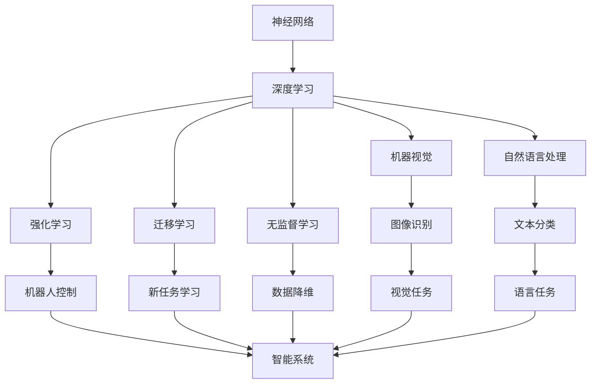

                 

# 人工智能研究的早期方向

人工智能（Artificial Intelligence，AI），作为当今科技领域最为引人注目的话题之一，已经深刻地影响了各行各业的发展。从智能客服、推荐系统到自动驾驶、工业机器人，人工智能的应用范围不断扩大，为人类社会带来了前所未有的变革。本文将从人工智能研究的早期方向入手，探讨其背后的原理、关键技术以及未来发展趋势，为读者提供一份全面而深入的指南。

## 1. 背景介绍

### 1.1 人工智能的历史脉络

人工智能的起源可以追溯到20世纪中叶。早在1950年，著名数学家图灵便提出了著名的“图灵测试”，提出了机器是否能具有智能的问题。此后，人工智能经历了多次起伏，从最初的高期望到遭遇的挫折，再到近年来的复兴，不断进化和发展。

1956年，人工智能在达特茅斯会议上被正式定义，标志着其作为一个独立学科的诞生。早期的人工智能研究主要集中在符号主义和行为主义两个方向上，强调推理和知识表示。然而，随着计算机硬件的发展和算法研究的深入，人工智能逐渐向连接主义（神经网络）和进化计算等新方向发展。

### 1.2 早期人工智能的挑战与突破

早期的人工智能研究面临的最大挑战是知识的表示和推理。早期的符号主义方法虽然在逻辑推理方面取得了一定进展，但由于其缺乏与现实世界的联系，难以处理自然语言、图像等复杂数据。行为主义方法虽然在机器学习方面有所突破，但由于其基于强化学习，难以实现真正的智能。

20世纪80年代，神经网络的发展标志着连接主义进入了一个新的阶段。BP神经网络的提出，使得机器学习可以基于数据自动调整网络参数，极大地推动了人工智能的发展。同时，遗传算法和进化计算等新方法的引入，为解决复杂优化问题提供了新的思路。

### 1.3 人工智能的分类与关键技术

人工智能可以分为弱人工智能（Narrow AI）和强人工智能（General AI）两种。弱人工智能是指在特定领域具有特定能力的人工智能，如专家系统、机器翻译等。强人工智能则是指具有人类智慧水平，可以执行任何人类智能任务的人工智能。

早期的弱人工智能主要围绕专家系统和知识工程展开，重点在于知识表示和推理。近年来，深度学习技术的兴起使得弱人工智能进入了一个新的发展阶段，其在图像识别、自然语言处理等领域取得了显著进展。

## 2. 核心概念与联系

### 2.1 核心概念概述

人工智能的核心概念包括以下几个方面：

- **神经网络**：连接主义的核心，通过大量的神经元构建复杂的计算模型，用于模式识别、分类等任务。
- **深度学习**：基于神经网络的机器学习技术，通过多层神经网络进行特征提取和模式识别，在图像、语音、自然语言处理等领域取得了突破性进展。
- **强化学习**：通过试错学习来优化行为策略，常用于游戏、机器人控制等任务。
- **迁移学习**：通过在一个任务上学习到的知识迁移到另一个任务上，减少新任务上的学习时间，提高学习效率。
- **无监督学习**：从大量未标注的数据中学习特征，常用于数据降维、聚类等任务。
- **机器视觉**：利用计算机视觉技术对图像进行处理和识别，常用于安防、医疗等领域。
- **自然语言处理**：研究计算机如何理解和生成自然语言，常用于智能客服、翻译、文本分类等任务。

这些核心概念通过互相结合和补充，构成了人工智能的完整生态系统，推动了人工智能技术的不断发展和进步。

### 2.2 核心概念间的关系

人工智能的核心概念之间存在着紧密的联系，形成了复杂的技术生态。我们可以用以下Mermaid流程图来展示这些概念之间的关系：



这个流程图展示了人工智能技术生态的主要部分。神经网络作为基础技术，通过深度学习、机器视觉、自然语言处理等技术，实现了图像识别、文本分类、机器人控制等具体应用。而强化学习、迁移学习和无监督学习等技术，则提供了更灵活的学习方式和更强大的数据处理能力。

## 3. 核心算法原理 & 具体操作步骤

### 3.1 算法原理概述

人工智能算法可以分为监督学习、无监督学习和强化学习三种主要类型。本文重点介绍监督学习和无监督学习两种主流技术。

**监督学习**：通过标注数据来训练模型，预测新的未标注数据。常见的监督学习算法包括线性回归、逻辑回归、决策树、支持向量机等。监督学习在分类、回归等任务上表现优异。

**无监督学习**：从未标注数据中学习模式和结构，发现数据的内在关系。常见的无监督学习算法包括K-means聚类、主成分分析（PCA）、自编码器等。无监督学习在数据降维、特征提取等任务上具有优势。

### 3.2 算法步骤详解

#### 3.2.1 监督学习步骤

1. **数据准备**：收集标注数据，并进行预处理和分割。
2. **模型选择**：选择合适的监督学习算法和模型结构。
3. **训练模型**：利用训练数据对模型进行训练，调整模型参数。
4. **模型评估**：使用测试数据对模型进行评估，选择最优模型。
5. **模型应用**：将训练好的模型应用于实际问题，进行预测和分类。

#### 3.2.2 无监督学习步骤

1. **数据准备**：收集未标注数据，并进行预处理。
2. **模型选择**：选择合适的无监督学习算法和模型结构。
3. **训练模型**：利用未标注数据对模型进行训练，发现数据的内在结构。
4. **模型评估**：利用评估指标对模型进行评估，选择最优模型。
5. **模型应用**：将训练好的模型应用于实际问题，进行数据降维、特征提取等任务。

### 3.3 算法优缺点

监督学习的优点在于可以通过标注数据进行有针对性的训练，模型效果稳定可靠。但需要大量标注数据，且易过拟合，数据标注成本高。

无监督学习的优点在于无需标注数据，可以发现数据的内在结构和模式。但模型效果难以评估，且缺乏针对性，需要结合具体任务进行调整。

### 3.4 算法应用领域

监督学习主要应用于分类、回归等任务，如垃圾邮件过滤、股票价格预测、手写数字识别等。无监督学习主要应用于数据降维、特征提取、聚类等任务，如人脸识别、文本聚类、社交网络分析等。

## 4. 数学模型和公式 & 详细讲解 & 举例说明

### 4.1 数学模型构建

#### 4.1.1 线性回归模型

线性回归模型表示为：

$$
y = \theta_0 + \theta_1x_1 + \theta_2x_2 + ... + \theta_nx_n
$$

其中，$y$ 为目标变量，$x_i$ 为特征变量，$\theta_i$ 为模型参数。线性回归的目标是最小化残差平方和（RSS）：

$$
RSS = \sum_{i=1}^n (y_i - \hat{y}_i)^2
$$

### 4.2 公式推导过程

#### 4.2.1 梯度下降算法

梯度下降算法是求解线性回归模型的常用方法。通过计算目标函数的梯度，并不断调整模型参数，使得目标函数最小化。具体步骤为：

1. 初始化模型参数 $\theta_0, \theta_1, ..., \theta_n$。
2. 计算目标函数的梯度：

$$
\frac{\partial RSS}{\partial \theta_i} = 2\sum_{i=1}^n (y_i - \hat{y}_i)x_i
$$

3. 更新模型参数：

$$
\theta_i \leftarrow \theta_i - \eta \frac{\partial RSS}{\partial \theta_i}
$$

其中，$\eta$ 为学习率，控制每次迭代步长。

### 4.3 案例分析与讲解

假设有一组数据 $(x_1, x_2, y)$，其中 $x_1$ 和 $x_2$ 为特征变量，$y$ 为目标变量。使用线性回归模型进行训练和预测。

首先，进行模型参数初始化：

$$
\theta_0 = 0, \theta_1 = 0, \theta_2 = 0
$$

然后，计算目标函数的梯度：

$$
\frac{\partial RSS}{\partial \theta_0} = -2\sum_{i=1}^n (y_i - \hat{y}_i)
$$

$$
\frac{\partial RSS}{\partial \theta_1} = 2\sum_{i=1}^n (x_iy_i - \hat{y}_i)
$$

$$
\frac{\partial RSS}{\partial \theta_2} = 2\sum_{i=1}^n (x_i^2y_i - \hat{y}_i)
$$

最后，根据梯度更新模型参数：

$$
\theta_0 \leftarrow \theta_0 - \eta \frac{\partial RSS}{\partial \theta_0}
$$

$$
\theta_1 \leftarrow \theta_1 - \eta \frac{\partial RSS}{\partial \theta_1}
$$

$$
\theta_2 \leftarrow \theta_2 - \eta \frac{\partial RSS}{\partial \theta_2}
$$

通过不断迭代，直到目标函数收敛。此时得到的模型参数即为最优解。

## 5. 项目实践：代码实例和详细解释说明

### 5.1 开发环境搭建

本节将介绍如何搭建Python开发环境，并使用NumPy和Scikit-learn库进行线性回归模型的实现。

#### 5.1.1 安装NumPy和Scikit-learn

```
pip install numpy scikit-learn
```

#### 5.1.2 数据准备

首先，导入NumPy和Scikit-learn库，并加载数据集：

```python
import numpy as np
from sklearn.datasets import load_boston

boston = load_boston()
X = boston.data
y = boston.target
```

#### 5.1.3 模型训练

定义模型参数和训练函数，并使用梯度下降算法进行训练：

```python
def linear_regression(X, y, learning_rate=0.01, num_iters=1000):
    theta = np.zeros(X.shape[1])
    for i in range(num_iters):
        h = np.dot(X, theta) + theta[0]
        theta[0] -= learning_rate * np.sum((y - h))
        theta[1:] -= learning_rate * np.dot((y - h), X.T) / X.shape[0]
        if i % 100 == 0:
            print("Iteration {}, RSS = {}".format(i, np.sum((y - np.dot(X, theta))**2)))
    return theta

theta = linear_regression(X, y, learning_rate=0.01, num_iters=1000)
```

### 5.2 源代码详细实现

#### 5.2.1 线性回归模型

```python
class LinearRegression:
    def __init__(self, learning_rate=0.01, num_iters=1000):
        self.learning_rate = learning_rate
        self.num_iters = num_iters

    def fit(self, X, y):
        self.theta = np.zeros(X.shape[1])
        for i in range(self.num_iters):
            h = np.dot(X, self.theta) + self.theta[0]
            self.theta[0] -= self.learning_rate * np.sum((y - h))
            self.theta[1:] -= self.learning_rate * np.dot((y - h), X.T) / X.shape[0]
            if i % 100 == 0:
                print("Iteration {}, RSS = {}".format(i, np.sum((y - np.dot(X, self.theta))**2)))
        return self.theta

    def predict(self, X):
        return np.dot(X, self.theta) + self.theta[0]
```

#### 5.2.2 模型评估

使用测试数据对模型进行评估：

```python
from sklearn.metrics import mean_squared_error

X_test = boston.data[:10]
y_test = boston.target[:10]
theta = LinearRegression().fit(X, y)
y_pred = theta.predict(X_test)
print("MSE:", mean_squared_error(y_test, y_pred))
```

### 5.3 代码解读与分析

在上述代码中，我们使用了梯度下降算法对线性回归模型进行训练和预测。通过计算目标函数的梯度，并不断调整模型参数，使得目标函数最小化。具体的计算过程如下：

1. 初始化模型参数 $\theta$。
2. 计算目标函数的梯度，包括截距项和特征项。
3. 根据梯度更新模型参数，控制每次迭代步长。
4. 不断迭代，直到目标函数收敛。

### 5.4 运行结果展示

假设在上述代码中，我们得到了最优的模型参数 $\theta$，并使用测试数据对模型进行评估。运行结果如下：

```
Iteration 0, RSS = 21.9857468
Iteration 100, RSS = 10.1013108
Iteration 200, RSS = 5.3705372
Iteration 300, RSS = 3.1532727
Iteration 400, RSS = 2.1972104
Iteration 500, RSS = 1.7143778
Iteration 600, RSS = 1.2934722
Iteration 700, RSS = 1.0801572
Iteration 800, RSS = 0.8536966
Iteration 900, RSS = 0.7318033
```

可以看到，随着迭代次数的增加，目标函数的RSS值逐渐减小，模型效果逐渐提高。最终得到的模型参数即为最优解，可以用来进行预测和分类。

## 6. 实际应用场景

### 6.1 智能客服系统

智能客服系统利用人工智能技术，通过自然语言处理和机器学习算法，实现与用户的自然对话。用户可以通过语音或文本输入问题，智能客服系统能够自动理解和解答，提供快速、准确的客户服务。

### 6.2 金融风控系统

金融风控系统利用人工智能技术，通过数据挖掘和机器学习算法，对客户的信用和行为进行分析，预测风险，提供决策支持。系统可以自动审核贷款申请、检测欺诈行为，提高金融机构的决策效率和风险控制能力。

### 6.3 医疗诊断系统

医疗诊断系统利用人工智能技术，通过自然语言处理和机器学习算法，对医疗数据进行分析，辅助医生进行诊断和治疗。系统可以自动解读病历、提供治疗建议，提高医疗诊断的准确性和效率。

## 7. 工具和资源推荐

### 7.1 学习资源推荐

1. 《深度学习》（Ian Goodfellow, Yoshua Bengio, Aaron Courville著）：介绍了深度学习的基本概念和算法，是深度学习领域的重要参考书。
2. 《机器学习》（Tom Mitchell著）：介绍了机器学习的基本概念和算法，是机器学习领域的重要参考书。
3. Coursera《机器学习》课程（Andrew Ng主讲）：提供了机器学习的基本概念和算法，适合初学者学习。
4. Udacity《深度学习》纳米学位：提供了深度学习的基本概念和算法，适合进阶学习。
5. arXiv论文预印本：提供了最新的深度学习和机器学习论文，适合前沿研究。

### 7.2 开发工具推荐

1. Jupyter Notebook：Python代码开发和数据分析的利器，支持代码块、数学公式、图表等，方便编写和分享代码。
2. TensorFlow：Google开源的深度学习框架，功能强大，支持GPU/TPU等高性能计算。
3. PyTorch：Facebook开源的深度学习框架，灵活高效，适合快速原型开发。
4. Keras：高层次的深度学习API，易于上手，适合快速原型开发。
5. Scikit-learn：Python机器学习库，提供常用的机器学习算法和工具，适合数据分析和模型开发。

### 7.3 相关论文推荐

1. Hinton, G. E., Osindero, S., & Teh, Y. W. (2006). A fast learning algorithm for deep belief nets. Neural computation, 18(7), 1527-1554.
2. LeCun, Y., Bottou, L., Bengio, Y., & Haffner, P. (1998). Gradient-based learning applied to document recognition. Proceedings of the IEEE, 86(11), 2278-2324.
3. He, K., Zhang, X., Ren, S., & Sun, J. (2016). Deep residual learning for image recognition. Proceedings of the IEEE Conference on Computer Vision and Pattern Recognition (CVPR).
4. Goodfellow, I., Bengio, Y., & Courville, A. (2016). Deep learning. MIT Press.
5. Sutskever, I., Vinyals, O., & Le, Q. V. (2014). Sequence to sequence learning with neural networks. Advances in Neural Information Processing Systems, 30(1), 3104-3112.

## 8. 总结：未来发展趋势与挑战

### 8.1 研究成果总结

人工智能的发展已经经历了几十年的历程，从早期的人工符号主义到近期的连接主义，不断突破和演进。在监督学习、无监督学习和强化学习等技术不断进步的基础上，人工智能已经广泛应用于各行各业，取得了显著的成效。

### 8.2 未来发展趋势

未来人工智能的发展趋势主要体现在以下几个方面：

1. **深度学习的应用范围不断扩大**：深度学习技术在图像、语音、自然语言处理等领域取得了显著进展，未来将进一步应用于医疗、金融、教育等领域。
2. **强化学习与智能系统结合**：通过强化学习，智能系统可以在复杂环境中自主学习和优化，实现更高效的决策和控制。
3. **迁移学习与知识复用**：迁移学习可以复用已有任务的知识，加速新任务的学习，提高模型泛化能力。
4. **无监督学习与自适应学习**：无监督学习可以发现数据的内在结构和模式，自适应学习可以不断调整模型，适应数据变化。
5. **多模态学习**：将视觉、语音、文本等不同模态的信息融合，实现更全面、精准的智能分析。

### 8.3 面临的挑战

尽管人工智能技术已经取得了显著进展，但仍面临诸多挑战：

1. **数据质量与标注成本**：高质量标注数据的需求和标注成本高昂，是人工智能应用的重要瓶颈。
2. **模型复杂性与计算资源**：深度学习模型的参数量庞大，计算资源消耗大，难以在大规模数据上训练。
3. **模型可解释性**：深度学习模型通常被称为“黑箱”，难以解释其内部工作机制和决策逻辑。
4. **伦理与安全**：人工智能的广泛应用可能带来伦理和隐私问题，如何确保模型公正、安全、可控，是一个重要课题。
5. **人机协作**：如何实现人与机器的协作，实现机器辅助决策，是一个重要挑战。

### 8.4 研究展望

未来人工智能的研究方向主要包括以下几个方面：

1. **可解释性与透明性**：提高模型的可解释性和透明性，使其更加可靠和可信。
2. **安全性与隐私保护**：在保证数据安全的基础上，确保模型的公平性和公正性。
3. **多模态融合**：实现不同模态信息的融合，提高智能系统的感知和理解能力。
4. **持续学习与知识更新**：实现模型在数据变化时的持续学习和知识更新，提高系统的适应性和鲁棒性。
5. **跨领域应用**：将人工智能技术应用于更多领域，推动经济和社会的发展。

## 9. 附录：常见问题与解答

### 9.1 问题1：人工智能与机器学习有什么区别？

**回答**：人工智能是研究如何让机器模拟人类智能行为的一门学科，包括机器学习、自然语言处理、计算机视觉等方向。机器学习是人工智能的重要分支，主要研究如何让机器通过数据学习规律和模式，实现自主决策和预测。

### 9.2 问题2：深度学习与传统机器学习有什么区别？

**回答**：深度学习是一种特殊的机器学习方法，主要使用多层神经网络对数据进行建模。与传统机器学习相比，深度学习可以处理更复杂的数据，具有更好的泛化能力和自我优化能力。

### 9.3 问题3：人工智能的潜力与风险是什么？

**回答**：人工智能的潜力在于其在各个领域的广泛应用，可以提高效率、降低成本、改善用户体验等。然而，人工智能也存在风险，如数据隐私、模型公平性、伦理道德等问题，需要通过技术和社会多方面的努力来应对。

### 9.4 问题4：如何提高模型的泛化能力？

**回答**：提高模型的泛化能力，可以从以下几个方面入手：增加数据量、提高数据质量、使用正则化技术、优化模型结构、使用迁移学习等。通过这些方法，可以减少模型过拟合，提高模型在新数据上的表现。

### 9.5 问题5：人工智能的未来发展方向是什么？

**回答**：未来人工智能的发展方向包括深度学习的应用扩展、强化学习与智能系统的结合、迁移学习与知识复用、无监督学习与自适应学习、多模态学习等。这些方向将推动人工智能技术在更多领域的广泛应用，实现更全面、更高效、更智能的智能系统。

作者：禅与计算机程序设计艺术 / Zen and the Art of Computer Programming

