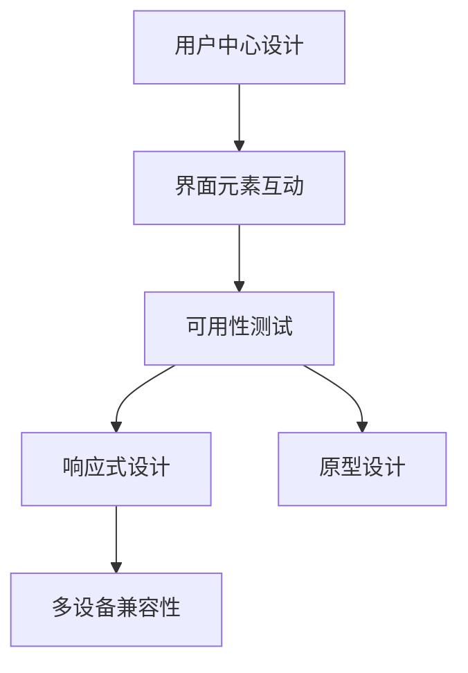

                 

# 人机交互与用户界面设计原理与代码实战案例讲解

> 关键词：人机交互, 用户界面设计, 界面交互, UI/UX, 原型设计, 用户体验, 代码实现, 交互设计

## 1. 背景介绍

### 1.1 问题由来

随着信息技术的发展，人类与计算机的交互方式日益多样。从最初的命令行到图形化界面，再到触屏、语音、虚拟现实等新型交互方式，人机交互技术不断革新，极大地提升了用户体验。然而，交互设计的复杂性和多样性也带来了新的挑战。如何设计出高效、易用、美观的界面，如何让界面元素与用户产生互动，如何处理不同设备的兼容性问题，成为了界面设计师和开发人员需要共同探讨的问题。

### 1.2 问题核心关键点

人机交互设计（HCI）的核心关键点在于：

1. **用户中心设计**：以用户需求和行为为基础，通过调研、分析、测试等方法，确定用户的使用场景和心理预期。
2. **界面元素互动**：合理设计界面元素（如按钮、滑块、文本框等）的位置、大小、颜色和动画效果，使界面元素能够以自然、流畅的方式与用户互动。
3. **多设备兼容性**：确保界面在不同操作系统、不同设备上的可用性和一致性，满足移动端和桌面端用户的需求。
4. **可用性测试**：通过用户测试和反馈，不断迭代和优化界面设计，提升用户的满意度和使用效率。

### 1.3 问题研究意义

人机交互与用户界面设计在信息技术和产品开发中具有重要意义：

1. **提升用户体验**：合理的界面设计和交互方式，能极大提升用户的使用体验，增加用户黏性。
2. **提高工作效率**：界面设计的优化能显著提高用户的操作效率，减少操作负担。
3. **增强产品竞争力**：良好的界面设计和用户体验，能提升产品的市场竞争力和用户口碑。
4. **推动创新发展**：不断探索和创新交互方式，能促进技术进步和产业升级。

## 2. 核心概念与联系

### 2.1 核心概念概述

为了更好地理解人机交互与用户界面设计，我们需要掌握以下几个核心概念：

- **用户中心设计**：以用户需求为核心，通过调研和分析，设计出符合用户心理预期的界面。
- **界面元素互动**：设计合理的界面元素，确保其与用户互动的自然性和流畅性。
- **多设备兼容性**：确保界面在不同设备上的可用性和一致性，满足不同用户的需求。
- **可用性测试**：通过用户测试和反馈，不断优化界面设计，提升用户体验。
- **响应式设计**：通过灵活的设计和技术手段，确保界面在不同屏幕大小和分辨率下的适应性。
- **原型设计**：创建界面设计的初步模型，帮助设计师快速迭代和验证设计思路。

这些概念之间的关系可以通过以下Mermaid流程图来展示：



### 2.2 概念间的关系

这些核心概念之间存在着紧密的联系，形成了人机交互与用户界面设计的完整生态系统。下面我通过几个Mermaid流程图来展示这些概念之间的关系。

#### 2.2.1 设计流程


这个流程图展示了用户中心设计的基本流程，从调研和分析到设计、测试、反馈和优化，直至最终设计完成。

#### 2.2.2 界面元素设计


这个流程图展示了界面元素设计的过程，从位置和大小到颜色和风格，再到动画效果和可用性测试，每个环节都需要精心设计和验证。

#### 2.2.3 响应式设计


这个流程图展示了响应式设计的关键点，即在不同设备和分辨率下确保界面的可读性和可用性。

## 3. 核心算法原理 & 具体操作步骤
### 3.1 算法原理概述

人机交互与用户界面设计主要依赖于心理模型、认知理论和用户研究等基础理论，通过一系列技术和工具实现。其核心算法原理包括：

- **认知负荷理论**：用户在完成任务时，需要承受一定的认知负荷，界面设计的目标是减少用户的认知负荷，提升操作效率。
- **可用性模型**：通过可用性模型（如Nielsen的10个可用性原则），指导界面设计，确保用户界面的高效和易用性。
- **用户研究方法**：通过问卷调查、用户访谈、用户测试等方法，收集用户反馈，验证设计方案。

### 3.2 算法步骤详解

人机交互与用户界面设计的具体操作步骤如下：

1. **调研和分析**：通过问卷调查、用户访谈、数据分析等方法，了解用户需求和使用场景，确定设计方向。
2. **设计初步方案**：基于调研结果，创建初步的界面设计方案，包括界面布局、元素选择和交互方式等。
3. **原型设计**：使用工具如Axure、Sketch等创建原型，展示界面设计的初步想法。
4. **可用性测试**：通过用户测试，收集反馈，评估界面设计的可用性和用户体验。
5. **迭代优化**：根据测试结果和用户反馈，不断迭代和优化设计方案。
6. **最终设计**：将优化后的设计方案转化为最终的高保真原型或产品原型。

### 3.3 算法优缺点

人机交互与用户界面设计方法具有以下优点：

- **用户中心**：以用户需求为核心，设计出符合用户心理预期的界面。
- **高效易用**：通过科学的设计方法和工具，提高界面的可用性和用户体验。
- **适应性强**：通过响应式设计，确保界面在不同设备上的可用性和一致性。

同时，该方法也存在一定的局限性：

- **复杂度较高**：涉及多个环节和多个角色的协作，设计过程复杂。
- **成本较高**：设计和测试阶段需要投入较多资源，特别是大型项目。
- **依赖数据**：设计过程中依赖大量的用户数据和测试结果，数据质量和数量直接影响设计效果。

### 3.4 算法应用领域

人机交互与用户界面设计广泛应用于各个领域，例如：

- **移动应用设计**：设计出适合移动设备使用的界面，提升移动应用的用户体验。
- **Web应用设计**：创建响应式设计，确保界面在不同设备和浏览器上的一致性。
- **企业内部系统**：设计高效易用的企业内部系统界面，提升员工的工作效率和满意度。
- **产品设计**：从概念设计到原型设计，再到最终的产品设计，全流程涉及人机交互与用户界面设计。
- **游戏设计**：设计游戏界面和交互方式，提升游戏的用户体验和可玩性。

## 4. 数学模型和公式 & 详细讲解 & 举例说明

### 4.1 数学模型构建

人机交互与用户界面设计涉及多个学科，包括心理学、认知科学、人机工程等，因此构建数学模型较为复杂。以下简要介绍一个基本的数学模型：

设用户对界面的认知负荷为 $C$，界面元素的数量为 $N$，用户的认知负荷与界面元素数量之间的关系可以表示为：

$$
C = f(N)
$$

其中 $f$ 为认知负荷函数，其具体形式需要根据实际研究和测试确定。通过优化界面元素数量和设计，可以降低用户认知负荷，提升操作效率。

### 4.2 公式推导过程

以用户测试为例，我们通过以下公式计算界面设计的评分：

$$
Score = \sum_{i=1}^N x_iy_i
$$

其中 $x_i$ 为用户对第 $i$ 个元素的评分，$y_i$ 为该元素在界面中的权重。通过计算每个元素的评分和权重，可以综合评估界面设计的用户体验。

### 4.3 案例分析与讲解

以一个简单的购物网站为例，分析其界面设计和交互方式：

- **页面布局**：合理布局商品列表和分类菜单，确保用户可以快速找到所需商品。
- **按钮设计**：使用明显的按钮颜色和文字，确保用户能够轻松点击按钮。
- **搜索功能**：提供高效的搜索功能，确保用户能够快速找到所需商品。
- **订单管理**：设计直观的订单管理界面，方便用户查看和管理订单。
- **响应式设计**：确保网站在不同设备和屏幕尺寸下的可用性。

## 5. 项目实践：代码实例和详细解释说明
### 5.1 开发环境搭建

在进行界面设计实践前，我们需要准备好开发环境。以下是使用HTML、CSS和JavaScript进行前端开发的环境配置流程：

1. 安装Node.js和npm：从官网下载并安装Node.js，npm作为Node.js的包管理器。
2. 创建和进入项目目录：
```bash
mkdir myproject
cd myproject
```
3. 初始化项目：
```bash
npm init -y
```
4. 安装前端开发工具：
```bash
npm install -g npx
npm install -g @babel/cli
npm install @babel/core @babel/preset-env @babel/preset-react @babel/preset-flow @babel/preset-typescript
```
5. 创建React应用：
```bash
npx create-react-app myapp
cd myapp
```

完成上述步骤后，即可在myapp目录中开始界面设计实践。

### 5.2 源代码详细实现

以下是一个简单的React组件实现，展示如何创建界面元素和进行基本交互：

```javascript
import React, { useState } from 'react';

function Button(props) {
    const [pressed, setPressed] = useState(false);
    
    function handleClick() {
        setPressed(!pressed);
        console.log('Button clicked');
    }
    
    return (
        <button onClick={handleClick} style={{ backgroundColor: pressed ? 'red' : 'green' }}>
            {props.label}
        </button>
    );
}

export default Button;
```

这个Button组件实现了点击按钮时背景颜色变化，并在控制台输出日志。

### 5.3 代码解读与分析

以下是关键代码的实现细节：

**useState**：使用React的useState钩子管理组件状态，初始值为false，表示按钮未被点击。

**handleClick**：当按钮被点击时，调用handleClick函数更新状态并输出日志。

**style**：使用JSX语法设置按钮样式，当按钮被点击时，背景颜色变为红色，未被点击时变为绿色。

通过上述代码，我们展示了一个简单的按钮组件，并通过useState和JSX语法实现了交互功能。

### 5.4 运行结果展示

假设在myapp目录中创建了一个App组件，展示多个Button组件的组合使用：

```javascript
import React from 'react';
import Button from './Button';

function App() {
    return (
        <div>
            <Button label="Button 1" />
            <Button label="Button 2" />
            <Button label="Button 3" />
        </div>
    );
}

export default App;
```

运行应用后，点击各个按钮，可以在控制台看到点击日志，同时按钮背景颜色也会根据点击状态变化。

## 6. 实际应用场景

### 6.1 移动应用设计

移动应用的设计需要考虑屏幕尺寸、触控操作等特性，通过合理设计界面元素和交互方式，提升用户的体验。例如，设计一个简单的购物应用，用户可以通过滑动屏幕浏览商品，点击商品进入详情页，完成购买操作。

### 6.2 Web应用设计

Web应用的设计需要考虑浏览器兼容性和响应式设计，通过灵活的布局和样式，确保界面在不同设备和屏幕尺寸下的可用性。例如，设计一个在线教育平台，通过响应式设计，确保学生在不同设备上都能方便地访问课程和学习材料。

### 6.3 企业内部系统

企业内部系统的设计需要考虑员工的使用习惯和工作流程，通过界面元素和交互方式的设计，提升员工的工作效率和满意度。例如，设计一个项目管理工具，通过合理的界面布局和交互方式，方便员工查看和管理项目任务。

### 6.4 产品设计

产品设计从概念设计到原型设计，再到最终的产品设计，全流程涉及人机交互与用户界面设计。例如，设计一款智能家居设备，通过合理的界面设计和交互方式，提升用户的使用体验和设备操作的便捷性。

### 6.5 游戏设计

游戏设计需要考虑玩家的交互体验和游戏乐趣，通过界面元素和交互方式的设计，提升游戏的可玩性和用户体验。例如，设计一款解谜游戏，通过合理的界面设计和交互方式，引导玩家完成游戏任务。

## 7. 工具和资源推荐
### 7.1 学习资源推荐

为了帮助开发者系统掌握人机交互与用户界面设计，这里推荐一些优质的学习资源：

1. **《设计心理学》**：Douglas Engelbregt-Dijksterhuis所著，全面介绍了设计心理学的基本原理和方法，适合初学者和进阶开发者阅读。
2. **《UI设计的艺术》**：by Steve Krug，讲述了用户界面设计的基本原则和技巧，适合需要提升设计水平的设计师和开发者阅读。
3. **《响应式Web设计》**：by Ethan Marcotte，介绍了响应式设计的原理和实现方法，适合需要设计响应式界面的设计师和开发者阅读。
4. **《React官方文档》**：官方文档详细介绍了React的API和最佳实践，适合使用React进行前端开发的设计师和开发者阅读。
5. **《UX设计指南》**：by Nielsen Norman Group，提供了大量的UX设计案例和实用工具，适合需要提升设计水平的设计师和开发者阅读。

通过对这些资源的学习实践，相信你一定能够快速掌握人机交互与用户界面设计的精髓，并用于解决实际的UI/UX问题。

### 7.2 开发工具推荐

高效的开发离不开优秀的工具支持。以下是几款用于前端界面设计和交互开发的常用工具：

1. **Sketch**：界面设计工具，支持组件化设计和协作，适合设计师使用。
2. **Axure**：原型设计工具，支持快速创建原型和互动效果，适合设计师和开发者使用。
3. **Adobe XD**：全流程设计工具，支持设计、原型和交互设计，适合设计师使用。
4. **Figma**：协作设计工具，支持实时编辑和版本控制，适合设计师和开发者协作使用。
5. **React Native**：跨平台开发框架，支持在移动设备上创建原生应用，适合开发者使用。

合理利用这些工具，可以显著提升界面设计的开发效率，加快创新迭代的步伐。

### 7.3 相关论文推荐

人机交互与用户界面设计领域的研究在不断深入，以下是几篇奠基性的相关论文，推荐阅读：

1. **《交互设计原理》**：by Bill C. Brodsky，详细介绍了交互设计的基本原理和方法，适合设计初学者阅读。
2. **《UX设计案例分析》**：by Jennifer V. Krush，通过大量实际案例分析，展示了优秀的UI/UX设计经验，适合需要提升设计水平的设计师和开发者阅读。
3. **《响应式Web设计的最佳实践》**：by Lisa Seemingly Jordan，介绍了响应式设计的最佳实践和实用技巧，适合需要设计响应式界面的设计师和开发者阅读。

这些论文代表了大语言模型微调技术的发展脉络。通过学习这些前沿成果，可以帮助研究者把握学科前进方向，激发更多的创新灵感。

除上述资源外，还有一些值得关注的前沿资源，帮助开发者紧跟人机交互与用户界面设计的最新进展，例如：

1. **arXiv论文预印本**：人工智能领域最新研究成果的发布平台，包括大量尚未发表的前沿工作，学习前沿技术的必读资源。
2. **业界技术博客**：如Google UI、Microsoft UX、Apple Human Interface Guidelines等顶尖实验室的官方博客，第一时间分享他们的最新研究成果和洞见。
3. **技术会议直播**：如UIUX、UXPA、HCI等人工智能领域顶会现场或在线直播，能够聆听到大佬们的前沿分享，开拓视野。
4. **GitHub热门项目**：在GitHub上Star、Fork数最多的UI/UX相关项目，往往代表了该技术领域的发展趋势和最佳实践，值得去学习和贡献。
5. **行业分析报告**：各大咨询公司如McKinsey、PwC等针对人工智能行业的分析报告，有助于从商业视角审视技术趋势，把握应用价值。

总之，对于人机交互与用户界面设计的学习和实践，需要开发者保持开放的心态和持续学习的意愿。多关注前沿资讯，多动手实践，多思考总结，必将收获满满的成长收益。

## 8. 总结：未来发展趋势与挑战
### 8.1 总结

本文对人机交互与用户界面设计进行了全面系统的介绍。首先阐述了人机交互与用户界面设计的背景和意义，明确了设计过程的基本步骤和方法。其次，从原理到实践，详细讲解了人机交互与用户界面设计的数学模型和算法步骤，给出了界面设计的代码实现案例。同时，本文还广泛探讨了界面设计在实际应用中的多个场景，展示了界面设计的广泛应用价值。此外，本文精选了界面设计的各类学习资源，力求为读者提供全方位的技术指引。

通过本文的系统梳理，可以看到，人机交互与用户界面设计在信息化建设中具有重要意义。其核心在于通过科学的设计方法，提升界面的可用性和用户体验，满足用户的多样化需求。未来，随着技术的不断进步和应用场景的不断扩展，人机交互与用户界面设计将迎来更多创新和突破，为信息化建设带来新的机遇和挑战。

### 8.2 未来发展趋势

展望未来，人机交互与用户界面设计将呈现以下几个发展趋势：

1. **个性化设计**：根据用户的个性化需求，设计出符合用户心理预期的界面。
2. **智能交互**：通过引入自然语言处理、计算机视觉等技术，实现智能交互，提升用户的操作体验。
3. **多设备融合**：通过设计跨设备的交互方式，提升用户在不同设备上的体验一致性。
4. **动态设计**：通过设计动态界面元素和交互方式，提升用户的交互体验。
5. **虚拟现实**：通过VR和AR技术，设计更加沉浸式的交互体验，提升用户的沉浸感和体验。

这些趋势将推动人机交互与用户界面设计不断创新，为信息化建设带来新的机遇和挑战。

### 8.3 面临的挑战

尽管人机交互与用户界面设计已经取得了瞩目成就，但在迈向更加智能化、普适化应用的过程中，它仍面临着诸多挑战：

1. **设计复杂性**：涉及用户调研、原型设计、可用性测试等多个环节，设计过程复杂。
2. **资源消耗**：设计和测试阶段需要投入较多资源，特别是大型项目。
3. **用户需求多样性**：不同用户的需求和心理预期各异，设计需要满足多样化需求。
4. **技术变化快**：界面设计需要不断跟进新技术的发展，更新设计方法。
5. **市场竞争激烈**：市场上各品牌、各类型的应用产品众多，界面设计需要不断创新以获得竞争优势。

### 8.4 研究展望

面对人机交互与用户界面设计所面临的挑战，未来的研究需要在以下几个方面寻求新的突破：

1. **引入AI技术**：通过引入自然语言处理、计算机视觉等AI技术，提升界面设计的智能性和用户体验。
2. **提升交互体验**：通过设计更加自然的交互方式，提升用户的交互体验和满意度。
3. **强化用户体验**：通过合理的设计方法，提升用户的可用性和满意度。
4. **多设备适配**：通过设计跨设备的交互方式，提升用户在不同设备上的体验一致性。
5. **提升设计效率**：通过引入设计工具和自动化技术，提升设计效率和设计质量。

这些研究方向的探索，必将引领人机交互与用户界面设计技术迈向更高的台阶，为构建更加智能化、普适化的应用系统铺平道路。面向未来，人机交互与用户界面设计需要与其他人工智能技术进行更深入的融合，共同推动人工智能技术的发展和应用。

## 9. 附录：常见问题与解答

**Q1：如何进行用户中心设计？**

A: 用户中心设计需要从用户调研和分析入手，通过问卷调查、用户访谈、数据分析等方法，了解用户需求和使用场景，确定设计方向。具体步骤如下：

1. 调研和分析：通过问卷调查、用户访谈、数据分析等方法，了解用户需求和使用场景，确定设计方向。
2. 设计初步方案：基于调研结果，创建初步的界面设计方案，包括界面布局、元素选择和交互方式等。
3. 原型设计：使用工具如Axure、Sketch等创建原型，展示界面设计的初步想法。
4. 可用性测试：通过用户测试，收集反馈，评估界面设计的可用性和用户体验。
5. 迭代优化：根据测试结果和用户反馈，不断迭代和优化设计方案。

**Q2：什么是响应式设计？**

A: 响应式设计是指界面元素在不同设备和屏幕尺寸下能够自适应变化，确保界面在不同设备上的可用性和一致性。通过使用CSS媒体查询和弹性布局等技术，实现响应式设计。具体步骤如下：

1. 使用CSS媒体查询：根据设备屏幕尺寸，设置不同样式，确保界面元素在不同设备上显示正常。
2. 使用弹性布局：通过Flexbox、Grid等布局方式，确保界面元素在不同设备上布局合理。
3. 使用响应式框架：使用Bootstrap、Foundation等响应式框架，快速实现响应式设计。

**Q3：如何进行界面元素互动设计？**

A: 界面元素互动设计需要设计合理的位置、大小、颜色和动画效果，确保其与用户互动的自然性和流畅性。具体步骤如下：

1. 设计元素位置和大小：根据用户操作习惯，设计元素的位置和大小，确保用户能够轻松操作。
2. 设计元素颜色和风格：通过合理的颜色和风格设计，提升用户的视觉体验和操作体验。
3. 设计元素动画效果：通过合理的动画效果，提升用户的交互体验和满意度。

**Q4：如何进行用户测试？**

A: 用户测试是验证界面设计是否符合用户心理预期的重要环节，通过用户测试，可以收集反馈，评估界面设计的可用性和用户体验。具体步骤如下：

1. 选择测试对象：根据用户调研结果，选择具有代表性的测试对象。
2. 设计测试任务：根据界面设计方案，设计具体的测试任务和测试流程。
3. 实施测试：通过问卷调查、观察、操作记录等方式，收集用户反馈和测试结果。
4. 分析结果：根据测试结果，评估界面设计的可用性和用户体验，识别需要改进的地方。
5. 迭代优化：根据测试结果和用户反馈，不断迭代和优化设计方案。

**Q5：如何进行界面元素互动设计？**

A: 界面元素互动设计需要设计合理的位置、大小、颜色和动画效果，确保其与用户互动的自然性和流畅性。具体步骤如下：

1. 设计元素位置和大小：根据用户操作习惯，设计元素的位置和大小，确保用户能够轻松操作。
2. 设计元素颜色和风格：通过合理的颜色和风格设计，提升用户的视觉体验和操作体验。
3. 设计元素动画效果：通过合理的动画效果，提升用户的交互体验和满意度。

**Q6：如何进行界面元素互动设计？**

A: 界面元素互动设计需要设计合理的位置、大小、颜色和动画效果，确保其与用户互动的自然性和流畅性。具体步骤如下：

1. 设计元素位置和大小：根据用户操作习惯，设计元素的位置和大小，确保用户能够轻松操作。
2. 设计元素颜色和风格：通过合理的颜色和风格设计，提升用户的视觉体验和操作体验。
3. 设计元素动画效果：通过合理的动画效果，提升用户的交互体验和满意度。

总之，通过本文的系统梳理，可以看到，人机交互与用户界面设计在信息化建设中具有重要意义。其核心在于通过科学的设计方法，提升界面的可用性和用户体验，满足用户的多样化需求。未来，随着技术的不断进步和应用场景的不断扩展，人机交互与用户界面设计将迎来更多创新和突破，为信息化建设带来新的机遇和挑战。

