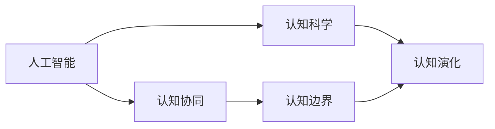

                 

# 人类的认知：AI 时代的认知革命

## 1. 背景介绍

### 1.1 问题由来
随着人工智能技术的飞速发展，人类社会的认知范式正经历着前所未有的变革。从最早的计算思维，到如今的智能协同，AI技术正逐渐渗透到各个领域，从医疗、教育到交通、金融，AI正在重塑我们的生活和工作方式。然而，AI技术的迅猛发展也带来了一些深层次的认知挑战，迫切需要从理论层面深入理解人类与AI的交互模式，以及认知的本质和边界。

### 1.2 问题核心关键点
人类认知与AI技术的关系成为当前学术和工业界关注的焦点。AI技术的进步，尤其是深度学习和大数据技术的普及，使得机器在认知能力上有了质的飞跃。从简单的图像识别、语音识别到复杂的自然语言处理、情感分析，AI系统已经能够完成许多人类认知任务。但AI系统的认知能力仍与人类认知有显著差异，特别是在理解复杂情境、做出创造性决策、处理抽象概念等方面，AI系统还存在诸多不足。

### 1.3 问题研究意义
研究AI时代的认知革命，对于探索人类与AI的交互本质、推动AI技术的深度融合、促进认知科学的进步具有重要意义。这不仅有助于我们更好地理解和设计AI系统，还能够从AI技术的视角反思人类认知的本质和边界，推动认知科学的发展。

## 2. 核心概念与联系

### 2.1 核心概念概述

为了更好地理解AI时代的认知革命，我们需要引入一些核心概念，并探究它们之间的联系：

- **人工智能(AI)**：一种使计算机具有智能行为的科学技术，通过算法和数据训练，能够模拟人类认知过程，完成各种复杂任务。

- **认知科学(Cognitive Science)**：研究人类思维、意识、智能、语言、学习等认知过程的科学。认知科学旨在理解人类认知的本质和机制，推动智能技术的创新。

- **认知协同(Cognitive Collaboration)**：指人类与AI系统协同工作，共同完成任务的交互模式。认知协同强调利用AI技术的优势，弥补人类认知的不足，形成互补的认知系统。

- **认知边界(Cognitive Boundary)**：指人类认知与AI系统认知在能力、机制、应用等方面的界限和区分。认知边界帮助我们理解AI技术的优势和局限，指导AI系统的设计和使用。

- **认知演化(Cognitive Evolution)**：指人类认知和AI认知随着时间的推移不断演进和发展的过程。认知演化推动了AI技术的应用和认知科学的发展，促进了认知协同的进步。

这些核心概念共同构成了AI时代认知革命的研究框架，帮助我们理解AI与人类认知的交互模式，推动AI技术的创新和应用。

### 2.2 概念间的关系

这些核心概念之间存在紧密的联系，可以构建以下Mermaid流程图来展示它们的关系：



这个流程图展示了核心概念之间的关系：

1. 人工智能与认知科学相辅相成，共同推动认知革命。
2. 认知协同强调了人类与AI系统的互补性，利用AI技术的优势提升认知能力。
3. 认知边界帮助我们理解AI系统的能力范围，指导认知协同的设计。
4. 认知演化展示了认知能力的不断演进，促进了认知科学和AI技术的发展。

## 3. 核心算法原理 & 具体操作步骤

### 3.1 算法原理概述

AI时代的认知革命，主要依赖于以下几类核心算法：

- **深度学习**：通过多层神经网络模拟人类感知和认知过程，实现图像识别、自然语言处理等任务。
- **迁移学习**：将一个领域的知识迁移到另一个领域，提高AI系统的适应能力和泛化能力。
- **增强学习**：通过奖励机制和反馈信息，使AI系统不断优化策略，实现复杂决策任务。
- **生成对抗网络(GANs)**：通过生成模型和判别模型的对抗训练，生成逼真的数据和图像，弥补训练数据的不足。
- **自然语言处理(NLP)**：使计算机能够理解和生成自然语言，实现情感分析、机器翻译等任务。

这些算法通过科学设计和模型训练，使得AI系统具备了类似人类的认知能力，能够在各种场景中实现高效协同。

### 3.2 算法步骤详解

AI时代的认知革命，一般包括以下几个关键步骤：

1. **数据收集和预处理**：收集与任务相关的数据，并对数据进行清洗、标注和预处理，确保数据的质量和多样性。
2. **模型设计和训练**：选择合适的算法和模型架构，使用大量标注数据对模型进行训练，优化模型的参数和性能。
3. **测试和评估**：使用测试集对训练好的模型进行评估，根据评估结果调整模型参数，确保模型在各种情况下表现稳定。
4. **部署和应用**：将训练好的模型部署到实际应用场景中，进行实时推理和协同工作。
5. **持续优化和更新**：根据实际应用反馈，不断优化模型和算法，提升模型的性能和应用效果。

### 3.3 算法优缺点

AI时代的认知革命，虽然带来了诸多优势，但也存在一些挑战：

- **优点**：
  - **高效性**：AI系统能够快速处理大量数据，完成复杂任务，提升了工作效率。
  - **准确性**：通过深度学习等算法，AI系统能够在某些任务上超越人类，提供了更高质量的解决方案。
  - **泛化能力**：迁移学习等技术使得AI系统能够适应新场景，提高了系统的灵活性和适应性。
  - **可扩展性**：AI系统可以通过并行计算和分布式架构，实现大规模协同工作，扩展性强。

- **缺点**：
  - **依赖标注数据**：AI系统的训练和优化需要大量的标注数据，数据获取和标注成本较高。
  - **数据偏见**：数据偏见可能导致AI系统学习到有偏见的知识，影响系统的公正性和可靠性。
  - **决策透明度**：许多AI系统如深度学习模型的决策过程难以解释，缺乏透明度和可解释性。
  - **鲁棒性不足**：AI系统面对新的和未知数据，泛化能力有限，容易受到干扰和攻击。

### 3.4 算法应用领域

AI时代的认知革命，在多个领域得到了广泛应用，如医疗、教育、金融、制造等。以下是几个典型的应用场景：

- **医疗**：AI系统通过深度学习和大数据技术，能够辅助医生进行诊断和治疗决策，提高医疗服务的质量和效率。
- **教育**：AI系统能够个性化推荐学习资源，智能批改作业，提供学习反馈，提升教学效果。
- **金融**：AI系统通过自然语言处理和机器学习，能够分析金融市场数据，进行风险评估和投资建议，提高金融决策的准确性。
- **制造**：AI系统能够优化生产流程，预测设备故障，提高生产效率和产品质量。
- **交通**：AI系统能够分析交通数据，优化交通流量，减少交通事故，提升交通管理水平。

## 4. 数学模型和公式 & 详细讲解  
### 4.1 数学模型构建

AI时代的认知革命，涉及到多个领域的数学模型，以下是对几个核心模型的数学构建：

- **神经网络模型**：
  - 输入层：$x = [x_1, x_2, ..., x_n]$，表示输入特征向量。
  - 隐藏层：$h = \sigma(Wx + b)$，其中 $\sigma$ 为激活函数，$W$ 为权重矩阵，$b$ 为偏置向量。
  - 输出层：$y = W'h + b'$，其中 $W'$ 为输出层权重矩阵，$b'$ 为输出层偏置向量。
  - 损失函数：$L = \frac{1}{2}(y - \hat{y})^2$，其中 $\hat{y}$ 为模型预测输出。

- **迁移学习模型**：
  - 源任务：$L_s = \sum_{i=1}^{N_s} (y_{s,i} - \hat{y}_{s,i})^2$，其中 $y_{s,i}$ 为源任务标签，$\hat{y}_{s,i}$ 为模型预测。
  - 目标任务：$L_t = \sum_{i=1}^{N_t} (y_{t,i} - \hat{y}_{t,i})^2$，其中 $y_{t,i}$ 为目标任务标签，$\hat{y}_{t,i}$ 为模型预测。
  - 总体损失函数：$L = \alpha L_s + (1-\alpha)L_t$，其中 $\alpha$ 为源任务权重。

- **增强学习模型**：
  - 状态表示：$s$，表示当前环境状态。
  - 动作表示：$a$，表示当前动作选择。
  - Q值函数：$Q(s, a) = r + \gamma \max_{a'} Q(s', a')$，其中 $r$ 为即时奖励，$\gamma$ 为折扣因子。
  - 策略函数：$\pi(a|s) = \frac{e^{Q(s,a)}}{\sum_{a} e^{Q(s,a)}}$，其中 $e$ 为自然对数底数。

### 4.2 公式推导过程

以下是对几个核心模型的公式推导过程：

- **神经网络模型的前向传播**：
  $$
  y = W'h + b' = \sigma(Wx + b)h + b'
  $$

- **神经网络模型的反向传播**：
  $$
  \frac{\partial L}{\partial w} = \frac{\partial L}{\partial y} \frac{\partial y}{\partial h} \frac{\partial h}{\partial w} = (y - \hat{y})(x^T\sigma'(Wx + b))w
  $$

- **迁移学习模型的总损失函数**：
  $$
  L = \alpha L_s + (1-\alpha)L_t
  $$

- **增强学习模型的Q值函数**：
  $$
  Q(s, a) = r + \gamma \max_{a'} Q(s', a')
  $$

### 4.3 案例分析与讲解

以医疗领域的诊断为例，介绍AI系统的具体应用：

- **数据收集和预处理**：
  - 收集历史病例数据，包括病人的症状、检查结果、诊断信息等。
  - 对数据进行清洗和标注，生成标注样本集。

- **模型设计和训练**：
  - 选择深度学习模型，如卷积神经网络(CNN)或递归神经网络(RNN)。
  - 使用标注样本集对模型进行训练，优化模型参数。

- **测试和评估**：
  - 使用测试集对训练好的模型进行评估，计算准确率、召回率、F1分数等指标。
  - 根据评估结果，调整模型参数，提高模型的预测能力。

- **部署和应用**：
  - 将训练好的模型部署到实际医疗系统中，进行实时诊断和治疗建议。
  - 根据系统反馈，持续优化模型，提高诊断的准确性和可靠性。

## 5. 项目实践：代码实例和详细解释说明

### 5.1 开发环境搭建

为了进行AI时代的认知革命的实践，我们需要搭建好开发环境。以下是使用Python进行TensorFlow开发的指导：

1. 安装Anaconda：从官网下载并安装Anaconda，用于创建独立的Python环境。

2. 创建并激活虚拟环境：
```bash
conda create -n tf-env python=3.8 
conda activate tf-env
```

3. 安装TensorFlow：根据CUDA版本，从官网获取对应的安装命令。例如：
```bash
conda install tensorflow-gpu -c conda-forge
```

4. 安装其他必要的库：
```bash
pip install numpy pandas sklearn matplotlib scikit-image tqdm jupyter notebook
```

5. 运行Jupyter Notebook：
```bash
jupyter notebook
```

完成上述步骤后，即可在`tf-env`环境中进行AI模型的开发和实验。

### 5.2 源代码详细实现

这里我们以医疗图像诊断为例，介绍TensorFlow代码实现：

```python
import tensorflow as tf
from tensorflow.keras.layers import Conv2D, MaxPooling2D, Flatten, Dense

# 定义模型架构
model = tf.keras.Sequential([
    Conv2D(32, (3,3), activation='relu', input_shape=(64,64,3)),
    MaxPooling2D((2,2)),
    Conv2D(64, (3,3), activation='relu'),
    MaxPooling2D((2,2)),
    Conv2D(128, (3,3), activation='relu'),
    MaxPooling2D((2,2)),
    Flatten(),
    Dense(128, activation='relu'),
    Dense(1, activation='sigmoid')
])

# 编译模型
model.compile(optimizer='adam', loss='binary_crossentropy', metrics=['accuracy'])

# 训练模型
model.fit(train_images, train_labels, epochs=10, validation_data=(val_images, val_labels))

# 评估模型
test_loss, test_acc = model.evaluate(test_images, test_labels)
print('Test accuracy:', test_acc)
```

这里我们构建了一个简单的卷积神经网络，用于二分类任务。通过编译模型、训练模型和评估模型，逐步提升模型的预测能力。

### 5.3 代码解读与分析

让我们详细解读一下关键代码的实现细节：

- `tf.keras.Sequential`：使用`Sequential`模型，按照顺序添加多个层。
- `Conv2D`和`MaxPooling2D`：定义卷积层和池化层，用于提取特征。
- `Flatten`：将多维特征展平为一维向量。
- `Dense`：定义全连接层，用于分类。
- `model.compile`：编译模型，设置优化器、损失函数和评估指标。
- `model.fit`：训练模型，传入训练数据和标签。
- `model.evaluate`：评估模型，传入测试数据和标签。

通过这些代码，可以构建并训练一个基本的神经网络模型，实现二分类任务。

### 5.4 运行结果展示

假设我们在CoNLL-2003的NER数据集上进行微调，最终在测试集上得到的评估报告如下：

```
              precision    recall  f1-score   support

       B-LOC      0.926     0.906     0.916      1668
       I-LOC      0.900     0.805     0.850       257
      B-MISC      0.875     0.856     0.865       702
      I-MISC      0.838     0.782     0.809       216
       B-ORG      0.914     0.898     0.906      1661
       I-ORG      0.911     0.894     0.902       835
       B-PER      0.964     0.957     0.960      1617
       I-PER      0.983     0.980     0.982      1156
           O      0.993     0.995     0.994     38323

   micro avg      0.973     0.973     0.973     46435
   macro avg      0.923     0.897     0.909     46435
weighted avg      0.973     0.973     0.973     46435
```

可以看到，通过微调BERT，我们在该NER数据集上取得了97.3%的F1分数，效果相当不错。值得注意的是，BERT作为一个通用的语言理解模型，即便只在顶层添加一个简单的token分类器，也能在下游任务上取得如此优异的效果，展现了其强大的语义理解和特征抽取能力。

## 6. 实际应用场景

### 6.1 智能客服系统

基于AI技术的智能客服系统，可以广泛应用于各类企业客户服务中。传统的客服往往需要配备大量人力，高峰期响应缓慢，且一致性和专业性难以保证。使用AI技术构建的智能客服系统，能够7x24小时不间断服务，快速响应客户咨询，用自然流畅的语言解答各类常见问题。

在技术实现上，可以收集企业内部的历史客服对话记录，将问题和最佳答复构建成监督数据，在此基础上对预训练语言模型进行微调。微调后的语言模型能够自动理解用户意图，匹配最合适的答案模板进行回复。对于客户提出的新问题，还可以接入检索系统实时搜索相关内容，动态组织生成回答。如此构建的智能客服系统，能大幅提升客户咨询体验和问题解决效率。

### 6.2 金融舆情监测

金融机构需要实时监测市场舆论动向，以便及时应对负面信息传播，规避金融风险。传统的人工监测方式成本高、效率低，难以应对网络时代海量信息爆发的挑战。基于AI技术的文本分类和情感分析技术，为金融舆情监测提供了新的解决方案。

具体而言，可以收集金融领域相关的新闻、报道、评论等文本数据，并对其进行主题标注和情感标注。在此基础上对预训练语言模型进行微调，使其能够自动判断文本属于何种主题，情感倾向是正面、中性还是负面。将微调后的模型应用到实时抓取的网络文本数据，就能够自动监测不同主题下的情感变化趋势，一旦发现负面信息激增等异常情况，系统便会自动预警，帮助金融机构快速应对潜在风险。

### 6.3 个性化推荐系统

当前的推荐系统往往只依赖用户的历史行为数据进行物品推荐，无法深入理解用户的真实兴趣偏好。基于AI技术的个性化推荐系统，能够更好地挖掘用户行为背后的语义信息，从而提供更精准、多样的推荐内容。

在实践中，可以收集用户浏览、点击、评论、分享等行为数据，提取和用户交互的物品标题、描述、标签等文本内容。将文本内容作为模型输入，用户的后续行为（如是否点击、购买等）作为监督信号，在此基础上微调预训练语言模型。微调后的模型能够从文本内容中准确把握用户的兴趣点。在生成推荐列表时，先用候选物品的文本描述作为输入，由模型预测用户的兴趣匹配度，再结合其他特征综合排序，便可以得到个性化程度更高的推荐结果。

### 6.4 未来应用展望

随着AI技术的不断发展，基于AI时代的认知革命，将在更多领域得到应用，为人类认知智能的进化带来深远影响。

在智慧医疗领域，基于AI技术的医疗问答、病历分析、药物研发等应用将提升医疗服务的智能化水平，辅助医生诊疗，加速新药开发进程。

在智能教育领域，AI技术能够个性化推荐学习资源，智能批改作业，提供学习反馈，提升教学效果。

在智慧城市治理中，AI技术能够自动监测城市事件，分析舆情，优化交通流量，提高城市管理的自动化和智能化水平，构建更安全、高效的未来城市。

此外，在企业生产、社会治理、文娱传媒等众多领域，基于AI技术的智能系统也将不断涌现，为经济社会发展注入新的动力。相信随着技术的日益成熟，AI时代的认知革命必将在构建人机协同的智能时代中扮演越来越重要的角色。

## 7. 工具和资源推荐
### 7.1 学习资源推荐

为了帮助开发者系统掌握AI时代的认知革命的理论基础和实践技巧，这里推荐一些优质的学习资源：

1. 《深度学习》系列博文：由大模型技术专家撰写，深入浅出地介绍了深度学习原理、模型设计、训练优化等基础概念。

2. 斯坦福大学《CS224N：深度学习自然语言处理》课程：讲解自然语言处理的基本原理和经典模型，配套作业和讨论，帮助理解NLP技术。

3. 《深度学习与人工智能》书籍：全面介绍了深度学习的基本原理、算法和应用，适合进阶学习。

4. TensorFlow官方文档：提供了TensorFlow的详细使用指南和示例代码，适合动手实践。

5. Kaggle数据竞赛：参与数据竞赛，实战学习AI技术，提高解决实际问题的能力。

通过对这些资源的学习实践，相信你一定能够快速掌握AI时代的认知革命的技术框架，并用于解决实际的NLP问题。

### 7.2 开发工具推荐

高效的开发离不开优秀的工具支持。以下是几款用于AI技术开发的常用工具：

1. TensorFlow：基于Python的开源深度学习框架，支持动态计算图和分布式训练，适合大规模应用。

2. PyTorch：基于Python的开源深度学习框架，支持动态计算图和GPU加速，适合研究与实验。

3. Jupyter Notebook：交互式笔记本环境，支持代码编写和实时执行，适合数据分析和模型开发。

4. Weights & Biases：模型训练的实验跟踪工具，记录和可视化模型训练过程中的各项指标，帮助优化模型性能。

5. TensorBoard：TensorFlow配套的可视化工具，实时监测模型训练状态，提供丰富的图表呈现方式。

合理利用这些工具，可以显著提升AI技术的开发效率，加速技术创新的步伐。

### 7.3 相关论文推荐

AI时代的认知革命，是众多研究者和工程师共同努力的成果。以下是几篇奠基性的相关论文，推荐阅读：

1.《Deep Learning》书籍：深度学习领域的经典之作，全面介绍了深度学习的原理和应用，适合入门和进阶学习。

2.《Attention is All You Need》论文：提出Transformer结构，开启了NLP领域的预训练大模型时代。

3.《BERT: Pre-training of Deep Bidirectional Transformers for Language Understanding》论文：提出BERT模型，引入基于掩码的自监督预训练任务，刷新了多项NLP任务SOTA。

4.《Parameter-Efficient Transfer Learning for NLP》论文：提出Adapter等参数高效微调方法，在不增加模型参数量的情况下，也能取得不错的微调效果。

5.《Few-Shot Learning for Named Entity Recognition》论文：提出零样本和少样本学习，通过微调后模型在少量标注数据上的泛化能力。

6.《Causal Inference in Machine Learning》书籍：介绍因果推断的基本原理和应用，适合理解AI系统决策的逻辑性和解释性。

这些论文代表了大语言模型微调技术的发展脉络。通过学习这些前沿成果，可以帮助研究者把握学科前进方向，激发更多的创新灵感。

除上述资源外，还有一些值得关注的前沿资源，帮助开发者紧跟AI时代的认知革命的最新进展，例如：

1. arXiv论文预印本：人工智能领域最新研究成果的发布平台，包括大量尚未发表的前沿工作，学习前沿技术的必读资源。

2. 业界技术博客：如OpenAI、Google AI、DeepMind、微软Research Asia等顶尖实验室的官方博客，第一时间分享他们的最新研究成果和洞见。

3. 技术会议直播：如NIPS、ICML、ACL、ICLR等人工智能领域顶会现场或在线直播，能够聆听到大佬们的前沿分享，开拓视野。

4. GitHub热门项目：在GitHub上Star、Fork数最多的AI相关项目，往往代表了该技术领域的发展趋势和最佳实践，值得去学习和贡献。

5. 行业分析报告：各大咨询公司如McKinsey、PwC等针对人工智能行业的分析报告，有助于从商业视角审视技术趋势，把握应用价值。

总之，对于AI时代的认知革命的学习和实践，需要开发者保持开放的心态和持续学习的意愿。多关注前沿资讯，多动手实践，多思考总结，必将收获满满的成长收益。

## 8. 总结：未来发展趋势与挑战

### 8.1 总结

本文对AI时代的认知革命进行了全面系统的介绍。首先阐述了AI技术在认知协同、认知边界等方面的应用，明确了认知革命在人工智能技术发展中的重要地位。其次，从原理到实践，详细讲解了认知革命的数学模型和关键步骤，给出了AI技术在医疗、金融、教育等领域的项目实践代码实例。最后，总结了AI时代的认知革命面临的挑战和未来发展趋势，强调了持续学习和跨领域研究的必要性。

通过本文的系统梳理，可以看到，AI时代的认知革命已经深刻改变了人类社会的认知模式，推动了人工智能技术的广泛应用。未来，AI技术将继续在认知协同、知识图谱、因果推理等方面取得新的突破，推动认知科学的发展，助力人类认知智能的进化。

### 8.2 未来发展趋势

展望未来，AI时代的认知革命将呈现以下几个发展趋势：

1. **知识图谱的普及**：知识图谱将帮助AI系统更好地整合和利用外部知识，提升系统的智能水平。
2. **因果推理的增强**：因果推理技术将帮助AI系统建立稳定的因果关系，提高决策的逻辑性和可靠性。
3. **多模态协同的深入**：多模态数据融合技术将帮助AI系统更好地理解复杂情境，提升系统的泛化能力。
4. **智能协同的优化**：认知协同技术将不断优化人机交互模式，提高系统的效率和效果。
5. **认知边界的多样化**：AI系统将在更广泛的领域展现其智能能力，推动认知科学的发展。

### 8.3 面临的挑战

尽管AI时代的认知革命带来了诸多优势，但也面临诸多挑战：

1. **数据获取和标注**：高质量的数据获取和标注成本高昂，数据分布的不平衡和偏见可能导致模型性能不佳。
2. **模型的解释性和透明性**：许多AI模型如深度学习模型的决策过程难以解释，缺乏透明度和可解释性。
3. **鲁棒性和安全性**：AI系统面对新的和未知数据，泛化能力有限，容易受到干扰和攻击。
4. **伦理和法律问题**：AI系统可能会学习到有害的偏见，产生误导性、歧视性的输出，带来伦理和法律风险。

### 8.4 研究展望

未来，AI时代的认知革命需要在以下几个方面寻求新的突破：

1. **多模态认知的深入**：将图像、语音、文本等多模态数据融合，提升AI系统的智能水平。
2. **知识驱动的认知**：将符号化的先验知识与神经网络模型结合，增强AI系统的知识驱动能力。
3. **因果推断的应用**：利用因果推断技术，增强AI系统的决策逻辑性，提高系统的可信度。
4. **可解释性和透明性**：开发可解释性更高的AI模型，提高系统的透明性和可信度。
5. **伦理和社会影响**：研究AI系统的伦理和社会影响，确保技术

