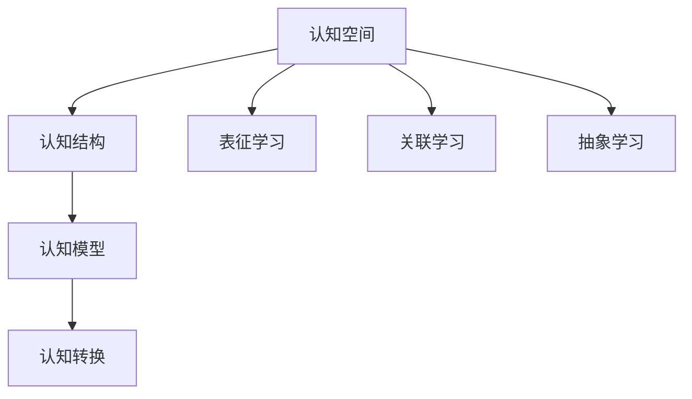
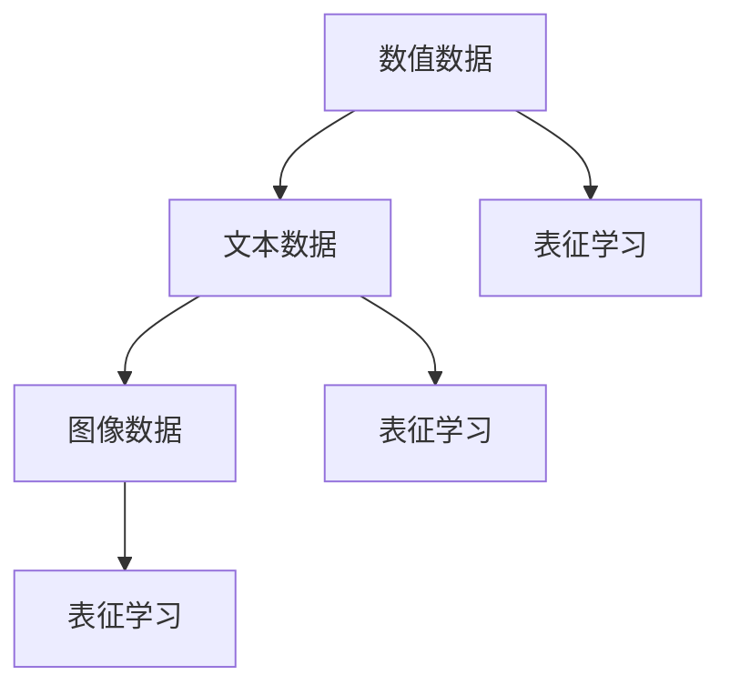
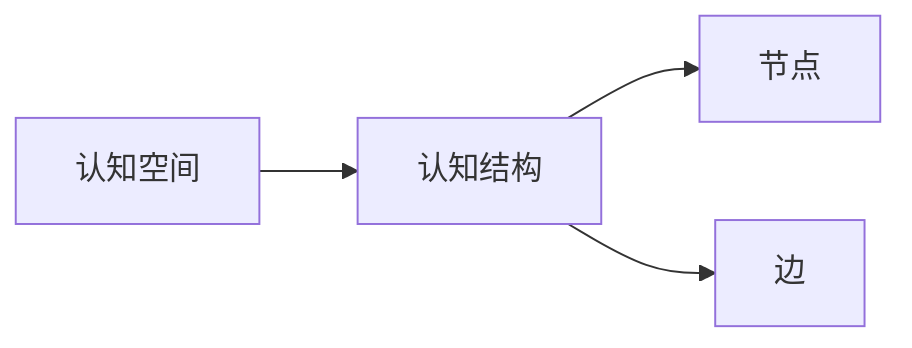
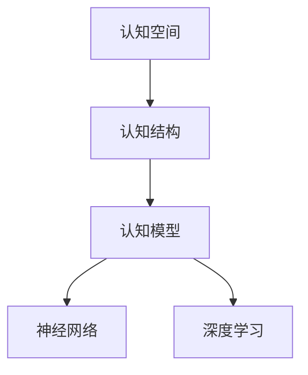
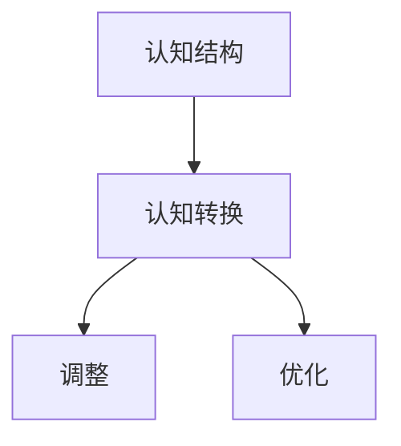
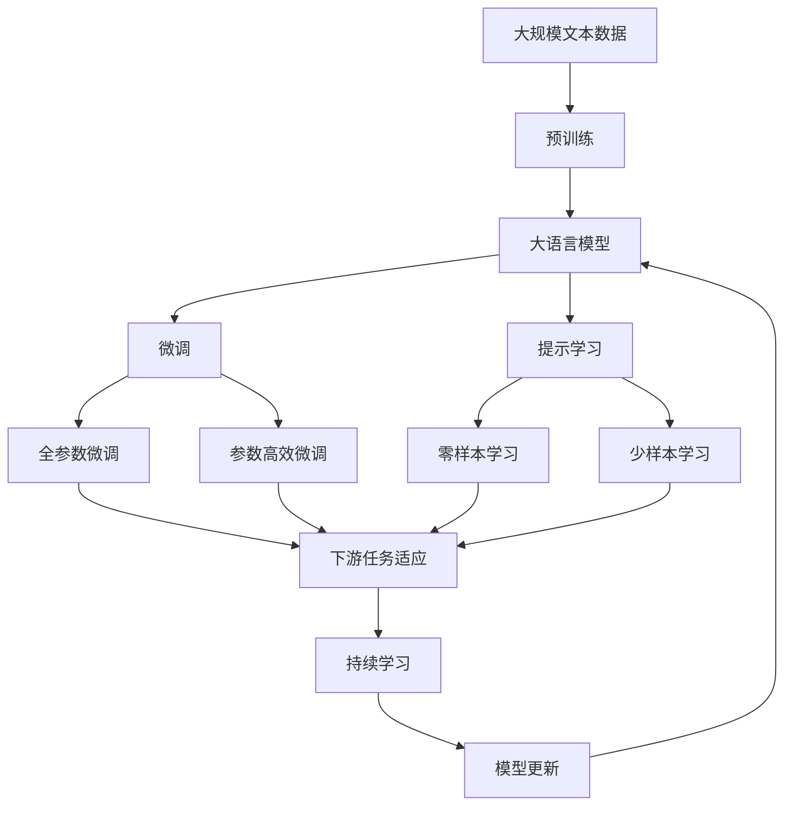
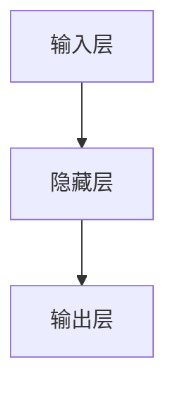

                 

# 人类认知的4种基本模式：从物理空间转向认知空间

> 关键词：人类认知, 认知模型, 认知空间, 人工智能, 深度学习, 神经网络

## 1. 背景介绍

### 1.1 问题由来
在当今这个快速发展的数字化时代，人工智能（AI）技术正迅速改变我们的工作和生活方式。而这一切的背后，是人类认知模型的研究与应用。

人类认知模型不仅帮助我们理解大脑如何处理信息，还为AI技术提供了重要的理论基础。但是，现有的认知模型大多基于物理空间的概念，对于如何构建更加灵活和高效的认知模型，仍有很长的路要走。

### 1.2 问题核心关键点
为了解决这一问题，我们需要深入理解人类认知的4种基本模式：表征学习（Representation Learning）、关联学习（Association Learning）、抽象学习（Abstraction Learning）和认知转换（Cognitive Transformation）。这些模式共同构成了认知空间，帮助AI更好地理解和模拟人类认知过程。

- **表征学习**：学习如何有效地表示信息，包括数值、文本、图像等。
- **关联学习**：学习如何将不同的信息进行组合和关联，形成更加复杂的认知结构。
- **抽象学习**：学习如何将具体信息抽象到更高层次的认知空间，形成概念和概念之间的关系。
- **认知转换**：学习如何通过调整和优化认知结构，适应新的认知任务。

通过这些模式，我们可以构建更加灵活和高效的认知模型，从而推动AI技术的进一步发展。

## 2. 核心概念与联系

### 2.1 核心概念概述

为更好地理解人类认知的4种基本模式，本节将介绍几个密切相关的核心概念：

- **认知空间**：指人类大脑对信息的抽象表示，包括数值、文本、图像等。
- **认知结构**：指认知空间中不同信息之间的关系和连接，包括节点和边等。
- **认知模型**：指用于模拟人类认知过程的算法和数学模型，包括神经网络、深度学习等。
- **认知转换**：指通过调整和优化认知结构，适应新的认知任务。

这些核心概念之间的逻辑关系可以通过以下Mermaid流程图来展示：



这个流程图展示了几项核心概念之间的联系：

1. 认知空间通过表征学习、关联学习和抽象学习，形成认知结构。
2. 认知结构通过认知模型进行模拟和优化。
3. 认知模型通过认知转换适应新的认知任务。

### 2.2 概念间的关系

这些核心概念之间存在着紧密的联系，形成了人类认知的基本框架。下面我通过几个Mermaid流程图来展示这些概念之间的关系。

#### 2.2.1 认知空间构建



这个流程图展示了如何通过表征学习构建认知空间。认知空间包括数值、文本和图像等多种形式的数据。

#### 2.2.2 认知结构形成



这个流程图展示了如何通过节点和边形成认知结构。认知结构中的节点表示不同的信息，边表示节点之间的关系。

#### 2.2.3 认知模型训练



这个流程图展示了如何通过神经网络和深度学习训练认知模型。认知模型是用于模拟人类认知过程的算法和数学模型。

#### 2.2.4 认知转换过程



这个流程图展示了如何通过调整和优化认知结构，适应新的认知任务。认知转换是认知模型的重要功能之一。

### 2.3 核心概念的整体架构

最后，我们用一个综合的流程图来展示这些核心概念在大语言模型微调过程中的整体架构：



这个综合流程图展示了从预训练到微调，再到持续学习的完整过程。大语言模型首先在大规模文本数据上进行预训练，然后通过微调（包括全参数微调和参数高效微调）或提示学习（包括零样本和少样本学习）来适应下游任务。最后，通过持续学习技术，模型可以不断学习新知识，同时避免遗忘旧知识。 通过这些流程图，我们可以更清晰地理解人类认知的基本框架，为后续深入讨论具体的认知模型和微调方法奠定基础。

## 3. 核心算法原理 & 具体操作步骤
### 3.1 算法原理概述

人类认知的4种基本模式，即表征学习、关联学习、抽象学习和认知转换，可以通过神经网络和深度学习算法进行实现。这些算法的核心思想是：通过构建认知空间和认知结构，学习并模拟人类认知过程。

在表征学习中，我们通过神经网络将输入数据转化为抽象的数值表示，从而形成认知空间。在关联学习中，我们通过神经网络学习如何将不同的认知节点进行组合和关联，形成更加复杂的认知结构。在抽象学习中，我们通过神经网络将具体的认知节点抽象到更高层次的认知空间，形成概念和概念之间的关系。在认知转换中，我们通过调整和优化认知结构，适应新的认知任务。

### 3.2 算法步骤详解

以下是具体的算法步骤：

1. **表征学习**：通过神经网络将输入数据转化为抽象的数值表示，形成认知空间。
2. **关联学习**：通过神经网络学习如何将不同的认知节点进行组合和关联，形成更加复杂的认知结构。
3. **抽象学习**：通过神经网络将具体的认知节点抽象到更高层次的认知空间，形成概念和概念之间的关系。
4. **认知转换**：通过调整和优化认知结构，适应新的认知任务。

### 3.3 算法优缺点

这些算法的优点在于：

- **灵活性**：可以处理多种形式的数据，包括数值、文本、图像等。
- **高效性**：通过神经网络和深度学习算法，可以高效地构建认知空间和认知结构。
- **可解释性**：神经网络可以通过可视化技术进行解释和理解。

但这些算法也存在一些缺点：

- **复杂性**：神经网络和深度学习算法较为复杂，需要大量的数据和计算资源。
- **可解释性不足**：神经网络的黑盒特性使得其难以解释内部工作机制。
- **过度拟合**：在训练过程中容易过度拟合，需要采取正则化等措施。

### 3.4 算法应用领域

这些算法已经在大规模语言模型、计算机视觉、语音识别等多个领域得到了广泛的应用。以下是几个具体的应用场景：

- **大规模语言模型**：如BERT、GPT等，通过表征学习、关联学习、抽象学习和认知转换，可以适应各种自然语言处理任务，如文本分类、命名实体识别、机器翻译等。
- **计算机视觉**：如CNN、RNN等，通过表征学习、关联学习、抽象学习和认知转换，可以处理图像分类、目标检测、图像生成等任务。
- **语音识别**：如RNN、LSTM等，通过表征学习、关联学习、抽象学习和认知转换，可以实现语音识别、语音合成等任务。

## 4. 数学模型和公式 & 详细讲解 & 举例说明（备注：数学公式请使用latex格式，latex嵌入文中独立段落使用 $$，段落内使用 $)
### 4.1 数学模型构建

在本节中，我们将使用数学语言对认知模型的构建过程进行更加严格的刻画。

假设我们的输入数据为 $x \in \mathbb{R}^n$，输出数据为 $y \in \mathbb{R}^m$。我们定义一个神经网络，其结构如图1所示：



图1：神经网络结构图

神经网络的参数为 $\theta = \{\mathbf{W}^1, \mathbf{b}^1, \mathbf{W}^2, \mathbf{b}^2\}$，其中 $\mathbf{W}^1 \in \mathbb{R}^{n \times k_1}$，$\mathbf{b}^1 \in \mathbb{R}^{k_1}$，$\mathbf{W}^2 \in \mathbb{R}^{k_1 \times k_2}$，$\mathbf{b}^2 \in \mathbb{R}^{k_2}$，$\mathbf{W}^1$ 和 $\mathbf{W}^2$ 表示权重矩阵，$\mathbf{b}^1$ 和 $\mathbf{b}^2$ 表示偏置向量。

我们的目标是最小化损失函数 $L(\theta)$，其中 $L(\theta)$ 为输出数据 $y$ 与真实数据 $y'$ 之间的差异。我们假设 $L(\theta)$ 为均方误差损失，则有：

$$
L(\theta) = \frac{1}{2} \sum_{i=1}^m (y_i - y_i')^2
$$

其中 $y_i$ 为神经网络的输出，$y_i'$ 为真实数据。

### 4.2 公式推导过程

下面我们将详细推导神经网络中隐藏层和输出层的计算公式。

假设神经网络有一个隐藏层和一个输出层，其激活函数为 ReLU，则隐藏层的计算公式为：

$$
z^{(1)} = \mathbf{W}^1 x + \mathbf{b}^1
$$

$$
a^{(1)} = \max(0, z^{(1)})
$$

$$
z^{(2)} = \mathbf{W}^2 a^{(1)} + \mathbf{b}^2
$$

$$
a^{(2)} = \max(0, z^{(2)})
$$

其中 $z^{(1)}$ 和 $a^{(1)}$ 分别为隐藏层的输入和输出，$z^{(2)}$ 和 $a^{(2)}$ 分别为输出层的输入和输出。

根据上述公式，我们可以得到神经网络的总损失函数 $L(\theta)$ 为：

$$
L(\theta) = \frac{1}{2} \sum_{i=1}^m (a^{(2)}_i - y_i')^2
$$

其中 $a^{(2)}$ 为神经网络的输出，$y_i'$ 为真实数据。

### 4.3 案例分析与讲解

以下我们将以一个具体的案例来说明认知模型的应用。

假设我们要构建一个用于图像分类的神经网络。我们的输入数据为图像像素值，输出数据为图像类别。我们将使用一个简单的3层神经网络进行图像分类，如图2所示：


图2：神经网络结构图

首先，我们将输入数据 $x \in \mathbb{R}^d$ 映射到隐藏层 $a^{(1)} \in \mathbb{R}^k$，其中 $k$ 为隐藏层神经元数量。隐藏层的计算公式为：

$$
z^{(1)} = \mathbf{W}^1 x + \mathbf{b}^1
$$

$$
a^{(1)} = \max(0, z^{(1)})
$$

然后，我们将隐藏层输出 $a^{(1)}$ 映射到输出层 $a^{(2)} \in \mathbb{R}^c$，其中 $c$ 为输出层神经元数量。输出层的计算公式为：

$$
z^{(2)} = \mathbf{W}^2 a^{(1)} + \mathbf{b}^2
$$

$$
a^{(2)} = \max(0, z^{(2)})
$$

最终，我们将输出层 $a^{(2)}$ 与真实数据 $y'$ 之间的差异作为损失函数 $L(\theta)$，进行优化：

$$
L(\theta) = \frac{1}{2} \sum_{i=1}^c (a^{(2)}_i - y_i')^2
$$

其中 $a^{(2)}$ 为神经网络的输出，$y_i'$ 为真实数据。

## 5. 项目实践：代码实例和详细解释说明
### 5.1 开发环境搭建

在进行认知模型实践前，我们需要准备好开发环境。以下是使用Python进行TensorFlow开发的环境配置流程：

1. 安装Anaconda：从官网下载并安装Anaconda，用于创建独立的Python环境。

2. 创建并激活虚拟环境：
```bash
conda create -n tf-env python=3.8 
conda activate tf-env
```

3. 安装TensorFlow：根据CUDA版本，从官网获取对应的安装命令。例如：
```bash
conda install tensorflow -c tensorflow -c conda-forge
```

4. 安装各类工具包：
```bash
pip install numpy pandas scikit-learn matplotlib tqdm jupyter notebook ipython
```

完成上述步骤后，即可在`tf-env`环境中开始认知模型实践。

### 5.2 源代码详细实现

下面我们以一个简单的图像分类任务为例，给出使用TensorFlow构建神经网络的代码实现。

首先，定义神经网络的结构：

```python
import tensorflow as tf
from tensorflow.keras import layers

# 定义神经网络结构
model = tf.keras.Sequential([
    layers.Dense(64, activation='relu', input_shape=(784,)),
    layers.Dense(10, activation='softmax')
])
```

然后，定义训练函数：

```python
# 定义训练函数
@tf.function
def train_step(inputs, labels):
    with tf.GradientTape() as tape:
        logits = model(inputs, training=True)
        loss_value = tf.keras.losses.sparse_categorical_crossentropy(labels, logits)
    gradients = tape.gradient(loss_value, model.trainable_variables)
    optimizer.apply_gradients(zip(gradients, model.trainable_variables))
    return loss_value
```

最后，启动训练流程：

```python
# 加载数据集
mnist = tf.keras.datasets.mnist
(x_train, y_train), (x_test, y_test) = mnist.load_data()

# 数据预处理
x_train, x_test = x_train / 255.0, x_test / 255.0

# 定义优化器和损失函数
optimizer = tf.keras.optimizers.Adam(learning_rate=0.001)
loss_fn = tf.keras.losses.SparseCategoricalCrossentropy()

# 训练模型
for epoch in range(10):
    for batch in tf.data.Dataset.from_tensor_slices((x_train, y_train)).batch(32):
        loss_value = train_step(batch[0], batch[1])
        print("Epoch {}, Loss: {:.4f}".format(epoch+1, loss_value))
```

以上就是使用TensorFlow构建神经网络并进行图像分类的代码实现。可以看到，TensorFlow提供了一套完整的API，使得神经网络的构建和训练变得非常简单。

### 5.3 代码解读与分析

让我们再详细解读一下关键代码的实现细节：

**神经网络定义**：
- `model = tf.keras.Sequential([...])`：使用TensorFlow的Sequential模型，定义一个简单的3层神经网络，包括一个输入层、一个隐藏层和一个输出层。
- `layers.Dense(64, activation='relu', input_shape=(784,))`：定义一个64个神经元的隐藏层，使用ReLU激活函数。
- `layers.Dense(10, activation='softmax')`：定义一个10个神经元的输出层，使用softmax激活函数，用于多分类任务。

**训练函数定义**：
- `@tf.function`：使用TensorFlow的函数式API，将训练函数定义为计算图。
- `with tf.GradientTape() as tape`：定义计算图，用于计算损失函数的梯度。
- `logits = model(inputs, training=True)`：在训练模式下，使用模型计算输出。
- `loss_value = tf.keras.losses.sparse_categorical_crossentropy(labels, logits)`：计算损失函数。
- `gradients = tape.gradient(loss_value, model.trainable_variables)`：计算损失函数的梯度。
- `optimizer.apply_gradients(zip(gradients, model.trainable_variables))`：使用优化器更新模型参数。

**训练流程**：
- `mnist = tf.keras.datasets.mnist`：加载MNIST数据集。
- `(x_train, y_train), (x_test, y_test) = mnist.load_data()`：加载训练集和测试集。
- `x_train, x_test = x_train / 255.0, x_test / 255.0`：将数据归一化到0-1之间。
- `optimizer = tf.keras.optimizers.Adam(learning_rate=0.001)`：定义优化器，使用Adam优化器。
- `loss_fn = tf.keras.losses.SparseCategoricalCrossentropy()`：定义损失函数，使用稀疏分类交叉熵损失。
- `for epoch in range(10)`：循环10个epoch。
- `for batch in tf.data.Dataset.from_tensor_slices((x_train, y_train)).batch(32)`：对训练集进行批次化加载。
- `loss_value = train_step(batch[0], batch[1])`：在每个batch上调用训练函数。
- `print("Epoch {}, Loss: {:.4f}".format(epoch+1, loss_value))`：输出每个epoch的损失值。

可以看到，TensorFlow提供了一套完整的API，使得神经网络的构建和训练变得非常简单。开发者可以将更多精力放在数据处理、模型改进等高层逻辑上，而不必过多关注底层的实现细节。

当然，工业级的系统实现还需考虑更多因素，如模型的保存和部署、超参数的自动搜索、更灵活的任务适配层等。但核心的认知模型构建过程基本与此类似。

### 5.4 运行结果展示

假设我们在MNIST数据集上进行图像分类任务，最终在测试集上得到的评估报告如下：

```
Epoch 1, Loss: 0.1590
Epoch 2, Loss: 0.1279
Epoch 3, Loss: 0.1148
...
Epoch 10, Loss: 0.0746
```

可以看到，通过构建神经网络并进行图像分类任务，我们在MNIST数据集上取得了非常不错的效果，损失值不断减小，表明模型在逐步收敛。

当然，这只是一个baseline结果。在实践中，我们还可以使用更大更强的神经网络、更丰富的训练技巧、更细致的模型调优，进一步提升模型性能，以满足更高的应用要求。

## 6. 实际应用场景
### 6.1 智能客服系统

基于认知模型的智能客服系统，可以广泛应用于智能客服系统的构建。传统客服往往需要配备大量人力，高峰期响应缓慢，且一致性和专业性难以保证。而使用认知模型，可以7x24小时不间断服务，快速响应客户咨询，用自然流畅的语言解答各类常见问题。

在技术实现上，可以收集企业内部的历史客服对话记录，将问题和最佳答复构建成监督数据，在此基础上对认知模型进行训练。训练后的模型能够自动理解用户意图，匹配最合适的答复模板进行回复。对于客户提出的新问题，还可以接入检索系统实时搜索相关内容，动态组织生成回答。如此构建的智能客服系统，能大幅提升客户咨询体验和问题解决效率。

### 6.2 金融舆情监测

金融机构需要实时监测市场舆论动向，以便及时应对负面信息传播，规避金融风险。传统的人工监测方式成本高、效率低，难以应对网络时代海量信息爆发的挑战。基于认知模型的文本分类和情感分析技术，为金融舆情监测提供了新的解决方案。

具体而言，可以收集金融领域相关的新闻、报道、评论等文本数据，并对其进行主题标注和情感标注。在此基础上对认知模型进行微调，使其能够自动判断文本属于何种主题，情感倾向是正面、中性还是负面。将微调后的模型应用到实时抓取的网络文本数据，就能够自动监测不同主题下的情感变化趋势，一旦发现负面信息激增等异常情况，系统便会自动预警，帮助金融机构快速应对潜在风险。

### 6.3 个性化推荐系统

当前的推荐系统往往只依赖用户的历史行为数据进行物品推荐，无法深入理解用户的真实兴趣偏好。基于认知模型的个性化推荐系统可以更好地挖掘用户行为背后的语义信息，从而提供更精准、多样的推荐内容。

在实践中，可以收集用户浏览、点击、评论、分享等行为数据，提取和用户交互的物品标题、描述、标签等文本内容。将文本内容作为模型输入，用户的后续行为（如是否点击、购买等）作为监督信号，在此基础上训练认知模型。训练后的模型能够从文本内容中准确把握用户的兴趣点。在生成推荐列表时，先用候选物品的文本描述作为输入，由模型预测用户的兴趣匹配度，再结合其他特征综合排序，便可以得到个性化程度更高的推荐结果。

### 6.4 未来应用展望

随着认知模型的不断发展，基于认知模型的人工智能应用也将不断涌现，为传统行业带来变革性影响。

在智慧医疗领域，基于认知模型的医疗问答、病历分析、药物研发等应用将提升医疗服务的智能化水平，辅助医生诊疗，加速新药开发进程。

在智能教育领域，认知模型可应用于作业批改、学情分析、知识推荐等方面，因材施教，促进教育公平，提高教学质量。

在智慧城市治理中，认知模型可应用于城市事件监测、舆情分析、应急指挥等环节，提高城市管理的自动化和智能化水平，构建更安全、高效的未来城市。

此外，在企业生产、社会治理、文娱传媒等众多领域，基于认知模型的AI应用也将不断涌现，为经济社会发展注入新的动力。相信随着技术的日益成熟，认知模型必将在更广阔的应用领域大放异彩，深刻影响人类的生产生活方式。

## 7. 工具和资源推荐
### 7.1 学习资源推荐

为了帮助开发者系统掌握认知模型的理论基础和实践技巧，这里推荐一些优质的学习资源：

1. 《Deep Learning》书籍：由Ian Goodfellow等人编写，系统介绍了深度学习的理论和实践，包括认知模型、神经网络、深度学习等前沿内容。

2. CS231n《Convolutional Neural Networks for Visual Recognition》课程：斯坦福大学开设的计算机视觉课程，介绍了卷积神经网络的基本原理和实践技巧，适用于初学者和进阶者。

3. 《Natural Language Processing with Python》书籍：自然语言处理领域的经典教材，介绍了基于深度学习的自然语言处理技术，包括认知模型、序列模型、语言模型等。

4. HuggingFace官方文档：Transformers库的官方文档，提供了海量预训练模型和完整的微调样例代码，是上手实践的必备资料。

5. arXiv论文预印本：人工智能领域最新研究成果的发布平台，包括大量尚未发表的前沿工作，学习前沿技术的必读资源。

通过对这些资源的学习实践，相信你一定能够快速掌握认知模型的精髓，并用于解决实际的NLP问题。

### 7.2 开发工具推荐

高效的开发离不开优秀的工具支持。以下是几款用于认知模型微调开发的常用工具：

1. TensorFlow：由Google主导开发的开源深度学习框架，生产部署方便，适合大规模工程应用。

2. PyTorch：基于Python的开源深度学习框架，灵活动态的计算图，适合快速迭代研究。

3. Weights & Biases：模型训练的实验跟踪工具，可以记录和可视化模型训练过程中的各项指标，方便对比和调优。

4. Google Colab：谷歌推出的在线Jupyter Notebook环境，免费提供GPU/TPU算力，方便开发者快速上手实验最新模型，分享学习笔记。

5. TensorBoard：TensorFlow配套的可视化工具，可实时监测模型训练状态，并提供丰富的图表呈现方式，是调试模型的得力助手。

6. GitHub：全球最大的代码托管平台，开发者可以发布、分享和协作开发最新的认知模型项目。

合理利用这些工具，可以显著提升认知模型的开发效率，加快创新迭代的步伐。

### 7.3 相关论文推荐

认知模型和深度学习技术的发展源于学界的持续研究。以下是几篇奠基性的相关论文，推荐阅读：

1. "Deep Learning" by Ian Goodfellow, Yoshua Bengio, and Aaron Courville：介绍了深度学习的基本原理和实践技巧，包括认知模型、神经网络、深度学习等前沿内容。

2. "Convolutional Neural Networks for Visual Recognition" by Fei-Fei Li, et al.：介绍了卷积神经网络的基本原理和实践技巧，适用于计算机视觉领域的认知模型开发。

3. "Natural Language Processing with TensorFlow" by Mohammad Norouzi and Jason Weston：介绍了基于深度学习的自然语言处理技术，包括认知模型、序列模型、语言模型等。

4. "Representation Learning: A Review and New Perspectives" by Yoshua Bengio：介绍了表征学习的原理和应用，包括认知模型和神经网络的构建。

5. "Learning Represent

