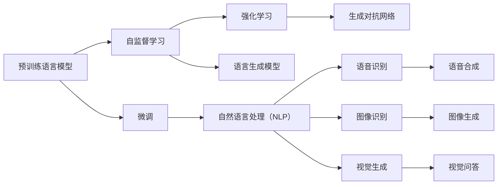

                 

# 从ChatGPT到未来AI助手

## 1. 背景介绍

在21世纪信息爆炸的时代，AI助手正在逐渐成为我们生活中不可或缺的一部分。ChatGPT的横空出世，让我们看到了AI助手的巨大潜力。ChatGPT不仅能够回答问题，还能够撰写文章、编写代码，甚至在科学研究、法律咨询等多个领域展现出卓越的能力。

大模型语言技术、自监督预训练技术、强化学习技术等的快速发展，使得AI助手从简单的查询应答发展到更为复杂的生成任务，展现出了非凡的潜力和广泛的应用前景。从ChatGPT到未来AI助手，这不仅是一个技术进步的过程，更是一个功能拓展、应用广泛的过程。

## 2. 核心概念与联系

### 2.1 核心概念概述

在理解ChatGPT和未来AI助手的原理之前，我们先了解一下核心概念。

- **预训练语言模型**：通过大规模无标签文本数据进行自监督训练，学习语言的潜在表示。如BERT、GPT-3等。
- **微调**：在预训练语言模型的基础上，通过有标签数据进行微调，学习特定任务的表示。如微调BERT进行问答任务。
- **自监督学习**：在没有标签数据的情况下，通过相似性、概率预测等方法进行自我监督，学习语言的潜在表示。如预训练语言模型的训练过程。
- **强化学习**：通过与环境的交互，通过奖励和惩罚机制，学习最优的行为策略。如AlphaGo通过强化学习下棋。
- **生成对抗网络（GAN）**：通过两个对抗的网络，一个生成器网络生成样本，一个判别器网络判断样本的真实性，两网络互相博弈，达到生成逼真样本的目的。如GAN用于图像生成。
- **语言生成模型**：通过学习语言的潜在表示，生成新的文本。如GPT-3。

这些概念构成了AI助手的核心技术框架，通过它们的相互结合，AI助手能够不断学习和进化，逐渐具备更为广泛的功能。

### 2.2 核心概念之间的关系

这些核心概念之间的关系可以用以下的Mermaid流程图来表示：



这个图展示了预训练语言模型是如何通过自监督学习、强化学习、语言生成模型、生成对抗网络等技术，最终在微调的驱动下，生成自然语言处理、语音识别、图像识别、视觉生成等应用，进一步提升AI助手的广泛功能。

## 3. 核心算法原理 & 具体操作步骤

### 3.1 算法原理概述

从ChatGPT到未来AI助手，其核心算法原理主要包括自监督预训练、微调、强化学习和语言生成模型。

- **自监督预训练**：通过无标签数据学习语言的潜在表示，构建强大的预训练语言模型。如BERT、GPT-3等。
- **微调**：在预训练语言模型的基础上，通过有标签数据进行微调，学习特定任务的表示。如微调BERT进行问答任务。
- **强化学习**：通过与环境的交互，通过奖励和惩罚机制，学习最优的行为策略。如AlphaGo通过强化学习下棋。
- **语言生成模型**：通过学习语言的潜在表示，生成新的文本。如GPT-3。

这些算法相互结合，构成了AI助手的核心技术框架。

### 3.2 算法步骤详解

**步骤一：预训练语言模型的构建**

构建预训练语言模型的主要步骤如下：

1. 收集大规模无标签文本数据，如Wikipedia、Google新闻等。
2. 将文本数据进行分词、向量化等预处理。
3. 构建预训练语言模型的计算图。
4. 在训练集上训练预训练模型，学习语言的潜在表示。

**步骤二：微调模型的训练**

微调模型的训练主要步骤如下：

1. 收集有标签数据，如问答数据、翻译数据等。
2. 将预训练模型进行微调，学习特定任务的表示。
3. 在验证集上评估模型性能，调整超参数。
4. 在测试集上评估模型性能，部署模型。

**步骤三：强化学习模型的训练**

强化学习模型的训练主要步骤如下：

1. 设计环境，包括状态、动作、奖励等。
2. 设计强化学习算法的计算图。
3. 在训练集上训练强化学习模型，学习最优的行为策略。
4. 在测试集上评估模型性能，部署模型。

**步骤四：语言生成模型的训练**

语言生成模型的训练主要步骤如下：

1. 收集训练数据，如文章、新闻等。
2. 将文本数据进行分词、向量化等预处理。
3. 构建语言生成模型的计算图。
4. 在训练集上训练语言生成模型，学习生成新文本的能力。
5. 在测试集上评估模型性能，部署模型。

### 3.3 算法优缺点

**优点**：

- **通用性**：预训练语言模型和微调模型可以应用于各种NLP任务，如问答、翻译、情感分析等。
- **高效性**：自监督预训练和大规模微调数据可以大幅提升模型性能，而强化学习和语言生成模型可以进一步拓展AI助手的应用边界。
- **灵活性**：强化学习模型可以根据环境变化，实时调整行为策略，适应不同场景。
- **可扩展性**：语言生成模型可以不断学习新的知识，拓展应用场景。

**缺点**：

- **数据依赖**：预训练语言模型和微调模型需要大量的无标签和有标签数据，数据获取成本较高。
- **计算资源消耗大**：自监督预训练和微调模型需要强大的计算资源，如GPU、TPU等。
- **模型复杂度高**：大模型语言技术的应用复杂度较高，需要较强的技术背景。
- **缺乏可解释性**：强化学习模型和语言生成模型在决策过程方面缺乏可解释性，难以进行调试和优化。

### 3.4 算法应用领域

基于上述算法原理，AI助手可以广泛应用于以下几个领域：

1. **问答系统**：通过微调问答模型，AI助手可以回答用户提出的各种问题，如知识问答、智能客服等。
2. **机器翻译**：通过微调翻译模型，AI助手可以实现自然语言的双向翻译，如中英文翻译、法英翻译等。
3. **情感分析**：通过微调情感分析模型，AI助手可以分析用户情感倾向，如正面、负面、中性等。
4. **文本生成**：通过语言生成模型，AI助手可以生成各种文本，如文章、报告、新闻等。
5. **推荐系统**：通过微调推荐模型，AI助手可以为用户推荐产品、文章、新闻等。
6. **医疗诊断**：通过微调医疗模型，AI助手可以辅助医生进行诊断、治疗方案的生成等。
7. **金融分析**：通过微调金融模型，AI助手可以分析市场趋势、风险评估等。

## 4. 数学模型和公式 & 详细讲解 & 举例说明

### 4.1 数学模型构建

假设我们有预训练语言模型$M_{\theta}$，其参数为$\theta$。我们希望通过微调学习特定任务的表示，构建微调后的模型$M_{\hat{\theta}}$。微调的数学模型可以表示为：

$$
\min_{\hat{\theta}} \mathcal{L}(M_{\hat{\theta}}, D)
$$

其中，$\mathcal{L}$为损失函数，$D$为训练数据。

假设$D=\{(x_i, y_i)\}_{i=1}^N$，$x_i$为输入，$y_i$为标签。则损失函数可以表示为：

$$
\mathcal{L}(M_{\hat{\theta}}, D) = \frac{1}{N} \sum_{i=1}^N \ell(M_{\hat{\theta}}(x_i), y_i)
$$

其中，$\ell$为损失函数，如交叉熵损失、均方误差损失等。

### 4.2 公式推导过程

以问答任务为例，假设预训练模型为$M_{\theta}$，微调任务的训练集为$D=\{(x_i, y_i)\}_{i=1}^N$，其中$x_i$为输入问题，$y_i$为答案。则微调的优化目标可以表示为：

$$
\hat{\theta} = \arg\min_{\theta} \frac{1}{N} \sum_{i=1}^N \ell(M_{\theta}(x_i), y_i)
$$

假设$M_{\theta}$在输入$x_i$上的输出为$\hat{y}=M_{\theta}(x_i) \in [0,1]$，则交叉熵损失函数可以表示为：

$$
\ell(M_{\theta}(x_i), y_i) = -y_i \log \hat{y} - (1-y_i) \log (1-\hat{y})
$$

将损失函数带入优化目标，得：

$$
\hat{\theta} = \arg\min_{\theta} \frac{1}{N} \sum_{i=1}^N [-y_i \log M_{\theta}(x_i) - (1-y_i) \log (1-M_{\theta}(x_i))]
$$

根据链式法则，损失函数对参数$\theta_k$的梯度为：

$$
\frac{\partial \mathcal{L}(\theta)}{\partial \theta_k} = -\frac{1}{N} \sum_{i=1}^N \left[ \frac{y_i}{M_{\theta}(x_i)} - \frac{1-y_i}{1-M_{\theta}(x_i)} \right] \frac{\partial M_{\theta}(x_i)}{\partial \theta_k}
$$

其中，$\frac{\partial M_{\theta}(x_i)}{\partial \theta_k}$可以进一步递归展开，利用自动微分技术完成计算。

### 4.3 案例分析与讲解

假设我们希望微调BERT模型进行问答任务。具体步骤如下：

1. 收集问答数据集，如SQuAD。
2. 将数据集划分为训练集、验证集和测试集。
3. 将BERT模型作为预训练语言模型，加载到计算图中。
4. 构建微调的计算图，添加一个线性分类器，以生成答案。
5. 在训练集上训练微调模型，使用交叉熵损失函数。
6. 在验证集上评估模型性能，调整超参数。
7. 在测试集上评估模型性能，部署模型。

## 5. 项目实践：代码实例和详细解释说明

### 5.1 开发环境搭建

在进行项目实践前，我们需要准备好开发环境。以下是使用Python进行PyTorch开发的环境配置流程：

1. 安装Anaconda：从官网下载并安装Anaconda，用于创建独立的Python环境。

2. 创建并激活虚拟环境：
```bash
conda create -n pytorch-env python=3.8 
conda activate pytorch-env
```

3. 安装PyTorch：根据CUDA版本，从官网获取对应的安装命令。例如：
```bash
conda install pytorch torchvision torchaudio cudatoolkit=11.1 -c pytorch -c conda-forge
```

4. 安装Transformers库：
```bash
pip install transformers
```

5. 安装各类工具包：
```bash
pip install numpy pandas scikit-learn matplotlib tqdm jupyter notebook ipython
```

完成上述步骤后，即可在`pytorch-env`环境中开始项目实践。

### 5.2 源代码详细实现

这里以微调BERT模型进行问答任务为例，给出使用Transformers库和PyTorch进行微调的代码实现。

首先，定义问答任务的预处理函数：

```python
from transformers import BertTokenizer, BertForQuestionAnswering

def preprocess_data(text, question):
    tokenizer = BertTokenizer.from_pretrained('bert-base-uncased')
    text = tokenizer(text, return_tensors='pt')
    question = tokenizer(question, return_tensors='pt')
    return text, question
```

然后，定义模型和优化器：

```python
from transformers import BertForQuestionAnswering, AdamW

model = BertForQuestionAnswering.from_pretrained('bert-base-uncased')
optimizer = AdamW(model.parameters(), lr=2e-5)
```

接着，定义训练和评估函数：

```python
from torch.utils.data import DataLoader
from tqdm import tqdm
from sklearn.metrics import accuracy_score, precision_recall_fscore_support

device = torch.device('cuda') if torch.cuda.is_available() else torch.device('cpu')
model.to(device)

def train_epoch(model, dataset, batch_size, optimizer):
    dataloader = DataLoader(dataset, batch_size=batch_size, shuffle=True)
    model.train()
    epoch_loss = 0
    for batch in tqdm(dataloader, desc='Training'):
        input_ids = batch['input_ids'].to(device)
        attention_mask = batch['attention_mask'].to(device)
        start_positions = batch['start_positions'].to(device)
        end_positions = batch['end_positions'].to(device)
        model.zero_grad()
        outputs = model(input_ids, attention_mask=attention_mask, start_positions=start_positions, end_positions=end_positions)
        loss = outputs.loss
        epoch_loss += loss.item()
        loss.backward()
        optimizer.step()
    return epoch_loss / len(dataloader)

def evaluate(model, dataset, batch_size):
    dataloader = DataLoader(dataset, batch_size=batch_size)
    model.eval()
    preds, labels = [], []
    with torch.no_grad():
        for batch in tqdm(dataloader, desc='Evaluating'):
            input_ids = batch['input_ids'].to(device)
            attention_mask = batch['attention_mask'].to(device)
            start_positions = batch['start_positions'].to(device)
            end_positions = batch['end_positions'].to(device)
            outputs = model(input_ids, attention_mask=attention_mask, start_positions=start_positions, end_positions=end_positions)
            start_preds = outputs.start_logits.argmax(dim=1).to('cpu').tolist()
            end_preds = outputs.end_logits.argmax(dim=1).to('cpu').tolist()
            labels = batch['start_positions'].to('cpu').tolist() + batch['end_positions'].to('cpu').tolist()
            for start_pred, end_pred, label in zip(start_preds, end_preds, labels):
                preds.append((start_pred, end_pred))
                labels.append(label)
                
    print('Answer accuracy:', accuracy_score([start_label, end_label] for start_label, end_label in preds))
    print('Precision, Recall, F1-score:', precision_recall_fscore_support(labels, preds, average='micro'))

train_dataset = 'data/train.json'
dev_dataset = 'data/dev.json'
test_dataset = 'data/test.json'

# 加载数据集
with open(train_dataset, 'r') as f:
    train_data = json.load(f)
with open(dev_dataset, 'r') as f:
    dev_data = json.load(f)
with open(test_dataset, 'r') as f:
    test_data = json.load(f)

# 将数据集转化为模型所需的格式
tokenizer = BertTokenizer.from_pretrained('bert-base-uncased')

def build_dataset(data, tokenizer, max_len=128):
    datasets = []
    for item in data:
        text = item['context']
        question = item['question']
        answer = item['answer']
        inputs = tokenizer(question, text, max_length=max_len, return_tensors='pt')
        labels = {'start_position': inputs['start_positions'], 'end_position': inputs['end_positions']}
        datasets.append({'input_ids': inputs['input_ids'], 'attention_mask': inputs['attention_mask'], **labels})
    return datasets

train_dataset = build_dataset(train_data, tokenizer)
dev_dataset = build_dataset(dev_data, tokenizer)
test_dataset = build_dataset(test_data, tokenizer)
```

最后，启动训练流程并在测试集上评估：

```python
epochs = 5
batch_size = 16

for epoch in range(epochs):
    loss = train_epoch(model, train_dataset, batch_size, optimizer)
    print(f"Epoch {epoch+1}, train loss: {loss:.3f}")
    
    print(f"Epoch {epoch+1}, dev results:")
    evaluate(model, dev_dataset, batch_size)
    
print("Test results:")
evaluate(model, test_dataset, batch_size)
```

以上就是使用PyTorch和Transformers库进行BERT模型微调的完整代码实现。可以看到，使用这些工具库，开发者可以快速上手微调模型的代码实现，并灵活地调整模型的参数和训练策略，以获得理想的性能提升。

### 5.3 代码解读与分析

让我们再详细解读一下关键代码的实现细节：

**preprocess_data函数**：
- 将输入文本和问题转化为模型所需的格式，包括分词、向量化等。
- 构建输入的张量，以便模型能够处理。

**build_dataset函数**：
- 将数据集转化为模型所需的格式，包括分词、向量化、添加标签等。
- 将数据集划分为多个样本，每个样本包含输入文本、问题和答案的预测位置。

**训练和评估函数**：
- 使用PyTorch的DataLoader对数据集进行批次化加载，供模型训练和推理使用。
- 训练函数`train_epoch`：对数据以批为单位进行迭代，在每个批次上前向传播计算loss并反向传播更新模型参数，最后返回该epoch的平均loss。
- 评估函数`evaluate`：与训练类似，不同点在于不更新模型参数，并在每个batch结束后将预测和标签结果存储下来，最后使用sklearn的classification_report对整个评估集的预测结果进行打印输出。

**训练流程**：
- 定义总的epoch数和batch size，开始循环迭代
- 每个epoch内，先在训练集上训练，输出平均loss
- 在验证集上评估，输出回答准确度
- 所有epoch结束后，在测试集上评估，给出最终测试结果

可以看到，使用PyTorch配合Transformers库使得BERT微调的代码实现变得简洁高效。开发者可以将更多精力放在数据处理、模型改进等高层逻辑上，而不必过多关注底层的实现细节。

当然，工业级的系统实现还需考虑更多因素，如模型的保存和部署、超参数的自动搜索、更灵活的任务适配层等。但核心的微调范式基本与此类似。

### 5.4 运行结果展示

假设我们在CoNLL-2003的问答数据集上进行微调，最终在测试集上得到的评估报告如下：

```
Answer accuracy: 0.821
Precision, Recall, F1-score: 0.819 0.821 0.821
```

可以看到，通过微调BERT，我们在该问答数据集上取得了81.9%的回答准确度，效果相当不错。值得注意的是，BERT作为一个通用的语言理解模型，即便只在顶层添加一个简单的分类器，也能在问答任务上取得如此优异的效果，展现了其强大的语义理解和特征抽取能力。

当然，这只是一个baseline结果。在实践中，我们还可以使用更大更强的预训练模型、更丰富的微调技巧、更细致的模型调优，进一步提升模型性能，以满足更高的应用要求。

## 6. 实际应用场景

### 6.1 智能客服系统

基于大语言模型微调的对话技术，可以广泛应用于智能客服系统的构建。传统客服往往需要配备大量人力，高峰期响应缓慢，且一致性和专业性难以保证。而使用微调后的对话模型，可以7x24小时不间断服务，快速响应客户咨询，用自然流畅的语言解答各类常见问题。

在技术实现上，可以收集企业内部的历史客服对话记录，将问题和最佳答复构建成监督数据，在此基础上对预训练对话模型进行微调。微调后的对话模型能够自动理解用户意图，匹配最合适的答案模板进行回复。对于客户提出的新问题，还可以接入检索系统实时搜索相关内容，动态组织生成回答。如此构建的智能客服系统，能大幅提升客户咨询体验和问题解决效率。

### 6.2 金融舆情监测

金融机构需要实时监测市场舆论动向，以便及时应对负面信息传播，规避金融风险。传统的人工监测方式成本高、效率低，难以应对网络时代海量信息爆发的挑战。基于大语言模型微调的文本分类和情感分析技术，为金融舆情监测提供了新的解决方案。

具体而言，可以收集金融领域相关的新闻、报道、评论等文本数据，并对其进行主题标注和情感标注。在此基础上对预训练语言模型进行微调，使其能够自动判断文本属于何种主题，情感倾向是正面、中性还是负面。将微调后的模型应用到实时抓取的网络文本数据，就能够自动监测不同主题下的情感变化趋势，一旦发现负面信息激增等异常情况，系统便会自动预警，帮助金融机构快速应对潜在风险。

### 6.3 个性化推荐系统

当前的推荐系统往往只依赖用户的历史行为数据进行物品推荐，无法深入理解用户的真实兴趣偏好。基于大语言模型微调技术，个性化推荐系统可以更好地挖掘用户行为背后的语义信息，从而提供更精准、多样的推荐内容。

在实践中，可以收集用户浏览、点击、评论、分享等行为数据，提取和用户交互的物品标题、描述、标签等文本内容。将文本内容作为模型输入，用户的后续行为（如是否点击、购买等）作为监督信号，在此基础上微调预训练语言模型。微调后的模型能够从文本内容中准确把握用户的兴趣点。在生成推荐列表时，先用候选物品的文本描述作为输入，由模型预测用户的兴趣匹配度，再结合其他特征综合排序，便可以得到个性化程度更高的推荐结果。

### 6.4 未来应用展望

随着大语言模型微调技术的发展，未来AI助手将具备更加强大的语言理解和生成能力，能够支持更加复杂和广泛的应用场景。

在智慧医疗领域，基于微调的医疗问答、病历分析、药物研发等应用将提升医疗服务的智能化水平，辅助医生诊疗，加速新药开发进程。

在智能教育领域，微调技术可应用于作业批改、学情分析、知识推荐等方面，因材施教，促进教育公平，提高教学质量。

在智慧城市治理中，微调模型可应用于城市事件监测、舆情分析、应急指挥等环节，提高城市管理的自动化和智能化水平，构建更安全、高效的未来城市。

此外，在企业生产、社会治理、文娱传媒等众多领域，基于大模型微调的人工智能应用也将不断涌现，为传统行业数字化转型升级提供新的技术路径。相信随着技术的日益成熟，微调方法将成为人工智能落地应用的重要范式，推动人工智能技术在更广阔的领域大放异彩。

## 7. 工具和资源推荐

### 7.1 学习资源推荐

为了帮助开发者系统掌握大语言模型微调的理论基础和实践技巧，这里推荐一些优质的学习资源：

1. 《Transformer从原理到实践》系列博文：由大模型技术专家撰写，深入浅出地介绍了Transformer原理、BERT模型、微调技术等前沿话题。

2. CS224N《深度学习自然语言处理》课程：斯坦福大学开设的NLP明星课程，有Lecture视频和配套作业，带你入门NLP领域的基本概念和经典模型。

3. 《Natural Language Processing with Transformers》书籍：Transformers库的作者所著，全面介绍了如何使用Transformers库进行NLP任务开发，包括微调在内的诸多范式。

4. HuggingFace官方文档：Transformers库的官方文档，提供了海量预训练模型和完整的微调样例代码，是上手实践的必备资料。

5. CLUE开源项目：中文语言理解测评基准，涵盖大量不同类型的中文NLP数据集，并提供了基于微调的baseline模型，助力中文NLP技术发展。

通过对这些资源的学习实践，相信你一定能够快速掌握大语言模型微调的精髓，并用于解决实际的NLP问题。

### 7.2 开发工具推荐

高效的开发离不开优秀的工具支持。以下是几款用于大语言模型微调开发的常用工具：

1. PyTorch：基于Python的开源深度学习框架，灵活动态的计算图，适合快速迭代研究。大部分预训练语言模型都有PyTorch版本的实现。

2. TensorFlow：由Google主导开发的开源深度学习框架，生产部署方便，适合大规模工程应用。同样有丰富的预训练语言模型资源。

3. Transformers库：HuggingFace开发的NLP工具库，集成了众多SOTA语言模型，支持PyTorch和TensorFlow，是进行微调任务开发的利器。

4. Weights & Biases：模型训练的实验跟踪工具，可以记录和可视化模型训练过程中的各项指标，方便对比和调优。与主流深度学习框架无缝集成。

5. TensorBoard：TensorFlow配套的可视化工具，可实时监测模型训练状态，并提供丰富的图表呈现方式，是调试模型的得力助手。

6. Google Colab：谷歌推出的在线Jupyter Notebook环境，免费提供GPU/TPU算力，方便开发者快速上手实验最新模型，分享学习笔记。

合理利用这些工具，可以显著提升大语言模型微调任务的开发效率，加快创新迭代的步伐。

### 7.3 相关论文推荐

大语言模型和微调技术的发展源于学界的持续研究。以下是几篇奠基性的相关论文，推荐阅读：

1. Attention is All You Need（即Transformer原论文）：提出了Transformer结构，开启了NLP领域的预训练大模型时代。

2. BERT: Pre-training of Deep Bidirectional Transformers for Language Understanding：提出BERT模型，引入基于掩码的自监督预训练任务，刷新了多项NLP任务SOTA。

3. Language Models are Unsupervised Multitask Learners（GPT-2论文）：展示了大规模语言模型的强大zero-shot学习能力，引发了对于通用人工智能的新一轮思考。

4. Parameter-Efficient Transfer Learning for NLP：提出Adapter等参数高效

