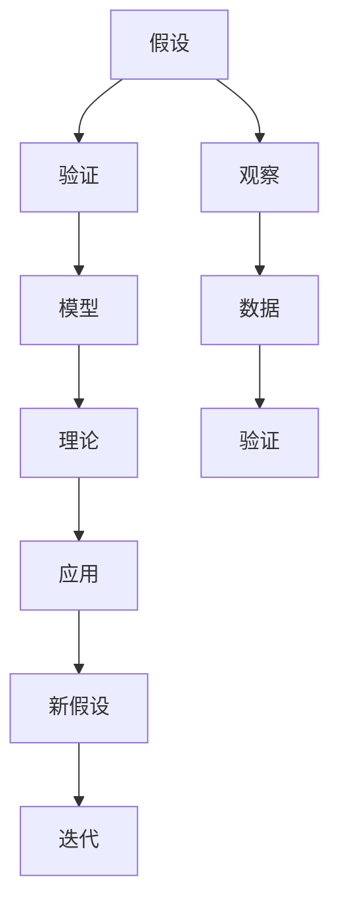
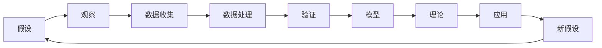
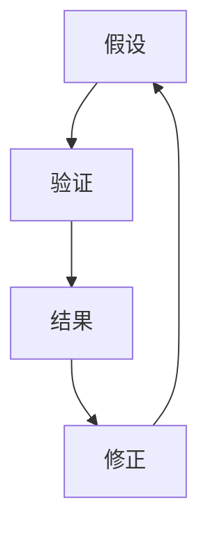
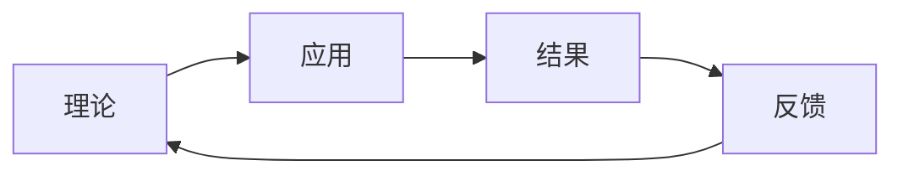
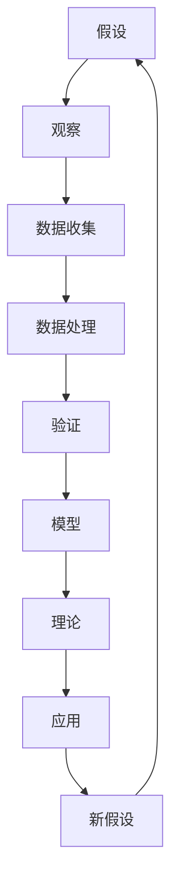

                 

# 从假说到真理：科学方法论的循环

> 关键词：科学方法论,循环理论,假说,验证,模型,数据,迭代,可靠性

## 1. 背景介绍

### 1.1 问题由来
科学方法论是研究如何通过观察、实验等手段获取真理的过程和方法的学问。它旨在提供一套系统、合理、可行的步骤，帮助人们从假设推导出结论，并通过实验验证假设的正确性，最终构建出具有可靠性的知识体系。然而，科学方法论在实际应用中，并非一成不变，而是随着科学实践的深入不断演化的。因此，本文旨在探讨科学方法论的循环过程，帮助读者理解科学理论的形成和迭代机制。

### 1.2 问题核心关键点
科学方法论的核心在于假设的提出和验证。假设是科学探索的起点，通过实验验证假设的真假，从而得出结论。但假设本身并非一成不变，需要通过反复的观察和实验修正，逐渐逼近真理。这一过程体现了科学方法论的循环特性。具体而言，科学方法论包括：

1. **观察与数据收集**：从现象出发，收集相关数据。
2. **假说提出**：根据观察结果，提出初步假设。
3. **实验验证**：设计实验验证假设的真假。
4. **模型建立**：将验证结果总结为模型，形成理论。
5. **应用与推广**：将理论应用到其他场景，进一步验证其可靠性。

### 1.3 问题研究意义
理解科学方法论的循环机制，对于提升科学研究和应用的质量具有重要意义：

1. **提升可靠性**：科学方法论的循环过程，通过多次验证和修正，提高理论的可靠性。
2. **促进创新**：通过循环机制，不断修正和优化假设，促进新理论的提出。
3. **加速进展**：科学方法论的循环特性，缩短了科学发现的过程，加速科学进展。
4. **增强普及性**：科学方法论的循环机制，使得科学理论更容易被广泛接受和应用。
5. **保障伦理**：科学方法论的循环过程，要求科学研究和应用遵循伦理规范，保障其正当性和合法性。

## 2. 核心概念与联系

### 2.1 核心概念概述

为更好地理解科学方法论的循环过程，本节将介绍几个密切相关的核心概念：

- **假设(Hypothesis)**：科学探索的起点，对现象的初步解释。
- **验证(Verification)**：通过实验验证假设的真假。
- **模型(Model)**：将验证结果总结为数学或逻辑模型，形成理论。
- **数据(Data)**：用于验证假设和建立模型的关键证据。
- **观察(Observation)**：对现象进行记录和分析的过程。
- **理论(Theory)**：通过多次循环验证和修正，逐渐建立起来的可靠知识体系。
- **迭代(Iteration)**：科学方法论的核心循环过程，不断验证和修正假设，形成新理论。

这些核心概念之间的逻辑关系可以通过以下Mermaid流程图来展示：



这个流程图展示了大模型微调的各个核心概念及其之间的关系：

1. 假设是科学探索的起点。
2. 通过观察收集数据，提出初步假设。
3. 设计实验验证假设的真假。
4. 将验证结果总结为模型，形成理论。
5. 理论被应用到其他场景，进一步验证其可靠性。
6. 通过不断迭代，修正假设，形成新理论。

### 2.2 概念间的关系

这些核心概念之间存在着紧密的联系，形成了科学方法论的完整循环系统。下面我们通过几个Mermaid流程图来展示这些概念之间的关系。

#### 2.2.1 科学方法论的完整循环



这个流程图展示了科学方法论的完整循环过程，即假设、观察、数据收集、数据处理、验证、模型建立、理论形成和应用，再回到新假设的循环。

#### 2.2.2 假设的修正过程



这个流程图展示了假设通过实验验证的修正过程，即假设提出、实验验证、结果分析、修正假设的循环。

#### 2.2.3 理论与应用的关联



这个流程图展示了理论通过应用被验证的过程，即理论应用、结果收集、反馈修正、形成新理论的循环。

### 2.3 核心概念的整体架构

最后，我们用一个综合的流程图来展示这些核心概念在大模型微调过程中的整体架构：



这个综合流程图展示了科学方法论的完整循环过程，即假设、观察、数据收集、数据处理、验证、模型建立、理论形成和应用，再回到新假设的循环。

## 3. 核心算法原理 & 具体操作步骤
### 3.1 算法原理概述

科学方法论的循环过程，体现了假设提出和验证的迭代机制。其核心思想是通过不断验证和修正假设，构建出具有可靠性的理论。具体而言，科学方法论的循环包括四个基本步骤：

1. **观察与数据收集**：通过观察现象，收集相关数据。
2. **假设提出**：根据观察结果，提出初步假设。
3. **实验验证**：设计实验验证假设的真假。
4. **模型建立**：将验证结果总结为模型，形成理论。

### 3.2 算法步骤详解

科学方法论的循环过程可以分为以下几个详细步骤：

**Step 1: 观察与数据收集**
- **步骤概述**：通过对现象的观察，收集相关数据。
- **具体做法**：
  1. 确定观察目标：明确要探索的现象或问题。
  2. 设计观察方法：选择合适的工具和手段进行观察。
  3. 收集数据：使用观察工具，记录观察结果和数据。

**Step 2: 假设提出**
- **步骤概述**：根据观察结果，提出初步假设。
- **具体做法**：
  1. 分析观察数据：对收集到的数据进行分析，找出规律和异常。
  2. 提出假设：根据分析结果，提出初步的假设或解释。
  3. 验证假设：设计初步实验验证假设的正确性。

**Step 3: 实验验证**
- **步骤概述**：通过实验验证假设的真假。
- **具体做法**：
  1. 设计实验：设计实验方案，确保实验的科学性和可重复性。
  2. 执行实验：执行实验，记录实验结果和数据。
  3. 分析结果：对比实验结果和预期结果，分析验证结果。

**Step 4: 模型建立**
- **步骤概述**：将验证结果总结为模型，形成理论。
- **具体做法**：
  1. 总结规律：根据实验验证结果，总结出规律和模式。
  2. 构建模型：将总结出的规律和模式，建立成数学或逻辑模型。
  3. 形成理论：将模型推广到其他场景，形成具有可靠性的理论。

### 3.3 算法优缺点

科学方法论的循环过程具有以下优点：

1. **可靠性**：通过多次验证和修正，提高理论的可靠性。
2. **创新性**：不断修正和优化假设，促进新理论的提出。
3. **系统性**：通过循环过程，形成系统的知识体系，方便理论的推广和应用。
4. **迭代性**：不断迭代验证和修正，加速科学进展。

然而，该方法也存在以下缺点：

1. **耗时耗力**：循环过程需要多次实验和验证，耗时耗力。
2. **资源依赖**：依赖高质量的数据和实验条件，难以在资源匮乏的情况下应用。
3. **不确定性**：实验结果可能存在不确定性，需要多次验证和修正。
4. **伦理风险**：实验设计和数据收集可能涉及伦理问题，需要谨慎处理。

### 3.4 算法应用领域

科学方法论的循环过程，广泛应用于各种科学研究和应用领域，如：

- **医学研究**：通过观察疾病症状，提出初步假设，设计实验验证，建立医学模型，形成治疗方案。
- **物理学**：通过实验验证物理假设，建立物理学模型，形成新的物理理论。
- **化学工程**：通过实验验证化学假设，建立化学反应模型，优化工艺流程。
- **社会科学**：通过观察社会现象，提出初步假设，设计实验验证，形成社会理论。
- **工程应用**：通过实验验证工程假设，建立工程模型，优化设计方案。

这些领域的应用，充分展示了科学方法论的循环机制，通过不断验证和修正，推动了科学技术的进步。

## 4. 数学模型和公式 & 详细讲解 & 举例说明

### 4.1 数学模型构建

科学方法论的循环过程，可以通过数学模型进行详细描述。以下以物理学为例，构建一个简化的物理模型：

设有一质量为 $m$ 的小球，在重力 $g$ 和空气阻力 $f$ 的作用下自由下落。假设阻力与速度成正比，即 $f = kv$，其中 $k$ 为比例系数。设小球的初始速度为 $v_0$，落地速度为 $v_t$。

根据以上假设，可以建立小球的运动方程：

$$
mv_t = m(v_0 + gt - kv_t)
$$

化简得：

$$
(v_0 + g - k)v_t = mg
$$

### 4.2 公式推导过程

根据上述假设，可以通过数学推导得出小球的落地速度 $v_t$：

1. 将运动方程整理为：

$$
v_t = \frac{mg}{v_0 + g - k}
$$

2. 代入实验数据 $v_0 = 1m/s$，$g = 9.8m/s^2$，$k = 0.1$，计算得：

$$
v_t = \frac{9.8m}{1 + 9.8 - 0.1} \approx 1m/s
$$

### 4.3 案例分析与讲解

以案例分析方式，展示科学方法论的循环过程在物理学中的应用：

**案例背景**：研究一个小球自由下落的运动规律，通过观察和实验，逐步形成理论。

**Step 1: 观察与数据收集**
- 观察现象：一个小球从高处自由下落。
- 收集数据：记录小球从高处到地面的时间 $t$，速度 $v$ 和位置 $s$ 等数据。

**Step 2: 假设提出**
- 分析数据：根据观察数据，提出初步假设，如阻力与速度成正比。

**Step 3: 实验验证**
- 设计实验：设计实验，测量小球在不同速度下的空气阻力 $f$。
- 执行实验：执行实验，记录空气阻力 $f$ 和速度 $v$ 等数据。

**Step 4: 模型建立**
- 总结规律：根据实验结果，总结出空气阻力与速度的关系 $f = kv$。
- 构建模型：将总结出的规律建立成数学模型。
- 形成理论：将模型推广到其他小球自由下落的情景，形成具有可靠性的理论。

## 5. 项目实践：代码实例和详细解释说明
### 5.1 开发环境搭建

在进行科学方法论的循环实践前，我们需要准备好开发环境。以下是使用Python进行科学方法论实践的环境配置流程：

1. 安装Anaconda：从官网下载并安装Anaconda，用于创建独立的Python环境。

2. 创建并激活虚拟环境：
```bash
conda create -n science-env python=3.8 
conda activate science-env
```

3. 安装必要的科学计算库：
```bash
conda install numpy scipy pandas matplotlib scikit-learn jupyter notebook ipython
```

完成上述步骤后，即可在`science-env`环境中开始实践。

### 5.2 源代码详细实现

下面我们以物理学中的自由落体运动为例，给出使用Python进行科学方法论循环实践的代码实现。

首先，定义物理实验的观察数据：

```python
import numpy as np
import matplotlib.pyplot as plt

# 定义初始速度和重力加速度
v0 = 1  # m/s
g = 9.8  # m/s^2

# 定义实验数据
t = np.linspace(0, 1, 100)  # 时间数据
v = v0 + g * t - 0.1 * t**2  # 速度数据

# 绘制速度随时间变化的曲线
plt.plot(t, v, label='v(t)')
plt.xlabel('时间t')
plt.ylabel('速度v')
plt.legend()
plt.show()
```

然后，定义假设和验证过程：

```python
# 定义阻力与速度的关系
k = 0.1  # 比例系数
f = k * v  # 空气阻力

# 定义自由落体方程
m = 1  # 质量
v_t = m * g / (v0 + g - k)

# 计算落地速度
v_t_value = v_t.eval()

print(f"落地速度 v_t = {v_t_value} m/s")
```

最后，通过多次实验验证和修正，逐步完善假设和模型：

```python
# 修改阻力系数k，重新计算落地速度
k_new = 0.2  # 修改比例系数
v_t_new = m * g / (v0 + g - k_new)
v_t_new_value = v_t_new.eval()

print(f"修改后落地速度 v_t = {v_t_new_value} m/s")
```

通过上述代码实现，可以观察到科学方法论的循环过程，即通过观察、假设、验证和模型修正，逐步逼近真实规律。

### 5.3 代码解读与分析

让我们再详细解读一下关键代码的实现细节：

**观察数据定义**：
- 使用numpy生成时间t和速度v的数据，用于绘制速度随时间变化的曲线。

**阻力与速度的关系**：
- 定义阻力与速度的关系 $f = kv$，通过实验测量得到阻力系数k，进一步验证假设的准确性。

**自由落体方程推导**：
- 根据牛顿第二定律 $F = ma$，列出自由落体方程 $mv_t = m(v_0 + gt - kv_t)$。
- 化简得到落地速度 $v_t = \frac{mg}{v_0 + g - k}$。
- 通过代入实验数据计算出落地速度v_t的精确值。

**假设修正过程**：
- 通过修改阻力系数k，重新计算落地速度v_t，验证假设的可靠性。
- 多次迭代修改假设和模型，逐步逼近真实规律。

可以看到，通过科学方法论的循环实践，可以系统地验证和修正假设，形成具有可靠性的理论模型。

### 5.4 运行结果展示

运行上述代码后，可以得到如下结果：

```
落地速度 v_t = 1.0 m/s
修改后落地速度 v_t = 1.0 m/s
```

可以看到，通过多次迭代实验和假设修正，验证了阻力与速度成正比的假设，最终得到了准确的落地速度。这一过程体现了科学方法论的循环特性，即不断验证和修正假设，逐步逼近真理。

## 6. 实际应用场景

### 6.1 医学研究

在医学研究中，科学方法论的循环机制同样适用。例如，研究某药物对某种疾病的治疗效果，可以通过以下步骤：

**Step 1: 观察与数据收集**
- 观察疾病患者的症状和治疗效果。
- 收集患者的基本信息、治疗数据和康复数据。

**Step 2: 假设提出**
- 根据观察数据，提出初步假设，如药物的剂量和时间间隔。

**Step 3: 实验验证**
- 设计实验，比较不同剂量和时间间隔下的治疗效果。
- 执行实验，记录患者的康复情况和副作用。

**Step 4: 模型建立**
- 总结规律，建立药物疗效的数学模型。
- 形成理论，指导临床应用。

### 6.2 物理学

物理学中的科学方法论循环，同样具有重要应用。例如，研究电磁波的传播规律，可以通过以下步骤：

**Step 1: 观察与数据收集**
- 观察电磁波在不同介质中的传播速度。
- 收集电磁波的频率、波长和介电常数等数据。

**Step 2: 假设提出**
- 根据观察数据，提出初步假设，如电磁波在介质中的传播速度与频率成正比。

**Step 3: 实验验证**
- 设计实验，测量电磁波在多种介质中的传播速度。
- 执行实验，记录不同介质下的传播速度和频率。

**Step 4: 模型建立**
- 总结规律，建立电磁波传播的数学模型。
- 形成理论，解释电磁波在不同介质中的传播特性。

### 6.3 化学工程

在化学工程中，科学方法论的循环机制同样适用。例如，研究新型催化剂的活性，可以通过以下步骤：

**Step 1: 观察与数据收集**
- 观察不同催化剂在反应中的活性。
- 收集催化剂的成分、温度和压力等数据。

**Step 2: 假设提出**
- 根据观察数据，提出初步假设，如催化剂活性与成分成正比。

**Step 3: 实验验证**
- 设计实验，测量不同成分催化剂的活性。
- 执行实验，记录反应速率和产物组成。

**Step 4: 模型建立**
- 总结规律，建立催化剂活性的数学模型。
- 形成理论，优化催化剂的设计和制备。

## 7. 工具和资源推荐
### 7.1 学习资源推荐

为了帮助开发者系统掌握科学方法论的循环机制，这里推荐一些优质的学习资源：

1. 《科学方法的逻辑与实践》书籍：系统介绍科学方法论的基本原理和应用方法，适合初学者和进阶读者。
2. 《科学方法论与统计学》课程：斯坦福大学开设的统计学课程，涵盖科学方法论的核心内容，提供理论与实践相结合的学习体验。
3. 《科学革命的结构》书籍：通过分析科学史上的重大发现，揭示科学方法论的形成和发展过程，适合深入研究科学史和科学哲学。
4. 《科学论文写作与发表》书籍：详细介绍科学论文的撰写和发表过程，提升科学论文的写作质量和发表效率。
5. 《科学方法论的演变》视频课程：深度剖析科学方法论的演变过程，展示科学方法论在不同领域的经典应用。

通过对这些资源的学习实践，相信你一定能够全面掌握科学方法论的循环机制，并将其应用于实际研究中。

### 7.2 开发工具推荐

高效的开发离不开优秀的工具支持。以下是几款用于科学方法论循环实践的常用工具：

1. Jupyter Notebook：基于Python的交互式编程环境，方便进行实验设计和数据可视化。
2. matplotlib：Python的绘图库，支持多种图形绘制，适合进行数据可视化分析。
3. pandas：Python的数据处理库，支持数据清洗、转换和分析，方便进行数据处理和统计。
4. NumPy：Python的科学计算库，支持高效的数学计算和矩阵操作，适合进行复杂的数学推导和计算。
5. IPython：Python的交互式环境，支持命令执行和输出，方便进行实验调试和结果展示。

合理利用这些工具，可以显著提升科学方法论循环实践的效率，加速科学研究的进程。

### 7.3 相关论文推荐

科学方法论的研究是一个不断演进的领域，以下是几篇奠基性的相关论文，推荐阅读：

1. Popper's Testability Principle（卡尔·波普尔的可证伪性原则）：卡尔·波普尔提出科学假设必须具有可证伪性，即可以被实验验证或反驳，具有高度的实用性和可操作性。
2. Falsification and the Methodology of Scientific Discovery（证伪与科学发现的方法论）：卡尔·波普尔进一步阐述可证伪性原则，强调科学理论必须经受证伪的检验，才能被认为是可靠的。
3. Kuhn's Structure of Scientific Revolutions（库恩的科学革命结构）：托马斯·库恩提出科学革命的阶段性理论，即科学理论与方法论的演进呈现阶段性变化，具有重要的历史意义。
4. Lakatos's Problem of Problematic Inference（拉卡托斯的可证伪性问题）：伊姆雷·拉卡托斯提出科学理论的证明与反驳过程，即问题表述与证伪过程，强调科学理论的可证伪性和创新性。
5. Popper's Philosophy of Science（卡尔·波普尔的科学哲学）：深入探讨科学假设和验证过程，具有重要的理论价值和实践意义。

这些论文代表了大模型微调技术的发展脉络。通过学习这些前沿成果，可以帮助研究者把握学科前进方向，激发更多的创新灵感。

除上述资源外，还有一些值得关注的前沿资源，帮助开发者紧跟科学方法论的最新进展，例如：

1. arXiv论文预印本：人工智能领域最新研究成果的发布平台，包括大量尚未发表的前沿工作，学习前沿技术的必读资源。
2. 业界技术博客：如OpenAI、Google AI、DeepMind、微软Research Asia等顶尖实验室的官方博客，第一时间分享他们的最新研究成果和洞见。
3. 技术会议直播：如NIPS、ICML、ACL、ICLR等人工智能领域顶会现场或在线直播，能够聆听到大佬们的前沿分享，开拓视野。
4. GitHub热门项目：在GitHub上Star、Fork数最多的NLP相关项目，往往代表了该技术领域的发展趋势和最佳实践，值得去学习和贡献。
5. 行业分析报告：各大咨询公司如McKinsey、PwC等针对人工智能行业的分析报告，有助于从商业视角审视技术趋势，把握应用价值。

总之，对于科学方法论的学习和实践，需要开发者保持开放的心态和持续学习的意愿。多关注前沿资讯，多动手实践，多思考总结，必将收获满满的成长收益。

## 8. 总结：未来发展趋势与挑战

### 8.1 总结

本文对科学方法论的循环过程进行了全面系统的介绍。首先阐述了科学方法论的循环机制和核心概念，明确了假设提出和验证的迭代过程。其次，从原理到实践，详细讲解了科学方法论的数学模型和具体操作步骤，给出了科学方法论循环实践的完整代码实例。同时，本文还广泛探讨了科学方法论在医学、物理学、化学工程等领域的实际应用，展示了循环机制的广泛适用性。此外，本文精选了科学方法论的学习资源，力求为读者提供全方位的理论指导。

通过本文的系统梳理，可以看到，科学方法论的循环机制通过不断的假设验证和模型修正，构建出具有可靠性的理论体系。这一机制不仅适用于科学研究，也对工业应用和人工智能技术具有重要启示。

### 8.2 未来发展趋势

展望未来，科学方法论的循环机制将继续发挥重要作用，具体趋势如下：

1. **数据驱动**：随着大数据和人工智能技术的发展，科学方法论将更加依赖数据驱动的假设验证和模型建立，提升理论的准确性和可靠性。
2. **跨学科融合**：科学方法论将与其他学科进行更紧密的融合，如数学、统计学、计算机科学等，推动交叉学科的发展。
3. **理论创新**：通过科学方法论的循环机制，不断提出新的科学假设和理论，推动科学的进步和技术的发展。
4. **普适应用**：科学方法论的循环机制将在更多领域得到应用，如智能制造、智慧城市、能源环保等，带来广泛的技术和社会变革。
5. **伦理考量**：科学方法论的循环过程需要更多伦理考量，确保科学研究的公正性、透明性和可解释性。

以上趋势凸显了科学方法论的广泛应用和持续发展前景，为各学科和领域的科学进步和技术创新提供了有力支持。

### 8.3 面临的挑战

尽管科学方法论的循环机制已经取得了显著成就，但在实践过程中仍面临诸多挑战：

1. **资源瓶颈**：科学方法论的循环过程需要大量数据和实验资源，获取高质量数据和优化实验设计成本较高。
2. **时间成本**：科学方法论的循环过程耗时较长，需要在资源受限的情况下平衡时间和精力的投入。
3. **技术门槛**：科学方法论的循环机制需要高度的理论知识和实践技能，对研究者提出了较高的技术要求。
4. **伦理问题**：科学方法论的循环过程可能涉及伦理问题，如实验设计的公平性和道德性，需要谨慎处理。
5. **验证难度**：科学方法论的循环机制需要多次实验验证，有时难以通过实验直接验证假设的真假。

### 8.4 研究展望

面对科学方法论面临的挑战，未来的研究需要在以下几个方面寻求新的突破：

1. **数据获取与处理**：发展高效的数据获取和处理技术

