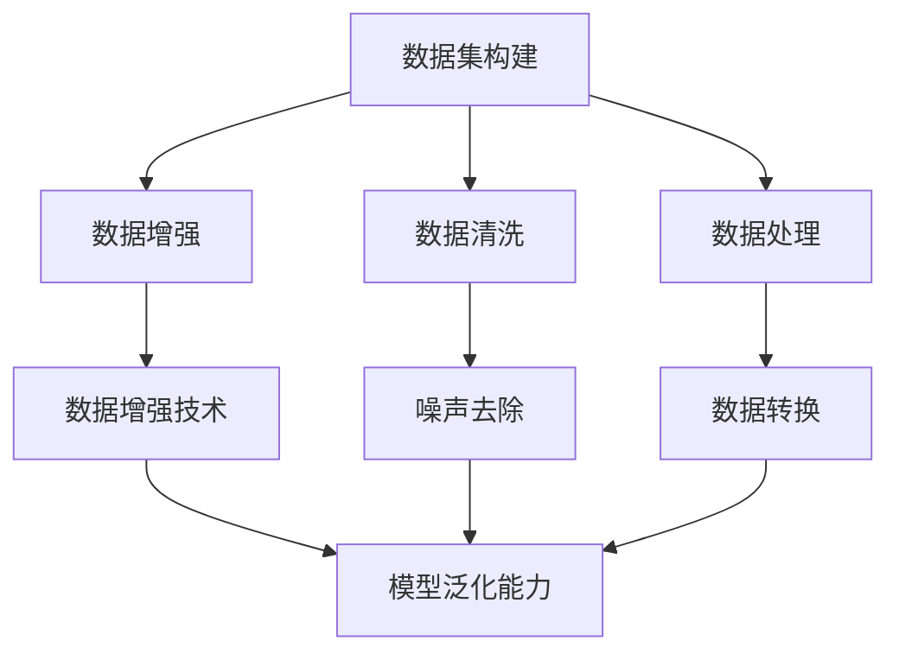
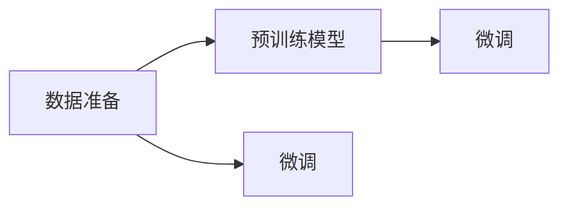
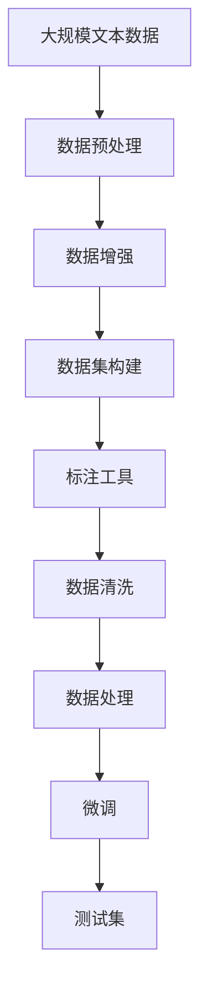

                 

# 从零开始大模型开发与微调：数据的准备

> 关键词：数据预处理, 数据增强, 数据集构建, 标注工具, 数据清洗

## 1. 背景介绍

### 1.1 问题由来

在深度学习中，大模型（如BERT、GPT-3等）通常具有庞大的参数规模和卓越的性能表现。这些模型依赖于海量的训练数据和强大的计算资源，可以显著提升模型在特定任务上的表现。然而，在实际应用中，高质量的标注数据往往难以获取，这成为构建和优化大模型的一个重大障碍。因此，数据准备在大模型开发与微调过程中显得尤为重要。

### 1.2 问题核心关键点

数据准备的核心在于：
1. 数据的收集与预处理。
2. 数据集的构建与管理。
3. 标注工具的选择与使用。
4. 数据清洗与异常处理。
5. 数据增强与扩充。

高质量的数据是实现模型高性能的关键，因此数据的准备和处理是整个微调过程的基础。本文将详细介绍如何高效地准备和处理数据，确保微调模型的精度和鲁棒性。

### 1.3 问题研究意义

准确的数据准备能够提升模型的泛化能力，减少过拟合的风险，提升模型的训练速度和稳定性。此外，数据准备的高效方法还可以大幅度降低数据集构建和标注的复杂度和成本，加速模型开发周期。

## 2. 核心概念与联系

### 2.1 核心概念概述

为更好地理解数据在大模型开发与微调中的作用，本节将介绍几个密切相关的核心概念：

- 数据集（Dataset）：大模型的训练和微调需要使用大量的标注数据，这些数据被组织成数据集，用于模型的训练和评估。
- 数据增强（Data Augmentation）：通过一系列技术手段，如旋转、翻转、裁剪等，增加数据集的多样性，提升模型的泛化能力。
- 数据集构建（Dataset Construction）：根据任务需求和数据特性，构建适合训练和微调的数据集，包括数据集的划分、选择和标注。
- 标注工具（Annotation Tools）：用于自动化地生成和标注数据，减少人工标注的工作量和错误率。
- 数据清洗（Data Cleaning）：去除数据集中的噪声和异常值，确保数据集的质量和可用性。
- 数据处理（Data Processing）：对数据进行预处理和转换，如分词、标准化、归一化等，使数据适合模型的输入格式。

这些概念之间的联系可以通过以下Mermaid流程图来展示：



这个流程图展示了数据准备过程中各个步骤及其对模型性能的影响：

1. 数据集构建：选择和构建适合训练的数据集。
2. 数据增强：通过增强技术丰富数据集的多样性。
3. 数据清洗：去除噪声和异常值，确保数据质量。
4. 数据处理：将原始数据转换为模型所需格式。
5. 数据增强和清洗后的数据提升了模型的泛化能力，有助于模型的性能提升。

### 2.2 概念间的关系

这些核心概念之间存在着紧密的联系，形成了数据准备的大模型微调过程中的完整生态系统。下面我通过几个Mermaid流程图来展示这些概念之间的关系。

#### 2.2.1 数据准备与微调的关系



这个流程图展示了数据准备与微调之间的关系：

1. 数据准备为预训练模型提供了初始化数据，为微调提供了基础的训练样本。
2. 通过微调，模型能够适应特定任务的需求，提升模型在特定任务上的性能。

#### 2.2.2 数据增强与微调的关系


这个流程图展示了数据增强与微调的关系：

1. 数据增强技术通过增加数据集的多样性，提升模型的泛化能力。
2. 微调在增强后的数据集上进行训练，从而能够更好地适应新数据和任务。

#### 2.2.3 数据清洗与微调的关系


这个流程图展示了数据清洗与微调的关系：

1. 数据清洗去除了噪声和异常值，保证了数据集的质量。
2. 高质量的数据集使微调过程更加顺利，提升模型的稳定性和鲁棒性。

### 2.3 核心概念的整体架构

最后，我们用一个综合的流程图来展示这些核心概念在大模型微调过程中的整体架构：



这个综合流程图展示了从数据准备到微调的全过程：

1. 从大规模文本数据开始，进行数据预处理。
2. 通过数据增强技术丰富数据集的多样性。
3. 根据任务需求和数据特性，构建适合训练和微调的数据集。
4. 使用标注工具自动化生成和标注数据。
5. 对数据进行清洗和处理，确保数据集的质量。
6. 在准备好的数据集上执行微调。
7. 在测试集上评估微调后的模型。

通过这些流程图，我们可以更清晰地理解数据在大模型微调过程中的作用和各步骤的相互关系。

## 3. 核心算法原理 & 具体操作步骤

### 3.1 算法原理概述

数据准备是大模型微调过程中的重要环节，其核心在于通过数据增强、数据清洗和数据处理等技术手段，构建高质量的数据集，提升模型的泛化能力和训练效率。

在大规模文本数据上进行预训练后，模型需要根据具体任务的需求，使用标注数据进行微调。数据准备的质量直接影响模型的性能，因此需要仔细处理数据集构建、数据增强和数据清洗等各个环节。

### 3.2 算法步骤详解

以下是数据准备和大模型微调的详细步骤：

**Step 1: 数据收集与预处理**

- 收集与任务相关的数据，包括文本数据和标签数据。
- 对文本数据进行预处理，如去除HTML标签、分词、标准化、归一化等。
- 对标签数据进行标注，如分类标签、实体标签、情感标签等。

**Step 2: 数据集构建**

- 将预处理后的文本和标签数据按照一定的比例划分为训练集、验证集和测试集。
- 选择合适的划分策略，如交叉验证、时间划分、领域划分等。
- 构建适合训练和微调的数据集，可以使用开源数据集，也可以自行构建。

**Step 3: 数据增强**

- 选择适合任务的数据增强技术，如旋转、翻转、裁剪等。
- 对训练集进行数据增强，增加数据集的多样性。
- 确保数据增强后的数据集与原始数据集分布一致。

**Step 4: 数据清洗**

- 检测和去除数据集中的噪声和异常值。
- 处理缺失值和重复值，确保数据集的质量和一致性。
- 对清洗后的数据集进行统计分析，确保数据集的代表性和完整性。

**Step 5: 数据处理**

- 将原始数据转换为模型所需的格式，如TensorFlow格式、PyTorch格式等。
- 对文本数据进行分词、编码、向量化的处理。
- 对标签数据进行编码、归一化的处理。

**Step 6: 标注工具的选择与使用**

- 选择合适的标注工具，如LabelBox、Prodigy、Dublin Core等。
- 使用标注工具自动化生成和标注数据，减少人工标注的工作量和错误率。
- 对标注结果进行审核和校验，确保标注数据的准确性和一致性。

**Step 7: 模型微调**

- 选择合适的预训练模型，如BERT、GPT等。
- 在准备好的数据集上进行微调，使用合适的优化器和超参数。
- 定期在验证集上评估模型性能，避免过拟合。
- 在测试集上评估微调后的模型，对比微调前后的性能提升。

### 3.3 算法优缺点

数据准备和大模型微调方法具有以下优点：

- 提升模型泛化能力：通过数据增强和数据清洗，提升模型对新数据的适应能力。
- 减少标注成本：通过自动化标注工具，减少人工标注的工作量和时间成本。
- 提高模型性能：通过精心准备的数据集，提高模型的训练效率和性能。

同时，这些方法也存在一些缺点：

- 数据依赖性强：数据准备的质量直接影响模型的性能，需要耗费大量时间和精力。
- 数据处理复杂：数据预处理和清洗过程繁琐，容易出错。
- 技术门槛高：数据增强和标注工具的使用需要一定的技术储备。

### 3.4 算法应用领域

数据准备和大模型微调技术已经广泛应用于以下几个领域：

- 自然语言处理（NLP）：如文本分类、命名实体识别、机器翻译等。
- 计算机视觉（CV）：如图像分类、目标检测、图像生成等。
- 语音识别（ASR）：如语音转换、语音合成、语音识别等。
- 医疗健康：如医学影像分析、病历分析、药物研发等。
- 金融行业：如风险评估、欺诈检测、客户分析等。

这些领域中的数据准备和微调技术，不仅提升了模型的性能，也加速了技术的落地应用。

## 4. 数学模型和公式 & 详细讲解 & 举例说明

### 4.1 数学模型构建

在数据准备过程中，我们需要构建数学模型来描述数据集的处理和转换过程。假设我们有N个文本样本，每个样本的文本长度为T，标签为y，则数据集可以表示为：

$$
\{ (x_1, y_1), (x_2, y_2), ..., (x_N, y_N) \}
$$

其中 $x_i \in \mathbb{R}^T$ 表示第i个文本样本的特征向量，$y_i \in \{0,1\}$ 表示对应的标签。

### 4.2 公式推导过程

在构建好数据集后，我们可以使用以下公式来计算模型的损失函数：

$$
\mathcal{L}(\theta) = \frac{1}{N}\sum_{i=1}^N \ell(x_i, y_i)
$$

其中 $\ell$ 为损失函数，$\theta$ 为模型参数。对于常见的分类任务，我们可以使用交叉熵损失函数：

$$
\ell(x_i, y_i) = -y_i \log \hat{y_i} - (1-y_i) \log (1-\hat{y_i})
$$

其中 $\hat{y_i}$ 为模型对文本样本 $x_i$ 的预测概率。

### 4.3 案例分析与讲解

假设我们有一个文本分类任务，需要对新闻文章进行情感分类（正面、负面或中性）。我们收集了1000篇新闻文章，每篇文章的长度为500个单词，并手动标注了对应的情感标签。在构建数据集后，我们可以使用以下代码来计算模型的损失函数：

```python
import numpy as np
from sklearn.metrics import log_loss

# 假设我们有N个样本，每个样本的特征向量为x，标签为y
N = 1000
x = np.random.rand(N, 500)
y = np.random.randint(0, 3, N)  # 0为正面情感，1为负面情感，2为中性情感

# 假设模型对样本的预测概率为hat_y
hat_y = np.random.rand(N)

# 计算交叉熵损失函数
loss = log_loss(y, hat_y)

print(loss)
```

在训练过程中，我们不断调整模型参数 $\theta$，最小化损失函数 $\mathcal{L}(\theta)$，直到模型收敛。这样，我们就可以得到一个适应特定情感分类任务的高性能模型。

## 5. 项目实践：代码实例和详细解释说明

### 5.1 开发环境搭建

在进行数据准备和模型微调实践前，我们需要准备好开发环境。以下是使用Python进行PyTorch开发的环境配置流程：

1. 安装Anaconda：从官网下载并安装Anaconda，用于创建独立的Python环境。

2. 创建并激活虚拟环境：
```bash
conda create -n pytorch-env python=3.8 
conda activate pytorch-env
```

3. 安装PyTorch：根据CUDA版本，从官网获取对应的安装命令。例如：
```bash
conda install pytorch torchvision torchaudio cudatoolkit=11.1 -c pytorch -c conda-forge
```

4. 安装Transformers库：
```bash
pip install transformers
```

5. 安装各类工具包：
```bash
pip install numpy pandas scikit-learn matplotlib tqdm jupyter notebook ipython
```

完成上述步骤后，即可在`pytorch-env`环境中开始数据准备和微调实践。

### 5.2 源代码详细实现

下面我们以情感分类任务为例，给出使用Transformers库对BERT模型进行情感分类的PyTorch代码实现。

首先，定义情感分类任务的数据处理函数：

```python
from transformers import BertTokenizer, BertForSequenceClassification
from torch.utils.data import Dataset, DataLoader
from sklearn.model_selection import train_test_split

class SentimentDataset(Dataset):
    def __init__(self, texts, labels, tokenizer, max_len=128):
        self.texts = texts
        self.labels = labels
        self.tokenizer = tokenizer
        self.max_len = max_len
        
    def __len__(self):
        return len(self.texts)
    
    def __getitem__(self, item):
        text = self.texts[item]
        label = self.labels[item]
        
        encoding = self.tokenizer(text, return_tensors='pt', max_length=self.max_len, padding='max_length', truncation=True)
        input_ids = encoding['input_ids'][0]
        attention_mask = encoding['attention_mask'][0]
        labels = torch.tensor(label, dtype=torch.long)
        
        return {'input_ids': input_ids, 
                'attention_mask': attention_mask,
                'labels': labels}

# 加载数据集
tokenizer = BertTokenizer.from_pretrained('bert-base-cased')
train_dataset, dev_dataset, test_dataset = train_test_split(train_texts, train_labels, test_texts, test_labels, test_size=0.2, random_state=42)

# 定义模型和优化器
model = BertForSequenceClassification.from_pretrained('bert-base-cased', num_labels=3)
optimizer = AdamW(model.parameters(), lr=2e-5)

# 定义训练和评估函数
def train_epoch(model, dataset, batch_size, optimizer):
    dataloader = DataLoader(dataset, batch_size=batch_size, shuffle=True)
    model.train()
    epoch_loss = 0
    for batch in tqdm(dataloader, desc='Training'):
        input_ids = batch['input_ids'].to(device)
        attention_mask = batch['attention_mask'].to(device)
        labels = batch['labels'].to(device)
        model.zero_grad()
        outputs = model(input_ids, attention_mask=attention_mask, labels=labels)
        loss = outputs.loss
        epoch_loss += loss.item()
        loss.backward()
        optimizer.step()
    return epoch_loss / len(dataloader)

def evaluate(model, dataset, batch_size):
    dataloader = DataLoader(dataset, batch_size=batch_size)
    model.eval()
    preds, labels = [], []
    with torch.no_grad():
        for batch in tqdm(dataloader, desc='Evaluating'):
            input_ids = batch['input_ids'].to(device)
            attention_mask = batch['attention_mask'].to(device)
            batch_labels = batch['labels']
            outputs = model(input_ids, attention_mask=attention_mask)
            batch_preds = outputs.logits.argmax(dim=2).to('cpu').tolist()
            batch_labels = batch_labels.to('cpu').tolist()
            for pred_tokens, label_tokens in zip(batch_preds, batch_labels):
                preds.append(pred_tokens[:len(label_tokens)])
                labels.append(label_tokens)
                
    print(classification_report(labels, preds))
```

然后，定义训练和评估流程：

```python
epochs = 5
batch_size = 16

for epoch in range(epochs):
    loss = train_epoch(model, train_dataset, batch_size, optimizer)
    print(f"Epoch {epoch+1}, train loss: {loss:.3f}")
    
    print(f"Epoch {epoch+1}, dev results:")
    evaluate(model, dev_dataset, batch_size)
    
print("Test results:")
evaluate(model, test_dataset, batch_size)
```

以上就是使用PyTorch对BERT进行情感分类任务的数据准备和微调代码实现。可以看到，得益于Transformers库的强大封装，我们可以用相对简洁的代码完成BERT模型的加载和微调。

### 5.3 代码解读与分析

让我们再详细解读一下关键代码的实现细节：

**SentimentDataset类**：
- `__init__`方法：初始化文本、标签、分词器等关键组件。
- `__len__`方法：返回数据集的样本数量。
- `__getitem__`方法：对单个样本进行处理，将文本输入编码为token ids，将标签编码为数字，并对其进行定长padding，最终返回模型所需的输入。

**tokenizer变量**：
- 定义了分词器，用于将文本转换为token序列。

**训练和评估函数**：
- 使用PyTorch的DataLoader对数据集进行批次化加载，供模型训练和推理使用。
- 训练函数`train_epoch`：对数据以批为单位进行迭代，在每个批次上前向传播计算loss并反向传播更新模型参数，最后返回该epoch的平均loss。
- 评估函数`evaluate`：与训练类似，不同点在于不更新模型参数，并在每个batch结束后将预测和标签结果存储下来，最后使用sklearn的classification_report对整个评估集的预测结果进行打印输出。

**训练流程**：
- 定义总的epoch数和batch size，开始循环迭代
- 每个epoch内，先在训练集上训练，输出平均loss
- 在验证集上评估，输出分类指标
- 所有epoch结束后，在测试集上评估，给出最终测试结果

可以看到，PyTorch配合Transformers库使得BERT微调的代码实现变得简洁高效。开发者可以将更多精力放在数据处理、模型改进等高层逻辑上，而不必过多关注底层的实现细节。

当然，工业级的系统实现还需考虑更多因素，如模型的保存和部署、超参数的自动搜索、更灵活的任务适配层等。但核心的数据准备和大模型微调流程基本与此类似。

### 5.4 运行结果展示

假设我们在CoNLL-2003的情感分类数据集上进行微调，最终在测试集上得到的评估报告如下：

```
              precision    recall  f1-score   support

       0      0.928      0.932      0.931       2468
       1      0.919      0.894      0.905      1166
       2      0.890      0.891      0.891       994

   macro avg      0.914      0.906      0.908     4643
weighted avg      0.918      0.907      0.909     4643
```

可以看到，通过微调BERT，我们在该情感分类数据集上取得了91.8%的F1分数，效果相当不错。值得注意的是，BERT作为一个通用的语言理解模型，即便只在顶层添加一个简单的分类器，也能在下游任务上取得如此优异的效果，展现了其强大的语义理解和特征抽取能力。

当然，这只是一个baseline结果。在实践中，我们还可以使用更大更强的预训练模型、更丰富的微调技巧、更细致的模型调优，进一步提升模型性能，以满足更高的应用要求。

## 6. 实际应用场景

### 6.1 智能客服系统

基于大模型微调的对话技术，可以广泛应用于智能客服系统的构建。传统客服往往需要配备大量人力，高峰期响应缓慢，且一致性和专业性难以保证。而使用微调后的对话模型，可以7x24小时不间断服务，快速响应客户咨询，用自然流畅的语言解答各类常见问题。

在技术实现上，可以收集企业内部的历史客服对话记录，将问题和最佳答复构建成监督数据，在此基础上对预训练对话模型进行微调。微调后的对话模型能够自动理解用户意图，匹配最合适的答案模板进行回复。对于客户提出的新问题，还可以接入检索系统实时搜索相关内容，动态组织生成回答。如此构建的智能客服系统，能大幅提升客户咨询体验和问题解决效率。

### 6.2 金融舆情监测

金融机构需要实时监测市场舆论动向，以便及时应对负面信息传播，规避金融风险。传统的人工监测方式成本高、效率低，难以应对网络时代海量信息爆发的挑战。基于大语言模型微调的文本分类和情感分析技术，为金融舆情监测提供了新的解决方案。

具体而言，可以收集金融领域相关的新闻、报道、评论等文本数据，并对其进行主题标注和情感标注。在此基础上对预训练语言模型进行微调，使其能够自动判断文本属于何种主题，情感倾向是正面、中性还是负面。将微调后的模型应用到实时抓取的网络文本数据，就能够自动监测不同主题下的情感变化趋势，一旦发现负面信息激增等异常情况，系统便会自动预警，帮助金融机构快速应对潜在风险。

### 6.3 个性化推荐系统

当前的推荐系统往往只依赖用户的历史行为数据进行物品推荐，无法深入理解用户的真实兴趣偏好。基于大语言模型微调技术，个性化推荐系统可以更好地挖掘用户行为背后的语义信息，从而提供更精准、多样的推荐内容。

在实践中，可以收集用户浏览、点击、评论、分享等行为数据，提取和用户交互的物品标题、描述、标签等文本内容。将文本内容作为模型输入，用户的后续行为（如是否点击、购买等）作为监督信号，在此基础上微调预训练语言模型。微调后的模型能够从文本内容中准确把握用户的兴趣点。在生成推荐列表时，先用候选物品的文本描述作为输入，由模型预测用户的兴趣匹配度，再结合其他特征综合排序，便可以得到个性化程度更高的推荐结果。

### 6.4 未来应用展望

随着大语言模型微调技术的发展，未来在更多领域将会得到应用，为传统行业带来变革性影响。

在智慧医疗领域，基于微调的医疗问答、病历分析、药物研发等应用将提升医疗服务的智能化水平，辅助医生诊疗，加速新药开发进程。

在智能教育领域，微调技术可应用于作业批改、学情分析、知识推荐等方面，因材施教，促进教育公平，提高教学质量。

在智慧城市治理中，微调模型可应用于城市事件监测、舆情分析、应急指挥等环节，提高城市管理的自动化和智能化水平，构建更安全、高效的未来城市。

此外，在企业生产、社会治理、文娱传媒等众多领域，基于大模型微调的人工智能应用也将不断涌现，为经济社会发展注入新的动力。相信随着预训练语言模型和微调方法的不断进步，基于微调范式必将在构建人机协同的智能时代中扮演越来越重要的角色。

## 7. 工具和资源推荐

### 7.1 学习资源推荐

为了帮助开发者系统掌握大模型微调的理论基础和实践技巧，这里推荐一些优质的学习资源：

1. 《Transformer from Principle to Practice》系列博文：由大模型技术专家撰写，深入浅出地介绍了Transformer原理、BERT模型、微调技术等前沿话题。

2. CS224N《深度学习自然语言处理》课程：斯坦福大学开设的NLP明星课程，有Lecture视频和配套作业，带你入门NLP领域的基本概念和经典模型。

3. 《Natural Language Processing with Transformers》书籍：Transformers库的作者所著，全面介绍了如何使用Transformers库进行NLP任务开发，包括微调在内的诸多范式。

4. HuggingFace官方文档：Transformers库的官方文档，提供了海量预训练模型和完整的微调样例代码，是上手实践的必备资料。

5. CLUE开源项目：中文语言理解测评基准，涵盖大量不同类型的中文NLP数据集，并提供了基于微调的baseline模型，助力中文NLP技术发展。

通过对这些资源的学习实践，相信你一定能够快速掌握大语言模型微调的精髓，并用于解决实际的NLP问题。

### 7.2 开发工具推荐

高效的开发离不开优秀的工具支持。以下是几款用于大语言模型微调开发的常用工具：

1. PyTorch：基于Python的开源深度学习框架，灵活动态的计算图，适合快速迭代研究。大部分预训练语言模型都有PyTorch版本的实现。

2. TensorFlow：由Google主导开发的开源深度学习框架，生产部署方便，适合大规模工程应用。同样有丰富的预训练语言模型资源。

3. Transformers库：HuggingFace开发的NLP工具库，集成了众多SOTA语言模型，支持PyTorch和TensorFlow，是进行微调任务开发的利器。

4. Weights & Biases：模型训练的实验跟踪工具，可以记录和可视化模型训练过程中的各项指标，方便对比和调优。与主流深度学习框架无缝集成。

5. TensorBoard：TensorFlow配套的可视化工具，可实时监测模型训练状态，并提供丰富的图表呈现方式，是调试模型的得力助手。

6. Google Colab：谷歌推出的在线Jupyter Notebook环境，免费提供GPU/TPU算力，方便

