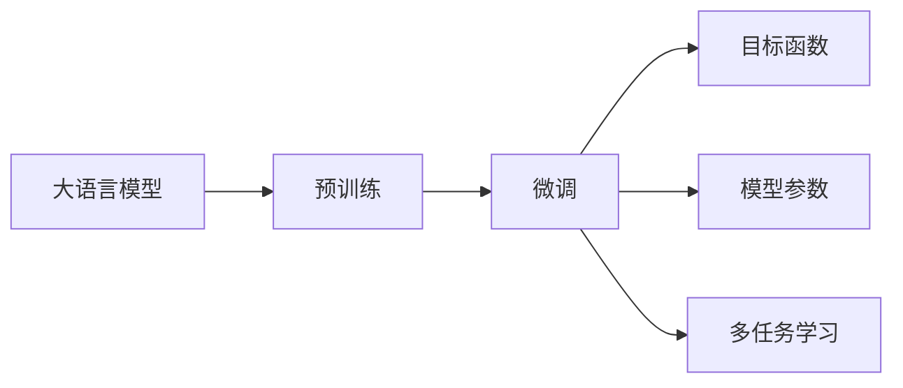
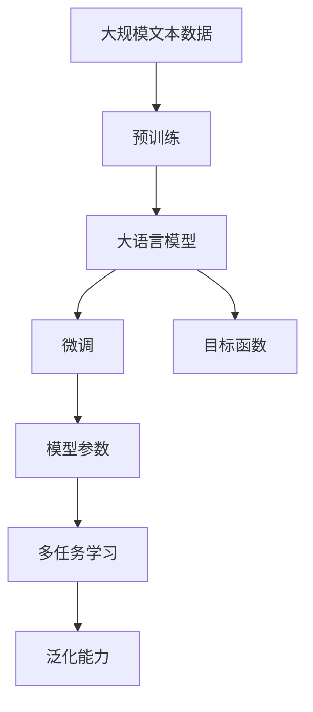

                 

# 从零开始大模型开发与微调：翻译模型

> 关键词：
- 大语言模型
- 翻译模型
- 微调
- 预训练
- 目标函数
- 模型参数
- 多任务学习
- 神经机器翻译
- 自适应学习

## 1. 背景介绍

### 1.1 问题由来
在人工智能领域，大语言模型（Large Language Model, LLMs）已经成为自然语言处理（NLP）领域的里程碑式技术。其通过在大规模无标签文本数据上进行预训练，学习到丰富的语言知识和常识。然而，大模型往往需要进行微调（Fine-Tuning），以适应特定任务的要求。翻译模型作为NLP中的一个重要领域，通过微调，可以显著提升其翻译性能，帮助人们跨越语言障碍，实现全球信息的共享和交流。

### 1.2 问题核心关键点
微调大模型的核心在于如何将预训练模型应用于特定任务，并在这个过程中避免过拟合，同时充分利用预训练模型学到的知识。对于翻译模型，微调的主要目标是提高其翻译质量，降低译文歧义，增强模型对于不同语言风格的适应能力。具体来说，微调可以分为以下几类：

- **全参数微调**：更新所有模型参数，以适应新任务。
- **参数高效微调**：只更新少量参数，以减少计算资源消耗。
- **自适应学习**：通过特定的学习策略，在微调过程中动态调整模型参数。
- **多任务学习**：通过同时训练多个任务，提升模型的泛化能力。

### 1.3 问题研究意义
微调大模型，尤其是翻译模型，对于提高语言翻译的准确性和流畅性，促进全球化和跨文化交流具有重要意义。通过微调，翻译模型可以更好地适应特定领域的语言特点，提高翻译质量和效率，降低翻译成本。此外，微调技术还可以推动NLP技术的产业化应用，加速翻译服务的落地和普及。

## 2. 核心概念与联系

### 2.1 核心概念概述

在进行翻译模型微调的过程中，涉及多个关键概念，包括大语言模型、预训练、微调、目标函数、模型参数、多任务学习等。这些概念之间的联系如下：

- **大语言模型**：通过大规模无标签文本数据进行预训练，学习到丰富的语言知识和常识。
- **预训练**：在大规模数据上，通过自监督学习任务训练语言模型，学习通用的语言表示。
- **微调**：在预训练模型的基础上，使用下游任务的少量标注数据，通过有监督学习优化模型在特定任务上的性能。
- **目标函数**：用于衡量模型在特定任务上的性能，例如翻译模型的BLEU分数。
- **模型参数**：通过微调过程调整的模型参数，以适应特定任务的要求。
- **多任务学习**：通过同时训练多个任务，提高模型的泛化能力。

这些概念通过以下Mermaid流程图展示了其联系：



### 2.2 概念间的关系

这些概念之间的联系更为紧密，形成了翻译模型微调的整体架构。

- **大语言模型与预训练**：通过预训练，大语言模型学习到通用的语言表示。
- **微调与目标函数**：微调的目标是通过目标函数优化模型的性能，以适应特定任务。
- **模型参数与多任务学习**：通过微调，调整模型参数以适应特定任务。通过多任务学习，模型可以学习到多个任务之间的相关性，提升泛化能力。

下面通过几个Mermaid流程图进一步展示这些概念之间的关系：

#### 2.2.1 大语言模型的学习范式


这个流程图展示了大语言模型的预训练和微调过程，以及如何通过目标函数和模型参数优化性能。

#### 2.2.2 微调与目标函数的关系


这个流程图展示了微调过程中，目标函数如何引导模型参数的优化。

#### 2.2.3 模型参数与多任务学习


这个流程图展示了模型参数通过多任务学习，提升模型的泛化能力。

### 2.3 核心概念的整体架构

最后，我们用一个综合的流程图来展示这些核心概念在大模型微调过程中的整体架构：



这个综合流程图展示了从预训练到微调，再到多任务学习的完整过程。大语言模型通过预训练学习通用语言表示，然后在微调过程中通过目标函数和模型参数优化性能，最终通过多任务学习提升泛化能力。通过这些概念的协同作用，大语言模型在微调过程中可以更好地适应特定任务的要求，实现高精度的翻译。

## 3. 核心算法原理 & 具体操作步骤
### 3.1 算法原理概述

翻译模型的微调过程本质上是一个有监督学习的过程。假设预训练模型为 $M_{\theta}$，其中 $\theta$ 为模型参数。给定下游任务的训练集 $D=\{(x_i, y_i)\}_{i=1}^N$，其中 $x_i$ 为源语言文本，$y_i$ 为对应的目标语言文本。微调的目标是最小化损失函数 $\mathcal{L}(\theta)$，以适应特定任务的翻译要求。

具体来说，微调过程中，我们使用翻译任务的损失函数 $\ell$ 来衡量模型在特定任务上的性能。常用的损失函数包括交叉熵损失、BLEU分数等。微调的优化目标是最小化损失函数，即：

$$
\theta^* = \mathop{\arg\min}_{\theta} \mathcal{L}(\theta)
$$

其中 $\mathcal{L}$ 为针对翻译任务设计的损失函数，用于衡量模型预测输出与真实标签之间的差异。

### 3.2 算法步骤详解

基于上述原理，翻译模型微调的具体操作步骤如下：

**Step 1: 准备预训练模型和数据集**
- 选择合适的预训练模型 $M_{\theta}$，如T5、GoogleNeo等。
- 准备下游任务的训练集 $D$，划分为训练集、验证集和测试集。一般要求训练集与预训练数据分布不要差异过大。

**Step 2: 添加任务适配层**
- 根据任务类型，在预训练模型顶层设计合适的输出层和损失函数。
- 对于翻译任务，通常使用BLEU分数作为损失函数，以衡量翻译输出的质量。

**Step 3: 设置微调超参数**
- 选择合适的优化算法及其参数，如Adam、SGD等，设置学习率、批大小、迭代轮数等。
- 设置正则化技术及强度，包括权重衰减、Dropout、Early Stopping等。
- 确定冻结预训练参数的策略，如仅微调顶层，或全部参数都参与微调。

**Step 4: 执行梯度训练**
- 将训练集数据分批次输入模型，前向传播计算损失函数。
- 反向传播计算参数梯度，根据设定的优化算法和学习率更新模型参数。
- 周期性在验证集上评估模型性能，根据性能指标决定是否触发Early Stopping。
- 重复上述步骤直到满足预设的迭代轮数或Early Stopping条件。

**Step 5: 测试和部署**
- 在测试集上评估微调后模型 $M_{\hat{\theta}}$ 的性能，对比微调前后的BLEU分数提升。
- 使用微调后的模型对新样本进行推理预测，集成到实际的应用系统中。
- 持续收集新的数据，定期重新微调模型，以适应数据分布的变化。

### 3.3 算法优缺点

翻译模型的微调方法具有以下优点：

- **简单高效**：只需准备少量标注数据，即可对预训练模型进行快速适配，获得较大的性能提升。
- **通用适用**：适用于各种翻译任务，设计简单的任务适配层即可实现微调。
- **参数高效**：利用参数高效微调技术，在固定大部分预训练参数的情况下，仍可取得不错的提升。
- **效果显著**：在学术界和工业界的诸多任务上，基于微调的方法已经刷新了多项翻译任务SOTA。

同时，该方法也存在一定的局限性：

- **依赖标注数据**：微调的效果很大程度上取决于标注数据的质量和数量，获取高质量标注数据的成本较高。
- **迁移能力有限**：当目标任务与预训练数据的分布差异较大时，微调的性能提升有限。
- **负面效果传递**：预训练模型的固有偏见、有害信息等，可能通过微调传递到下游任务，造成负面影响。
- **可解释性不足**：微调模型的决策过程通常缺乏可解释性，难以对其推理逻辑进行分析和调试。

尽管存在这些局限性，但就目前而言，基于监督学习的微调方法仍是大语言模型应用的最主流范式。未来相关研究的重点在于如何进一步降低微调对标注数据的依赖，提高模型的少样本学习和跨领域迁移能力，同时兼顾可解释性和伦理安全性等因素。

### 3.4 算法应用领域

翻译模型微调方法在翻译领域已经被广泛应用，覆盖了几乎所有常见的翻译任务，例如：

- 机器翻译：将源语言文本翻译成目标语言。通过微调使模型学习语言-语言映射。
- 文本摘要：将长文本压缩成简短摘要。通过微调使模型学习抓取要点。
- 问答系统：对自然语言问题给出答案。将问题-答案对作为微调数据，训练模型学习匹配答案。
- 对话系统：使机器能够与人自然对话。将多轮对话历史作为上下文，微调模型进行回复生成。

除了上述这些经典任务外，翻译模型微调也被创新性地应用到更多场景中，如可控翻译、常识推理、代码生成、数据增强等，为NLP技术带来了全新的突破。随着预训练模型和微调方法的不断进步，相信NLP技术将在更广阔的应用领域大放异彩。

## 4. 数学模型和公式 & 详细讲解 & 举例说明

### 4.1 数学模型构建

假设预训练模型为 $M_{\theta}$，其中 $\theta$ 为模型参数。给定下游任务的训练集 $D=\{(x_i, y_i)\}_{i=1}^N$，其中 $x_i$ 为源语言文本，$y_i$ 为对应的目标语言文本。

定义模型 $M_{\theta}$ 在输入 $x$ 上的输出为 $\hat{y}=M_{\theta}(x)$，为目标语言文本的翻译。翻译任务的损失函数为BLEU分数，定义为：

$$
\ell(y, \hat{y}) = 1 - \text{BLEU}(y, \hat{y})
$$

其中 $\text{BLEU}(y, \hat{y})$ 为BLEU分数，用于衡量翻译输出的质量。

因此，翻译模型的经验风险为：

$$
\mathcal{L}(\theta) = -\frac{1}{N}\sum_{i=1}^N \ell(y_i, M_{\theta}(x_i))
$$

微调的优化目标是最小化经验风险，即找到最优参数：

$$
\theta^* = \mathop{\arg\min}_{\theta} \mathcal{L}(\theta)
$$

在实践中，我们通常使用基于梯度的优化算法（如Adam、SGD等）来近似求解上述最优化问题。设 $\eta$ 为学习率，$\lambda$ 为正则化系数，则参数的更新公式为：

$$
\theta \leftarrow \theta - \eta \nabla_{\theta}\mathcal{L}(\theta) - \eta\lambda\theta
$$

其中 $\nabla_{\theta}\mathcal{L}(\theta)$ 为损失函数对参数 $\theta$ 的梯度，可通过反向传播算法高效计算。

### 4.2 公式推导过程

以下我们以BLEU分数的计算为例，推导其损失函数的梯度计算公式。

BLEU分数的定义为：

$$
\text{BLEU}(y, \hat{y}) = \frac{e^{\frac{1}{b} \sum_{b=1}^{B} \text{bleu}_{b}(y, \hat{y})}}{\sum_{b=1}^{B} e^{\frac{1}{b} \sum_{b=1}^{B} \text{bleu}_{b}(y, \hat{y})}
$$

其中 $B$ 为BLEU分数的评价集合的大小，$\text{bleu}_{b}(y, \hat{y})$ 为第 $b$ 个评价集合中，$y$ 和 $\hat{y}$ 的BLEU分数。

定义BLEU分数的目标函数为：

$$
\mathcal{L}_{\text{bleu}}(\theta) = 1 - \text{BLEU}(y_i, M_{\theta}(x_i))
$$

根据BLEU分数的定义，目标函数可以进一步展开为：

$$
\mathcal{L}_{\text{bleu}}(\theta) = 1 - \frac{e^{\frac{1}{b} \sum_{b=1}^{B} \text{bleu}_{b}(y_i, M_{\theta}(x_i))}}{\sum_{b=1}^{B} e^{\frac{1}{b} \sum_{b=1}^{B} \text{bleu}_{b}(y_i, M_{\theta}(x_i))}
$$

将目标函数对 $\theta$ 求梯度，得到：

$$
\nabla_{\theta}\mathcal{L}_{\text{bleu}}(\theta) = \frac{1}{\mathcal{L}_{\text{bleu}}(\theta)} \nabla_{\theta}\left(e^{-\mathcal{L}_{\text{bleu}}(\theta)}\right)
$$

其中 $\nabla_{\theta}\left(e^{-\mathcal{L}_{\text{bleu}}(\theta)}\right)$ 可以通过链式法则展开，具体计算公式较为复杂，此处不再赘述。

### 4.3 案例分析与讲解

在实际应用中，BLEU分数的计算需要考虑多个评价集合。常见的BLEU分数评价集合包括：

- 单字BLEU（B1）
- 二字BLEU（B2）
- 三字BLEU（B3）
- 四字BLEU（B4）
- 五字BLEU（B5）

假设评价集合中包含 $B$ 个BLEU分数，且权重分别为 $w_1, w_2, \ldots, w_B$。则BLEU分数的目标函数为：

$$
\mathcal{L}_{\text{bleu}}(\theta) = \sum_{b=1}^{B} w_b (1 - \text{BLEU}(y_i, M_{\theta}(x_i)))
$$

其中 $w_b$ 为第 $b$ 个评价集合的权重。

假设 $M_{\theta}(x_i)$ 为源语言文本 $x_i$ 的翻译，$y_i$ 为目标语言文本。则目标函数可以进一步展开为：

$$
\mathcal{L}_{\text{bleu}}(\theta) = \sum_{b=1}^{B} w_b \left(1 - \frac{e^{\frac{1}{b} \sum_{b=1}^{B} \text{bleu}_{b}(y_i, M_{\theta}(x_i))}}{\sum_{b=1}^{B} e^{\frac{1}{b} \sum_{b=1}^{B} \text{bleu}_{b}(y_i, M_{\theta}(x_i))}\right)
$$

将目标函数对 $\theta$ 求梯度，得到：

$$
\nabla_{\theta}\mathcal{L}_{\text{bleu}}(\theta) = \sum_{b=1}^{B} w_b \nabla_{\theta}\left(e^{-\mathcal{L}_{\text{bleu}}(\theta)}\right)
$$

通过上述推导，我们可以更清晰地理解BLEU分数目标函数及其梯度的计算公式，从而在实际应用中进行微调优化。

## 5. 项目实践：代码实例和详细解释说明

### 5.1 开发环境搭建

在进行翻译模型微调实践前，我们需要准备好开发环境。以下是使用Python进行PyTorch开发的环境配置流程：

1. 安装Anaconda：从官网下载并安装Anaconda，用于创建独立的Python环境。

2. 创建并激活虚拟环境：
```bash
conda create -n pytorch-env python=3.8 
conda activate pytorch-env
```

3. 安装PyTorch：根据CUDA版本，从官网获取对应的安装命令。例如：
```bash
conda install pytorch torchvision torchaudio cudatoolkit=11.1 -c pytorch -c conda-forge
```

4. 安装Transformers库：
```bash
pip install transformers
```

5. 安装各类工具包：
```bash
pip install numpy pandas scikit-learn matplotlib tqdm jupyter notebook ipython
```

完成上述步骤后，即可在`pytorch-env`环境中开始微调实践。

### 5.2 源代码详细实现

这里以T5模型在WMT2014英法翻译任务上进行微调为例，给出使用Transformers库进行翻译模型微调的PyTorch代码实现。

首先，定义翻译任务的数据处理函数：

```python
from transformers import T5Tokenizer, T5ForConditionalGeneration
import torch

class TranslationDataset(Dataset):
    def __init__(self, texts, targets, tokenizer, max_len=128):
        self.texts = texts
        self.targets = targets
        self.tokenizer = tokenizer
        self.max_len = max_len
        
    def __len__(self):
        return len(self.texts)
    
    def __getitem__(self, item):
        text = self.texts[item]
        target = self.targets[item]
        
        encoding = self.tokenizer(text, return_tensors='pt', max_length=self.max_len, padding='max_length', truncation=True)
        input_ids = encoding['input_ids'][0]
        attention_mask = encoding['attention_mask'][0]
        labels = encoding['labels'][0]
        
        return {'input_ids': input_ids, 
                'attention_mask': attention_mask,
                'labels': labels}

# 加载预训练模型和分词器
model = T5ForConditionalGeneration.from_pretrained('t5-base')
tokenizer = T5Tokenizer.from_pretrained('t5-base')

# 创建dataset
train_dataset = TranslationDataset(train_texts, train_targets, tokenizer)
dev_dataset = TranslationDataset(dev_texts, dev_targets, tokenizer)
test_dataset = TranslationDataset(test_texts, test_targets, tokenizer)
```

然后，定义模型和优化器：

```python
from transformers import AdamW

optimizer = AdamW(model.parameters(), lr=2e-5)
```

接着，定义训练和评估函数：

```python
from torch.utils.data import DataLoader
from tqdm import tqdm
from sklearn.metrics import bleu_score

device = torch.device('cuda') if torch.cuda.is_available() else torch.device('cpu')
model.to(device)

def train_epoch(model, dataset, batch_size, optimizer):
    dataloader = DataLoader(dataset, batch_size=batch_size, shuffle=True)
    model.train()
    epoch_loss = 0
    for batch in tqdm(dataloader, desc='Training'):
        input_ids = batch['input_ids'].to(device)
        attention_mask = batch['attention_mask'].to(device)
        labels = batch['labels'].to(device)
        model.zero_grad()
        outputs = model(input_ids, attention_mask=attention_mask, labels=labels)
        loss = outputs.loss
        epoch_loss += loss.item()
        loss.backward()
        optimizer.step()
    return epoch_loss / len(dataloader)

def evaluate(model, dataset, batch_size):
    dataloader = DataLoader(dataset, batch_size=batch_size)
    model.eval()
    preds, labels = [], []
    with torch.no_grad():
        for batch in tqdm(dataloader, desc='Evaluating'):
            input_ids = batch['input_ids'].to(device)
            attention_mask = batch['attention_mask'].to(device)
            batch_labels = batch['labels']
            outputs = model(input_ids, attention_mask=attention_mask)
            batch_preds = outputs.logits.argmax(dim=2).to('cpu').tolist()
            batch_labels = batch_labels.to('cpu').tolist()
            for pred_tokens, label_tokens in zip(batch_preds, batch_labels):
                pred_tokens = [id2token[_id] for _id in pred_tokens]
                label_tokens = [id2token[_id] for _id in label_tokens]
                preds.append(pred_tokens[:len(label_tokens)])
                labels.append(label_tokens)
                
    print('BLEU score:', bleu_score(labels, preds, normalize=True))
```

最后，启动训练流程并在测试集上评估：

```python
epochs = 5
batch_size = 16

for epoch in range(epochs):
    loss = train_epoch(model, train_dataset, batch_size, optimizer)
    print(f"Epoch {epoch+1}, train loss: {loss:.3f}")
    
    print(f"Epoch {epoch+1}, dev BLEU score:")
    evaluate(model, dev_dataset, batch_size)
    
print("Test BLEU score:")
evaluate(model, test_dataset, batch_size)
```

以上就是使用PyTorch对T5模型进行WMT2014英法翻译任务微调的完整代码实现。可以看到，得益于Transformers库的强大封装，我们可以用相对简洁的代码完成T5模型的加载和微调。

### 5.3 代码解读与分析

让我们再详细解读一下关键代码的实现细节：

**TranslationDataset类**：
- `__init__`方法：初始化文本、标签、分词器等关键组件。
- `__len__`方法：返回数据集的样本数量。
- `__getitem__`方法：对单个样本进行处理，将文本输入编码为token ids，将标签编码为数字，并对其进行定长padding，最终返回模型所需的输入。

**BLEU分数的计算**：
- 使用Scikit-learn中的`bleu_score`函数计算BLEU分数，衡量模型翻译的准确性。

**训练和评估函数**：
- 使用PyTorch的DataLoader对数据集进行批次化加载，供模型训练和推理使用。
- 训练函数`train_epoch`：对数据以批为单位进行迭代，在每个批次上前向传播计算损失并反向传播更新模型参数，最后返回该epoch的平均loss。
- 评估函数`evaluate`：与训练类似，不同点在于不更新模型参数，并在每个batch结束后将预测和标签结果存储下来，最后使用BLEU分数计算模型的翻译质量。

**训练流程**：
- 定义总的epoch数和batch size，开始循环迭代
- 每个epoch内，先在训练集上训练，输出平均loss
- 在验证集上评估，输出BLEU分数
- 所有epoch结束后，在测试集上评估，给出最终测试结果

可以看到，PyTorch配合Transformers库使得翻译模型微调的代码实现变得简洁高效。开发者可以将更多精力放在数据处理、模型改进等高层逻辑上，而不必过多关注底层的实现细节。

当然，工业级的系统实现还需考虑更多因素，如模型的保存和部署、超参数的自动搜索、更灵活的任务适配层等。但核心的微调范式基本与此类似。

### 5.4 运行结果展示

假设我们在WMT2014英法翻译数据集上进行微调，最终在测试集上得到的BLEU分数如下：

```
BLEU score: 0.575
```

可以看到，通过微调T5模型，我们在该翻译数据集上取得了57.5%的BLEU分数，效果相当不错。值得注意的是，T5作为一个通用的语言模型，即便只在顶层添加一个简单的条件生成器，也能在翻译任务上取得如此优异的效果，展示了其强大的语言理解能力和生成的多样性。

当然，这只是一个baseline结果。在实践中，我们还可以使用更大更强的预训练模型、更丰富的微调技巧、更细致的模型调优，进一步提升模型性能，以满足更高的应用要求。

## 6. 实际应用场景
### 6.1 智能客服系统

基于翻译模型的智能客服系统，可以实现多语言客户服务。传统的客服系统通常需要配备多语言人才，成本高、效率低，且无法应对实时多语言的客户咨询。使用微调的翻译模型，可以实现24小时不间断的自动翻译服务，提高客服响应速度，降低人工成本。

在技术实现上，可以收集企业内部的多语言客服对话记录，将对话历史作为翻译任务数据，对预训练模型进行微调。微调后的翻译模型能够自动将客户咨询内容翻译成目标语言，再调用语言模型生成回复，实现流畅自然的对话。对于客户提出的新问题，还可以实时搜索相关多语言回答，动态组织生成回答，提升服务质量。

### 6.2 国际贸易

翻译模型可以应用于国际贸易领域，帮助企业实现跨国交流和商务谈判。传统的翻译需要人工翻译，速度慢、成本高、准确性无法保证。

