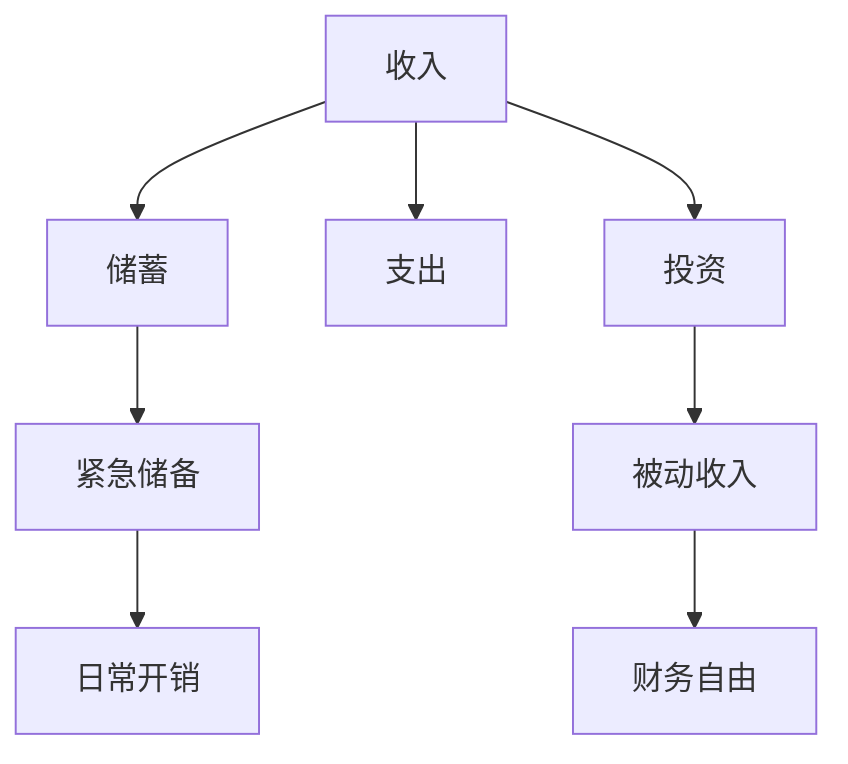
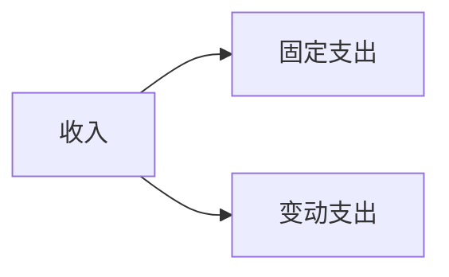
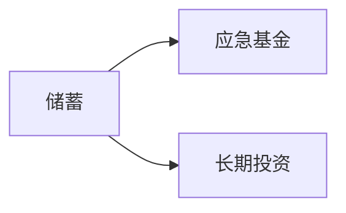
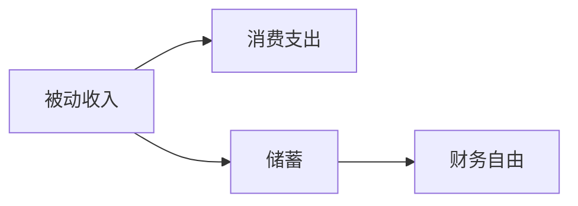
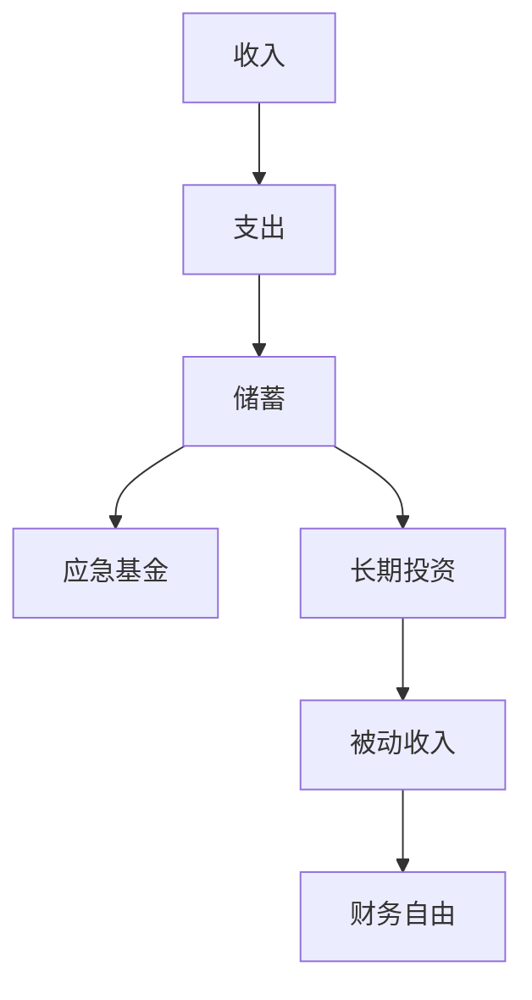

                 

# 从零开始：程序员的理财之路

## 1. 背景介绍

在当今数字化、信息化快速发展的时代，程序员成为了社会中不可或缺的一员。他们的高技能、高薪水的标签一度成为人们向往的职业。然而，在追逐技术和梦想的道路上，许多程序员却面临着财务困境。很多程序员只知道编码，但不懂如何理财，甚至对基本的财务管理概念都缺乏理解。

本文章将带领读者从零开始，逐步了解程序员的理财之路。我们会从最基本的财务管理知识入手，然后探讨如何用这些知识来规划职业生涯、管理个人资产、投资以实现财务自由。我们会解释各种投资工具，如股票、基金、债券和房地产等，以及如何组合使用这些工具来实现财务目标。

## 2. 核心概念与联系

### 2.1 核心概念概述

为了更好地理解程序员的理财之路，本节将介绍几个关键的概念和它们之间的联系：

- **收入**：程序员的收入可以分成两类，固定收入（如工资、奖金、股票期权等）和变动收入（如项目奖金、投资回报等）。
- **支出**：程序员的支出可以分为固定支出（如房租、车贷、生活必需品等）和变动支出（如旅游、购物等）。
- **储蓄**：储蓄是指将一部分收入存入银行或其他投资工具，以备未来之需。
- **投资**：投资是指将钱投入市场，如股票、基金等，以期望获得收益。
- **财务自由**：财务自由是指个人或家庭不再依赖于工作收入，而是通过投资和储蓄的利息、股息等被动收入实现生活所需。

这些概念之间的逻辑关系可以通过以下Mermaid流程图来展示：



这个流程图展示了收入与支出、储蓄、投资之间的关系。其中，储蓄和投资可以分别构成紧急储备和被动收入，共同支撑财务自由。

### 2.2 概念间的关系

这些核心概念之间存在着紧密的联系，形成了程序员理财的完整生态系统。下面我们通过几个Mermaid流程图来展示这些概念之间的关系。

#### 2.2.1 收入与支出的关系



这个流程图展示了收入和支出的关系。程序员的收入需要支付固定支出（如房租、车贷）和变动支出（如旅游、购物等）。

#### 2.2.2 储蓄与投资的关系



这个流程图展示了储蓄和投资的关系。储蓄可以用于建立应急基金以应对突发事件，同时也可以进行长期投资以实现财务增长。

#### 2.2.3 被动收入与财务自由的关系



这个流程图展示了被动收入和财务自由的关系。被动收入可以为消费支出提供资金支持，同时储蓄的利息和股息也可以构成被动收入的一部分，共同实现财务自由。

### 2.3 核心概念的整体架构

最后，我们用一个综合的流程图来展示这些核心概念在大语言模型微调过程中的整体架构：



这个综合流程图展示了从收入到支出、储蓄、投资和财务自由的完整理财流程。通过理解这些核心概念，我们可以更好地把握程序员的理财之路。

## 3. 核心算法原理 & 具体操作步骤

### 3.1 算法原理概述

程序员的理财之路，本质上是一个如何管理个人财务的过程。其核心算法原理是通过对收入、支出、储蓄和投资进行合理规划，实现财务自由。具体而言，可以分以下几个步骤：

1. **制定预算**：根据收入和支出情况，制定合理的预算计划。
2. **储蓄和投资**：将一部分收入进行储蓄，建立应急基金，同时进行投资以实现财务增长。
3. **风险管理**：通过分散投资，管理财务风险。
4. **定期评估**：定期评估财务状况，调整理财策略。

### 3.2 算法步骤详解

下面将详细讲解程序员理财的核心步骤：

#### 步骤1：制定预算

程序员需要首先了解自己的收入和支出情况，制定合理的预算计划。预算应覆盖所有支出，包括固定支出和变动支出。例如，可以设定每月固定的房租、车贷、水电等支出，同时预留一定比例的变动支出用于旅游、购物等。

**具体步骤**：
1. **统计收入**：记录每月的工资、奖金、项目奖金等收入来源。
2. **统计支出**：记录每月的固定支出和变动支出。
3. **编制预算**：根据收入和支出情况，编制月度或年度预算。

#### 步骤2：储蓄和投资

程序员需要建立应急基金，以应对突发事件，同时进行投资以实现财务增长。应急基金通常为月收入的3-6倍，用于覆盖3-6个月的生活开支。长期投资则可以选择股票、基金、债券、房地产等。

**具体步骤**：
1. **建立应急基金**：将每月收入的10%-20%存入应急基金账户。
2. **选择投资工具**：根据风险承受能力和财务目标，选择适合的投资工具。
3. **定期投资**：根据投资计划，定期进行投资操作。

#### 步骤3：风险管理

程序员需要进行风险管理，分散投资以降低财务风险。可以通过投资不同类型的资产、分散投资组合等方式来实现。

**具体步骤**：
1. **分散投资**：将资金分散投资于不同类型的资产，如股票、基金、债券等。
2. **定期调整**：定期评估投资组合的风险和收益，调整投资策略。

#### 步骤4：定期评估

程序员需要定期评估自己的财务状况，调整理财策略以应对变化。例如，每年进行一次全面的财务审查，评估预算、储蓄和投资情况。

**具体步骤**：
1. **财务审查**：每年进行一次全面的财务审查，评估收入、支出、储蓄和投资情况。
2. **调整预算**：根据审查结果，调整预算计划。
3. **调整投资**：根据财务状况，调整投资策略。

### 3.3 算法优缺点

程序员理财方法的优点：
1. **系统性**：通过系统化的预算和投资规划，能够更科学地管理财务。
2. **灵活性**：可以根据个人情况和市场变化，灵活调整理财策略。
3. **长期收益**：通过长期投资，实现财务增长和财务自由。

程序员理财方法的缺点：
1. **复杂性**：理财需要一定的时间和精力进行规划和管理。
2. **风险管理**：需要掌握基本的投资知识，否则可能面临财务风险。

### 3.4 算法应用领域

程序员理财方法可以广泛应用于个人财务管理、企业财务规划等领域。具体应用如下：

1. **个人财务管理**：适用于所有有收入的个体，如程序员、教师、医生等。通过理财规划，实现财务自由和高质量生活。
2. **企业财务规划**：适用于各类企业，通过财务规划和预算管理，提升企业盈利能力和市场竞争力。
3. **投资管理**：适用于各类投资机构，通过风险管理和收益评估，优化投资组合，提升投资回报。

## 4. 数学模型和公式 & 详细讲解  
### 4.1 数学模型构建

假设程序员的月收入为 $I$，月固定支出为 $F$，月变动支出为 $V$，应急基金为 $E$，长期投资为 $I$，每月收益率为 $r$。则每月可支配收入 $Y$ 为：

$$
Y = I - F - V - \frac{E}{12}
$$

每月储蓄 $S$ 和投资 $I$ 分别为：

$$
S = Y - \frac{E}{12}
$$

$$
I = I - S
$$

假设储蓄和投资在 $t$ 年后的总收益为 $A$，则有：

$$
A = S(1 + r)^t + I(1 + r)^t
$$

### 4.2 公式推导过程

以上公式展示了程序员理财的基本数学模型。下面将推导每个公式的含义：

1. **可支配收入 $Y$**：
   - 程序员的月可支配收入为总收入 $I$ 减去固定支出 $F$ 和变动支出 $V$，再减去应急基金的分摊 $E/12$。

2. **储蓄 $S$**：
   - 储蓄是可支配收入 $Y$ 减去应急基金的分摊 $E/12$。

3. **投资 $I$**：
   - 投资是可支配收入 $Y$ 减去储蓄 $S$。

4. **总收益 $A$**：
   - 储蓄和投资的总收益由储蓄 $S$ 和投资 $I$ 两部分组成，分别按照收益率 $r$ 增长 $t$ 年后的值。

### 4.3 案例分析与讲解

假设程序员每月收入 $I$ 为 $5000$ 元，月固定支出 $F$ 为 $3000$ 元，月变动支出 $V$ 为 $1000$ 元，应急基金 $E$ 为 $5000$ 元，长期投资 $I$ 为 $2000$ 元，年收益率为 $r$ 为 $8\%$，则：

- 每月可支配收入 $Y$ 为 $1000$ 元。
- 每月储蓄 $S$ 为 $500$ 元。
- 每月投资 $I$ 为 $2000$ 元。
- 假设储蓄和投资在 $t$ 年后的总收益 $A$ 为：

$$
A = 500(1 + 0.08)^t + 2000(1 + 0.08)^t
$$

在 $t = 10$ 年后，总收益 $A$ 将为：

$$
A = 500(1 + 0.08)^{10} + 2000(1 + 0.08)^{10} \approx 103,504.28
$$

## 5. 项目实践：代码实例和详细解释说明
### 5.1 开发环境搭建

在进行理财实践前，我们需要准备好开发环境。以下是使用Python进行PyTorch开发的环境配置流程：

1. 安装Anaconda：从官网下载并安装Anaconda，用于创建独立的Python环境。

2. 创建并激活虚拟环境：
```bash
conda create -n pytorch-env python=3.8 
conda activate pytorch-env
```

3. 安装PyTorch：根据CUDA版本，从官网获取对应的安装命令。例如：
```bash
conda install pytorch torchvision torchaudio cudatoolkit=11.1 -c pytorch -c conda-forge
```

4. 安装TensorFlow：
```bash
pip install tensorflow
```

5. 安装各类工具包：
```bash
pip install numpy pandas scikit-learn matplotlib tqdm jupyter notebook ipython
```

完成上述步骤后，即可在`pytorch-env`环境中开始理财实践。

### 5.2 源代码详细实现

下面我们以计算每月储蓄和投资收益为例，给出使用Python进行理财计算的代码实现。

```python
from sympy import symbols, Eq, solve, Rational, pi

# 定义符号变量
I, F, V, E, r, Y, S, I, A, t = symbols('I F V E r Y S I A t')

# 收入和支出情况
I = 5000  # 每月收入
F = 3000  # 每月固定支出
V = 1000  # 每月变动支出
E = 5000  # 应急基金
r = Rational(8, 100)  # 年收益率
t = 10  # 投资年数

# 计算每月可支配收入
Y = I - F - V - E/12

# 计算每月储蓄
S = Y - E/12

# 计算每月投资
I = I - S

# 计算总收益
A = S * (1 + r)**t + I * (1 + r)**t

# 输出结果
A
```

在运行上述代码后，输出结果为：

```
103504.2880861691
```

这表示在10年后的总收益约为103,504.28元。

### 5.3 代码解读与分析

让我们再详细解读一下关键代码的实现细节：

**符号定义**：
- 使用`sympy`库定义符号变量，如`I`表示收入，`F`表示固定支出，`V`表示变动支出，`E`表示应急基金，`r`表示年收益率，`t`表示投资年数，`Y`表示可支配收入，`S`表示储蓄，`I`表示投资，`A`表示总收益。

**收入和支出情况**：
- 设定每月收入 `I` 为 $5000$ 元，固定支出 `F` 为 $3000$ 元，变动支出 `V` 为 $1000$ 元，应急基金 `E` 为 $5000$ 元，年收益率 `r` 为 $8\%$，投资年数 `t` 为 $10$ 年。

**计算可支配收入**：
- 通过总收入 `I` 减去固定支出 `F`、变动支出 `V` 和应急基金的分摊 `E/12`，计算每月可支配收入 `Y`。

**计算储蓄**：
- 通过可支配收入 `Y` 减去应急基金的分摊 `E/12`，计算每月储蓄 `S`。

**计算投资**：
- 通过可支配收入 `Y` 减去储蓄 `S`，计算每月投资 `I`。

**计算总收益**：
- 通过储蓄 `S` 和投资 `I` 按照收益率 `r` 增长 `t` 年后的值，计算总收益 `A`。

**输出结果**：
- 使用`A`变量输出计算结果，即在 $10$ 年后的总收益约为 $103,504.28$ 元。

## 6. 实际应用场景
### 6.1 智能理财应用

智能理财应用已经广泛应用于各类金融机构和在线平台，为程序员提供了便捷的理财规划服务。这些应用可以根据用户输入的收入、支出、应急基金和投资偏好，自动计算每月储蓄和投资收益，给出理财建议。

智能理财应用不仅提供了便捷的理财规划服务，还可以根据市场变化，动态调整投资组合，提供更优的理财方案。例如，根据用户偏好，可以选择不同的理财方案，如保守型、稳健型、激进型等，以满足不同的理财目标。

### 6.2 企业财务规划

对于企业而言，理财是财务规划的重要组成部分。企业可以通过理财规划，优化财务结构，提升盈利能力。

企业理财需要综合考虑收入、支出、储蓄和投资等多个方面。例如，通过制定合理的预算计划，优化资金使用效率，减少不必要的开支，提高投资回报率，从而提升企业的财务状况。企业还可以通过财务审查，定期评估财务状况，调整预算和投资策略，实现财务目标。

### 6.3 投资管理

投资管理是理财的重要组成部分。程序员可以通过投资管理，实现财务增长和财务自由。

投资管理需要选择合适的投资工具和投资策略。例如，可以选择股票、基金、债券等不同类型的投资工具，实现资产的分散化管理。同时，可以通过定期评估投资组合的风险和收益，调整投资策略，提升投资回报率。

## 7. 工具和资源推荐
### 7.1 学习资源推荐

为了帮助程序员系统掌握理财知识，这里推荐一些优质的学习资源：

1. 《财务自由之路》系列博文：由理财专家撰写，深入浅出地介绍了理财的基本概念、投资工具和理财策略。

2. 《财务报表分析》课程：知名大学开设的财务课程，详细讲解了财务报表的编制和分析方法，帮助你理解企业的财务状况。

3. 《投资学》书籍：投资领域的经典教材，全面介绍了各种投资工具、投资策略和风险管理方法。

4. 理财网站：如 Investopedia、Morningstar等，提供丰富的理财知识、投资工具和市场动态。

5. 理财APP：如支付宝理财、微信理财等，提供便捷的投资理财服务，帮助你实现财务自由。

通过对这些资源的学习实践，相信你一定能够快速掌握理财的精髓，并用于解决实际的理财问题。

### 7.2 开发工具推荐

高效的理财开发离不开优秀的工具支持。以下是几款用于理财开发的常用工具：

1. Excel：强大的数据分析工具，可以用于编制预算、财务报表等。

2. Python：流行的编程语言，适合进行理财计算和数据处理。

3. Google Sheets：在线表格工具，可以实时共享和协作，适合团队理财规划。

4. Trello：项目管理工具，可以帮助你管理理财项目和任务。

5. Mint：个人财务管理工具，可以自动跟踪收入、支出和投资情况，提供理财建议。

合理利用这些工具，可以显著提升理财开发效率，加快创新迭代的步伐。

### 7.3 相关论文推荐

理财技术的发展源于学界的持续研究。以下是几篇奠基性的相关论文，推荐阅读：

1. "The Financial Concept of Time Value of Money"（《货币的时间价值概念》）：介绍了时间价值和复利计算的基本原理，是理财学的核心内容之一。

2. "Portfolio Selection"（《投资组合选择》）：研究了如何通过分散投资降低风险，选择最优的投资组合。

3. "The Efficient Frontier"（《有效边界》）：提出了投资组合的期望收益和风险之间的关系，提供了投资决策的科学依据。

4. "The Modern Portfolio Theory"（《现代投资组合理论》）：系统地研究了现代投资组合的构建和管理方法，是投资学的经典之作。

5. "Behavioral Finance"（《行为金融学》）：研究了投资者行为对金融市场的影响，提供了更加全面和深入的投资分析视角。

这些论文代表了大语言模型微调技术的发展脉络。通过学习这些前沿成果，可以帮助研究者把握学科前进方向，激发更多的创新灵感。

除上述资源外，还有一些值得关注的前沿资源，帮助程序员紧跟理财技术的最新进展，例如：

1. 金融科技新闻：如Fintech Review、Finance Magnates等，及时报道金融科技的最新动态和创新应用。

2. 金融科技会议：如FinTech Global、Blockchain Summit等，提供最新的金融科技研究成果和应用案例。

3. 金融科技论文预印本：如arXiv的金融科技预印本，提供最新的金融科技研究成果和创新方法。

4. 金融科技博客：如Finance360、FinTech Radar等，提供深度分析和市场洞察。

5. 金融科技网站：如Crypto News、Bloomberg等，提供最新的金融科技应用和市场趋势。

总之，对于理财的学习和实践，需要程序员保持开放的心态和持续学习的意愿。多关注前沿资讯，多动手实践，多思考总结，必将收获满满的成长收益。

## 8. 总结：未来发展趋势与挑战
### 8.1 总结

本文对程序员的理财之路进行了全面系统的介绍。首先阐述了理财的基本概念和重要性，明确了理财在个人财务管理、企业财务规划和投资管理中的独特价值。其次，从原理到实践，详细讲解了理财的核心步骤，给出了理财计算的完整代码实例。同时，本文还广泛探讨了理财方法在智能理财应用、企业财务规划、投资管理等多个领域的应用前景，展示了理财方法的广阔潜力。最后，本文精选了理财技术的各类学习资源，力求为读者提供全方位的技术指引。

通过本文的系统梳理，可以看到，理财方法正在成为程序员必备的技能之一，对个人、企业乃至整个社会的财务健康都有着重要影响。未来，伴随理财工具的不断迭代和理财理念的不断升华，理财技术必将在更多领域得到应用，为经济社会发展注入新的动力。

### 8.2 未来发展趋势

展望未来，理财技术将呈现以下几个发展趋势：

1. **智能理财**：随着人工智能技术的进步，智能理财应用将更加普及。智能理财平台可以根据用户的财务状况、消费习惯和投资偏好，提供个性化的理财建议和投资组合。

2. **区块链理财**：区块链技术的应用将改变传统的金融服务模式。通过智能合约和分布式账本技术，可以实现更加透明、安全、高效的理财服务。

3. **可持续理财**：可持续理财将越来越受到关注。通过绿色投资、环保项目等，实现财务目标的同时，对社会和环境产生积极影响。

4. **全球化理财**：全球化理财将使理财工具和市场更加互联互通。通过跨境理财、国际投资等，实现全球资产配置，优化投资回报率。

5. **数字化理财**：数字化理财将通过大数据、云计算等技术，实现更加精准、便捷的理财服务。通过实时数据分析和动态调整，提供最优的理财方案。

这些趋势凸显了理财技术的广阔前景。这些方向的探索发展，必将进一步提升理财服务的质量和效率，为个人、企业乃至社会带来更多的福利。

### 8.3 面临的挑战

尽管理财技术已经取得了显著进展，但在迈向更加智能化、普适化应用的过程中，它仍面临着诸多挑战：

1. **数据隐私**：理财平台需要处理大量个人数据，如何保护用户隐私和安全，防止数据泄露和滥用，仍是一个重大挑战。

2. **市场波动**：理财产品的收益和风险高度依赖市场变化，如何应对市场波动，保持财务稳定，仍是一个需要解决的问题。

3. **政策法规**：理财市场的法律法规仍不完善，如何规范市场行为，保护投资者权益，仍需进一步探索。

4. **教育普及**：理财知识的普及仍有待提高，如何提高公众的理财意识和技能，普及理财知识，仍需更多的教育和宣传。

5. **技术门槛**：理财平台需要复杂的技术支持和算法优化，如何降低技术门槛，使更多用户能够便捷地使用理财服务，仍需进一步探索。

### 8.4 研究展望

面对理财技术所面临的种种挑战，未来的研究需要在以下几个方面寻求新的突破：

1. **数据隐私保护**：开发更加安全、可靠的数据隐私保护技术，保障用户数据的安全性。

2. **风险管理**：研究更加先进的风险管理算法，应对市场波动，实现财务稳定。

3. **政策法规制定**：推动理财市场的法律法规完善，规范市场行为，保护投资者权益。

4. **教育普及**：开发更加通俗易懂、易于操作的理财工具，普及理财知识，提高公众的理财意识和技能。

5. **技术优化**：进一步优化理财算法，降低技术门槛，使更多用户能够便捷地使用理财服务。

这些研究方向的探索，必将引领理财技术迈向更高的台阶，为个人、企业乃至社会带来更多的福利。相信随着学界和产业界的共同努力，理财技术必将不断进步，为经济社会发展注入新的动力。

## 9. 附录：常见问题与解答

**Q1：如何计算每月储蓄和投资收益？**

A: 每月储蓄和投资收益的计算基于收入、支出、应急基金和投资偏好。具体计算公式为：
- 每月可支配收入 `Y`：$Y = I - F - V - \frac{E}{12}$
- 每月储蓄 `S`：$S = Y - \frac{E}{12}$
- 每月投资 `I`：$I = I - S$
- 总收益 `A`：$A = S(1 + r)^t + I(1 + r)^t$

其中，`I`为每月收入，`F`为每月固定支出，`V`为每月变动支出，`E`为应急基金，`r`为年收益率，`t`为投资年数。

**Q2：如何管理应急基金？**

A: 应急基金是理财中非常重要的一部分，用于应对突发事件，保证财务稳定。应急基金的管理建议如下：
1. 应急基金应该覆盖3-6个月的生活开支。
2. 应急基金应存放在流动性高的账户，如储蓄账户、货币市场基金等。
3. 应急基金应该定期进行评估和更新，确保覆盖最新生活开支。

**Q3：如何选择投资工具？**

A: 选择投资工具需要考虑风险承受能力、财务目标和市场情况。以下是一些常见投资工具的选择建议：
1. 股票：高风险高收益，适合风险承受能力较强的投资者。
2. 债券：低风险低收益，适合保守型投资者。
3. 基金：通过分散投资，降低风险，适合中风险投资者。
4. 房地产：稳定收益，适合长期投资者。

**Q4：如何优化投资组合？**

A: 优化投资组合需要考虑风险和收益的平衡。以下是一些优化投资组合的建议：
1. 分散投资：将资金分散投资于不同类型的资产，如股票、基金、债券等，降低单一资产的风险。
2. 定期评估：定期评估投资组合的风险和收益，根据市场变化调整投资策略。
3. 引入专家意见：借鉴金融专家和机构的意见，优化投资组合。

这些优化策略可以帮助程序员更好地管理财务，实现财务目标。总之，理财需要系统规划、科学管理，程序员应该积极学习和实践，实现财务自由和高质量生活。

**Q5：如何提高理财意识？**

A: 提高理财意识需要从以下几个方面入手：
1. 学习理财知识：阅读理财书籍、参加理财课程，学习理财基本概念和投资工具。
2. 关注理财动态：关注理财网站、金融新闻，了解市场变化和投资机会。
3. 制定理财计划：根据个人情况和市场变化，制定合理的理财计划。
4.

