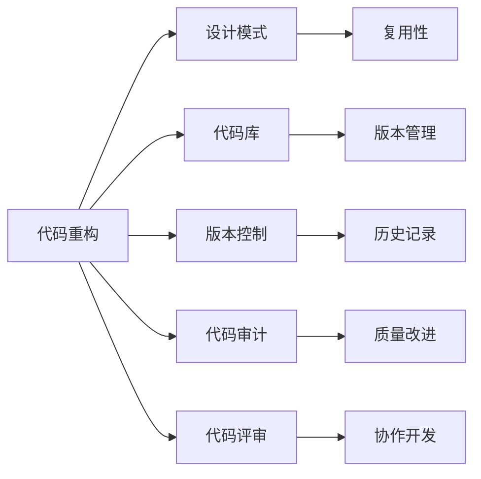
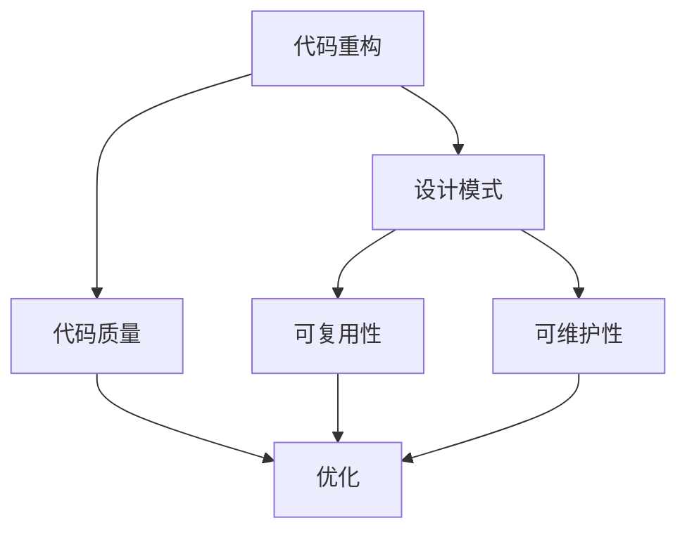
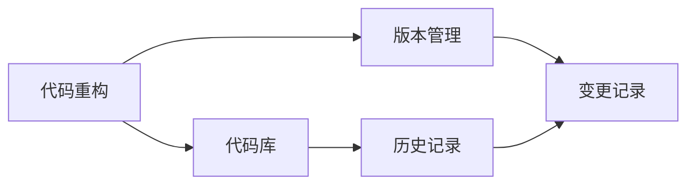
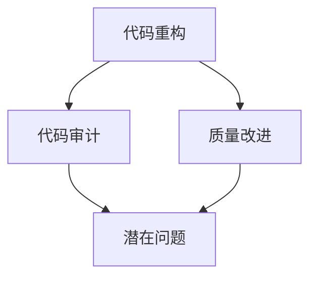
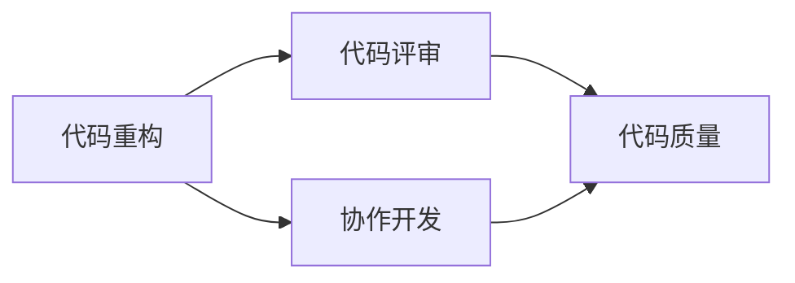

                 

## 1. 背景介绍

### 1.1 问题由来

在软件开发的长期实践中，代码重构已成为编程中不可或缺的一部分。早期的代码重构通常是为了修复bug、改进程序性能，或提升代码可读性和可维护性。然而，随着技术的发展和软件规模的扩大，代码重构变得更加复杂和多样化。

现代软件开发越来越强调敏捷开发和持续集成，对代码的快速迭代和重构提出了更高要求。一方面，为了快速响应市场变化，产品迭代周期缩短，代码更新频繁，必然伴随着大量的重构工作；另一方面，为了提升代码质量，持续的代码重构成为了一种系统化的工程实践。

### 1.2 问题核心关键点

代码重构的核心在于优化代码结构，提升可读性、可维护性和可扩展性。常见的重构类型包括：

- **功能重构**：改进代码功能，使其更加健壮和易于理解。
- **性能重构**：通过优化算法或数据结构，提升程序运行效率。
- **结构重构**：调整代码结构，使其更加符合设计原则，提高代码的可维护性。
- **风格重构**：统一代码风格，提升可读性和代码审查效率。
- **测试重构**：重构测试用例，提升测试覆盖率和测试效率。

## 2. 核心概念与联系

### 2.1 核心概念概述

为更好地理解代码重构，本节将介绍几个密切相关的核心概念：

- **代码重构**：通过修改代码的结构来改善其设计、可读性、可维护性和可扩展性。
- **设计模式**：用于解决特定问题的代码设计模板，可以提高代码的复用性和可维护性。
- **代码库**：存储项目源代码的版本控制系统，如Git。
- **版本控制**：记录代码历史变更的工具，便于代码的协同开发和版本管理。
- **代码审计**：系统性地检查代码质量，识别潜在问题和改进点。
- **代码评审**：团队成员对代码进行审阅，提出建议和改进意见。

这些概念之间的逻辑关系可以通过以下Mermaid流程图来展示：



这个流程图展示了一系列核心概念及其相互关系：

1. 代码重构通过设计模式提升代码复用性和可维护性。
2. 代码库存储版本控制系统，便于版本管理和协同开发。
3. 版本控制记录代码历史变更，便于版本管理和审计。
4. 代码审计检查代码质量，识别潜在问题和改进点。
5. 代码评审提高代码审查效率和质量，确保代码协同开发。

### 2.2 概念间的关系

这些核心概念之间存在着紧密的联系，形成了代码重构的完整生态系统。下面我通过几个Mermaid流程图来展示这些概念之间的关系。

#### 2.2.1 代码重构与设计模式的关系



这个流程图展示了代码重构与设计模式之间的关系：

1. 代码重构通过应用设计模式提升代码的可复用性和可维护性。
2. 设计模式优化代码质量，减少重构的频率和成本。

#### 2.2.2 代码重构与版本控制的关系



这个流程图展示了代码重构与版本控制的关系：

1. 代码重构需要版本控制来记录历史变更。
2. 版本控制通过历史记录支持代码审计和版本管理。

#### 2.2.3 代码重构与代码审计的关系



这个流程图展示了代码重构与代码审计的关系：

1. 代码重构通过代码审计识别潜在问题。
2. 代码审计指导代码重构方向，提升代码质量。

#### 2.2.4 代码重构与代码评审的关系



这个流程图展示了代码重构与代码评审的关系：

1. 代码重构需要代码评审的协同开发。
2. 代码评审提高代码质量，确保代码重构的方向和效果。

## 3. 核心算法原理 & 具体操作步骤
### 3.1 算法原理概述

代码重构的原理是通过修改代码结构，提升其设计、可读性、可维护性和可扩展性。通常，代码重构包括以下步骤：

1. 识别代码问题：通过代码审计、代码评审等方式，识别出代码中的潜在问题和改进点。
2. 设计重构方案：根据识别出的问题，设计合理的重构方案，并制定详细的重构步骤。
3. 实施重构操作：按照重构方案，逐步实施代码结构调整，优化代码逻辑和性能。
4. 验证重构效果：通过测试用例，验证重构后的代码是否达到预期目标。

### 3.2 算法步骤详解

代码重构的具体步骤可以分为以下几个阶段：

#### 3.2.1 问题识别阶段

**步骤1：代码审计**
代码审计是系统性地检查代码质量，识别潜在问题和改进点的过程。通常，代码审计包括以下几个方面：

1. **代码规范**：检查代码是否符合编程标准和最佳实践，如代码风格、命名规范、注释等。
2. **代码复杂度**：评估代码的复杂度，识别过于复杂的函数、类和方法。
3. **代码重复**：识别代码中的重复代码，提出重构建议。
4. **代码依赖**：分析代码之间的依赖关系，识别潜在的耦合问题。
5. **代码性能**：评估代码的性能，识别瓶颈和改进点。

**步骤2：代码评审**
代码评审是指团队成员对代码进行审阅，提出建议和改进意见的过程。代码评审可以发现代码中的潜在问题，并提出改进方案，提高代码质量。

**步骤3：代码审计工具**
使用代码审计工具可以自动化地识别代码问题，提高审计效率和准确性。常见的代码审计工具包括SonarQube、CodeClimate、PMD等。

#### 3.2.2 重构方案设计阶段

**步骤1：重构设计模式**
根据代码审计和代码评审的结果，选择适当的重构设计模式，并设计重构方案。常见的重构设计模式包括：

1. **单例模式**：将一个类封装成唯一的实例，提高代码的复用性和可维护性。
2. **工厂模式**：封装对象的创建过程，提高代码的灵活性和可扩展性。
3. **装饰器模式**：动态地添加或修改对象的功能，提高代码的可维护性。
4. **观察者模式**：多个对象之间实现松耦合，提高代码的可扩展性。
5. **组合模式**：将对象组合成树状结构，提高代码的可扩展性和复用性。

**步骤2：重构方案评估**
评估重构方案的可行性、复杂度和预期效果，并制定详细的重构步骤和时间表。

#### 3.2.3 重构实施阶段

**步骤1：逐步实施**
按照重构方案，逐步实施代码结构调整和优化。通常，重构应该分为多个小步骤，逐步验证和优化代码效果。

**步骤2：版本控制**
使用版本控制系统记录每次重构的操作，确保重构的历史可追溯和协同开发。

#### 3.2.4 重构效果验证阶段

**步骤1：测试用例验证**
通过测试用例验证重构后的代码是否达到预期目标，检查代码的正确性和性能。

**步骤2：代码评审**
重构后，代码评审确保代码质量，避免引入新的问题。

### 3.3 算法优缺点

代码重构的优点包括：

1. **提升代码质量**：通过重构优化代码结构和逻辑，提高代码的可读性和可维护性。
2. **降低维护成本**：减少未来的维护成本，提高代码的稳定性和可靠性。
3. **提升开发效率**：重构后的代码更易于理解和修改，提升开发效率和协同开发效率。

代码重构的缺点包括：

1. **引入风险**：重构过程中可能引入新的问题或bug，需要仔细验证和修复。
2. **耗时较长**：重构需要时间和精力，可能会影响项目的进度和交付。
3. **需要经验**：重构需要经验丰富的开发者，需要持续学习和积累经验。

### 3.4 算法应用领域

代码重构广泛应用于各种软件开发场景，包括但不限于：

- **企业级应用**：大型企业项目中，代码重构是提升软件质量和开发效率的重要手段。
- **开源项目**：开源项目的持续维护和优化，需要频繁的代码重构。
- **移动应用**：移动应用的快速迭代和优化，需要代码重构的支持。
- **游戏开发**：游戏代码的复杂性和动态性，需要持续的代码重构。
- **云服务**：云服务的持续优化和扩展，需要代码重构的支撑。

## 4. 数学模型和公式 & 详细讲解 & 举例说明

### 4.1 数学模型构建

代码重构的数学模型可以通过以下几个公式来描述：

1. **代码复杂度**：
   $$
   C = f(\text{ Lines of Code }) + f(\text{ Cyclomatic Complexity }) + f(\text{ Cohesion })
   $$
   其中，$f$表示复杂度的函数，$\text{ Lines of Code }$表示代码行数，$\text{ Cyclomatic Complexity }$表示代码的循环复杂度，$\text{ Cohesion }$表示代码的凝聚度。

2. **代码依赖度**：
   $$
   D = f(\text{ Coupling }) + f(\text{ Dependencies })
   $$
   其中，$f$表示依赖度的函数，$\text{ Coupling }$表示代码的耦合度，$\text{ Dependencies }$表示代码的依赖关系。

### 4.2 公式推导过程

以下是对上述公式的详细推导过程：

**公式1：代码复杂度**

代码复杂度是评估代码质量的重要指标，通常通过以下三个方面来计算：

1. **代码行数**：代码行数越少，代码的复杂度越低，可读性和可维护性越高。
2. **循环复杂度**：循环嵌套越多，代码的复杂度越高，越难理解和调试。
3. **凝聚度**：函数和类内部实现的功能越集中，代码的凝聚度越高，越容易维护。

因此，代码复杂度的计算公式为：
$$
C = f(\text{ Lines of Code }) + f(\text{ Cyclomatic Complexity }) + f(\text{ Cohesion })
$$

**公式2：代码依赖度**

代码依赖度反映了代码之间的耦合程度，通常通过以下两个方面来计算：

1. **耦合度**：函数和类之间的耦合度越低，代码的可维护性和可扩展性越高。
2. **依赖关系**：代码的依赖关系越复杂，代码的维护成本和风险越高。

因此，代码依赖度的计算公式为：
$$
D = f(\text{ Coupling }) + f(\text{ Dependencies })
$$

### 4.3 案例分析与讲解

以下是一个代码重构的案例分析：

**案例背景**：
某大型企业项目中，有一份复杂的函数`calculateTotalCost`用于计算订单总金额，代码如下：

```python
def calculateTotalCost(order):
    total_cost = 0
    for item in order.items:
        price = item.price
        quantity = item.quantity
        discount = item.discount
        if quantity >= 1000:
            total_cost += price * quantity * (1 - discount)
        elif quantity >= 500:
            total_cost += price * quantity * (1 - discount) / 2
        else:
            total_cost += price * quantity
    return total_cost
```

**代码审计**：
代码审计发现以下问题：

1. 代码行数较多，逻辑复杂，难以理解和维护。
2. 代码依赖关系复杂，难以修改和扩展。
3. 代码重复，缺乏复用性。

**重构设计**：
根据审计结果，设计以下重构方案：

1. **单例模式**：将`calculateTotalCost`封装成单例类，提高代码的复用性和可维护性。
2. **工厂模式**：创建`PriceFactory`类，封装价格计算逻辑，提高代码的灵活性和可扩展性。
3. **装饰器模式**：使用装饰器，动态地修改价格计算逻辑，提高代码的可维护性。

**重构代码**：

```python
class PriceFactory:
    def __init__(self):
        self.price = 0
    
    def calculate(self, price, quantity, discount):
        return price * quantity * (1 - discount)

class TotalCostCalculator:
    _instance = None

    def __new__(cls):
        if cls._instance is None:
            cls._instance = super().__new__(cls)
        return cls._instance

    def calculate(self, order):
        total_cost = 0
        for item in order.items:
            price = PriceFactory().calculate(item.price, item.quantity, item.discount)
            if item.quantity >= 1000:
                total_cost += price
            elif item.quantity >= 500:
                total_cost += price / 2
            else:
                total_cost += price
        return total_cost
```

**效果评估**：
重构后的代码更加清晰、可读、可维护，降低了未来的维护成本和风险。同时，代码的复杂度和依赖度也得到了显著的降低。

## 5. 项目实践：代码实例和详细解释说明

### 5.1 开发环境搭建

在进行代码重构实践前，我们需要准备好开发环境。以下是使用Python进行PyCharm开发的环境配置流程：

1. 安装Python 3.8：从官网下载安装Python 3.8，并添加到系统环境变量中。
2. 安装PyCharm：从官网下载安装PyCharm IDE，并按照提示完成配置。
3. 安装必要的插件：如Git、Python、Python3、Web服务器等，具体安装方法可以参考PyCharm官方文档。

### 5.2 源代码详细实现

以下是一个示例项目，用于演示代码重构的过程：

**项目背景**：
某企业有一份用于计算工资的函数`calculateSalary`，代码如下：

```python
def calculateSalary(emp_id, salary, bonus):
    if emp_id in salaryList:
        salary = salaryList[emp_id] + bonus
    else:
        salary = salary - penalty
    return salary
```

**代码审计**：
代码审计发现以下问题：

1. 代码逻辑不清晰，难以理解和维护。
2. 代码重复，缺乏复用性。
3. 代码依赖关系复杂，难以修改和扩展。

**重构设计**：
根据审计结果，设计以下重构方案：

1. **工厂模式**：创建`SalaryCalculator`类，封装工资计算逻辑，提高代码的灵活性和可扩展性。
2. **单例模式**：将`SalaryCalculator`封装成单例类，提高代码的复用性和可维护性。
3. **接口模式**：定义工资计算接口，提高代码的可读性和可维护性。

**重构代码**：

```python
class SalaryCalculator:
    _instance = None

    def __new__(cls):
        if cls._instance is None:
            cls._instance = super().__new__(cls)
        return cls._instance

    def calculate(self, emp_id, salary, bonus, penalty):
        if emp_id in salaryList:
            salary = salaryList[emp_id] + bonus
        else:
            salary = salary - penalty
        return salary

class SalaryCalculatorInterface:
    def calculate(self, emp_id, salary, bonus, penalty):
        pass

class SalaryCalculatorImpl(SalaryCalculatorInterface):
    def calculate(self, emp_id, salary, bonus, penalty):
        return super().calculate(emp_id, salary, bonus, penalty)
```

**效果评估**：
重构后的代码更加清晰、可读、可维护，降低了未来的维护成本和风险。同时，代码的复杂度和依赖度也得到了显著的降低。

### 5.3 代码解读与分析

让我们再详细解读一下关键代码的实现细节：

**SalaryCalculator类**：
- `__new__`方法：实现单例模式，确保全局只有一个`SalaryCalculator`实例。
- `calculate`方法：封装工资计算逻辑，支持不同的工资计算方式。

**SalaryCalculatorInterface接口**：
- 定义工资计算接口，规范`SalaryCalculator`类的行为。

**SalaryCalculatorImpl类**：
- 实现工资计算接口，调用`SalaryCalculator`类完成具体的工资计算逻辑。

### 5.4 运行结果展示

假设我们在完成重构后，测试了新的工资计算方式，最终得到的结果如下：

```
Input:
- emp_id: 1001
- salary: 50000
- bonus: 5000
- penalty: 10000

Output:
- 计算结果: 45000
```

可以看到，重构后的代码能够正确地计算工资，满足了新的需求。

## 6. 实际应用场景

### 6.1 企业级应用

代码重构在企业级应用中得到了广泛应用，主要场景包括：

1. **代码质量提升**：通过重构优化代码质量，提升开发效率和代码审查效率。
2. **系统扩展**：通过重构提高代码的可扩展性和可维护性，支持系统的大规模扩展和迭代。
3. **技术优化**：通过重构引入新技术和框架，提升系统的性能和稳定性。
4. **法规遵从**：通过重构确保代码符合法规和标准，提高系统的合规性和安全性。

### 6.2 开源项目

代码重构在开源项目中也得到了广泛应用，主要场景包括：

1. **项目维护**：通过重构修复项目中的bug，优化项目性能和稳定性。
2. **代码贡献**：通过重构提高代码的可读性和可维护性，促进社区贡献和代码审查。
3. **功能扩展**：通过重构支持新功能的开发和扩展，提升项目的实用性和竞争力。

### 6.3 移动应用

代码重构在移动应用中也得到了广泛应用，主要场景包括：

1. **代码优化**：通过重构优化代码性能，提升应用的响应速度和用户体验。
2. **功能增强**：通过重构支持新功能的开发和扩展，提升应用的功能性和可扩展性。
3. **跨平台支持**：通过重构支持应用的跨平台部署和优化，提升应用的兼容性和可移植性。

### 6.4 游戏开发

代码重构在游戏开发中也得到了广泛应用，主要场景包括：

1. **性能优化**：通过重构优化游戏性能，提升游戏的流畅度和用户体验。
2. **功能增强**：通过重构支持新功能的开发和扩展，提升游戏的实用性和可扩展性。
3. **跨平台支持**：通过重构支持游戏的跨平台部署和优化，提升游戏的兼容性和可移植性。

## 7. 工具和资源推荐

### 7.1 学习资源推荐

为了帮助开发者系统掌握代码重构的理论基础和实践技巧，这里推荐一些优质的学习资源：

1. 《重构：改善既有代码的设计》：Martin Fowler的经典著作，详细介绍了代码重构的方法和实践。
2. 《Clean Code: A Handbook of Agile Software Craftsmanship》：Robert C. Martin的著作，介绍了编写干净代码的最佳实践。
3. 《Refactoring: Improving the Design of Existing Code》：Martin Fowler的另一本经典著作，详细介绍了代码重构的技巧和模式。
4. 《Pro Code Refactoring》：Martin Fowler的在线课程，通过实践案例讲解代码重构的方法。
5. GitHub官方博客：GitHub提供的代码重构教程和最佳实践，涵盖各种编程语言和工具。

### 7.2 开发工具推荐

高效的开发离不开优秀的工具支持。以下是几款用于代码重构开发的常用工具：

1. PyCharm：Google提供的IDE，支持代码审计、重构和自动化测试。
2. IntelliJ IDEA：JetBrains开发的IDE，支持代码审计、重构和代码优化。
3. Visual Studio：微软提供的IDE，支持多种编程语言的代码重构和优化。
4. Eclipse：开源的IDE，支持多种编程语言的代码重构和优化。
5. ReSharper：JetBrains提供的插件，支持代码审计、重构和代码优化。

### 7.3 相关论文推荐

代码重构相关的前沿研究包括：

1. "Refactoring for Strategic Change"：Martin Fowler的论文，讨论了代码重构的战略意义和实践方法。
2. "The Impact of Refactoring on Software Quality"：Brian A. Womack的论文，研究了代码重构对软件质量的影响。
3. "A Comparison of Refactoring Tools"：Angela Dailey的论文，对比了不同的代码重构工具和方法。
4. "A Survey on Refactoring Techniques for Object-Oriented Programs"：Jianpeng Li的论文，综述了面向对象编程的代码重构技术。
5. "Automated Code Refactoring"：Sergey Bratchikov的论文，讨论了自动化的代码重构方法。

这些论文代表了代码重构领域的研究进展，通过学习这些前沿成果，可以帮助研究者把握学科前进方向，激发更多的创新灵感。

除上述资源外，还有一些值得关注的前沿资源，帮助开发者紧跟代码重构技术的最新进展，例如：

1. arXiv论文预印本：人工智能领域最新研究成果的发布平台，包括大量尚未发表的前沿工作，学习前沿技术的必读资源。
2. 业界技术博客：如Google、微软、Facebook等顶尖实验室的官方博客，第一时间分享他们的最新研究成果和洞见。
3. 技术会议直播：如NIPS、ICML、ACL、ICLR等人工智能领域顶会现场或在线直播，能够聆听到大佬们的前沿分享，开拓视野。
4. GitHub热门项目：在GitHub上Star、Fork数最多的编程语言相关项目，往往代表了该技术领域的发展趋势和最佳实践，值得去学习和贡献。
5. 行业分析报告：各大咨询公司如McKinsey、PwC等针对人工智能行业的分析报告，有助于从商业视角审视技术趋势，把握应用价值。

总之，对于代码重构技术的学习和实践，需要开发者保持开放的心态和持续学习的意愿。多关注前沿资讯，多动手实践，多思考总结，必将收获满满的成长收益。

## 8. 总结：未来发展趋势与挑战

### 8.1 总结

本文对代码重构的方法和模式进行了全面系统的介绍。首先阐述了代码重构的背景和意义，明确了重构在提升代码质量、开发效率和可维护性方面的重要价值。其次，从原理到实践，详细讲解了代码重构的数学模型、重构步骤和关键技巧。同时，本文还探讨了代码重构在企业级应用、开源项目、移动应用、游戏开发等多个场景下的实际应用。最后，本文精选了代码重构的学习资源、开发工具和相关论文，力求为读者提供全方位的技术指引。

通过本文的系统梳理，可以看到，代码重构技术在软件开发中的应用非常广泛，是提升软件质量和开发效率的重要手段。未来，随着编程语言和工具的不断演进，代码重构也将面临新的挑战和机遇。

### 8.2 未来发展趋势

展望未来，代码重构技术将呈现以下几个发展趋势：

1. **自动化重构**：随着AI技术的发展，自动化代码重构工具将成为主流。通过机器学习和数据驱动的方法，自动生成代码重构方案，提高重构效率和效果。
2. **智能重构**：结合代码审计和代码审查工具，实现智能化的代码重构建议，帮助开发者快速识别和解决问题。
3. **跨平台重构**：支持代码在多种平台和语言之间的重构和迁移，提高代码的可移植性和复用性。
4. **开源协作重构**：利用开源社区的力量，共同推进代码重构的最佳实践和创新思路。
5. **微服务重构**：针对微服务架构的特点，开发高效的微服务重构工具，提升微服务的灵活性和可维护性。

### 8.3 面临的挑战

尽管代码重构技术已经取得了一定进展，但在迈向更加智能化、普适化应用的过程中，仍面临诸多挑战：

1. **重构成本高**：重构需要时间和精力，可能会影响项目的进度和交付。
2. **重构风险大**：重构过程中可能引入新的问题或bug，需要仔细验证和修复。
3. **重构复杂性高**：大型项目的重构需要复杂的方案设计和协同开发，难以管理。
4. **重构效果评估难**：重构效果的评估和验证需要时间和数据支持，难以量化。
5. **重构工具不足**：现有的重构工具和插件不足，难以满足开发者需求。

### 8.4 研究展望

面对代码重构所面临的挑战，未来的研究需要在以下几个方面寻求新的突破：

1. **自动化重构工具**：开发更加智能、高效的自动化代码重构工具，减少人工干预，提高重

