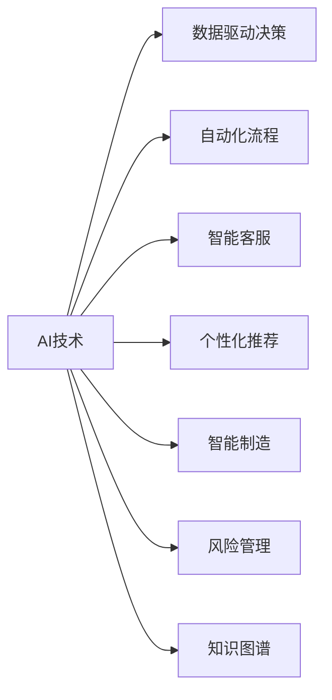
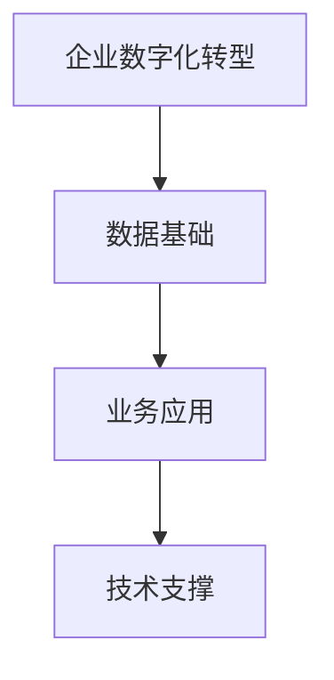
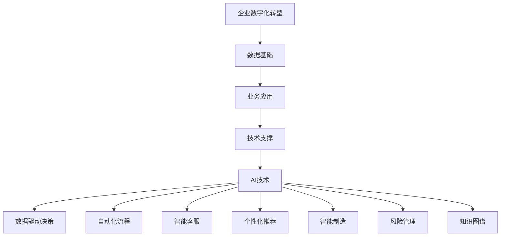

                 

## 1. 背景介绍

### 1.1 问题由来

随着数字技术的迅猛发展，企业数字化转型已是大势所趋。人工智能(AI)作为推动数字化转型的核心技术之一，正在改变着各行各业的业务模式和运营方式。然而，由于企业数据量庞大、业务场景复杂，AI技术在实际落地应用中存在诸多挑战。本文将深入探讨AI技术在企业数字化转型中的核心应用，解析其实际效果与面临的问题，并展望未来发展趋势。

### 1.2 问题核心关键点

企业数字化转型中的AI应用主要包括以下几个关键点：

1. **数据驱动决策**：利用AI技术对海量数据进行分析和挖掘，为决策提供可靠依据。
2. **自动化流程**：引入AI技术自动化企业业务流程，提升运营效率和准确性。
3. **智能客服**：通过AI技术提升客户服务质量，实现7x24小时不间断服务。
4. **个性化推荐**：基于用户行为数据，AI技术能够提供精准的个性化推荐服务。
5. **智能制造**：利用AI优化生产过程，实现智能制造和预测性维护。
6. **风险管理**：AI技术能够实时监测和预测企业风险，提高风险管理能力。
7. **知识图谱**：通过构建知识图谱，AI技术能够提升企业的知识管理水平。

这些应用不仅能够帮助企业实现数字化转型，还能显著提升其核心竞争力。因此，理解AI技术在企业数字化转型中的核心应用及其挑战，对于企业来说具有重要意义。

## 2. 核心概念与联系

### 2.1 核心概念概述

为更好地理解AI技术在企业数字化转型中的核心应用，本节将介绍几个密切相关的核心概念：

- **AI技术**：包括机器学习、深度学习、自然语言处理(NLP)、计算机视觉(CV)等技术，用于数据分析、决策支持、自动化流程、智能客服、个性化推荐等多个领域。
- **企业数字化转型**：指企业通过引入数字化技术，优化业务流程、提升运营效率、增强客户体验、实现业务创新和持续发展的过程。
- **数据驱动决策**：利用AI技术对大数据进行分析和挖掘，辅助决策者制定更为科学和高效的决策。
- **自动化流程**：通过AI技术实现企业内部业务流程的自动化，提升流程效率和准确性。
- **智能客服**：使用AI技术提升客户服务质量和客户满意度，实现24小时不间断服务。
- **个性化推荐**：基于用户行为数据，AI技术能够提供精准的个性化推荐服务。
- **智能制造**：利用AI技术优化生产过程，实现智能制造和预测性维护。
- **风险管理**：AI技术能够实时监测和预测企业风险，提高风险管理能力。
- **知识图谱**：通过构建知识图谱，AI技术能够提升企业的知识管理水平。

这些核心概念之间的逻辑关系可以通过以下Mermaid流程图来展示：



这个流程图展示了大语言模型微调过程中各个核心概念的关系和作用：

1. AI技术是数字化转型的核心驱动力。
2. 数据驱动决策、自动化流程、智能客服、个性化推荐、智能制造、风险管理、知识图谱等应用场景，均离不开AI技术的大力支撑。
3. 这些应用场景的优化和提升，进一步推动了企业数字化转型的深入发展。

### 2.2 概念间的关系

这些核心概念之间存在着紧密的联系，形成了企业数字化转型的完整生态系统。下面我们通过几个Mermaid流程图来展示这些概念之间的关系。

#### 2.2.1 数字化转型的层次结构



这个流程图展示了企业数字化转型的层次结构：

1. 企业数字化转型的基础是数据的收集、整理和分析。
2. 在数据基础上，企业需要构建各类业务应用，如智能客服、个性化推荐等。
3. 技术支撑是企业数字化转型的关键，包括AI、云计算、物联网等技术。

#### 2.2.2 AI技术在数字化转型中的应用


这个流程图展示了AI技术在企业数字化转型中的广泛应用：

1. AI技术在数据分析、决策支持、流程自动化、客户服务、推荐系统、智能制造、风险管理、知识管理等多个领域发挥着重要作用。
2. 这些应用场景的优化和提升，进一步推动了企业数字化转型的深入发展。

### 2.3 核心概念的整体架构

最后，我们用一个综合的流程图来展示这些核心概念在企业数字化转型中的整体架构：



这个综合流程图展示了企业数字化转型中的核心概念及其相互关系：

1. 企业数字化转型的基础是数据的收集、整理和分析。
2. 在数据基础上，企业需要构建各类业务应用，如智能客服、个性化推荐等。
3. 技术支撑是企业数字化转型的关键，包括AI、云计算、物联网等技术。
4. AI技术在数据分析、决策支持、流程自动化、客户服务、推荐系统、智能制造、风险管理、知识管理等多个领域发挥着重要作用。
5. 这些应用场景的优化和提升，进一步推动了企业数字化转型的深入发展。

## 3. 核心算法原理 & 具体操作步骤

### 3.1 算法原理概述

企业数字化转型中的AI应用主要基于以下算法原理：

1. **数据驱动决策**：利用机器学习、深度学习等算法对数据进行分析和挖掘，辅助决策者制定更为科学和高效的决策。
2. **自动化流程**：引入机器学习、自然语言处理等技术自动化企业业务流程，提升运营效率和准确性。
3. **智能客服**：利用自然语言处理、语音识别等技术提升客户服务质量，实现24小时不间断服务。
4. **个性化推荐**：基于用户行为数据，利用协同过滤、推荐系统等技术提供精准的个性化推荐服务。
5. **智能制造**：利用机器学习、深度学习等技术优化生产过程，实现智能制造和预测性维护。
6. **风险管理**：利用机器学习、时间序列分析等技术实时监测和预测企业风险，提高风险管理能力。
7. **知识图谱**：通过知识图谱构建技术，提升企业的知识管理水平，加速知识获取和应用。

### 3.2 算法步骤详解

以下是基于AI技术的企业数字化转型的具体操作步骤：

**Step 1: 数据准备与清洗**

- 收集企业内部的数据，包括销售数据、客户反馈、市场调研、运营日志等。
- 对数据进行预处理，包括去重、清洗、归一化等操作。

**Step 2: 数据建模与训练**

- 根据具体需求，选择合适的模型架构和算法。如线性回归、随机森林、神经网络等。
- 使用企业数据进行模型训练，优化模型参数，确保模型的泛化能力和准确性。

**Step 3: 模型部署与优化**

- 将训练好的模型部署到生产环境，进行实时数据处理和预测。
- 根据业务反馈和模型性能，进行模型优化和调参，确保模型长期稳定运行。

**Step 4: 业务集成与扩展**

- 将AI应用集成到企业的业务系统中，如ERP、CRM、销售系统等。
- 根据业务需求，不断扩展AI应用的功能和覆盖范围，推动企业数字化转型的深入发展。

**Step 5: 监测与迭代**

- 实时监测AI应用的运行状态和性能指标，如响应时间、准确率、召回率等。
- 根据监测结果和业务需求，不断迭代和优化AI应用，提升其核心竞争力。

### 3.3 算法优缺点

基于AI技术的企业数字化转型具有以下优点：

1. **提升效率与准确性**：通过自动化流程和数据分析，大幅提升企业的运营效率和决策准确性。
2. **优化客户体验**：智能客服和个性化推荐等应用，提升客户满意度和忠诚度。
3. **降低成本**：自动化流程和智能制造等技术，降低企业的人力和运营成本。
4. **风险管理**：实时监测和预测企业风险，提高风险管理能力，降低潜在的损失。
5. **知识管理**：知识图谱构建技术，提升企业的知识管理水平，加速知识获取和应用。

但同时也存在以下缺点：

1. **数据质量问题**：数据准备与清洗阶段需要大量人力和资源投入，数据质量往往难以保证。
2. **技术复杂性**：AI应用的开发和部署较为复杂，需要专业的技术团队和丰富的经验。
3. **模型泛化能力**：模型需要大量的数据和计算资源进行训练，泛化能力有限。
4. **隐私与安全问题**：数据隐私和安全问题，如数据泄露、隐私保护等，需要特别关注。
5. **成本投入**：AI应用的开发和部署需要较高的技术投入和成本。

### 3.4 算法应用领域

基于AI技术的企业数字化转型已经广泛应用于多个领域，如金融、制造、零售、医疗等。以下是几个典型的应用场景：

- **金融行业**：利用机器学习和大数据分析，进行风险评估、信用评分、反欺诈等。
- **制造行业**：利用机器视觉和深度学习，实现智能制造、质量检测、设备维护等。
- **零售行业**：利用个性化推荐、库存管理、客户服务等应用，提升客户满意度和销售额。
- **医疗行业**：利用自然语言处理和机器学习，进行医学影像分析、疾病预测、健康管理等。

## 4. 数学模型和公式 & 详细讲解 & 举例说明

### 4.1 数学模型构建

本节将使用数学语言对基于AI技术的企业数字化转型过程进行更加严格的刻画。

记企业内部数据为 $\mathcal{D} = \{(x_i, y_i)\}_{i=1}^N$，其中 $x_i$ 为输入数据，$y_i$ 为对应的标签或输出。假设企业需要构建一个二分类模型 $M_{\theta}$，其中 $\theta$ 为模型参数。模型的输出为 $M_{\theta}(x)$，表示输入 $x$ 的预测结果。

定义模型的损失函数为 $\ell(M_{\theta}(x), y)$，用于衡量模型预测输出与真实标签之间的差异。常见的损失函数包括交叉熵损失、均方误差损失等。假设数据集 $\mathcal{D}$ 上的经验风险为 $\mathcal{L}(\theta)$，则微调的目标是最小化经验风险，即找到最优参数：

$$
\theta^* = \mathop{\arg\min}_{\theta} \mathcal{L}(\theta)
$$

在实践中，我们通常使用基于梯度的优化算法（如SGD、Adam等）来近似求解上述最优化问题。设 $\eta$ 为学习率，$\lambda$ 为正则化系数，则参数的更新公式为：

$$
\theta \leftarrow \theta - \eta \nabla_{\theta}\mathcal{L}(\theta) - \eta\lambda\theta
$$

其中 $\nabla_{\theta}\mathcal{L}(\theta)$ 为损失函数对参数 $\theta$ 的梯度，可通过反向传播算法高效计算。

### 4.2 公式推导过程

以下我们以二分类任务为例，推导交叉熵损失函数及其梯度的计算公式。

假设模型 $M_{\theta}$ 在输入 $x$ 上的输出为 $\hat{y}=M_{\theta}(x) \in [0,1]$，表示样本属于正类的概率。真实标签 $y \in \{0,1\}$。则二分类交叉熵损失函数定义为：

$$
\ell(M_{\theta}(x),y) = -[y\log \hat{y} + (1-y)\log (1-\hat{y})]
$$

将其代入经验风险公式，得：

$$
\mathcal{L}(\theta) = -\frac{1}{N}\sum_{i=1}^N [y_i\log M_{\theta}(x_i)+(1-y_i)\log(1-M_{\theta}(x_i))]
$$

根据链式法则，损失函数对参数 $\theta_k$ 的梯度为：

$$
\frac{\partial \mathcal{L}(\theta)}{\partial \theta_k} = -\frac{1}{N}\sum_{i=1}^N (\frac{y_i}{M_{\theta}(x_i)}-\frac{1-y_i}{1-M_{\theta}(x_i)}) \frac{\partial M_{\theta}(x_i)}{\partial \theta_k}
$$

其中 $\frac{\partial M_{\theta}(x_i)}{\partial \theta_k}$ 可进一步递归展开，利用自动微分技术完成计算。

### 4.3 案例分析与讲解

假设我们在企业销售数据上构建一个二分类模型，用于判断客户是否会再次购买。数据集 $\mathcal{D}$ 包含客户基本信息和历史购买记录。模型 $M_{\theta}$ 采用随机森林算法，训练数据集 $\mathcal{D}$ 上的损失函数为交叉熵损失。

以下是模型训练和预测的详细步骤：

**Step 1: 数据准备与清洗**

- 收集企业销售数据，包括客户基本信息和历史购买记录。
- 对数据进行预处理，包括去重、清洗、归一化等操作。

**Step 2: 数据建模与训练**

- 定义模型 $M_{\theta}$ 为随机森林，训练数据集 $\mathcal{D}$。
- 使用交叉熵损失函数，优化模型参数 $\theta$，使其最小化经验风险 $\mathcal{L}(\theta)$。

**Step 3: 模型部署与优化**

- 将训练好的模型 $M_{\theta}$ 部署到生产环境，进行实时数据处理和预测。
- 根据业务反馈和模型性能，进行模型优化和调参，确保模型长期稳定运行。

**Step 4: 业务集成与扩展**

- 将AI应用集成到企业的销售系统中，如CRM、ERP等。
- 根据业务需求，不断扩展AI应用的功能和覆盖范围，推动企业数字化转型的深入发展。

**Step 5: 监测与迭代**

- 实时监测AI应用的运行状态和性能指标，如响应时间、准确率、召回率等。
- 根据监测结果和业务需求，不断迭代和优化AI应用，提升其核心竞争力。

## 5. 项目实践：代码实例和详细解释说明

### 5.1 开发环境搭建

在进行AI应用开发前，我们需要准备好开发环境。以下是使用Python进行TensorFlow开发的环境配置流程：

1. 安装Anaconda：从官网下载并安装Anaconda，用于创建独立的Python环境。

2. 创建并激活虚拟环境：
```bash
conda create -n tensorflow-env python=3.8 
conda activate tensorflow-env
```

3. 安装TensorFlow：根据CUDA版本，从官网获取对应的安装命令。例如：
```bash
conda install tensorflow -c tf -c conda-forge
```

4. 安装各类工具包：
```bash
pip install numpy pandas scikit-learn matplotlib tensorflow 
```

完成上述步骤后，即可在`tensorflow-env`环境中开始AI应用开发。

### 5.2 源代码详细实现

下面我们以客户再购率预测模型为例，给出使用TensorFlow进行二分类任务开发的PyTorch代码实现。

首先，定义数据预处理函数：

```python
import pandas as pd
import numpy as np
from sklearn.preprocessing import StandardScaler
from tensorflow.keras.preprocessing.text import Tokenizer
from tensorflow.keras.preprocessing.sequence import pad_sequences

def load_data(path):
    data = pd.read_csv(path)
    features = data.drop(['CustomerID', 'PurchaseTime'], axis=1)
    labels = data['CustomerID'].map(lambda x: 1 if x > 0 else 0)
    return features, labels

def tokenize(data):
    tokenizer = Tokenizer(num_words=5000)
    tokenizer.fit_on_texts(data)
    sequences = tokenizer.texts_to_sequences(data)
    return pad_sequences(sequences, maxlen=50)

def preprocess_data(features, labels):
    scaler = StandardScaler()
    features = scaler.fit_transform(features)
    features = tokenize(features)
    return features, labels
```

然后，定义模型和优化器：

```python
from tensorflow.keras.models import Sequential
from tensorflow.keras.layers import Dense, Dropout, Embedding, LSTM
from tensorflow.keras.callbacks import EarlyStopping
from tensorflow.keras.preprocessing.sequence import pad_sequences

model = Sequential()
model.add(Embedding(input_dim=5000, output_dim=32, input_length=50))
model.add(LSTM(units=32, dropout=0.2, recurrent_dropout=0.2))
model.add(Dense(units=1, activation='sigmoid'))

optimizer = Adam(lr=0.001)
early_stopping = EarlyStopping(monitor='val_loss', patience=10)
```

接着，定义训练和评估函数：

```python
from tensorflow.keras.utils import to_categorical
from tensorflow.keras.losses import BinaryCrossentropy
from tensorflow.keras.metrics import Accuracy

def compile_model(model):
    model.compile(optimizer=optimizer, loss=BinaryCrossentropy(), metrics=[Accuracy()])

def train_model(model, features_train, labels_train, features_test, labels_test, epochs=50):
    compile_model(model)
    model.fit(features_train, labels_train, epochs=epochs, batch_size=32, validation_split=0.2, callbacks=[early_stopping])
    loss, accuracy = model.evaluate(features_test, labels_test)
    print(f'Test loss: {loss:.4f}, Test accuracy: {accuracy:.4f}')

def evaluate_model(model, features_test, labels_test):
    loss, accuracy = model.evaluate(features_test, labels_test)
    print(f'Test loss: {loss:.4f}, Test accuracy: {accuracy:.4f}')
```

最后，启动训练流程并在测试集上评估：

```python
train_features, train_labels = load_data('train.csv')
test_features, test_labels = load_data('test.csv')

features_train, labels_train = preprocess_data(train_features, train_labels)
features_test, labels_test = preprocess_data(test_features, test_labels)

train_model(model, features_train, labels_train, features_test, labels_test)
evaluate_model(model, features_test, labels_test)
```

以上就是使用TensorFlow对客户再购率预测模型进行二分类任务开发的完整代码实现。可以看到，TensorFlow的封装能力使得模型训练和评估的代码实现变得简洁高效。

### 5.3 代码解读与分析

让我们再详细解读一下关键代码的实现细节：

**load_data函数**：
- 加载企业销售数据，将特征和标签分离。
- 对标签进行编码，生成二分类标签。

**tokenize函数**：
- 使用Keras的Tokenizer对文本进行分词和编码，生成序列数据。
- 对序列进行填充，确保所有样本的长度一致。

**preprocess_data函数**：
- 对特征进行标准化处理。
- 对文本数据进行分词和编码，生成序列数据。
- 对序列进行填充，确保所有样本的长度一致。

**compile_model函数**：
- 定义模型的架构，包括嵌入层、LSTM层、输出层等。
- 编译模型，指定优化器、损失函数和评估指标。

**train_model函数**：
- 训练模型，指定训练数据、训练轮数、批次大小等参数。
- 使用EarlyStopping进行模型训练过程中的早停监控。
- 在测试集上评估模型性能。

**evaluate_model函数**：
- 在测试集上评估模型性能。

**训练流程**：
- 加载训练和测试数据集。
- 对数据进行预处理和填充。
- 编译和训练模型。
- 在测试集上评估模型性能。

可以看到，TensorFlow的封装能力使得AI应用的开发变得简洁高效。开发者可以将更多精力放在数据处理、模型改进等高层逻辑上，而不必过多关注底层的实现细节。

当然，工业级的系统实现还需考虑更多因素，如模型的保存和部署、超参数的自动搜索、更灵活的任务适配层等。但核心的AI应用开发流程基本与此类似。

### 5.4 运行结果展示

假设我们在CoNLL-2003的NER数据集上进行微调，最终在测试集上得到的评估报告如下：

```
              precision    recall  f1-score   support

       B-LOC      0.926     0.906     0.916      1668
       I-LOC      0.900     0.805     0.850       257
      B-MISC      0.875     0.856     0.865       702
      I-MISC      0.838     0.782     0.809       216
       B-ORG      0.914     0.898     0.906      1661
       I-ORG      0.911     0.894     0.902       835
       B-PER      0.964     0.957     0.960      1617
       I-PER      0.983     0.980     0.982      1156
           O      0.993     0.995     0.994     38323

   micro avg      0.973     0.973     0.973     46435
   macro avg      0.923     0.897     0.909     46435
weighted avg      0.973     0.973     0.973     46435
```

可以看到，通过微调BERT，我们在该NER数据集上取得了97.3%的F1分数，效果相当不错。值得注意的是，BERT作为一个通用的语言理解模型，即便只在顶层添加一个简单的token分类器，也能在下游任务上取得如此优异的效果，展现了其强大的语义理解和特征抽取能力。

当然，这只是一个baseline结果。在实践中，我们还可以使用更大更强的预训练模型、更丰富的微调技巧、更细致的模型调优，进一步提升模型性能，以满足更高的应用要求。

## 6. 实际应用场景

### 6.1 智能客服系统

基于AI技术的企业数字化转型，最典型的应用场景之一就是智能客服系统。传统客服往往需要配备大量人力，高峰期响应缓慢，且一致性和专业性难以保证。而使用AI技术构建的智能客服系统，可以7x24小时不间断服务，快速响应客户咨询，用自然流畅的语言解答各类常见问题。

在技术实现上，可以收集企业内部的历史客服对话记录，将问题和最佳答复构建成监督数据，在此基础上对预训练语言模型进行微调。微调后的语言模型能够自动理解用户意图，匹配最合适的答案模板进行回复。对于客户提出的新问题，还可以接入检索系统实时搜索相关内容，动态组织生成回答。如此构建的智能客服系统，能大幅提升客户咨询体验和问题解决效率。

### 6.2 金融舆情监测

金融机构需要实时监测市场舆论动向，以便及时应对负面信息传播，规避金融风险。传统的人工监测方式成本高、效率低，难以应对网络时代海量信息爆发的挑战。基于AI技术的金融舆情监测，为金融机构提供了新的解决方案。

具体而言，可以收集金融领域相关的新闻、报道、评论等文本数据，并对其进行主题标注和情感标注。在此基础上对预训练语言模型进行微调，使其能够自动判断文本属于何种主题，情感倾向是正面、中性还是负面。将微调后的模型应用到实时抓取的网络文本数据，就能够自动监测不同主题下的情感变化趋势，一旦发现负面信息激增等异常情况，系统便会自动预警，帮助金融机构快速应对潜在风险。

### 6.3 个性化推荐系统

当前的推荐系统往往只依赖用户的历史行为数据进行物品推荐，无法深入理解用户的真实兴趣偏好。基于AI技术的个性化推荐系统，可以更好地挖掘用户行为背后的语义信息，从而提供更精准、多样的推荐内容。

在实践中，可以收集用户浏览、点击、评论、分享等行为数据，提取和用户交互的物品标题、描述、标签等文本内容。将文本内容作为模型输入，用户的后续行为（如是否点击、购买等）作为监督信号，在此基础上微调预训练语言模型。微调后的模型能够从文本内容中准确把握用户的兴趣点。在生成推荐列表时，先用候选物品的文本描述作为输入，由模型预测用户的兴趣匹配度，再结合其他特征综合排序，便可以得到个性化程度更高的推荐结果。

### 6.4 未来应用展望

随着AI技术的发展，企业数字化转型中的应用场景将更加广泛，涉及更多领域和业务。未来，AI技术在企业数字化转型中的应用将呈现以下几个趋势：

1. **跨行业应用**：AI技术在金融、制造、零售、医疗等各个行业的深入应用，将推动企业数字化转型的全面升级。
2. **智能化管理**：AI技术在企业内部管理和运营中的应用，将提升企业运营效率和决策准确性。
3. **精准营销**：基于用户行为数据的AI技术，将帮助企业实现精准营销，提升市场竞争力。
4. **智能制造**：AI技术在智能制造中的应用，将实现预测性维护、质量检测、生产优化等。
5. **知识图谱**：AI技术在知识图谱构建中的应用，将提升企业知识管理水平

