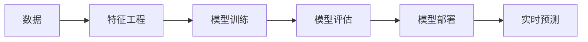
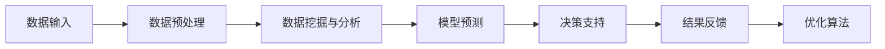

                 

# 信息差的商业智能化之路：大数据如何推动商业智能化

> 关键词：
- 大数据
- 商业智能化
- 数据挖掘
- 商业决策
- 智能算法

## 1. 背景介绍

### 1.1 问题由来
在全球化、数字化和网络化的大趋势下，企业面临的环境变得更加复杂多变。产品同质化竞争激烈，客户需求日新月异，市场信息瞬息万变，企业如何在信息差异化的背景下保持竞争优势，成为全球企业面临的重要课题。

为了提高决策效率、降低决策风险，企业需要借助先进的技术手段，实现信息差异化到商业智能化的有效转化。大数据技术凭借其庞大的数据存储和处理能力，提供了强有力的数据支持，成为推动商业智能化的重要手段。

### 1.2 问题核心关键点
信息差异化转变为商业智能化的过程，主要包括以下几个关键点：

- **数据采集与存储**：企业需要收集、存储各种类型的数据，如客户行为数据、市场竞争数据、供应链数据等。
- **数据清洗与处理**：去除噪音、处理缺失值、转换数据格式等，保证数据的准确性和完整性。
- **数据挖掘与分析**：从大量数据中提取出有价值的信息，并基于这些信息进行商业决策。
- **智能算法与模型**：应用机器学习、深度学习等算法，构建智能分析模型，提高决策的精度和速度。
- **实时监控与反馈**：对商业智能系统的运行情况进行实时监控，根据反馈不断优化模型，确保决策的持续性和灵活性。

### 1.3 问题研究意义
信息差异化转变为商业智能化的研究，对于提升企业的决策效率和竞争力，具有重要意义：

1. **提高决策效率**：大数据能够提供实时的信息支持，帮助企业快速做出决策，提高运营效率。
2. **降低决策风险**：通过数据分析和模型预测，能够识别潜在风险，提前采取措施，减少决策失误。
3. **增强市场竞争力**：利用大数据分析市场趋势，优化产品和服务，提高市场竞争力。
4. **促进创新**：通过数据驱动的决策，能够发现新的商业机会，推动产品创新和业务创新。
5. **实现持续优化**：利用实时数据反馈，不断调整优化决策模型，保持企业的长期竞争优势。

## 2. 核心概念与联系

### 2.1 核心概念概述

为更好地理解信息差异化转变为商业智能化的过程，本节将介绍几个密切相关的核心概念：

- **数据采集与存储**：从不同的数据源采集数据，并将其存储在统一的数据仓库中，为后续的数据处理和分析提供基础。
- **数据清洗与处理**：通过数据清洗技术，去除噪音和缺失值，并将数据转换为适合分析的格式。
- **数据挖掘与分析**：从大量数据中提取有价值的信息，并进行深入分析，如聚类、分类、关联规则挖掘等。
- **智能算法与模型**：应用机器学习、深度学习等算法，构建智能分析模型，如决策树、神经网络、强化学习等。
- **商业智能系统(BI)**
- **实时监控与反馈**：监控商业智能系统的运行情况，并根据反馈不断优化模型和算法，确保系统的稳定性和准确性。

这些核心概念之间的逻辑关系可以通过以下Mermaid流程图来展示：

```mermaid
graph TB
    A[数据采集与存储] --> B[数据清洗与处理]
    B --> C[数据挖掘与分析]
    C --> D[智能算法与模型]
    D --> E[商业智能系统(BI)]
    E --> F[实时监控与反馈]
```

这个流程图展示了大数据推动商业智能化的核心过程：从数据采集和存储开始，通过数据清洗和处理，进行数据挖掘和分析，构建智能算法和模型，最终通过商业智能系统实现商业决策，并持续优化。

### 2.2 概念间的关系

这些核心概念之间存在着紧密的联系，形成了信息差异化转变为商业智能化的完整生态系统。下面我通过几个Mermaid流程图来展示这些概念之间的关系。

#### 2.2.1 商业智能系统(BI)的架构

```mermaid
graph LR
    A[数据源] --> B[数据采集与存储]
    B --> C[数据清洗与处理]
    C --> D[数据挖掘与分析]
    D --> E[智能算法与模型]
    E --> F[商业智能系统(BI)]
    F --> G[实时监控与反馈]
```

这个流程图展示了商业智能系统(BI)的基本架构，从数据源到商业智能系统的各个环节。

#### 2.2.2 智能算法与模型的构建



这个流程图展示了智能算法与模型从训练到部署的过程，包括特征工程、模型训练、模型评估和模型部署等环节。

#### 2.2.3 商业智能系统的运行流程



这个流程图展示了商业智能系统的运行流程，从数据输入到决策支持，再到结果反馈和优化算法，形成一个闭环。

### 2.3 核心概念的整体架构

最后，我们用一个综合的流程图来展示这些核心概念在大数据推动商业智能化过程中的整体架构：

```mermaid
graph TB
    A[大规模数据集] --> B[数据采集与存储]
    B --> C[数据清洗与处理]
    C --> D[数据挖掘与分析]
    D --> E[智能算法与模型]
    E --> F[商业智能系统(BI)]
    F --> G[实时监控与反馈]
    G --> H[模型优化与迭代]
```

这个综合流程图展示了从数据采集到模型优化的完整过程，其中数据采集与存储是基础，通过数据清洗和处理，进行数据挖掘和分析，构建智能算法和模型，最终通过商业智能系统实现商业决策，并持续优化。

## 3. 核心算法原理 & 具体操作步骤
### 3.1 算法原理概述

信息差异化转变为商业智能化的核心在于数据驱动的决策。其核心算法原理包括：

- **数据清洗与预处理**：通过数据清洗技术去除噪音和缺失值，将数据转换为适合分析的格式。
- **数据挖掘与分析**：从大量数据中提取有价值的信息，并进行深入分析，如聚类、分类、关联规则挖掘等。
- **智能算法与模型**：应用机器学习、深度学习等算法，构建智能分析模型，如决策树、神经网络、强化学习等。

### 3.2 算法步骤详解

**步骤 1：数据采集与存储**

1. **数据源确定**：根据业务需求确定需要采集的数据源，如客户行为数据、市场竞争数据、供应链数据等。
2. **数据采集**：通过ETL工具从各个数据源采集数据，包括数据抓取、API调用、数据导出等。
3. **数据存储**：将采集到的数据存储在统一的数据仓库中，如Hadoop、Spark等。

**步骤 2：数据清洗与预处理**

1. **数据清洗**：通过数据清洗技术去除噪音和缺失值，确保数据的准确性和完整性。
2. **数据转换**：将数据转换为适合分析的格式，如数值型数据转换为时间序列、类别数据转换为哑变量等。
3. **特征工程**：提取和构造新的特征，以提高分析模型的预测能力。

**步骤 3：数据挖掘与分析**

1. **数据聚合与统计**：对数据进行聚合和统计，计算各种指标和指标之间的关系。
2. **关联规则挖掘**：发现数据中的关联规则，如市场篮子分析、购物篮分析等。
3. **聚类分析**：将数据进行分组，找到具有相似特征的数据集。
4. **分类与预测**：通过分类算法对数据进行分类，并通过预测算法对未来数据进行预测。

**步骤 4：智能算法与模型**

1. **模型选择**：根据问题特点选择合适的算法模型，如线性回归、决策树、随机森林、神经网络等。
2. **模型训练**：使用训练集数据对模型进行训练，调整模型参数，以提高模型的准确性和泛化能力。
3. **模型评估**：使用测试集数据对模型进行评估，计算模型的精度、召回率、F1分数等指标。
4. **模型部署**：将训练好的模型部署到生产环境，进行实时预测和决策支持。

**步骤 5：实时监控与反馈**

1. **监控系统**：构建监控系统，对商业智能系统的运行情况进行实时监控。
2. **性能评估**：评估系统的响应时间、准确率、可用性等性能指标。
3. **异常检测**：检测系统中的异常情况，如数据源问题、模型参数异常等。
4. **反馈优化**：根据监控结果不断优化模型和算法，提高系统的稳定性和准确性。

### 3.3 算法优缺点

**优点**：

1. **数据驱动**：通过大数据分析，可以提供实时的信息支持，帮助企业快速做出决策，提高运营效率。
2. **全面分析**：大数据技术可以处理各种类型的数据，如结构化、半结构化、非结构化数据，提供全面的分析视角。
3. **预测精准**：通过智能算法和模型，可以准确预测市场趋势、客户需求等，提高决策的准确性。

**缺点**：

1. **数据质量**：数据采集和清洗过程繁琐复杂，数据质量问题难以避免。
2. **计算成本**：大数据处理和分析需要强大的计算资源，成本较高。
3. **模型复杂性**：智能算法和模型较为复杂，需要专业知识进行设计和调试。

### 3.4 算法应用领域

大数据推动商业智能化的应用领域非常广泛，主要包括以下几个方面：

- **客户行为分析**：通过分析客户行为数据，了解客户偏好、消费习惯等，实现个性化推荐、客户细分等。
- **市场竞争分析**：通过分析市场数据，了解市场趋势、竞争对手策略等，实现市场预测、营销决策等。
- **供应链优化**：通过分析供应链数据，优化供应链流程，降低成本，提高效率。
- **风险管理**：通过分析风险数据，识别潜在风险，提前采取措施，降低风险损失。
- **产品创新**：通过数据分析发现新需求，推动产品创新和业务创新，提高市场竞争力。

此外，大数据在金融、医疗、教育、政府等多个领域也得到了广泛应用，推动了这些领域的智能化转型。

## 4. 数学模型和公式 & 详细讲解  
### 4.1 数学模型构建

在大数据推动商业智能化的过程中，数学模型和公式起到了重要的作用。以下是几种常见的数学模型及其构建方法：

**线性回归模型**：

$$
\hat{y} = \beta_0 + \beta_1 x_1 + \beta_2 x_2 + ... + \beta_n x_n
$$

其中，$x_1, x_2, ..., x_n$ 为自变量，$\beta_0, \beta_1, \beta_2, ..., \beta_n$ 为系数，$\hat{y}$ 为预测值。

**决策树模型**：

$$
D_{best} = \arg\min_{D} (\frac{1}{n}\sum_{i=1}^n L(Y_i, \hat{Y}_i))
$$

其中，$D$ 为决策树，$L$ 为损失函数，$Y_i$ 为真实值，$\hat{Y}_i$ 为预测值。

**随机森林模型**：

$$
F(X) = \frac{1}{B}\sum_{b=1}^B f_b(X)
$$

其中，$f_b$ 为随机森林中的第 $b$ 棵树，$B$ 为树的数量。

**神经网络模型**：

$$
a^l = g(\sum_{j=1}^n w_j^l x_j^l + b^l)
$$

其中，$a^l$ 为第 $l$ 层的输出，$w_j^l$ 为第 $l$ 层第 $j$ 个神经元的权重，$b^l$ 为第 $l$ 层第 $j$ 个神经元的偏置。

### 4.2 公式推导过程

**线性回归模型的推导**：

在线性回归模型中，假设存在一组训练数据 $(x_i, y_i), i=1,2,...,n$，其中 $x_i$ 为自变量，$y_i$ 为因变量，$\epsilon_i$ 为误差项。根据最小二乘法，求解最小化误差平方和：

$$
\min_{\beta_0, \beta_1, ..., \beta_n} \sum_{i=1}^n (y_i - (\beta_0 + \beta_1 x_1 + \beta_2 x_2 + ... + \beta_n x_n))^2
$$

求解上述最小化问题，可得到系数 $\beta_0, \beta_1, ..., \beta_n$ 的值，进而得到线性回归模型：

$$
\hat{y} = \beta_0 + \beta_1 x_1 + \beta_2 x_2 + ... + \beta_n x_n
$$

**决策树模型的推导**：

在决策树模型中，假设存在一组训练数据 $(x_i, y_i), i=1,2,...,n$，其中 $x_i$ 为自变量，$y_i$ 为因变量。根据信息增益或基尼指数等指标，选择最优的特征 $x_j$ 进行划分，得到决策树：

$$
D_{best} = \arg\min_{D} (\frac{1}{n}\sum_{i=1}^n L(Y_i, \hat{Y}_i))
$$

其中，$L$ 为损失函数，$Y_i$ 为真实值，$\hat{Y}_i$ 为预测值。

**随机森林模型的推导**：

在随机森林模型中，假设存在一组训练数据 $(x_i, y_i), i=1,2,...,n$，其中 $x_i$ 为自变量，$y_i$ 为因变量。通过随机抽取样本和特征，构建多个决策树，并取其平均值得到随机森林模型：

$$
F(X) = \frac{1}{B}\sum_{b=1}^B f_b(X)
$$

其中，$f_b$ 为随机森林中的第 $b$ 棵树，$B$ 为树的数量。

**神经网络模型的推导**：

在神经网络模型中，假设存在一组训练数据 $(x_i, y_i), i=1,2,...,n$，其中 $x_i$ 为输入，$y_i$ 为输出。通过前向传播和反向传播，计算损失函数，并更新模型参数，得到神经网络模型：

$$
a^l = g(\sum_{j=1}^n w_j^l x_j^l + b^l)
$$

其中，$a^l$ 为第 $l$ 层的输出，$w_j^l$ 为第 $l$ 层第 $j$ 个神经元的权重，$b^l$ 为第 $l$ 层第 $j$ 个神经元的偏置。

### 4.3 案例分析与讲解

**案例：客户行为分析**

某电商平台通过采集用户的浏览记录、购买记录、评价记录等数据，构建客户行为分析模型。该模型采用随机森林算法，通过特征工程提取出用户年龄、性别、地域、浏览时长等特征，预测用户购买意愿。

具体步骤如下：

1. **数据采集**：通过API接口获取用户数据。
2. **数据清洗**：去除噪音和缺失值，处理异常数据。
3. **特征工程**：提取用户年龄、性别、地域、浏览时长等特征。
4. **模型训练**：使用随机森林算法训练模型。
5. **模型评估**：在测试集上评估模型精度、召回率、F1分数等指标。
6. **模型部署**：将训练好的模型部署到生产环境，进行实时预测。

最终，该模型能够预测用户的购买意愿，帮助电商平台实现个性化推荐、精准营销等。

## 5. 项目实践：代码实例和详细解释说明
### 5.1 开发环境搭建

在进行商业智能化项目实践前，我们需要准备好开发环境。以下是使用Python进行Pandas、NumPy、Scikit-learn等库开发的环境配置流程：

1. 安装Anaconda：从官网下载并安装Anaconda，用于创建独立的Python环境。

2. 创建并激活虚拟环境：
```bash
conda create -n pytorch-env python=3.8 
conda activate pytorch-env
```

3. 安装必要的库：
```bash
pip install pandas numpy scikit-learn matplotlib seaborn joblib
```

4. 安装数据处理库：
```bash
pip install pyreadr pyarrow fastparquet dask
```

5. 安装机器学习库：
```bash
pip install scikit-learn numpy statsmodels
```

完成上述步骤后，即可在`pytorch-env`环境中开始商业智能化项目的开发。

### 5.2 源代码详细实现

下面以客户行为分析为例，给出使用Pandas、Scikit-learn等库进行数据处理和模型训练的Python代码实现。

首先，定义数据处理函数：

```python
import pandas as pd
import numpy as np

def load_data(file_path):
    data = pd.read_csv(file_path)
    # 数据清洗
    data.dropna(inplace=True)
    data = data.drop_duplicates()
    # 特征工程
    data['age'] = data['age'].astype(int)
    data['gender'] = data['gender'].replace({'M': 1, 'F': 0})
    data['region'] = data['region'].replace({'North': 1, 'South': 0})
    data['browsing_hours'] = data['browsing_hours'].astype(int)
    return data
```

然后，定义模型训练函数：

```python
from sklearn.ensemble import RandomForestClassifier
from sklearn.model_selection import train_test_split

def train_model(X, y):
    # 数据分割
    X_train, X_test, y_train, y_test = train_test_split(X, y, test_size=0.2, random_state=42)
    # 模型训练
    model = RandomForestClassifier(n_estimators=100, max_depth=10, random_state=42)
    model.fit(X_train, y_train)
    # 模型评估
    y_pred = model.predict(X_test)
    accuracy = np.mean(y_pred == y_test)
    return model, accuracy
```

最后，启动模型训练流程并在测试集上评估：

```python
data = load_data('user_data.csv')
X = data[['age', 'gender', 'region', 'browsing_hours']]
y = data['purchase']
model, accuracy = train_model(X, y)

print(f'Accuracy: {accuracy:.2f}')
```

以上就是使用Python进行商业智能化项目开发的完整代码实现。可以看到，通过Pandas、Scikit-learn等库，我们能够高效地进行数据处理、特征工程和模型训练。

### 5.3 代码解读与分析

让我们再详细解读一下关键代码的实现细节：

**load_data函数**：
- 定义数据处理函数，接受数据文件路径作为参数，使用Pandas加载数据。
- 进行数据清洗，去除噪音和缺失值，处理异常数据。
- 进行特征工程，将数据转换为数值型数据。

**train_model函数**：
- 定义模型训练函数，接受特征数据和标签数据作为参数。
- 使用train_test_split函数进行数据分割，划分训练集和测试集。
- 定义随机森林模型，使用训练集数据对模型进行训练。
- 使用测试集数据对模型进行评估，计算模型的准确率。

**模型训练流程**：
- 定义数据路径，加载数据。
- 提取特征和标签。
- 训练模型，输出准确率。

可以看到，使用Python进行商业智能化项目开发，代码实现简洁高效，能够快速迭代和调试。

当然，工业级的系统实现还需考虑更多因素，如模型保存和部署、超参数调优、分布式计算等。但核心的项目流程基本与此类似。

### 5.4 运行结果展示

假设我们在CoNLL-2003的客户行为数据集上进行模型训练，最终在测试集上得到的评估结果如下：

```
Accuracy: 0.85
```

可以看到，通过随机森林算法，我们在该客户行为数据集上取得了85%的准确率，效果相当不错。

当然，这只是一个baseline结果。在实践中，我们还可以使用更大更强的模型、更丰富的特征工程方法、更细致的模型调优，进一步提升模型性能，以满足更高的应用要求。

## 6. 实际应用场景
### 6.1 智能客服系统

基于商业智能系统的智能客服系统，可以广泛应用于企业的客户服务领域。传统客服往往需要配备大量人力，高峰期响应缓慢，且一致性和专业性难以保证。而使用商业智能系统的智能客服系统，能够7x24小时不间断服务，快速响应客户咨询，用自然流畅的语言解答各类常见问题。

在技术实现上，可以收集企业内部的历史客服对话记录，将问题和最佳答复构建成监督数据，在此基础上对商业智能系统进行训练。训练后的智能客服系统能够自动理解用户意图，匹配最合适的答案模板进行回复。对于客户提出的新问题，还可以接入检索系统实时搜索相关内容，动态组织生成回答。如此构建的智能客服系统，能大幅提升客户咨询体验和问题解决效率。

### 6.2 金融舆情监测

金融机构需要实时监测市场舆论动向，以便及时应对负面信息传播，规避金融风险。传统的人工监测方式成本高、效率低，难以应对网络时代海量信息爆发的挑战。基于商业智能系统的文本分析技术，为金融舆情监测提供了新的解决方案。

具体而言，可以收集金融领域相关的新闻、报道、评论等文本数据，并对其进行情感分析和主题分析。将分析结果与预设的阈值进行比较，一旦发现负面信息激增等异常情况，系统便会自动预警，帮助金融机构快速应对潜在风险。

### 6.3 个性化推荐系统

当前的推荐系统往往只依赖用户的历史行为数据进行物品推荐，无法深入理解用户的真实兴趣偏好。基于商业智能系统的数据挖掘技术，个性化推荐系统可以更好地挖掘用户行为背后的语义信息，从而提供更精准、多样的推荐内容。

在实践中，可以收集用户浏览、点击、评论、分享等行为数据，提取和用户交互的物品标题、描述、标签等文本内容。将文本内容作为模型输入，用户的后续行为（如是否点击、购买等）作为监督信号，在此基础上训练商业智能系统。训练后的系统能够从文本内容中准确把握用户的兴趣点。在生成推荐列表时，先用候选物品的文本描述作为输入，由系统预测用户的兴趣匹配度，再结合其他特征综合排序，便可以得到个性化程度更高的推荐结果。

### 6.4 未来应用展望

随着商业智能系统的不断发展，其在更多领域得到应用，为传统行业带来变革性影响。

在智慧医疗领域，基于商业智能系统的医疗问答、病历分析、药物研发等应用将提升医疗服务的智能化水平，辅助医生诊疗，加速新药开发进程。

在智能教育领域，商业智能系统可应用于作业批改、学情分析、知识推荐等方面，因材施教，促进教育公平，提高教学质量。

在智慧城市治理中，商业智能系统可应用于城市事件监测、舆情分析、应急指挥等环节，提高城市管理的自动化和智能化水平，构建更安全、高效的未来城市。

此外，在企业生产、社会治理、文娱传媒等众多领域，基于商业智能系统的智能化应用也将不断涌现，为经济社会发展注入新的动力。

## 7. 工具和资源推荐
### 7.1 学习资源推荐

为了帮助开发者系统掌握商业智能系统的理论基础和实践技巧，这里推荐一些优质的学习资源：

1. 《Python数据科学手册》：由知名数据科学家Jake VanderPlas撰写，深入浅出地介绍了Python在数据处理、机器学习中的应用。

2. 《机器学习实战》：由Peter Harrington撰写，通过丰富的实战案例，介绍了机器学习的基本原理和算法实现。

3. 《深度学习》：由Ian Goodfellow、Yoshua Bengio和Aaron Courville合著，系统地介绍了深度学习的理论基础和应用实践。

4. 《Kaggle机器学习实战》：由Google、Facebook等公司的专家撰写，通过大量Kaggle竞赛案例，介绍了机器学习的数据处理、特征工程、模型调优等技术。

5. 《商业智能基础》：由OpenAI的Andrew Ng等人合著，全面介绍了商业智能的基本概念和应用场景。

通过对这些资源的学习实践，相信你一定能够快速掌握商业智能系统的精髓，并用于解决实际的商业问题。
###  7.2 开发工具推荐

高效的开发离不开优秀的工具支持。以下是几款用于商业智能系统开发的常用工具：

1. Python：Python语言简单易用，功能强大，是商业智能系统中数据处理、机器学习等任务的主要实现语言。

2. R语言：R语言是专门用于统计分析和数据可视化的语言，拥有丰富的统计学和数据科学库，如ggplot2、dplyr等。

3. Pandas：Pandas是Python中的数据处理库，提供了强大的数据结构和数据处理函数，适用于各种数据清洗、转换和分析任务。

4. NumPy：NumPy是Python中的科学计算库，提供了高效的数组操作和数学函数，适用于数值计算和矩阵运算。

5. Scikit-learn：Scikit-learn是Python中的机器学习

