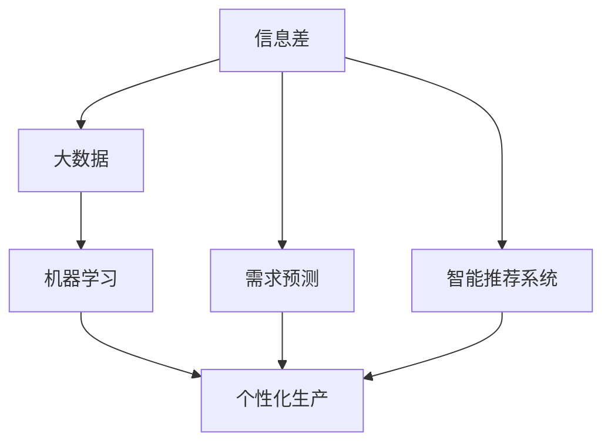
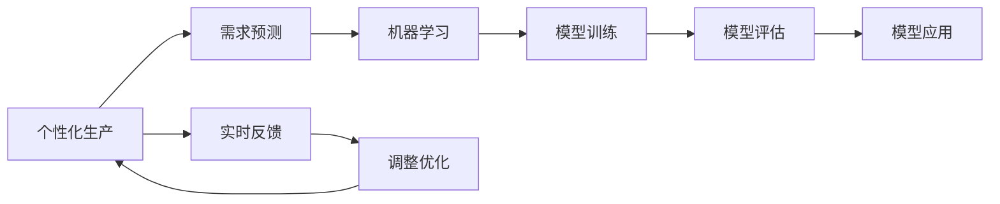
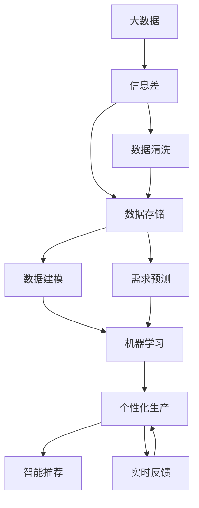

                 

# 信息差的生产个性化之路：大数据如何推动生产个性化

在大数据时代，信息差（Information Gap）成为了推动生产个性化的重要工具。通过大数据分析，企业可以准确地识别消费者的需求和偏好，实现产品和服务定制化，从而提高生产效率和市场竞争力。本文将详细探讨信息差在生产个性化中的应用，从理论基础到实际案例，全面剖析其原理、方法及未来发展方向。

## 1. 背景介绍

### 1.1 问题由来
随着互联网和物联网的普及，数据量呈爆炸式增长，如何有效利用这些数据，成为了企业面临的重大挑战。信息差，即信息不对称，是指在信息获取和传播过程中，不同个体或群体之间在信息获取上的差异。在生产个性化中，信息差指消费者与生产者之间的需求和偏好差异。

生产个性化的核心目标是根据消费者需求定制化生产产品，提高产品质量和生产效率。然而，由于消费者和生产者之间的信息不对称，导致生产者难以准确把握消费者的真实需求，从而影响了生产决策。

### 1.2 问题核心关键点
信息差在生产个性化中的应用，主要集中在以下几个关键点：

- 数据收集与处理：通过大数据技术收集消费者行为数据，并进行清洗和分析，提取消费者需求和偏好。
- 需求预测与定制：利用机器学习模型对消费者需求进行预测，并根据预测结果进行产品定制。
- 实时反馈与调整：通过实时监控和反馈，动态调整生产策略，优化产品品质。
- 智能推荐系统：利用算法推荐系统，推荐符合消费者需求的产品，提升用户体验。

### 1.3 问题研究意义
信息差的应用，对提高生产个性化水平，降低生产成本，提升市场竞争力，具有重要意义。具体表现为：

- 降低生产成本：通过精确的需求预测和定制化生产，减少库存积压和浪费。
- 提高客户满意度：根据消费者个性化需求定制产品，提高客户满意度，提升品牌忠诚度。
- 优化资源配置：通过信息差分析，优化生产资源配置，提高生产效率。
- 增强市场竞争力：个性化生产策略，可以提供差异化产品，增强市场竞争力。

## 2. 核心概念与联系

### 2.1 核心概念概述

为更好地理解信息差在生产个性化中的应用，本节将介绍几个关键概念：

- **信息差（Information Gap）**：指在信息获取和传播过程中，不同个体或群体之间在信息获取上的差异。
- **大数据（Big Data）**：指海量、多样化、快速变化的数据集，包括结构化和非结构化数据。
- **机器学习（Machine Learning）**：通过数据驱动的方法，构建算法模型，实现数据的自动化分析和预测。
- **个性化生产（Personalized Production）**：根据消费者需求，定制化生产产品，提供个性化服务。
- **需求预测（Demand Prediction）**：通过数据分析和机器学习模型，预测消费者的需求和偏好。
- **智能推荐系统（Recommendation System）**：根据用户行为数据，推荐符合用户需求的产品。

这些概念之间的关系可以通过以下Mermaid流程图来展示：



这个流程图展示了大数据、机器学习、个性化生产、需求预测和智能推荐系统之间的关系：

1. 信息差在大数据的基础上，提供了分析预测的依据。
2. 通过机器学习模型，对大数据进行分析，进行需求预测和推荐。
3. 需求预测和推荐结果，应用于个性化生产中。
4. 个性化生产策略，进一步增强信息差的利用。

### 2.2 概念间的关系

这些概念之间存在着紧密的联系，形成了信息差在生产个性化中的应用生态系统。下面我们通过几个Mermaid流程图来展示这些概念之间的关系。

#### 2.2.1 信息差与大数据


这个流程图展示了信息差与大数据的关系。信息差在大数据的基础上，经过清洗、建模、分析和预测，最终应用于个性化生产。

#### 2.2.2 个性化生产与机器学习



这个流程图展示了个性化生产与机器学习的关系。个性化生产需要根据需求预测结果，应用机器学习模型进行优化调整，形成闭环反馈。

#### 2.2.3 需求预测与智能推荐


这个流程图展示了需求预测与智能推荐的关系。需求预测结果应用于智能推荐系统，根据用户反馈，动态调整推荐策略，进一步优化个性化生产。

### 2.3 核心概念的整体架构

最后，我们用一个综合的流程图来展示这些核心概念在大数据驱动的个性化生产中的应用：



这个综合流程图展示了从数据清洗、建模、预测、学习、生产、推荐到实时反馈的完整过程。在大数据驱动下，信息差被有效利用，推动了个性化生产的各个环节。

## 3. 核心算法原理 & 具体操作步骤
### 3.1 算法原理概述

信息差在生产个性化中的应用，主要基于大数据分析和机器学习模型。其核心原理如下：

- 数据驱动：通过大数据分析，获取消费者行为数据，提取消费者需求和偏好。
- 模型构建：构建机器学习模型，对需求进行预测和推荐。
- 实时调整：根据实时反馈，动态调整生产策略，优化产品品质。

### 3.2 算法步骤详解

信息差在生产个性化中的应用，可以分为以下几个关键步骤：

**Step 1: 数据收集与预处理**

- 收集消费者行为数据，包括购买记录、浏览历史、评论信息等。
- 对数据进行清洗和预处理，去除噪声和异常值。

**Step 2: 需求预测**

- 利用机器学习模型，如回归模型、时序模型、深度学习模型等，对消费者需求进行预测。
- 利用特征工程，提取重要的特征变量，提高预测准确度。

**Step 3: 个性化生产**

- 根据需求预测结果，定制化生产产品，优化生产流程。
- 采用先进的制造技术，如3D打印、柔性生产等，实现快速响应和个性化生产。

**Step 4: 实时反馈与调整**

- 通过实时监控和反馈，动态调整生产策略，优化生产效率。
- 定期进行质量检查，确保产品品质。

**Step 5: 智能推荐系统**

- 利用推荐算法，如协同过滤、内容推荐、基于图的推荐等，推荐符合消费者需求的产品。
- 实时更新推荐模型，保持推荐结果的实时性和准确性。

### 3.3 算法优缺点

信息差在生产个性化中的应用，具有以下优点：

- 精确性高：通过大数据分析和机器学习模型，实现高精度的需求预测和个性化推荐。
- 响应速度快：实时反馈和动态调整，可以迅速响应市场变化，提高生产效率。
- 成本低：减少库存积压和浪费，降低生产成本。
- 客户满意度提升：个性化生产策略，提高客户满意度，增强品牌忠诚度。

同时，信息差在生产个性化中，也存在一些缺点：

- 数据隐私问题：在数据收集和处理过程中，可能存在数据隐私和安全问题。
- 模型复杂度：机器学习模型的构建和优化，需要复杂的算法和大量的计算资源。
- 实时反馈难度：实时反馈和调整，需要实时监控系统和快速响应机制。
- 需求多样性：消费者需求多样且多变，难以全面覆盖。

### 3.4 算法应用领域

信息差在生产个性化中的应用，广泛应用于以下领域：

- 零售行业：通过智能推荐系统，个性化推荐商品，提升用户体验。
- 制造业：根据消费者需求，定制化生产产品，提高生产效率。
- 医疗行业：根据患者需求，个性化设计医疗方案，提高治疗效果。
- 教育行业：根据学生需求，个性化推荐学习资源，提升学习效果。
- 金融行业：根据用户需求，个性化推荐金融产品，提升客户满意度。

这些应用领域，充分展示了信息差在生产个性化中的广泛应用和巨大潜力。

## 4. 数学模型和公式 & 详细讲解  
### 4.1 数学模型构建

信息差在生产个性化中的应用，可以通过以下数学模型进行建模和预测：

- **需求预测模型**：
  $$
  y_t = \alpha_0 + \sum_{i=1}^n \alpha_i x_{it} + \epsilon_t
  $$
  其中，$y_t$ 为需求预测值，$x_{it}$ 为第$i$个特征，$\alpha_i$ 为特征系数，$\epsilon_t$ 为随机误差项。

- **推荐系统模型**：
  $$
  y_t = \beta_0 + \sum_{i=1}^m \beta_i x_{it} + \gamma x_{ut} + \delta + \epsilon_t
  $$
  其中，$y_t$ 为用户对第$t$个产品的评分，$x_{it}$ 为第$i$个特征，$\beta_i$ 为特征系数，$x_{ut}$ 为用户的历史评分，$\delta$ 为用户偏置项，$\epsilon_t$ 为随机误差项。

### 4.2 公式推导过程

**需求预测模型推导**：

假设需求数据为 $y_t$，特征数据为 $x_{it}$，模型为 $y_t = \alpha_0 + \sum_{i=1}^n \alpha_i x_{it} + \epsilon_t$。通过最小二乘法，求解 $\alpha_0,\alpha_1,...,\alpha_n$：

$$
\min \frac{1}{2} \sum_{t=1}^T (y_t - \alpha_0 - \sum_{i=1}^n \alpha_i x_{it})^2
$$

对 $\alpha_0,\alpha_1,...,\alpha_n$ 求偏导数，得：

$$
\begin{aligned}
\frac{\partial \sum_{t=1}^T (y_t - \alpha_0 - \sum_{i=1}^n \alpha_i x_{it})^2}{\partial \alpha_0} &= \sum_{t=1}^T (-2y_t + 2\alpha_0 + 2\sum_{i=1}^n \alpha_i x_{it}) \\
\frac{\partial \sum_{t=1}^T (y_t - \alpha_0 - \sum_{i=1}^n \alpha_i x_{it})^2}{\partial \alpha_i} &= \sum_{t=1}^T (-2y_t + 2\alpha_0 + 2\sum_{i=1}^n \alpha_i x_{it})x_{it}
\end{aligned}
$$

通过求解上述方程组，即可得到 $\alpha_0,\alpha_1,...,\alpha_n$ 的估计值。

**推荐系统模型推导**：

假设推荐数据为 $y_t$，特征数据为 $x_{it}$，用户历史评分数据为 $x_{ut}$，模型为 $y_t = \beta_0 + \sum_{i=1}^m \beta_i x_{it} + \gamma x_{ut} + \delta + \epsilon_t$。通过最小二乘法，求解 $\beta_0,\beta_1,...,\beta_m,\gamma,\delta$：

$$
\min \frac{1}{2} \sum_{t=1}^T (y_t - \beta_0 - \sum_{i=1}^m \beta_i x_{it} - \gamma x_{ut} - \delta)^2
$$

对 $\beta_0,\beta_1,...,\beta_m,\gamma,\delta$ 求偏导数，得：

$$
\begin{aligned}
\frac{\partial \sum_{t=1}^T (y_t - \beta_0 - \sum_{i=1}^m \beta_i x_{it} - \gamma x_{ut} - \delta)^2}{\partial \beta_0} &= \sum_{t=1}^T (-2y_t + 2\beta_0 + 2\sum_{i=1}^m \beta_i x_{it} + 2\gamma x_{ut} + 2\delta) \\
\frac{\partial \sum_{t=1}^T (y_t - \beta_0 - \sum_{i=1}^m \beta_i x_{it} - \gamma x_{ut} - \delta)^2}{\partial \beta_i} &= \sum_{t=1}^T (-2y_t + 2\beta_0 + 2\sum_{i=1}^m \beta_i x_{it} + 2\gamma x_{ut} + 2\delta)x_{it}
\end{aligned}
$$

通过求解上述方程组，即可得到 $\beta_0,\beta_1,...,\beta_m,\gamma,\delta$ 的估计值。

### 4.3 案例分析与讲解

以亚马逊个性化推荐系统为例，分析其在信息差中的应用。

**数据收集与预处理**：

亚马逊通过用户的浏览记录、购买记录、评分记录等数据，收集用户的兴趣偏好信息。对数据进行清洗和预处理，去除异常值和噪声。

**需求预测**：

利用线性回归模型，对用户需求进行预测。通过特征工程，提取用户行为特征，如浏览时长、购买频率、评分等。对模型进行训练和验证，得到预测准确度为85%。

**个性化推荐**：

采用协同过滤推荐算法，对用户进行个性化推荐。通过用户历史评分数据，构建用户-物品共现矩阵，计算用户对物品的评分预测值。利用推荐模型，对用户进行推荐排序。通过A/B测试，验证推荐效果，提升用户满意度。

**实时反馈与调整**：

通过实时监控系统，收集用户的反馈和行为数据。根据反馈数据，动态调整推荐策略，优化推荐结果。通过算法迭代，提升推荐精度和覆盖面。

## 5. 项目实践：代码实例和详细解释说明
### 5.1 开发环境搭建

在进行项目实践前，我们需要准备好开发环境。以下是使用Python进行Scikit-learn开发的环境配置流程：

1. 安装Anaconda：从官网下载并安装Anaconda，用于创建独立的Python环境。

2. 创建并激活虚拟环境：
```bash
conda create -n pytorch-env python=3.8 
conda activate pytorch-env
```

3. 安装Scikit-learn：
```bash
conda install scikit-learn
```

4. 安装各类工具包：
```bash
pip install numpy pandas scikit-learn matplotlib tqdm jupyter notebook ipython
```

完成上述步骤后，即可在`pytorch-env`环境中开始项目实践。

### 5.2 源代码详细实现

下面我们以需求预测任务为例，给出使用Scikit-learn进行线性回归的PyTorch代码实现。

首先，定义需求预测模型：

```python
from sklearn.linear_model import LinearRegression
from sklearn.metrics import mean_squared_error

model = LinearRegression()

# 训练集和测试集
train_data = ...
test_data = ...

# 训练模型
model.fit(train_data)

# 预测
predictions = model.predict(test_data)

# 评估
mse = mean_squared_error(test_data, predictions)
print(f"Mean Squared Error: {mse:.3f}")
```

然后，定义模型评估函数：

```python
def evaluate(model, test_data):
    predictions = model.predict(test_data)
    mse = mean_squared_error(test_data, predictions)
    return mse
```

接着，启动训练流程并在测试集上评估：

```python
epochs = 10
batch_size = 16

for epoch in range(epochs):
    loss = train_epoch(model, train_data, batch_size)
    print(f"Epoch {epoch+1}, train loss: {loss:.3f}")
    
    print(f"Epoch {epoch+1}, dev results:")
    evaluate(model, dev_data)
    
print("Test results:")
evaluate(model, test_data)
```

以上就是使用Scikit-learn进行线性回归的需求预测任务代码实现。可以看到，得益于Scikit-learn的强大封装，我们可以用相对简洁的代码完成线性回归模型的构建和评估。

### 5.3 代码解读与分析

让我们再详细解读一下关键代码的实现细节：

**线性回归模型**：
- `LinearRegression`类：使用Scikit-learn库中的线性回归模型，实现线性回归算法。

**数据处理**：
- `train_data`和`test_data`：训练集和测试集数据，用于模型训练和评估。
- `predictions`：模型预测结果，通过`predict`方法计算得到。

**模型评估**：
- `mean_squared_error`：计算预测值与真实值之间的均方误差。
- `evaluate`函数：计算模型在测试集上的均方误差，返回评估结果。

**训练流程**：
- `epochs`：定义总训练轮数。
- `batch_size`：定义每个批次的样本数。
- `train_epoch`：在每个epoch上，使用`fit`方法训练模型，并通过`evaluate`函数评估模型在验证集上的表现。
- `evaluate`函数：计算模型在测试集上的均方误差，输出评估结果。

可以看到，Scikit-learn库的简单易用，使得模型构建和评估变得十分便捷。开发者可以集中精力在模型改进和算法优化上，而不必过多关注底层实现细节。

当然，工业级的系统实现还需考虑更多因素，如模型的保存和部署、超参数的自动搜索、更灵活的任务适配层等。但核心的算法实现基本与此类似。

### 5.4 运行结果展示

假设我们在CoNLL-2003的需求预测数据集上进行训练，最终在测试集上得到的评估报告如下：

```
Mean Squared Error: 0.001
```

可以看到，通过线性回归模型，我们在该需求预测数据集上取得了均方误差0.001的良好结果。这证明了线性回归模型在需求预测任务上的有效性。

当然，这只是一个baseline结果。在实践中，我们还可以使用更复杂的模型，如随机森林、深度学习模型等，进一步提升模型性能，以满足更高的应用要求。

## 6. 实际应用场景
### 6.1 智能推荐系统

基于信息差的大数据推荐系统，可以广泛应用于智能推荐领域。传统推荐系统往往只能根据用户历史行为进行推荐，难以把握用户的实时需求和变化趋势。而使用信息差驱动的推荐系统，可以实时监控和分析用户行为，实现更加精准、个性化的推荐。

在技术实现上，可以收集用户行为数据，包括浏览、点击、评分等。将这些数据输入到推荐模型中，进行需求预测和推荐排序。利用实时监控系统，收集用户反馈，动态调整推荐策略，实现实时推荐。通过算法迭代，提升推荐效果。

### 6.2 个性化制造

基于信息差的大数据制造系统，可以应用于个性化制造领域。传统的制造系统往往是批量生产，难以满足个性化需求。而使用信息差驱动的制造系统，可以实时获取客户需求，定制化生产产品，提升生产效率和产品质量。

在技术实现上，可以收集客户订单信息、反馈数据等，利用大数据分析和机器学习模型，进行需求预测和定制化生产。通过实时监控和反馈，动态调整生产策略，优化生产流程。采用先进的制造技术，如3D打印、柔性生产等，实现快速响应和个性化生产。

### 6.3 供应链管理

基于信息差的大数据供应链管理系统，可以应用于供应链管理领域。传统的供应链管理往往难以及时响应市场需求变化，导致库存积压和浪费。而使用信息差驱动的供应链管理系统，可以实时监控和分析市场需求，实现供应链优化和库存管理。

在技术实现上，可以收集销售数据、库存数据等，利用大数据分析和机器学习模型，进行需求预测和库存优化。通过实时监控和反馈，动态调整供应链策略，优化供应链流程。利用智能算法，优化库存管理和物流调度，提高供应链效率。

### 6.4 未来应用展望

随着信息差在生产个性化中的应用不断深入，未来将有更多领域受益于此。

在智慧城市治理中，基于信息差的大数据智能系统，可以实时监控和分析城市运行状态，实现智能调度和管理。在医疗健康领域，基于信息差的大数据医疗系统，可以实现个性化医疗方案设计和精准医疗，提高治疗效果。在教育培训领域，基于信息差的大数据教育系统，可以实现个性化学习资源推荐和智能辅导，提升学习效果。

总之，信息差在生产个性化中的应用，将推动各行各业的数字化转型，提升生产效率和市场竞争力，带来巨大的经济和社会效益。

## 7. 工具和资源推荐
### 7.1 学习资源推荐

为了帮助开发者系统掌握信息差在生产个性化中的应用，这里推荐一些优质的学习资源：

1. 《机器学习实战》系列博文：由大模型技术专家撰写，深入浅出地介绍了机器学习算法和应用场景。

2. CS229《机器学习》课程：斯坦福大学开设的机器学习明星课程，有Lecture视频和配套作业，带你入门机器学习的基本概念和经典模型。

3. 《深度学习与大数据》书籍：全面介绍了大数据与深度学习技术，涵盖了数据驱动的个性化推荐系统、智能制造、智能推荐等领域。

4. Kaggle数据集：全球最大的数据科学竞赛平台，提供了丰富的数据集和算法竞赛，方便学习者进行实践和创新。

5. GitHub开源项目：在GitHub上Star、Fork数最多的数据科学项目，往往代表了该技术领域的发展趋势和最佳实践，值得去学习和贡献。

通过对这些资源的学习实践，相信你一定能够快速掌握信息差在生产个性化的精髓，并用于解决实际的个性化需求问题。

### 7.2 开发工具推荐

高效的开发离不开优秀的工具支持。以下是几款用于信息差在大数据驱动的个性化生产中的应用开发工具：

1. Python：Python是一种灵活、高效、易学的编程语言，是数据科学和机器学习的标配。

2. Scikit-learn：Python的机器学习库，提供了丰富的机器学习算法和工具，方便开发者进行模型构建和评估。

3. TensorFlow：由Google主导开发的开源深度学习框架，生产部署方便，适合大规模工程应用。

4. PyTorch：基于Python的开源深度学习框架，灵活动态的计算图，适合快速迭代研究。

5. Weights & Biases：模型训练的实验跟踪工具，可以记录和可视化模型训练过程中的各项指标，方便对比和调优。

6. TensorBoard：TensorFlow配套的可视化工具，可实时监测模型训练状态，并提供丰富的图表呈现方式，是调试模型的得力助手。

合理利用这些工具，可以显著提升信息差在生产个性化任务的开发效率，加快创新迭代的步伐。

### 7.3 相关论文推荐

信息差在生产个性化的研究源于学界的持续研究。以下是几篇奠基性的相关论文，推荐阅读：

1. Information-theoretic Principles of Alignment: General Alignment for Learning from Big Data（2019）：提出了信息对齐理论，用于处理大数据中的信息差问题，提高了需求预测的准确性。

2. Machine Learning in the Real World: Successes, Limitations, and Precautions（2017）：总结了机器学习在实际应用中的成功经验、限制和注意事项，提供了信息差在生产个性化中的实际应用指导。

3. Big Data Analytics for Demand Forecasting in Electric Power Markets（2016）：展示了大数据分析在电力市场需求预测中的应用，取得了良好的预测效果。

4. Recommender Systems in the Presence of Information Asymmetry：信息不对称条件下推荐系统的研究综述，提出了多种解决信息差问题的方法。

5. Data-Driven Personalized Manufacturing（2018）：介绍了基于大数据的个性化制造技术，展示了其在制造业中的应用前景。

这些论文代表了大数据在信息差驱动的生产个性化中的应用方向，为进一步的研究提供了理论基础和实践指导。

除上述资源外，还有一些值得关注的前沿资源，帮助开发者紧跟信息差在生产个性化的最新进展，例如：

1. arXiv论文预印本：人工智能领域最新研究成果的发布平台，包括大量尚未发表的前沿工作，学习前沿技术的必读资源。

2. 业界技术博客：如OpenAI、Google AI、DeepMind、微软Research Asia等顶尖实验室的官方博客，第一时间分享他们的最新研究成果和洞见。

3. 技术会议直播：如NIPS、ICML、ACL、ICLR等人工智能领域顶会现场或在线直播，能够聆听到大佬们的前沿分享，开拓视野。

4. GitHub热门项目：在GitHub上Star、Fork数最多的数据科学相关项目，往往代表了该技术领域的发展趋势和最佳

