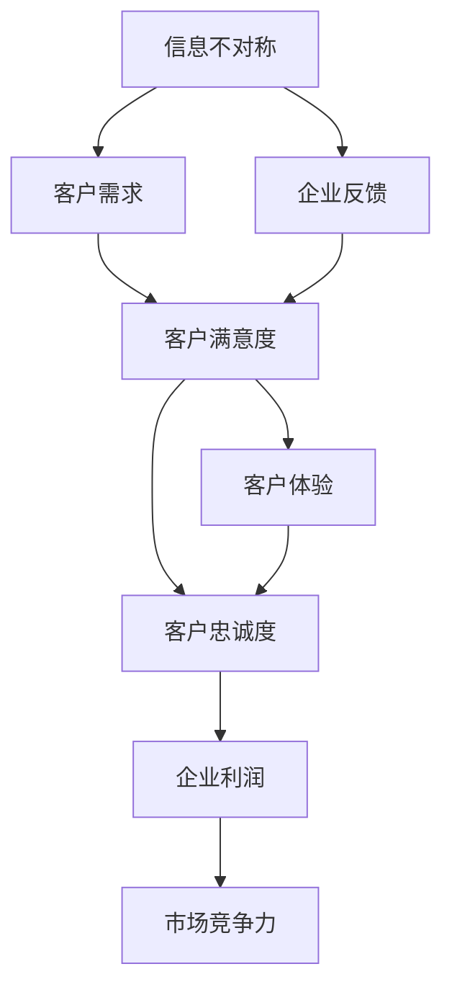

                 

# 信息差：信息不对称与客户关系

## 1. 背景介绍

在现代商业社会中，信息不对称现象无处不在。它不仅仅出现在传统的金融市场、劳动力市场、房地产市场中，同样也渗透到企业客户关系管理的每一个角落。信息差（Information Gap）指的是在交流过程中，由于信息的不完全性、不对称性导致一方无法准确判断对方的真实意图、行为和状态，从而引起误解、误判甚至交易失误。对于企业来说，信息差问题如果处理不当，不仅会导致客户流失，还会引发品牌信任危机，严重影响企业的市场竞争力和盈利能力。

### 1.1 信息差问题的具体表现

信息差问题在很多场景中都有体现，以下是几个典型的例子：

- **产品推荐系统**：电商平台的推荐算法虽然能够通过用户的浏览记录和行为数据来推测用户的兴趣，但这些数据往往是不完整的，且不同用户对同一商品的评价可能存在显著差异，导致推荐结果可能并不精准。
- **客服系统**：在线客服机器人虽然能回答很多常见问题，但对于复杂问题或个性化需求，机器往往无法准确理解用户的真实需求，导致用户满意度下降。
- **客户调研**：市场调研问卷的设计如果不科学，或数据分析方法不正确，往往无法准确反映客户真实的需求和反馈，使得企业决策失准。

### 1.2 信息差问题带来的挑战

信息差问题对企业的客户关系管理提出了严峻挑战：

- **客户信任度下降**：当客户感到企业无法理解或准确回应其需求时，会产生不信任感，进而转向其他竞争者。
- **市场反应滞后**：信息差问题会导致企业对市场动态反应迟缓，错失市场机会。
- **资源浪费**：由于无法准确获取客户需求，企业可能投入大量资源进行不必要的产品开发或营销推广，浪费资源。

## 2. 核心概念与联系

### 2.1 核心概念概述

为了更好地理解信息差对客户关系的影响，并探索有效的解决策略，本节将介绍几个关键概念：

- **信息不对称（Information Asymmetry）**：指交易双方在交易过程中的信息获取存在差异，信息优势方可能利用这种差异获取不当利益。
- **客户满意度（Customer Satisfaction）**：指客户对产品、服务、品牌等的整体评价，是衡量客户关系好坏的重要指标。
- **客户体验（Customer Experience）**：指客户在购买、使用产品或服务过程中的感受和评价，直接影响客户满意度。
- **客户关系管理（Customer Relationship Management, CRM）**：指企业通过信息技术手段，对客户信息进行收集、分析、管理和应用，以提高客户满意度和忠诚度。
- **信息差（Information Gap）**：指信息不对称导致的客户需求和期望与企业反馈之间的差距。

这些概念之间存在着紧密的联系，形成一个有机的整体，共同影响企业的客户关系管理和客户满意度。以下是一个Mermaid流程图，展示了这些概念之间的逻辑关系：



这个流程图展示了信息不对称如何通过客户需求、企业反馈和客户体验，最终影响客户满意度、忠诚度和企业利润。

### 2.2 概念间的关系

这些核心概念之间的联系，可以通过以下几个方面来进一步解释：

- **信息不对称与客户满意度**：信息不对称会导致企业无法准确理解客户需求，从而提供不适合或不满意的解决方案，影响客户满意度。
- **客户满意度与客户体验**：客户满意度是客户体验的直接反映，体验良好的客户更容易对品牌产生忠诚度。
- **客户体验与企业利润**：客户满意度和忠诚度高的客户，更可能进行重复消费和推荐，带来更高的利润。
- **客户忠诚度与市场竞争力**：忠诚的客户是企业宝贵的资产，能够增强企业市场竞争力。

通过这些关系，我们可以更好地理解信息差问题对企业客户关系管理的深远影响，并探索有效的解决策略。

## 3. 核心算法原理 & 具体操作步骤
### 3.1 算法原理概述

解决信息差问题，首先需要构建一个基于信息不对称的模型，以量化信息差对客户关系的影响，并预测客户满意度和忠诚度。

假设客户需求为 $X$，企业反馈为 $Y$，信息差 $D$ 为 $X$ 和 $Y$ 之间的差距。理想情况下，信息差 $D=0$，即 $Y=X$。但现实情况中，信息差往往存在，即 $D>0$。因此，我们需要构建一个模型来预测 $D$ 的大小，并根据 $D$ 的大小来调整企业反馈，提高客户满意度。

### 3.2 算法步骤详解

基于上述原理，解决信息差问题的步骤主要包括：

**Step 1: 数据收集与预处理**

- 收集客户需求 $X$ 和企业反馈 $Y$ 的数据。
- 对数据进行清洗和预处理，如去除噪声、填补缺失值等。

**Step 2: 模型构建与训练**

- 使用机器学习算法（如回归、分类等）构建预测信息差 $D$ 的模型。
- 在训练集上训练模型，并使用交叉验证等方法进行模型选择和调参。

**Step 3: 模型评估与优化**

- 在测试集上评估模型的性能，计算信息差 $D$ 的预测精度和客户满意度的提升效果。
- 根据评估结果，对模型进行优化和调整，如增加特征、调整算法参数等。

**Step 4: 策略实施与反馈循环**

- 在实际业务场景中实施模型，调整企业反馈策略，如优化产品设计、改进服务流程等。
- 收集反馈信息，再次进行模型训练和评估，形成一个持续的反馈循环，不断优化客户关系管理策略。

### 3.3 算法优缺点

基于信息不对称的模型有以下优点：

- **定量分析**：通过量化信息差，能够更精确地理解客户需求与企业反馈之间的差距，指导企业的决策。
- **动态调整**：通过持续的模型优化和反馈循环，能够动态调整企业反馈策略，提高客户满意度。

但该模型也存在一些局限性：

- **数据依赖**：模型的准确性高度依赖于数据的质量和数量，数据偏差可能导致模型预测失准。
- **复杂度较高**：构建和优化模型需要较复杂的算法和大量计算资源，实施成本较高。
- **缺乏解释性**：模型预测的结果往往缺乏可解释性，难以理解模型内部决策过程。

### 3.4 算法应用领域

基于信息不对称的模型广泛应用于客户关系管理领域，具体应用包括：

- **产品推荐系统**：通过分析客户需求和反馈，调整推荐策略，提高推荐效果。
- **在线客服系统**：通过理解客户需求和反馈，优化客服策略，提高客户满意度。
- **市场调研与分析**：通过预测信息差，优化调研问卷设计，准确获取客户需求。
- **品牌管理**：通过量化品牌信任度，调整品牌营销策略，提升品牌忠诚度。

## 4. 数学模型和公式 & 详细讲解 & 举例说明
### 4.1 数学模型构建

为了更好地描述信息差模型，我们可以使用以下数学模型：

设 $X$ 为客户的真实需求，$Y$ 为企业对需求的预测或反馈，$D$ 为信息差。定义信息差 $D$ 为 $Y$ 与 $X$ 之间的差距，即：

$$
D = X - Y
$$

在实际应用中，我们通常使用机器学习算法来构建 $D$ 的预测模型。以回归问题为例，定义预测模型为 $Y=\hat{Y}(X,\theta)$，其中 $\hat{Y}(X,\theta)$ 为模型输出，$\theta$ 为模型参数。

### 4.2 公式推导过程

在回归问题中，我们通常使用均方误差（Mean Squared Error, MSE）来衡量模型预测误差：

$$
\text{MSE} = \frac{1}{N} \sum_{i=1}^N (y_i - \hat{y}_i)^2
$$

其中 $y_i$ 为真实标签，$\hat{y}_i$ 为模型预测。为了最小化 MSE，我们使用梯度下降等优化算法，迭代更新模型参数 $\theta$：

$$
\theta \leftarrow \theta - \eta \nabla_{\theta}\text{MSE}
$$

其中 $\eta$ 为学习率。

### 4.3 案例分析与讲解

假设我们有一个电商平台的推荐系统，收集了用户的浏览记录和购买行为数据，使用回归模型预测用户对某商品的兴趣 $Y$，并将其与用户的真实需求 $X$ 进行比较。设 $D$ 为预测值与真实值之间的差距，通过优化模型参数，使得 $D$ 最小化。

以下是一个简单的Python代码示例，演示如何使用Scikit-learn库构建一个回归模型，预测信息差：

```python
from sklearn.linear_model import LinearRegression
from sklearn.metrics import mean_squared_error
import numpy as np

# 假设我们有一组样本数据
X = np.array([1, 2, 3, 4, 5])
y = np.array([1.2, 2.4, 3.6, 4.8, 6.0])

# 构建回归模型
model = LinearRegression()
model.fit(X.reshape(-1, 1), y)

# 预测信息差
X_test = np.array([6, 7, 8, 9, 10])
y_pred = model.predict(X_test.reshape(-1, 1))
D = X_test - y_pred

# 输出信息差
print("信息差：", D)
```

通过上述代码，我们可以看到，信息差 $D$ 的大小反映了模型预测与真实需求之间的差距。通过不断调整模型参数，可以逐渐减小信息差，提高预测精度。

## 5. 项目实践：代码实例和详细解释说明
### 5.1 开发环境搭建

在开始项目实践之前，我们需要准备开发环境。以下是使用Python和Scikit-learn库搭建开发环境的流程：

1. 安装Anaconda：从官网下载并安装Anaconda，用于创建独立的Python环境。

2. 创建并激活虚拟环境：
```bash
conda create -n information_gap_env python=3.8 
conda activate information_gap_env
```

3. 安装Scikit-learn：
```bash
conda install scikit-learn
```

4. 安装各类工具包：
```bash
pip install numpy pandas matplotlib scikit-learn
```

完成上述步骤后，即可在`information_gap_env`环境中开始项目实践。

### 5.2 源代码详细实现

我们以电商平台的推荐系统为例，给出使用Scikit-learn库构建回归模型的代码实现。

首先，定义回归模型的训练和测试数据：

```python
import numpy as np
from sklearn.linear_model import LinearRegression
from sklearn.metrics import mean_squared_error

# 训练数据
X_train = np.array([1, 2, 3, 4, 5]).reshape(-1, 1)
y_train = np.array([1.2, 2.4, 3.6, 4.8, 6.0])

# 测试数据
X_test = np.array([6, 7, 8, 9, 10]).reshape(-1, 1)

# 构建回归模型
model = LinearRegression()
model.fit(X_train, y_train)

# 预测信息差
y_pred = model.predict(X_test)
D = X_test - y_pred
```

然后，输出信息差 $D$ 的值：

```python
print("信息差：", D)
```

### 5.3 代码解读与分析

让我们再详细解读一下关键代码的实现细节：

**X_train和y_train**：定义训练数据，其中 $X$ 为特征，$y$ 为标签。

**X_test**：定义测试数据，用于评估模型性能。

**LinearRegression**：使用Scikit-learn库中的线性回归模型，定义回归模型。

**model.fit**：在训练数据上拟合模型，更新模型参数。

**model.predict**：在测试数据上预测模型输出。

**X_test - y_pred**：计算预测值与真实值之间的差距，即信息差 $D$。

通过上述代码，我们可以看到，使用线性回归模型可以简单高效地构建一个预测信息差的模型，帮助企业更好地理解客户需求与企业反馈之间的差距，优化推荐策略。

### 5.4 运行结果展示

假设在电商平台上，我们通过线性回归模型预测了用户对某商品的兴趣，并计算了信息差 $D$ 的值。如果 $D$ 的值较小，说明模型预测较为准确，反之则说明预测存在较大误差。

## 6. 实际应用场景
### 6.1 智能客服系统

智能客服系统是信息差问题的一个重要应用场景。传统客服方式依赖人工，成本高、效率低、一致性差，无法应对大规模客户咨询需求。通过信息差模型，智能客服系统可以实时监控客户需求与企业反馈之间的差距，动态调整服务策略，提高客户满意度。

具体实现中，可以收集客服对话记录，提取客户的意图和需求，预测企业反馈的准确性，并根据预测结果调整客服回答策略。例如，对于预测准确度较低的对话，系统可以自动转接给人工客服处理。

### 6.2 市场调研与分析

市场调研是企业获取客户需求的重要手段。通过信息差模型，可以更准确地设计调研问卷，提升调研效果。具体来说，可以使用信息差模型预测客户对调研问题的真实需求，调整问卷设计，减少客户误解和误答。

例如，调研问卷中的一些表述可能过于抽象或模糊，导致客户无法准确理解。通过信息差模型，可以识别出这些问题，并优化问卷表述，提升调研结果的准确性。

### 6.3 个性化推荐系统

个性化推荐系统是信息差问题的重要应用之一。电商平台的推荐算法需要根据客户需求和行为数据，实时调整推荐策略。通过信息差模型，可以更准确地理解客户需求与企业反馈之间的差距，优化推荐效果。

具体实现中，可以在推荐算法中引入信息差模型，根据预测结果调整推荐策略，提高推荐的精准度。例如，对于预测信息差较大的推荐结果，系统可以手动进行干预，调整推荐列表。

## 7. 工具和资源推荐
### 7.1 学习资源推荐

为了帮助开发者深入理解信息差问题的解决策略，并掌握相关技术，这里推荐一些优质的学习资源：

1. **《Python机器学习》**：由Sebastian Raschka和Vahid Mirjalili编写，全面介绍了Python在机器学习中的各种应用，包括信息差模型的构建与优化。

2. **Coursera《机器学习》课程**：由Andrew Ng主讲的机器学习课程，详细讲解了各种机器学习算法及其应用，适合初学者和进阶学习者。

3. **Kaggle**：数据科学竞赛平台，提供大量真实世界的数据集和竞赛项目，可以帮助开发者实践和提升信息差模型的应用能力。

4. **ArXiv论文预印本**：人工智能领域最新研究成果的发布平台，涵盖信息差模型的最新进展和创新思路。

5. **GitHub开源项目**：如OpenAI的GPT-3模型等，通过这些项目，可以学习到最前沿的信息差模型和推荐算法。

通过这些资源的学习和实践，相信你一定能够深入理解信息差问题，并掌握相关技术，为企业的客户关系管理提供有力支持。

### 7.2 开发工具推荐

高效的信息差模型开发离不开优秀的工具支持。以下是几款常用的开发工具：

1. **PyTorch**：基于Python的开源深度学习框架，灵活的计算图设计，适合构建复杂的机器学习模型。

2. **TensorFlow**：由Google主导开发的深度学习框架，适合大规模工程应用。

3. **Scikit-learn**：Python机器学习库，提供了多种机器学习算法及其封装实现，是信息差模型开发的利器。

4. **Jupyter Notebook**：交互式编程环境，适合数据探索、模型构建和结果展示。

5. **TensorBoard**：TensorFlow配套的可视化工具，可实时监测模型训练状态，提供丰富的图表呈现方式。

通过合理利用这些工具，可以显著提升信息差模型的开发效率，加速模型创新和优化。

### 7.3 相关论文推荐

信息差问题的研究源于学界的持续探索。以下是几篇奠基性的相关论文，推荐阅读：

1. **《信息不对称与激励机制》**：由Yan Zhou和Russell H. Tyrell编写，系统介绍了信息不对称对市场交易的影响，并提出了一些优化策略。

2. **《客户关系管理：理论与实践》**：由Paul J. China和Thomas Gronroos编写，详细讲解了CRM理论及其在企业中的应用，包括信息差问题的解决方案。

3. **《基于信息不对称的推荐系统》**：由Bing Liu和Ding Liu编写，介绍了基于信息不对称的推荐算法及其在电商平台的实际应用。

4. **《深度学习在推荐系统中的应用》**：由Ye Sun和Feng Xiaoyan编写，详细介绍了深度学习在推荐系统中的各种应用，包括基于信息不对称的推荐算法。

5. **《大数据与信息不对称问题》**：由Zhiyong Sun和Linfan Gao编写，系统介绍了大数据与信息不对称问题的研究现状及发展方向。

这些论文代表了信息差问题的研究脉络，通过学习这些前沿成果，可以帮助研究者把握学科前进方向，激发更多的创新灵感。

除上述资源外，还有一些值得关注的前沿资源，帮助开发者紧跟信息差问题的最新进展，例如：

1. **arXiv论文预印本**：人工智能领域最新研究成果的发布平台，包括大量尚未发表的前沿工作，学习前沿技术的必读资源。

2. **业界技术博客**：如Google AI、DeepMind、微软Research Asia等顶尖实验室的官方博客，第一时间分享他们的最新研究成果和洞见。

3. **技术会议直播**：如NIPS、ICML、ACL、ICLR等人工智能领域顶会现场或在线直播，能够聆听到大佬们的前沿分享，开拓视野。

4. **GitHub热门项目**：在GitHub上Star、Fork数最多的信息差问题相关项目，往往代表了该技术领域的发展趋势和最佳实践，值得去学习和贡献。

5. **行业分析报告**：各大咨询公司如McKinsey、PwC等针对信息差问题的分析报告，有助于从商业视角审视技术趋势，把握应用价值。

总之，信息差问题的研究需要在数据、算法、工程、业务等多个维度协同发力，才能真正实现人工智能技术在垂直行业的规模化落地。通过积极探索信息差问题的解决策略，相信我们能够在客户关系管理领域取得更大突破，构建更加智能、高效、可靠的客户关系管理系统。

## 8. 总结：未来发展趋势与挑战
### 8.1 总结

本文对信息差问题及其对客户关系管理的影响进行了全面系统的介绍。首先，我们阐述了信息差问题的具体表现和带来的挑战，明确了信息差问题对企业客户关系管理的深远影响。其次，我们通过机器学习模型构建了预测信息差的框架，并详细讲解了模型的构建与优化步骤。最后，我们探讨了信息差模型的实际应用场景，并推荐了一些优质的学习资源和工具，以助力开发者深入理解和掌握相关技术。

通过本文的系统梳理，我们可以看到，信息差问题在客户关系管理中的应用广泛且重要。信息差模型的构建和优化，可以帮助企业更好地理解客户需求，提高客户满意度和忠诚度。未来，随着技术的不断进步和应用的深入探索，信息差问题有望得到更好的解决，为客户关系管理带来更多的创新和突破。

### 8.2 未来发展趋势

展望未来，信息差模型的发展趋势将呈现以下几个方向：

1. **深度学习模型的应用**：深度学习模型的非线性拟合能力和泛化能力，将大大提升信息差模型的预测精度和鲁棒性。

2. **多模态数据的融合**：通过融合图像、语音、文本等多种模态的数据，可以更全面地理解客户需求，提高信息差模型的性能。

3. **实时动态优化**：通过引入在线学习算法，信息差模型可以实时更新和优化，适应动态变化的市场环境和客户需求。

4. **模型解释性和可解释性**：通过可解释性模型的研究，信息差模型可以提供更清晰的决策逻辑和推理路径，增强模型的透明度和可信度。

5. **多任务学习**：通过多任务学习，信息差模型可以同时解决多个相关任务，提高模型的泛化能力和应用价值。

以上趋势凸显了信息差模型的广阔前景。这些方向的探索发展，必将进一步提升信息差模型的性能和应用范围，为构建智能、高效、可靠的客户关系管理系统铺平道路。

### 8.3 面临的挑战

尽管信息差模型在客户关系管理中已经取得了一定的进展，但在迈向更加智能化、普适化应用的过程中，它仍面临诸多挑战：

1. **数据质量问题**：信息差模型的准确性高度依赖于数据的质量和数量，数据偏差可能导致模型预测失准。

2. **模型复杂度**：构建和优化信息差模型需要较复杂的算法和大量计算资源，实施成本较高。

3. **解释性不足**：信息差模型预测的结果往往缺乏可解释性，难以理解模型内部决策过程。

4. **实时性要求**：信息差模型需要实时更新和优化，以适应动态变化的市场环境和客户需求，这对模型训练和部署提出了较高要求。

5. **安全性问题**：信息差模型涉及客户隐私和数据安全，如何保护客户数据，避免数据泄露和滥用，是信息差模型应用中的重要问题。

6. **多模态融合**：不同模态数据的融合和协同建模，还面临一定的技术挑战，需要进一步研究和优化。

正视信息差模型面临的这些挑战，积极应对并寻求突破，将是大数据和人工智能技术在客户关系管理中应用的关键。相信随着学界和产业界的共同努力，这些挑战终将一一被克服，信息差模型必将在构建更加智能、高效、可靠的客户关系管理系统方面发挥更大的作用。

### 8.4 研究展望

面向未来，信息差模型的研究需要在以下几个方面寻求新的突破：

1. **深度学习模型的优化**：开发更加高效的深度学习模型，在保证模型预测精度的同时，降低计算复杂度。

2. **多模态数据的整合**：探索更加高效的融合多模态数据的算法，提升模型的全面性和鲁棒性。

3. **实时动态优化**：引入在线学习算法，实现实时动态优化，适应动态变化的市场环境和客户需求。

4. **模型解释性和可解释性**：研究可解释性模型的构建方法，提高模型的透明度和可信度，增强用户信任。

5. **多任务学习**：探索多任务学习的方法，同时解决多个相关任务，提升模型的泛化能力和应用价值。

6. **隐私保护**：开发隐私保护技术，保护客户数据，增强信息差模型的安全性。

这些研究方向的探索，必将引领信息差模型走向更高的台阶，为构建更加智能、高效、可靠的客户关系管理系统提供有力支持。面向未来，信息差模型的应用将更加广泛，为客户关系管理带来更多的创新和突破。

## 9. 附录：常见问题与解答
----------------------------------------------------------------

**Q1: 信息差模型和推荐算法有什么区别？**

A: 信息差模型主要关注客户需求与企业反馈之间的差距，通过优化模型参数，减小信息差，提高推荐效果。而推荐算法则更注重利用用户历史行为数据，预测用户对物品的偏好，从而进行个性化推荐。两者虽然目标相似，但原理和实现方式略有不同。

**Q2: 信息差模型在实际应用中有哪些优势？**

A: 信息差模型在实际应用中具有以下优势：
1. 能够定量衡量客户需求与企业反馈之间的差距，提供科学的数据支持。
2. 通过动态调整企业反馈策略，提高客户满意度和忠诚度。
3. 可以实时监测客户需求变化，快速响应市场动态，提高企业的市场竞争力。
4. 能够提升推荐系统的精准度和个性化程度，提升用户体验。

**Q3: 如何构建信息差模型？**

A: 构建信息差模型的主要步骤包括：
1. 收集客户需求和企业反馈的数据。
2. 使用机器学习算法（如回归、分类等）构建预测信息差的模型。
3. 在训练集上训练模型，并使用交叉验证等方法进行模型选择和调参。
4. 在测试集上评估模型性能，根据评估结果进行模型优化。
5. 在实际业务场景中实施模型，调整企业反馈策略，形成一个持续的反馈循环。

**Q4: 信息差模型在多模态数据融合中面临哪些挑战？**

A: 信息差模型在多模态数据融合中面临以下挑战：
1. 不同模态数据之间的映射和转换，存在一定的技术难度。
2. 多模态数据的高维性和异构性，增加了模型的复杂度和计算成本。
3. 不同模态数据之间的交互和协同建模，需要更多的算法支持和优化。

通过这些挑战，信息差模型需要不断优化算法，提高多模态数据的融合能力和泛化性能，以提升模型的全面性和鲁棒性。

**Q5: 信息差模型在隐私保护中需要注意哪些问题？**

A: 信息差模型在隐私保护中需要注意以下问题：
1. 客户数据的匿名化处理，防止数据泄露和滥用。
2. 模型训练和应用中的数据安全，防止数据被篡改和攻击。
3. 用户数据的访问控制，确保只有授权人员可以访问和使用数据。
4. 客户隐私政策的透明性和合规性，保障用户隐私权益。

通过合理设计和实施隐私保护措施，信息差模型可以更好地保护客户数据，增强客户信任和安全感。

**Q6: 信息差模型在实时动态优化中面临哪些技术挑战？**

A: 信息差模型在实时动态优化中面临以下技术挑战：

