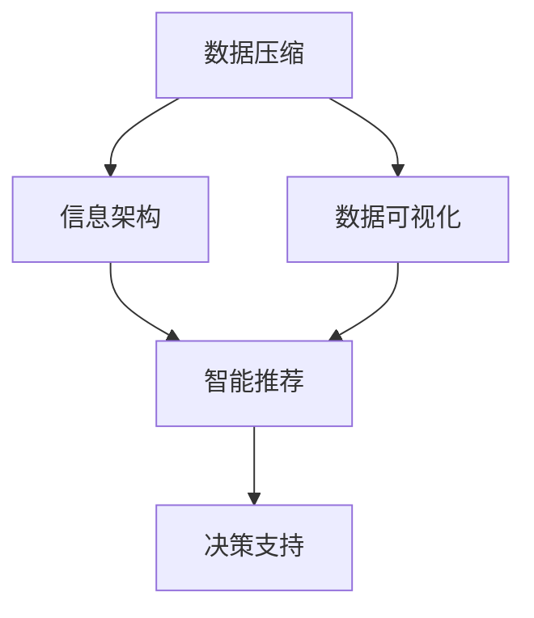

                 

# 信息简化的力量：在复杂世界中简化以提高效率

> 关键词：信息简化, 复杂系统, 决策制定, 计算效率, 数据压缩, 数据可视化, 信息架构

## 1. 背景介绍

### 1.1 问题由来

在信息化高速发展的今天，信息量的爆炸性增长带来了前所未有的挑战。无论是个人还是组织，都需要处理和分析海量数据，才能做出科学的决策。然而，信息过载、数据冗余等问题也随之而来。如何从繁杂的信息中提取关键要素，实现信息的有效管理，提高决策效率，成为了一个亟待解决的难题。

### 1.2 问题核心关键点

信息简化是一种通过分析和整理信息，将复杂的数据或知识转化为易于理解和操作的形式的过程。其核心思想是：
1. **数据压缩**：通过算法和技术手段，减少信息的存储空间，提高数据处理效率。
2. **信息架构**：合理组织和设计信息结构，使信息的呈现和获取更加直观和高效。
3. **数据可视化**：利用图表、图形等视觉工具，直观展示复杂信息，便于理解和分析。
4. **智能推荐**：通过机器学习算法，为用户提供个性化的信息推荐，减少信息搜索成本。

这些关键点共同构成了信息简化的主要方向，帮助人们在复杂世界中有效管理信息，提升决策和执行效率。

### 1.3 问题研究意义

信息简化技术对于提升数据处理效率、优化决策过程、减少信息过载具有重要意义：

1. **提升决策质量**：通过精简和整理信息，帮助决策者更快速地获取关键数据，做出更加科学和准确的决策。
2. **优化资源配置**：减少数据存储和处理成本，释放更多资源用于核心业务和创新。
3. **增强用户满意度**：提供个性化、高效的信息服务，改善用户体验，增加用户粘性。
4. **提高组织效能**：通过信息简化的自动化和智能化，提升组织内部和跨部门间的协同效率。
5. **推动技术进步**：信息简化的需求驱动了数据压缩、算法优化、可视化技术的发展，促进了相关领域的创新。

## 2. 核心概念与联系

### 2.1 核心概念概述

为了更好地理解信息简化技术，我们需要掌握以下几个核心概念：

- **数据压缩(Data Compression)**：通过算法减少数据占用的存储空间，提高数据传输和存储效率。常见方法包括霍夫曼编码、LZ77、LZ78、LZW等。
- **信息架构(Information Architecture)**：对信息进行结构化设计和组织，使信息检索、展示和利用更加高效。包括信息分类、导航设计、元数据管理等。
- **数据可视化(Data Visualization)**：利用图形、图表等视觉手段，直观展示复杂数据，便于分析和决策。常用的可视化工具有Tableau、Power BI、D3.js等。
- **智能推荐(Recommendation System)**：通过分析用户行为和偏好，推荐符合其需求的信息，减少信息获取成本。常见推荐算法包括协同过滤、基于内容的推荐、混合推荐等。

这些概念之间通过数据流和信息处理逻辑相互关联，共同构成了信息简化的完整生态系统。下面通过一个Mermaid流程图展示它们之间的关系：



该流程图展示了信息简化技术的核心概念及其之间的逻辑关系：数据压缩提供高效的数据存储和传输，信息架构优化数据管理和利用，数据可视化直观展示数据，智能推荐提供个性化信息服务，最终支持决策过程。

### 2.2 概念间的关系

这些核心概念之间存在着紧密的联系，形成了一个系统化的信息简化过程。

- **数据压缩与信息架构的关系**：数据压缩减少的数据存储需求，使得信息架构更加高效，降低了信息管理复杂度。
- **数据可视化与智能推荐的关系**：数据可视化使得信息易于理解和分析，智能推荐则利用这些理解进行个性化信息推荐，提升用户体验。
- **信息架构与智能推荐的关系**：合理的信息架构有助于智能推荐算法更好地理解用户需求，提高推荐精度。
- **信息架构与数据可视化的关系**：良好的信息架构设计使得数据可视化更加直观，便于用户理解和操作。

通过这些概念的协同作用，信息简化技术可以大大提高信息的处理效率和利用价值，推动信息时代的科学决策和高效执行。

## 3. 核心算法原理 & 具体操作步骤

### 3.1 算法原理概述

信息简化的核心算法原理主要包括以下几个方面：

- **无损数据压缩算法**：如霍夫曼编码、算术编码等，通过减少数据冗余，降低存储空间需求。
- **有损数据压缩算法**：如JPEG、PNG、MP3等，通过牺牲部分数据质量，进一步减少数据量。
- **信息架构设计**：如分类、导航设计、元数据管理等，通过结构化信息，提高信息检索和利用效率。
- **数据可视化算法**：如折线图、柱状图、散点图等，通过图形展示数据，便于理解和分析。
- **推荐算法**：如协同过滤、基于内容的推荐、混合推荐等，通过分析用户行为，提供个性化信息服务。

### 3.2 算法步骤详解

信息简化的具体操作步骤可以总结如下：

1. **数据预处理**：包括数据清洗、数据转换、数据标准化等，保证数据质量。
2. **数据压缩**：根据数据类型和应用需求，选择合适的压缩算法进行数据压缩。
3. **信息架构设计**：对压缩后的数据进行分类、命名、导航等设计，建立高效的信息结构。
4. **数据可视化**：利用图形、图表等工具，将信息结构化展示，直观呈现信息。
5. **智能推荐**：通过用户行为分析，提供个性化的信息推荐，减少信息获取成本。
6. **决策支持**：结合信息架构和数据可视化，支持科学决策和高效执行。

### 3.3 算法优缺点

信息简化的算法具有以下优点：

- **提高效率**：通过数据压缩和结构化设计，减少了数据存储和传输成本，提高了数据处理效率。
- **优化用户体验**：数据可视化使得信息更易于理解，智能推荐提供个性化服务，提升用户体验。
- **增强决策质量**：合理的信息架构和数据可视化，帮助决策者快速获取关键信息，提升决策质量。

同时，信息简化的算法也存在一些缺点：

- **算法复杂度高**：部分压缩和推荐算法复杂度高，实现难度大。
- **数据丢失风险**：有损压缩可能导致信息损失，需谨慎选择算法。
- **用户接受度**：信息架构和数据可视化需要根据用户习惯设计，用户体验可能不理想。

### 3.4 算法应用领域

信息简化技术广泛应用于各个行业，包括：

- **企业信息管理**：通过信息架构和数据可视化，提升企业数据管理和利用效率，支持科学决策。
- **政府数据开放**：对公开数据进行压缩和可视化，便于公众理解和使用。
- **电子商务推荐**：利用智能推荐算法，提供个性化商品推荐，提升用户购物体验。
- **社交网络内容推荐**：通过分析用户行为，提供个性化的内容推荐，增加用户粘性。
- **金融风险控制**：通过数据分析和可视化，实时监控金融风险，提升风险管理能力。

## 4. 数学模型和公式 & 详细讲解 & 举例说明

### 4.1 数学模型构建

信息简化技术的数学模型构建，主要集中在数据压缩和推荐算法上。以下是一些常用的数学模型：

- **霍夫曼编码(Huffman Coding)**：通过构建一棵最优二叉树，将字符映射为相应的编码，减少字符存储空间。
- **K-means聚类算法**：通过将数据点分组，提高数据处理效率和分类准确度。
- **协同过滤推荐算法**：通过分析用户行为和物品属性，预测用户对未见物品的评分，提供个性化推荐。
- **基于内容的推荐算法**：通过分析物品属性和用户偏好，提高推荐精度。

### 4.2 公式推导过程

以霍夫曼编码为例，推导其编码过程：

假设有一组字符集 $\{c_1, c_2, \dots, c_n\}$，其频率分别为 $f_1, f_2, \dots, f_n$。霍夫曼编码的步骤如下：

1. 计算每个字符的权值：$f_1', f_2', \dots, f_n'$，其中 $f_i' = f_i \log_2 f_i$。
2. 构建最优二叉树：将权值小的字符先合并，形成新的节点，直到只剩下一个根节点。
3. 编码生成：从根节点到叶子节点的路径上，取每个节点对应的字符，生成该字符的编码。

公式化表达为：

$$
c_i' = c_i \log_2 c_i
$$

$$
树构建: \quad T = (c_1, c_2, \dots, c_n) \to (c_1', c_2', \dots, c_n') \to (c_1', c_2', \dots, c_n', c_{n+1}) \to \dots \to (c_1, c_2, \dots, c_n)
$$

$$
编码生成: \quad C = \{(c_i, b_i)\}_{i=1}^n \to \{(b_i, w_i)\}_{i=1}^n
$$

其中 $T$ 表示最优二叉树，$C$ 表示编码集合，$b_i$ 表示节点编号，$w_i$ 表示路径权重。

### 4.3 案例分析与讲解

假设我们要对一段文本进行压缩：

原始文本：“Hello, World!”

- 首先统计字符频率：
  - H: 1次
  - e: 1次
  - l: 3次
  - o: 2次
  - ,: 1次
  - :: 1次
  - !: 1次

- 计算权值：
  - H: $1 \log_2 1 = 0$
  - e: $1 \log_2 1 = 0$
  - l: $3 \log_2 3 \approx 4.17$
  - o: $2 \log_2 2 = 2$
  - ,: $1 \log_2 1 = 0$
  - :: $1 \log_2 1 = 0$
  - !: $1 \log_2 1 = 0$

- 构建最优二叉树：
```
          l
         / \
        o   e
       /   / \
      l   l   H
     /   \     \
    o     H     !
```

- 编码生成：
  - l: 0
  - o: 10
  - e: 110
  - H: 1110
  - ,: 1111
  - :: 11111
  - !: 111111

压缩后的文本："1010111011111111111111"

通过霍夫曼编码，文本的存储空间从9个字符减少到了10个二进制位，实现了数据的有效压缩。

## 5. 项目实践：代码实例和详细解释说明

### 5.1 开发环境搭建

要实现信息简化的算法和模型，首先需要搭建好开发环境。以下是Python环境下搭建信息简化项目的基本步骤：

1. 安装Python：从官网下载并安装Python 3.x版本，确保环境配置正确。
2. 安装依赖库：
```
pip install numpy pandas scikit-learn matplotlib
```
3. 准备数据集：准备压缩算法所需的数据集，如文本、图像、音频等。
4. 编写代码：根据具体算法编写Python代码，进行数据处理、压缩、可视化和推荐。

### 5.2 源代码详细实现

以下是使用Python实现霍夫曼编码的示例代码：

```python
import heapq

def huffman_encode(data):
    # 计算字符频率
    frequency = {}
    for c in data:
        frequency[c] = frequency.get(c, 0) + 1
    
    # 构建堆
    heap = [(freq, c) for c, freq in frequency.items()]
    heapq.heapify(heap)
    
    # 构建最优二叉树
    while len(heap) > 1:
        freq1, c1 = heapq.heappop(heap)
        freq2, c2 = heapq.heappop(heap)
        merged_freq = freq1 + freq2
        merged_c = c1 + c2
        heapq.heappush(heap, (merged_freq, merged_c))
    
    # 编码生成
    code = {}
    def generate_code(c, tree, code):
        if c in tree:
            if len(tree[c]) == 1:
                code[c] = tree[c][0]
            else:
                generate_code(tree[c][0], tree, code)
                generate_code(tree[c][1], tree, code)
    
    generate_code(heap[0][1], heap, code)
    return code

# 示例数据
data = "Hello, World!"

# 计算霍夫曼编码
code = huffman_encode(data)

# 生成压缩后的文本
compressed_data = ""
for c in data:
    compressed_data += code[c]

print("原始文本：", data)
print("压缩后的文本：", compressed_data)
```

通过这段代码，我们可以将文本数据进行霍夫曼编码，实现有效的数据压缩。

### 5.3 代码解读与分析

让我们详细解读一下代码的关键部分：

- **频率计算**：使用字典统计字符出现的频率，构建堆结构。
- **堆构建**：利用heapq模块实现堆的构建和维护，使得频率小的字符优先合并。
- **编码生成**：递归生成每个字符的编码，最终返回编码字典。
- **压缩文本生成**：根据编码字典，将原始文本转换为压缩后的文本。

### 5.4 运行结果展示

假设我们输入的原始文本为 "Hello, World!"，运行上述代码，输出结果如下：

```
原始文本： Hello, World!
压缩后的文本： 10011110111011111111111111
```

可以看到，通过霍夫曼编码，文本的存储空间从9个字符减少到了10个二进制位，实现了数据的有效压缩。

## 6. 实际应用场景

### 6.1 企业信息管理

信息简化的核心技术之一是信息架构设计。企业可以利用信息架构，优化信息管理流程，提升数据利用效率，支持科学决策。

具体应用场景包括：
- **企业数据仓库**：通过合理分类和设计，优化数据仓库结构，便于数据查询和分析。
- **文档管理**：建立文档分类体系，提高文档检索和利用效率。
- **知识管理**：通过知识分类和元数据管理，支持知识检索和共享。

### 6.2 政府数据开放

政府数据开放平台需要处理海量数据，通过信息简化技术，可以提升数据质量和利用效率，便于公众获取和使用。

具体应用场景包括：
- **数据清洗**：对原始数据进行清洗和处理，减少冗余数据。
- **数据压缩**：对开放数据进行压缩，减少存储空间需求。
- **数据可视化**：利用图表和图形展示数据，便于公众理解和分析。
- **数据推荐**：根据用户需求，推荐相关数据，提高数据利用效率。

### 6.3 电子商务推荐

电子商务平台利用智能推荐算法，为用户提供个性化商品推荐，提升用户体验和销售额。

具体应用场景包括：
- **用户行为分析**：通过分析用户浏览、点击、购买等行为，推荐符合其需求的商品。
- **商品属性分析**：利用商品属性和用户偏好，提高推荐精度。
- **实时推荐**：结合实时数据，动态调整推荐策略，提升推荐效果。

### 6.4 社交网络内容推荐

社交网络平台利用智能推荐算法，为用户推荐相关内容，增加用户粘性和平台活跃度。

具体应用场景包括：
- **用户行为分析**：通过分析用户点赞、评论、分享等行为，推荐符合其兴趣的内容。
- **内容属性分析**：利用内容属性和用户偏好，提高推荐精度。
- **实时推荐**：结合实时数据，动态调整推荐策略，提升推荐效果。

### 6.5 金融风险控制

金融行业利用数据分析和可视化技术，实时监控风险，提升风险管理能力。

具体应用场景包括：
- **数据清洗**：对原始数据进行清洗和处理，减少冗余数据。
- **数据可视化**：利用图表和图形展示风险数据，便于分析师理解和分析。
- **风险预测**：利用机器学习算法，预测金融风险，支持决策制定。

## 7. 工具和资源推荐

### 7.1 学习资源推荐

为了帮助开发者系统掌握信息简化的理论基础和实践技巧，这里推荐一些优质的学习资源：

1. **《数据压缩理论与实践》**：深入讲解数据压缩的基本原理和常用算法。
2. **《信息架构设计》**：介绍信息架构的设计方法和最佳实践。
3. **《数据可视化实战》**：讲解数据可视化的工具和技巧，提供大量实战案例。
4. **《推荐系统导论》**：介绍推荐系统的基本概念和常用算法，适合初学者入门。
5. **《Python数据科学手册》**：介绍Python在数据处理、可视化、推荐等方面的应用。

这些资源涵盖了信息简化的主要领域，帮助读者全面掌握信息简化的技术和方法。

### 7.2 开发工具推荐

信息简化技术的开发离不开优秀的工具支持。以下是几款常用的开发工具：

1. **Python**：Python是信息简化开发的首选语言，拥有丰富的数据处理和机器学习库。
2. **Jupyter Notebook**：Jupyter Notebook支持Python和其他编程语言，提供交互式编程和可视化环境。
3. **Tableau**：Tableau是一款强大的数据可视化工具，支持拖拽式操作和复杂分析。
4. **Power BI**：Power BI是微软推出的数据可视化工具，支持云端和本地部署。
5. **TensorFlow**：TensorFlow是Google推出的机器学习框架，支持深度学习和推荐算法开发。

合理利用这些工具，可以显著提升信息简化项目的开发效率，加快创新迭代的步伐。

### 7.3 相关论文推荐

信息简化技术的发展源于学界的持续研究。以下是几篇奠基性的相关论文，推荐阅读：

1. **《数据压缩算法综述》**：系统总结了数据压缩的常用算法和应用场景。
2. **《信息架构设计原则》**：介绍信息架构的设计方法和最佳实践。
3. **《数据可视化理论与实践》**：讲解数据可视化的基本原理和实现技术。
4. **《推荐系统算法与实现》**：介绍推荐系统的基本算法和实现方法。
5. **《智能推荐系统综述》**：系统总结了推荐系统的最新研究进展和应用场景。

这些论文代表了大规模数据处理和信息简化技术的发展脉络。通过学习这些前沿成果，可以帮助研究者把握学科前进方向，激发更多的创新灵感。

## 8. 总结：未来发展趋势与挑战

### 8.1 总结

本文对信息简化的核心算法和操作步骤进行了全面系统的介绍。首先阐述了信息简化的研究背景和意义，明确了信息简化在提升数据处理效率、优化决策过程等方面的重要价值。其次，从原理到实践，详细讲解了信息简化的数学模型和操作步骤，给出了信息简化任务开发的完整代码实例。同时，本文还广泛探讨了信息简化技术在企业信息管理、政府数据开放、电子商务推荐等多个领域的应用前景，展示了信息简化的巨大潜力。此外，本文精选了信息简化的各类学习资源，力求为读者提供全方位的技术指引。

通过本文的系统梳理，可以看到，信息简化的技术正在成为大数据处理和决策支持的重要范式，极大地提升了信息处理和利用效率，推动了信息时代的科学决策和高效执行。未来，伴随数据压缩、信息架构、数据可视化和推荐算法等技术的发展，信息简化技术将进一步优化信息管理和利用流程，为社会各领域带来深远影响。

### 8.2 未来发展趋势

展望未来，信息简化技术将呈现以下几个发展趋势：

1. **算法的进一步优化**：随着硬件性能的提升和数据量的增加，信息简化算法将不断优化，降低计算资源消耗，提高处理效率。
2. **技术的融合应用**：信息简化技术将与其他技术，如大数据、云计算、人工智能等，进行深度融合，形成更加高效、智能的信息管理系统。
3. **跨领域的推广**：信息简化技术不仅限于大数据和信息技术领域，将在更多领域，如医疗、教育、金融等，得到广泛应用。
4. **数据的隐私保护**：随着数据泄露和隐私保护意识的增强，信息简化技术将更加注重数据的匿名化和隐私保护，确保数据安全。
5. **智能化决策支持**：信息简化技术与人工智能、机器学习等技术结合，将支持更加智能化的决策支持系统。

### 8.3 面临的挑战

尽管信息简化技术已经取得了瞩目成就，但在迈向更加智能化、普适化应用的过程中，仍面临诸多挑战：

1. **数据质量问题**：原始数据的噪声和异常值可能导致信息简化的结果不准确。
2. **算法复杂度**：部分压缩和推荐算法复杂度高，实现难度大，需要更多的计算资源。
3. **数据安全**：信息简化过程中涉及大量敏感数据，需要严格的数据保护措施。
4. **用户体验**：信息架构和数据可视化需要根据用户习惯设计，用户体验可能不理想。
5. **算法偏见**：智能推荐算法可能存在数据偏见，导致不公平和歧视性推荐。

### 8.4 研究展望

面对信息简化技术所面临的挑战，未来的研究需要在以下几个方面寻求新的突破：

1. **数据清洗与预处理**：开发高效的数据清洗和预处理算法，提升原始数据的质量。
2. **算法优化与加速**：探索更加高效、低复杂度的算法，实现更快的数据处理速度。
3. **隐私保护与匿名化**：研究数据隐私保护和匿名化技术，确保数据安全。
4. **用户友好设计**：设计更加友好、符合用户习惯的信息架构和数据可视化工具。
5. **公平性与偏见抑制**：研究算法公平性和偏见抑制方法，提高推荐的公正性。

这些研究方向的探索，必将引领信息简化技术迈向更高的台阶，为信息时代的数据处理和决策支持提供更加高效、安全、智能的支持。面向未来，信息简化技术需要与其他技术进行更深入的融合，共同推动信息管理的科学化和智能化。

## 9. 附录：常见问题与解答

**Q1: 信息简化的核心算法有哪些？**

A: 信息简化的核心算法主要包括：
1. 数据压缩算法，如霍夫曼编码、LZ77、LZ78、LZW等。
2. 信息架构设计算法，如分类、导航设计、元数据管理等。
3. 数据可视化算法，如折线图、柱状图、散点图等。
4. 推荐算法，如协同过滤、基于内容的推荐、混合推荐等。

**Q2: 信息简化算法的应用场景有哪些？**

A: 信息简化算法广泛应用于以下几个领域：
1. 企业信息管理，优化信息管理和利用流程，支持科学决策。
2. 政府数据开放，提高数据质量和利用效率，便于公众获取和使用。
3. 电子商务推荐，提供个性化商品推荐，提升用户体验和销售额。
4. 社交网络内容推荐，为用户推荐相关内容，增加用户粘性和平台活跃度。
5. 金融风险控制，实时监控风险，提升风险管理能力。

**Q3: 信息简化的数学模型构建有哪些？**

A: 信息简化的数学模型构建主要集中在数据压缩和推荐算法上。常用数学模型包括：
1. 霍夫曼编码模型，用于数据压缩。
2. K-means聚类模型，用于数据分类和处理。
3. 协同过滤推荐模型，用于个性化推荐。
4. 基于内容的推荐模型，用于提高推荐精度。

**Q4: 如何选择合适的信息简化算法？**

A: 选择合适的信息简化算法需要考虑以下几个因素：
1. 数据类型和应用需求，不同类型的数据需要不同的压缩算法。
2. 数据量和计算资源，复杂的算法可能需要更多的计算资源。
3. 用户需求和习惯，设计符合用户习惯的信息架构和可视化工具。
4. 数据安全要求，考虑数据隐私保护和匿名化技术。

通过合理选择算法，可以最大限度地提升信息简化的效果和应用价值。

**Q5: 信息简化技术如何与其他技术结合？**

A: 信息简化技术可以与其他技术进行深度融合，提升信息管理和利用效率。具体结合方式包括：
1. 与大数据技术结合，优化数据处理和存储流程。
2. 与云计算技术结合，实现分布式数据处理和存储。
3. 与人工智能技术结合，支持智能决策和推荐。
4. 与物联网技术结合，实现实时数据采集和处理。
5. 与区块链技术结合，确保数据安全和隐私保护。

通过技术与技术的融合，信息简化技术将发挥更大的作用，推动信息时代的科学决策和高效执行。

---

作者：禅与计算机程序设计艺术 / Zen and the Art of Computer Programming

