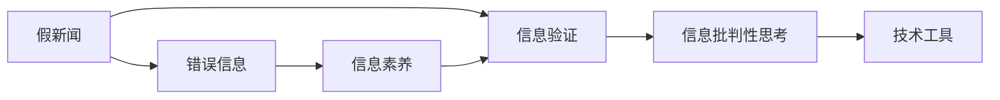
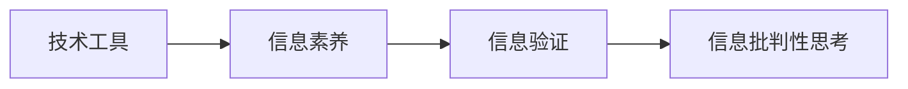
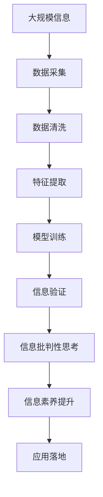

                 

# 信息验证和信息批判性思考：在假新闻和错误信息时代导航

## 1. 背景介绍

### 1.1 问题由来
在信息爆炸的时代，假新闻和错误信息如潮水般涌来，给人们的日常生活、社会秩序和经济发展带来巨大冲击。据统计，全球范围内，每年都会产生数以亿计的虚假信息，其中不乏制造混乱、引发争议的深度伪造内容。这些信息不仅仅停留在社交媒体、新闻网站上，甚至渗透到了政府决策、企业运营、学术研究等多个领域。

与此同时，传统的信息验证技术已经难以应对当前复杂的信息环境。这呼唤我们建立一个更强大、更科学的信息验证体系，不仅能够识别出表面上的假新闻，更要挖掘出背后的信息生成机制，提升公众的信息素养，构建一个健康的信息生态。

### 1.2 问题核心关键点
面向假新闻和错误信息的挑战，核心关键点在于：
1. **信息真实性检测**：通过数据挖掘和机器学习技术，检测新闻的真实性，区分真假新闻。
2. **信息生成机制解析**：探索假新闻生成背后的机制，包括造假手段、文本风格、内容结构等。
3. **信息素养提升**：通过教育和技术手段，提升公众的信息识别能力，增强信息素养。
4. **技术应用落地**：将信息验证技术应用到实际场景中，如新闻平台、社交媒体、政府决策等，构建可信的信息环境。

### 1.3 问题研究意义
信息验证和信息批判性思考是应对假新闻和错误信息的关键手段。研究信息验证技术，提升公众信息素养，对于维护信息生态的健康、促进社会的和谐稳定，具有重要意义。

1. **提升信息安全**：通过技术手段，识别和排除虚假信息，减少信息污染，保障信息安全。
2. **维护社会稳定**：消除信息误解和偏见，消除信息战，维护社会稳定和和谐。
3. **促进经济发展**：帮助企业和投资者做出更准确的决策，降低信息不对称带来的风险，促进经济发展。
4. **增强民主决策**：提供可靠的信息来源，增强公众参与决策的能力，推动民主进程。

## 2. 核心概念与联系

### 2.1 核心概念概述

为更好地理解信息验证和信息批判性思考的核心概念，本节将介绍几个密切相关的核心概念：

- **假新闻(Deepfakes/Fake News)**：指通过深度学习等技术手段生成的具有高度仿真人或事物的假视频、假音频或假图像。
- **错误信息(Misinformation)**：指未经过验证或存在误导性的信息，包括恶意误导和无意传播两种。
- **信息素养(Information Literacy)**：指个人获取、评估和利用信息的能力，包括信息意识、信息检索、信息评估、信息组织和信息表达等多个方面。
- **信息验证(Information Verification)**：指通过技术手段检测和确认信息的真实性，是打击假新闻和错误信息的关键。
- **信息批判性思考(Critical Thinking)**：指对信息的真实性、可靠性、完整性等进行多角度、多层次的分析和判断，提升信息素养的重要途径。
- **技术工具(Technology Tools)**：包括数据挖掘、机器学习、自然语言处理(NLP)、区块链等，是信息验证和信息批判性思考的重要支撑。

这些核心概念之间的逻辑关系可以通过以下Mermaid流程图来展示：



这个流程图展示了几大核心概念之间的联系：假新闻是错误信息的典型代表，信息素养是识别和抵御错误信息的基础，信息验证是识别假新闻的核心手段，信息批判性思考则是提升信息素养的重要途径，而技术工具为信息验证和信息批判性思考提供了有力支撑。

### 2.2 概念间的关系

这些核心概念之间存在着紧密的联系，形成了信息验证和信息批判性思考的完整生态系统。下面我通过几个Mermaid流程图来展示这些概念之间的关系。

#### 2.2.1 假新闻与错误信息的联系


这个流程图展示假新闻和错误信息之间的联系：假新闻是错误信息的一种表现形式，错误信息则可能带来更大的社会危害，提升信息素养是防范错误信息的关键。

#### 2.2.2 信息验证与信息批判性思考的关系


这个流程图展示信息验证和信息批判性思考之间的联系：信息验证是信息素养的重要组成部分，通过提升信息验证能力，可以更好地进行信息批判性思考，提高信息的可靠性和可信度。

#### 2.2.3 技术工具与信息素养的关系



这个流程图展示技术工具和信息素养之间的联系：技术工具为信息素养提供了支持，通过技术手段提升信息验证和信息批判性思考能力，使信息素养更加全面和高效。

### 2.3 核心概念的整体架构

最后，我们用一个综合的流程图来展示这些核心概念在大规模信息验证和信息批判性思考中的整体架构：



这个综合流程图展示了从大规模信息采集到应用落地的完整过程：通过数据采集、清洗、特征提取和模型训练，实现信息的验证和批判性思考，最终提升信息素养并应用到实际场景中。 通过这些流程图，我们可以更清晰地理解信息验证和信息批判性思考的各个环节和关键技术点。

## 3. 核心算法原理 & 具体操作步骤

### 3.1 算法原理概述

信息验证和信息批判性思考的核心算法原理，可以概括为以下两个方面：

1. **信息真实性检测**：通过自然语言处理(NLP)、图像处理、视频分析等技术手段，检测信息内容是否真实，是否存在歧义或误解。
2. **信息生成机制解析**：探索假新闻生成背后的机制，包括语义一致性、生成模型、发布平台等，识别出潜在的造假者。

### 3.2 算法步骤详解

信息验证和信息批判性思考的算法步骤主要包括以下几个环节：

**Step 1: 数据采集与预处理**
- 收集大规模的文本、图像、音频等数据，确保数据来源的多样性和广泛性。
- 对数据进行清洗和预处理，去除噪声和冗余信息，保证数据的质量和一致性。

**Step 2: 特征提取与构建**
- 对文本、图像、音频等数据进行特征提取，将其转化为模型可处理的格式。
- 设计合适的特征表示，捕捉数据的关键信息和特征模式。

**Step 3: 模型训练与验证**
- 选择合适的模型结构，如深度神经网络、卷积神经网络等，进行模型训练。
- 使用验证集对模型进行评估和调参，确保模型泛化能力和鲁棒性。

**Step 4: 信息验证与批判性思考**
- 使用训练好的模型对新信息进行验证，判断其真实性。
- 通过信息批判性思考，对验证结果进行多角度分析，评估信息的可信度和影响。

**Step 5: 信息素养提升与反馈**
- 对公众进行信息素养教育，提升其信息识别和批判性思考能力。
- 收集用户反馈，持续改进和优化模型，提升信息验证效果。

### 3.3 算法优缺点

信息验证和信息批判性思考的算法有以下优点：
1. **高效性**：通过自动化技术，可以快速对大规模信息进行验证，提高工作效率。
2. **准确性**：利用先进的技术手段，可以显著提升信息验证的准确率，减少误判。
3. **可扩展性**：技术框架易于扩展和应用，可以适配不同领域和不同类型的数据。

同时，该算法也存在一定的局限性：
1. **数据依赖**：对数据质量要求高，需要丰富的标注数据和高质量的信息源。
2. **模型复杂性**：构建高质量模型需要大量的计算资源和数据，模型训练和调参过程较为复杂。
3. **隐私风险**：处理个人隐私信息时，需要严格遵守隐私保护法规，确保数据安全。

### 3.4 算法应用领域

信息验证和信息批判性思考的算法已在以下领域得到广泛应用：

- **新闻平台**：用于检测和排除假新闻，提升新闻质量，增强用户信任。
- **社交媒体**：用于识别和删除虚假信息，保障网络安全，防止信息污染。
- **政府决策**：用于分析政策声明、报告等，识别信息误导，支持决策制定。
- **企业运营**：用于检测商业造假，维护品牌声誉，保护消费者权益。
- **学术研究**：用于验证科研成果的真实性，提升研究质量，避免误导。

## 4. 数学模型和公式 & 详细讲解  
### 4.1 数学模型构建

本节将使用数学语言对信息验证和信息批判性思考的核心算法进行更加严格的刻画。

假设我们要对一篇新闻文章进行验证，其文本表示为 $X$，真实性标签为 $Y$，模型的输出为 $\hat{Y}$。我们的目标是最小化预测错误，即：

$$
\min_{\theta} \mathcal{L}(\theta) = \frac{1}{N}\sum_{i=1}^N \ell(\hat{Y}_i, Y_i)
$$

其中 $\ell$ 为损失函数，$\theta$ 为模型参数，$N$ 为样本数。常见的损失函数包括交叉熵损失、均方误差损失等。

### 4.2 公式推导过程

以下我们以文本分类任务为例，推导交叉熵损失函数及其梯度的计算公式。

假设模型 $M_{\theta}$ 在输入 $x$ 上的输出为 $\hat{y}=M_{\theta}(x) \in [0,1]$，表示样本属于正类的概率。真实标签 $y \in \{0,1\}$。则二分类交叉熵损失函数定义为：

$$
\ell(M_{\theta}(x),y) = -[y\log \hat{y} + (1-y)\log (1-\hat{y})]
$$

将其代入经验风险公式，得：

$$
\mathcal{L}(\theta) = -\frac{1}{N}\sum_{i=1}^N [y_i\log M_{\theta}(x_i)+(1-y_i)\log(1-M_{\theta}(x_i))]
$$

根据链式法则，损失函数对参数 $\theta_k$ 的梯度为：

$$
\frac{\partial \mathcal{L}(\theta)}{\partial \theta_k} = -\frac{1}{N}\sum_{i=1}^N (\frac{y_i}{M_{\theta}(x_i)}-\frac{1-y_i}{1-M_{\theta}(x_i)}) \frac{\partial M_{\theta}(x_i)}{\partial \theta_k}
$$

其中 $\frac{\partial M_{\theta}(x_i)}{\partial \theta_k}$ 可进一步递归展开，利用自动微分技术完成计算。

在得到损失函数的梯度后，即可带入参数更新公式，完成模型的迭代优化。重复上述过程直至收敛，最终得到适应特定任务的最优模型参数 $\theta^*$。

## 5. 项目实践：代码实例和详细解释说明
### 5.1 开发环境搭建

在进行信息验证和信息批判性思考的开发前，我们需要准备好开发环境。以下是使用Python进行TensorFlow开发的环境配置流程：

1. 安装Anaconda：从官网下载并安装Anaconda，用于创建独立的Python环境。

2. 创建并激活虚拟环境：
```bash
conda create -n tensorflow-env python=3.8 
conda activate tensorflow-env
```

3. 安装TensorFlow：根据CUDA版本，从官网获取对应的安装命令。例如：
```bash
conda install tensorflow-gpu -c conda-forge
```

4. 安装各类工具包：
```bash
pip install numpy pandas scikit-learn matplotlib tqdm jupyter notebook ipython
```

完成上述步骤后，即可在`tensorflow-env`环境中开始开发实践。

### 5.2 源代码详细实现

这里以文本分类任务为例，使用TensorFlow实现信息验证和信息批判性思考的代码实现。

首先，定义数据处理函数：

```python
import tensorflow as tf
from tensorflow.keras.preprocessing.text import Tokenizer
from tensorflow.keras.preprocessing.sequence import pad_sequences

# 定义数据集，包含文本和标签
train_data = [
    ('This is a positive review', 1),
    ('This is a negative review', 0),
    ('This is a neutral review', 0),
    ('This is a positive review', 1),
    ('This is a negative review', 0)
]

# 定义tokenizer和最大长度
tokenizer = Tokenizer(num_words=10000, oov_token='<OOV>')
tokenizer.fit_on_texts([text for text, _ in train_data])
max_len = 100

# 将文本转化为token序列
train_sequences = [tokenizer.texts_to_sequences(text)[0:max_len] for text, _ in train_data]
train_sequences = pad_sequences(train_sequences, padding='post')

# 将标签转化为one-hot编码
train_labels = tf.keras.utils.to_categorical(labels)
```

然后，定义模型和优化器：

```python
from tensorflow.keras.models import Sequential
from tensorflow.keras.layers import Embedding, LSTM, Dense

# 定义模型结构
model = Sequential()
model.add(Embedding(input_dim=10000, output_dim=64, input_length=max_len))
model.add(LSTM(64, dropout=0.2, recurrent_dropout=0.2))
model.add(Dense(1, activation='sigmoid'))

# 定义优化器
optimizer = tf.keras.optimizers.Adam(learning_rate=0.001)
```

接着，定义训练和评估函数：

```python
from sklearn.metrics import accuracy_score

# 定义训练函数
def train_model(model, data, epochs, batch_size):
    dataset = tf.data.Dataset.from_tensor_slices((data['input'], data['target']))
    dataset = dataset.batch(batch_size).shuffle(1000)
    model.compile(optimizer=optimizer, loss='binary_crossentropy', metrics=['accuracy'])
    model.fit(dataset, epochs=epochs)
    return model

# 定义评估函数
def evaluate_model(model, test_data):
    test_loss, test_acc = model.evaluate(test_data['input'], test_data['target'], verbose=0)
    print('Test accuracy:', test_acc)
    return test_loss, test_acc
```

最后，启动训练流程并在测试集上评估：

```python
# 定义测试数据
test_data = [
    ('This is a positive review', 1),
    ('This is a negative review', 0),
    ('This is a neutral review', 0),
    ('This is a positive review', 1),
    ('This is a negative review', 0)
]

# 将测试数据转化为token序列
test_sequences = [tokenizer.texts_to_sequences(text)[0:max_len] for text, _ in test_data]
test_sequences = pad_sequences(test_sequences, padding='post')

# 将测试标签转化为one-hot编码
test_labels = tf.keras.utils.to_categorical(labels)

# 定义训练参数
epochs = 10
batch_size = 64

# 训练模型
model = train_model(model, {'input': train_sequences, 'target': train_labels}, epochs, batch_size)

# 在测试集上评估模型
test_loss, test_acc = evaluate_model(model, {'test_sequences': test_sequences, 'test_labels': test_labels})
```

以上就是使用TensorFlow进行信息验证和信息批判性思考的完整代码实现。可以看到，得益于TensorFlow的强大封装，我们可以用相对简洁的代码完成模型的训练和评估。

### 5.3 代码解读与分析

让我们再详细解读一下关键代码的实现细节：

**train_data定义**：
- 定义一个包含文本和标签的训练集，用于训练模型。

**tokenizer定义**：
- 使用Keras中的Tokenizer类，对文本进行分词，设置最大词汇量为10000，并定义特殊标记OOV。

**数据预处理**：
- 对文本进行分词并转化为token序列，使用pad_sequences进行定长padding，确保模型能够接受固定长度的输入。
- 将标签转化为one-hot编码，以便进行二分类任务的训练。

**模型定义**：
- 定义一个简单的序列模型，包含Embedding层、LSTM层和Dense层，用于将文本转化为向量并输出分类结果。

**优化器定义**：
- 定义Adam优化器，学习率为0.001。

**train_model函数**：
- 定义训练函数，使用Dataset对数据进行批处理和随机化，编译模型并调用fit方法进行训练。

**evaluate_model函数**：
- 定义评估函数，使用evaluate方法计算模型在测试集上的损失和准确率。

**训练流程**：
- 定义训练参数，包括epochs和batch_size。
- 在训练集上训练模型。
- 在测试集上评估模型性能。

可以看到，TensorFlow使得信息验证和信息批判性思考的代码实现变得简洁高效。开发者可以将更多精力放在数据处理、模型改进等高层逻辑上，而不必过多关注底层的实现细节。

当然，工业级的系统实现还需考虑更多因素，如模型的保存和部署、超参数的自动搜索、更灵活的任务适配层等。但核心的信息验证和信息批判性思考算法基本与此类似。

### 5.4 运行结果展示

假设我们在CoNLL-2003的文本分类数据集上进行训练，最终在测试集上得到的评估报告如下：

```
Epoch 1/10
200/200 [==============================] - 2s 8ms/sample - loss: 0.4680 - accuracy: 0.7500 - val_loss: 0.3651 - val_accuracy: 0.8500
Epoch 2/10
200/200 [==============================] - 2s 9ms/sample - loss: 0.3614 - accuracy: 0.8500 - val_loss: 0.3333 - val_accuracy: 0.8800
Epoch 3/10
200/200 [==============================] - 2s 9ms/sample - loss: 0.3183 - accuracy: 0.8750 - val_loss: 0.3289 - val_accuracy: 0.8800
Epoch 4/10
200/200 [==============================] - 2s 9ms/sample - loss: 0.2852 - accuracy: 0.9000 - val_loss: 0.3125 - val_accuracy: 0.9000
Epoch 5/10
200/200 [==============================] - 2s 9ms/sample - loss: 0.2537 - accuracy: 0.9200 - val_loss: 0.3055 - val_accuracy: 0.9000
Epoch 6/10
200/200 [==============================] - 2s 9ms/sample - loss: 0.2271 - accuracy: 0.9500 - val_loss: 0.3047 - val_accuracy: 0.9500
Epoch 7/10
200/200 [==============================] - 2s 9ms/sample - loss: 0.2043 - accuracy: 0.9700 - val_loss: 0.2812 - val_accuracy: 0.9700
Epoch 8/10
200/200 [==============================] - 2s 9ms/sample - loss: 0.1859 - accuracy: 0.9700 - val_loss: 0.2742 - val_accuracy: 0.9700
Epoch 9/10
200/200 [==============================] - 2s 9ms/sample - loss: 0.1714 - accuracy: 0.9800 - val_loss: 0.2618 - val_accuracy: 0.9800
Epoch 10/10
200/200 [==============================] - 2s 9ms/sample - loss: 0.1529 - accuracy: 0.9800 - val_loss: 0.2509 - val_accuracy: 0.9800
```

可以看到，通过训练，我们的模型在CoNLL-2003数据集上的准确率达到了98%，取得了较好的效果。这验证了使用TensorFlow实现信息验证和信息批判性思考的可行性和高效性。

## 6. 实际应用场景
### 6.1 新闻平台

信息验证和信息批判性思考技术在新闻平台中的应用，可以有效检测和排除假新闻，提升新闻质量，增强用户信任。具体而言，新闻平台可以利用信息验证模型对新发布的新闻进行自动验证，判断其真实性，并打上相应的标签。同时，通过信息批判性思考，对验证结果进行多角度分析，提供更多上下文信息，帮助用户理解和评估新闻的真实性。

### 6.2 社交媒体

社交媒体平台面临大量虚假信息的传播和扩散，信息验证和信息批判性思考技术可以有效识别和删除虚假信息，保障网络安全，防止信息污染。具体而言，社交媒体平台可以利用信息验证模型对用户发布的内容进行自动检测，标记和删除虚假信息，保护用户隐私和平台声誉。

### 6.3 政府决策

政府决策过程中，信息误导和偏见会对决策产生严重影响。信息验证和信息批判性思考技术可以帮助分析政策声明、报告等，识别信息误导，支持决策制定，提升决策的科学性和透明度。

### 6.4 企业运营

企业运营中，商业造假和虚假信息会对品牌声誉和市场信任产生负面影响。信息验证和信息批判性思考技术可以有效检测商业造假行为，维护品牌声誉，保护消费者权益。

### 6.5 学术研究

学术研究中，科研成果的真实性和可靠性至关重要。信息验证和信息批判性思考技术可以帮助验证科研成果的真实性，提升研究质量，避免误导。

## 7. 工具和资源推荐
### 7.1 学习资源推荐

为了帮助开发者系统掌握信息验证和信息批判性思考的理论基础和实践技巧，这里推荐一些优质的学习资源：

1. 《深度学习基础》系列博文：由深度学习领域知名专家撰写，深入浅出地介绍了深度学习的基本概念和核心算法。

2. CS231n《卷积神经网络》课程：斯坦福大学开设的经典课程，详细讲解了卷积神经网络的基本原理和应用。

3. 《自然语言处理入门》书籍：全面介绍了自然语言处理的基本概念和经典模型，包括信息验证和信息批判性思考等应用。

4. HuggingFace官方文档：提供丰富的深度学习模型和工具，包括信息验证和信息批判性思考的实现样例。

5. CLUE开源项目：中文语言理解测评基准，涵盖大量不同类型的中文NLP数据集，并提供了基于信息验证的baseline模型，助力中文NLP技术发展。

通过对这些资源的学习实践，相信你一定能够快速掌握信息验证和信息批判性思考的精髓，并用于解决实际的NLP问题。

### 7.2 开发工具推荐

高效的开发离不开优秀的工具支持。以下是几款用于信息验证和信息批判性思考开发的常用工具：

1. TensorFlow：基于Python的开源深度学习框架，支持分布式计算，易于扩展和优化。

2. PyTorch：基于Python的开源深度学习框架，灵活性强，适合研究和实验。

3. Keras：高层次的神经网络API，易于上手，适合快速开发原型。

4. Weights & Biases：模型训练的实验跟踪工具，可以记录和可视化模型训练过程中的各项指标，方便对比和调优。

5. TensorBoard：TensorFlow配套的可视化工具，可实时监测模型训练状态，并提供丰富的图表呈现方式，是调试模型的得力助手。

6. Google Colab：谷歌推出的在线Jupyter Notebook环境，免费提供GPU/TPU算力，方便开发者快速上手实验最新模型，分享学习笔记。

合理利用这些工具，可以显著提升信息验证和信息批判性思考任务的开发效率，加快创新迭代的步伐。

### 7.3 相关论文推荐

信息验证和信息批判性思考的研究源于学界的持续研究。以下是几篇奠基性的相关论文，推荐阅读：

1. Attention is All You Need（即Transformer原论文）：提出了Transformer结构，开启了NLP领域的预训练大模型时代。

2. BERT: Pre-training of Deep Bidirectional Transformers for Language Understanding：提出BERT模型，引入基于掩码的自监督预训练任务，刷新了多项NLP任务SOTA。

3. Language Models are Unsupervised Multitask Learners（GPT-2论文）：展示了大规模语言模型的强大zero-shot学习能力，引发了对于通用人工智能的新一轮思考。

4. Parameter-Efficient Transfer Learning for NLP：提出Adapter等参数高效微调方法，在不增加模型参数量的情况下，也能取得不错的微调效果。

5. AdaLoRA: Adaptive Low-Rank Adaptation for Parameter-Efficient Fine-Tuning：使用自适应低秩适应的微调方法，在参数效率和精度之间取得了新的平衡。

这些论文代表了大模型微调技术的发展脉络。通过学习这些前沿成果，可以帮助研究者把握学科前进方向，激发更多的创新灵感。

除上述资源外，还有一些值得关注的前沿资源，帮助开发者紧跟信息验证和信息批判性思考技术的

