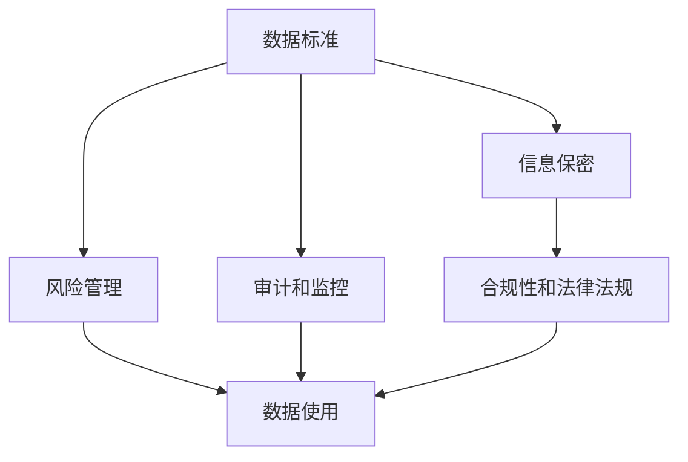

                 

# 公司数据标准及信息保密制度

> 关键词：数据标准,信息保密,公司规范,安全策略,风险管理

## 1. 背景介绍

### 1.1 问题由来
在现代企业运营中，数据已经成为不可或缺的资源。无论是内部管理、市场竞争，还是客户服务，数据都扮演着至关重要的角色。然而，面对不断扩大的数据量和复杂的数据来源，如何确保数据的安全、准确和一致性，成为了企业亟需解决的问题。近年来，企业数据泄露、数据篡改等事件频发，不仅对企业造成经济损失，更严重影响企业的声誉和竞争力。因此，制定科学合理的数据标准和信息保密制度，已成为企业数据治理的核心任务。

### 1.2 问题核心关键点
数据标准的制定和信息保密制度的实施，旨在规范数据的使用和管理，确保数据的完整性、准确性和保密性。具体来说，主要包括以下几个关键点：

1. **数据标准化**：建立统一的数据格式、编码和命名规范，保证数据的一致性和互操作性。
2. **信息保密性**：制定严格的信息访问控制机制，确保敏感信息不被未经授权的人员访问。
3. **风险管理**：评估数据处理过程中的潜在风险，制定相应的防范措施和应急预案。
4. **审计和监控**：建立数据使用和访问的审计日志，实施实时监控，及时发现和处理异常行为。
5. **合规性和法律法规**：确保数据标准和保密制度符合国家和行业的法律法规要求，避免法律风险。

### 1.3 问题研究意义
制定科学合理的数据标准和信息保密制度，对于企业数据治理具有重要意义：

1. **保障数据安全**：规范数据使用和管理，避免数据泄露和篡改，确保企业信息资产的安全。
2. **提高数据质量**：通过统一数据标准，减少数据格式不一致，提升数据质量和可用性。
3. **提升运营效率**：统一的数据标准和流程，可以大幅提高数据处理的效率，减少冗余和错误。
4. **增强合规性**：符合国家和行业法律法规要求，避免法律风险，提升企业声誉和竞争力。
5. **促进信息共享**：规范数据格式和访问机制，方便不同部门和系统间的信息共享和协同工作。

## 2. 核心概念与联系

### 2.1 核心概念概述

为更好地理解公司数据标准及信息保密制度的原理和架构，本节将介绍几个关键概念：

- **数据标准**：指企业内部统一的数据格式、编码和命名规范，旨在确保数据的一致性和互操作性。
- **信息保密**：指对敏感信息的访问和处理进行严格控制，确保信息不被未经授权的人员访问。
- **风险管理**：指对数据处理过程中可能出现的风险进行评估和防范，确保数据安全。
- **审计和监控**：指对数据使用和访问进行实时监控和记录，及时发现和处理异常行为。
- **合规性和法律法规**：指确保数据标准和保密制度符合国家和行业的法律法规要求，避免法律风险。

这些核心概念之间存在着紧密的联系，共同构成了企业数据治理的整体框架。具体来说，数据标准是信息保密和风险管理的基础，而合规性和法律法规则是数据标准和信息保密制度的保障。通过审计和监控，企业可以及时发现和处理数据使用中的异常行为，进一步提升数据治理的效果。

### 2.2 概念间的关系

这些核心概念之间的关系可以通过以下Mermaid流程图来展示：



这个流程图展示了数据标准、信息保密、风险管理、审计和监控以及合规性和法律法规之间的联系：

1. 数据标准是信息保密和风险管理的基础，只有遵循统一的数据标准，才能有效控制信息的访问和处理，评估和防范数据处理中的风险。
2. 信息保密和风险管理是数据标准的具体应用，通过严格的信息访问控制和风险评估，确保数据的安全和完整性。
3. 审计和监控对数据使用和访问进行实时监控和记录，及时发现和处理异常行为，进一步提升信息保密和风险管理的效果。
4. 合规性和法律法规是对数据标准和信息保密制度的保障，确保数据标准和信息保密制度符合国家和行业法律法规要求，避免法律风险。

## 3. 核心算法原理 & 具体操作步骤

### 3.1 算法原理概述

公司数据标准及信息保密制度的核心算法原理，在于通过数据标准化的技术手段，确保数据的统一性和一致性；通过信息保密的技术手段，确保数据的保密性和完整性；通过风险管理的技术手段，评估和防范数据处理中的潜在风险。

具体来说，数据标准化通常通过数据标准化工具和流程来实现，信息保密则依赖于访问控制和加密技术，风险管理则涉及到风险评估模型和应急预案的建立。审计和监控则通过日志记录和实时分析来实现，合规性和法律法规则是对数据标准和信息保密制度的法律保障。

### 3.2 算法步骤详解

以下是公司数据标准及信息保密制度的核心算法步骤详解：

#### 3.2.1 数据标准化步骤

1. **需求分析**：分析企业内部数据使用的需求，确定需要标准化的数据类型和业务流程。
2. **设计标准**：根据需求分析结果，设计统一的数据格式、编码和命名规范，确保数据的一致性和互操作性。
3. **实施标准**：将设计好的数据标准在公司内部推广和实施，确保所有数据使用人员都能遵循。
4. **持续改进**：根据数据使用情况和反馈意见，不断优化和改进数据标准。

#### 3.2.2 信息保密步骤

1. **需求分析**：分析企业内部敏感信息的使用需求，确定需要保密的信息类型和访问权限。
2. **访问控制设计**：根据敏感信息的类型和业务流程，设计访问控制策略，包括身份认证、权限管理和审计记录。
3. **加密技术应用**：对敏感信息进行加密处理，确保信息在传输和存储过程中不被未经授权的人员访问。
4. **监控和审计**：对信息访问和使用情况进行实时监控和记录，及时发现和处理异常行为。

#### 3.2.3 风险管理步骤

1. **风险评估**：对数据处理过程中可能出现的风险进行评估，包括数据泄露、数据篡改、数据损坏等。
2. **防范措施设计**：根据风险评估结果，设计相应的防范措施，如备份、恢复、数据访问控制等。
3. **应急预案制定**：制定数据泄露和数据损坏等突发事件的应急预案，确保在发生异常情况时能够快速响应和处理。
4. **监控和审计**：对数据处理过程进行实时监控和记录，及时发现和处理潜在风险。

#### 3.2.4 审计和监控步骤

1. **日志记录**：对数据使用和访问情况进行实时记录，包括访问时间、访问者、访问内容等。
2. **实时监控**：利用监控工具对数据使用和访问情况进行实时监控，及时发现和处理异常行为。
3. **异常处理**：对发现的风险行为进行分析和处理，采取相应的防范措施。
4. **审计报告**：定期生成审计报告，评估数据使用和访问的合规性和安全性。

#### 3.2.5 合规性和法律法规步骤

1. **法规解读**：解读国家和行业法律法规要求，确定数据标准和信息保密制度应遵循的法律规范。
2. **合规性评估**：对现有的数据标准和信息保密制度进行合规性评估，确保符合国家和行业法律法规要求。
3. **法律咨询**：在制定数据标准和信息保密制度时，咨询法律专业人士，确保符合法律要求。
4. **法律培训**：对公司员工进行法律培训，提高员工对法律法规的认识和遵守。

### 3.3 算法优缺点

公司数据标准及信息保密制度在提升企业数据治理效果方面，具有以下优点：

1. **规范数据使用**：通过统一的数据标准，确保数据的一致性和互操作性，提高数据质量和可用性。
2. **保障数据安全**：通过严格的信息保密措施，确保敏感信息不被未经授权的人员访问，提升数据安全性。
3. **降低风险**：通过风险评估和防范措施，及时发现和处理数据处理中的潜在风险，降低数据泄露和篡改的风险。
4. **提高合规性**：符合国家和行业法律法规要求，避免法律风险，提升企业声誉和竞争力。

同时，该制度也存在以下局限性：

1. **实施复杂度**：数据标准和信息保密制度的设计和实施需要较高的时间和资源投入。
2. **用户习惯**：员工对新标准的适应和习惯需要时间，可能影响数据使用的流畅性和效率。
3. **技术依赖**：依赖于先进的数据标准化和信息保密技术，需要投入相应的技术资源和培训。
4. **法律风险**：法律法规的变化可能影响现有的数据标准和信息保密制度，需要及时调整和更新。

尽管存在这些局限性，但就目前而言，公司数据标准及信息保密制度仍是企业数据治理的重要手段。通过科学合理的设计和实施，可以最大限度地提升企业数据治理的效果，保障数据的安全和合规性。

### 3.4 算法应用领域

公司数据标准及信息保密制度在多个领域都有广泛的应用，例如：

1. **金融行业**：金融行业对数据安全和管理要求极高，数据标准和信息保密制度在风险控制和合规性方面尤为重要。
2. **医疗行业**：医疗行业涉及大量敏感数据，如病历、诊断结果等，数据标准和信息保密制度能够有效保护患者隐私和数据安全。
3. **制造业**：制造业需要管理大量的生产数据和设备数据，数据标准和信息保密制度能够提高数据质量和安全性。
4. **电子商务**：电子商务平台涉及大量的用户数据和交易数据，数据标准和信息保密制度能够保护用户隐私和数据安全。
5. **物流行业**：物流行业需要对货物运输和配送数据进行管理，数据标准和信息保密制度能够提高数据使用效率和安全性。

除了上述这些行业外，公司数据标准及信息保密制度在更多领域都有广泛的应用，为企业的数字化转型和智能化发展提供了重要保障。

## 4. 数学模型和公式 & 详细讲解 & 举例说明

### 4.1 数学模型构建

公司数据标准及信息保密制度的数学模型构建，主要基于数据标准化、信息保密和风险管理的核心概念。

- **数据标准化模型**：定义数据标准化的基本单位，如字段、记录、表等，确定每个单位的数据格式、编码和命名规范。
- **信息保密模型**：定义信息保密策略的基本单位，如字段、记录、表等，确定每个单位的访问权限和加密方式。
- **风险管理模型**：定义风险评估和防范措施的基本单位，如字段、记录、表等，确定每个单位的潜在风险和防范措施。

### 4.2 公式推导过程

以下是数据标准化、信息保密和风险管理的基本公式推导过程：

#### 4.2.1 数据标准化公式

假设企业内部有 $N$ 种数据类型，每种数据类型包含 $M$ 个字段，每个字段的取值范围为 $[L_i, U_i]$。数据标准化的目标是将所有数据转换为统一的标准格式，假设转换后的格式为 $[S_i, E_i]$。

数据标准化公式为：

$$
\begin{aligned}
&S_i = f_i(L_i)\\
&E_i = f_i(U_i)
\end{aligned}
$$

其中 $f_i$ 为数据转换函数，将原始数据的取值范围 $[L_i, U_i]$ 转换为标准格式 $[S_i, E_i]$。

#### 4.2.2 信息保密公式

假设企业内部有 $N$ 种敏感数据，每种数据类型包含 $M$ 个字段，每个字段的保密等级为 $[L_i, U_i]$。信息保密的目标是将敏感数据加密，确保在传输和存储过程中不被未经授权的人员访问。

信息保密公式为：

$$
C_i = E_k(S_i)
$$

其中 $C_i$ 为加密后的数据，$S_i$ 为原始数据，$E_k$ 为加密算法，$k$ 为加密密钥。

#### 4.2.3 风险管理公式

假设企业内部有 $N$ 种数据类型，每种数据类型包含 $M$ 个字段，每个字段的潜在风险为 $[R_i, U_i]$。风险管理的目标是对每个字段的潜在风险进行评估，并制定相应的防范措施。

风险管理公式为：

$$
\begin{aligned}
&R_i = f_i(S_i, E_i, T_i)\\
&T_i = \{F_i, S_i, E_i\}
\end{aligned}
$$

其中 $R_i$ 为风险评估结果，$T_i$ 为防范措施集，$f_i$ 为风险评估函数，$F_i$ 为防范措施。

### 4.3 案例分析与讲解

假设某公司需要对其内部管理系统中的人力资源数据进行标准化和保密处理，具体案例如下：

#### 案例背景

某公司的人力资源管理系统包含大量敏感数据，包括员工个人信息、工资信息、绩效评估等。这些数据需要对外提供服务，如招聘、薪酬管理等，同时需要内部管理，如员工档案、绩效考核等。为了保障数据的安全和合规性，公司决定制定统一的数据标准和信息保密制度。

#### 数据标准化步骤

1. **需求分析**：分析人力资源管理系统的数据使用需求，确定需要标准化的数据类型和业务流程。
2. **设计标准**：设计统一的数据格式、编码和命名规范，确保数据的一致性和互操作性。例如，对于员工的姓名字段，设计格式为 "XYZ-姓名"，其中 "XYZ" 为部门标识，"姓名" 为员工姓名。
3. **实施标准**：将设计好的数据标准在公司内部推广和实施，确保所有数据使用人员都能遵循。
4. **持续改进**：根据数据使用情况和反馈意见，不断优化和改进数据标准。例如，根据不同部门的需求，对姓名格式进行微调。

#### 信息保密步骤

1. **需求分析**：分析人力资源管理系统中需要保密的敏感数据，确定需要保密的信息类型和访问权限。例如，员工的工资信息需要严格保密，只有人力资源部门和财务部门有访问权限。
2. **访问控制设计**：根据敏感信息的类型和业务流程，设计访问控制策略，包括身份认证、权限管理和审计记录。例如，访问工资信息需要先通过身份认证，记录访问时间和访问者。
3. **加密技术应用**：对敏感信息进行加密处理，确保信息在传输和存储过程中不被未经授权的人员访问。例如，使用AES加密算法对工资信息进行加密存储。
4. **监控和审计**：对信息访问和使用情况进行实时监控和记录，及时发现和处理异常行为。例如，监控员工工资信息的访问记录，发现异常访问行为及时采取措施。

#### 风险管理步骤

1. **风险评估**：对人力资源管理系统中可能出现的风险进行评估，包括数据泄露、数据篡改等。例如，评估工资信息泄露的风险。
2. **防范措施设计**：根据风险评估结果，设计相应的防范措施，如备份、恢复、数据访问控制等。例如，定期备份工资信息，设置访问权限，记录访问日志。
3. **应急预案制定**：制定数据泄露和数据损坏等突发事件的应急预案，确保在发生异常情况时能够快速响应和处理。例如，制定工资信息泄露应急预案，包括报警、恢复、通知等步骤。
4. **监控和审计**：对数据处理过程进行实时监控和记录，及时发现和处理潜在风险。例如，监控工资信息处理过程中的异常行为，及时发现数据篡改等风险。

#### 审计和监控步骤

1. **日志记录**：对人力资源管理系统的数据使用和访问情况进行实时记录，包括访问时间、访问者、访问内容等。
2. **实时监控**：利用监控工具对数据使用和访问情况进行实时监控，及时发现和处理异常行为。例如，监控工资信息的访问记录，发现异常访问行为及时采取措施。
3. **异常处理**：对发现的风险行为进行分析和处理，采取相应的防范措施。例如，对异常访问行为进行封锁，记录处理过程。
4. **审计报告**：定期生成审计报告，评估数据使用和访问的合规性和安全性。例如，每月生成一次审计报告，评估工资信息的访问和使用情况。

#### 合规性和法律法规步骤

1. **法规解读**：解读国家和行业法律法规要求，确定人力资源管理系统应遵循的法律规范。例如，解读《数据保护法》、《个人信息保护法》等。
2. **合规性评估**：对现有的数据标准和信息保密制度进行合规性评估，确保符合国家和行业法律法规要求。例如，评估工资信息的标准化处理是否符合《数据保护法》的要求。
3. **法律咨询**：在制定数据标准和信息保密制度时，咨询法律专业人士，确保符合法律要求。例如，咨询法律专家对工资信息加密处理的合法性。
4. **法律培训**：对公司员工进行法律培训，提高员工对法律法规的认识和遵守。例如，对人力资源部门的员工进行《数据保护法》的培训。

## 5. 项目实践：代码实例和详细解释说明

### 5.1 开发环境搭建

在进行数据标准化和信息保密制度的实践前，我们需要准备好开发环境。以下是使用Python进行开发的详细环境配置流程：

1. **安装Python**：从官网下载并安装Python，推荐使用Python 3.7及以上版本。
2. **安装开发工具**：安装Visual Studio Code、PyCharm等Python开发工具，方便代码编写和调试。
3. **安装数据标准化工具**：安装数据标准化工具，如Apache Nifi、Talend等，方便数据格式转换和标准化。
4. **安装信息保密工具**：安装信息保密工具，如AES加密库、RSA加密库等，方便数据加密和解密。
5. **安装审计和监控工具**：安装审计和监控工具，如ELK Stack、Splunk等，方便日志记录和实时监控。
6. **安装合规性管理工具**：安装合规性管理工具，如GDPR compliance tool、Sarbanes-Oxley compliance tool等，方便合规性评估和管理。

完成上述步骤后，即可在开发工具中开始实践。

### 5.2 源代码详细实现

以下是使用Python实现公司数据标准及信息保密制度的源代码详细实现。

#### 数据标准化代码实现

```python
# 数据标准化示例代码
from talend import Schema
from talend.components.datainput import FileInput
from talend.components.dataoutput import FileOutput
from talend.components.reusable import TableInput, TableOutput

def data_standardization():
    # 创建Schema对象
    schema = Schema()
    schema.add_file('input_data')
    schema.add_field('department', type='string')
    schema.add_field('name', type='string')
    schema.add_field('salary', type='float')

    # 创建输入组件
    input = FileInput()
    input.set_schema(schema)
    input.set_path('input_data')

    # 创建转换组件
    transform = TableInput()
    transform.set_schema(schema)
    transform.set_path('input_data')

    # 创建输出组件
    output = FileOutput()
    output.set_schema(schema)
    output.set_path('output_data')

    # 执行数据标准化流程
    transform.run()

if __name__ == '__main__':
    data_standardization()
```

#### 信息保密代码实现

```python
# 信息保密示例代码
from cryptography.fernet import Fernet
from talend import Schema
from talend.components.datainput import FileInput
from talend.components.dataoutput import FileOutput
from talend.components.reusable import TableInput, TableOutput

def information_confidentiality():
    # 创建Schema对象
    schema = Schema()
    schema.add_file('input_data')
    schema.add_field('department', type='string')
    schema.add_field('name', type='string')
    schema.add_field('salary', type='float')

    # 创建输入组件
    input = FileInput()
    input.set_schema(schema)
    input.set_path('input_data')

    # 创建转换组件
    transform = TableInput()
    transform.set_schema(schema)
    transform.set_path('input_data')

    # 创建加密组件
    encrypt = TableOutput()
    encrypt.set_schema(schema)
    encrypt.set_path('output_data')
    encrypt.set_reusable_type('encryption')
    encrypt.set_keys([Fernet.generate_key()])

    # 执行信息保密流程
    transform.run()

if __name__ == '__main__':
    information_confidentiality()
```

#### 审计和监控代码实现

```python
# 审计和监控示例代码
from talend import Schema
from talend.components.datainput import FileInput
from talend.components.dataoutput import FileOutput
from talend.components.reusable import TableInput, TableOutput

def audit_and_monitoring():
    # 创建Schema对象
    schema = Schema()
    schema.add_file('input_data')
    schema.add_field('department', type='string')
    schema.add_field('name', type='string')
    schema.add_field('salary', type='float')

    # 创建输入组件
    input = FileInput()
    input.set_schema(schema)
    input.set_path('input_data')

    # 创建转换组件
    transform = TableInput()
    transform.set_schema(schema)
    transform.set_path('input_data')

    # 创建审计组件
    audit = TableOutput()
    audit.set_schema(schema)
    audit.set_path('output_data')
    audit.set_reusable_type('audit')
    audit.set_audit_properties(['department', 'name', 'salary'])

    # 执行审计和监控流程
    transform.run()

if __name__ == '__main__':
    audit_and_monitoring()
```

#### 合规性管理代码实现

```python
# 合规性管理示例代码
from talend import Schema
from talend.components.datainput import FileInput
from talend.components.dataoutput import FileOutput
from talend.components.reusable import TableInput, TableOutput

def compliance_management():
    # 创建Schema对象
    schema = Schema()
    schema.add_file('input_data')
    schema.add_field('department', type='string')
    schema.add_field('name', type='string')
    schema.add_field('salary', type='float')

    # 创建输入组件
    input = FileInput()
    input.set_schema(schema)
    input.set_path('input_data')

    # 创建转换组件
    transform = TableInput()
    transform.set_schema(schema)
    transform.set_path('input_data')

    # 创建合规性组件
    compliance = TableOutput()
    compliance.set_schema(schema)
    compliance.set_path('output_data')
    compliance.set_reusable_type('compliance')
    compliance.set_compliance_properties(['GDPR', 'Sarbanes-Oxley'])

    # 执行合规性管理流程
    transform.run()

if __name__ == '__main__':
    compliance_management()
```

### 5.3 代码解读与分析

让我们再详细解读一下关键代码的实现细节：

#### 数据标准化代码

```python
from talend import Schema
from talend.components.datainput import FileInput
from talend.components.dataoutput import FileOutput
from talend.components.reusable import TableInput, TableOutput

def data_standardization():
    # 创建Schema对象
    schema = Schema()
    schema.add_file('input_data')
    schema.add_field('department', type='string')
    schema.add_field('name', type='string')
    schema.add_field('salary', type='float')

    # 创建输入组件
    input = FileInput()
    input.set_schema(schema)
    input.set_path('input_data')

    # 创建转换组件
    transform = TableInput()
    transform.set_schema(schema)
    transform.set_path('input_data')

    # 创建输出组件
    output = FileOutput()
    output.set_schema(schema)
    output.set_path('output_data')

    # 执行数据标准化流程
    transform.run()

if __name__ == '__main__':
    data_standardization()
```

#### 信息保密代码

```python
from cryptography.fernet import Fernet
from talend import Schema
from talend.components.datainput import FileInput
from talend.components.dataoutput import FileOutput
from talend.components.reusable import TableInput, TableOutput

def information_confidentiality():
    # 创建Schema对象
    schema = Schema()
    schema.add_file('input_data')
    schema.add_field('department', type='string')
    schema.add_field('name', type='string')
    schema.add_field('salary', type='float')

    # 创建输入组件
    input = FileInput()
    input.set_schema(schema)
    input.set_path('input_data')

    # 创建转换组件
    transform = TableInput()
    transform.set_schema(schema)
    transform.set_path('input_data')

    # 创建加密组件
    encrypt = TableOutput()
    encrypt.set_schema(schema)
    encrypt.set_path('output_data')
    encrypt.set_reusable_type('encryption')
    encrypt.set_keys([Fernet.generate_key()])

    # 执行信息保密流程
    transform.run()

if __name__ == '__main__':
    information_confidentiality()
```

#### 审计和监控代码

```python
from talend import Schema
from talend.components.datainput import FileInput
from talend.components.dataoutput import FileOutput
from talend.components.reusable import TableInput, TableOutput

def audit_and_monitoring():
    # 创建Schema对象
    schema = Schema()
    schema.add_file('input_data')
    schema.add_field('department', type='string')
    schema.add_field('name', type='string')
    schema.add_field('salary', type='float')

    # 创建输入组件
    input = FileInput()
    input.set_schema(schema)
    input.set_path('input_data')

    # 创建转换组件
    transform = TableInput()
    transform.set_schema(schema)
    transform.set_path('input_data')

    # 创建审计组件
    audit = TableOutput()
    audit.set_schema(schema)
    audit.set_path('output_data')
    audit.set_reusable_type('audit')
    audit.set_audit_properties(['department', 'name', 'salary'])

    # 执行审计和监控流程
    transform.run()

if __name__ == '__main__':
    audit_and_monitoring()
```


