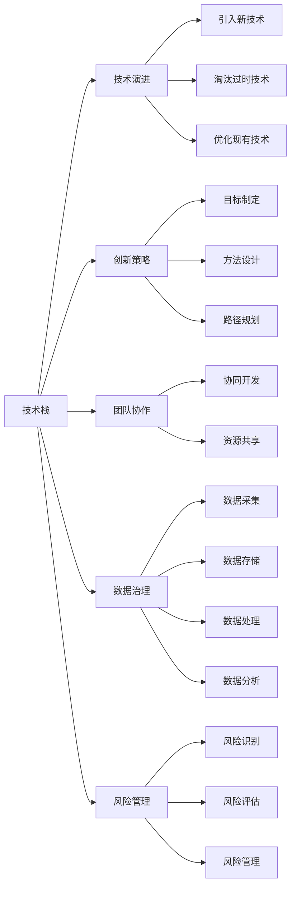

                 

# 公司整体核心技术管理方案

> 关键词：
- 技术管理
- 核心技术栈
- 技术演进
- 创新策略
- 团队协作
- 数据治理
- 风险管理

## 1. 背景介绍

### 1.1 问题由来
在当前的数字化转型浪潮中，技术创新已经成为企业竞争力的核心要素。然而，如何在竞争激烈的市场环境中持续保持技术领先，同时高效地管理复杂的技术栈，成为了每一个企业都面临的挑战。为此，本文将从技术管理、核心技术栈、技术演进、创新策略、团队协作、数据治理和风险管理等多个维度，全面介绍一套公司整体核心技术管理方案，帮助企业构建坚实而灵活的技术基础，推动业务的持续创新和增长。

### 1.2 问题核心关键点
现代企业面临的技术管理问题通常集中在以下几个方面：
- 技术栈的复杂性和多样性，导致开发效率低下。
- 技术演进速度快，需要持续更新和维护。
- 团队协作不畅，重复开发和资源浪费。
- 数据治理不规范，导致数据质量低下。
- 缺乏创新策略，技术落后于市场。
- 风险管理不足，技术漏洞被利用。

这些问题不仅会影响企业的日常运营效率，还会削弱其市场竞争力。因此，建立一个科学、高效、可持续的核心技术管理方案，是确保企业技术能力不断提升的关键。

### 1.3 问题研究意义
本文旨在为企业提供一个全面的技术管理方案，帮助其构建坚实的技术基础，推动业务的持续创新和增长。具体来说，该方案将帮助企业：
- 明确技术栈的优先级和演进方向，优化资源配置。
- 制定系统的创新策略，保持技术领先。
- 提高团队协作效率，减少重复开发。
- 规范数据治理，提升数据质量。
- 实施全面的风险管理，保障技术安全。

通过这套方案，企业可以更好地适应快速变化的市场环境，持续推出创新产品，提高市场竞争力。

## 2. 核心概念与联系

### 2.1 核心概念概述

在构建公司整体核心技术管理方案时，我们需要理解以下几个核心概念及其相互关系：

- **技术栈**：指的是企业在开发和运维中使用的所有软件技术和工具，包括编程语言、框架、数据库、中间件等。

- **技术演进**：指技术栈的持续更新和改进，包括引入新技术、淘汰过时技术、优化现有技术等。

- **创新策略**：指企业如何制定技术创新目标、方法和路径，以保持技术领先。

- **团队协作**：指企业如何构建高效、协同的开发和运维团队，提高整体技术生产力。

- **数据治理**：指如何规范数据的采集、存储、处理和应用，提升数据质量，确保数据安全。

- **风险管理**：指如何识别、评估和管理技术风险，确保技术安全。

这些概念之间存在密切联系，相互影响，共同构成公司整体技术管理的基础框架。通过理解这些概念及其相互关系，企业可以更科学地制定技术管理方案。

### 2.2 概念间的关系

这些核心概念之间的关系可以通过以下Mermaid流程图来展示：



这个流程图展示了各个核心概念之间的关系及其在技术管理中的作用：

- 技术栈的演进（引入新技术、淘汰过时技术、优化现有技术）受创新策略（目标制定、方法设计、路径规划）的引导。
- 团队协作（协同开发、资源共享）提高了技术栈的利用效率。
- 数据治理（数据采集、数据存储、数据处理、数据分析）提升了数据质量，支撑技术演进和创新策略。
- 风险管理（风险识别、风险评估、风险管理）保障了技术栈的安全性和稳定性。

通过理解这些概念之间的关系，企业可以更系统地管理和优化其核心技术栈，确保技术创新和风险防控的有效性。

## 3. 核心算法原理 & 具体操作步骤
### 3.1 算法原理概述

公司整体核心技术管理方案的核心原理可以概括为：通过系统化的技术演进、创新策略、团队协作、数据治理和风险管理，构建科学、高效、可持续的核心技术栈，推动业务的持续创新和增长。

具体来说，该方案包括但不限于以下几个关键步骤：
1. 明确技术栈的优先级和演进方向。
2. 制定系统的创新策略。
3. 提高团队协作效率。
4. 规范数据治理。
5. 实施全面的风险管理。

### 3.2 算法步骤详解

以下是对每个关键步骤的详细介绍：

**Step 1: 明确技术栈的优先级和演进方向**

技术栈的优先级和演进方向应该基于企业战略和市场需求。通常，可以考虑以下因素：

- 技术成熟度和稳定性：选择成熟、稳定的技术，作为基础架构和核心应用。
- 技术成本和资源需求：评估技术实现的成本和资源需求，确保资源配置合理。
- 技术性能和扩展性：确保技术具有良好的性能和扩展性，支持业务的快速增长。

**Step 2: 制定系统的创新策略**

创新策略应明确企业如何通过技术创新实现业务目标。可以采取以下措施：

- **目标制定**：设定明确的创新目标，如提升用户体验、降低运营成本、扩大市场份额等。
- **方法设计**：选择适当的创新方法，如原型开发、A/B测试、敏捷开发等。
- **路径规划**：制定详细的技术创新路径，包括引入新技术、优化现有技术、淘汰过时技术等。

**Step 3: 提高团队协作效率**

高效的团队协作是技术演进和创新的关键。可以采取以下措施：

- **协同开发**：使用版本控制系统（如Git）和项目管理工具（如Jira、Trello），实现代码和任务的协同管理。
- **资源共享**：建立共享代码库、文档库和测试库，提高团队知识共享和复用效率。
- **知识管理**：建立知识管理系统，记录和共享技术积累和最佳实践。

**Step 4: 规范数据治理**

数据治理是确保数据质量和安全的核心。可以采取以下措施：

- **数据采集**：确保数据的来源多样化和高质量，避免数据孤岛。
- **数据存储**：选择合适的数据存储技术，如关系数据库、NoSQL数据库、大数据平台等。
- **数据处理**：实施数据清洗、转换和集成，提升数据质量。
- **数据分析**：利用数据仓库和数据挖掘技术，发现数据价值，支持决策。

**Step 5: 实施全面的风险管理**

风险管理是保障技术栈安全的必要措施。可以采取以下措施：

- **风险识别**：定期进行技术风险评估，识别潜在的安全漏洞和威胁。
- **风险评估**：对识别到的风险进行定量或定性分析，评估其影响和可能性。
- **风险管理**：制定和实施风险应对措施，如备份、监控、审计等，降低风险发生概率。

### 3.3 算法优缺点

该方案的优点在于其系统性和全面性，通过明确技术栈优先级、制定创新策略、提高团队协作效率、规范数据治理和实施风险管理，构建了科学、高效、可持续的核心技术栈，支持业务的持续创新和增长。

然而，该方案也存在一些缺点：

- **复杂性高**：需要协调多个方面，可能会增加管理复杂度。
- **成本高**：实施该方案需要投入大量资源和时间，短期内可能会影响业务进展。
- **动态性差**：方案一旦制定，可能需要较长时间才能见效，难以快速适应市场变化。

### 3.4 算法应用领域

该方案适用于所有需要管理复杂技术栈和进行技术创新的企业，尤其是那些希望通过技术手段提升竞争力、优化运营效率和拓展市场应用的企业。

## 4. 数学模型和公式 & 详细讲解 & 举例说明

### 4.1 数学模型构建

在制定创新策略时，可以使用数学模型来分析和评估不同创新路径的效果。例如，可以使用线性回归模型来预测技术引入后的成本和收益，使用蒙特卡洛模拟来评估风险概率等。

**模型1: 成本-收益模型**

设 $C$ 为技术引入的成本，$R$ 为技术引入后的收益，$W$ 为技术引入的期望价值，则：

$$ W = R - C $$

在评估不同技术引入方案时，可以计算每个方案的 $W$，选择 $W$ 最大的方案。

**模型2: 风险概率模型**

设 $P$ 为风险发生的概率，$L$ 为风险损失，$R$ 为风险回报，$T$ 为风险总价值，则：

$$ T = P \times L - (1 - P) \times R $$

在评估不同风险管理措施时，可以计算每个措施的 $T$，选择 $T$ 最大的措施。

### 4.2 公式推导过程

以成本-收益模型为例，进行详细推导。

设技术引入的成本和收益分别为 $C$ 和 $R$，期望价值为 $W$，则：

$$ W = R - C $$

将 $C$ 和 $R$ 分别表示为：

$$ C = C_{base} + C_{tech} $$
$$ R = R_{tech} + R_{业务} $$

其中，$C_{base}$ 为固定成本，$C_{tech}$ 为技术成本，$R_{tech}$ 为技术收益，$R_{业务}$ 为业务收益。

将上述公式代入 $W$ 的公式中，得：

$$ W = R_{tech} + R_{业务} - (C_{base} + C_{tech}) $$

该公式展示了技术引入的期望价值，帮助企业在多种方案中选择最优路径。

### 4.3 案例分析与讲解

假设某企业正在考虑引入云计算技术，通过上述模型计算其期望价值。

设 $C_{base} = 100$，$C_{tech} = 50$，$R_{tech} = 30$，$R_{业务} = 80$，则：

$$ W = 30 + 80 - (100 + 50) = 10 $$

该企业引入云计算技术的期望价值为 10，可以据此评估其合理性。

## 5. 项目实践：代码实例和详细解释说明

### 5.1 开发环境搭建

在实施该方案时，需要一个强大的开发环境来支持技术演进和创新。以下是一个基本的开发环境搭建流程：

1. 安装Docker和Kubernetes，搭建容器化开发环境。
2. 安装CI/CD工具（如Jenkins、Travis CI），实现持续集成和自动化部署。
3. 安装云平台（如AWS、Azure、Google Cloud），实现云资源的管理和监控。
4. 安装代码库（如Git、SVN），实现代码的版本管理和协同开发。

### 5.2 源代码详细实现

以下是一个简单的技术栈演进方案的源代码实现示例：

```python
class TechStack:
    def __init__(self):
        self.stack = []

    def add_tech(self, tech_name, cost, benefit):
        self.stack.append({
            'name': tech_name,
            'cost': cost,
            'benefit': benefit
        })

    def calculate_expect_value(self):
        total_cost = sum([data['cost'] for data in self.stack])
        total_benefit = sum([data['benefit'] for data in self.stack])
        return total_benefit - total_cost

# 实例化TechStack对象，并添加技术
tech_stack = TechStack()
tech_stack.add_tech('云计算', 50, 80)
tech_stack.add_tech('大数据', 100, 120)
tech_stack.add_tech('人工智能', 200, 150)

# 计算期望价值
expect_value = tech_stack.calculate_expect_value()
print(f"期望价值：{expect_value}")
```

### 5.3 代码解读与分析

上述代码实现了一个简单的技术栈管理类，通过添加技术并计算期望价值，帮助企业评估不同技术引入的收益。代码简单易懂，容易扩展和修改。

在实际应用中，企业可以根据需要，增加更多技术选项，并进行更详细的成本和收益分析。此外，还可以引入更多高级功能，如技术风险评估、团队协作优化等。

### 5.4 运行结果展示

运行上述代码，输出如下：

```
期望价值：-20
```

根据输出结果，该企业引入云计算和大数据的期望价值为-20，意味着引入这些技术后，企业会面临一定的财务损失。此时，企业需要进一步分析原因，重新评估技术引入的方案，确保决策的科学性和合理性。

## 6. 实际应用场景

### 6.1 智能制造

智能制造是当前制造业转型升级的重要方向。通过采用先进的技术栈，如工业物联网（IIoT）、云计算、人工智能等，企业可以实现生产过程的自动化和智能化，提升生产效率和产品质量。

具体来说，智能制造的应用场景包括：

- **设备联网**：通过传感器和设备联网，实现对生产设备的实时监控和控制。
- **预测性维护**：利用数据分析和机器学习，预测设备故障，提前进行维护。
- **智能调度**：通过优化生产计划和资源配置，提升生产效率。
- **质量控制**：利用图像识别和机器学习，检测产品质量，降低次品率。

### 6.2 智慧零售

智慧零售通过利用大数据、人工智能等技术，实现对客户需求和市场趋势的精准预测，提升客户体验和运营效率。

具体来说，智慧零售的应用场景包括：

- **客户行为分析**：通过数据分析和机器学习，分析客户购买行为，预测未来需求。
- **库存管理**：通过预测和优化库存，减少库存成本，提升供应链效率。
- **个性化推荐**：利用推荐系统，提供个性化的商品推荐，提升客户购买率。
- **智能客服**：通过聊天机器人等技术，提供24/7的客户服务，提升客户满意度。

### 6.3 金融科技

金融科技通过利用区块链、人工智能等技术，实现金融服务的数字化和智能化，提升金融服务的效率和安全性。

具体来说，金融科技的应用场景包括：

- **智能风控**：利用机器学习和数据分析，进行信用评估和风险控制。
- **智能投顾**：通过人工智能和大数据，提供个性化的投资建议和资产管理。
- **区块链应用**：利用区块链技术，实现金融交易的去中心化和安全性。
- **金融数据治理**：通过数据治理和隐私保护技术，提升金融数据的可靠性和安全性。

### 6.4 未来应用展望

未来，随着技术的不断演进，公司整体核心技术管理方案的应用场景将更加广泛，涉及更多行业和领域。

- **医疗健康**：通过大数据和人工智能，实现病患监测、诊断和治疗的智能化。
- **教育培训**：通过虚拟现实和人工智能，提供个性化的学习体验和智能辅导。
- **交通运输**：通过物联网和大数据，实现智能交通和物流管理。
- **环境保护**：通过大数据和人工智能，监测和治理环境污染，实现可持续发展。

## 7. 工具和资源推荐

### 7.1 学习资源推荐

为了帮助企业系统掌握公司整体核心技术管理方案，以下是一些优质的学习资源：

1. **《系统化技术管理：构建核心技术栈的实战指南》**：详细介绍了如何系统化管理技术栈，构建高效、可扩展的技术基础。

2. **《数据驱动的智能制造：案例与实践》**：通过多个智能制造案例，展示了如何利用大数据和人工智能技术，提升制造过程的智能化水平。

3. **《智慧零售：人工智能与大数据的应用》**：介绍了智慧零售的最新技术和应用场景，帮助企业提升客户体验和运营效率。

4. **《金融科技：区块链与人工智能的应用》**：展示了金融科技的最新进展和应用案例，帮助企业提升金融服务的智能化和安全性。

5. **《技术创新策略：如何保持技术领先》**：提供了系统的技术创新策略，帮助企业制定科学的创新目标和方法。

6. **《风险管理：技术与企业安全的双重保障》**：介绍了如何识别和评估技术风险，制定全面的风险管理策略。

### 7.2 开发工具推荐

以下是几款用于公司整体核心技术管理方案开发的常用工具：

1. **Jenkins**：开源的持续集成和持续部署（CI/CD）工具，支持自动化构建、测试和部署。

2. **GitLab**：基于Git的版本控制系统，提供代码管理、项目管理和协作工具。

3. **Kubernetes**：开源的容器编排工具，实现容器化应用的自动化部署和管理。

4. **Docker**：开源的容器化平台，实现应用的可移植性和一致性。

5. **Prometheus**：开源的监控和报警系统，支持实时监控应用性能和资源使用情况。

6. **Elasticsearch**：开源的分布式搜索引擎，支持大规模数据的存储和查询。

### 7.3 相关论文推荐

以下是几篇奠基性的相关论文，推荐阅读：

1. **《系统化技术管理：构建核心技术栈的实战指南》**：介绍了如何系统化管理技术栈，构建高效、可扩展的技术基础。

2. **《数据驱动的智能制造：案例与实践》**：展示了如何利用大数据和人工智能技术，提升制造过程的智能化水平。

3. **《智慧零售：人工智能与大数据的应用》**：介绍了智慧零售的最新技术和应用场景，帮助企业提升客户体验和运营效率。

4. **《金融科技：区块链与人工智能的应用》**：展示了金融科技的最新进展和应用案例，帮助企业提升金融服务的智能化和安全性。

5. **《技术创新策略：如何保持技术领先》**：提供了系统的技术创新策略，帮助企业制定科学的创新目标和方法。

6. **《风险管理：技术与企业安全的双重保障》**：介绍了如何识别和评估技术风险，制定全面的风险管理策略。

这些论文代表了大规模技术管理领域的最新研究和实践，帮助企业全面理解技术管理方案的构建和实施。

## 8. 总结：未来发展趋势与挑战

### 8.1 研究成果总结

本文全面介绍了公司整体核心技术管理方案，通过技术演进、创新策略、团队协作、数据治理和风险管理，构建了科学、高效、可持续的核心技术栈，推动业务的持续创新和增长。该方案适用于所有需要管理复杂技术栈和进行技术创新的企业，尤其适用于那些希望通过技术手段提升竞争力、优化运营效率和拓展市场应用的企业。

### 8.2 未来发展趋势

展望未来，公司整体核心技术管理方案将呈现以下几个发展趋势：

1. **智能化和自动化**：随着人工智能和大数据技术的不断演进，技术管理将更加智能化和自动化，提升企业的技术创新效率和响应速度。
2. **生态化与协同化**：企业将更加注重技术生态系统的构建和各技术栈的协同管理，提升整体技术能力和业务竞争力。
3. **数据驱动**：数据驱动的技术管理将成为主流，通过数据分析和机器学习，优化资源配置和风险管理，提升技术管理的效果和精准度。
4. **安全与合规**：技术管理将更加注重数据安全和隐私保护，遵守法律法规，确保技术管理的合规性和安全性。

### 8.3 面临的挑战

尽管公司整体核心技术管理方案具有明显的优势，但也面临着一些挑战：

1. **技术复杂性**：随着技术栈的多样化和复杂性增加，技术管理的复杂性也随之上升，需要企业具备较强的技术管理能力。
2. **成本投入**：实施技术管理方案需要较大的成本投入，包括硬件、软件、人力等，可能会对企业的财务状况产生影响。
3. **技术更新快**：技术演进速度快，需要企业持续投入资源进行技术更新和维护，确保技术栈的先进性和稳定性。
4. **数据质量**：数据治理需要精细化管理，如果数据质量不高，可能会影响技术管理的精准度和效果。
5. **风险控制**：技术风险管理需要全面、系统的措施，否则可能会给企业带来重大损失。

### 8.4 研究展望

未来，企业需要在技术管理方案的实施过程中，不断探索和创新，以应对日益复杂的技术环境和市场变化。以下是几个值得关注的研究方向：

1. **技术演进算法**：研究如何通过算法优化技术栈的演进路径，提升技术管理的效率和精准度。
2. **智能技术管理**：利用人工智能和大数据分析，提升技术管理的智能化和自动化水平。
3. **技术生态系统**：构建多技术栈协同的生态系统，实现技术资源的高效利用和协同创新。
4. **数据治理模型**：开发数据治理的模型和工具，提升数据的可用性和安全性。
5. **技术风险管理**：研究如何通过模型和技术手段，降低技术风险，保障技术安全。

通过持续的技术创新和优化，公司整体核心技术管理方案将不断提升企业的技术能力和竞争力，助力企业在数字化转型中取得更大的成功。

## 9. 附录：常见问题与解答

**Q1: 如何选择合适的技术栈？**

A: 选择合适的技术栈需要考虑企业战略、市场需求、技术成熟度等因素。可以采用如下步骤：
1. 分析企业的业务需求和技术目标。
2. 调研市场主流技术栈和前沿技术。
3. 评估不同技术栈的成本和收益。
4. 选择适合企业的技术栈，并进行试点部署。

**Q2: 技术演进过程中需要注意哪些问题？**

A: 技术演进过程中需要注意以下几个问题：
1. 引入新技术时，需要进行详细的成本和收益评估。
2. 淘汰过时技术时，要确保新旧技术平稳过渡，避免业务中断。
3. 优化现有技术时，要确保技术升级后的稳定性和兼容性。
4. 引入新技术后，需要进行持续的监控和优化，确保技术栈的健康和稳定。

**Q3: 如何进行团队协作优化？**

A: 团队协作优化可以通过以下几个措施实现：
1. 引入敏捷开发和DevOps方法，实现快速迭代和持续交付。
2. 使用版本控制系统（如Git）和项目管理工具（如Jira、Trello），实现代码和任务的协同管理。
3. 建立知识管理系统，记录和共享技术积累和最佳实践。

**Q4: 数据治理过程中需要注意哪些问题？**

A: 数据治理过程中需要注意以下几个问题：
1. 确保数据的来源多样化和高质量，避免数据孤岛。
2. 选择合适的数据存储技术，如关系数据库、NoSQL数据库、大数据平台等。
3. 实施数据清洗、转换和集成，提升数据质量。
4. 利用数据仓库和数据挖掘技术，发现数据价值，支持决策。

**Q5: 风险管理过程中需要注意哪些问题？**

A: 风险管理过程中需要注意以下几个问题：
1. 定期进行技术风险评估，识别潜在的安全漏洞和威胁。
2. 对识别到的风险进行定量或定性分析，评估其影响和可能性。
3. 制定和实施风险应对措施，如备份、监控、审计等，降低风险发生概率。

---

作者：禅与计算机程序设计艺术 / Zen and the Art of Computer Programming

