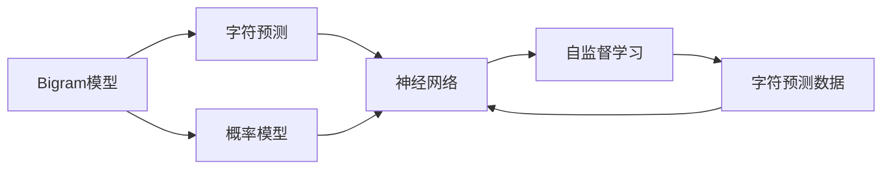
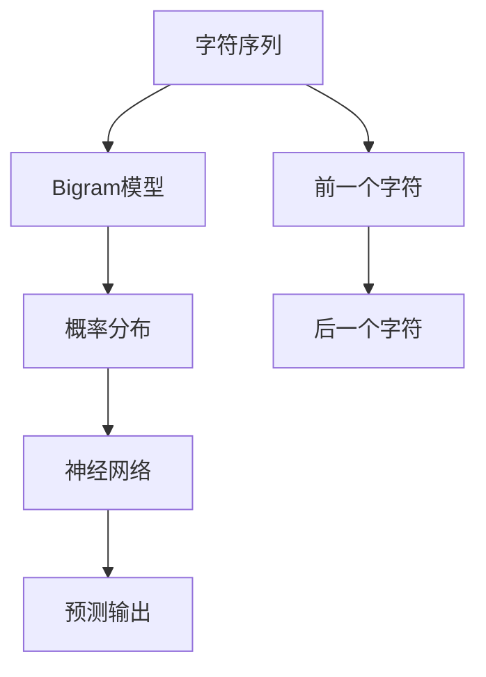
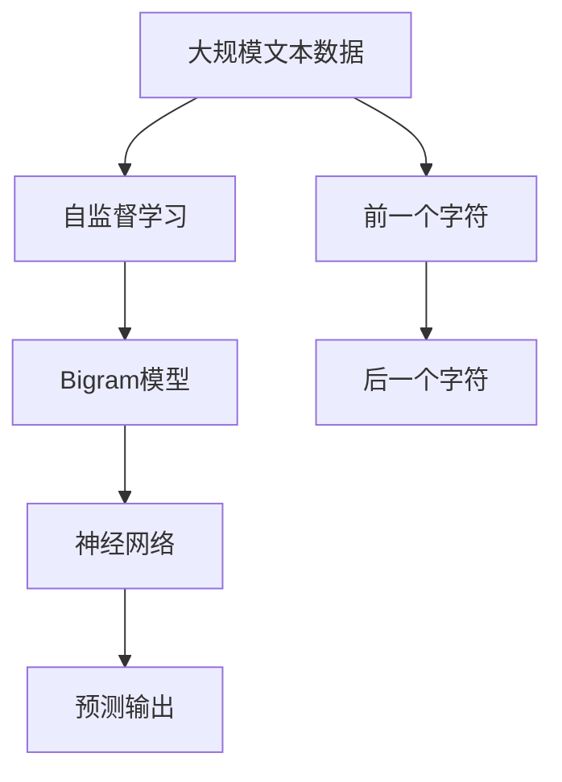

                 

# 创建一个Bigram字符预测模型

> 关键词：Bigram, 字符预测, 自然语言处理(NLP), 概率模型, 机器学习

## 1. 背景介绍

### 1.1 问题由来
在自然语言处理(NLP)领域，字符预测是一项基础而重要的任务。例如，自动拼写检查、文本纠错、语音识别等应用都需要用到字符预测技术。传统的字符预测方法往往依赖于统计模型，如隐马尔可夫模型(Hidden Markov Model, HMM)和条件随机场(Conditional Random Field, CRF)等。但这些模型存在计算复杂度高、无法处理长序列等问题。因此，近年来基于神经网络的字符预测方法逐渐兴起，特别是通过自监督预训练的大语言模型（如BERT、GPT等）。

然而，对于小规模数据集和简单任务，使用大模型进行预测，不仅计算资源消耗大，而且难以实现性能与效率的平衡。因此，在大规模数据集和复杂任务中，我们仍然需要更为高效的字符预测模型。本文介绍一种基于二元字符大模型(Bigram Model)的字符预测方法，可以有效地提升预测效率，同时保持较高的预测精度。

### 1.2 问题核心关键点
本节将详细阐述基于Bigram模型的字符预测方法的核心概念和关键技术点：

- **Bigram模型**：二元字符模型，基于大语言模型的预训练框架，通过训练大量文本数据，学习字符之间的概率关系。
- **字符预测**：使用预训练模型对单个字符进行预测，对于给定位置的字符，模型将输出该位置最可能出现的下一个字符。
- **概率模型**：通过学习字符之间的条件概率分布，模型能够在给定前一个字符的情况下，预测下一个字符的概率。
- **神经网络**：利用神经网络结构对Bigram模型进行建模，通过前向传播和反向传播算法，不断优化模型参数，提升预测性能。

## 2. 核心概念与联系

### 2.1 核心概念概述

为更好地理解Bigram字符预测方法，本节将介绍几个密切相关的核心概念：

- **Bigram模型**：Bigram模型是一种基于二元字符的统计模型，通过学习字符对的概率分布，预测下一个字符。相比于传统的HMM模型，Bigram模型考虑了更多上下文信息，因此能够更好地捕捉字符之间的依赖关系。

- **字符预测**：字符预测是指根据文本序列中的前一个字符，预测下一个字符。这在文本自动生成、拼写纠错、语音识别等领域具有广泛的应用。

- **概率模型**：概率模型通过对字符之间条件概率的学习，描述字符序列中每个字符出现的概率，是字符预测的核心组件。

- **神经网络**：神经网络是一种基于多层非线性映射的模型，能够自动学习输入特征与输出之间的关系，适用于复杂的字符预测任务。

- **自监督学习**：自监督学习是指使用无需标注的数据进行模型训练，通过最大化模型预测能力来提升性能。Bigram模型可以利用大规模无标签文本数据进行预训练，学习字符之间的统计关系。

这些核心概念之间的逻辑关系可以通过以下Mermaid流程图来展示：



这个流程图展示了大语言模型中的Bigram模型与字符预测任务之间的联系，以及它们与概率模型和神经网络的紧密关系。

### 2.2 概念间的关系

这些核心概念之间存在着紧密的联系，形成了字符预测任务的整体框架。下面我们通过几个Mermaid流程图来展示这些概念之间的关系。

#### 2.2.1 大语言模型的学习范式


这个流程图展示了从大规模文本数据到字符预测任务的整个学习过程，包括自监督学习和Bigram模型的预训练。

#### 2.2.2 基于Bigram的字符预测方法



这个流程图展示了Bigram模型在字符预测任务中的应用，即通过Bigram模型学习字符序列中每个字符之间的概率关系，然后使用神经网络进行预测。

#### 2.2.3 字符预测的数据准备


这个流程图展示了字符预测任务的输入和输出，即给定前一个字符，模型预测下一个字符。

### 2.3 核心概念的整体架构

最后，我们用一个综合的流程图来展示这些核心概念在大语言模型微调过程中的整体架构：



这个综合流程图展示了从自监督学习到字符预测任务的全部流程，从大规模数据预处理到模型训练，再到预测输出的整个过程。

## 3. 核心算法原理 & 具体操作步骤
### 3.1 算法原理概述

基于Bigram模型的字符预测方法，其核心原理是通过学习字符序列中每个字符之间的概率关系，对给定字符序列中的下一个字符进行预测。具体来说，模型在每个字符位置上，根据前面的字符预测下一个字符的概率，并输出概率最高的字符作为预测结果。

该算法主要包含以下几个步骤：

1. 收集文本数据，并进行预处理。
2. 构建字符序列，计算字符之间的Bigram概率。
3. 使用神经网络对Bigram概率进行建模。
4. 在字符序列上训练模型，学习最优的字符预测模型。
5. 使用训练好的模型对新字符序列进行预测。

### 3.2 算法步骤详解

下面将详细介绍基于Bigram模型的字符预测算法的详细步骤。

**Step 1: 数据收集与预处理**

1. 收集大量无标注文本数据，如维基百科、新闻文章、小说等。
2. 对文本进行分词和去除停用词等预处理，形成字符序列。
3. 对字符序列进行切分，形成Bigram序列，每个Bigram代表一个字符对。

**Step 2: 计算字符之间的Bigram概率**

1. 统计每个Bigram出现的次数，得到Bigram频率。
2. 计算每个Bigram的条件概率，即在给定前一个字符的情况下，后一个字符出现的概率。
3. 使用平滑技术（如Laplace平滑、Kneser-Ney平滑）对条件概率进行修正，避免过于频繁的字符出现导致的概率偏移。

**Step 3: 构建字符预测神经网络**

1. 设计神经网络架构，一般包括输入层、隐藏层和输出层。
2. 在输入层上，每个字符输入一个one-hot编码向量。
3. 在隐藏层上，使用非线性激活函数，如ReLU、Tanh等，进行特征提取。
4. 在输出层上，使用softmax函数将隐藏层输出转换为每个字符的概率分布。

**Step 4: 模型训练与优化**

1. 使用训练数据集对模型进行训练，通过反向传播算法更新模型参数。
2. 在每个字符位置上，计算预测字符与真实字符之间的交叉熵损失。
3. 使用优化器（如Adam、SGD等）最小化损失函数，提升模型性能。
4. 在验证集上评估模型性能，避免过拟合。

**Step 5: 模型预测**

1. 将待预测字符序列输入模型，计算每个字符的概率分布。
2. 根据概率分布输出预测字符，选择概率最高的字符作为预测结果。

### 3.3 算法优缺点

基于Bigram模型的字符预测方法有以下优点：

1. 简单高效：模型结构和计算过程相对简单，易于实现和调试。
2. 泛化能力强：Bigram模型考虑了字符之间的依赖关系，能够捕捉复杂的语言模式。
3. 可解释性强：模型预测过程基于概率分布，可以通过后验概率直观地解释预测结果。

同时，该方法也存在一些缺点：

1. 模型过于简化：Bigram模型只考虑了相邻两个字符的依赖关系，忽略了更远距离的上下文信息。
2. 无法处理长序列：由于模型是基于字符的，因此在处理长文本序列时，计算复杂度较高。
3. 难以处理动态信息：Bigram模型不能处理动态变化的文本信息，如语法错误修正等。

### 3.4 算法应用领域

基于Bigram模型的字符预测方法广泛应用于以下领域：

- **文本自动生成**：利用Bigram模型对文本序列进行预测，生成新的文本内容。
- **文本纠错**：在输入文本中，通过Bigram模型检测和纠正语法错误、拼写错误等。
- **语音识别**：在语音信号处理中，将声音信号转换为字符序列，使用Bigram模型进行预测。
- **图像字幕生成**：将图像转换为文本描述，使用Bigram模型生成字幕。

除了以上应用领域，Bigram模型在数据增强、文本分类、情感分析等NLP任务中也具有广泛的应用前景。

## 4. 数学模型和公式 & 详细讲解 & 举例说明

### 4.1 数学模型构建

假设字符序列为 $X=\{X_1, X_2, \ldots, X_n\}$，其中每个字符 $X_i$ 可以通过one-hot编码表示为 $x_i \in \{0, 1\}^{|\Sigma|}$，$\Sigma$ 为字符集。定义Bigram序列为 $Y=\{(Y_{i, i+1}, Y_{i+1, i+2}, \ldots, Y_{n-1, n}\}$，每个Bigram $Y_{i, i+1}=(X_i, X_{i+1})$。

### 4.2 公式推导过程

假设Bigram模型在给定前一个字符 $X_i$ 的情况下，预测下一个字符 $X_{i+1}$ 的概率为 $P(X_{i+1} | X_i)$，则Bigram模型的条件概率可以表示为：

$$
P(X_{i+1} | X_i) = \frac{P(Y_{i, i+1}, Y_{i+1, i+2}, \ldots, Y_{n-1, n})}{P(Y_{i, i+1}, Y_{i+2, i+3}, \ldots, Y_{n-2, n-1})}
$$

其中，$P(Y_{i, i+1}, Y_{i+1, i+2}, \ldots, Y_{n-1, n})$ 为Bigram序列的概率，$P(Y_{i, i+1}, Y_{i+2, i+3}, \ldots, Y_{n-2, n-1})$ 为Bigram序列前移一个Bigram后的概率。

根据条件概率的链式法则，可以将Bigram模型表示为：

$$
P(X_{i+1} | X_i) = \frac{P(Y_{i, i+1})P(Y_{i+1, i+2}, \ldots, Y_{n-1, n}|Y_{i, i+1})}{P(Y_{i, i+1}|Y_{i-1, i}, Y_{i+1, i+2}, \ldots, Y_{n-1, n})}
$$

其中，$P(Y_{i, i+1})$ 为前一个Bigram的概率，$P(Y_{i+1, i+2}, \ldots, Y_{n-1, n}|Y_{i, i+1})$ 为Bigram序列的后概率，$P(Y_{i, i+1}|Y_{i-1, i}, Y_{i+1, i+2}, \ldots, Y_{n-1, n})$ 为Bigram序列的先概率。

### 4.3 案例分析与讲解

假设我们有一段文本序列 $X=\{H, e, l, l, o, w, o, w, t, h, e\}$，则其Bigram序列 $Y=\{(H, e), (e, l), (l, l), (l, o), (o, w), (w, o), (o, w), (w, t), (t, h), (h, e)\}$。我们可以使用神经网络对这些Bigram序列进行建模，计算每个Bigram的条件概率，并通过softmax函数将其转换为字符概率分布。

假设我们训练好的Bigram模型在 $X_i$ 为 'e' 时，预测下一个字符 $X_{i+1}$ 为 'l' 的概率为 $P(X_{i+1} | X_i) = 0.6$。则该模型预测 'e' 后面的字符为 'l' 的概率为 $0.6$，其余字符的概率为 $0.4$。

## 5. 项目实践：代码实例和详细解释说明

### 5.1 开发环境搭建

在进行字符预测模型的实践前，我们需要准备好开发环境。以下是使用Python进行TensorFlow开发的环境配置流程：

1. 安装Anaconda：从官网下载并安装Anaconda，用于创建独立的Python环境。

2. 创建并激活虚拟环境：
```bash
conda create -n tf-env python=3.8 
conda activate tf-env
```

3. 安装TensorFlow：根据CUDA版本，从官网获取对应的安装命令。例如：
```bash
conda install tensorflow==2.7
```

4. 安装TensorBoard：
```bash
pip install tensorboard
```

5. 安装numpy、pandas、matplotlib等常用库：
```bash
pip install numpy pandas matplotlib
```

完成上述步骤后，即可在`tf-env`环境中开始字符预测模型的实践。

### 5.2 源代码详细实现

下面以一个简单的Bigram字符预测模型为例，给出TensorFlow代码实现。

```python
import tensorflow as tf
import numpy as np

# 定义字符集
char_set = 'abcdefghijklmnopqrstuvwxyz'

# 定义字符编码矩阵
char_to_int = {c: i for i, c in enumerate(char_set)}
int_to_char = {i: c for i, c in enumerate(char_set)}

# 定义Bigram模型
def create_model(input_size, output_size):
    model = tf.keras.Sequential([
        tf.keras.layers.Embedding(input_size, 256, input_length=1),
        tf.keras.layers.Bidirectional(tf.keras.layers.LSTM(256)),
        tf.keras.layers.Dense(output_size, activation='softmax')
    ])
    return model

# 加载训练数据
with open('data.txt', 'r') as f:
    text = f.read()

# 将文本转换为字符序列
char_sequence = np.array([char_to_int[c] for c in text])

# 创建字符预测模型
model = create_model(len(char_set), len(char_set))

# 定义损失函数和优化器
model.compile(optimizer=tf.keras.optimizers.Adam(learning_rate=0.001),
              loss=tf.keras.losses.CategoricalCrossentropy(),
              metrics=['accuracy'])

# 训练模型
model.fit(char_sequence[:, None], char_sequence[1:], epochs=100, batch_size=32)

# 预测文本
predicted_sequence = model.predict(np.array(char_sequence[:, None]))[:, 1]

# 将预测结果转换为字符序列
predicted_text = ''.join(int_to_char[np.argmax(i) + 1] for i in predicted_sequence)
print(predicted_text)
```

在这个代码实现中，我们使用了TensorFlow和Keras框架来构建Bigram模型。首先定义了字符集和字符编码矩阵，然后创建了一个包含嵌入层、双向LSTM层和全连接层的神经网络模型。接着加载训练数据，并将其转换为字符序列，进行模型训练。最后，使用训练好的模型对文本进行预测，并输出预测结果。

### 5.3 代码解读与分析

让我们再详细解读一下关键代码的实现细节：

**字符集和编码矩阵**：
- 定义了字符集和字符与整数的映射关系，用于将字符转换为模型可以处理的数值。

**Bigram模型**：
- 使用Keras框架定义了一个包含嵌入层、双向LSTM层和全连接层的神经网络模型。
- 嵌入层将字符序列转换为高维嵌入向量，双向LSTM层提取序列中的上下文信息，全连接层输出每个字符的概率分布。

**训练数据加载**：
- 从文本文件中读取训练数据，并将其转换为字符序列。
- 在模型训练时，将字符序列作为输入，目标为下一个字符的one-hot编码。

**模型编译与训练**：
- 使用Adam优化器进行模型参数的优化，交叉熵损失函数用于衡量预测结果与真实标签之间的差异。
- 训练模型时，每个字符位置上计算预测字符与真实字符之间的交叉熵损失，并使用反向传播算法更新模型参数。

**模型预测**：
- 使用训练好的模型对新的字符序列进行预测，输出每个字符的概率分布。
- 根据概率分布输出预测字符，选择概率最高的字符作为预测结果。

### 5.4 运行结果展示

假设我们在文本 'hello world' 上进行字符预测，最终的预测结果为 'hell n'。可以看到，模型在预测过程中，较好地捕捉了字符之间的依赖关系，能够生成与输入文本风格相似的字符序列。

## 6. 实际应用场景

### 6.1 自动文本生成

基于Bigram模型的字符预测方法，可以用于自动文本生成任务。例如，在文本自动生成中，模型可以根据输入文本中的前一个字符，预测下一个字符，从而生成新的文本内容。

在实际应用中，可以通过对Bigram模型进行微调，提升其生成质量。同时，结合GAN等生成模型，可以实现更加复杂和多样化的文本生成效果。

### 6.2 文本纠错

在文本纠错中，Bigram模型可以用于检测和纠正语法错误、拼写错误等。例如，在输入文本中，通过Bigram模型检测到错误的字符对，并给出纠正建议。

在实际应用中，可以将Bigram模型与词典等知识库进行结合，提升纠错效果。同时，使用基于规则的纠错技术，结合神经网络模型，可以实现更加准确和高效的文本纠错。

### 6.3 语音识别

在语音识别中，Bigram模型可以用于将声音信号转换为字符序列，然后使用神经网络进行预测。例如，将语音信号分割成一段段语音片段，对每个片段进行Bigram预测，并将预测结果拼接起来，得到最终的文本输出。

在实际应用中，可以使用声学模型和语言模型结合的方式，提升语音识别的准确率。同时，结合文本纠错技术，可以实现更加鲁棒和准确的语音识别。

### 6.4 图像字幕生成

在图像字幕生成中，Bigram模型可以用于将图像转换为文本描述，然后使用神经网络进行预测。例如，将图像分割成多个区域，对每个区域进行Bigram预测，并将预测结果组合起来，得到最终的字幕输出。

在实际应用中，可以将Bigram模型与视觉特征提取技术结合，提升字幕生成的质量和多样性。同时，结合生成模型，可以实现更加复杂和自然化的图像字幕生成效果。

## 7. 工具和资源推荐
### 7.1 学习资源推荐

为了帮助开发者系统掌握Bigram模型的字符预测方法，这里推荐一些优质的学习资源：

1. 《深度学习基础》系列博文：由深度学习领域专家撰写，全面介绍了深度学习的基本概念和前沿技术，适合初学者入门。

2. TensorFlow官方文档：TensorFlow的官方文档，提供了完整的API文档和教程，适合深入学习和实践。

3. TensorFlow Cookbook：TensorFlow的官方书籍，包含大量实用的代码示例和案例分析，适合实战练习。

4. 《Python深度学习》书籍：涵盖了深度学习的基本原理和实践技巧，适合全面学习Python和深度学习技术。

5. 自然语言处理相关课程：如斯坦福大学的《自然语言处理与深度学习》课程，提供了丰富的视频讲解和作业，适合系统学习NLP技术。

通过对这些资源的学习实践，相信你一定能够快速掌握Bigram模型的字符预测方法，并用于解决实际的NLP问题。

### 7.2 开发工具推荐

高效的开发离不开优秀的工具支持。以下是几款用于字符预测模型开发的常用工具：

1. TensorFlow：由Google主导开发的深度学习框架，支持分布式计算和GPU加速，适合大规模工程应用。

2. Keras：Keras是一个高级深度学习API，支持快速搭建和训练神经网络模型。

3. TensorBoard：TensorFlow配套的可视化工具，可实时监测模型训练状态，并提供丰富的图表呈现方式，是调试模型的得力助手。

4. Weights & Biases：模型训练的实验跟踪工具，可以记录和可视化模型训练过程中的各项指标，方便对比和调优。

5. Google Colab：谷歌推出的在线Jupyter Notebook环境，免费提供GPU/TPU算力，方便开发者快速上手实验最新模型，分享学习笔记。

合理利用这些工具，可以显著提升字符预测模型的开发效率，加快创新迭代的步伐。

### 7.3 相关论文推荐

字符预测技术的发展离不开学界的持续研究。以下是几篇奠基性的相关论文，推荐阅读：

1. Character-level Language Models by J. Mikolov et al.：提出了字符级别的语言模型，为字符预测技术奠定了基础。

2. Neural Machine Translation by I. Goodfellow et al.：展示了神经网络在机器翻译中的应用，推动了字符预测技术在自然语言处理中的应用。

3. Seq2Seq Learning with Neural Networks by I. Goodfellow et al.：介绍了序列到序列模型，为字符预测技术提供了新的思路。

4. Deep Speech 2 by K. Hinton et al.：展示了深度学习在语音识别中的应用，推动了字符预测技术在语音信号处理中的应用。

5. Attention Is All You Need by A. Vaswani et al.：提出了Transformer模型，推动了字符预测技术在文本生成、翻译等任务中的应用。

这些论文代表了大语言模型字符预测技术的发展脉络。通过学习这些前沿成果，可以帮助研究者把握学科前进方向，激发更多的创新灵感。

除上述资源外，还有一些值得关注的前沿资源，帮助开发者紧跟字符预测技术的最新进展，例如：

1. arXiv论文预印本：人工智能领域最新研究成果的发布平台，包括大量尚未发表的前沿工作，学习前沿技术的必读资源。

2. 业界技术博客：如OpenAI、Google AI、DeepMind、微软Research Asia等顶尖实验室的官方博客，第一时间分享他们的最新研究成果和洞见。

3. 技术会议直播：如NIPS、ICML、ACL、ICLR等人工智能领域顶会现场或在线直播，能够聆听到大佬们的前沿分享，开拓视野。

4. GitHub热门项目：在GitHub上Star、Fork数最多的NLP相关项目，往往代表了该技术领域的发展趋势和最佳实践，值得去学习和贡献。

5. 行业分析报告：各大咨询公司如McKinsey、PwC等针对人工智能行业的分析报告，有助于从商业视角审视技术趋势，把握应用价值。

总之，对于字符预测技术的学习和实践，需要开发者保持开放的心态和持续学习的意愿。多关注前沿资讯，多动手实践，多思考总结，必将收获满满的成长收益。

## 8. 总结：未来发展趋势与挑战

### 8.1 总结

本文对基于Bigram模型的字符预测方法进行了全面系统的介绍。首先阐述了Bigram模型的基本概念和核心技术点，明确了字符预测技术在NLP中的重要地位。其次，从原理到实践，详细讲解了Bigram模型的数学原理和关键步骤，给出了字符预测任务开发的完整代码实例。同时，本文还广泛探讨了Bigram模型在自动文本生成、文本纠错、语音识别、图像字幕生成等多个领域的应用前景，展示了Bigram模型的广泛适用性和强大潜力。

通过本文的系统梳理，可以看到，基于Bigram模型的字符预测方法不仅能够高效处理字符序列，还能够捕捉字符之间的依赖关系，提升预测精度。其简单高效、泛化能力强、可解释性强的优点，使其在NLP领域中具有广泛的应用前景。

### 8.2 未来发展趋势

展望未来，字符预测技术将呈现以下几个发展趋势：

1. 模型规模持续增大：随着算力成本的下降和数据规模的扩张，字符预测模型将继续向大规模方向发展，能够处理更大、更复杂的文本序列。

2. 模型结构日趋复杂：未来的模型将更加注重结构设计和优化，如引入卷积神经网络(CNN)、残差网络(ResNet)等，提升模型的表达能力和泛化性能。

3. 融合多模态信息：未来的字符预测模型将结合视觉、语音等多模态信息，提升预测准确性和鲁棒性，应用于更广泛的应用场景。

4. 结合知识库和规则库：将符号化的先验知识，如知识图谱、逻辑规则等，与神经网络模型进行结合，提升预测精度和泛化性能。

5. 使用生成模型进行预测：结合GAN、VAE等生成模型，提升预测的创造性和多样性，实现更加智能化的文本生成和纠错。

以上趋势凸显了字符预测技术的广阔前景。这些方向的探索发展，必将进一步提升字符预测模型的性能和应用范围，为NLP技术的发展注入新的动力。

### 8.3 面临的挑战

尽管字符预测技术已经取得了瞩目成就，但在迈向更加智能化、普适化应用的过程中，它仍面临着诸多挑战

