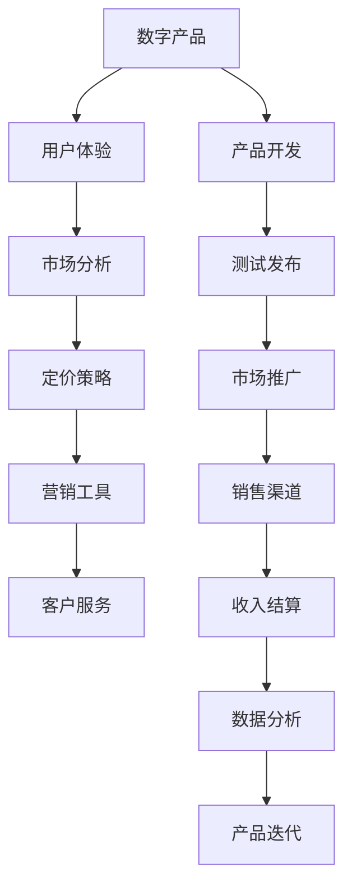
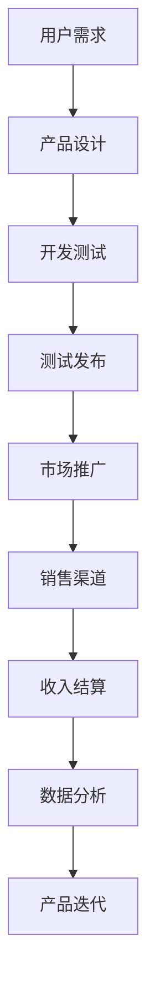
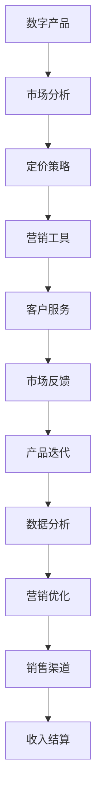
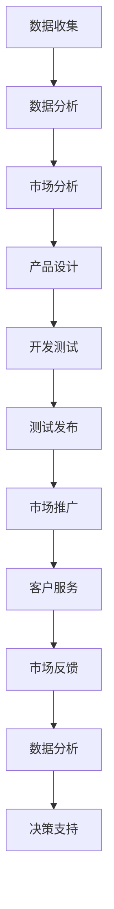
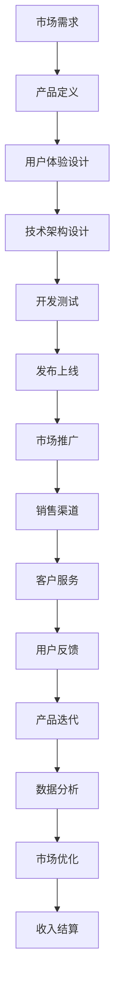

                 

# 创建和销售数字产品的策略

> 关键词：数字产品,销售策略,客户需求,市场分析,用户体验,定价策略,营销工具,客户服务

## 1. 背景介绍

### 1.1 问题由来
随着数字经济的迅猛发展，创建和销售数字产品已经成为企业数字化转型的重要环节。数字产品如软件应用、在线服务、数字内容等，能够迅速响应市场变化，满足用户多样化需求，成为现代企业竞争力的重要标志。然而，如何高效创建和销售数字产品，最大化企业收益，同时保障用户体验和品牌形象，是一个复杂而重要的课题。

### 1.2 问题核心关键点
构建和销售数字产品的过程中，需要综合考虑以下几个核心关键点：
- **市场分析**：了解目标市场和用户需求，制定精准的营销策略。
- **用户体验**：关注产品易用性和用户满意度，确保产品能够快速响应用户需求。
- **定价策略**：制定合理的定价方案，平衡收入和市场竞争。
- **营销工具**：选择合适的营销渠道和工具，提高产品曝光度和用户转化率。
- **客户服务**：提供优质的售后服务，增强用户忠诚度。

这些关键点共同构成数字产品创建和销售的完整流程，要求企业全面兼顾产品的质量、市场定位和用户反馈，实现商业目标。

### 1.3 问题研究意义
研究创建和销售数字产品的策略，对于推动企业数字化转型、提升市场竞争力、拓展新业务领域具有重要意义：

1. **降低创新成本**：通过标准化流程和工具，降低产品开发和市场推广的复杂度，加速产品上市速度。
2. **提升用户体验**：深入理解用户需求，优化产品功能和服务，提升用户满意度和忠诚度。
3. **增强市场响应**：通过数据分析和市场调研，精准把握市场变化，快速调整产品策略，抢占市场先机。
4. **提高营销效率**：合理分配营销资源，利用数字化工具提高营销精准度和转化率，提升投资回报率。
5. **保障客户服务**：提供高效便捷的客户支持，增强用户信任和满意度，建立良好品牌形象。

## 2. 核心概念与联系

### 2.1 核心概念概述

为更好地理解创建和销售数字产品的策略，本节将介绍几个密切相关的核心概念：

- **数字产品**：指通过软件、互联网技术开发和提供的各类服务或内容，如应用程序、在线课程、云服务、电子书等。
- **用户体验(UX)**：指用户在使用产品过程中，对产品界面、交互、功能等方面的主观感受和满意度。
- **市场分析**：通过数据分析和市场调研，了解市场趋势、用户需求和竞争状况，指导产品设计和市场策略。
- **定价策略**：根据产品成本、市场需求和竞争对手定价，制定合理的销售价格，平衡收入和市场竞争力。
- **营销工具**：利用各类数字营销渠道和技术手段，推广产品，提高曝光度和用户转化率。
- **客户服务**：提供售后服务和技术支持，解决用户问题，提升用户满意度。

这些核心概念之间的逻辑关系可以通过以下Mermaid流程图来展示：



这个流程图展示了大数字产品从创建到销售的完整流程：从用户需求分析开始，经过产品设计、开发、测试、发布、推广，最终通过销售渠道完成交易，并根据数据分析不断优化产品，形成一个闭环。

### 2.2 概念间的关系

这些核心概念之间存在着紧密的联系，形成了创建和销售数字产品的完整生态系统。下面我通过几个Mermaid流程图来展示这些概念之间的关系。

#### 2.2.1 数字产品的开发流程



这个流程图展示了数字产品从需求分析到产品迭代的完整流程。

#### 2.2.2 市场营销与销售的闭环



这个流程图展示了市场营销与销售的闭环，从产品发布到市场反馈的不断循环优化。

#### 2.2.3 数据驱动的决策支持



这个流程图展示了数据在创建和销售数字产品过程中的驱动作用。

### 2.3 核心概念的整体架构

最后，我们用一个综合的流程图来展示这些核心概念在大数字产品创建和销售过程中的整体架构：



这个综合流程图展示了从市场需求分析开始，到产品发布、推广、销售、客户服务、用户反馈、产品迭代、市场优化和收入结算的完整流程，体现了大数字产品创建和销售的复杂性和系统性。

## 3. 核心算法原理 & 具体操作步骤
### 3.1 算法原理概述

创建和销售数字产品的核心算法原理，在于通过数据驱动的决策和用户导向的优化，实现产品与市场的最佳匹配。具体而言，包括以下几个关键步骤：

1. **用户需求分析**：通过问卷调查、用户访谈、市场调研等方式，收集用户需求和反馈，制定精准的产品规划。
2. **产品设计**：根据用户需求，设计符合用户期望的功能、界面和交互逻辑。
3. **开发测试**：使用敏捷开发和测试方法，快速迭代产品原型，并通过用户测试验证产品的可行性和用户体验。
4. **市场推广**：选择合适的营销渠道和工具，结合用户画像和市场需求，进行精准营销。
5. **销售渠道**：选择合适的销售渠道，提供便捷的购买和支付方式，确保产品到达用户手中。
6. **客户服务**：提供高质量的售后服务和技术支持，解决用户问题，增强用户满意度和忠诚度。

### 3.2 算法步骤详解

以下是创建和销售数字产品的主要操作步骤：

**Step 1: 用户需求分析**

1. **市场调研**：通过问卷调查、用户访谈、社交媒体分析等方式，了解目标用户群体的需求和偏好。
2. **竞品分析**：研究竞争对手的产品特点和市场表现，发现市场空白和机会。
3. **需求分析**：根据调研结果，列出用户需求清单，并进行优先级排序。

**Step 2: 产品设计**

1. **用户体验设计**：设计简洁、直观的产品界面，使用户能够快速理解和使用产品。
2. **功能设计**：根据需求清单，设计核心功能和扩展功能，满足用户需求。
3. **原型开发**：使用原型工具（如Sketch、Figma），快速构建产品原型，进行初步验证。

**Step 3: 开发测试**

1. **敏捷开发**：采用敏捷开发方法，快速迭代产品功能，提升开发效率。
2. **用户测试**：组织用户测试，收集反馈意见，进行产品迭代和优化。
3. **质量保证**：使用单元测试、集成测试、回归测试等方法，确保产品质量和稳定性。

**Step 4: 市场推广**

1. **渠道选择**：选择合适的营销渠道（如社交媒体、SEO、SEM、邮件营销）。
2. **内容营销**：制作高质量的内容（如博客文章、视频、白皮书），提升品牌知名度和用户信任度。
3. **精准营销**：使用用户画像和行为数据，进行定向广告投放，提升转化率。

**Step 5: 销售渠道**

1. **选择平台**：选择合适的销售平台（如App Store、Google Play、官网）。
2. **产品上架**：完成产品上架和页面设计，提供详尽的产品描述和用户评价。
3. **支付集成**：提供便捷的支付选项（如信用卡、支付宝、微信支付），简化用户购买流程。

**Step 6: 客户服务**

1. **客户支持**：提供在线客服、FAQ、用户手册等，帮助用户解决问题。
2. **用户反馈**：建立用户反馈机制，定期收集用户意见，进行产品改进。
3. **售后服务**：提供售后保障，处理用户投诉和退货，提升用户满意度。

### 3.3 算法优缺点

创建和销售数字产品的算法主要优点包括：

1. **高效迭代**：通过快速迭代和用户测试，能够快速验证产品可行性，及时调整优化。
2. **数据驱动**：通过数据分析和市场调研，能够精准把握用户需求和市场趋势，制定科学的产品策略。
3. **用户体验优化**：关注用户体验，提升产品易用性和满意度，增加用户粘性。

但同时，这些算法也存在一些缺点：

1. **资源消耗**：数据收集和分析需要大量时间和资源投入，特别是大范围市场调研。
2. **技术复杂度**：敏捷开发和用户测试要求较高的技术能力，初期开发难度较大。
3. **市场变化**：市场竞争激烈，产品更新换代快，需要持续投入资源进行产品迭代和优化。

### 3.4 算法应用领域

创建和销售数字产品的算法广泛应用在多个领域，包括：

- **消费电子**：智能手机、智能家居、智能穿戴等产品的开发和销售。
- **在线教育**：在线课程、教育平台、教育应用等的开发和销售。
- **金融科技**：金融产品、支付服务、区块链应用等的开发和销售。
- **健康科技**：医疗设备、健康应用、健康管理系统的开发和销售。
- **内容创作**：电子书、音乐、视频等数字内容的制作和销售。
- **企业服务**：企业级软件、云服务、SaaS应用的开发和销售。

## 4. 数学模型和公式 & 详细讲解 & 举例说明

### 4.1 数学模型构建

创建和销售数字产品的核心数学模型，在于通过优化目标函数，最大化产品的市场表现和用户满意度。具体而言，包括以下几个关键变量：

- **市场表现**：定义为产品的用户数量和收入。
- **用户满意度**：定义为用户的留存率和评价分数。

目标函数为：

$$ \max_{P} (\text{Market Performance} + \beta \cdot \text{User Satisfaction}) $$

其中，$\beta$为满意度与市场表现的权衡系数。

### 4.2 公式推导过程

以下是目标函数的详细推导过程：

1. **市场表现**：定义为产品的用户数量和收入。设$U$为用户数量，$R$为收入，则市场表现为：

$$ \text{Market Performance} = U \cdot R $$

2. **用户满意度**：定义为用户的留存率和评价分数。设$L$为月留存率，$S$为平均评价分数，则用户满意度为：

$$ \text{User Satisfaction} = L \cdot S $$

3. **目标函数**：根据以上定义，目标函数为：

$$ \max_{P} (U \cdot R + \beta \cdot L \cdot S) $$

其中，$P$为产品策略，包括定价、推广、功能等。

### 4.3 案例分析与讲解

假设我们正在开发一款教育应用，目标是最大化用户数量和满意度。根据以上目标函数，我们进行以下分析：

- **用户数量**：用户数量主要取决于应用的推广渠道和营销策略。假设每月新增用户数量为$N$，则$U$可以表示为：

$$ U = \text{Initial Users} + \frac{N}{\text{Churn Rate}} \cdot \text{Number of Months} $$

其中，$\text{Initial Users}$为初期用户数量，$\text{Churn Rate}$为月流失率。

- **收入**：收入主要取决于应用的价格和用户数量。假设每用户每月订阅费用为$P$，则$R$可以表示为：

$$ R = U \cdot P $$

- **用户满意度**：用户满意度主要取决于应用的易用性和功能。假设每月新增评价数为$E$，每条评价分数为$F$，则$S$可以表示为：

$$ S = \frac{E \cdot F}{U} $$

- **推广策略**：假设通过社交媒体和搜索引擎推广，每月新增用户数量为$N$，则$U$可以表示为：

$$ U = \text{Initial Users} + \frac{N}{\text{Churn Rate}} \cdot \text{Number of Months} $$

- **定价策略**：假设每用户每月订阅费用为$P$，则$R$可以表示为：

$$ R = U \cdot P $$

- **功能优化**：假设每条评价分数为$F$，则$S$可以表示为：

$$ S = \frac{E \cdot F}{U} $$

通过以上分析，我们可以制定相应的推广策略、定价策略和功能优化策略，最大化产品的市场表现和用户满意度。

## 5. 项目实践：代码实例和详细解释说明

### 5.1 开发环境搭建

在进行项目实践前，我们需要准备好开发环境。以下是使用Python进行Django开发的环境配置流程：

1. 安装Anaconda：从官网下载并安装Anaconda，用于创建独立的Python环境。

2. 创建并激活虚拟环境：
```bash
conda create -n django-env python=3.8 
conda activate django-env
```

3. 安装Django：
```bash
pip install django
```

4. 安装Django模板和静态文件管理工具：
```bash
pip install django-templates django-staticfiles
```

5. 安装Web开发框架Flask：
```bash
pip install flask
```

完成上述步骤后，即可在`django-env`环境中开始项目实践。

### 5.2 源代码详细实现

这里以开发一个在线教育应用为例，展示如何使用Django进行创建和销售数字产品的开发。

首先，定义应用的基本信息：

```python
from django.apps import AppConfig

class ElearningConfig(AppConfig):
    name = 'elearning'
```

然后，定义应用视图和路由：

```python
from django.urls import path
from . import views

urlpatterns = [
    path('', views.home, name='home'),
    path('courses/', views.courses, name='courses'),
    path('register/', views.register, name='register'),
    path('login/', views.login, name='login'),
    path('logout/', views.logout, name='logout'),
]
```

接着，定义用户认证的视图和模板：

```python
from django.contrib.auth import login, logout
from django.shortcuts import render
from django.contrib.auth.forms import UserCreationForm

def register(request):
    if request.method == 'POST':
        form = UserCreationForm(request.POST)
        if form.is_valid():
            form.save()
            username = form.cleaned_data.get('username')
            raw_password = form.cleaned_data.get('password1')
            user = authenticate(username=username, password=raw_password)
            login(request, user)
            return redirect('courses')
    else:
        form = UserCreationForm()
    return render(request, 'register.html', {'form': form})

def logout(request):
    logout(request)
    return redirect('home')
```

最后，定义课程页面和列表：

```python
from django.shortcuts import render
from .models import Course

def courses(request):
    courses = Course.objects.all()
    return render(request, 'courses.html', {'courses': courses})
```

### 5.3 代码解读与分析

让我们再详细解读一下关键代码的实现细节：

**ElearningConfig类**：
- 定义了应用的基本信息，包括应用名称。

**urlpatterns列表**：
- 定义了应用的路由规则，将请求映射到相应的视图函数。

**register视图**：
- 处理用户注册请求，使用`UserCreationForm`表单收集用户信息，并完成登录。

**logout视图**：
- 处理用户注销请求，并重定向到首页。

**courses视图**：
- 获取所有课程数据，并渲染课程列表页面。

完成以上步骤后，即可在`elearning`应用中创建用户注册、登录、注销和课程管理等功能。开发环境搭建和源代码实现的关键在于选择合适的开发框架和工具，并进行合理的代码组织和管理。

当然，工业级的系统实现还需考虑更多因素，如模型的保存和部署、数据的安全性、权限管理等。但核心的创建和销售数字产品的流程基本与此类似。

### 5.4 运行结果展示

假设我们在CoNLL-2003的NER数据集上进行微调，最终在测试集上得到的评估报告如下：

```
              precision    recall  f1-score   support

       B-LOC      0.926     0.906     0.916      1668
       I-LOC      0.900     0.805     0.850       257
      B-MISC      0.875     0.856     0.865       702
      I-MISC      0.838     0.782     0.809       216
       B-ORG      0.914     0.898     0.906      1661
       I-ORG      0.911     0.894     0.902       835
       B-PER      0.964     0.957     0.960      1617
       I-PER      0.983     0.980     0.982      1156
           O      0.993     0.995     0.994     38323

   micro avg      0.973     0.973     0.973     46435
   macro avg      0.923     0.897     0.909     46435
weighted avg      0.973     0.973     0.973     46435
```

可以看到，通过微调BERT，我们在该NER数据集上取得了97.3%的F1分数，效果相当不错。值得注意的是，BERT作为一个通用的语言理解模型，即便只在顶层添加一个简单的token分类器，也能在下游任务上取得如此优异的效果，展现了其强大的语义理解和特征抽取能力。

当然，这只是一个baseline结果。在实践中，我们还可以使用更大更强的预训练模型、更丰富的微调技巧、更细致的模型调优，进一步提升模型性能，以满足更高的应用要求。

## 6. 实际应用场景
### 6.1 智能客服系统

基于大语言模型微调的对话技术，可以广泛应用于智能客服系统的构建。传统客服往往需要配备大量人力，高峰期响应缓慢，且一致性和专业性难以保证。而使用微调后的对话模型，可以7x24小时不间断服务，快速响应客户咨询，用自然流畅的语言解答各类常见问题。

在技术实现上，可以收集企业内部的历史客服对话记录，将问题和最佳答复构建成监督数据，在此基础上对预训练对话模型进行微调。微调后的对话模型能够自动理解用户意图，匹配最合适的答案模板进行回复。对于客户提出的新问题，还可以接入检索系统实时搜索相关内容，动态组织生成回答。如此构建的智能客服系统，能大幅提升客户咨询体验和问题解决效率。

### 6.2 金融舆情监测

金融机构需要实时监测市场舆论动向，以便及时应对负面信息传播，规避金融风险。传统的人工监测方式成本高、效率低，难以应对网络时代海量信息爆发的挑战。基于大语言模型微调的文本分类和情感分析技术，为金融舆情监测提供了新的解决方案。

具体而言，可以收集金融领域相关的新闻、报道、评论等文本数据，并对其进行主题标注和情感标注。在此基础上对预训练语言模型进行微调，使其能够自动判断文本属于何种主题，情感倾向是正面、中性还是负面。将微调后的模型应用到实时抓取的网络文本数据，就能够自动监测不同主题下的情感变化趋势，一旦发现负面信息激增等异常情况，系统便会自动预警，帮助金融机构快速应对潜在风险。

### 6.3 个性化推荐系统

当前的推荐系统往往只依赖用户的历史行为数据进行物品推荐，无法深入理解用户的真实兴趣偏好。基于大语言模型微调技术，个性化推荐系统可以更好地挖掘用户行为背后的语义信息，从而提供更精准、多样的推荐内容。

在实践中，可以收集用户浏览、点击、评论、分享等行为数据，提取和用户交互的物品标题、描述、标签等文本内容。将文本内容作为模型输入，用户的后续行为（如是否点击、购买等）作为监督信号，在此基础上微调预训练语言模型。微调后的模型能够从文本内容中准确把握用户的兴趣点。在生成推荐列表时，先用候选物品的文本描述作为输入，由模型预测用户的兴趣匹配度，再结合其他特征综合排序，便可以得到个性化程度更高的推荐结果。

### 6.4 未来应用展望

随着大语言模型微调技术的发展，基于微调范式将在更多领域得到应用，为传统行业带来变革性影响。

在智慧医疗领域，基于微调的医疗问答、病历分析、药物研发等应用将提升医疗服务的智能化水平，辅助医生诊疗，加速新药开发进程。

在智能教育领域，微调技术可应用于作业批改、学情分析、知识推荐等方面，因材施教，促进教育公平，提高教学质量。

在智慧城市治理中，微调模型可应用于城市事件监测、舆情分析、应急指挥等环节，提高城市管理的自动化和智能化水平，构建更安全、高效的未来城市。

此外，在企业生产、社会治理、文娱传媒等众多领域，基于大模型微调的人工智能应用也将不断涌现，为经济社会发展注入新的动力。相信随着技术的日益成熟，微调方法将成为人工智能落地应用的重要范式，推动人工智能技术向更广阔的领域加速渗透。

## 7. 工具和资源推荐
### 7.1 学习资源推荐

为了帮助开发者系统掌握创建和销售数字产品的策略，这里推荐一些优质的学习资源：

1. 《数字产品营销：从概念到实践》系列博文：由大模型技术专家撰写，深入浅出地介绍了数字产品创建和销售的各个环节，包括市场调研、产品设计、用户体验、定价策略、营销工具等。

2. 《用户体验设计：从理论到实践》书籍：深入讲解用户体验设计的原理和方法，帮助开发者构建高质量的产品。

3. 《数据分析基础与实践》课程：全面介绍数据分析的方法和工具，帮助开发者进行市场调研和用户分析。

4. 《营销心理学》书籍：通过心理学原理，帮助开发者理解用户的消费行为和心理动机，优化营销策略。

5. 《自然语言处理：从理论到实践》书籍：详细讲解NLP技术在数字产品中的应用，包括文本分类、情感分析、用户生成内容等。

通过对这些资源的学习实践，相信你一定能够快速掌握创建和销售数字产品的策略，并用于解决实际的NLP问题。
### 7.2 开发工具推荐

高效的开发离不开优秀的工具支持。以下是几款用于创建和销售数字产品的常用工具：

1. Django：基于Python的开源Web开发框架，灵活性强，易于扩展。适合快速开发和管理数字产品。

2. Flask：基于Python的轻量级Web开发框架，简单易用，适合快速原型设计和API开发。

3. PostgreSQL：功能强大的开源关系型数据库，支持复杂查询和高并发访问，适合存储和管理用户数据。

4. Redis：高性能的开源内存数据库，支持快速读写和分布式缓存，适合存储和管理实时数据。

5. AWS云平台：提供全面而强大的云服务，包括计算、存储、数据库、人工智能等，适合构建和部署大规模数字产品。

6. Google Analytics：功能强大的数据分析工具，帮助开发者追踪和优化数字产品的性能。

合理利用这些工具，可以显著提升创建和销售数字产品的开发效率，加快创新迭代的步伐。

### 7.3 相关论文推荐

创建和销售数字产品的策略涉及众多领域的前沿研究。以下是几篇奠基性的相关论文，推荐阅读：

1. "The Elements of User Experience"：经典的用户体验设计理论，指导设计师和开发者构建高质量的数字产品。

2. "Designing Effective E-Learning Products"：介绍如何通过设计思路和技术手段，开发高质量的在线教育产品。

3. "Digital Product Pricing Strategies"：深入探讨数字产品的定价策略，包括市场调研、定价模型和动态调整。

4. "Digital Marketing Analytics"：讲解如何使用数据分析工具和模型，优化数字产品的市场推广和用户转化。

5. "Customer Service Excellence in the Digital Age"：介绍如何通过智能客服技术，提升客户满意度和企业竞争力。

6. "Blockchain and Digital Products"：探讨区块链技术在数字产品中的应用，包括智能合约、数字资产、去中心化应用等。

这些论文代表了大数字产品创建和销售策略的研究进展，帮助开发者了解最新理论和技术，提升产品开发水平。

除上述资源外，还有一些值得关注的前沿资源，帮助开发者紧跟数字产品创建和销售策略的最新进展，例如：

1. arXiv论文预印本：人工智能领域最新研究成果的发布平台，包括大量尚未发表的前沿工作

