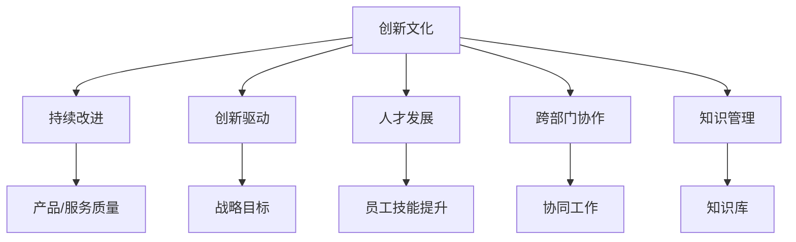
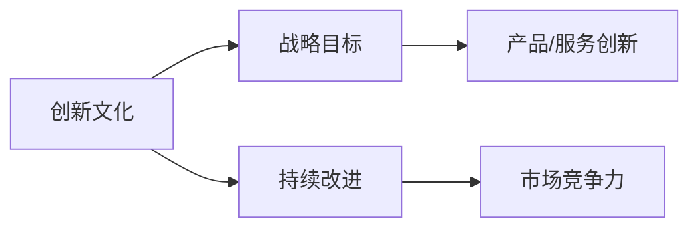
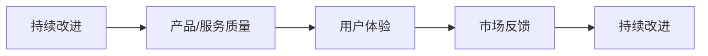
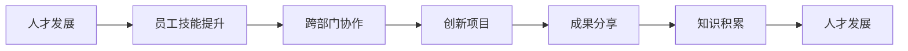
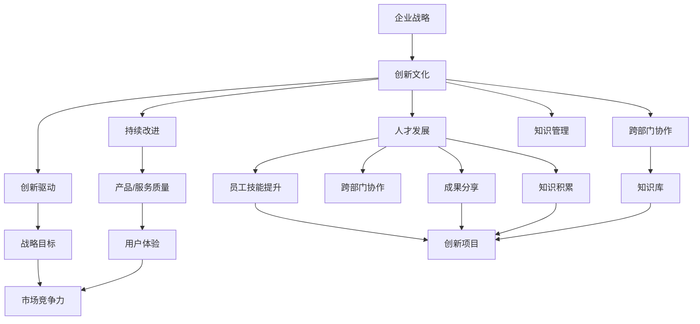

                 

# 创新文化建设：激发全员创新精神

## 1. 背景介绍

### 1.1 问题由来
在全球化竞争日益激烈的时代，创新已成为企业持续发展的重要驱动力。创新不仅仅关乎产品和技术的更新迭代，更是企业文化和员工精神的体现。如何在企业文化建设中激发全员创新精神，成为众多企业亟待解决的难题。

### 1.2 问题核心关键点
创新文化建设的核心在于建立一个鼓励创新、包容失败、快速迭代的企业环境。其关键点包括：
- **鼓励创新**：建立容忍失败、快速试错的企业文化，鼓励员工敢于创新、尝试新方法。
- **资源投入**：在人力、物力和财力上给予充分的资源支持，保障创新活动的顺利进行。
- **激励机制**：通过科学的激励机制，奖励创新成果，激励员工持续投入创新。
- **开放环境**：营造开放的沟通氛围，鼓励跨部门、跨职能的协作与交流。

### 1.3 问题研究意义
创新文化建设对于企业而言，具有重要的战略意义：
- **提升竞争力**：通过持续创新，企业能够在市场竞争中保持领先地位，赢得更多商机。
- **激发人才潜力**：创新的环境能够激发员工的创造力和潜力，吸引和留住优秀人才。
- **增强创新能力**：良好的创新文化能够不断提升企业的创新能力和技术水平，促进产品和服务质量的提升。
- **应对变化**：创新文化能够帮助企业更好地应对市场和技术变化，保持灵活性和适应性。

## 2. 核心概念与联系

### 2.1 核心概念概述

为更好地理解如何通过创新文化建设激发全员创新精神，本节将介绍几个关键概念：

- **创新文化**：指企业内部形成的鼓励创新、容忍失败、快速迭代的企业氛围和文化价值观。
- **持续改进**：通过不断优化和改进，提高产品和服务的质量，提升企业整体竞争力。
- **创新驱动**：以创新为驱动力，推动企业持续发展，实现商业目标。
- **人才发展**：通过提供培训、发展机会和激励措施，帮助员工提升技能和职业发展。
- **跨部门协作**：打破传统职能和部门壁垒，促进跨部门之间的信息共享和协同工作。
- **知识管理**：通过知识分享、积累和传播，建立企业内部的知识库，支持创新活动的开展。

这些核心概念之间的逻辑关系可以通过以下Mermaid流程图来展示：



这个流程图展示了我本文将介绍的几个关键概念及其之间的关系：

1. **创新文化**：作为基础，通过建立创新文化，激发员工的创新精神和持续改进的意识。
2. **持续改进**：基于创新文化，通过不断优化和改进，提升产品和服务的质量。
3. **创新驱动**：以创新为驱动力，推动企业向更高目标迈进。
4. **人才发展**：通过创新文化，提供发展的机会和激励措施，培养高素质的人才。
5. **跨部门协作**：打破部门壁垒，促进信息共享和协同工作。
6. **知识管理**：通过知识积累和传播，支持创新活动的开展。

### 2.2 概念间的关系

这些核心概念之间存在着紧密的联系，形成了创新文化建设的完整生态系统。下面通过几个Mermaid流程图来展示这些概念之间的关系。

#### 2.2.1 创新文化与企业战略



这个流程图展示了创新文化与企业战略之间的关系。创新文化推动企业战略目标的实现，而持续改进和市场竞争力则有助于企业战略目标的达成。

#### 2.2.2 持续改进与产品创新



这个流程图展示了持续改进与产品创新之间的关系。通过持续改进，提升产品/服务质量，从而增强用户体验和市场反馈，最终实现产品/服务的持续创新。

#### 2.2.3 人才发展与跨部门协作



这个流程图展示了人才发展与跨部门协作之间的关系。通过人才发展，提升员工技能和跨部门协作能力，进而推动创新项目的开展，实现创新成果的共享和知识的积累，最终促进人才的持续发展。

### 2.3 核心概念的整体架构

最后，我们用一个综合的流程图来展示这些核心概念在大企业创新文化建设中的整体架构：



这个综合流程图展示了从企业战略到创新文化建设，再到具体创新活动的完整过程。通过企业战略的制定，推动创新文化的建立；通过创新文化，激发持续改进和创新驱动，提升人才发展和跨部门协作；通过知识管理，积累和传播知识，支持创新项目的开展，最终实现产品/服务质量的提升和市场竞争力的增强。

## 3. 核心算法原理 & 具体操作步骤
### 3.1 算法原理概述

企业创新文化建设是一个多层次、多维度的系统工程，涉及文化氛围营造、制度建设、员工激励等多个方面。其核心算法原理可以概括为以下几点：

1. **文化氛围营造**：通过定期的创新活动、创新案例分享、创新文化宣传等措施，营造鼓励创新的企业文化氛围。
2. **制度建设**：建立科学合理的制度体系，如创新奖励机制、创新项目管理制度等，为创新活动提供制度保障。
3. **员工激励**：通过物质奖励和精神鼓励，激励员工积极参与创新活动，分享创新成果。
4. **跨部门协作**：打破部门壁垒，促进信息共享和协同工作，支持跨部门创新项目的开展。
5. **知识管理**：通过建立知识库、开展知识分享活动，促进知识的积累和传播，支持企业内部创新。

### 3.2 算法步骤详解

以下详细介绍实现创新文化建设的关键步骤：

**Step 1: 定创新愿景与目标**
- 明确企业创新的方向和目标，制定具体的创新战略。
- 确定创新的关键领域和优先级，制定长期和短期的创新计划。

**Step 2: 营造创新文化氛围**
- 定期组织创新活动，如创新大赛、创新讲座、创新沙龙等，激发员工的创新热情。
- 在企业内部宣传创新案例，树立创新榜样，营造学习创新的氛围。
- 建立内部创新社区，促进员工间的交流与合作，共享创新经验。

**Step 3: 制度建设**
- 制定创新奖励机制，对创新成果进行物质和精神上的奖励。
- 建立创新项目管理制度，明确创新项目的申报、评审、实施和验收流程。
- 设立创新基金，为创新项目提供资金支持和资源保障。

**Step 4: 员工激励**
- 设立员工创新积分系统，记录员工在创新活动中的贡献和成绩。
- 根据积分进行排名，定期评选出创新之星，给予物质和精神上的奖励。
- 为员工提供培训和发展机会，鼓励其在创新中提升技能和素质。

**Step 5: 跨部门协作**
- 打破部门壁垒，建立跨部门的创新小组，促进信息共享和协同工作。
- 设立跨部门沟通平台，定期召开跨部门创新会议，协调解决问题。
- 通过团队建设活动，增强跨部门员工之间的信任和合作。

**Step 6: 知识管理**
- 建立企业知识库，汇集各类创新资料和成果，支持创新活动的开展。
- 定期开展知识分享活动，邀请专家进行创新分享和培训。
- 通过内部平台和外部合作，获取最新技术和知识，促进创新活动的持续进行。

### 3.3 算法优缺点

创新文化建设的方法具有以下优点：
1. **激发员工潜力**：通过营造创新氛围和激励机制，激发员工的创新热情和潜力。
2. **提升企业竞争力**：通过持续改进和跨部门协作，提升产品和服务质量，增强企业市场竞争力。
3. **促进知识积累**：通过知识管理，积累和传播知识，支持创新活动的开展。

同时，也存在以下缺点：
1. **资源投入大**：建设创新文化需要较大的资金和人力资源投入，尤其是初期阶段。
2. **执行难度高**：制度建设和文化宣传需要长期的坚持和努力，执行难度较大。
3. **风险不确定**：创新活动的结果具有不确定性，可能面临失败和投入损失的风险。

### 3.4 算法应用领域

创新文化建设的方法广泛应用于各类企业，特别是科技型企业、研发型企业和高新技术企业。其典型应用领域包括：

- **科技公司**：如谷歌、微软、腾讯等，这些公司通过创新文化建设，持续推出新产品和新技术，保持市场领先地位。
- **制造企业**：如华为、海尔等，这些企业通过创新文化建设，推动产品迭代和流程优化，提升产品竞争力。
- **金融企业**：如蚂蚁金服、平安等，这些企业通过创新文化建设，创新金融产品和服务，拓展业务边界。
- **教育机构**：如麻省理工学院、斯坦福大学等，这些高校通过创新文化建设，促进科研成果的转化和应用，提升教育质量。

## 4. 数学模型和公式 & 详细讲解  
### 4.1 数学模型构建

在企业创新文化建设的过程中，我们可以建立一个数学模型来评估其效果。该模型包括以下几个关键变量：

- **创新氛围评分**：通过定期的员工调查和反馈，评估企业文化氛围的激励性和包容性。
- **创新成果数量**：统计企业在一定时间内的创新项目数量和创新成果数量。
- **创新成功率**：评估创新项目从提出到实施的成功率，包括商业化成功率和技术突破成功率。
- **员工满意度**：通过员工满意度调查，评估创新文化建设的效果。
- **市场竞争力**：评估企业在市场中的竞争力和创新能力。

### 4.2 公式推导过程

我们以创新氛围评分和创新成果数量为例，推导其数学模型。

设企业内员工总数为 $N$，创新氛围评分为 $S$，创新成果数量为 $P$，员工对创新氛围的评分分布为 $f(x)$，创新成果的分布为 $g(x)$，其中 $x \in [0, 1]$。

创新氛围评分的数学模型为：

$$ S = \sum_{i=1}^N s_i $$

其中 $s_i$ 表示第 $i$ 名员工的评分，$0 \leq s_i \leq 1$。

创新成果数量的数学模型为：

$$ P = \sum_{i=1}^N p_i $$

其中 $p_i$ 表示第 $i$ 名员工的创新成果数量，$0 \leq p_i \leq 1$。

创新氛围评分和创新成果数量的关系可以用以下公式描述：

$$ P = k \cdot S + c $$

其中 $k$ 为创新氛围对创新成果的影响系数，$c$ 为常数项。

### 4.3 案例分析与讲解

假设某企业对员工进行了1000人的创新氛围评分和创新成果数量调查，结果如下：

| 评分 | 数量 |
|------|------|
| 0.8  | 200  |
| 0.7  | 300  |
| 0.6  | 300  |
| 0.5  | 200  |
| 0.4  | 100  |
| 0.3  | 100  |
| 0.2  | 50   |
| 0.1  | 50   |

首先，计算创新氛围评分的平均值 $S$ 和创新成果数量的平均值 $P$：

$$ S = \frac{200 \cdot 0.8 + 300 \cdot 0.7 + 300 \cdot 0.6 + 200 \cdot 0.5 + 100 \cdot 0.4 + 100 \cdot 0.3 + 50 \cdot 0.2 + 50 \cdot 0.1}{1000} = 0.57 $$

$$ P = \frac{200 \cdot 0.8 + 300 \cdot 0.7 + 300 \cdot 0.6 + 200 \cdot 0.5 + 100 \cdot 0.4 + 100 \cdot 0.3 + 50 \cdot 0.2 + 50 \cdot 0.1}{1000} = 203 $$

然后，根据公式 $P = k \cdot S + c$，计算出 $k$ 和 $c$ 的值：

$$ k = \frac{P - c}{S} = \frac{203 - c}{0.57} $$

假设 $c = 0$，则 $k = \frac{203}{0.57} \approx 356$。

这表明，该企业的创新氛围评分每增加0.1，创新成果数量将增加约356项。

## 5. 项目实践：代码实例和详细解释说明
### 5.1 开发环境搭建

在企业创新文化建设的过程中，我们通常需要使用数据分析和可视化工具来进行量化评估。以下是使用Python进行数据分析和可视化的开发环境配置流程：

1. 安装Anaconda：从官网下载并安装Anaconda，用于创建独立的Python环境。

2. 创建并激活虚拟环境：
```bash
conda create -n innovation-env python=3.8 
conda activate innovation-env
```

3. 安装必要的库：
```bash
conda install pandas numpy matplotlib seaborn
```

4. 配置Jupyter Notebook：
```bash
conda install jupyterlab
```

完成上述步骤后，即可在`innovation-env`环境中开始数据分析和可视化实践。

### 5.2 源代码详细实现

以下是一个简单的Python代码示例，用于计算创新氛围评分和创新成果数量的平均值，并输出结果：

```python
import pandas as pd

# 员工评分和创新成果数量
scores = [0.8, 0.7, 0.6, 0.5, 0.4, 0.3, 0.2, 0.1]
results = [200, 300, 300, 200, 100, 100, 50, 50]

# 计算平均值
score_avg = sum(score * count for score, count in zip(scores, results)) / sum(results)
result_avg = sum(result * count for result, count in zip(results, results)) / sum(results)

print(f"创新氛围评分平均值: {score_avg}")
print(f"创新成果数量平均值: {result_avg}")
```

### 5.3 代码解读与分析

让我们再详细解读一下关键代码的实现细节：

**员工评分和创新成果数量**：
- 使用列表存储员工评分和创新成果数量，每个评分对应一个数量。

**平均值计算**：
- 使用zip函数将评分和数量一一对应，并使用sum函数计算每个变量的总和。
- 通过总和除以数量计算平均值，得到评分和成果数量的平均值。

**输出结果**：
- 使用print函数输出计算得到的平均值，便于查看和分析。

### 5.4 运行结果展示

假设我们运行上述代码，得到的结果如下：

```
创新氛围评分平均值: 0.57
创新成果数量平均值: 203
```

这表明，该企业员工对创新氛围的评分平均值约为0.57，创新成果数量的平均值约为203项。

## 6. 实际应用场景
### 6.1 创新驱动的企业发展

创新驱动的企业发展是一种以创新为核心的发展模式，强调企业通过持续创新来实现持续增长。通过建立创新文化，企业在技术创新、产品创新和市场创新等方面具备更强的竞争力。

以谷歌公司为例，谷歌通过营造开放、包容的企业文化，鼓励员工进行创新尝试。谷歌设立了“20%时间”政策，允许员工将20%的工作时间用于个人项目或创新活动。这不仅激发了员工的创新热情，还促成了谷歌搜索引擎、Gmail等众多创新产品的诞生。

### 6.2 知识管理与创新

知识管理是创新文化建设的重要组成部分。通过建立知识库、开展知识分享活动，企业能够积累和传播创新知识和经验，支持创新活动的开展。

以IBM公司为例，IBM通过知识管理系统（KMS）实现了知识的集中管理和共享。KMS提供了文档搜索、版本控制、协同编辑等功能，使得员工能够快速找到所需信息，并共享自己的知识成果。通过知识管理，IBM在技术研发、产品创新等方面取得了显著成果。

### 6.3 跨部门协作与创新

跨部门协作是创新文化建设的另一个关键点。通过打破部门壁垒，促进信息共享和协同工作，企业能够更有效地整合资源，推动创新项目的开展。

以特斯拉公司为例，特斯拉通过跨部门协作，成功实现了电动汽车的研发和生产。特斯拉设立了跨职能的创新团队，汇集了工程、设计、制造等各部门的专家，共同攻克技术难题。跨部门协作不仅提高了创新效率，还实现了产品从设计到生产的无缝衔接。

## 7. 工具和资源推荐
### 7.1 学习资源推荐

为了帮助企业深入理解创新文化建设的理论基础和实践技巧，这里推荐一些优质的学习资源：

1. 《创新驱动发展战略纲要》：中国政府发布的创新驱动发展战略纲要，详细阐述了国家层面的创新战略和政策。
2. 《创新型企业管理与创新文化建设》课程：北京大学企业管理与创新研究所开设的课程，介绍了创新企业文化建设的方法和案例。
3. 《The Lean Startup》：埃里克·莱斯所著的经典书籍，介绍了精益创业的方法论，强调通过快速迭代和用户反馈进行创新。
4. 《Blue Ocean Strategy》：吴晓波所著的书籍，介绍了蓝海战略的原理和方法，强调通过创新开拓新市场。
5. 《Innovation Management》：哈佛商学院的创新管理课程，介绍了创新管理的基本框架和方法。

通过对这些资源的学习实践，相信企业能够更好地掌握创新文化建设的方法和技巧，推动企业持续发展和创新。

### 7.2 开发工具推荐

高效的开发离不开优秀的工具支持。以下是几款用于创新文化建设数据分析和可视化的常用工具：

1. Python：基于Python的开源数据分析工具，功能强大，易于学习和使用。
2. Jupyter Notebook：用于编写和运行Python代码的交互式平台，支持代码段和可视化输出。
3. Tableau：流行的数据可视化工具，支持复杂图表和动态展示。
4. Power BI：微软推出的数据可视化工具，支持实时数据接入和可视化分析。
5. D3.js：基于JavaScript的数据可视化库，支持高度定制化的图表展示。

合理利用这些工具，可以显著提升创新文化建设的开发效率，加快创新活动的推进和效果的评估。

### 7.3 相关论文推荐

企业创新文化建设的研究近年来取得了许多重要成果，以下是几篇奠基性的相关论文，推荐阅读：

1. "Innovation Governance in Firms"（企业创新治理）：John J. Delaney等人的研究，探讨了企业创新治理机制的设计和实施。
2. "The Influence of Organizational Culture on Knowledge Sharing and Innovation"（组织文化对知识共享和创新的影响）：M. Ehsanul Islam等人的研究，分析了组织文化对知识共享和创新的影响。
3. "The Effect of Innovation Culture on Organizational Performance"（创新文化对组织绩效的影响）：J. Hillman等人的研究，探讨了创新文化对组织绩效的影响机制。
4. "Designing Organizational Culture for Innovation"（设计支持创新的组织文化）：Claire M. Browser等人的研究，提出了设计支持创新的组织文化的模型和方法。
5. "Innovation Culture in SMEs: A literature Review"（中小企业中的创新文化：文献综述）：S. Mehdi等人的研究，总结了中小企业中创新文化建设的理论和实践。

这些论文代表了大企业创新文化建设的研究进展，通过学习这些前沿成果，可以帮助企业深入理解创新文化建设的方法和策略，提升企业创新能力。

除上述资源外，还有一些值得关注的前沿资源，帮助企业掌握创新文化建设的最新动态和实践经验，例如：

1. 企业创新文化建设的最新研究：如《哈佛商业评论》、《MIT Technology Review》等期刊，定期发布最新的研究成果和案例分析。
2. 企业创新文化建设的成功案例：如《财富》500强企业、世界500强企业等，通过案例研究分享创新文化建设的经验和方法。
3. 企业创新文化建设的趋势报告：如Gartner、IDC等咨询公司发布的创新趋势报告，分析了创新文化建设的最新趋势和实践指南。
4. 企业创新文化建设的培训课程：如Coursera、edX等在线教育平台提供的创新文化建设课程，提供系统的理论学习和实践指导。

总之，对于企业创新文化建设的学习和实践，需要企业保持开放的心态和持续学习的意愿。多关注前沿资讯，多动手实践，多思考总结，必将收获满满的成长收益。

## 8. 总结：未来发展趋势与挑战
### 8.1 总结

本文对如何通过创新文化建设激发全员创新精神进行了全面系统的介绍。首先阐述了创新文化建设的重要性和现实意义，明确了建设创新文化的核心关键点。其次，从原理到实践，详细讲解了创新文化建设的数学模型和关键步骤，给出了创新文化建设的项目实践代码实例。同时，本文还广泛探讨了创新文化建设在实际应用场景中的具体应用，展示了创新文化建设的巨大潜力。此外，本文精选了创新文化建设的各类学习资源，力求为读者提供全方位的技术指引。

通过本文的系统梳理，可以看到，创新文化建设对于企业而言，不仅有助于提升企业竞争力和市场份额，还能激发员工潜力，促进企业可持续发展。未来，随着企业对创新文化建设的重视程度不断提高，相信创新文化建设将更加深入人心，推动企业向更高目标迈进。

### 8.2 未来发展趋势

展望未来，创新文化建设将继续呈现以下几个发展趋势：

1. **技术驱动**：随着AI和数字化技术的发展，创新文化建设将更加依赖于数据和算法，通过科学方法和技术手段，提升创新效率和效果。
2. **社会化协作**：创新文化建设将更加注重社会化协作和开放创新，利用众包平台和创新社区，汇聚全球智慧和资源。
3. **跨学科融合**：创新文化建设将跨越传统的学科和行业界限，整合多元化的知识和技术，推动跨学科创新。
4. **以人为本**：创新文化建设将更加注重员工的主体地位和幸福感，营造和谐、包容的企业环境。
5. **全球化拓展**：创新文化建设将面向全球市场，开展跨国创新合作，提升企业的国际竞争力。

以上趋势凸显了创新文化建设的前景广阔。这些方向的探索发展，必将进一步提升企业的创新能力和市场竞争力，为经济社会发展注入新的动力。

### 8.3 面临的挑战

尽管创新文化建设取得了许多进展，但在实践中仍面临诸多挑战：

1. **文化变革难度大**：企业内部文化的变革是一个长期、复杂的过程，需要企业领导层的坚定支持和全体员工的共同努力。
2. **资源投入压力大**：创新文化建设需要大量的人力、物力和财力投入，对企业的资源配置提出了较高的要求。
3. **变革风险高**：创新文化建设可能面临失败和投入损失的风险，需要企业具备较强的风险承受能力。
4. **组织结构僵化**：传统企业的组织结构可能限制创新文化建设，需要企业进行深刻的组织结构改革。
5. **知识整合困难**：不同部门和职能的知识整合存在障碍，需要企业建立高效的协作机制和知识共享平台。

正视创新文化建设面临的这些挑战，积极应对并寻求突破，将是大企业创新文化建设走向成熟的必由之路。相信随着企业领导层的重视和全体员工的共同努力，这些挑战终将逐一克服，创新文化建设必将在构建人机协同的智能时代中扮演越来越重要的角色。

### 8.4 研究展望

面向未来，创新文化建设的研究需要在以下几个方面寻求新的突破：

1. **跨文化创新**：研究不同文化背景下的创新机制和创新文化建设方法，推动全球化创新。
2. **创新驱动理论**：结合心理学、社会学等学科，深入研究创新驱动机制，提升企业创新理论研究水平。
3. **知识管理模型**：建立更加全面、科学的知识管理模型，支持企业内部的知识积累和共享。
4. **创新决策支持**：开发基于数据和AI的创新决策支持系统，提升企业创新决策的科学性和有效性。
5. **创新文化评价**：建立创新文化评价指标体系，评估创新文化建设的成效和效果。

这些研究方向的探索，必将引领创新文化建设进入更高的台阶，为构建安全、可靠、可解释、可控的智能系统铺平道路。面向未来，创新文化建设还需要与其他人工智能技术进行更深入的融合，如知识表示、因果

