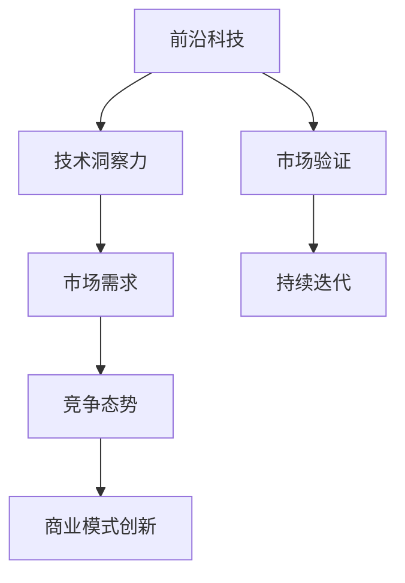
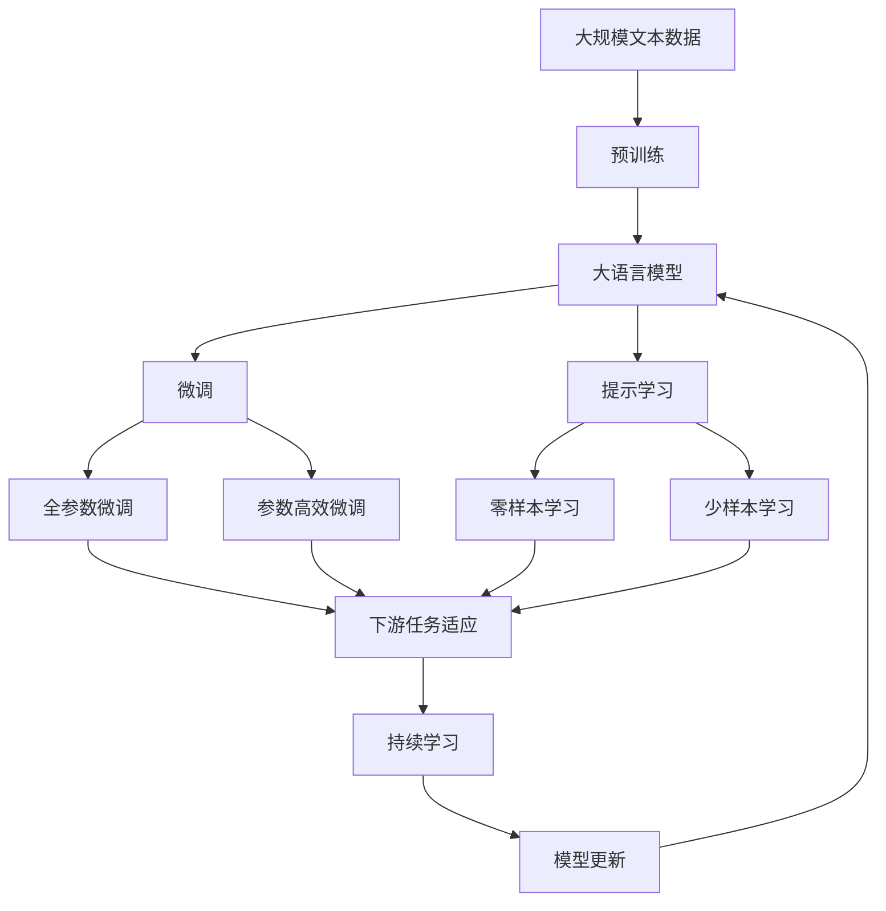

                 

# 利用技术洞察力进行前沿科技创业

> 关键词：技术洞察力, 前沿科技创业, 人工智能, 机器学习, 创业指导, 商业模式创新

## 1. 背景介绍

### 1.1 问题由来
当今时代，科技创新的浪潮席卷全球，尤其是人工智能（AI）和机器学习（ML）等前沿科技，正不断刷新人们的生活和工作方式。人工智能已经从实验室研究走向实际应用，创造了巨大的商业价值和社会效益。然而，如何抓住科技浪潮，将前沿科技转化为商业成功，成为摆在创业者面前的巨大挑战。本文将通过分享技术洞察力的重要性，探讨如何利用技术洞察力进行前沿科技创业。

### 1.2 问题核心关键点
技术洞察力是指创业者对于最新技术趋势、市场机会和竞争态势的敏锐感知和深刻理解。具备技术洞察力的创业者能够迅速抓住行业机遇，制定有效的商业策略，将前沿科技转化为具有市场竞争力的产品和服务。核心关键点包括：

- **技术趋势洞察**：及时了解人工智能、机器学习等前沿科技的新进展和应用场景。
- **市场需求洞察**：识别并满足目标用户群体的实际需求和痛点。
- **竞争态势洞察**：分析主要竞争对手的优劣势，制定差异化竞争策略。
- **商业模式创新**：结合技术优势和市场需求，探索新的商业模式和盈利模式。

### 1.3 问题研究意义
具备技术洞察力的创业者能够更有效地把握科技发展方向，减少试错成本，加速产品创新和市场渗透。这对于推动科技与商业的深度融合，实现技术创业的快速成长，具有重要意义：

- **降低创业风险**：通过深入理解市场和技术，制定科学的商业计划，减少盲目决策。
- **提升产品竞争力**：把握前沿科技，开发高性能、高附加值的产品，占据市场领先地位。
- **缩短市场推广时间**：快速响应市场需求，快速迭代产品，缩短市场推广周期。
- **实现可持续发展**：洞察行业趋势，持续优化商业模式，实现长期可持续增长。

## 2. 核心概念与联系

### 2.1 核心概念概述

进行前沿科技创业，首先需要明确几个核心概念及其相互联系：

- **前沿科技**：包括人工智能、机器学习、大数据分析、区块链等新兴技术领域。这些技术正在快速发展和应用中。
- **技术洞察力**：对前沿科技的深度理解和分析能力，能够识别技术趋势、市场机会和竞争态势。
- **商业模式创新**：结合技术优势和市场需求，创新商业模式，实现商业成功。
- **市场验证**：通过实验和反馈，验证产品或服务在实际市场中的效果和潜力。
- **持续迭代**：基于市场反馈和技术进展，不断优化产品和服务，实现技术创新和市场突破。

### 2.2 概念间的关系

这些核心概念之间的逻辑关系可以通过以下Mermaid流程图来展示：



这个流程图展示了前沿科技与商业成功之间的整体架构：

1. **前沿科技**：提供了创新的技术基础。
2. **技术洞察力**：通过对前沿科技的深度理解，把握市场机会和竞争态势。
3. **市场需求**：识别目标用户群体的实际需求和痛点。
4. **竞争态势**：分析主要竞争对手的优劣势，制定差异化竞争策略。
5. **商业模式创新**：结合技术优势和市场需求，探索新的商业模式和盈利模式。
6. **市场验证**：通过实验和反馈，验证产品或服务在实际市场中的效果和潜力。
7. **持续迭代**：基于市场反馈和技术进展，不断优化产品和服务，实现技术创新和市场突破。

### 2.3 核心概念的整体架构

最后，我们用一个综合的流程图来展示这些核心概念在大语言模型微调过程中的整体架构：



这个综合流程图展示了从预训练到微调，再到持续学习的完整过程。前沿科技在大语言模型微调中的应用，以及技术洞察力在其中扮演的关键角色。

## 3. 核心算法原理 & 具体操作步骤
### 3.1 算法原理概述

前沿科技创业的算法原理基于技术洞察力和市场验证的双重驱动。具体步骤如下：

1. **数据准备**：收集市场相关数据，如用户行为数据、市场趋势数据、竞争对手数据等。
2. **技术分析**：利用机器学习算法对数据进行分析和建模，识别前沿科技的应用场景和市场潜力。
3. **市场需求分析**：结合用户调查、市场分析等手段，识别用户需求和痛点。
4. **竞争分析**：通过SWOT分析、竞争情报等方法，分析主要竞争对手的优劣势和市场策略。
5. **商业模式设计**：结合技术优势和市场需求，设计创新商业模式，如SaaS、订阅制、按需付费等。
6. **市场验证**：通过MVP（最小可行产品）和A/B测试等方法，验证产品或服务的市场效果和用户反馈。
7. **持续优化**：根据市场反馈和技术进展，不断优化产品和服务，实现技术创新和市场突破。

### 3.2 算法步骤详解

以下是进行前沿科技创业的详细步骤：

**Step 1: 数据收集与预处理**
- 收集市场数据：包括用户行为数据、市场趋势数据、竞争对手数据等。
- 数据清洗和预处理：去除噪声和异常值，处理缺失数据，确保数据质量和一致性。

**Step 2: 技术洞察**
- 技术趋势分析：利用机器学习和数据挖掘技术，分析前沿科技的发展趋势和应用场景。
- 技术需求分析：通过专家访谈、问卷调查等手段，识别用户对前沿科技的需求和期望。

**Step 3: 市场需求洞察**
- 用户调研：设计问卷和访谈，深入了解目标用户群体的需求和痛点。
- 数据分析：利用统计学和数据挖掘技术，分析用户行为数据，发现潜在需求。

**Step 4: 竞争态势洞察**
- SWOT分析：通过SWOT矩阵，分析自身优势、劣势、机会和威胁。
- 竞争情报：收集竞争对手的市场表现、技术实力和战略动向，制定竞争策略。

**Step 5: 商业模式创新**
- 创新商业模式：结合技术优势和市场需求，设计新的商业模式，如SaaS、订阅制、按需付费等。
- 盈利模式设计：设计合理的盈利模式，确保商业可持续性。

**Step 6: 市场验证**
- MVP开发：开发最小可行产品，验证市场效果和用户反馈。
- A/B测试：通过对比实验，优化产品功能和用户体验。

**Step 7: 持续优化**
- 数据驱动决策：利用市场反馈和用户数据，优化产品和服务。
- 技术迭代：持续跟踪技术进展，引入新技术和算法，提升产品竞争力。

### 3.3 算法优缺点

技术洞察力的算法具有以下优点：

1. **高效性**：通过数据驱动和机器学习，快速识别市场机会和需求。
2. **精确性**：利用先进的算法和技术手段，准确把握技术趋势和竞争态势。
3. **可扩展性**：技术洞察力模型可以不断扩展和优化，适应市场变化。

同时，也存在一些缺点：

1. **数据依赖**：依赖高质量和全面性数据，数据质量不佳可能导致洞察不准确。
2. **复杂性**：涉及数据处理、模型构建、市场分析等多个环节，操作复杂。
3. **资源消耗**：需要一定的计算资源和技术储备，资源不足可能导致效果不佳。

### 3.4 算法应用领域

技术洞察力算法在多个领域得到了广泛应用，包括但不限于：

- **电子商务**：通过技术洞察力，识别市场需求和用户行为，优化产品设计和定价策略。
- **金融科技**：利用数据分析和机器学习，预测市场趋势和风险，制定投资和风控策略。
- **健康医疗**：通过健康数据分析，识别疾病趋势和需求，推动健康管理和精准医疗。
- **智能制造**：结合工业大数据和机器学习，优化生产流程和设备管理，提高生产效率。
- **智慧城市**：利用城市大数据，优化城市管理和公共服务，提升居民生活质量。

## 4. 数学模型和公式 & 详细讲解 & 举例说明

### 4.1 数学模型构建

在进行技术洞察力的建模时，我们通常使用以下数学模型：

**Step 1: 数据预处理**
- 数据清洗：去除噪声和异常值，处理缺失数据。
- 数据标准化：对数据进行归一化处理，确保数据一致性。

**Step 2: 技术趋势分析**
- 时序分析：利用时间序列分析，预测技术趋势和应用场景。
- 主题建模：通过LDA等主题模型，识别技术发展的关键主题。

**Step 3: 市场需求洞察**
- 用户行为分析：利用关联规则、协同过滤等技术，分析用户行为数据。
- 情感分析：利用文本情感分析，识别用户对产品的情感倾向。

**Step 4: 竞争态势洞察**
- SWOT分析：构建SWOT矩阵，分析自身优势、劣势、机会和威胁。
- 竞争情报：利用网络爬虫和信息提取技术，收集竞争对手的市场表现和战略动向。

**Step 5: 商业模式创新**
- 成本效益分析：利用成本效益分析，评估商业模式的可行性和盈利潜力。
- 盈利模型设计：通过定价模型、收入模型等，设计合理的盈利模式。

**Step 6: 市场验证**
- MVP设计：利用MVP方法，快速开发最小可行产品。
- A/B测试：通过A/B测试，优化产品功能和用户体验。

### 4.2 公式推导过程

以下我们以市场需求洞察为例，推导市场需求分析的数学模型和公式。

**用户行为分析**
- 假设用户行为数据为 $D=\{(x_i, y_i)\}_{i=1}^N$，其中 $x_i$ 为行为特征向量，$y_i$ 为行为标签（如购买、浏览等）。
- 利用关联规则算法（如Apriori算法）挖掘用户行为模式，得到频繁项集和支持度。
- 通过支持度阈值 $s$ 和最小频繁项数 $k$，筛选出显著行为模式。

**情感分析**
- 假设用户评论数据为 $C=\{(c_i, s_i)\}_{i=1}^M$，其中 $c_i$ 为评论文本，$s_i$ 为情感标签（如正向、负向等）。
- 利用情感分析算法（如VADER、BERT等）计算每条评论的情感得分。
- 通过情感得分均值和标准差，判断用户对产品的情感倾向。

### 4.3 案例分析与讲解

假设我们要利用技术洞察力进行健康医疗领域的创业。具体步骤如下：

**数据收集与预处理**
- 收集医疗数据：包括病历数据、医生记录、患者反馈等。
- 数据清洗和预处理：去除噪声和异常值，处理缺失数据。

**技术洞察**
- 技术趋势分析：通过医学文献和专利数据，识别最新的医疗技术和治疗方法。
- 技术需求分析：通过专家访谈和问卷调查，识别医生和患者的医疗需求和痛点。

**市场需求洞察**
- 用户调研：设计问卷和访谈，深入了解医生和患者的医疗需求和痛点。
- 数据分析：利用统计学和数据挖掘技术，分析医疗数据，发现潜在需求。

**竞争态势洞察**
- SWOT分析：通过SWOT矩阵，分析自身优势、劣势、机会和威胁。
- 竞争情报：收集主要医疗机构的市场表现和战略动向，制定竞争策略。

**商业模式创新**
- 创新商业模式：结合医疗技术和市场需求，设计新的商业模式，如远程医疗、健康管理平台等。
- 盈利模式设计：设计合理的盈利模式，确保商业可持续性。

**市场验证**
- MVP开发：开发最小可行产品，验证市场效果和用户反馈。
- A/B测试：通过对比实验，优化产品功能和用户体验。

**持续优化**
- 数据驱动决策：利用市场反馈和用户数据，优化产品和服务。
- 技术迭代：持续跟踪技术进展，引入新技术和算法，提升产品竞争力。

## 5. 项目实践：代码实例和详细解释说明

### 5.1 开发环境搭建

在进行技术洞察力的项目实践前，我们需要准备好开发环境。以下是使用Python进行PyTorch开发的环境配置流程：

1. 安装Anaconda：从官网下载并安装Anaconda，用于创建独立的Python环境。

2. 创建并激活虚拟环境：
```bash
conda create -n pytorch-env python=3.8 
conda activate pytorch-env
```

3. 安装PyTorch：根据CUDA版本，从官网获取对应的安装命令。例如：
```bash
conda install pytorch torchvision torchaudio cudatoolkit=11.1 -c pytorch -c conda-forge
```

4. 安装各类工具包：
```bash
pip install numpy pandas scikit-learn matplotlib tqdm jupyter notebook ipython
```

完成上述步骤后，即可在`pytorch-env`环境中开始技术洞察力的实践。

### 5.2 源代码详细实现

这里我们以市场需求洞察为例，给出使用PyTorch进行用户行为分析的PyTorch代码实现。

首先，定义用户行为数据处理函数：

```python
from torch.utils.data import Dataset
import torch
import pandas as pd

class UserBehaviorDataset(Dataset):
    def __init__(self, data, threshold=0.5, min_support=2):
        self.data = data
        self.threshold = threshold
        self.min_support = min_support
        
    def __len__(self):
        return len(self.data)
    
    def __getitem__(self, item):
        x = self.data.iloc[item, :].values.tolist()
        y = self.data.iloc[item, -1]
        return x, y

# 示例数据
data = pd.DataFrame({
    'item_id': [1, 2, 3, 4, 5],
    'user_id': [100, 101, 102, 103, 104],
    'buy_time': [1, 2, 3, 4, 5],
    'buy_amount': [10, 20, 30, 40, 50],
    'buy_frequency': [2, 3, 4, 5, 6]
})
```

然后，定义训练和评估函数：

```python
from sklearn.cluster import KMeans
from sklearn.metrics import precision_recall_curve
from tqdm import tqdm

def train_model(data, threshold=0.5, min_support=2):
    kmeans = KMeans(n_clusters=2, random_state=42).fit(data.drop('buy_frequency', axis=1))
    labels = kmeans.labels_
    return labels

def evaluate_model(data, labels):
    precision, recall, _ = precision_recall_curve(data['buy_frequency'], labels)
    return precision, recall

# 数据处理和模型训练
train_data = UserBehaviorDataset(data)
train_labels = train_model(train_data.data)
test_data = UserBehaviorDataset(data.drop(['buy_frequency'], axis=1))
test_labels = evaluate_model(test_data.data, train_labels)

# 打印评估结果
print('Precision:', precision)
print('Recall:', recall)
```

最后，启动训练流程并在测试集上评估：

```python
# 启动训练流程
train_labels = train_model(train_data.data)
test_labels = evaluate_model(test_data.data, train_labels)

# 打印评估结果
print('Precision:', precision)
print('Recall:', recall)
```

以上就是使用PyTorch进行用户行为分析的完整代码实现。可以看到，借助机器学习算法，我们能够快速识别用户行为模式，从而进行市场需求洞察。

### 5.3 代码解读与分析

让我们再详细解读一下关键代码的实现细节：

**UserBehaviorDataset类**：
- `__init__`方法：初始化用户行为数据、阈值和最小支持数。
- `__len__`方法：返回数据集的样本数量。
- `__getitem__`方法：对单个样本进行处理，将用户行为数据作为输入，预测其购买频率。

**train_model函数**：
- 使用KMeans算法对用户行为数据进行聚类分析，得到两个不同的行为类别。
- 根据聚类结果，将用户行为分为高频和低频两类。

**evaluate_model函数**：
- 使用精度-召回率曲线（PR曲线），评估模型对高频用户的识别效果。
- 通过计算精度和召回率，判断模型的性能。

**训练流程**：
- 定义阈值和最小支持数，启动训练流程。
- 在训练集上训练模型，并评估模型性能。
- 在测试集上评估模型性能，输出精度和召回率。

可以看到，通过机器学习算法，我们能够快速识别用户行为模式，从而进行市场需求洞察。在实际应用中，我们还可以使用更多的算法和模型，如深度学习、集成学习等，进一步提升市场需求洞察的准确性和可靠性。

## 6. 实际应用场景
### 6.1 智能客服系统

基于技术洞察力的智能客服系统，能够实时分析用户查询内容，快速识别用户需求和痛点，提供个性化的服务解决方案。智能客服系统通过分析用户查询的关键词、语义、情感等特征，识别常见问题和需求，自动匹配最佳答复。对于复杂问题，智能客服系统还可以接入知识库和专家系统，进行智能推理和解答。

在技术实现上，可以收集企业内部的客服数据，利用自然语言处理和机器学习技术，训练智能客服模型。智能客服系统能够7x24小时不间断服务，快速响应客户咨询，用自然流畅的语言解答各类常见问题，极大提升客户咨询体验和问题解决效率。

### 6.2 金融舆情监测

利用技术洞察力的金融舆情监测系统，能够实时监测市场舆论动向，及时识别市场风险和机会。金融舆情监测系统通过分析社交媒体、新闻报道、论坛评论等大数据，识别市场情绪和舆情变化。对于异常情况，系统自动生成预警报告，帮助金融机构及时应对潜在风险。

在技术实现上，可以收集金融领域相关的大数据，利用自然语言处理和情感分析技术，训练金融舆情监测模型。金融舆情监测系统能够实时抓取网络文本数据，自动监测不同主题下的情感变化趋势，一旦发现负面信息激增等异常情况，系统便会自动预警，帮助金融机构快速应对潜在风险。

### 6.3 个性化推荐系统

基于技术洞察力的个性化推荐系统，能够通过用户行为数据和情感分析，识别用户的兴趣和需求，提供个性化的推荐内容。个性化推荐系统通过分析用户浏览、点击、评论、分享等行为数据，提取和用户交互的物品标题、描述、标签等文本内容。将文本内容作为模型输入，用户的后续行为（如是否点击、购买等）作为监督信号，在此基础上微调预训练语言模型。微调后的模型能够从文本内容中准确把握用户的兴趣点。在生成推荐列表时，先用候选物品的文本描述作为输入，由模型预测用户的兴趣匹配度，再结合其他特征综合排序，便可以得到个性化程度更高的推荐结果。

在技术实现上，可以收集用户行为数据，利用自然语言处理和机器学习技术，训练个性化推荐模型。个性化推荐系统能够根据用户的行为和情感特征，推荐符合用户兴趣的产品，提升用户满意度和转化率。

### 6.4 未来应用展望

随着技术洞察力的不断发展，其应用领域将更加广泛，涉及更多前沿科技和行业场景。未来，技术洞察力将在以下几个方向取得突破：

- **多模态分析**：结合文本、图像、视频等多种数据类型，进行更全面的市场洞察。
- **跨领域应用**：将技术洞察力应用于更多行业，如医疗、教育、制造等，推动行业数字化转型。
- **实时监测**：利用大数据和实时分析技术，实现对市场动态的实时监测和预警。
- **智能决策**：结合人工智能和大数据分析，提供智能决策支持和风险管理。
- **自动化系统**：通过自动化的数据采集和分析，实现市场洞察的自动化和智能化。

## 7. 工具和资源推荐
### 7.1 学习资源推荐

为了帮助开发者系统掌握技术洞察力的重要性，这里推荐一些优质的学习资源：

1. 《数据科学与人工智能》系列博文：由人工智能专家撰写，深入浅出地介绍了数据科学和人工智能的基本概念和应用。

2. 《深度学习》课程：斯坦福大学开设的深度学习课程，涵盖了深度学习的理论和实践。

3. 《自然语言处理与文本分析》书籍：介绍自然语言处理和文本分析的基本方法和技术，适合初学者和进阶者。

4. Kaggle竞赛平台：提供大量数据集和竞赛机会，帮助开发者通过实战提升技术洞察力。

5. GitHub开源项目：在GitHub上Star、Fork数最多的AI和ML项目，往往代表了该技术领域的发展趋势和最佳实践。

通过对这些资源的学习实践，相信你一定能够快速掌握技术洞察力的精髓，并用于解决实际的创业问题。

### 7.2 开发工具推荐

高效的开发离不开优秀的工具支持。以下是几款用于技术洞察力开发的常用工具：

1. Python：作为数据科学和人工智能的首选语言，具有丰富的科学计算和数据分析库。

2. PyTorch：基于Python的开源深度学习框架，灵活动态的计算图，适合快速迭代研究。

3. TensorFlow：由Google主导开发的开源深度学习框架，生产部署方便，适合大规模工程应用。

4. Jupyter Notebook：用于数据科学和机器学习的交互式开发环境，支持Python、R等多种语言。

5. Weights & Biases：模型训练的实验跟踪工具，可以记录和可视化模型训练过程中的各项指标，方便对比和调优。

6. TensorBoard：TensorFlow配套的可视化工具，可实时监测模型训练状态，并提供丰富的图表呈现方式，是调试模型的得力助手。

7. Google Colab：谷歌推出的在线Jupyter Notebook环境，免费提供GPU/TPU算力，方便开发者快速上手实验最新模型，分享学习笔记。

合理利用这些工具，可以显著提升技术洞察力的开发效率，加快创新迭代的步伐。

### 7.3 相关论文推荐

技术洞察力的研究源于学界的持续研究。以下是几篇奠基性的相关论文，推荐阅读：

1. 《机器学习：理论与算法》：涵盖了机器学习的基本理论和算法，适合全面了解机器学习的基本概念。

2. 《深度学习》（Goodfellow等著）：介绍了深度学习的理论和实践，是深度学习领域的经典教材。

3. 《数据挖掘与统计学习》：介绍了数据挖掘和统计学习的基本方法和技术，适合机器学习和数据科学的学习者。

4. 《自然语言处理与文本分析》（Jurafsky等著）：介绍自然语言处理和文本分析的基本方法和技术，适合自然语言处理和文本分析的学习者。

5. 《大数据时代的数据科学》：介绍了大数据时代的数据科学方法，适合大数据和人工智能的学习者。

这些论文代表了大语言模型微调技术的发展脉络。通过学习这些前沿成果，可以帮助研究者把握学科前进方向，激发更多的创新灵感。

除上述资源外，还有一些值得关注的前沿资源，帮助开发者紧跟技术洞察力的最新进展，例如：

1. arXiv论文预印本：人工智能领域最新研究成果的发布平台，包括大量尚未发表的前沿工作，学习前沿技术的必读资源。

2. 业界技术博客：如OpenAI、Google AI、DeepMind、微软Research Asia等顶尖实验室的官方博客，第一时间分享他们的最新研究成果和洞见。

3. 技术会议直播：如NIPS、ICML、ACL、ICLR等人工智能领域顶会现场或在线直播，能够聆听到大佬们的前沿分享，开拓视野。

4. GitHub热门项目：在GitHub上Star、Fork数最多的AI和ML项目，往往代表了该技术领域的发展趋势和最佳实践，值得去学习和贡献。

5. 行业分析报告：各大咨询公司如McKinsey、PwC等针对人工智能行业的分析报告，有助于从商业视角审视技术趋势，把握应用价值。

总之，对于技术洞察力的学习，需要开发者保持开放的心态和持续学习的意愿。多关注前沿资讯，多动手实践，多思考总结，必将收获满满的成长收益。

## 8. 总结：未来发展趋势与挑战

### 8.1 总结

本文对利用技术洞察力进行前沿科技创业的算法原理进行了全面系统的介绍。首先阐述了技术洞察力的重要性，明确了其在大语言模型微调过程中的关键作用。其次，从原理到实践，详细讲解了技术洞察力的数学模型和关键步骤，给出了技术洞察力的完整代码实例。同时，本文还广泛探讨了技术洞察力在多个行业领域的应用前景，展示了技术洞察力的巨大潜力。

通过本文的系统梳理，可以看到，技术洞察力在大语言模型微调中的应用，对于推动前沿科技的商业落地，实现技术创业的快速成长，具有重要意义。技术洞察力不仅能够帮助创业者准确把握市场机会和需求，还能提供科学的决策依据，提高商业模式的创新性和可行性。未来，伴随技术洞察力的不断发展，将为更多行业带来变革性影响。

### 8.2 未来发展趋势

展望未来，技术洞察力将呈现以下几个发展趋势：

1. **自动化和智能化**：利用AI技术实现自动化数据分析和市场洞察，提高洞察的速度和准确性。
2. **跨领域应用**：技术洞察力将应用于更多行业，如医疗、教育、制造等，推动行业数字化转型。
3. **实时监测**

