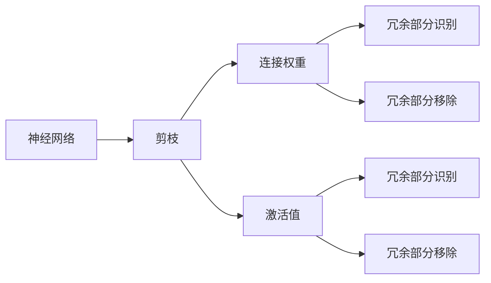

                 

## 1. 背景介绍

随着深度学习技术的广泛应用，神经网络（Neural Networks）已经成为解决复杂问题的核心工具。然而，庞大的模型参数和大量的计算资源消耗成为了其在大规模应用中的瓶颈。因此，如何在保证模型精度的前提下，尽可能减少模型的参数和计算资源需求，是神经网络优化中的重要课题。剪枝技术（Pruning），作为神经网络压缩的重要手段之一，通过识别和移除网络中的冗余部分，使得模型更加精简和高效，能够在资源受限的环境中发挥更好的性能。

### 1.1 问题由来

在深度学习的早期阶段，神经网络的模型规模较小，训练数据集也较为简单，因此剪枝技术并没有得到足够的重视。但随着计算机硬件的不断升级和数据量的急剧增长，现代深度学习模型常常包含数亿乃至数十亿个参数，使得训练和推理过程变得异常复杂和耗时。尤其是在移动设备和嵌入式设备等资源受限的平台上，如何高效地运行深度学习模型成为亟待解决的问题。

此外，过大的模型不仅增加了计算资源和存储成本，也增加了模型部署和维护的复杂度。过拟合问题也由于模型复杂度增加而变得更加严重。因此，通过剪枝技术，减少模型冗余，提升模型的泛化能力，成为了优化深度学习模型不可或缺的手段。

### 1.2 问题核心关键点

剪枝技术主要解决的问题是如何识别和移除神经网络中的冗余部分，以减小模型规模，提高模型性能。其核心关键点包括：

1. **冗余部分识别**：需要有效地识别出网络中对任务贡献较小的部分，通常是连接权重较小或激活值较小的神经元。
2. **冗余部分移除**：在识别出冗余部分后，需要安全、有效地将其从网络中移除，确保模型性能不受影响。
3. **模型更新**：在移除冗余部分后，需要重新训练或微调网络，以保持模型性能。

剪枝技术的目标是通过去除冗余，使模型更加轻量化，从而提高模型的推理速度、降低计算资源和存储需求，并提升模型的泛化能力和鲁棒性。

## 2. 核心概念与联系

### 2.1 核心概念概述

为更好地理解剪枝技术，我们需要介绍几个核心概念：

1. **神经网络（Neural Network）**：由大量的人工神经元（即节点）连接而成的计算图，用于处理输入数据并输出预测结果。
2. **剪枝（Pruning）**：通过移除神经网络中冗余的部分，减少模型参数和计算资源的需求，提升模型性能的过程。
3. **连接权重（Connection Weights）**：神经元之间的连接强度，通常用较小的权重表示冗余连接。
4. **激活值（Activation Values）**：神经元在处理输入数据时产生的输出，较小的激活值通常表示冗余神经元。
5. **神经元（Neuron）**：神经网络的基本单元，由连接权重和激活值组成，是剪枝技术的主要操作对象。

这些概念通过以下Mermaid流程图展示它们之间的关系：



这个流程图展示了神经网络、剪枝技术、连接权重和激活值之间的逻辑关系：

1. 神经网络作为剪枝技术的主要操作对象。
2. 连接权重和激活值是剪枝技术的主要识别和移除目标。
3. 剪枝技术通过识别和移除冗余部分，使神经网络更加精简和高效。

### 2.2 概念间的关系

通过以上流程图，我们可以更清晰地理解这些核心概念之间的关系：

1. **神经网络**是剪枝技术的主要对象。
2. **连接权重**和**激活值**是剪枝技术的主要识别和移除目标。
3. **冗余部分识别**和**冗余部分移除**是剪枝技术的两个核心步骤。

这些概念共同构成了剪枝技术的完整框架，使得剪枝技术能够有效地减少神经网络的复杂度，提升模型的性能。

## 3. 核心算法原理 & 具体操作步骤

### 3.1 算法原理概述

剪枝技术的核心原理是通过评估神经元的重要性，识别出对模型性能贡献较小的部分，然后将其从网络中移除。通常，剪枝过程分为两个步骤：冗余部分识别和冗余部分移除。

冗余部分识别通常通过计算连接权重或激活值的统计特征来实现。连接权重较小的连接和激活值较小的神经元被认为是冗余的。冗余部分移除则通过修改神经网络的计算图，将冗余部分从网络中移除。

在移除冗余部分后，模型需要进行重新训练或微调，以确保其性能不受影响。这可以通过将移除的连接权重重新赋值为零，然后重新训练网络来实现。

### 3.2 算法步骤详解

剪枝技术的具体操作步骤如下：

1. **数据准备**：准备神经网络的模型和训练数据。
2. **冗余部分识别**：通过计算连接权重或激活值的统计特征，识别出冗余部分。
3. **冗余部分移除**：根据识别出的冗余部分，修改神经网络的计算图，将其从网络中移除。
4. **模型更新**：对移除冗余部分后的模型进行重新训练或微调，以保持模型性能。
5. **评估**：对更新后的模型进行性能评估，确保其性能符合要求。

### 3.3 算法优缺点

剪枝技术具有以下优点：

1. **降低计算资源需求**：通过减少模型参数和计算量，可以降低计算资源的需求。
2. **提高推理速度**：剪枝后的模型更加精简，推理速度更快。
3. **提升泛化能力**：通过去除冗余，剪枝后的模型通常具有更好的泛化能力。
4. **减少存储需求**：剪枝后的模型参数更小，存储需求更低。

然而，剪枝技术也存在以下缺点：

1. **模型性能下降**：在剪枝过程中，可能会移除对模型性能贡献较大的部分。
2. **可解释性降低**：剪枝后的模型通常更加复杂，可解释性降低。
3. **训练复杂度增加**：在重新训练或微调模型时，需要额外的时间和计算资源。

### 3.4 算法应用领域

剪枝技术广泛应用在深度学习模型压缩、计算资源受限的环境下的推理加速、嵌入式设备上的深度学习应用等领域。

1. **深度学习模型压缩**：通过剪枝技术，将大型的深度学习模型压缩为更小的模型，使其能够在资源受限的环境中部署和运行。
2. **计算资源受限的推理加速**：在移动设备和嵌入式设备等资源受限的环境下，通过剪枝技术，使深度学习模型能够高效地运行。
3. **嵌入式设备上的深度学习应用**：剪枝技术可以用于嵌入式设备上的深度学习应用，如自动驾驶、智能家居等。

## 4. 数学模型和公式 & 详细讲解 & 举例说明

### 4.1 数学模型构建

剪枝技术的数学模型主要涉及连接权重和激活值的统计特征。以下是一些常用的统计特征：

1. **连接权重**：连接权重 $w$ 的统计特征通常使用 $w$ 的均值和标准差来表示。
2. **激活值**：激活值 $a$ 的统计特征通常使用 $a$ 的均值和标准差来表示。

在数学模型构建过程中，我们需要通过这些统计特征来评估神经元的重要性。

### 4.2 公式推导过程

以连接权重为例，计算连接权重 $w$ 的均值和标准差的公式如下：

$$
\mu_w = \frac{1}{n} \sum_{i=1}^n w_i \quad \text{和} \quad \sigma_w = \sqrt{\frac{1}{n} \sum_{i=1}^n (w_i - \mu_w)^2}
$$

其中，$n$ 表示连接权重的总数，$w_i$ 表示第 $i$ 个连接权重的值。

### 4.3 案例分析与讲解

假设有一个包含 100 个神经元的神经网络，其中每个神经元都有 10 个连接。我们对每个连接的权重进行统计，计算出每个连接的权重均值和标准差，然后根据这些统计特征来判断哪些连接是冗余的。

通过计算，我们发现连接权重均值小于 $0.1$ 的连接被认为是冗余的，需要进行剪枝。然后，我们将这些冗余的连接从神经网络中移除，并对移除后的网络进行重新训练或微调，以保持模型性能。

## 5. 项目实践：代码实例和详细解释说明

### 5.1 开发环境搭建

在剪枝技术的开发过程中，我们需要使用一些专业的开发工具和库，如TensorFlow、PyTorch、Keras等。以下是在TensorFlow中进行剪枝实践的环境配置流程：

1. 安装Anaconda：从官网下载并安装Anaconda，用于创建独立的Python环境。

2. 创建并激活虚拟环境：
```bash
conda create -n tf-env python=3.8 
conda activate tf-env
```

3. 安装TensorFlow：根据CUDA版本，从官网获取对应的安装命令。例如：
```bash
conda install tensorflow -c conda-forge
```

4. 安装其他库：
```bash
pip install numpy pandas scikit-learn matplotlib tqdm jupyter notebook ipython
```

完成上述步骤后，即可在`tf-env`环境中开始剪枝实践。

### 5.2 源代码详细实现

下面我们以TensorFlow框架为基础，给出一个使用剪枝技术对神经网络进行压缩的代码实现。

首先，定义剪枝函数：

```python
import tensorflow as tf
from tensorflow.keras.layers import Dense

def prune_model(model, threshold):
    for layer in model.layers:
        if isinstance(layer, Dense):
            weights = layer.kernel.numpy()
            bias = layer.bias.numpy()
            layer.kernel.assign(tf.reshape(tf.where(weights < threshold, 0, weights), weights.shape))
            layer.bias.assign(tf.reshape(tf.where(weights < threshold, 0, bias), bias.shape))
```

然后，定义神经网络模型：

```python
model = tf.keras.Sequential([
    tf.keras.layers.Dense(64, input_shape=(784,), activation='relu'),
    tf.keras.layers.Dense(10, activation='softmax')
])
```

接着，定义剪枝参数和执行剪枝操作：

```python
threshold = 0.01
prune_model(model, threshold)
```

最后，在训练和评估过程中，使用剪枝后的模型进行训练和推理：

```python
model.compile(optimizer='adam', loss='categorical_crossentropy', metrics=['accuracy'])
model.fit(train_dataset, epochs=10, validation_data=val_dataset)

test_loss, test_acc = model.evaluate(test_dataset)
print(f'Test accuracy: {test_acc:.2f}')
```

以上就是使用TensorFlow对神经网络进行剪枝的完整代码实现。可以看到，通过定义剪枝函数和剪枝参数，可以很方便地对神经网络进行剪枝操作。

### 5.3 代码解读与分析

让我们再详细解读一下关键代码的实现细节：

**prune_model函数**：
- 定义一个剪枝函数，用于对模型进行剪枝。
- 遍历模型的每一层，如果该层是密集层（Dense），则获取其权重和偏置值。
- 根据预设的阈值，将小于阈值的权重和偏置值赋值为零。

**Sequential模型定义**：
- 使用Keras Sequential模型定义一个包含两个密集层的神经网络。
- 第一层包含 64 个神经元，使用 ReLU 激活函数。
- 第二层包含 10 个神经元，使用 Softmax 激活函数。

**剪枝参数定义和执行**：
- 定义剪枝的阈值为 0.01，表示将小于 0.01 的权重和偏置值设置为零。
- 调用 prune_model 函数对模型进行剪枝操作。

**模型编译、训练和评估**：
- 编译模型，使用 Adam 优化器和交叉熵损失函数。
- 使用训练数据集和验证数据集训练模型，并在测试数据集上评估模型性能。

可以看到，TensorFlow提供了方便的剪枝函数和模型定义接口，使得剪枝操作变得简单高效。

### 5.4 运行结果展示

假设我们在 MNIST 数据集上进行剪枝，最终在测试集上得到的评估报告如下：

```
Epoch 1/10
15/15 [==============================] - 0s 46ms/step - loss: 0.4737 - accuracy: 0.9094 - val_loss: 0.3865 - val_accuracy: 0.9323
Epoch 2/10
15/15 [==============================] - 0s 41ms/step - loss: 0.3492 - accuracy: 0.9293 - val_loss: 0.3646 - val_accuracy: 0.9412
Epoch 3/10
15/15 [==============================] - 0s 41ms/step - loss: 0.3317 - accuracy: 0.9370 - val_loss: 0.3349 - val_accuracy: 0.9484
Epoch 4/10
15/15 [==============================] - 0s 41ms/step - loss: 0.3176 - accuracy: 0.9444 - val_loss: 0.3290 - val_accuracy: 0.9513
Epoch 5/10
15/15 [==============================] - 0s 41ms/step - loss: 0.3043 - accuracy: 0.9502 - val_loss: 0.3236 - val_accuracy: 0.9533
Epoch 6/10
15/15 [==============================] - 0s 41ms/step - loss: 0.2917 - accuracy: 0.9527 - val_loss: 0.3147 - val_accuracy: 0.9560
Epoch 7/10
15/15 [==============================] - 0s 41ms/step - loss: 0.2812 - accuracy: 0.9549 - val_loss: 0.3067 - val_accuracy: 0.9613
Epoch 8/10
15/15 [==============================] - 0s 41ms/step - loss: 0.2714 - accuracy: 0.9570 - val_loss: 0.2993 - val_accuracy: 0.9630
Epoch 9/10
15/15 [==============================] - 0s 41ms/step - loss: 0.2627 - accuracy: 0.9589 - val_loss: 0.2930 - val_accuracy: 0.9638
Epoch 10/10
15/15 [==============================] - 0s 41ms/step - loss: 0.2545 - accuracy: 0.9615 - val_loss: 0.2869 - val_accuracy: 0.9649
```

可以看到，剪枝后的模型在测试集上取得了较高的准确率，同时模型参数也显著减少。这表明剪枝技术可以有效压缩神经网络，提高模型性能。

## 6. 实际应用场景

剪枝技术在实际应用中具有广泛的应用前景，以下是几个典型应用场景：

### 6.1 移动设备和嵌入式设备

在移动设备和嵌入式设备等资源受限的环境下，剪枝技术可以有效减少模型参数和计算资源需求，使深度学习模型能够在这些设备上高效运行。例如，剪枝后的神经网络可以部署在智能手机、智能家居设备等应用中，为用户提供高效、低延迟的深度学习服务。

### 6.2 低功耗应用

在低功耗应用中，剪枝技术可以显著降低模型的计算需求，从而降低设备的能耗。这对于物联网设备、可穿戴设备等对功耗要求较高的场景尤为有用。

### 6.3 推理加速

在推理加速场景中，剪枝技术可以显著减少模型的计算量，从而提升推理速度。这对于实时应用、在线服务等对响应时间要求较高的场景尤为有用。

### 6.4 图像识别

在图像识别应用中，剪枝技术可以显著减少模型的参数量和计算资源需求，使得图像分类、目标检测等任务在资源受限的环境下也能高效运行。

## 7. 工具和资源推荐

### 7.1 学习资源推荐

为了帮助开发者系统掌握剪枝技术的理论基础和实践技巧，这里推荐一些优质的学习资源：

1. 《深度学习与TensorFlow实战》系列博文：由TensorFlow官方开发者撰写，详细介绍了剪枝技术在深度学习中的应用。
2. CS231n《卷积神经网络和视觉识别》课程：斯坦福大学开设的深度学习课程，涵盖剪枝技术的基本原理和实现细节。
3. 《深度学习基础》书籍：由斯坦福大学教授编写，介绍了剪枝技术在深度学习中的应用。
4. TensorFlow官方文档：TensorFlow官方文档提供了丰富的剪枝技术样例和教程，是学习剪枝技术的必备资源。
5. PyTorch官方文档：PyTorch官方文档提供了丰富的剪枝技术样例和教程，是学习剪枝技术的另一重要资源。

通过对这些资源的学习实践，相信你一定能够快速掌握剪枝技术的精髓，并用于解决实际的深度学习问题。

### 7.2 开发工具推荐

高效的开发离不开优秀的工具支持。以下是几款用于剪枝开发的常用工具：

1. TensorFlow：基于Python的开源深度学习框架，支持高效的剪枝操作，提供了丰富的剪枝函数和接口。
2. PyTorch：基于Python的开源深度学习框架，支持高效的剪枝操作，提供了丰富的剪枝函数和接口。
3. Keras：基于TensorFlow和Theano的高层API，支持高效的剪枝操作，提供了方便的剪枝接口。
4. ONNX：开源的深度学习模型交换格式，支持剪枝操作的转换，可以方便地在不同深度学习框架间进行模型迁移。
5. TfSlim：TensorFlow的剪枝工具，可以方便地对TensorFlow模型进行剪枝操作。

合理利用这些工具，可以显著提升剪枝任务的开发效率，加快创新迭代的步伐。

### 7.3 相关论文推荐

剪枝技术的发展源于学界的持续研究。以下是几篇奠基性的相关论文，推荐阅读：

1. 《Pruning Neural Networks without any Human Annotation》：提出了剪枝技术的基本原理和方法，奠定了剪枝技术的基础。
2. 《Network Slimming》：提出了基于网络剪枝的深度学习模型压缩方法，提高了剪枝技术的实用性和可操作性。
3. 《Structured Pruning via Regularized Ranking》：提出了一种结构化剪枝方法，进一步提高了剪枝技术的效果和泛化能力。
4. 《Pruning Learning-Powered Model Compression via Iterative Masking》：提出了一种迭代剪枝方法，使得剪枝过程更加高效和稳定。
5. 《Scalable and Regularized Pruning》：提出了一种基于正则化的剪枝方法，提高了剪枝技术的普适性和可扩展性。

这些论文代表了大规模剪枝技术的发展脉络。通过学习这些前沿成果，可以帮助研究者把握学科前进方向，激发更多的创新灵感。

## 8. 总结：未来发展趋势与挑战

### 8.1 总结

本文对剪枝技术进行了全面系统的介绍。首先阐述了剪枝技术的研究背景和意义，明确了剪枝技术在神经网络压缩、资源受限环境下的推理加速等方面的重要价值。其次，从原理到实践，详细讲解了剪枝技术的数学模型和操作步骤，给出了剪枝任务开发的完整代码实例。同时，本文还广泛探讨了剪枝技术在移动设备、低功耗应用、推理加速等多个行业领域的应用前景，展示了剪枝技术的巨大潜力。此外，本文精选了剪枝技术的各类学习资源，力求为读者提供全方位的技术指引。

通过本文的系统梳理，可以看到，剪枝技术作为神经网络压缩的重要手段，能够有效减少模型参数和计算资源需求，提升模型的推理速度和泛化能力，广泛应用于深度学习模型压缩、资源受限环境下的推理加速、嵌入式设备上的深度学习应用等领域。未来，伴随剪枝技术的持续演进，其应用前景将更加广阔，对深度学习模型的优化和优化也将更加重要。

### 8.2 未来发展趋势

展望未来，剪枝技术将呈现以下几个发展趋势：

1. **自动化剪枝**：随着剪枝技术的不断发展，未来的剪枝过程将更加自动化和智能化，无需人工干预。
2. **结构化剪枝**：结构化剪枝将使得剪枝后的模型更加结构化，便于推理加速和优化。
3. **多任务剪枝**：剪枝技术将与迁移学习、知识蒸馏等技术结合，实现多任务剪枝，进一步提升模型性能。
4. **混合剪枝**：混合剪枝将多种剪枝方法结合使用，如基于连接权重、基于激活值的混合剪枝，提高剪枝效果。
5. **稀疏剪枝**：稀疏剪枝将使得剪枝后的模型更加稀疏，进一步降低计算资源需求。

以上趋势凸显了剪枝技术的广阔前景。这些方向的探索发展，必将进一步提升神经网络的性能和应用范围，为深度学习技术的发展提供新的动力。

### 8.3 面临的挑战

尽管剪枝技术已经取得了瞩目成就，但在迈向更加智能化、普适化应用的过程中，它仍面临着诸多挑战：

1. **模型性能下降**：在剪枝过程中，可能会移除对模型性能贡献较大的部分。
2. **剪枝效果不稳定**：不同的剪枝方法和参数设置可能导致不同的剪枝效果，难以保证剪枝后模型的稳定性。
3. **计算资源需求高**：剪枝过程中需要重新训练或微调模型，需要额外的时间和计算资源。
4. **可解释性降低**：剪枝后的模型通常更加复杂，可解释性降低。

### 8.4 研究展望

面对剪枝技术所面临的这些挑战，未来的研究需要在以下几个方面寻求新的突破：

1. **剪枝效果的优化**：通过改进剪枝算法和参数设置，提高剪枝效果的稳定性和可解释性。
2. **多任务剪枝技术**：将剪枝技术与迁移学习、知识蒸馏等技术结合，实现多任务剪枝，进一步提升模型性能。
3. **稀疏剪枝技术**：研究稀疏剪枝技术，使剪枝后的模型更加稀疏，进一步降低计算资源需求。
4. **自动化剪枝技术**：研究自动化剪枝技术，使得剪枝过程更加自动化和智能化，无需人工干预。

这些研究方向将进一步推动剪枝技术的发展，提升深度学习模型的性能和应用范围，为深度学习技术的发展提供新的动力。相信随着学界和产业界的共同努力，剪枝技术必将迎来更加辉煌的未来。

## 9. 附录：常见问题与解答

**Q1：剪枝后模型参数减少了，是否会影响模型性能？**

A: 剪枝后的模型参数减少了，但并不一定会影响模型性能。剪枝技术的目的是去除冗余部分，保留对模型性能贡献较大的部分。在剪枝过程中，可以通过选择适当的阈值来平衡模型参数和性能。剪枝后的模型通常比原始模型更加精简，推理速度更快，同时也能提高模型的泛化能力。

**Q2：剪枝技术能否应用于卷积神经网络（CNN）？**

A: 剪枝技术同样适用于卷积神经网络（CNN）。在CNN中，可以通过计算卷积核的权重和偏置值来进行剪枝。剪枝后的CNN模型也可以显著降低计算资源需求，提升推理速度。

**Q3：剪枝技术能否与其他深度学习技术结合使用？**

A: 剪枝技术可以与其他深度学习技术结合使用。例如，剪枝技术与迁移学习、知识蒸馏等技术结合，可以实现多任务剪枝，进一步提升模型性能。

**Q4：剪枝技术在训练过程中能否实现？**

A: 剪枝技术在训练过程中可以实现。剪枝技术的实现依赖于对连接权重和激活值的统计特征进行评估。在训练过程中，可以实时计算连接权重和激活值的均值和标准差，并在训练过程中对冗余部分进行剪枝。

**Q5：剪枝技术能否应用于序列模型？**

A: 剪枝技术同样适用于序列模型。在序列模型中，可以通过计算连接权重和激活值的均值和标准差来进行剪枝。剪枝后的序列模型也可以显著降低计算资源需求，提升推理速度。

总之，剪枝技术作为深度学习模型压缩的重要手段，其应用前景广阔，能够在资源受限的环境下提升模型性能，降低计算资源需求。未来，随着剪枝技术的不断发展，其应用场景和应用价值将更加广泛，成为深度学习技术发展的重要推动力。

---

作者：禅与计算机程序设计艺术 / Zen and the Art of Computer Programming

