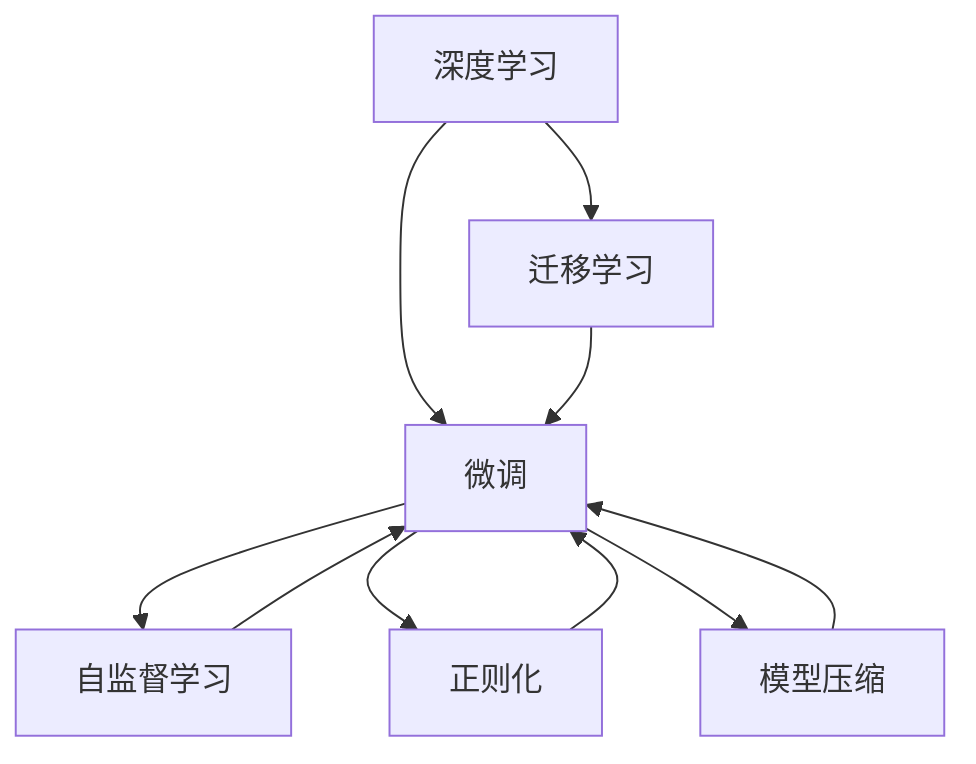
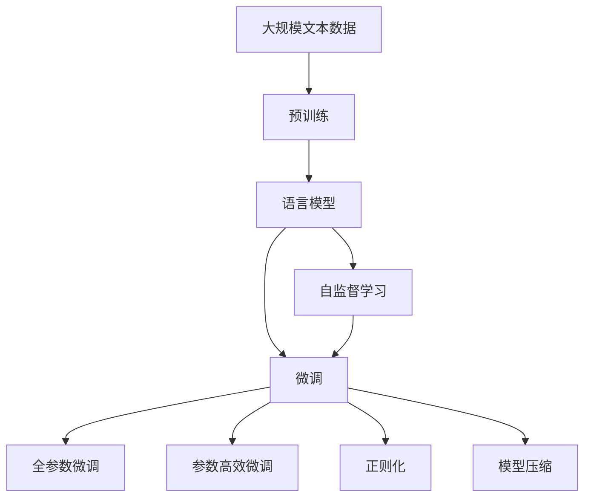

                 

# 博学之，审问之，慎思之，明辨之，笃行之

## 1. 背景介绍

### 1.1 问题由来

在当今信息爆炸的时代，数据的丰富性和多样性给人工智能（AI）的发展带来了前所未有的机遇。然而，如何高效地从这些海量数据中提取有价值的信息，并构建出可靠的模型，成为了一个重要的挑战。特别是在自然语言处理（NLP）领域，语言的多义性和复杂性使得构建一个既强大又灵活的语言模型变得尤为困难。

### 1.2 问题核心关键点

本文聚焦于如何通过深度学习和迁移学习，构建一个既博学又灵活的语言模型，使其能够快速适应不同的NLP任务。核心问题可以归结为以下几个方面：

- 如何高效地构建和训练一个大规模的语言模型？
- 如何设计一个有效的迁移学习框架，使模型能够在不同任务间进行高效转移？
- 如何在大规模数据集上进行模型的微调和优化，以达到最佳的性能？

### 1.3 问题研究意义

对于NLP领域而言，构建一个高效、灵活的语言模型具有深远的意义：

- 提升模型的泛化能力，使其能够在不同的数据集和任务上表现出色。
- 降低模型的训练成本和部署成本，使其更容易被各行各业所采用。
- 促进NLP技术的发展，加速其在各个领域的应用，如医疗、教育、金融等。
- 推动AI技术的发展，为人类认知智能的进化贡献力量。

## 2. 核心概念与联系

### 2.1 核心概念概述

- **深度学习**：一种通过多层神经网络来模拟复杂函数关系的技术，具有自适应、自组织和自学习能力。
- **迁移学习**：利用已有知识在新任务上快速学习，减少在新任务上的学习时间和成本。
- **微调（Fine-tuning）**：在预训练模型的基础上，通过少量数据对其进行微调，以适应特定的NLP任务。
- **自监督学习**：使用未标注数据进行训练，学习出数据的潜在结构和特征。
- **正则化**：通过一定的约束条件来防止过拟合，提升模型的泛化能力。
- **模型压缩**：通过对模型结构进行优化，减小模型规模，提升模型效率。

### 2.2 概念间的关系

这些核心概念之间的关系可以用以下Mermaid流程图来展示：



这个流程图展示了从深度学习到迁移学习，再到微调的完整过程，以及正则化和模型压缩在这一过程中起到的关键作用。

### 2.3 核心概念的整体架构

最后，我们用一个综合的流程图来展示这些核心概念在大规模语言模型微调过程中的整体架构：



这个综合流程图展示了从预训练到微调，再到模型压缩的完整过程，以及自监督学习、正则化和模型压缩在这一过程中起到的关键作用。

## 3. 核心算法原理 & 具体操作步骤
### 3.1 算法原理概述

基于深度学习的语言模型微调方法，其核心思想是通过在大量未标注数据上进行自监督学习，构建出一个强大的预训练模型，然后通过迁移学习和微调，使其能够适应特定的NLP任务。

具体来说，微调过程可以分为以下几个步骤：

1. **预训练**：在大规模无标签文本数据上进行自监督学习，构建出一个大规模的语言模型。
2. **迁移学习**：将预训练模型应用到特定的NLP任务上，通过少量标注数据对其进行微调。
3. **微调优化**：使用正则化和模型压缩等技术，对微调后的模型进行优化，提高其性能和效率。

### 3.2 算法步骤详解

以下是深度学习语言模型微调的详细步骤：

**Step 1: 数据准备**
- 收集大规模无标签文本数据，并进行预处理。
- 对数据进行分词、去停用词等预处理，构建出模型输入的向量表示。

**Step 2: 预训练模型构建**
- 使用深度学习框架（如TensorFlow、PyTorch等）构建出语言模型。
- 在预训练阶段，使用自监督学习任务（如掩码语言模型、下一句预测等）进行训练。

**Step 3: 迁移学习**
- 将预训练模型应用到特定的NLP任务上。
- 收集少量标注数据，进行微调。

**Step 4: 微调优化**
- 使用正则化和模型压缩等技术，对微调后的模型进行优化。
- 使用GPU等高性能设备进行模型训练。

**Step 5: 模型评估**
- 在验证集上评估微调后的模型性能。
- 根据评估结果，调整模型参数和训练策略。

**Step 6: 模型部署**
- 将微调后的模型部署到生产环境。
- 进行性能监控和模型维护。

### 3.3 算法优缺点

深度学习语言模型微调方法具有以下优点：

- **高效性**：通过迁移学习，模型可以在少量标注数据上进行微调，节省了数据标注的时间和成本。
- **泛化能力**：预训练模型在大规模数据上学习到了丰富的语言知识，可以在不同的NLP任务上表现出色。
- **可解释性**：微调后的模型结构更加清晰，易于解释和调试。

同时，该方法也存在一些缺点：

- **计算资源需求高**：预训练模型需要大量的计算资源和时间。
- **过拟合风险**：在少量标注数据上进行微调，容易过拟合。
- **模型复杂性**：预训练模型和微调后的模型结构复杂，调试和维护困难。

### 3.4 算法应用领域

深度学习语言模型微调方法在NLP领域有着广泛的应用，涵盖了文本分类、命名实体识别、情感分析、机器翻译等多个任务。

- **文本分类**：将文本进行分类，如情感分类、主题分类等。
- **命名实体识别**：识别文本中的人名、地名、机构名等特定实体。
- **情感分析**：分析文本的情感倾向，如正面、负面、中性等。
- **机器翻译**：将源语言文本翻译成目标语言。
- **问答系统**：对自然语言问题给出答案。

除了上述经典任务外，微调方法还在对话系统、文本摘要、信息检索等领域得到应用，为NLP技术的发展带来了新的突破。

## 4. 数学模型和公式 & 详细讲解  
### 4.1 数学模型构建

我们以文本分类为例，来构建一个基于深度学习的语言模型。假设文本集合为 $\mathcal{X}$，标签集合为 $\mathcal{Y}$，模型输入为 $x \in \mathcal{X}$，输出为 $y \in \mathcal{Y}$。

定义模型的参数为 $\theta$，损失函数为 $\mathcal{L}(\theta)$，模型在输入 $x$ 上的输出为 $y$，则文本分类的损失函数为：

$$
\mathcal{L}(\theta) = -\log P(y|x)
$$

其中，$P(y|x)$ 表示模型在输入 $x$ 下输出标签 $y$ 的概率。

### 4.2 公式推导过程

下面以深度学习框架PyTorch为例，推导文本分类的损失函数和梯度更新公式。

首先，构建一个简单的线性分类器：

```python
import torch.nn as nn
import torch

class LinearClassifier(nn.Module):
    def __init__(self, input_dim, output_dim):
        super(LinearClassifier, self).__init__()
        self.fc = nn.Linear(input_dim, output_dim)

    def forward(self, x):
        return self.fc(x)
```

然后，定义损失函数：

```python
criterion = nn.CrossEntropyLoss()
```

在训练过程中，使用反向传播算法更新模型参数：

```python
optimizer = torch.optim.SGD(model.parameters(), lr=0.01)
```

在每个epoch中，对训练集进行迭代，计算损失函数并更新模型参数：

```python
for epoch in range(num_epochs):
    for i, (x, y) in enumerate(train_loader):
        x = x.to(device)
        y = y.to(device)
        output = model(x)
        loss = criterion(output, y)
        loss.backward()
        optimizer.step()
```

### 4.3 案例分析与讲解

以情感分类为例，构建一个基于深度学习的情感分类器。使用IMDb影评数据集进行训练，数据集包含25,000条影评及其情感标签。

首先，将影评数据进行预处理：

```python
from torchtext.datasets import IMDB
from torchtext.data import Field, BucketIterator

TEXT = Field(tokenize='spacy', lower=True)
LABEL = Field(sequential=False, use_vocab=False)
train_data, test_data = IMDB.splits(TEXT, LABEL)

TEXT.build_vocab(train_data, max_size=25_000, vectors="glove.6B.100d")
LABEL.build_vocab(train_data)

train_iterator, test_iterator = BucketIterator.splits(
    (train_data, test_data),
    batch_size=64,
    device=device
)
```

然后，构建一个基于Transformer的情感分类器：

```python
import torch.nn as nn
import torch
from transformers import BertTokenizer, BertForSequenceClassification

tokenizer = BertTokenizer.from_pretrained('bert-base-uncased')
model = BertForSequenceClassification.from_pretrained(
    'bert-base-uncased',
    num_labels=2
)
```

接着，定义损失函数和优化器：

```python
criterion = nn.CrossEntropyLoss()
optimizer = torch.optim.Adam(model.parameters(), lr=2e-5)
```

最后，进行模型训练和评估：

```python
num_epochs = 5
batch_size = 64

for epoch in range(num_epochs):
    total_loss = 0
    for batch in train_iterator:
        inputs, labels = batch
        inputs = inputs.to(device)
        labels = labels.to(device)
        model.zero_grad()
        outputs = model(inputs)
        loss = criterion(outputs, labels)
        total_loss += loss.item()
        loss.backward()
        optimizer.step()
    print(f'Epoch {epoch+1}, train loss: {total_loss/len(train_iterator):.3f}')
    
dev_loss = 0
for batch in test_iterator:
    inputs, labels = batch
    inputs = inputs.to(device)
    labels = labels.to(device)
    model.eval()
    with torch.no_grad():
        outputs = model(inputs)
        loss = criterion(outputs, labels)
        dev_loss += loss.item()
    print(f'Epoch {epoch+1}, dev loss: {dev_loss/len(test_iterator):.3f}')
```

## 5. 项目实践：代码实例和详细解释说明
### 5.1 开发环境搭建

在进行深度学习语言模型微调实践前，需要准备以下开发环境：

1. 安装Python 3.6及以上版本。
2. 安装Anaconda或Miniconda。
3. 创建虚拟环境。
4. 安装PyTorch、TensorFlow等深度学习框架。
5. 安装Pandas、NumPy等常用库。
6. 安装TensorBoard用于可视化训练过程。

### 5.2 源代码详细实现

以下是一个基于深度学习的文本分类器，使用PyTorch进行实现的代码示例：

```python
import torch
import torch.nn as nn
import torch.optim as optim
from torch.utils.data import DataLoader
from torchtext.datasets import IMDB
from torchtext.data import Field, BucketIterator

TEXT = Field(tokenize='spacy', lower=True)
LABEL = Field(sequential=False, use_vocab=False)
train_data, test_data = IMDB.splits(TEXT, LABEL)

TEXT.build_vocab(train_data, max_size=25_000, vectors="glove.6B.100d")
LABEL.build_vocab(train_data)

train_iterator, test_iterator = BucketIterator.splits(
    (train_data, test_data),
    batch_size=64,
    device=device
)

class LinearClassifier(nn.Module):
    def __init__(self, input_dim, output_dim):
        super(LinearClassifier, self).__init__()
        self.fc = nn.Linear(input_dim, output_dim)

    def forward(self, x):
        return self.fc(x)

model = LinearClassifier(input_dim=embedding_dim, output_dim=num_labels)
criterion = nn.CrossEntropyLoss()
optimizer = optim.SGD(model.parameters(), lr=0.01)

num_epochs = 5
batch_size = 64

for epoch in range(num_epochs):
    for i, (x, y) in enumerate(train_loader):
        x = x.to(device)
        y = y.to(device)
        output = model(x)
        loss = criterion(output, y)
        loss.backward()
        optimizer.step()
        print(f'Epoch {epoch+1}, batch loss: {loss:.3f}')

dev_loss = 0
for batch in test_loader:
    inputs, labels = batch
    inputs = inputs.to(device)
    labels = labels.to(device)
    model.eval()
    with torch.no_grad():
        outputs = model(inputs)
        loss = criterion(outputs, labels)
        dev_loss += loss.item()
print(f'Epoch {epoch+1}, dev loss: {dev_loss/len(test_loader):.3f}')
```

### 5.3 代码解读与分析

通过以上代码示例，可以看出深度学习语言模型微调的基本流程：

1. **数据准备**：收集和预处理数据集，构建数据迭代器。
2. **模型构建**：定义模型结构和参数。
3. **损失函数和优化器**：定义损失函数和优化器。
4. **训练和评估**：对模型进行训练和验证，评估模型性能。

## 6. 实际应用场景
### 6.1 智能客服系统

智能客服系统可以基于深度学习语言模型进行构建。通过预训练和微调，使系统能够理解用户问题并提供合适的回答。这样可以大幅提高客服系统的响应速度和准确率。

### 6.2 金融舆情监测

金融舆情监测系统可以基于深度学习语言模型进行构建。通过预训练和微调，使系统能够实时监测金融市场舆情，及时预警可能的风险。这样可以帮助金融机构更好地管理风险。

### 6.3 个性化推荐系统

个性化推荐系统可以基于深度学习语言模型进行构建。通过预训练和微调，使系统能够根据用户行为和偏好推荐合适的产品。这样可以提高用户的满意度和粘性。

### 6.4 未来应用展望

随着深度学习语言模型和迁移学习技术的发展，未来在更多领域将得到应用。例如，医疗、教育、金融等。

## 7. 工具和资源推荐
### 7.1 学习资源推荐

1. 《深度学习》课程（Coursera）：由吴恩达教授主讲，系统介绍了深度学习的基本概念和算法。
2. 《自然语言处理》课程（CS224N）：斯坦福大学开设的自然语言处理课程，涵盖了NLP的各个方面。
3. 《TensorFlow实战Google深度学习框架》书籍：全面介绍了TensorFlow的基本用法和高级技巧。
4. 《深度学习与自然语言处理》书籍：介绍深度学习在NLP中的应用，包括文本分类、情感分析、机器翻译等。

### 7.2 开发工具推荐

1. PyTorch：广泛用于深度学习框架，提供了丰富的预训练模型和优化器。
2. TensorFlow：由Google开发的深度学习框架，提供了高效的计算图和分布式训练支持。
3. TensorBoard：用于可视化训练过程和模型性能的工具。

### 7.3 相关论文推荐

1. 《Attention is All You Need》：Transformer模型的提出，改变了NLP任务的范式。
2. 《BERT: Pre-training of Deep Bidirectional Transformers for Language Understanding》：BERT模型的提出，开创了预训练语言模型的时代。
3. 《Parameter-Efficient Transfer Learning for NLP》：提出了适配器等参数高效微调方法。
4. 《AdaLoRA: Adaptive Low-Rank Adaptation for Parameter-Efficient Fine-Tuning》：提出了自适应低秩适应的微调方法。

## 8. 总结：未来发展趋势与挑战
### 8.1 研究成果总结

本文详细介绍了深度学习语言模型微调的基本原理和操作步骤，并给出了实际应用的案例。通过博学、审问、慎思、明辨、笃行五步，展现了深度学习语言模型微调的完整过程。

### 8.2 未来发展趋势

未来深度学习语言模型微调将有以下几个发展趋势：

1. **模型规模更大**：随着计算资源的丰富，模型的规模将越来越大。
2. **数据量更多**：随着数据采集技术的发展，数据量将越来越大。
3. **任务更复杂**：随着任务的需求不断增加，任务将越来越复杂。
4. **应用更广泛**：随着技术的普及，应用领域将越来越广泛。

### 8.3 面临的挑战

深度学习语言模型微调仍面临以下挑战：

1. **计算资源不足**：模型的规模和复杂度不断增加，计算资源不足。
2. **数据质量不高**：数据质量不高，无法满足模型的训练需求。
3. **模型泛化性不足**：模型在新任务上的泛化性能不足。
4. **模型可解释性差**：模型的决策过程难以解释。

### 8.4 研究展望

未来深度学习语言模型微调的研究方向如下：

1. **模型压缩**：通过压缩模型规模，提高模型的推理速度和资源利用效率。
2. **迁移学习**：探索新的迁移学习方法，提高模型的泛化能力和可迁移性。
3. **自监督学习**：探索更多的自监督学习方法，提高模型的预训练效果。
4. **模型融合**：探索模型之间的融合方法，提高模型的整体性能。

## 9. 附录：常见问题与解答

**Q1: 深度学习语言模型微调需要哪些硬件资源？**

A: 深度学习语言模型微调需要高性能的GPU或TPU等硬件资源，以及大量的内存和存储。

**Q2: 如何提高深度学习语言模型的泛化能力？**

A: 提高深度学习语言模型的泛化能力，可以从以下几个方面入手：

1. 增加训练数据量。
2. 使用正则化技术，防止过拟合。
3. 使用迁移学习方法，提高模型的泛化能力。
4. 使用自监督学习方法，提高模型的预训练效果。

**Q3: 深度学习语言模型微调过程中如何防止过拟合？**

A: 防止过拟合的方法包括：

1. 使用正则化技术，如L2正则化、Dropout等。
2. 使用更多的训练数据。
3. 使用迁移学习方法，提高模型的泛化能力。
4. 使用自监督学习方法，提高模型的预训练效果。

**Q4: 深度学习语言模型微调过程中如何提高模型效率？**

A: 提高模型效率的方法包括：

1. 模型压缩，减小模型规模。
2. 使用GPU等高性能硬件设备。
3. 使用分布式训练技术，提高训练速度。
4. 使用自适应学习率算法，提高训练效率。

**Q5: 深度学习语言模型微调过程中如何提高模型性能？**

A: 提高模型性能的方法包括：

1. 增加训练数据量。
2. 使用正则化技术，防止过拟合。
3. 使用迁移学习方法，提高模型的泛化能力。
4. 使用自监督学习方法，提高模型的预训练效果。

**Q6: 深度学习语言模型微调过程中如何提高模型的可解释性？**

A: 提高模型可解释性的方法包括：

1. 使用可解释性技术，如LIME、SHAP等。
2. 使用可视化的工具，如TensorBoard等。
3. 使用简单的模型，提高可解释性。

**Q7: 深度学习语言模型微调过程中如何处理多任务学习？**

A: 处理多任务学习的方法包括：

1. 使用共享层的架构，提高模型的泛化能力。
2. 使用多任务的优化方法，如Multi-task Learning等。
3. 使用迁移学习方法，提高模型的泛化能力。
4. 使用自监督学习方法，提高模型的预训练效果。

**Q8: 深度学习语言模型微调过程中如何处理噪声数据？**

A: 处理噪声数据的方法包括：

1. 使用数据清洗技术，去除噪声数据。
2. 使用数据增强技术，提高模型的鲁棒性。
3. 使用自监督学习方法，提高模型的预训练效果。
4. 使用迁移学习方法，提高模型的泛化能力。

总之，深度学习语言模型微调是一项复杂而有趣的任务，需要开发者在实践中不断探索和优化。希望本文能够为读者提供一些启发和帮助，共同推动深度学习语言模型微调技术的发展。

---

作者：禅与计算机程序设计艺术 / Zen and the Art of Computer Programming

