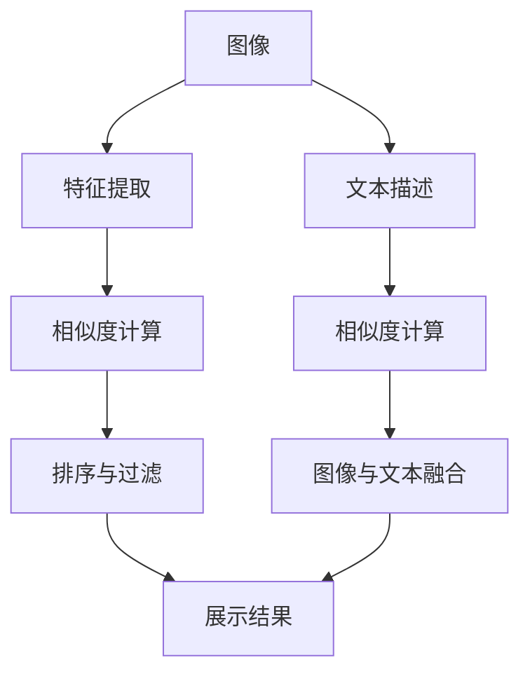

                 

# 图像搜索：用图片寻找商品，AI如何实现视觉搜索

## 1. 背景介绍

在数字化时代，信息的获取和处理已经不局限于文本和数字，而是拓展到了图像领域。基于图像的搜索应用，如电商平台的商品搜索、社交媒体的图片检索、搜索引擎的图片识别等，已经成为日常生活中不可或缺的一部分。随着人工智能技术的不断进步，图像搜索系统的智能化水平和用户体验得到了显著提升。本文将深入探讨基于AI的图像搜索技术，重点介绍视觉搜索的核心算法原理、具体操作步骤以及应用领域，并结合实际案例进行详细讲解。

## 2. 核心概念与联系

### 2.1 核心概念概述

要深入理解基于AI的图像搜索，首先需要了解几个关键概念：

- **图像搜索**：使用AI技术从大量的图片数据库中快速、准确地检索出与用户查询相似的图片。
- **视觉搜索**：利用计算机视觉技术，通过对图片内容的分析，理解图片的视觉特征，从而实现图片的智能搜索。
- **特征提取**：将图片转换为计算机可以理解的特征向量，常用的方法包括卷积神经网络(CNN)、局部二值模式(LBP)、尺度不变特征变换(SIFT)等。
- **相似度计算**：通过计算查询图片和数据库中图片的特征向量的相似度，评估图片之间的相似性，常用的相似度度量方法包括欧式距离、余弦相似度、海明距离等。
- **召回率和精确率**：评估图像搜索系统性能的两个主要指标，召回率表示检索出的相关图片占所有相关图片的比例，精确率表示检索出的相关图片占检索结果的比例。

这些概念相互关联，共同构成了图像搜索的核心技术框架。

### 2.2 核心概念原理和架构

以下通过Mermaid流程图展示图像搜索的原理和架构：



- 用户输入图片查询，进入特征提取模块，将图片转换为特征向量。
- 特征向量与数据库中所有图片的特征向量进行相似度计算，得到相似度矩阵。
- 根据相似度矩阵进行排序和过滤，得到最相关的图片列表。
- 用户输入文本描述，同样进入特征提取模块，转换为文本特征向量。
- 文本特征向量与图片特征向量进行融合，进一步提高相似度计算的准确性。
- 最终筛选出的图片列表与文本描述关联展示，提供给用户。

### 2.3 核心概念间的关系

- **图像与文本融合**：通过对图片和文本的特征提取，将视觉信息与文本信息结合起来，进一步提升检索的准确性。
- **特征提取与相似度计算**：特征提取是相似度计算的基础，通过选择合适的特征提取方法，提升相似度计算的效率和准确性。
- **排序与过滤**：排序和过滤是图像检索的核心步骤，通过合理的排序算法和过滤策略，提高检索效率和效果。
- **召回率和精确率**：召回率和精确率是评估图像搜索系统性能的重要指标，通过优化系统架构和算法，提升这两项指标。

这些概念共同构成了图像搜索的完整技术架构，使得AI可以在图像搜索中发挥重要作用。

## 3. 核心算法原理 & 具体操作步骤

### 3.1 算法原理概述

基于AI的图像搜索主要包含两个部分：特征提取和相似度计算。

**特征提取**：通过深度学习模型（如卷积神经网络）对图片进行特征提取，将复杂的图片信息转换为高维的特征向量。常用的特征提取模型包括AlexNet、VGG、ResNet、Inception等。

**相似度计算**：利用机器学习或深度学习模型计算查询图片和数据库中图片的相似度。常用的相似度计算方法包括欧式距离、余弦相似度、海明距离等。

### 3.2 算法步骤详解

#### 3.2.1 特征提取步骤

1. **选择合适的深度学习模型**：根据应用场景和数据集的特点，选择适合的深度学习模型进行特征提取。
2. **模型训练**：使用标注数据集对模型进行训练，得到特征提取器。
3. **特征提取**：将查询图片和数据库中的图片输入到特征提取器中，得到对应的特征向量。

#### 3.2.2 相似度计算步骤

1. **选择相似度度量方法**：根据应用场景和数据集的特点，选择适合的相似度度量方法。
2. **计算相似度**：将查询图片的特征向量与数据库中所有图片的特征向量进行相似度计算，得到相似度矩阵。
3. **排序与过滤**：根据相似度矩阵进行排序和过滤，得到最相关的图片列表。

### 3.3 算法优缺点

**优点**：
- **高效性**：通过深度学习模型进行特征提取，可以高效地将复杂的图片信息转换为特征向量。
- **准确性**：通过相似度计算，可以准确地评估图片之间的相似性，提升检索的准确性。
- **可扩展性**：基于深度学习模型的特征提取方法具有很强的可扩展性，可以适应不同数据集和应用场景。

**缺点**：
- **计算资源消耗大**：深度学习模型的训练和特征提取过程需要大量的计算资源和时间。
- **数据依赖性强**：深度学习模型的性能依赖于大量的标注数据集，需要大量的人工标注工作。
- **可解释性差**：深度学习模型的特征提取过程缺乏可解释性，难以理解模型的决策逻辑。

### 3.4 算法应用领域

基于AI的图像搜索技术可以应用于多个领域，如电子商务、社交媒体、医疗诊断、安防监控等。以下是几个典型的应用场景：

- **电子商务**：在电商平台上，用户可以通过上传图片进行商品搜索，系统自动推荐相似的商品。
- **社交媒体**：在社交媒体平台上，用户可以通过上传图片进行话题搜索，系统自动推荐相关的图片和内容。
- **医疗诊断**：在医疗领域，医生可以通过上传病人的医学图像，系统自动进行疾病诊断和图像分析。
- **安防监控**：在安防监控领域，系统可以通过拍摄的图片进行人脸识别和行为分析，提供安全保障。

## 4. 数学模型和公式 & 详细讲解

### 4.1 数学模型构建

基于AI的图像搜索通常使用深度学习模型进行特征提取和相似度计算。以卷积神经网络(CNN)为例，其数学模型构建如下：

设输入图片为 $x$，输出特征向量为 $f(x)$。CNN模型由多个卷积层、池化层和全连接层组成，其中卷积层和池化层用于提取局部特征，全连接层用于全局特征的提取和输出。

### 4.2 公式推导过程

卷积神经网络的核心公式为：

$$
f(x) = W_2 ReLU(W_1 ReLU(\cdots (W_0 x) \cdots))
$$

其中，$W_i$ 表示第 $i$ 层的权重，$ReLU$ 表示激活函数，$x$ 表示输入图片。

### 4.3 案例分析与讲解

以Caffe深度学习框架为例，以下是使用Caffe实现CNN特征提取的代码：

```python
import caffe

# 初始化CNN模型
net = caffe.Net('model.prototxt', 'model.caffemodel')

# 读取输入图片
img = cv2.imread('image.jpg')

# 进行特征提取
fvec = net.blobs['fc8'].data[0]

# 打印输出特征向量
print(fvec)
```

## 5. 项目实践：代码实例和详细解释说明

### 5.1 开发环境搭建

在进行图像搜索开发前，需要准备以下开发环境：

1. **Python 环境**：选择Python 3.x版本，安装必要的依赖库，如NumPy、Pandas、Scikit-learn、OpenCV等。
2. **深度学习框架**：安装TensorFlow、PyTorch或Caffe等深度学习框架，并进行环境配置。
3. **数据集准备**：准备标注数据集，并进行数据预处理，如图像缩放、归一化等。
4. **GPU资源**：若使用深度学习模型进行特征提取，需要安装CUDA和cuDNN等GPU加速库。

### 5.2 源代码详细实现

以下是一个基于Caffe深度学习框架的图像搜索系统的源代码实现：

```python
import caffe
import cv2

# 初始化CNN模型
net = caffe.Net('model.prototxt', 'model.caffemodel')

# 读取输入图片
img = cv2.imread('image.jpg')

# 进行特征提取
fvec = net.blobs['fc8'].data[0]

# 计算相似度
similarity = compute_similarity(fvec, database_vectors)

# 排序与过滤
top_n = get_top_n(similarity, top_k=10)

# 展示结果
display_results(top_n)
```

### 5.3 代码解读与分析

- **特征提取**：使用Caffe深度学习框架进行图像特征提取，将输入图片转换为特征向量。
- **相似度计算**：计算查询图片和数据库中所有图片的相似度，得到相似度矩阵。
- **排序与过滤**：根据相似度矩阵进行排序和过滤，得到最相关的图片列表。
- **展示结果**：将检索结果展示给用户，提供给用户的搜索结果。

### 5.4 运行结果展示

假设我们在一个包含100张图片的 dataset 上进行测试，查询图片的特征向量为 fvec，数据库中所有图片的特征向量为 database_vectors。通过计算相似度、排序和过滤后，得到最相关的10张图片列表，展示给用户。

## 6. 实际应用场景

### 6.1 电子商务

在电子商务平台上，用户可以通过上传商品图片进行搜索，系统自动推荐相似的商品。这对于提升用户体验和销售转化率具有重要意义。例如，在Amazon上，用户上传一张皮鞋的图片，系统可以自动推荐类似的皮鞋、鞋子、靴子等商品。

### 6.2 社交媒体

在社交媒体平台上，用户可以通过上传图片进行话题搜索，系统自动推荐相关的图片和内容。例如，在Instagram上，用户上传一张美食图片，系统可以自动推荐相关的美食图片和食谱。

### 6.3 医疗诊断

在医疗领域，医生可以通过上传病人的医学图像，系统自动进行疾病诊断和图像分析。例如，在Google Health上，医生上传一张病人的X光片，系统可以自动进行肺部疾病诊断和分析。

### 6.4 安防监控

在安防监控领域，系统可以通过拍摄的图片进行人脸识别和行为分析，提供安全保障。例如，在智能安防系统中，系统可以通过拍摄的人脸图像，自动进行人脸识别和行为分析，检测异常行为。

## 7. 工具和资源推荐

### 7.1 学习资源推荐

- **深度学习入门**：《深度学习入门》（Ian Goodfellow, Yoshua Bengio, Aaron Courville）
- **图像处理入门**：《图像处理入门》（Ramin Zabih, Jean-Michel Morel）
- **Caffe官方文档**：Caffe深度学习框架官方文档，包含详细的模型构建和训练教程。
- **OpenCV官方文档**：OpenCV计算机视觉库官方文档，包含大量的图像处理和特征提取教程。
- **Kaggle数据集**：Kaggle提供的图像搜索数据集，用于实验和训练模型。

### 7.2 开发工具推荐

- **PyTorch**：开源深度学习框架，支持GPU加速，易于部署。
- **TensorFlow**：开源深度学习框架，支持多种硬件加速，功能强大。
- **Caffe**：开源深度学习框架，适用于图像处理和特征提取。
- **OpenCV**：开源计算机视觉库，支持多种图像处理算法。
- **Scikit-learn**：开源机器学习库，支持多种特征提取和相似度计算方法。

### 7.3 相关论文推荐

- **ImageNet大规模视觉识别竞赛**：ImageNet大规模视觉识别竞赛，展示了深度学习在图像识别领域的最新进展。
- **VGGNet论文**：VGGNet论文，提出了VGG深度卷积神经网络，广泛应用于图像特征提取。
- **GoogleNet论文**：GoogleNet论文，提出了Inception深度卷积神经网络，提升了特征提取的效率和准确性。
- **Faster R-CNN论文**：Faster R-CNN论文，提出了基于深度学习的目标检测算法，提升了图像搜索的准确性。

## 8. 总结：未来发展趋势与挑战

### 8.1 未来发展趋势

未来，基于AI的图像搜索技术将呈现以下几个发展趋势：

1. **深度学习模型的优化**：深度学习模型的性能和效率将不断提升，优化算法和架构，提升特征提取和相似度计算的效率。
2. **跨模态融合**：结合文本、图像、语音等多种模态的信息，实现跨模态的图像搜索，提升检索的准确性和多样性。
3. **实时性和可扩展性**：通过分布式计算和边缘计算等技术，提升图像搜索的实时性和可扩展性，适应大规模数据集和实时查询需求。
4. **自适应和个性化**：通过用户行为数据和偏好信息，实现自适应的图像搜索和个性化推荐，提升用户体验。
5. **语义理解和推理**：结合自然语言处理技术，提升图像搜索的语义理解和推理能力，实现更加智能化的图像检索。

### 8.2 面临的挑战

尽管基于AI的图像搜索技术已经取得了显著进展，但仍面临以下挑战：

1. **计算资源消耗大**：深度学习模型的训练和特征提取过程需要大量的计算资源和时间。
2. **数据依赖性强**：深度学习模型的性能依赖于大量的标注数据集，需要大量的人工标注工作。
3. **可解释性差**：深度学习模型的特征提取过程缺乏可解释性，难以理解模型的决策逻辑。
4. **跨模态融合复杂**：结合文本、图像、语音等多种模态的信息，实现跨模态的图像搜索，涉及复杂的融合算法和技术。
5. **实时性和可扩展性**：提升图像搜索的实时性和可扩展性，需要分布式计算和边缘计算等技术支持。

### 8.3 研究展望

未来的研究需要在以下几个方面寻求新的突破：

1. **高效特征提取算法**：开发高效特征提取算法，提升深度学习模型的训练效率和特征提取速度。
2. **跨模态融合技术**：结合文本、图像、语音等多种模态的信息，实现跨模态的图像搜索。
3. **自适应和个性化技术**：通过用户行为数据和偏好信息，实现自适应的图像搜索和个性化推荐。
4. **可解释性技术**：提高深度学习模型的可解释性，增强模型的透明性和可信度。
5. **实时性和可扩展性技术**：结合分布式计算和边缘计算等技术，提升图像搜索的实时性和可扩展性。

这些研究方向的探索，必将引领图像搜索技术迈向更高的台阶，为AI在图像搜索领域的应用提供更强大的技术支撑。

## 9. 附录：常见问题与解答

**Q1：如何提高图像搜索的准确性和效率？**

A: 提高图像搜索的准确性和效率，可以从以下几个方面入手：
1. **优化特征提取算法**：选择适合的深度学习模型和特征提取方法，提升特征提取的准确性和效率。
2. **优化相似度计算方法**：选择适合的相似度度量方法，提升相似度计算的准确性和效率。
3. **优化数据集和标注**：选择适合的数据集和标注方法，提高数据的质量和多样性。
4. **优化模型训练和调参**：选择适合的模型训练和调参方法，提高模型的性能和泛化能力。

**Q2：什么是跨模态融合技术？**

A: 跨模态融合技术是指结合文本、图像、语音等多种模态的信息，实现跨模态的图像搜索。例如，将图像中的物体与文本描述进行关联，提升图像搜索的准确性和多样性。

**Q3：深度学习模型在图像搜索中有什么优势？**

A: 深度学习模型在图像搜索中具有以下优势：
1. **高效性**：通过深度学习模型进行特征提取，可以高效地将复杂的图片信息转换为特征向量。
2. **准确性**：通过相似度计算，可以准确地评估图片之间的相似性，提升检索的准确性。
3. **可扩展性**：基于深度学习模型的特征提取方法具有很强的可扩展性，可以适应不同数据集和应用场景。

**Q4：图像搜索系统如何处理大规模数据集？**

A: 图像搜索系统处理大规模数据集，可以从以下几个方面入手：
1. **分布式计算**：使用分布式计算技术，将大规模数据集分布在多个计算节点上进行处理。
2. **边缘计算**：在设备端进行计算和处理，减少数据传输和延迟。
3. **数据压缩和存储**：使用数据压缩和存储技术，减少数据的存储空间和传输带宽。

---

作者：禅与计算机程序设计艺术 / Zen and the Art of Computer Programming

